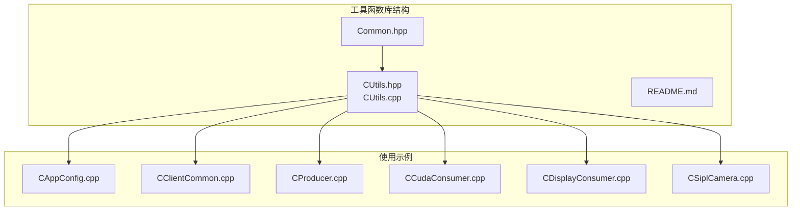
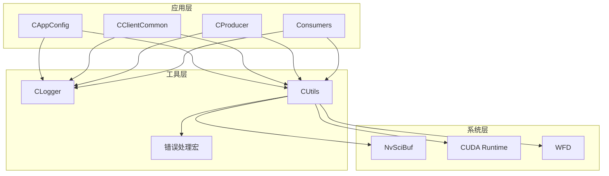
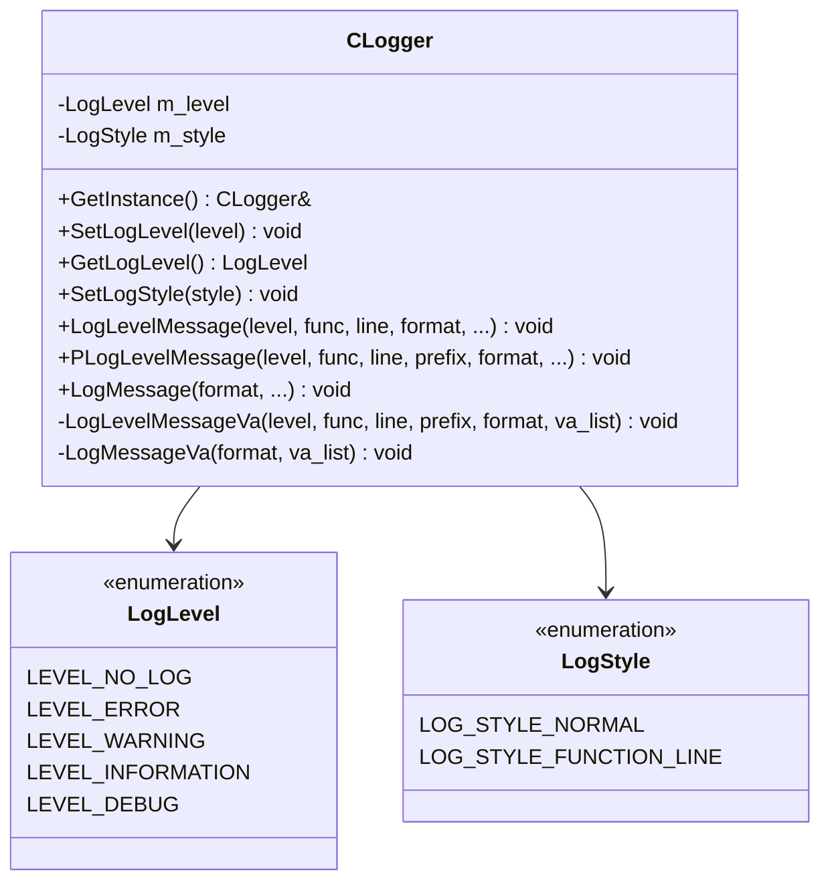
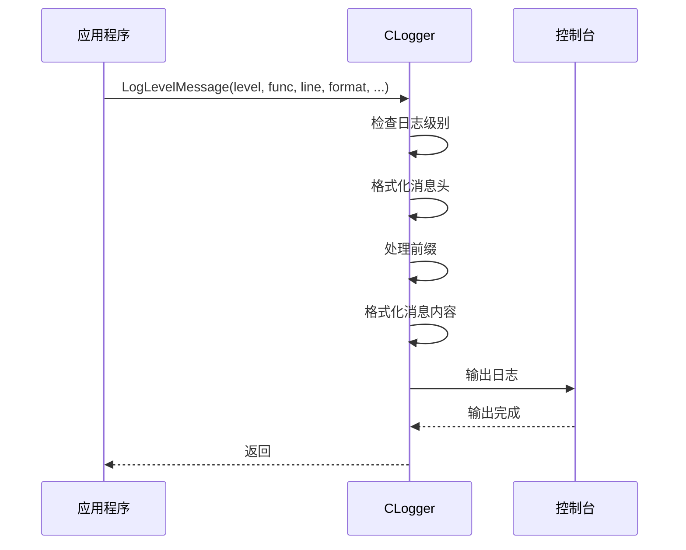
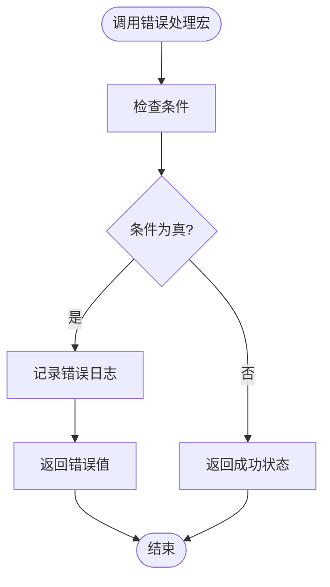
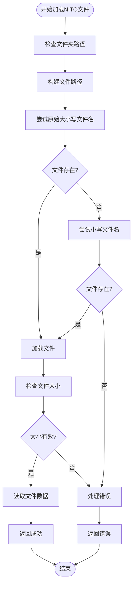
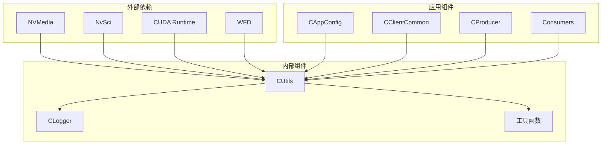

# 工具函数库

<cite>
**本文档引用的文件**
- [CUtils.hpp](file://CUtils.hpp)
- [CUtils.cpp](file://CUtils.cpp)
- [Common.hpp](file://Common.hpp)
- [README.md](file://README.md)
- [CAppConfig.cpp](file://CAppConfig.cpp)
- [CClientCommon.cpp](file://CClientCommon.cpp)
- [CProducer.cpp](file://CProducer.cpp)
- [CCudaConsumer.cpp](file://CCudaConsumer.cpp)
- [CDisplayConsumer.cpp](file://CDisplayConsumer.cpp)
- [CSiplCamera.cpp](file://CSiplCamera.cpp)
</cite>

## 目录
1. [简介](#简介)
2. [项目结构](#项目结构)
3. [核心组件](#核心组件)
4. [架构概览](#架构概览)
5. [详细组件分析](#详细组件分析)
6. [依赖关系分析](#依赖关系分析)
7. [性能考虑](#性能考虑)
8. [故障排除指南](#故障排除指南)
9. [结论](#结论)

## 简介

工具函数库是NVIDIA SIPL Multicast项目的核心基础设施，提供了统一的日志管理、错误处理、数据转换和系统操作功能。该库通过CUtils类及其相关宏定义，为整个多播系统提供了标准化的工具函数，确保代码的一致性和可维护性。

本库主要包含以下功能模块：
- **日志管理系统**：提供多级别的日志记录功能，支持普通日志和带前缀的日志
- **错误处理宏**：提供统一的错误检查和处理机制
- **数据转换工具**：处理NVIDIA SIPL相关的数据类型转换
- **缓冲区属性管理**：管理NvSciBuf对象的属性信息

## 项目结构

工具函数库位于multicast项目的根目录下，主要由以下文件组成：

**图表来源**
- [CUtils.hpp:1-311](file://CUtils.hpp#L1-L311)
- [CUtils.cpp:1-438](file://CUtils.cpp#L1-L438)

**章节来源**
- [CUtils.hpp:1-311](file://CUtils.hpp#L1-L311)
- [CUtils.cpp:1-438](file://CUtils.cpp#L1-L438)

## 核心组件

### 日志管理器（CLogger）

CLogger是一个单例类，提供统一的日志管理功能。它支持多种日志级别和样式，并且可以为不同类型的组件提供带前缀的日志输出。

#### 日志级别
- **LEVEL_NO_LOG**: 不输出日志
- **LEVEL_ERROR**: 错误级别日志
- **LEVEL_WARNING**: 警告级别日志
- **LEVEL_INFORMATION**: 信息级别日志
- **LEVEL_DEBUG**: 调试级别日志

#### 日志样式
- **LOG_STYLE_NORMAL**: 普通样式
- **LOG_STYLE_FUNCTION_LINE**: 包含函数名和行号的样式

**章节来源**
- [CUtils.hpp:175-276](file://CUtils.hpp#L175-L276)
- [CUtils.cpp:17-144](file://CUtils.cpp#L17-L144)

### 错误处理宏

工具库提供了丰富的错误处理宏，用于简化错误检查和处理流程：

#### 基础检查宏
- **CHK_PTR_AND_RETURN**: 检查指针是否为空
- **CHK_STATUS_AND_RETURN**: 检查状态码
- **CHK_NVMSTATUS_AND_RETURN**: 检查NVMedia状态
- **CHK_NVSCISTATUS_AND_RETURN**: 检查NvSci状态

#### 前缀检查宏
- **PCHK_PTR_AND_RETURN**: 带组件名称前缀的指针检查
- **PCHK_STATUS_AND_RETURN**: 带组件名称前缀的状态检查
- **PCHK_NVMSTATUS_AND_RETURN**: 带组件名称前缀的NVMedia状态检查

#### CUDA相关宏
- **CHK_CUDASTATUS_AND_RETURN**: 检查CUDA状态
- **CHK_CUDAERR_AND_RETURN**: 检查CUDA错误

#### WFD相关宏
- **CHECK_WFD_ERROR**: 检查WFD错误
- **PCHK_WFDSTATUS_AND_RETURN**: 带前缀的WFD状态检查

**章节来源**
- [CUtils.hpp:28-132](file://CUtils.hpp#L28-L132)

### 数据处理函数

#### NITO文件加载
`LoadNITOFile`函数负责从指定路径加载NITO配置文件，支持大小写不敏感的文件名匹配。

#### NvSciBuf属性转换
`NvSciBufAttrKeyToString`函数将NvSciBuf属性键转换为可读的字符串表示。

#### 缓冲区属性填充
`PopulateBufAttr`函数从NvSciBuf对象中提取所有相关的缓冲区属性信息。

**章节来源**
- [CUtils.cpp:145-208](file://CUtils.cpp#L145-L208)
- [CUtils.cpp:210-340](file://CUtils.cpp#L210-L340)
- [CUtils.cpp:363-437](file://CUtils.cpp#L363-L437)

## 架构概览

工具函数库采用分层架构设计，通过宏定义和函数封装提供统一的接口：

**图表来源**
- [CUtils.hpp:175-310](file://CUtils.hpp#L175-L310)
- [CAppConfig.cpp:25-75](file://CAppConfig.cpp#L25-L75)

## 详细组件分析

### CLogger类详细分析

CLogger类实现了完整的日志管理系统，具有以下特点：

#### 单例模式实现

**图表来源**
- [CUtils.hpp:175-276](file://CUtils.hpp#L175-L276)

#### 日志输出流程

**图表来源**
- [CUtils.cpp:38-100](file://CUtils.cpp#L38-L100)

**章节来源**
- [CUtils.cpp:17-144](file://CUtils.cpp#L17-L144)

### 错误处理宏系统

错误处理宏系统提供了统一的错误检查和处理机制：

#### 宏执行流程

**图表来源**
- [CUtils.hpp:28-132](file://CUtils.hpp#L28-L132)

#### 使用示例
在实际代码中，错误处理宏的使用方式如下：

**章节来源**
- [CUtils.hpp:28-132](file://CUtils.hpp#L28-L132)

### 数据处理组件

#### NITO文件处理流程

**图表来源**
- [CUtils.cpp:145-208](file://CUtils.cpp#L145-L208)

**章节来源**
- [CUtils.cpp:145-208](file://CUtils.cpp#L145-L208)

## 依赖关系分析

工具函数库与系统的其他组件存在紧密的依赖关系：

**图表来源**
- [CUtils.hpp:10-21](file://CUtils.hpp#L10-L21)
- [CUtils.hpp:175-310](file://CUtils.hpp#L175-L310)

**章节来源**
- [CUtils.hpp:10-21](file://CUtils.hpp#L10-L21)
- [Common.hpp:1-87](file://Common.hpp#L1-L87)

## 性能考虑

工具函数库在设计时充分考虑了性能因素：

### 日志性能优化
- **级别过滤**：在日志输出前进行级别检查，避免不必要的字符串格式化
- **缓冲区复用**：使用固定大小的字符缓冲区减少内存分配开销
- **条件编译**：调试日志在发布版本中被禁用

### 内存管理
- **静态实例**：CLogger使用静态局部变量确保单例模式的线程安全
- **零拷贝操作**：缓冲区属性复制使用memcpy避免额外的数据处理

### 错误处理效率
- **早期返回**：错误处理宏在检测到错误时立即返回，避免后续无效操作
- **批量检查**：支持一次性检查多个条件，减少重复的错误检查代码

## 故障排除指南

### 常见问题及解决方案

#### 日志输出异常
**问题**：日志无法正常输出或格式不正确
**解决方案**：
1. 检查日志级别设置是否正确
2. 验证日志样式配置
3. 确认控制台输出权限

#### 错误处理失效
**问题**：错误处理宏没有按预期工作
**解决方案**：
1. 检查宏定义是否正确包含在源文件中
2. 验证错误条件判断逻辑
3. 确认返回值类型匹配

#### NITO文件加载失败
**问题**：NITO文件无法加载或解析
**解决方案**：
1. 检查文件路径是否正确
2. 验证文件权限
3. 确认文件格式有效性

**章节来源**
- [CUtils.cpp:145-208](file://CUtils.cpp#L145-L208)
- [CUtils.cpp:363-437](file://CUtils.cpp#L363-L437)

## 结论

工具函数库作为NVIDIA SIPL Multicast项目的核心基础设施，提供了完整而高效的工具函数集合。通过统一的日志管理、标准化的错误处理和专业的数据转换功能，该库显著提高了代码的质量和可维护性。

### 主要优势
- **一致性**：统一的接口设计确保所有组件使用相同的工具函数
- **可靠性**：完善的错误处理机制提供可靠的运行保障
- **可扩展性**：模块化的架构便于功能扩展和维护
- **性能优化**：针对实时系统需求进行了专门的性能优化

### 应用场景
该工具函数库适用于需要高性能视频处理和多播通信的应用场景，特别是在嵌入式视觉系统和实时图像处理领域。