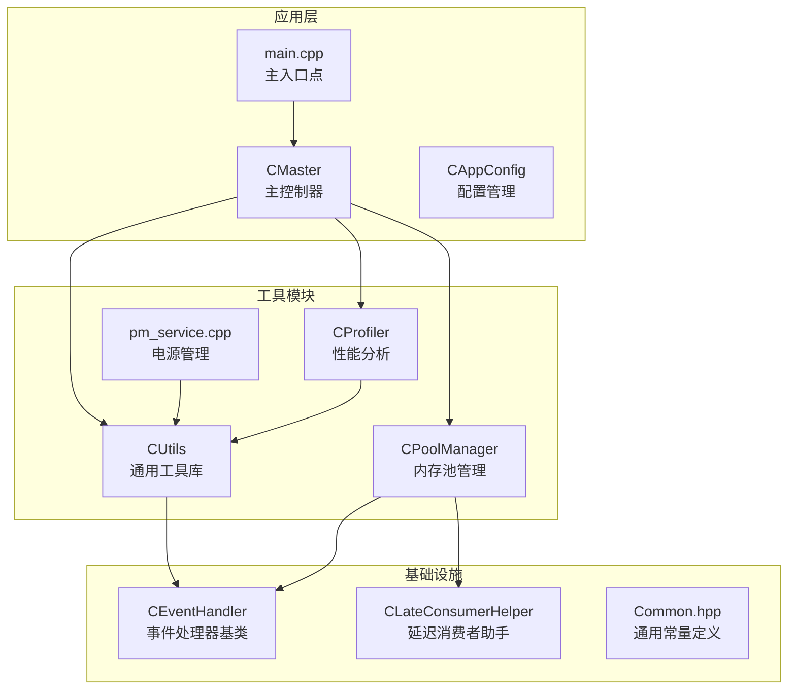
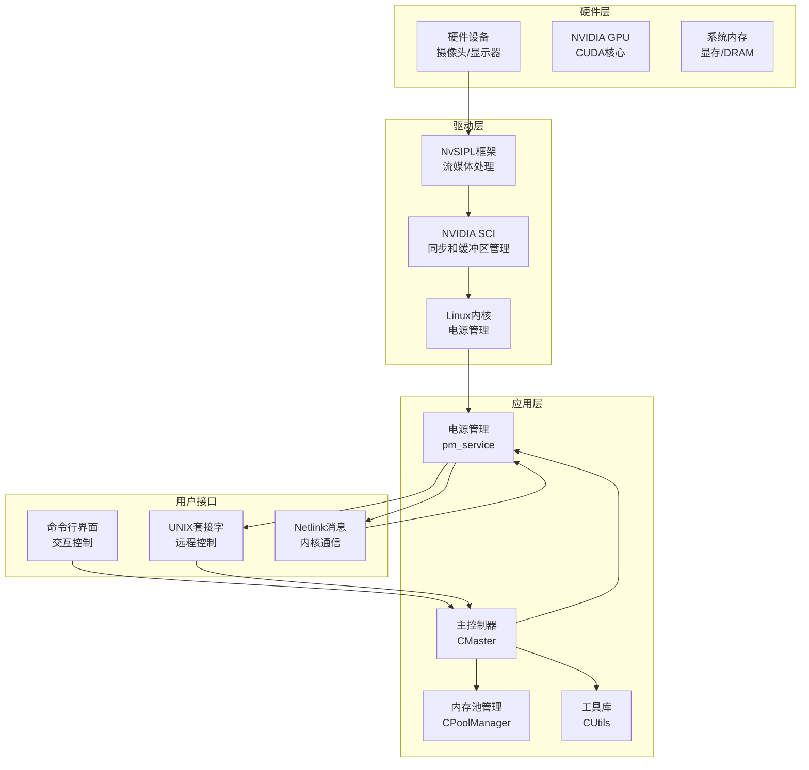
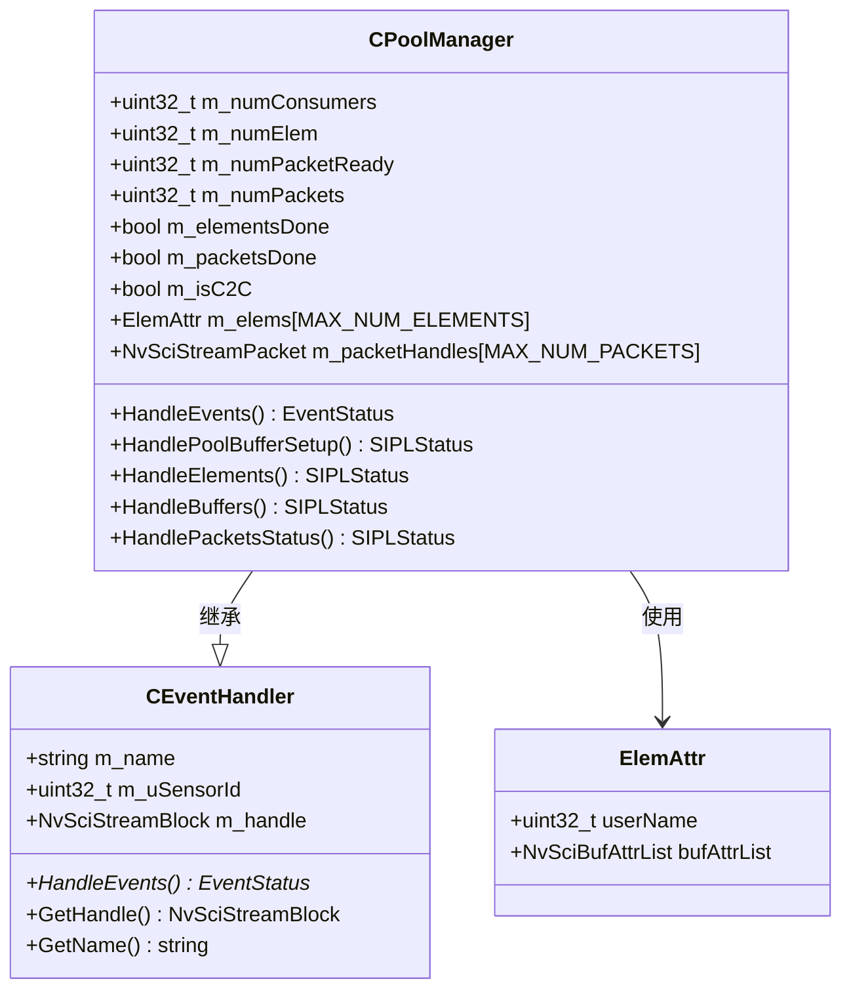
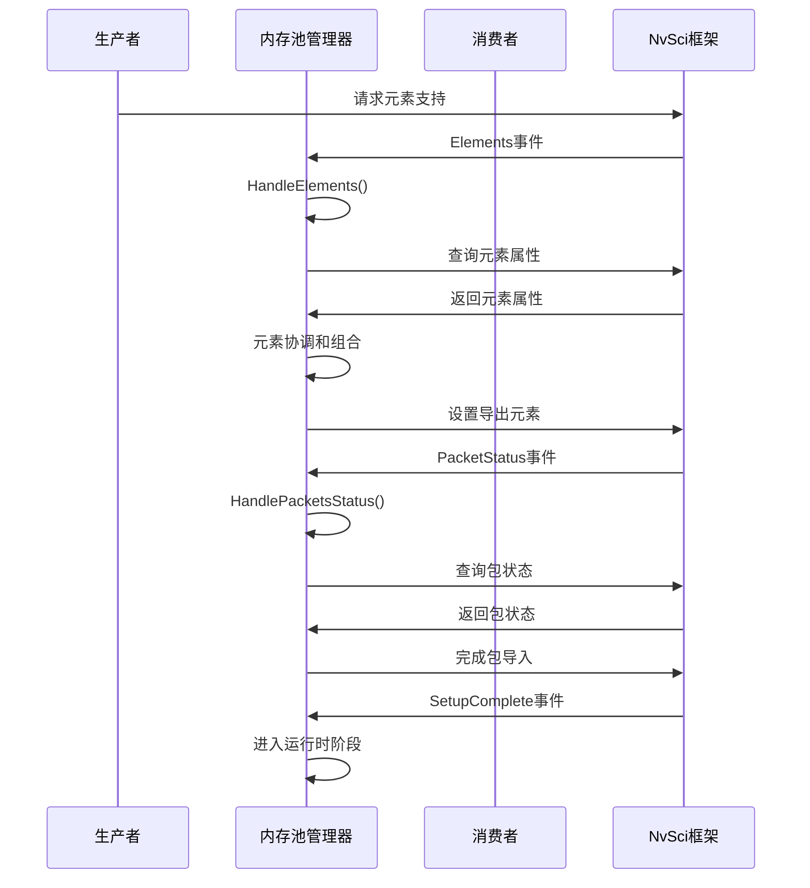
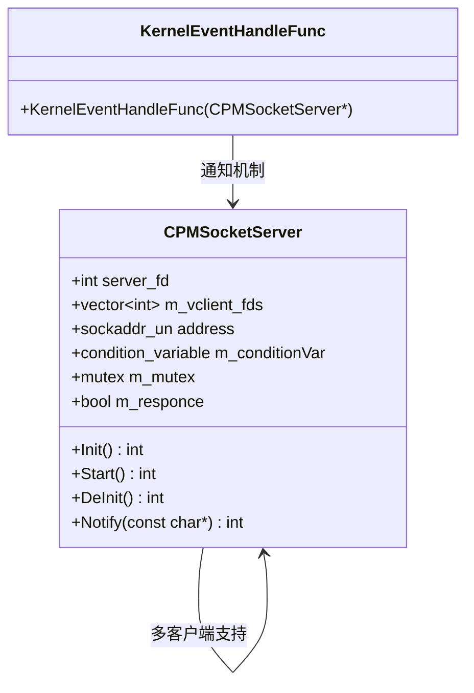
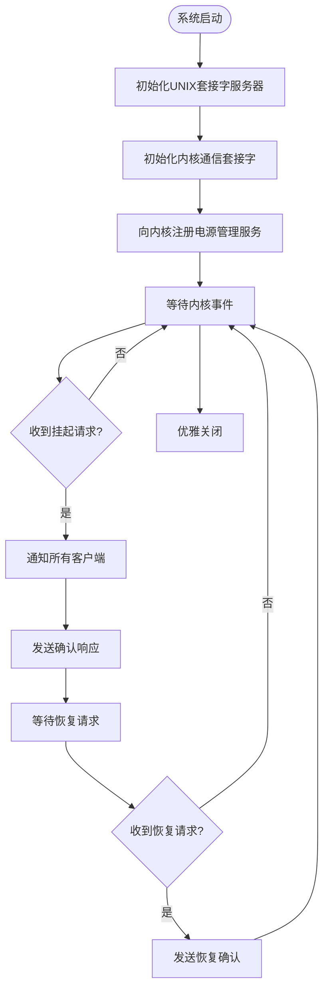
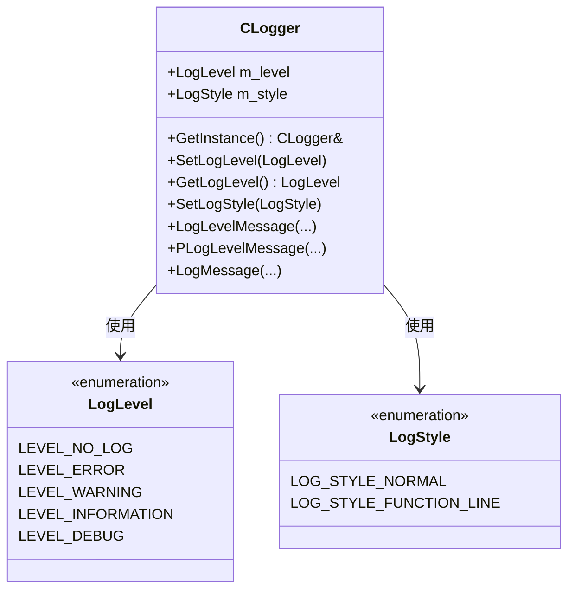
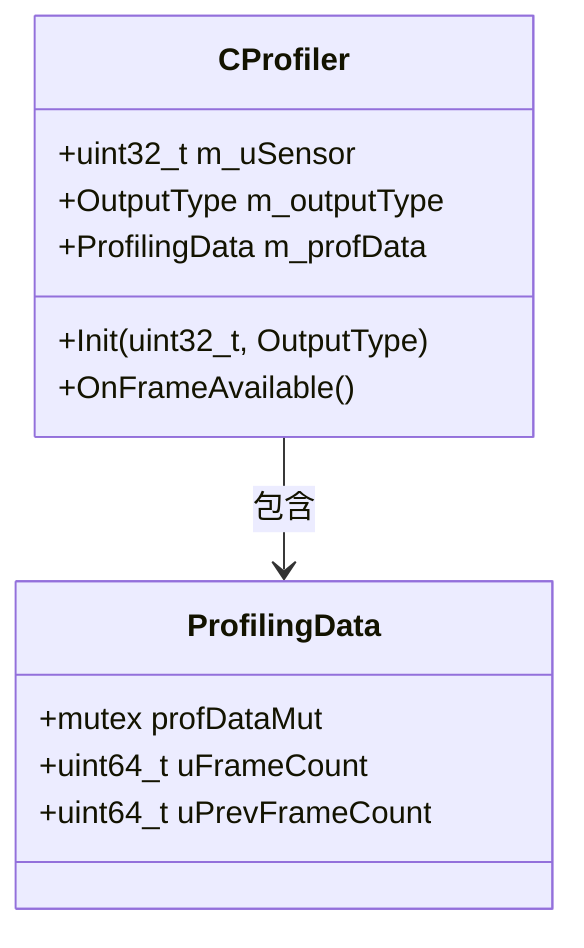
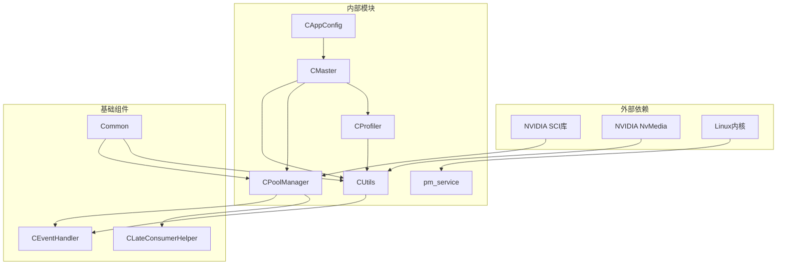

# 工具和实用程序

<cite>
**本文档引用的文件**
- [utils/pm_service.cpp](file://utils/pm_service.cpp)
- [CPoolManager.cpp](file://CPoolManager.cpp)
- [CPoolManager.hpp](file://CPoolManager.hpp)
- [CUtils.cpp](file://CUtils.cpp)
- [CUtils.hpp](file://CUtils.hpp)
- [CEventHandler.hpp](file://CEventHandler.hpp)
- [Common.hpp](file://Common.hpp)
- [CProfiler.hpp](file://CProfiler.hpp)
- [CAppConfig.hpp](file://CAppConfig.hpp)
- [CLateConsumerHelper.hpp](file://CLateConsumerHelper.hpp)
- [main.cpp](file://main.cpp)
</cite>

## 目录
1. [简介](#简介)
2. [项目结构](#项目结构)
3. [核心组件](#核心组件)
4. [架构概览](#架构概览)
5. [详细组件分析](#详细组件分析)
6. [依赖关系分析](#依赖关系分析)
7. [性能考虑](#性能考虑)
8. [故障排除指南](#故障排除指南)
9. [结论](#结论)

## 简介

本文件档详细介绍了NVSIPL多播系统中的工具和实用程序模块。该系统是一个基于NVIDIA NvSIPL框架的多媒体数据传输和处理平台，主要包含三个核心工具模块：内存池管理系统、电源管理服务和通用工具函数库。

系统通过事件驱动架构实现高效的内存管理和资源调度，支持多种通信模式（进程内、进程间、跨芯片）和消费者类型（编码器、CUDA、拼接、显示）。电源管理服务提供了完整的系统休眠和唤醒机制，而通用工具函数库则提供了日志管理、性能分析和错误处理等基础设施。

## 项目结构

该项目采用模块化设计，主要分为以下几个核心模块：

**图表来源**
- [main.cpp:253-304](file://main.cpp#L253-L304)
- [CUtils.hpp:17-311](file://CUtils.hpp#L17-L311)
- [CPoolManager.hpp:33-71](file://CPoolManager.hpp#L33-L71)

**章节来源**
- [main.cpp:1-304](file://main.cpp#L1-L304)
- [CUtils.hpp:1-311](file://CUtils.hpp#L1-L311)
- [CPoolManager.hpp:1-71](file://CPoolManager.hpp#L1-L71)

## 核心组件

### 内存池管理系统

内存池管理系统是整个系统的核心组件，负责管理NVIDIA NvSIPL框架中的缓冲区分配和资源管理。该系统实现了完整的事件驱动架构，支持动态元素协调和批量缓冲区管理。

### 电源管理服务

电源管理服务提供了系统级的功耗控制和休眠管理功能。通过UNIX域套接字和Netlink消息机制，实现了与内核的双向通信，支持热插拔和动态电源状态管理。

### 通用工具函数库

通用工具函数库提供了完整的日志管理、错误处理、性能分析和配置管理功能。该库采用单例模式设计，确保全局一致的日志输出和配置管理。

**章节来源**
- [CPoolManager.cpp:1-401](file://CPoolManager.cpp#L1-L401)
- [utils/pm_service.cpp:1-274](file://utils/pm_service.cpp#L1-L274)
- [CUtils.cpp:1-438](file://CUtils.cpp#L1-L438)

## 架构概览

系统采用分层架构设计，从底层的硬件抽象到上层的应用逻辑形成了清晰的层次结构：

**图表来源**
- [main.cpp:253-304](file://main.cpp#L253-L304)
- [utils/pm_service.cpp:261-274](file://utils/pm_service.cpp#L261-L274)
- [CPoolManager.cpp:30-98](file://CPoolManager.cpp#L30-L98)

## 详细组件分析

### 内存池管理器分析

CPoolManager是内存池管理系统的核心实现，负责管理NVIDIA NvSIPL框架中的缓冲区生命周期和资源分配。

#### 类结构设计

**图表来源**
- [CEventHandler.hpp:23-51](file://CEventHandler.hpp#L23-L51)
- [CPoolManager.hpp:33-71](file://CPoolManager.hpp#L33-L71)
- [CPoolManager.hpp:19-31](file://CPoolManager.hpp#L19-L31)

#### 事件处理流程

内存池管理器采用事件驱动架构，通过NvSciStream事件系统实现异步处理：

**图表来源**
- [CPoolManager.cpp:41-98](file://CPoolManager.cpp#L41-L98)
- [CPoolManager.cpp:100-117](file://CPoolManager.cpp#L100-L117)

#### 内存分配管理策略

内存池管理器实现了高效的缓冲区分配策略：

1. **批量分配**：一次性创建多个数据包和缓冲区，减少系统调用开销
2. **元素协调**：自动协调生产者和消费者的元素需求，确保兼容性
3. **延迟消费者支持**：动态添加消费者而不影响现有连接
4. **错误恢复**：完善的错误检测和恢复机制

**章节来源**
- [CPoolManager.cpp:100-401](file://CPoolManager.cpp#L100-L401)
- [CPoolManager.hpp:33-71](file://CPoolManager.hpp#L33-L71)

### 电源管理服务分析

电源管理服务提供了完整的系统电源控制功能，通过UNIX域套接字和Netlink消息实现与内核的通信。

#### 服务器架构设计

**图表来源**
- [utils/pm_service.cpp:34-163](file://utils/pm_service.cpp#L34-L163)
- [utils/pm_service.cpp:220-259](file://utils/pm_service.cpp#L220-L259)

#### 电源控制流程

**图表来源**
- [utils/pm_service.cpp:80-137](file://utils/pm_service.cpp#L80-L137)
- [utils/pm_service.cpp:244-258](file://utils/pm_service.cpp#L244-L258)

#### 功耗优化策略

电源管理服务实现了多层次的功耗优化：

1. **动态频率调整**：根据负载情况调整GPU和CPU频率
2. **设备状态管理**：智能管理摄像头、显示器等外设的电源状态
3. **内存休眠**：在空闲时自动进入低功耗内存模式
4. **任务调度优化**：避免不必要的计算密集型操作

**章节来源**
- [utils/pm_service.cpp:1-274](file://utils/pm_service.cpp#L1-L274)

### 通用工具函数库分析

通用工具函数库提供了完整的基础设施支持，包括日志管理、错误处理、配置管理和性能分析。

#### 日志管理系统

**图表来源**
- [CUtils.hpp:177-276](file://CUtils.hpp#L177-L276)

#### 错误处理宏系统

工具库提供了丰富的错误处理宏，简化了错误检查和处理：

| 宏名称 | 功能描述 | 使用场景 |
|--------|----------|----------|
| `CHK_PTR_AND_RETURN` | 检查指针有效性 | 内存分配后检查 |
| `CHK_STATUS_AND_RETURN` | 检查状态码 | API调用结果检查 |
| `CHK_NVSCISTATUS_AND_RETURN` | 检查NvSci状态 | NvSIPL框架调用 |
| `PCHK_STATUS_AND_RETURN` | 带前缀的错误检查 | 带组件名的错误报告 |
| `LOG_*`系列宏 | 日志记录 | 各种级别的日志输出 |

#### 性能分析工具

CProfiler类提供了简单的性能监控功能：

**图表来源**
- [CProfiler.hpp:21-54](file://CProfiler.hpp#L21-L54)

**章节来源**
- [CUtils.cpp:1-438](file://CUtils.cpp#L1-L438)
- [CUtils.hpp:1-311](file://CUtils.hpp#L1-L311)
- [CProfiler.hpp:1-57](file://CProfiler.hpp#L1-L57)

## 依赖关系分析

系统各组件之间的依赖关系如下：

**图表来源**
- [CPoolManager.cpp:9-17](file://CPoolManager.cpp#L9-L17)
- [CUtils.cpp:11-14](file://CUtils.cpp#L11-L14)
- [utils/pm_service.cpp:28](file://utils/pm_service.cpp#L28)

**章节来源**
- [CPoolManager.cpp:9-17](file://CPoolManager.cpp#L9-L17)
- [CUtils.cpp:11-14](file://CUtils.cpp#L11-L14)
- [utils/pm_service.cpp:28](file://utils/pm_service.cpp#L28)

## 性能考虑

### 内存池优化策略

1. **批量操作优化**：通过批量创建和管理缓冲区，减少系统调用次数
2. **内存复用**：在可能的情况下重用已分配的缓冲区
3. **异步处理**：利用事件驱动架构避免阻塞操作
4. **资源清理**：确保所有分配的资源都能正确释放

### 电源管理优化

1. **智能休眠**：根据系统负载自动调整休眠策略
2. **快速唤醒**：优化唤醒过程，减少延迟
3. **功耗监控**：实时监控功耗使用情况
4. **温度管理**：结合温度传感器进行动态功率调节

### 日志性能优化

1. **级别过滤**：根据当前日志级别过滤不必要的输出
2. **格式化优化**：避免在高频路径中进行复杂的字符串格式化
3. **缓冲输出**：批量输出日志信息，减少I/O操作
4. **条件编译**：在发布版本中禁用调试日志

## 故障排除指南

### 常见问题诊断

#### 内存池相关问题

1. **元素协调失败**
   - 检查生产者和消费者元素类型的兼容性
   - 验证NvSciBuf属性列表的正确性
   - 确认缓冲区大小和对齐要求

2. **缓冲区分配错误**
   - 检查可用内存空间
   - 验证GPU内存状态
   - 确认权限设置正确

#### 电源管理问题

1. **套接字连接失败**
   - 检查UNIX域套接字路径
   - 验证权限设置
   - 确认服务进程正常运行

2. **内核通信异常**
   - 检查Netlink套接字绑定
   - 验证消息格式正确性
   - 确认内核模块加载状态

#### 日志系统问题

1. **日志输出异常**
   - 检查日志级别设置
   - 验证输出格式配置
   - 确认缓冲区大小足够

2. **性能分析数据不准确**
   - 检查计数器同步
   - 验证临界区保护
   - 确认时间戳准确性

**章节来源**
- [CUtils.cpp:148-208](file://CUtils.cpp#L148-L208)
- [utils/pm_service.cpp:51-78](file://utils/pm_service.cpp#L51-L78)
- [CPoolManager.cpp:47-98](file://CPoolManager.cpp#L47-L98)

## 结论

NVSIPL多播系统的工具和实用程序模块展现了现代多媒体处理系统的最佳实践。通过精心设计的内存池管理、完善的电源控制机制和全面的工具函数库，该系统实现了高性能、高可靠性的多媒体数据处理能力。

关键优势包括：
- **模块化设计**：清晰的职责分离和接口定义
- **事件驱动架构**：高效的异步处理机制
- **资源管理优化**：智能的内存分配和回收策略
- **电源管理集成**：完整的系统级功耗控制
- **开发友好性**：丰富的工具函数和错误处理机制

这些特性使得该系统能够适应各种复杂的多媒体应用场景，为开发者提供了强大的基础设施支持。