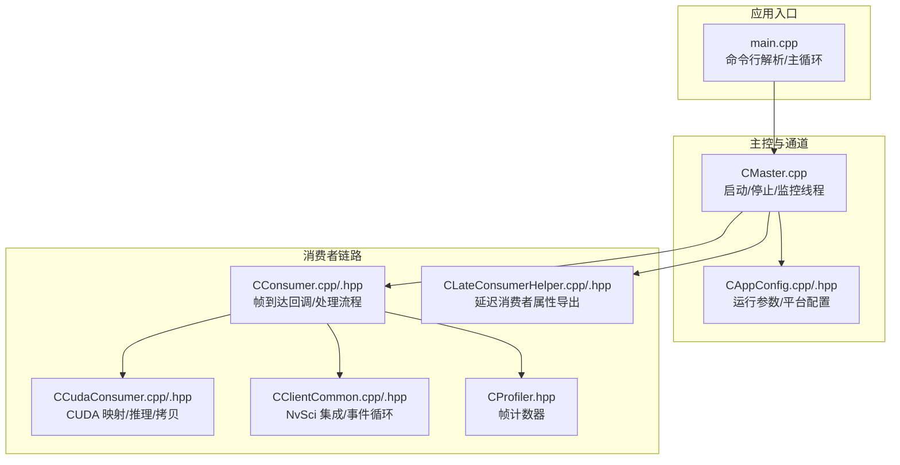
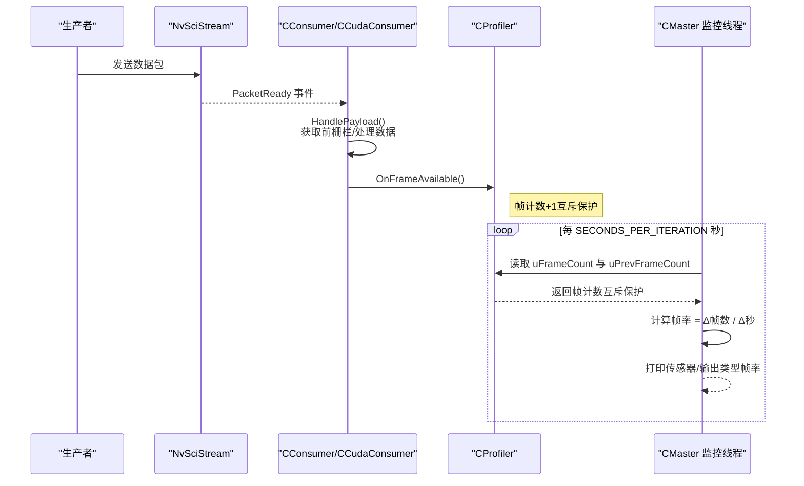
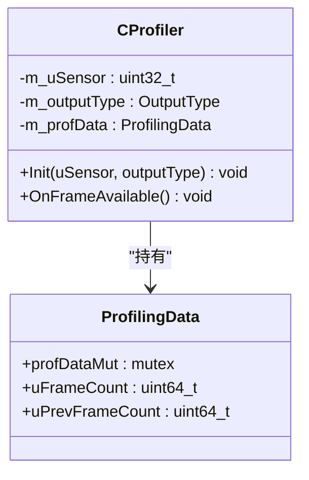
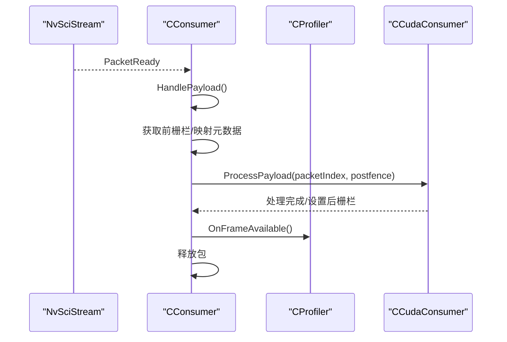
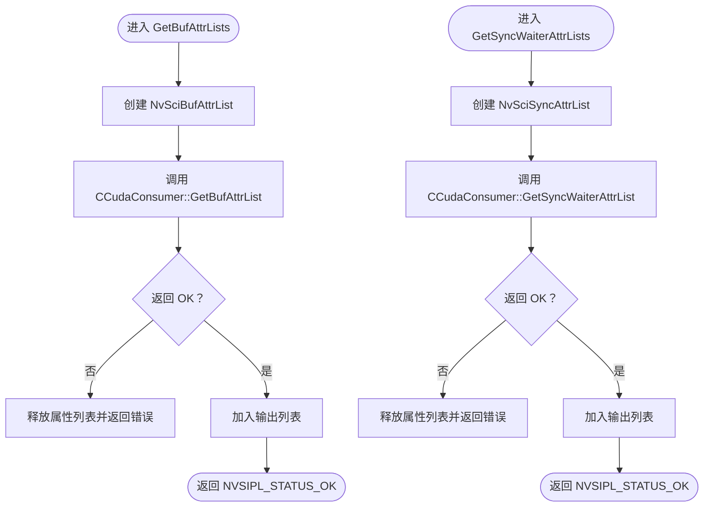
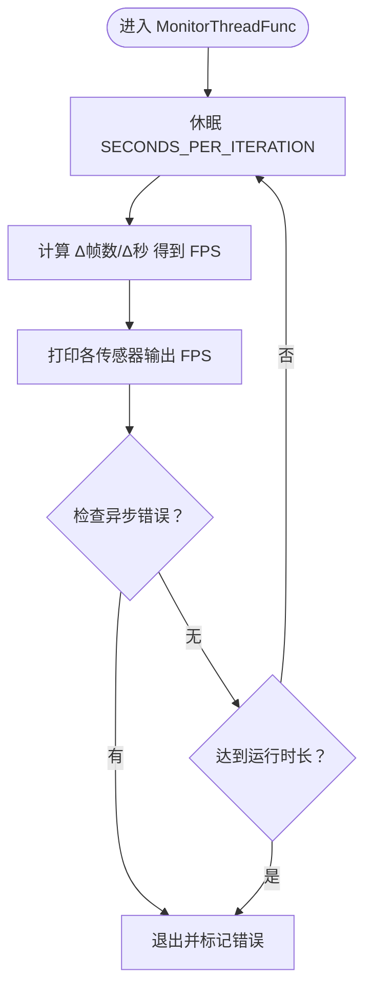
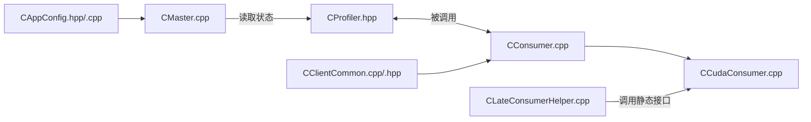

# 性能分析工具

<cite>
**本文引用的文件**
- [CProfiler.hpp](file://CProfiler.hpp)
- [CLateConsumerHelper.hpp](file://CLateConsumerHelper.hpp)
- [CLateConsumerHelper.cpp](file://CLateConsumerHelper.cpp)
- [CConsumer.hpp](file://CConsumer.hpp)
- [CConsumer.cpp](file://CConsumer.cpp)
- [CCudaConsumer.hpp](file://CCudaConsumer.hpp)
- [CCudaConsumer.cpp](file://CCudaConsumer.cpp)
- [CClientCommon.hpp](file://CClientCommon.hpp)
- [CClientCommon.cpp](file://CClientCommon.cpp)
- [CAppConfig.hpp](file://CAppConfig.hpp)
- [CAppConfig.cpp](file://CAppConfig.cpp)
- [Common.hpp](file://Common.hpp)
- [CMaster.cpp](file://CMaster.cpp)
- [main.cpp](file://main.cpp)
- [CUtils.hpp](file://CUtils.hpp)
</cite>

## 目录
1. [简介](#简介)
2. [项目结构](#项目结构)
3. [核心组件](#核心组件)
4. [架构总览](#架构总览)
5. [详细组件分析](#详细组件分析)
6. [依赖关系分析](#依赖关系分析)
7. [性能考量](#性能考量)
8. [故障排查指南](#故障排查指南)
9. [结论](#结论)
10. [附录：配置与使用](#附录配置与使用)

## 简介
本文件面向“性能分析工具”的使用者与维护者，系统化阐述以下主题：
- CProfiler 类的性能监控机制与实现原理（帧计数、并发安全、速率计算）
- CLateConsumerHelper 在性能分析中的作用（延迟消费者检测、同步属性适配、运行时附加场景）
- 多消费者环境下的工作原理（并发性能监控、资源利用率分析）
- 性能分析配置项与使用方法（采样频率、数据存储、可视化输出）
- 实战案例与最佳实践（瓶颈定位、优化建议）

## 项目结构
该仓库围绕 NvSIPL/NvSciStream/NvSciBuf/NvSciSync 构建，形成生产者-消费者流式处理链路。性能分析工具的关键位置如下：
- 性能采集：CProfiler（帧计数）与 CMaster 的监控线程（周期性统计）
- 消费端处理：CConsumer 及其子类 CCudaConsumer（帧到达回调、CUDA 同步、数据处理）
- 延迟消费者支持：CLateConsumerHelper（动态附加场景下的缓冲与同步属性导出）
- 配置与平台信息：CAppConfig（运行参数、平台配置、开关控制）
- 通用常量与日志：Common.hpp、CUtils.hpp

**图表来源**
- [main.cpp:253-304](file://main.cpp#L253-L304)
- [CMaster.cpp:354-403](file://CMaster.cpp#L354-L403)
- [CAppConfig.cpp:21-75](file://CAppConfig.cpp#L21-L75)
- [CConsumer.cpp:17-94](file://CConsumer.cpp#L17-L94)
- [CCudaConsumer.cpp:11-26](file://CCudaConsumer.cpp#L11-L26)
- [CClientCommon.cpp:95-112](file://CClientCommon.cpp#L95-L112)
- [CProfiler.hpp:21-54](file://CProfiler.hpp#L21-L54)
- [CLateConsumerHelper.cpp:13-44](file://CLateConsumerHelper.cpp#L13-L44)

**章节来源**
- [main.cpp:253-304](file://main.cpp#L253-L304)
- [CAppConfig.hpp:19-80](file://CAppConfig.hpp#L19-L80)
- [Common.hpp:14-34](file://Common.hpp#L14-L34)

## 核心组件
- CProfiler：轻量级帧计数器，记录每个传感器输出类型的累计帧数与上一周期帧数，用于计算瞬时帧率。
- CConsumer：消费者基类，负责从 NvSciStream 接收包、查询前同步栅栏、调用 ProcessPayload、释放包等；在 HandlePayload 中触发帧可用回调。
- CCudaConsumer：CConsumer 子类，实现 CUDA 映射、块线性到平面线性的转换、可选推理与主机拷贝、文件转储等。
- CClientCommon：NvSciBuf/NvSciSync 集成层，封装元素属性导出、等待者属性导入、信号对象导出、CPU 等待上下文等。
- CLateConsumerHelper：为“延迟附加消费者”场景准备缓冲与同步属性列表，确保动态加入的消费者能正确参与同步。
- CMaster：主控线程，启动流、启动监控线程、周期性打印各 Profiler 的帧率。

**章节来源**
- [CProfiler.hpp:21-54](file://CProfiler.hpp#L21-L54)
- [CConsumer.cpp:17-94](file://CConsumer.cpp#L17-L94)
- [CCudaConsumer.cpp:386-462](file://CCudaConsumer.cpp#L386-L462)
- [CClientCommon.cpp:95-112](file://CClientCommon.cpp#L95-L112)
- [CLateConsumerHelper.cpp:13-44](file://CLateConsumerHelper.cpp#L13-L44)
- [CMaster.cpp:354-403](file://CMaster.cpp#L354-L403)

## 架构总览
下图展示了性能分析在多消费者环境下的关键交互路径：消费者接收数据包后触发帧可用回调，主控线程按固定间隔读取各 Profiler 的帧计数差值并换算为帧率。

**图表来源**
- [CConsumer.cpp:33-35](file://CConsumer.cpp#L33-L35)
- [CProfiler.hpp:42-47](file://CProfiler.hpp#L42-L47)
- [CMaster.cpp:356-379](file://CMaster.cpp#L356-L379)

## 详细组件分析

### CProfiler 组件分析
- 设计要点
  - 使用互斥锁保护帧计数，避免多线程竞争导致计数不准。
  - 维护当前帧计数与上一周期帧计数，用于计算周期内帧率。
  - 通过 OnFrameAvailable 在消费者处理流程中被调用，确保统计与业务逻辑解耦。
- 数据结构与复杂度
  - 结构体仅包含两个 64 位计数器与互斥体，空间 O(1)，加锁操作 O(1)。
- 错误处理与边界
  - 初始化时清零计数；OnFrameAvailable 仅做自增，无返回值，简化调用方逻辑。
- 性能影响
  - 加锁粒度小、开销低；适合高频调用（每帧一次）。

**图表来源**
- [CProfiler.hpp:21-54](file://CProfiler.hpp#L21-L54)

**章节来源**
- [CProfiler.hpp:21-54](file://CProfiler.hpp#L21-L54)

### CConsumer 与 CCudaConsumer 组件分析
- CConsumer
  - 负责 NvSciStream 事件处理、包获取、前栅栏插入、调用 ProcessPayload、后栅栏设置或 CPU 等待、释放包。
  - 在 HandlePayload 中调用 OnFrameAvailable，将“帧可用”信号传递给 CProfiler。
- CCudaConsumer
  - 实现 CUDA 映射、块线性到平面线性的转换、可选推理、主机内存拷贝、文件转储。
  - 通过 NvSciSync 外部信号量等待生产者栅栏，保证数据一致性。

**图表来源**
- [CConsumer.cpp:17-94](file://CConsumer.cpp#L17-L94)
- [CCudaConsumer.cpp:386-462](file://CCudaConsumer.cpp#L386-L462)
- [CProfiler.hpp:42-47](file://CProfiler.hpp#L42-L47)

**章节来源**
- [CConsumer.cpp:17-94](file://CConsumer.cpp#L17-L94)
- [CCudaConsumer.cpp:386-462](file://CCudaConsumer.cpp#L386-L462)

### CLateConsumerHelper 组件分析
- 作用
  - 为“延迟附加消费者”场景准备缓冲属性列表与等待者同步属性列表，使动态加入的消费者能与现有链路同步。
  - 提供 GetLateConsCount，根据配置决定是否启用延迟附加。
- 实现要点
  - 通过 CCudaConsumer::GetBufAttrList 与 CCudaConsumer::GetSyncWaiterAttrList 获取所需属性。
  - 若失败则释放已分配的属性列表并返回错误码。
- 与多消费者的关联
  - 当配置允许延迟附加时，主控可动态创建消费者并导出属性，从而在不中断生产者的情况下扩容消费能力。

**图表来源**
- [CLateConsumerHelper.cpp:13-44](file://CLateConsumerHelper.cpp#L13-L44)
- [CCudaConsumer.cpp:112-141](file://CCudaConsumer.cpp#L112-L141)
- [CCudaConsumer.cpp:148-171](file://CCudaConsumer.cpp#L148-L171)

**章节来源**
- [CLateConsumerHelper.hpp:15-35](file://CLateConsumerHelper.hpp#L15-L35)
- [CLateConsumerHelper.cpp:13-49](file://CLateConsumerHelper.cpp#L13-L49)
- [CCudaConsumer.hpp:25-50](file://CCudaConsumer.hpp#L25-L50)

### CMaster 监控线程分析
- 周期性统计
  - 每隔固定秒数（SECONDS_PER_ITERATION）读取所有 Profiler 的帧计数，计算 Δ帧数/Δ秒得到帧率。
  - 将结果按“传感器 + 输出类型”维度打印，便于对比不同输出的吞吐。
- 运行时控制
  - 支持按运行时长自动退出（由 CAppConfig 控制）。
  - 检查异步错误并及时终止。

**图表来源**
- [CMaster.cpp:354-403](file://CMaster.cpp#L354-L403)

**章节来源**
- [CMaster.cpp:354-403](file://CMaster.cpp#L354-L403)

## 依赖关系分析
- 组件耦合
  - CConsumer 依赖 CProfiler（通过指针注入），在帧到达时触发统计。
  - CCudaConsumer 继承 CConsumer，扩展 CUDA 映射与处理。
  - CMaster 持有多份 CProfiler 指针，统一进行周期性统计。
  - CLateConsumerHelper 依赖 CCudaConsumer 的静态属性导出接口，用于延迟附加。
- 外部依赖
  - NvSciBuf/NvSciSync/NvSciStream：用于缓冲与同步属性的协商、信号量等待与栅栏设置。
  - CUDA：用于块线性到平面线性的转换、可选推理与主机拷贝。
- 潜在环依赖
  - 未发现直接循环 include；CProfiler 仅被消费者侧使用，主控侧只读取其状态。

**图表来源**
- [CProfiler.hpp:31-47](file://CProfiler.hpp#L31-L47)
- [CConsumer.cpp:33-35](file://CConsumer.cpp#L33-L35)
- [CCudaConsumer.cpp:112-171](file://CCudaConsumer.cpp#L112-L171)
- [CMaster.cpp:370-379](file://CMaster.cpp#L370-L379)
- [CAppConfig.cpp:21-75](file://CAppConfig.cpp#L21-L75)
- [CClientCommon.cpp:95-112](file://CClientCommon.cpp#L95-L112)

**章节来源**
- [CProfiler.hpp:31-47](file://CProfiler.hpp#L31-L47)
- [CConsumer.cpp:33-35](file://CConsumer.cpp#L33-L35)
- [CCudaConsumer.cpp:112-171](file://CCudaConsumer.cpp#L112-L171)
- [CMaster.cpp:370-379](file://CMaster.cpp#L370-L379)
- [CAppConfig.cpp:21-75](file://CAppConfig.cpp#L21-L75)
- [CClientCommon.cpp:95-112](file://CClientCommon.cpp#L95-L112)

## 性能考量
- 帧率统计精度
  - 采用“当前帧计数 - 上一周期帧计数”的差分方式，避免受初始化阶段波动影响。
  - 采样周期（SECONDS_PER_ITERATION）越短，统计越灵敏，但打印开销越大；建议结合实际需求调整。
- 并发与锁
  - CProfiler 使用细粒度互斥，OnFrameAvailable 为 O(1) 操作，适合高吞吐场景。
  - CMaster 的统计也使用互斥保护，避免读取半更新状态。
- CUDA 与同步
  - CCudaConsumer 通过外部信号量等待生产者栅栏，保证数据一致性；若等待超时或失败，应优先检查生产者侧同步配置与驱动状态。
- 文件转储与带宽
  - 当启用文件转储时，会进行设备到主机的内存拷贝，可能成为瓶颈；建议限制转储帧范围与分辨率。

[本节为通用性能讨论，无需列出具体文件来源]

## 故障排查指南
- 帧率异常为 0 或极低
  - 检查消费者是否成功注册到 NvSciStream，确认 HandleEvents 中 PacketReady 是否触发。
  - 确认 CProfiler::OnFrameAvailable 是否被调用（CConsumer::HandlePayload 中的调用点）。
- 延迟附加失败
  - 检查 CLateConsumerHelper::GetBufAttrLists/GetSyncWaiterAttrLists 的返回值，确认 CCudaConsumer 的静态属性导出接口是否成功。
  - 确认配置项 IsLateAttachEnabled 已开启。
- CUDA 相关错误
  - 关注 CCudaConsumer 的 CUDA API 返回值宏（如 CUDA 错误码），优先检查设备选择、流创建、外存/外信号量导入、拷贝参数。
- 同步等待超时
  - 检查生产者侧是否正确设置后栅栏；确认消费者侧前栅栏插入与等待顺序正确。

**章节来源**
- [CConsumer.cpp:33-35](file://CConsumer.cpp#L33-L35)
- [CLateConsumerHelper.cpp:13-44](file://CLateConsumerHelper.cpp#L13-L44)
- [CCudaConsumer.cpp:28-53](file://CCudaConsumer.cpp#L28-L53)
- [CUtils.hpp:84-97](file://CUtils.hpp#L84-L97)

## 结论
- CProfiler 提供了轻量、可靠的帧计数能力，配合 CMaster 的周期性统计，可直观反映多消费者环境下的吞吐表现。
- CLateConsumerHelper 为动态扩展场景提供了必要的缓冲与同步属性支持，有助于在不中断生产者的前提下提升消费能力。
- 在 CUDA 路径中，合理的栅栏等待与内存拷贝策略是性能的关键；建议结合采样周期与转储策略进行权衡。

[本节为总结性内容，无需列出具体文件来源]

## 附录：配置与使用

### 性能分析配置项
- 采样频率
  - 通过 CMaster 的 SECONDS_PER_ITERATION 控制统计周期；周期越短，统计越敏感，但输出越频繁。
- 数据存储与可视化
  - 当前实现以标准输出打印各传感器输出类型的帧率；如需持久化，可在应用侧扩展日志写入。
- 运行时长
  - 通过 CAppConfig::GetRunDurationSec 设置运行时长，达到阈值后自动退出。
- 帧过滤
  - 通过 CAppConfig::GetFrameFilter 控制帧采样比例（例如每 N 帧处理一次），降低处理压力。
- 延迟附加
  - 通过 CAppConfig::IsLateAttachEnabled 控制是否允许延迟附加消费者；CLateConsumerHelper 将据此返回相应数量的消费者。

**章节来源**
- [CMaster.cpp:356-379](file://CMaster.cpp#L356-L379)
- [CAppConfig.hpp:42-44](file://CAppConfig.hpp#L42-L44)
- [CAppConfig.cpp:21-75](file://CAppConfig.cpp#L21-L75)
- [CConsumer.cpp:38-43](file://CConsumer.cpp#L38-L43)

### 使用方法
- 启动应用
  - 解析命令行参数，初始化主控与通道，启动流。
- 观察性能
  - 监控线程按固定周期打印各传感器输出的帧率，用于对比不同输出的性能表现。
- 动态扩展
  - 若启用延迟附加，可在运行时动态创建消费者并导出属性，加入消费链路。

**章节来源**
- [main.cpp:253-304](file://main.cpp#L253-L304)
- [CMaster.cpp:324-336](file://CMaster.cpp#L324-L336)

### 实战案例与最佳实践
- 案例：多输出类型帧率对比
  - 场景：同一传感器输出 NV12-BL 与 NV12-PL 两种格式，分别注入独立 CProfiler。
  - 方法：在主控侧维护多个 Profiler 指针，监控线程分别打印各输出的 FPS，快速定位瓶颈输出。
- 案例：延迟附加消费者扩容
  - 场景：生产者稳定运行中，需要临时提升消费能力。
  - 方法：启用延迟附加，使用 CLateConsumerHelper 导出缓冲与同步属性，动态创建 CCudaConsumer 并接入链路。
- 最佳实践
  - 保持 OnFrameAvailable 的最小化开销，避免在统计路径中执行重操作。
  - 合理设置帧过滤与转储策略，避免 I/O 成为瓶颈。
  - 在 CUDA 路径中，尽量复用外存/外信号量，减少重复导入成本。

[本节为实践性建议，无需列出具体文件来源]