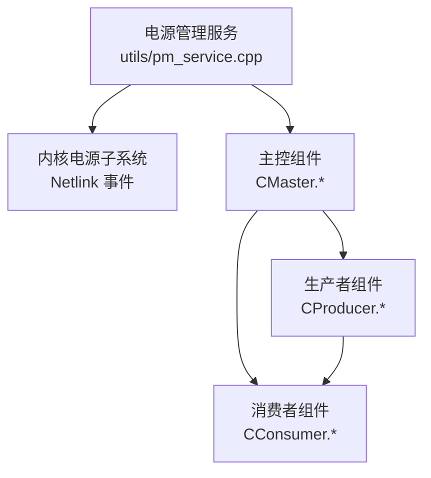
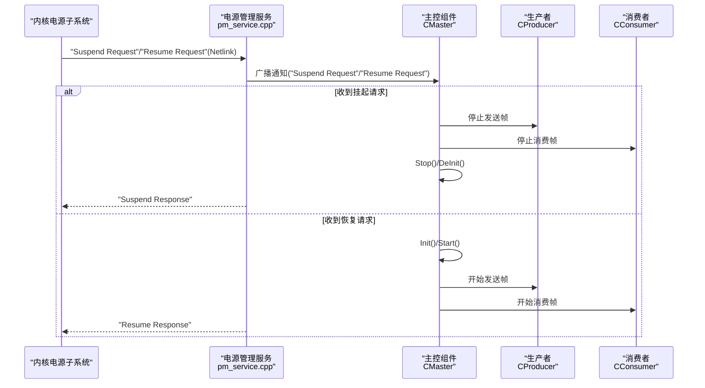
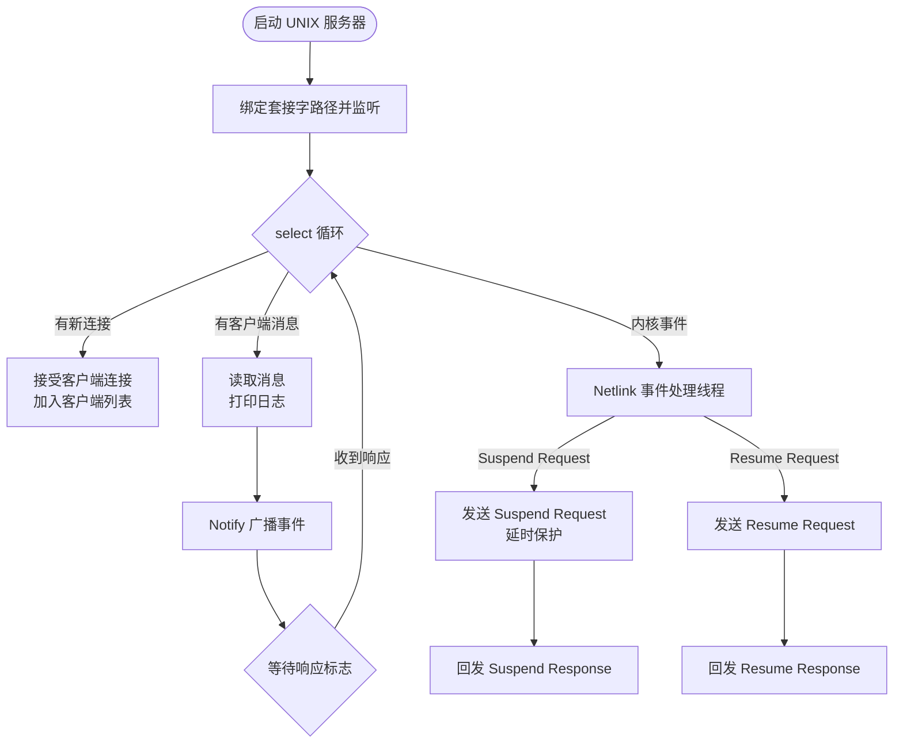
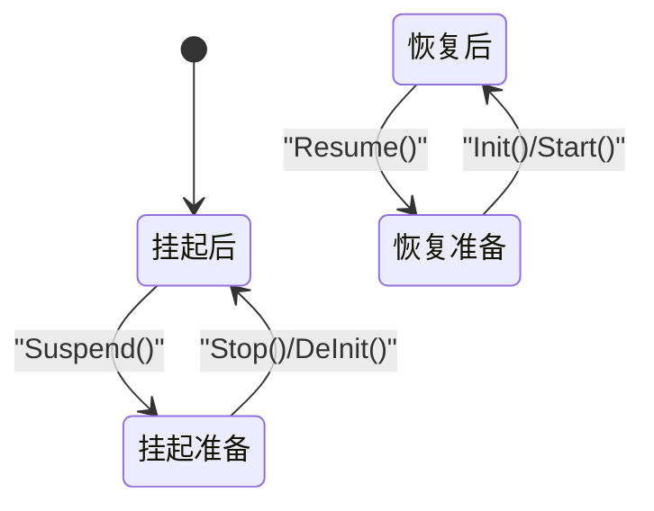
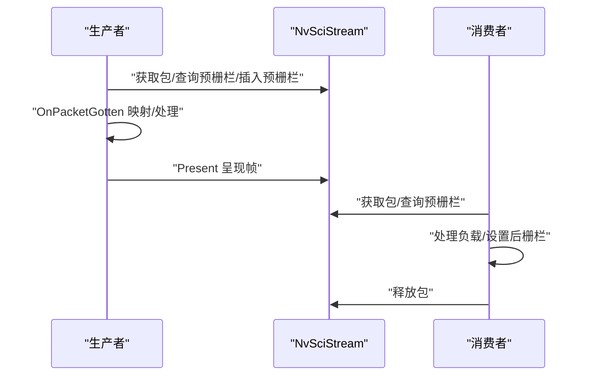
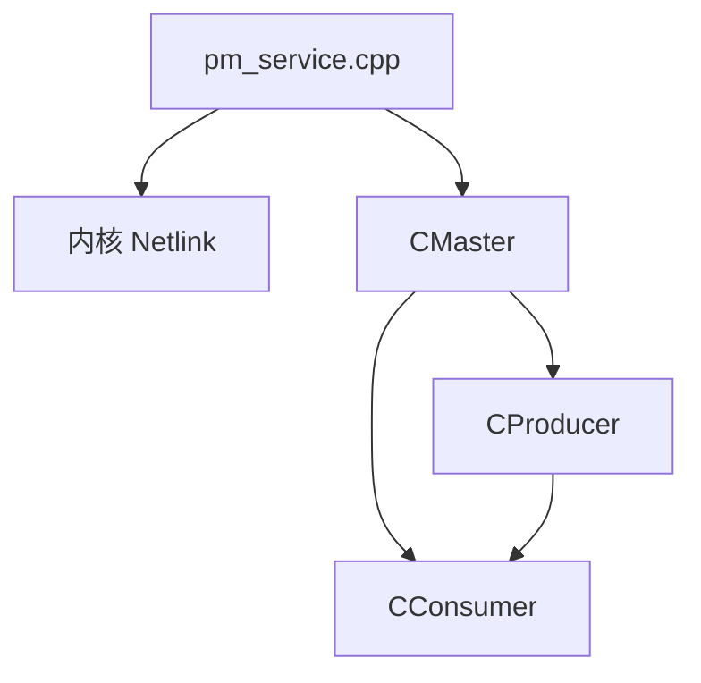

# 电源管理服务

<cite>
**本文引用的文件**
- [pm_service.cpp](file://utils/pm_service.cpp)
- [CMaster.cpp](file://CMaster.cpp)
- [CMaster.hpp](file://CMaster.hpp)
- [CProducer.cpp](file://CProducer.cpp)
- [CProducer.hpp](file://CProducer.hpp)
- [CConsumer.cpp](file://CConsumer.cpp)
- [CConsumer.hpp](file://CConsumer.hpp)
- [README.md](file://README.md)
</cite>

## 目录
1. [简介](#简介)
2. [项目结构](#项目结构)
3. [核心组件](#核心组件)
4. [架构总览](#架构总览)
5. [详细组件分析](#详细组件分析)
6. [依赖关系分析](#依赖关系分析)
7. [性能考量](#性能考量)
8. [故障排除指南](#故障排除指南)
9. [结论](#结论)
10. [附录](#附录)

## 简介
本文件面向嵌入式视觉处理系统的电源管理服务，围绕 utils/pm_service.cpp 中的电源控制机制展开，系统化阐述其在系统休眠/唤醒流程中的作用、与 CMaster、CProducer、CConsumer 的协作关系、功耗优化策略、资源调度机制、配置选项与使用方法，并提供最佳实践与故障排除建议。该服务通过 UNIX 域套接字与内核 Netlink 事件通道协同，实现对系统电源状态的响应与通知，确保在多进程、跨芯片（C2C）等复杂拓扑下维持稳定与高效的运行。

## 项目结构
与电源管理直接相关的模块分布如下：
- utils/pm_service.cpp：电源管理服务主程序，负责 UNIX 套接字监听、客户端连接管理、Netlink 事件收发与转发。
- CMaster.*：系统主控，负责初始化/启动/停止/反初始化流水线，以及电源挂起/恢复的高层协调。
- CProducer.* / CConsumer.*：生产者/消费者基类，负责 NvSIPL/NvSciStream 数据通路的帧处理与同步对象管理，为电源管理提供“活跃度”信号。
- README.md：示例用法与运行模式说明，便于理解电源管理在不同运行模式下的影响。

**图示来源**
- [pm_service.cpp:261-273](file://utils/pm_service.cpp#L261-L273)
- [CMaster.cpp:234-275](file://CMaster.cpp#L234-L275)
- [CProducer.cpp:17-151](file://CProducer.cpp#L17-L151)
- [CConsumer.cpp:17-94](file://CConsumer.cpp#L17-L94)

**章节来源**
- [README.md:16-109](file://README.md#L16-L109)

## 核心组件
- 电源管理服务（CPMSocketServer）
  - 负责 UNIX 域套接字监听与客户端连接管理，支持最多固定数量的并发客户端。
  - 提供异步通知接口，向已连接客户端广播内核事件或请求响应。
- 内核事件处理线程
  - 通过 Netlink 用户态协议接收内核电源事件（如挂起/唤醒请求），并向主控组件转发。
- 主控组件（CMaster）
  - 维护电源状态机（挂起准备/挂起后/恢复准备/恢复后），在收到电源事件时执行相应的 Stop/DeInit/Init/Start 流程。
- 生产者/消费者（CProducer/CConsumer）
  - 在数据通路上产生/消耗负载，其活跃度可作为系统是否需要保持高功耗状态的依据；同时通过 NvSci 同步对象管理帧生命周期。

**章节来源**
- [pm_service.cpp:34-163](file://utils/pm_service.cpp#L34-L163)
- [pm_service.cpp:220-259](file://utils/pm_service.cpp#L220-L259)
- [CMaster.hpp:36-42](file://CMaster.hpp#L36-L42)
- [CMaster.cpp:301-318](file://CMaster.cpp#L301-L318)
- [CProducer.cpp:17-151](file://CProducer.cpp#L17-L151)
- [CConsumer.cpp:17-94](file://CConsumer.cpp#L17-L94)

## 架构总览
电源管理服务以“事件驱动 + 通知广播”的方式工作：内核通过 Netlink 发送电源事件，pm_service 将事件通知主控组件；主控根据当前电源状态决定是否执行挂起/恢复操作；生产者/消费者在数据通路上的活动程度影响系统整体功耗。

**图示来源**
- [pm_service.cpp:220-259](file://utils/pm_service.cpp#L220-L259)
- [CMaster.cpp:301-318](file://CMaster.cpp#L301-L318)
- [CProducer.cpp:17-151](file://CProducer.cpp#L17-L151)
- [CConsumer.cpp:17-94](file://CConsumer.cpp#L17-L94)

## 详细组件分析

### 电源管理服务（UNIX 套接字与 Netlink 协同）
- UNIX 套接字服务器
  - 初始化：删除旧路径、创建 AF_UNIX 套接字、绑定地址、进入监听。
  - 运行：使用 select 多路复用监听新连接与客户端消息；维护客户端列表与最大连接数限制。
  - 关闭：关闭所有客户端与服务端套接字，清理 Unix 域套接字路径。
- Netlink 事件处理
  - 创建原始 Netlink 套接字，绑定到用户态 PM 组，注册后循环接收内核事件。
  - 对“挂起请求”进行通知并等待响应，随后回发“挂起响应”；对“恢复请求”先回发“恢复响应”，再通知。
  - 包含针对内核崩溃问题的临时延时保护。
- 通知机制
  - Notify 接口遍历已连接客户端，发送消息并使用条件变量等待响应标志，实现请求-响应同步。

**图示来源**
- [pm_service.cpp:51-137](file://utils/pm_service.cpp#L51-L137)
- [pm_service.cpp:151-163](file://utils/pm_service.cpp#L151-L163)
- [pm_service.cpp:220-259](file://utils/pm_service.cpp#L220-L259)

**章节来源**
- [pm_service.cpp:34-163](file://utils/pm_service.cpp#L34-L163)
- [pm_service.cpp:165-218](file://utils/pm_service.cpp#L165-L218)
- [pm_service.cpp:220-259](file://utils/pm_service.cpp#L220-L259)
- [pm_service.cpp:261-273](file://utils/pm_service.cpp#L261-L273)

### 主控组件（CMaster）的电源状态机与流程
- 电源状态枚举
  - 挂起准备、挂起后、恢复准备、恢复后，用于避免重复操作与保证状态一致性。
- 挂起流程
  - 设置状态为“挂起准备”，依次调用 Stop() 停止流与监控线程，再调用 DeInit() 反初始化资源，最后设置为“挂起后”。
- 恢复流程
  - 设置状态为“恢复准备”，先 Init() 初始化，再 Start() 启动，最后设置为“恢复后”。

**图示来源**
- [CMaster.hpp:36-42](file://CMaster.hpp#L36-L42)
- [CMaster.cpp:282-299](file://CMaster.cpp#L282-L299)
- [CMaster.cpp:301-318](file://CMaster.cpp#L301-L318)

**章节来源**
- [CMaster.hpp:36-42](file://CMaster.hpp#L36-L42)
- [CMaster.cpp:282-299](file://CMaster.cpp#L282-L299)
- [CMaster.cpp:301-318](file://CMaster.cpp#L301-L318)

### 生产者与消费者的帧处理与电源相关性
- 生产者（CProducer）
  - 在 HandlePayload 中从 NvSciStream 获取包、查询预同步栅栏、插入预栅栏、回调 OnPacketGotten 完成映射与处理。
  - Post 将处理完成的数据呈现给下游消费者，并更新“缓冲区占用计数”，作为系统活跃度指标之一。
- 消费者（CConsumer）
  - 在 HandlePayload 中获取包、查询预栅栏、处理负载、设置后栅栏、释放包。
  - 通过帧号与过滤参数控制处理频率，从而间接影响功耗。

**图示来源**
- [CProducer.cpp:56-121](file://CProducer.cpp#L56-L121)
- [CProducer.cpp:123-151](file://CProducer.cpp#L123-L151)
- [CConsumer.cpp:17-94](file://CConsumer.cpp#L17-L94)

**章节来源**
- [CProducer.cpp:17-151](file://CProducer.cpp#L17-L151)
- [CConsumer.cpp:17-94](file://CConsumer.cpp#L17-L94)

### 电源管理在嵌入式视觉处理中的重要性
- 功耗优化策略
  - 通过主控组件的挂起/恢复流程，在无数据流或低负载时降低系统功耗；在有活跃消费者时维持高性能。
  - 生产者/消费者侧的帧处理与栅栏管理确保在电源状态切换期间不会破坏数据一致性。
- 系统休眠管理
  - 电源管理服务通过 Netlink 事件与主控组件协作，确保在系统休眠前完成必要的资源释放与状态保存，在唤醒后正确重建资源。
- 资源调度机制
  - 电源状态机与数据通路的解耦设计，使电源管理不直接干预业务逻辑，而是通过统一的状态转换接口进行协调。

**章节来源**
- [CMaster.cpp:301-318](file://CMaster.cpp#L301-L318)
- [CProducer.cpp:17-151](file://CProducer.cpp#L17-L151)
- [CConsumer.cpp:17-94](file://CConsumer.cpp#L17-L94)

### 电源管理服务与其他系统组件的交互
- 与 CMaster 的协作
  - 电源事件由 pm_service 通知 CMaster，CMaster 根据电源状态机执行 Stop/DeInit/Init/Start。
- 与 CProducer/CConsumer 的协作
  - 生产者/消费者在数据通路上的活跃度是系统是否需要保持高功耗状态的重要依据；电源状态切换时，它们的行为会相应调整（例如暂停/恢复帧处理）。
- 与运行模式的关系
  - README 中提供了多种运行模式（单进程、进程间、跨芯片、延迟/重附加等），电源管理在这些模式下均通过统一的事件与状态机进行协调。

**章节来源**
- [README.md:16-109](file://README.md#L16-L109)
- [CMaster.cpp:234-275](file://CMaster.cpp#L234-L275)
- [CProducer.cpp:17-151](file://CProducer.cpp#L17-L151)
- [CConsumer.cpp:17-94](file://CConsumer.cpp#L17-L94)

### 电源管理配置选项与使用方法
- 启动电源管理服务
  - 服务通过 UNIX 域套接字路径对外提供通信接口，监听来自内核的电源事件并广播至已连接客户端。
- 运行模式下的电源策略
  - 单进程模式：主控组件在本地初始化/启动/停止，电源管理服务与主控在同一进程中协作。
  - 进程间（P2P）/跨芯片（C2C）模式：主控组件在独立进程中运行，电源管理服务通过事件与主控交互；README 提供了详细的启动与验证步骤。
- 电源策略调整
  - 通过主控组件的电源状态机接口（Suspend/Resume）触发系统行为；生产者/消费者的帧处理频率可通过配置参数调节，从而影响系统功耗。

**章节来源**
- [README.md:16-109](file://README.md#L16-L109)
- [CMaster.cpp:282-299](file://CMaster.cpp#L282-L299)
- [CMaster.cpp:301-318](file://CMaster.cpp#L301-L318)

## 依赖关系分析
- 组件耦合
  - 电源管理服务与主控组件之间为松耦合的事件通知关系；主控组件内部通过统一的状态机接口协调各子系统。
  - 生产者/消费者与电源管理服务无直接耦合，但其活跃度会影响系统整体功耗与电源策略。
- 外部依赖
  - 使用 UNIX 域套接字与 Netlink 用户态协议进行事件通信。
  - 依赖 NvSIPL/NvSciStream 进行数据通路与同步对象管理。

**图示来源**
- [pm_service.cpp:220-259](file://utils/pm_service.cpp#L220-L259)
- [CMaster.cpp:234-275](file://CMaster.cpp#L234-L275)
- [CProducer.cpp:17-151](file://CProducer.cpp#L17-L151)
- [CConsumer.cpp:17-94](file://CConsumer.cpp#L17-L94)

**章节来源**
- [pm_service.cpp:220-259](file://utils/pm_service.cpp#L220-L259)
- [CMaster.cpp:234-275](file://CMaster.cpp#L234-L275)
- [CProducer.cpp:17-151](file://CProducer.cpp#L17-L151)
- [CConsumer.cpp:17-94](file://CConsumer.cpp#L17-L94)

## 性能考量
- 事件处理开销
  - UNIX 套接字与 select 多路复用在高并发下需注意最大客户端数量限制与文件描述符上限。
- Netlink 事件处理
  - 事件循环与响应回发应尽量轻量，避免阻塞主线程；已包含延时保护以规避内核问题。
- 数据通路与功耗
  - 生产者/消费者的帧处理频率与栅栏管理直接影响系统功耗；在低负载场景可适当降低帧率或减少元素使用，以节省能耗。
- 状态切换成本
  - 挂起/恢复涉及 Stop/DeInit/Init/Start 的完整流程，应避免频繁切换；在电源管理策略中应结合业务需求设定合理的切换阈值。

[本节为通用指导，无需列出具体文件来源]

## 故障排除指南
- 无法启动 UNIX 套接字服务
  - 检查套接字路径是否存在且权限允许；确认 bind/listen 是否成功。
- 客户端连接失败
  - 确认客户端数量未超过最大限制；检查 accept 返回值与错误码。
- Netlink 事件收发异常
  - 检查 Netlink 套接字创建与绑定是否成功；确认内核侧事件是否正确发送。
- 电源事件响应超时
  - 检查 Notify 的条件变量等待逻辑与响应标志设置；确认事件广播与处理链路畅通。
- 挂起/恢复流程中断
  - 核对主控组件的状态机状态转换顺序；确保 Stop/DeInit/Init/Start 的每个步骤返回成功。

**章节来源**
- [pm_service.cpp:51-77](file://utils/pm_service.cpp#L51-L77)
- [pm_service.cpp:97-113](file://utils/pm_service.cpp#L97-L113)
- [pm_service.cpp:197-208](file://utils/pm_service.cpp#L197-L208)
- [pm_service.cpp:244-258](file://utils/pm_service.cpp#L244-L258)
- [CMaster.cpp:301-318](file://CMaster.cpp#L301-L318)

## 结论
电源管理服务通过 UNIX 套接字与 Netlink 事件的协同，实现了对系统电源状态的可靠响应与通知。配合主控组件的电源状态机与生产者/消费者的帧处理机制，可在嵌入式视觉处理场景中实现高效、稳定的功耗控制。在不同运行模式下，该服务均可与系统其他组件无缝协作，满足从单进程到跨芯片的多样化部署需求。

[本节为总结性内容，无需列出具体文件来源]

## 附录
- 示例命令与运行模式参考
  - README 提供了单进程、进程间（P2P）、跨芯片（C2C）、延迟/重附加等多种运行模式的示例命令，便于在不同场景下验证电源管理策略的效果。

**章节来源**
- [README.md:16-109](file://README.md#L16-L109)