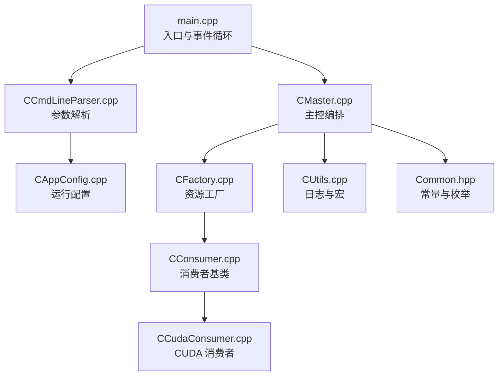
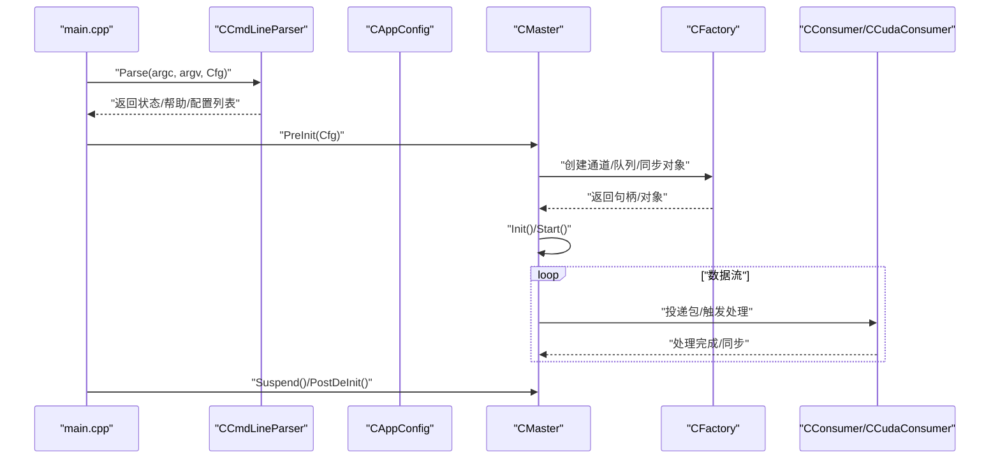
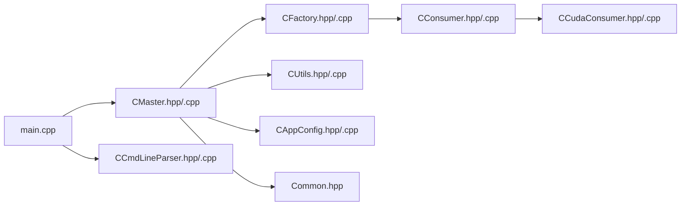

# 代码贡献规范

<cite>
**本文引用的文件**
- [README.md](file://README.md)
- [Makefile](file://Makefile)
- [Common.hpp](file://Common.hpp)
- [main.cpp](file://main.cpp)
- [CAppConfig.hpp](file://CAppConfig.hpp)
- [CAppConfig.cpp](file://CAppConfig.cpp)
- [CCmdLineParser.hpp](file://CCmdLineParser.hpp)
- [CCmdLineParser.cpp](file://CCmdLineParser.cpp)
- [CMaster.hpp](file://CMaster.hpp)
- [CMaster.cpp](file://CMaster.cpp)
- [CConsumer.hpp](file://CConsumer.hpp)
- [CCudaConsumer.hpp](file://CCudaConsumer.hpp)
- [CFactory.hpp](file://CFactory.hpp)
- [CUtils.hpp](file://CUtils.hpp)
</cite>

## 目录
1. [引言](#引言)
2. [项目结构](#项目结构)
3. [核心组件](#核心组件)
4. [架构总览](#架构总览)
5. [详细组件分析](#详细组件分析)
6. [依赖关系分析](#依赖关系分析)
7. [性能与并发注意事项](#性能与并发注意事项)
8. [单元测试规范](#单元测试规范)
9. [代码注释与文档规范](#代码注释与文档规范)
10. [代码审查检查清单](#代码审查检查清单)
11. [Git 工作流与分支管理策略](#git-工作流与分支管理策略)
12. [故障排查指南](#故障排查指南)
13. [结论](#结论)

## 引言
本规范旨在为本项目提供统一、可维护、可扩展的代码贡献指南，覆盖 C++14 编码标准与命名约定、注释规范、单元测试编写与覆盖率要求、代码审查检查要点、以及 Git 分支与协作流程。所有贡献者应遵循本规范以确保代码质量、一致性和可读性。

## 项目结构
该项目采用按职责分层与功能模块结合的组织方式：
- 入口与主流程：main.cpp 负责命令行解析、信号处理、主线程事件循环与生命周期管理。
- 配置与参数：CAppConfig 提供运行时配置项；CCmdLineParser 解析命令行参数并校验。
- 核心编排：CMaster 负责初始化、启动、暂停/恢复、销毁等主控流程。
- 消费者体系：CConsumer 及其派生（如 CCudaConsumer）负责数据消费、缓冲区映射、同步对象注册与处理。
- 工厂与资源：CFactory 统一创建生产者、消费者、队列、多播块、IPC/C2C 等资源。
- 工具与日志：CUtils 提供错误检查宏、日志封装与通用工具类型。

图表来源
- [main.cpp:253-304](file://main.cpp#L253-L304)
- [CCmdLineParser.cpp:13-208](file://CCmdLineParser.cpp#L13-L208)
- [CAppConfig.cpp:21-75](file://CAppConfig.cpp#L21-L75)
- [CMaster.cpp:164-182](file://CMaster.cpp#L164-L182)
- [CConsumer.hpp:16-44](file://CConsumer.hpp#L16-L44)
- [CCudaConsumer.hpp:25-81](file://CCudaConsumer.hpp#L25-L81)
- [CFactory.hpp:27-95](file://CFactory.hpp#L27-L95)
- [CUtils.hpp:28-311](file://CUtils.hpp#L28-L311)
- [Common.hpp:9-87](file://Common.hpp#L9-L87)

章节来源
- [README.md:11-109](file://README.md#L11-L109)
- [Makefile:13-17](file://Makefile#L13-L17)

## 核心组件
- 命令行解析器 CCmdLineParser：负责解析运行参数、显示帮助与平台配置列表，并进行参数合法性校验。
- 应用配置 CAppConfig：封装运行时配置项（通信类型、实体类型、消费者类型、队列类型、显示模式、帧过滤、运行时长、多元素等），并提供平台配置选择与分辨率查询。
- 主控 CMaster：负责模块初始化、通道创建与连接、展示通道初始化、暂停/恢复、销毁等生命周期管理。
- 消费者 CConsumer 及 CCudaConsumer：抽象消费者接口与 CUDA 消费者实现，负责缓冲区映射、同步对象注册、数据处理与推理（在支持平台上）。
- 工厂 CFactory：集中创建生产者、消费者、队列、多播块、IPC/C2C 端点等资源，屏蔽跨进程/跨芯片细节。
- 工具与日志 CUtils：提供统一的日志宏、错误检查宏、缓冲属性填充等工具。

章节来源
- [CCmdLineParser.hpp:34-44](file://CCmdLineParser.hpp#L34-L44)
- [CAppConfig.hpp:19-83](file://CAppConfig.hpp#L19-L83)
- [CMaster.hpp:47-92](file://CMaster.hpp#L47-L92)
- [CConsumer.hpp:16-44](file://CConsumer.hpp#L16-L44)
- [CCudaConsumer.hpp:25-81](file://CCudaConsumer.hpp#L25-L81)
- [CFactory.hpp:27-95](file://CFactory.hpp#L27-L95)
- [CUtils.hpp:28-311](file://CUtils.hpp#L28-L311)

## 架构总览
系统采用“主控编排 + 工厂创建 + 消费者处理”的分层架构：
- main.cpp 启动并驱动事件循环，调用 CMaster 完成预初始化、启动、暂停/恢复、后清理。
- CMaster 通过 CFactory 创建通道、队列、同步对象与展示通道，协调各传感器输出。
- 消费者从队列取包，完成缓冲区映射、处理与同步，必要时进行推理或转存。

图表来源
- [main.cpp:253-304](file://main.cpp#L253-L304)
- [CCmdLineParser.cpp:13-208](file://CCmdLineParser.cpp#L13-L208)
- [CAppConfig.cpp:21-75](file://CAppConfig.cpp#L21-L75)
- [CMaster.cpp:164-182](file://CMaster.cpp#L164-L182)
- [CFactory.hpp:36-76](file://CFactory.hpp#L36-L76)
- [CConsumer.hpp:25-36](file://CConsumer.hpp#L25-L36)
- [CCudaConsumer.hpp:35-50](file://CCudaConsumer.hpp#L35-L50)

## 详细组件分析

### 命令行解析组件 CCmdLineParser
- 功能：解析短/长选项，设置运行配置，显示帮助与平台配置列表，校验参数范围与互斥关系。
- 关键点：
  - 使用 getopt_long 解析参数，对动态/静态平台配置、掩码、显示模式、队列类型、帧过滤、运行时长、多元素、延迟接入等进行赋值与校验。
  - 对非法参数返回错误状态，避免后续流程执行。
- 建议：
  - 新增选项时保持短/长选项一致性，完善帮助信息与边界条件校验。

章节来源
- [CCmdLineParser.hpp:34-44](file://CCmdLineParser.hpp#L34-L44)
- [CCmdLineParser.cpp:13-208](file://CCmdLineParser.cpp#L13-L208)
- [CCmdLineParser.cpp:238-313](file://CCmdLineParser.cpp#L238-L313)

### 应用配置组件 CAppConfig
- 功能：提供运行时配置访问器，根据动态/静态平台配置生成平台参数，查询分辨率与传感器格式。
- 关键点：
  - 支持动态平台配置（通过查询库）与静态配置（硬编码平台）。
  - 提供分辨率查询与 YUV 传感器判断，便于下游组件适配。
- 建议：
  - 平台配置变更时同步更新默认值与校验范围。

章节来源
- [CAppConfig.hpp:19-83](file://CAppConfig.hpp#L19-L83)
- [CAppConfig.cpp:21-75](file://CAppConfig.cpp#L21-L75)
- [CAppConfig.cpp:77-109](file://CAppConfig.cpp#L77-L109)

### 主控组件 CMaster
- 功能：初始化/启动/暂停/恢复/销毁，创建展示通道与多路复用，管理监控线程与电源管理状态。
- 关键点：
  - 通过 CFactory 创建通道与队列，连接并协调多传感器输出。
  - 支持展示拼接与 DP-MST 显示控制器集成。
- 建议：
  - 在关键路径增加日志与状态检查，确保异常路径可恢复。

章节来源
- [CMaster.hpp:47-92](file://CMaster.hpp#L47-L92)
- [CMaster.cpp:164-182](file://CMaster.cpp#L164-L182)
- [CMaster.cpp:50-122](file://CMaster.cpp#L50-L122)
- [CMaster.cpp:124-162](file://CMaster.cpp#L124-L162)

### 消费者组件 CConsumer 与 CCudaConsumer
- 功能：抽象消费者接口与 CUDA 消费者实现，负责缓冲区映射、同步对象注册、数据处理与推理。
- 关键点：
  - CConsumer 提供通用处理流程与虚接口，派生类实现具体处理逻辑。
  - CCudaConsumer 实现 CUDA 设备初始化、缓冲区转换、外部内存/信号量绑定、可选推理。
- 建议：
  - 处理流程中严格检查返回状态，失败时及时释放资源并上报。

章节来源
- [CConsumer.hpp:16-44](file://CConsumer.hpp#L16-L44)
- [CCudaConsumer.hpp:25-81](file://CCudaConsumer.hpp#L25-L81)

### 工厂组件 CFactory
- 功能：集中创建生产者、消费者、队列、多播块、IPC/C2C 端点等资源。
- 关键点：
  - 提供统一的创建接口，屏蔽不同通信类型（进程内/进程间/跨芯片）差异。
- 建议：
  - 对创建失败进行统一错误处理与日志记录。

章节来源
- [CFactory.hpp:27-95](file://CFactory.hpp#L27-L95)

### 工具与日志 CUtils
- 功能：提供日志宏、错误检查宏、缓冲属性填充、单例日志器等。
- 关键点：
  - 统一日志风格与级别控制，便于调试与问题定位。
- 建议：
  - 新增宏时保持命名一致与语义清晰。

章节来源
- [CUtils.hpp:28-311](file://CUtils.hpp#L28-L311)

## 依赖关系分析
- 编译标准：使用 C++14 标准与启用异常与 RTTI。
- 外部库：依赖 NvSIPL、NvMedia、NvSci、CUDA/cuDLA、OpenWFD 等。
- 内部模块：main 依赖 CMaster 与 CCmdLineParser；CMaster 依赖 CFactory、CConsumer、CUtils；CFactory 依赖各组件头文件。

图表来源
- [Makefile:13-17](file://Makefile#L13-L17)
- [main.cpp:253-304](file://main.cpp#L253-L304)
- [CMaster.cpp:164-182](file://CMaster.cpp#L164-L182)
- [CFactory.hpp:27-95](file://CFactory.hpp#L27-L95)
- [CConsumer.hpp:16-44](file://CConsumer.hpp#L16-L44)
- [CCudaConsumer.hpp:25-81](file://CCudaConsumer.hpp#L25-L81)
- [CAppConfig.cpp:21-75](file://CAppConfig.cpp#L21-L75)
- [Common.hpp:9-87](file://Common.hpp#L9-L87)

章节来源
- [Makefile:13-17](file://Makefile#L13-L17)

## 性能与并发注意事项
- 日志级别：通过配置调整日志级别，避免在高频路径中产生过多 I/O。
- 线程模型：主线程负责事件循环与信号处理；消费者线程负责数据处理；监控线程负责状态管理。
- 同步与缓冲：使用 NvSciBuf/NvSciSync 进行跨模块/跨进程同步，注意 Fence 与外部内存/信号量的正确绑定与释放。
- 资源管理：在异常路径中确保资源释放，避免泄漏。

[本节为通用指导，不直接分析具体文件]

## 单元测试规范
- 测试框架建议：使用 C++ 单元测试框架（如 GoogleTest），针对关键模块（CAppConfig、CCmdLineParser、CFactory、CUtils）编写测试。
- 测试用例设计原则：
  - 输入覆盖：边界值、异常输入、非法组合（如动态/静态配置互斥、帧过滤范围、消费者数量范围）。
  - 行为验证：配置解析正确性、平台配置选择、日志级别设置、错误返回码。
  - 并发与资源：模拟多线程场景下的日志写入与状态切换。
- 测试覆盖率要求：
  - 函数级覆盖率：目标≥80%，关键路径≥90%。
  - 分支覆盖率：主要分支≥90%，异常分支充分覆盖。
- 回归测试：新增功能需附带回归用例，确保不破坏既有行为。

[本节为通用指导，不直接分析具体文件]

## 代码注释与文档规范
- 文件头注释：每个 .hpp/.cpp 文件顶部保留版权声明与简要用途说明。
- 类与接口注释：类、接口、公共方法需提供简要说明，描述职责、输入输出与异常情况。
- 复杂逻辑注释：关键算法、状态机、资源管理流程需提供步骤说明与边界条件。
- 日志注释：高频路径的日志调用需明确级别与上下文，避免冗余输出。
- 命名约定（C++14）：
  - 类名：帕斯卡命名（如 CAppConfig、CCmdLineParser）
  - 函数名：驼峰命名（如 PreInit、GetPlatformCfg）
  - 变量名：驼峰命名（如 m_uVerbosity、m_pAppConfig）
  - 宏与常量：全大写下划线（如 MAX_NUM_CONSUMERS、NVSIPL_STATUS_OK）
  - 前缀：私有成员使用 m_ 前缀，指针使用 p 前缀，智能指针使用 up/sp 前缀
- 注释风格：优先使用行内注释解释“为什么”而非“是什么”，复杂流程分段注释。

章节来源
- [CAppConfig.hpp:19-83](file://CAppConfig.hpp#L19-L83)
- [CCmdLineParser.hpp:34-44](file://CCmdLineParser.hpp#L34-L44)
- [CConsumer.hpp:16-44](file://CConsumer.hpp#L16-L44)
- [CCudaConsumer.hpp:25-81](file://CCudaConsumer.hpp#L25-L81)
- [CUtils.hpp:28-311](file://CUtils.hpp#L28-L311)

## 代码审查检查清单
- 编码标准与命名
  - 是否符合 C++14 规范与命名约定
  - 是否使用一致的前缀与大小写风格
- 错误处理
  - 是否对所有外部调用进行状态检查
  - 是否在异常路径中释放资源
- 并发与线程安全
  - 是否存在竞态条件
  - 是否正确使用原子变量与同步原语
- 内存管理
  - 是否使用智能指针管理生命周期
  - 是否避免裸 new/delete
- 日志与可观测性
  - 日志级别是否合理
  - 是否包含足够的上下文信息
- 异常与健壮性
  - 是否处理边界条件与非法输入
  - 是否提供降级或忽略错误的开关
- 性能与资源
  - 是否避免不必要的拷贝与锁竞争
  - 是否正确使用缓存与对齐

[本节为通用指导，不直接分析具体文件]

## Git 工作流与分支管理策略
- 分支策略
  - main：稳定发布分支，仅合并来自 develop 的版本化提交
  - develop：开发主分支，合并功能分支与修复
  - feature/*：功能开发分支，基于 develop 创建，完成后合并回 develop
  - hotfix/*：紧急修复分支，基于 main 创建，修复后同时合并回 develop
- 提交规范
  - 标题：简明描述，首字母大写，不超过 50 字
  - 正文：说明动机、变化内容与影响，必要时附带测试结果
- 合并与审查
  - 所有合并必须通过 Pull Request 并至少一次代码审查
  - 合并前确保通过构建与测试

[本节为通用指导，不直接分析具体文件]

## 故障排查指南
- 常见问题
  - 参数非法：检查帧过滤范围、消费者数量、动态/静态配置互斥
  - 平台配置：确认静态/动态配置名称与掩码匹配
  - 资源初始化：关注 NvSciBuf/NvSciSync 初始化与连接事件
- 排查步骤
  - 提升日志级别到调试，观察进入/退出关键函数
  - 检查返回状态与错误码，定位失败点
  - 在异常路径打印上下文信息并确保资源释放
- 相关实现参考
  - 日志宏与错误检查宏定义
  - 信号处理与事件循环
  - 参数解析与配置选择

章节来源
- [CUtils.hpp:28-311](file://CUtils.hpp#L28-L311)
- [main.cpp:37-72](file://main.cpp#L37-L72)
- [CCmdLineParser.cpp:13-208](file://CCmdLineParser.cpp#L13-L208)
- [CAppConfig.cpp:21-75](file://CAppConfig.cpp#L21-L75)

## 结论
本规范总结了本项目的编码标准、命名约定、注释与测试要求、代码审查要点以及 Git 工作流。请在贡献代码时严格遵循，以保证系统的稳定性、可维护性与可扩展性。