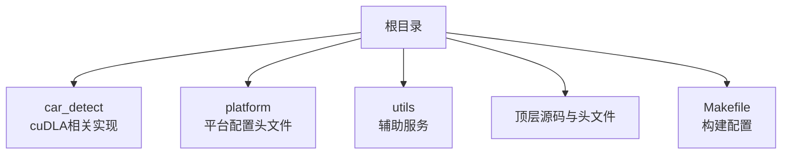
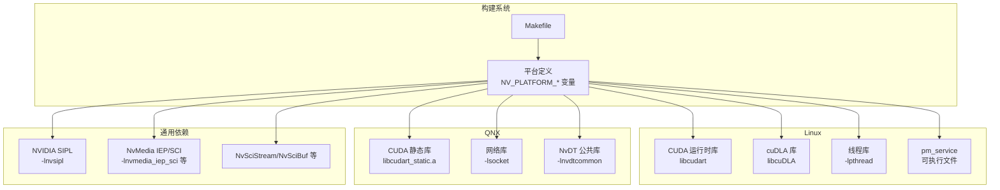
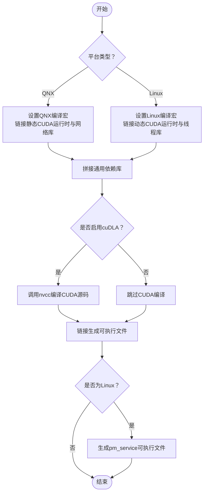
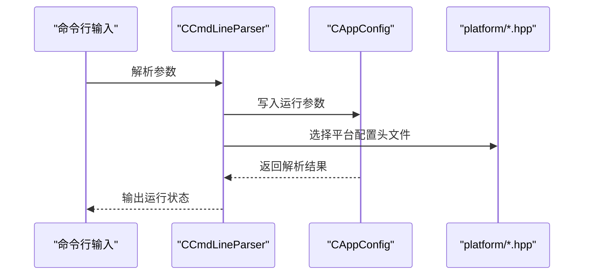
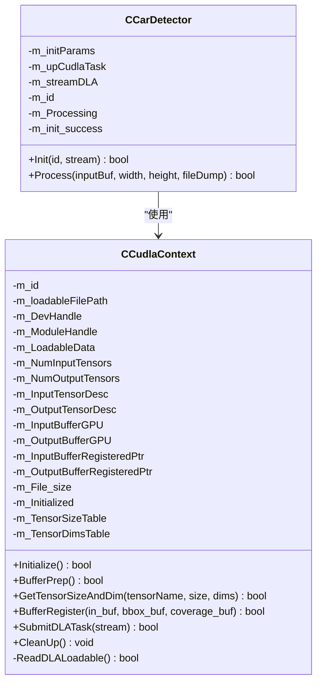
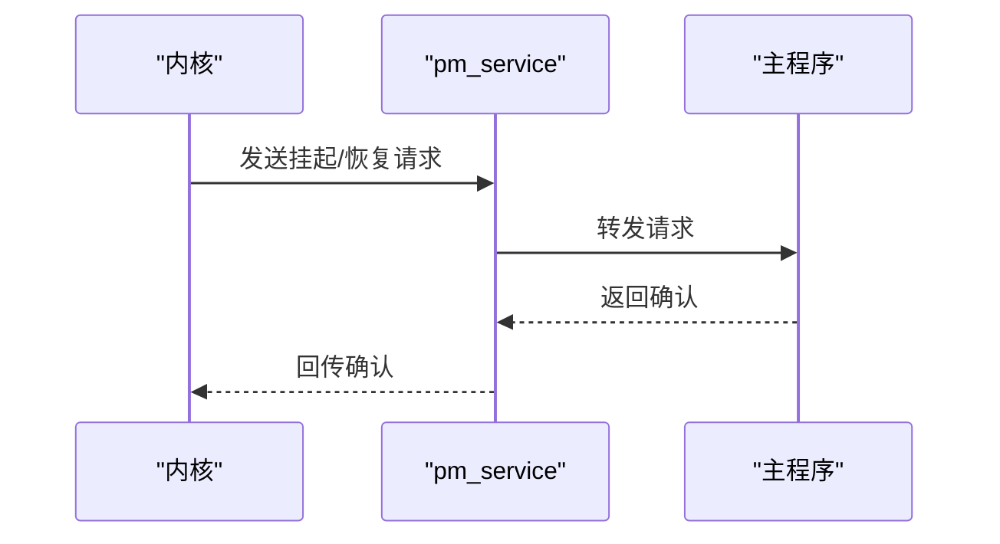
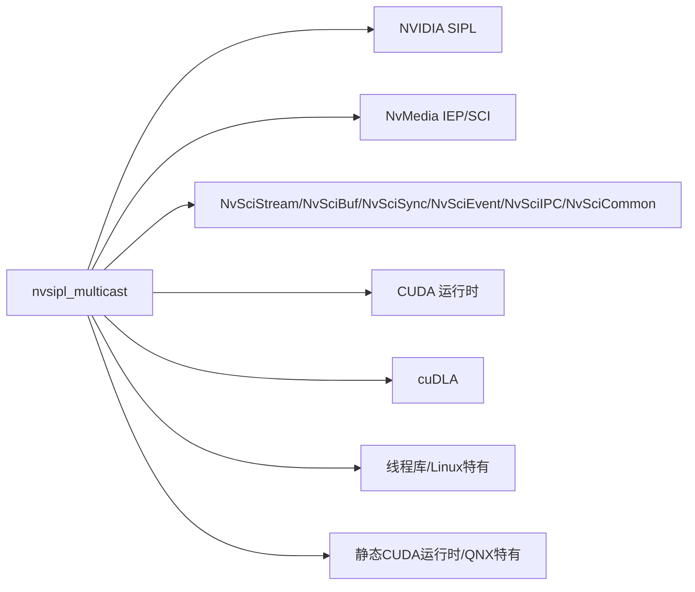

# 开发环境搭建

<cite>
**本文引用的文件**
- [README.md](file://README.md)
- [ReleaseNote.md](file://ReleaseNote.md)
- [Makefile](file://Makefile)
- [main.cpp](file://main.cpp)
- [Common.hpp](file://Common.hpp)
- [CAppConfig.hpp](file://CAppConfig.hpp)
- [CCmdLineParser.hpp](file://CCmdLineParser.hpp)
- [car_detect/CCarDetector.hpp](file://car_detect/CCarDetector.hpp)
- [car_detect/CCudlaContext.hpp](file://car_detect/CCudlaContext.hpp)
- [platform/ar0820.hpp](file://platform/ar0820.hpp)
- [utils/pm_service.cpp](file://utils/pm_service.cpp)
</cite>

## 目录
1. [简介](#简介)
2. [项目结构](#项目结构)
3. [核心组件](#核心组件)
4. [架构总览](#架构总览)
5. [详细组件分析](#详细组件分析)
6. [依赖关系分析](#依赖关系分析)
7. [性能考虑](#性能考虑)
8. [故障排查指南](#故障排查指南)
9. [结论](#结论)
10. [附录](#附录)

## 简介
本指南面向在NVIDIA Jetson平台上进行开发与部署的工程师，围绕本仓库提供的多播示例工程，系统性地说明开发环境的搭建流程，涵盖以下方面：
- 在Linux与QNX标准操作系统上的环境配置差异
- CUDA工具包、cuDLA SDK、NVIDIA SIPL库及相关依赖的安装与版本要求
- Makefile中的编译选项与链接库配置说明
- 交叉编译环境的设置要点
- 常见环境配置问题与解决方案
- 验证环境配置正确性的测试方法

该工程展示了通过NvStreams实现摄像头输出到多个消费者的典型用法，支持CUDA消费者、编码消费者、显示消费者以及可选的cuDLA目标检测功能。

章节来源
- [README.md:11-109](file://README.md#L11-L109)

## 项目结构
本工程采用按功能模块组织的目录结构，主要模块如下：
- 根目录：顶层入口、主程序、公共头文件与构建脚本
- car_detect：基于cuDLA的目标检测相关实现（仅在非QNX环境下编译）
- platform：平台配置头文件，定义传感器、CSI端口、SerDes等硬件参数
- utils：辅助服务（如电源管理事件通知）

章节来源
- [Makefile:1-105](file://Makefile#L1-L105)
- [README.md:11-109](file://README.md#L11-L109)

## 核心组件
本节从环境配置角度梳理与构建直接相关的核心组件与接口：

- 构建系统与编译器选项
  - 使用顶层的构建定义文件引入平台相关宏与路径变量
  - 编译标准为C++14，启用异常与RTTI，使用位置无关代码
  - 条件编译区分安全OS与非安全OS，影响链接库与查询能力

- 链接库清单
  - 必需库：NVIDIA SIPL、NvMedia IEP/SCI、NvSciStream、NvMedia2D、NvSciBuf、NvSciSync、NvSciEvent、NvSciIPC、NvSciCommon
  - CUDA相关：CUDA运行时（动态/静态）、cuDLA（仅非QNX）
  - QNX特有：静态CUDA运行时、网络库
  - Linux特有：线程库、可选的cuDLA、pm_service可执行文件

- 平台配置与命令行解析
  - 平台配置以头文件形式提供，包含CSI端口、SerDes、传感器等硬件信息
  - 命令行解析器负责解析运行模式、通信类型、队列类型、消费者类型等参数

- 车道检测（cuDLA）能力
  - 仅在非QNX环境下编译，需要CUDA与cuDLA支持
  - 提供上下文初始化、张量描述查询、缓冲区注册与任务提交等接口

章节来源
- [Makefile:9-105](file://Makefile#L9-L105)
- [CAppConfig.hpp:19-83](file://CAppConfig.hpp#L19-L83)
- [CCmdLineParser.hpp:34-47](file://CCmdLineParser.hpp#L34-L47)
- [car_detect/CCarDetector.hpp:17-34](file://car_detect/CCarDetector.hpp#L17-L34)
- [car_detect/CCudlaContext.hpp:22-60](file://car_detect/CCudlaContext.hpp#L22-L60)
- [platform/ar0820.hpp:14-186](file://platform/ar0820.hpp#L14-L186)

## 架构总览
下图展示跨平台构建的关键差异与依赖关系，帮助理解在不同操作系统上如何配置编译与链接。

图表来源
- [Makefile:13-17](file://Makefile#L13-L17)
- [Makefile:44-78](file://Makefile#L44-L78)
- [Makefile:58-67](file://Makefile#L58-L67)
- [Makefile:95-99](file://Makefile#L95-L99)

## 详细组件分析

### 组件A：Makefile编译与链接配置
- 关键点
  - 引入平台定义文件，统一获取编译器标志、包含路径与库路径
  - 安全OS与非安全OS条件分支，决定是否链接查询库与是否启用某些特性
  - 非QNX平台启用cuDLA相关对象与内核编译规则
  - Linux平台额外生成pm_service可执行文件用于电源管理事件通知

- 编译选项与链接库说明
  - CXXFLAGS/CPPFLAGS/LDFLAGS：由平台定义文件注入，确保与目标设备一致
  - LDLIBS：按平台拼接必需库；QNX使用静态CUDA运行时与网络库；Linux使用动态CUDA运行时与线程库
  - NVCC：非QNX平台使用nvcc编译CUDA源码，指定目标位宽与包含路径

- 交叉编译建议
  - 设置NV_PLATFORM_*变量指向交叉编译工具链与目标系统路径
  - 确保CUDA工具包与cuDLA SDK在交叉编译环境中可用且版本匹配
  - 对于QNX，准备静态CUDA运行时与网络库；对于Linux，准备动态CUDA运行时与线程库

图表来源
- [Makefile:13-17](file://Makefile#L13-L17)
- [Makefile:44-78](file://Makefile#L44-L78)
- [Makefile:58-67](file://Makefile#L58-L67)
- [Makefile:87-90](file://Makefile#L87-L90)
- [Makefile:95-99](file://Makefile#L95-L99)

章节来源
- [Makefile:9-105](file://Makefile#L9-L105)

### 组件B：命令行解析与平台配置
- 命令行解析器负责解析运行模式、通信类型、队列类型、消费者类型、平台配置等参数
- 平台配置以头文件形式提供，包含传感器型号、CSI端口、SerDes、分辨率、帧率等硬件细节
- 不同平台配置头文件可按需切换，以适配不同的硬件组合

图表来源
- [CCmdLineParser.hpp:34-47](file://CCmdLineParser.hpp#L34-L47)
- [CAppConfig.hpp:19-83](file://CAppConfig.hpp#L19-L83)
- [platform/ar0820.hpp:14-186](file://platform/ar0820.hpp#L14-L186)

章节来源
- [CCmdLineParser.hpp:34-47](file://CCmdLineParser.hpp#L34-L47)
- [CAppConfig.hpp:19-83](file://CAppConfig.hpp#L19-L83)
- [platform/ar0820.hpp:14-186](file://platform/ar0820.hpp#L14-L186)

### 组件C：cuDLA目标检测（非QNX）
- 功能概述
  - 提供初始化、缓冲区准备、张量尺寸与维度查询、缓冲区注册、任务提交与清理等接口
  - 支持在CUDA流中提交推理任务，便于与视频处理流水线集成

- 依赖与版本
  - 需要CUDA工具包与cuDLA SDK支持
  - 仅在非QNX平台编译与链接

图表来源
- [car_detect/CCarDetector.hpp:17-34](file://car_detect/CCarDetector.hpp#L17-L34)
- [car_detect/CCudlaContext.hpp:22-60](file://car_detect/CCudlaContext.hpp#L22-L60)

章节来源
- [car_detect/CCarDetector.hpp:17-34](file://car_detect/CCarDetector.hpp#L17-L34)
- [car_detect/CCudlaContext.hpp:22-60](file://car_detect/CCudlaContext.hpp#L22-L60)

### 组件D：电源管理事件服务（Linux）
- 功能概述
  - 提供Unix域套接字监听与响应，接收来自内核的挂起/恢复请求，并向客户端回传确认
  - 与主程序配合，支持SC7启动模式下的事件驱动行为

- 交互流程
  - 启动后绑定Unix域套接字，接受客户端连接
  - 接收内核通过Netlink发送的挂起/恢复请求，转发给客户端并等待确认
  - 将确认结果回传内核

图表来源
- [utils/pm_service.cpp:261-274](file://utils/pm_service.cpp#L261-L274)
- [utils/pm_service.cpp:220-259](file://utils/pm_service.cpp#L220-L259)
- [utils/pm_service.cpp:80-137](file://utils/pm_service.cpp#L80-L137)

章节来源
- [utils/pm_service.cpp:34-163](file://utils/pm_service.cpp#L34-L163)
- [utils/pm_service.cpp:165-219](file://utils/pm_service.cpp#L165-L219)
- [utils/pm_service.cpp:220-259](file://utils/pm_service.cpp#L220-L259)
- [utils/pm_service.cpp:261-274](file://utils/pm_service.cpp#L261-L274)

## 依赖关系分析
- 库依赖总览
  - NVIDIA SIPL：核心流媒体框架
  - NvMedia IEP/SCI：图像处理与同步
  - NvSciStream/NvSciBuf/NvSciSync/NvSciEvent/NvSciIPC/NvSciCommon：跨组件同步与通信
  - CUDA/cuDLa：GPU计算与推理加速
  - QNX/Linux特定库：网络、线程、静态CUDA运行时等

- 版本与兼容性提示
  - 工程版本与驱动OS版本存在对应关系，建议参考发布说明选择匹配的驱动版本
  - cuDLA推理引擎的加载文件格式与输入/输出数据格式需与模型构建工具一致

图表来源
- [Makefile:44-78](file://Makefile#L44-L78)
- [Makefile:58-67](file://Makefile#L58-L67)
- [ReleaseNote.md:11-118](file://ReleaseNote.md#L11-L118)

章节来源
- [Makefile:44-78](file://Makefile#L44-L78)
- [Makefile:58-67](file://Makefile#L58-L67)
- [ReleaseNote.md:11-118](file://ReleaseNote.md#L11-L118)

## 性能考虑
- 缓冲区与同步
  - 合理设置队列类型与元素数量，避免过度阻塞
  - 利用NvSciBuf/NvSciSync减少CPU轮询，提升吞吐
- GPU推理
  - cuDLA任务应与视频处理流水线在同一CUDA流中调度，降低数据拷贝开销
  - 输入/输出张量的数据布局与对齐需满足模型要求，避免额外转换
- 显示与拼接
  - 多相机拼接可能带来显著计算压力，建议根据实际相机数量调整策略

[本节为通用指导，不涉及具体文件分析]

## 故障排查指南
- 构建失败（找不到CUDA/cuDLa库）
  - 检查NV_PLATFORM_CUDA_TOOLKIT与NV_PLATFORM_*变量是否指向正确的交叉编译环境
  - 确认非QNX平台已安装CUDA工具包与cuDLA SDK，并且路径正确
- 链接错误（符号未定义）
  - 确认所有必需库均已添加至LDLIBS，特别是QNX平台的静态CUDA运行时与网络库
  - 核对安全OS与非安全OS的条件编译开关
- 运行时错误（cuDLA相关）
  - 确认加载的推理引擎文件与输入/输出数据格式一致
  - 检查张量尺寸与维度查询接口返回值
- 电源管理事件无响应
  - 确认pm_service已在Linux环境下运行并监听Unix域套接字
  - 检查内核Netlink消息是否正确发送与接收

章节来源
- [Makefile:58-67](file://Makefile#L58-L67)
- [Makefile:68-82](file://Makefile#L68-L82)
- [utils/pm_service.cpp:51-78](file://utils/pm_service.cpp#L51-L78)
- [utils/pm_service.cpp:220-259](file://utils/pm_service.cpp#L220-L259)

## 结论
通过本指南，您可以在Linux与QNX标准操作系统上完成NVIDIA Jetson平台的开发环境搭建，正确配置CUDA工具包、cuDLA SDK与NVIDIA SIPL库，并依据Makefile中的编译与链接规则完成构建。同时，结合命令行参数与平台配置头文件，可灵活适配多种硬件组合。遇到问题时，可依据故障排查指南快速定位并解决。

[本节为总结性内容，不涉及具体文件分析]

## 附录

### A. 开发环境搭建步骤（概览）
- 准备工作
  - 安装与目标设备匹配的驱动OS与SDK
  - 准备交叉编译工具链（如适用）
- 安装CUDA工具包与cuDLA SDK
  - 在Linux与QNX目标系统上分别安装对应版本
  - 确保路径变量NV_PLATFORM_CUDA_TOOLKIT正确指向安装目录
- 配置Makefile平台变量
  - 设置NV_PLATFORM_*系列变量，确保包含路径与库路径正确
  - 根据目标OS选择合适的编译与链接策略
- 构建工程
  - 执行默认目标生成主程序
  - 在Linux平台可额外生成pm_service可执行文件
- 验证环境
  - 运行主程序查看帮助与版本信息
  - 使用示例命令验证各消费者功能（CUDA、编码、显示、cuDLA）

章节来源
- [README.md:16-109](file://README.md#L16-L109)
- [Makefile:9-105](file://Makefile#L9-L105)

### B. 常用命令与参数速查
- 查看帮助与版本
  - 查看帮助：./nvsipl_multicast -h
  - 查看版本：./nvsipl_multicast -V
- 基本用法
  - 单进程内联处理：./nvsipl_multicast
  - 指定平台配置：./nvsipl_multicast -t 平台名 或 ./nvsipl_multicast -g 动态配置 -m "掩码"
- 消费者类型
  - CUDA消费者：./nvsipl_multicast -c "cuda"
  - 编码消费者：./nvsipl_multicast -c "enc"
  - 显示消费者：./nvsipl_multicast -d
  - 启用多ISP输出：./nvsipl_multicast -e
- cuDLA目标检测
  - 启用CUDA推理：./nvsipl_multicast -c "cuda_inf"
  - 生成推理引擎文件：使用trtexec生成FP16格式的引擎文件

章节来源
- [README.md:16-109](file://README.md#L16-L109)