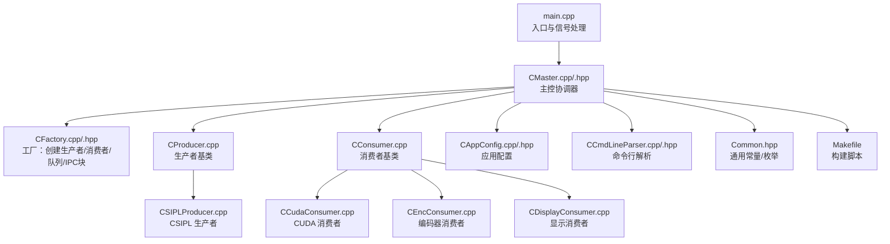
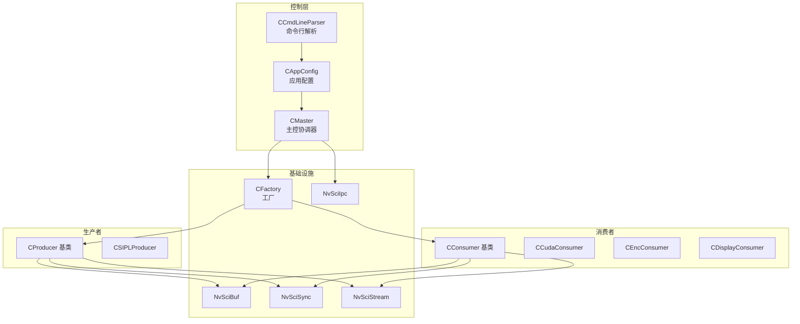
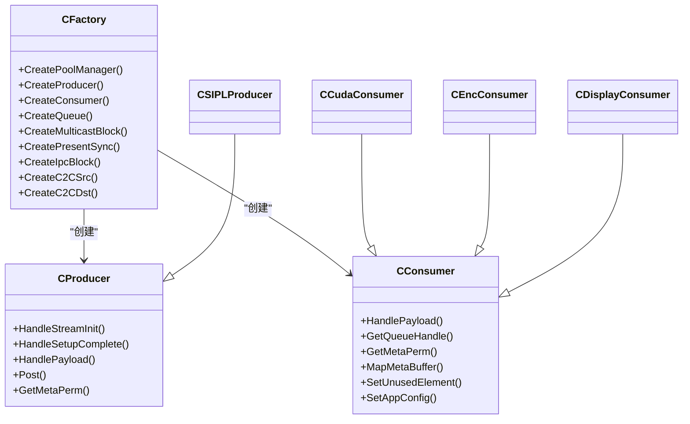
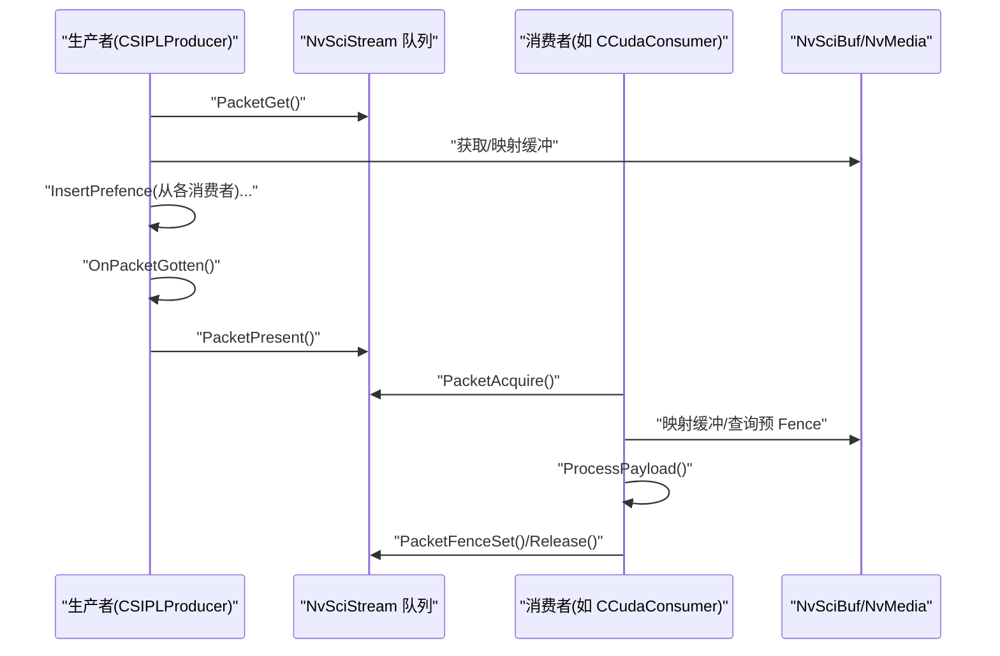
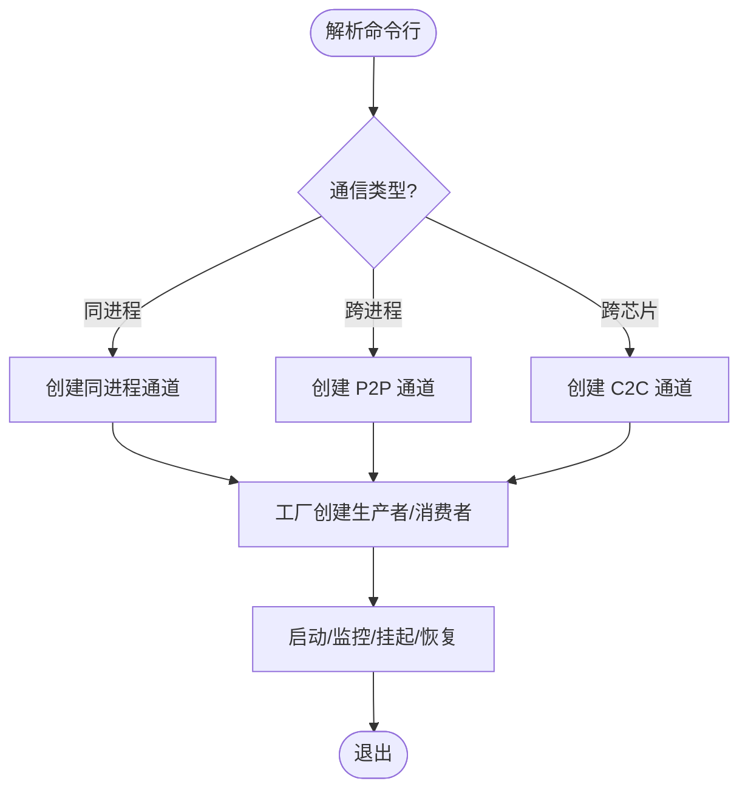
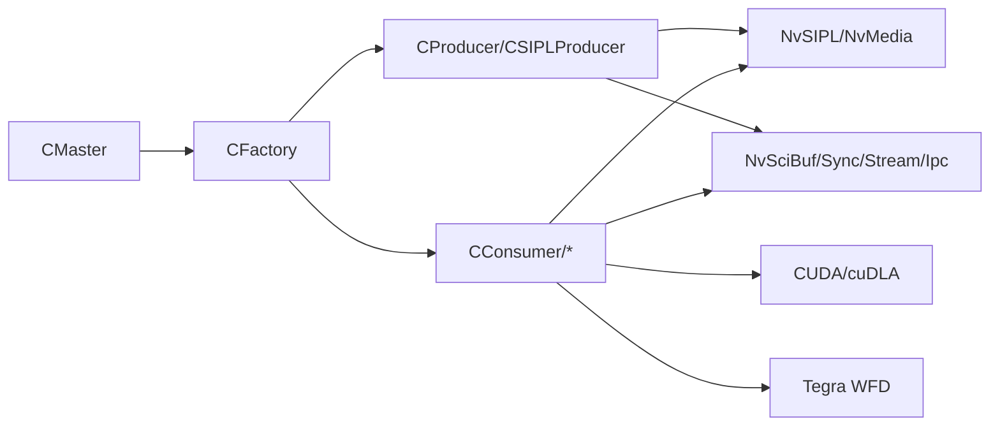

# 开发者指南

<cite>
**本文引用的文件**   
- [README.md](file://README.md)
- [main.cpp](file://main.cpp)
- [CMaster.hpp](file://CMaster.hpp)
- [CMaster.cpp](file://CMaster.cpp)
- [CFactory.hpp](file://CFactory.hpp)
- [CFactory.cpp](file://CFactory.cpp)
- [CProducer.cpp](file://CProducer.cpp)
- [CConsumer.cpp](file://CConsumer.cpp)
- [CCmdLineParser.hpp](file://CCmdLineParser.hpp)
- [CCmdLineParser.cpp](file://CCmdLineParser.cpp)
- [CAppConfig.hpp](file://CAppConfig.hpp)
- [CAppConfig.cpp](file://CAppConfig.cpp)
- [Common.hpp](file://Common.hpp)
- [CEncConsumer.cpp](file://CEncConsumer.cpp)
- [CCudaConsumer.cpp](file://CCudaConsumer.cpp)
- [CDisplayConsumer.cpp](file://CDisplayConsumer.cpp)
- [CSIPLProducer.cpp](file://CSIPLProducer.cpp)
- [Makefile](file://Makefile)
</cite>

## 目录
1. [简介](#简介)
2. [项目结构](#项目结构)
3. [核心组件](#核心组件)
4. [架构总览](#架构总览)
5. [详细组件分析](#详细组件分析)
6. [依赖关系分析](#依赖关系分析)
7. [性能考量](#性能考量)
8. [故障排查指南](#故障排查指南)
9. [结论](#结论)
10. [附录](#附录)

## 简介
本指南面向开发者，提供从环境搭建到扩展开发的完整路径。项目基于 NvSIPL/NvMedia/NvSciStack 实现多路摄像头输出的多消费者多播分发，支持同进程、跨进程（P2P）与跨芯片（C2C）三种通信方式；消费者类型包括 CUDA、编码器（H.264）、显示与拼接等。文档覆盖：
- 开发环境与工具链
- 构建与运行
- 扩展机制：新增消费者类型与自定义生产者
- 调试与性能分析
- 常见场景与最佳实践

## 项目结构
项目采用“按职责分层+按功能模块组织”的结构，核心目录与文件如下：
- 根目录：入口程序、主控协调器、命令行解析、应用配置、通用常量与宏
- 消费者实现：CUDA、编码器、显示、拼接
- 生产者实现：CSIPL 生产者、显示生产者
- 工厂与通道：统一创建与连接管理
- 平台与相机：平台配置、相机接口封装
- 工具与服务：日志、性能统计、IPC/SC7 启动服务

图表来源
- [main.cpp:253-304](file://main.cpp#L253-L304)
- [CMaster.cpp:164-182](file://CMaster.cpp#L164-L182)
- [CFactory.cpp:68-94](file://CFactory.cpp#L68-L94)
- [CProducer.cpp:11-157](file://CProducer.cpp#L11-L157)
- [CConsumer.cpp:11-127](file://CConsumer.cpp#L11-L127)
- [CSIPLProducer.cpp:16-405](file://CSIPLProducer.cpp#L16-L405)
- [CCudaConsumer.cpp:11-492](file://CCudaConsumer.cpp#L11-L492)
- [CEncConsumer.cpp:12-356](file://CEncConsumer.cpp#L12-L356)
- [CDisplayConsumer.cpp:12-140](file://CDisplayConsumer.cpp#L12-L140)
- [CAppConfig.cpp:21-109](file://CAppConfig.cpp#L21-L109)
- [CCmdLineParser.cpp:13-313](file://CCmdLineParser.cpp#L13-L313)
- [Common.hpp:14-87](file://Common.hpp#L14-L87)
- [Makefile:1-105](file://Makefile#L1-L105)

章节来源
- [README.md:11-109](file://README.md#L11-L109)
- [Makefile:13-93](file://Makefile#L13-L93)

## 核心组件
- 入口与生命周期
  - main：初始化日志级别、解析参数、创建主控、启动/停止循环、信号处理与退出清理
  - CMaster：打开 NvSci 模块、创建通道与块、启动/停止流、监控线程、挂起/恢复
- 配置与命令行
  - CAppConfig：平台配置选择（静态/动态）、分辨率查询、传感器类型判断、运行开关
  - CCmdLineParser：参数解析、帮助信息、平台配置列表展示
- 工厂与通道
  - CFactory：统一创建生产者/消费者、队列、多播块、同步对象、IPC 块（含 C2C）
- 基类与具体实现
  - CProducer/CConsumer：NvSciStream 生命周期、事件处理、预/后置 Fence、帧计数与过滤
  - CSIPLProducer：映射 NvSIPL 输出类型到元素类型、注册缓冲与同步对象、生成 Post Fence
  - CCudaConsumer/CEncConsumer/CDisplayConsumer：各自数据/同步属性设置、缓冲映射、处理流程与落盘

章节来源
- [main.cpp:253-304](file://main.cpp#L253-L304)
- [CMaster.cpp:164-232](file://CMaster.cpp#L164-L232)
- [CAppConfig.cpp:21-109](file://CAppConfig.cpp#L21-L109)
- [CCmdLineParser.cpp:13-313](file://CCmdLineParser.cpp#L13-L313)
- [CFactory.cpp:68-205](file://CFactory.cpp#L68-L205)
- [CProducer.cpp:17-157](file://CProducer.cpp#L17-L157)
- [CConsumer.cpp:17-127](file://CConsumer.cpp#L17-L127)
- [CSIPLProducer.cpp:54-405](file://CSIPLProducer.cpp#L54-L405)
- [CCudaConsumer.cpp:55-492](file://CCudaConsumer.cpp#L55-L492)
- [CEncConsumer.cpp:17-356](file://CEncConsumer.cpp#L17-L356)
- [CDisplayConsumer.cpp:24-140](file://CDisplayConsumer.cpp#L24-L140)

## 架构总览
系统以 CMaster 为中心，负责根据通信类型（同进程/跨进程/跨芯片）创建相应通道，再由工厂创建生产者与消费者，使用 NvSciBuf/NvSciSync/NvSciStream/NvSciIpc 构建多播流水线。

图表来源
- [CMaster.cpp:45-91](file://CMaster.cpp#L45-L91)
- [CFactory.cpp:36-94](file://CFactory.cpp#L36-L94)
- [CProducer.cpp:17-31](file://CProducer.cpp#L17-L31)
- [CConsumer.cpp:17-39](file://CConsumer.cpp#L17-L39)

## 详细组件分析

### 组件A：工厂与扩展机制
- 设计要点
  - 单例工厂提供统一创建接口，屏蔽不同生产者/消费者类型的差异
  - 通过元素信息（ElementInfo）描述数据通路，支持多元素/多输出组合
  - 支持 FIFO/Mailbox 队列、多播块、PresentSync、IPC/C2C 通道
- 新增消费者类型步骤
  1) 在枚举中声明新类型（参考 ConsumerType）
  2) 在工厂中添加分支，创建对应消费者实例并设置元素信息
  3) 在消费者中实现数据/同步属性设置、缓冲映射、处理流程与落盘
  4) 如需显示/拼接，结合 WFD 控制器或拼接通道
- 自定义生产者
  - 继承 CProducer，实现 SetDataBufAttrList/SetSyncAttrList、MapDataBuffer、InsertPrefence、GetPostfence、OnPacketGotten
  - 映射用户元素类型到内部输出类型，注册缓冲与同步对象
  - 在主控中通过工厂创建并接入通道

图表来源
- [CFactory.hpp:27-92](file://CFactory.hpp#L27-L92)
- [CFactory.cpp:68-205](file://CFactory.cpp#L68-L205)
- [CProducer.cpp:11-157](file://CProducer.cpp#L11-L157)
- [CConsumer.cpp:11-127](file://CConsumer.cpp#L11-L127)
- [CSIPLProducer.cpp:16-405](file://CSIPLProducer.cpp#L16-L405)
- [CCudaConsumer.cpp:11-492](file://CCudaConsumer.cpp#L11-L492)
- [CEncConsumer.cpp:12-356](file://CEncConsumer.cpp#L12-L356)
- [CDisplayConsumer.cpp:12-140](file://CDisplayConsumer.cpp#L12-L140)

章节来源
- [CFactory.cpp:68-205](file://CFactory.cpp#L68-L205)
- [CFactory.hpp:27-92](file://CFactory.hpp#L27-L92)
- [Common.hpp:48-87](file://Common.hpp#L48-L87)

### 组件B：生产者与消费者数据流
- 关键流程
  - 初始化：查询消费者数量、初始所有权、等待同步对象
  - 流水线：消费者 Acquire/Prefence/处理/Postfence/Release；生产者 PacketGet/Prefence/Post/Present
  - 元素选择：根据配置启用/禁用特定元素，支持兄弟元素联动
- 错误处理
  - 使用统一状态码与错误宏，失败时记录日志并返回
  - 支持帧过滤、文件转储、性能统计

图表来源
- [CProducer.cpp:33-151](file://CProducer.cpp#L33-L151)
- [CConsumer.cpp:17-94](file://CConsumer.cpp#L17-L94)
- [CSIPLProducer.cpp:367-405](file://CSIPLProducer.cpp#L367-L405)
- [CCudaConsumer.cpp:386-462](file://CCudaConsumer.cpp#L386-L462)

章节来源
- [CProducer.cpp:17-157](file://CProducer.cpp#L17-L157)
- [CConsumer.cpp:17-127](file://CConsumer.cpp#L17-L127)
- [CSIPLProducer.cpp:367-405](file://CSIPLProducer.cpp#L367-L405)
- [CCudaConsumer.cpp:386-462](file://CCudaConsumer.cpp#L386-L462)

### 组件C：命令行与运行模式
- 运行模式
  - 同进程：单进程内生产者与多个消费者
  - 跨进程（P2P）：生产者/消费者分别在独立进程，通过 IPC 通道连接
  - 跨芯片（C2C）：源/目的通道硬编码，支持 IPC Src/Dst
- 常用选项
  - -p/-P：生产者驻留；-c/-C：消费者驻留及类型；-d：显示/拼接；-e：多元素；-f：文件转储；-k：帧过滤；-r：运行时长；-g/-m：动态平台配置与链接掩码；-L：延迟/重附加
- 版本与帮助
  - -V：打印版本；-h：打印帮助；-l：列出平台配置

图表来源
- [CCmdLineParser.cpp:13-208](file://CCmdLineParser.cpp#L13-L208)
- [CMaster.cpp:426-451](file://CMaster.cpp#L426-L451)
- [README.md:16-109](file://README.md#L16-L109)

章节来源
- [CCmdLineParser.cpp:13-313](file://CCmdLineParser.cpp#L13-L313)
- [CMaster.cpp:426-451](file://CMaster.cpp#L426-L451)
- [README.md:16-109](file://README.md#L16-L109)

## 依赖关系分析
- 外部库
  - NvSIPL/NvMedia/NvSciStack：图像采集、编码、缓冲与同步
  - CUDA/cuDLA：GPU/CPU 推理与内存映射
  - Tegra WFD：显示管线
- 内部模块
  - CMaster 统一调度；CFactory 抽象创建；CProducer/CConsumer 抽象数据流；具体实现按类型扩展

图表来源
- [Makefile:44-67](file://Makefile#L44-L67)
- [CMaster.cpp:50-62](file://CMaster.cpp#L50-L62)
- [CFactory.cpp:11-22](file://CFactory.cpp#L11-L22)

章节来源
- [Makefile:44-82](file://Makefile#L44-L82)
- [CMaster.cpp:50-62](file://CMaster.cpp#L50-L62)

## 性能考量
- 帧率监控
  - 主控周期性统计每传感器输出帧率，便于观察吞吐变化
- 缓冲与同步
  - 合理设置队列类型（FIFO/Mailbox），避免阻塞
  - 预 Fence/后 Fence 的正确插入与等待，减少 CPU 等待
- 文件转储与过滤
  - -f 开启转储，-k 设置帧过滤，降低 I/O 压力
- 多元素与多消费者
  - 多元素（ISP0/ISP1）可并行分流，但需注意资源竞争与带宽限制
- 延迟/重附加
  - 仅在 IPC 场景可用，动态调整消费者数量时需关注同步对象一致性

章节来源
- [CMaster.cpp:354-403](file://CMaster.cpp#L354-L403)
- [CConsumer.cpp:37-43](file://CConsumer.cpp#L37-L43)
- [CCmdLineParser.cpp:117-122](file://CCmdLineParser.cpp#L117-L122)
- [CFactory.cpp:138-151](file://CFactory.cpp#L138-L151)

## 故障排查指南
- 常见问题定位
  - 参数校验失败：检查 -g/-m、-n、-i、-k 等范围约束
  - 动态/静态平台配置冲突：二者不可同时设置
  - IPC/C2C 参数不一致：消费者会校验与生产者的一致性并退出
  - 帧过滤异常：范围应在 1-5
- 日志与信号
  - 通过 -v 设置详细程度；支持 SIGINT/SIGTERM/SIGQUIT/SIGHUP 优雅退出
  - 主控监控线程检测设备/管道错误并触发退出
- 调试建议
  - 启用调试日志，逐步缩小到具体通道/元素
  - 使用 -f 观察输出文件是否写入，确认消费者处理链路
  - 在延迟附加场景下，先启动早消费者，再附加晚消费者

章节来源
- [CCmdLineParser.cpp:184-207](file://CCmdLineParser.cpp#L184-L207)
- [main.cpp:44-72](file://main.cpp#L44-L72)
- [CMaster.cpp:382-400](file://CMaster.cpp#L382-L400)
- [README.md:72-91](file://README.md#L72-L91)

## 结论
本项目以工厂与基类抽象为核心，提供了清晰的扩展点：新增消费者类型只需实现数据/同步属性与处理流程；自定义生产者则需完成缓冲/同步注册与 Fence 管理。通过命令行与配置模块，系统支持多种运行模式与平台配置，配合性能监控与调试手段，可快速定位问题并优化性能。

## 附录

### A. 开发环境与工具链
- 必备库
  - NvSIPL/NvMedia/NvSciStack、CUDA、cuDNN、cuDLA（推理）
  - Tegra WFD（显示）
- 构建
  - 使用 Makefile，自动链接所需库；QNX 与 Linux 分支处理不同 CUDA 库与静态/动态链接
- IDE 设置
  - 建议启用 C++14、RTTI、异常支持
  - 包含路径：工程根目录、platform、car_detect（推理相关）

章节来源
- [Makefile:13-82](file://Makefile#L13-L82)
- [README.md:16-109](file://README.md#L16-L109)

### B. 代码贡献规范与最佳实践
- 代码风格
  - 类型与函数命名遵循现有风格（驼峰/前缀），保持一致性
  - 宏与常量集中于 Common.hpp，避免魔法值
- 注释与日志
  - 关键流程与错误路径添加日志；对外接口补充用途说明
- 测试要求
  - 新增消费者需验证：缓冲映射、预/后 Fence、帧过滤、文件转储
  - 跨进程/跨芯片场景需验证 IPC/C2C 连接与一致性校验
- 变更影响评估
  - 修改元素类型/数量需同步更新工厂与通道创建逻辑
  - 影响性能的改动需提供基准测试报告

章节来源
- [Common.hpp:14-87](file://Common.hpp#L14-L87)
- [CFactory.cpp:24-66](file://CFactory.cpp#L24-L66)
- [CProducer.cpp:17-31](file://CProducer.cpp#L17-L31)
- [CConsumer.cpp:17-39](file://CConsumer.cpp#L17-L39)

### C. 常见开发场景
- 同进程多消费者
  - 直接运行，适合本地演示与联调
- 跨进程（P2P）生产者/消费者分离
  - 先启动生产者，再启动各消费者；确保平台配置一致
- 跨芯片（C2C）
  - 使用硬编码通道名，按需修改；验证 IPC Src/Dst 创建与释放
- 显示与拼接
  - 启用 -d stitch 或 mst；注意分辨率与端口数量限制
- 延迟/重附加
  - 仅支持 IPC 场景；先启动早消费者，再执行 attach/detach 命令

章节来源
- [README.md:21-91](file://README.md#L21-L91)
- [CMaster.cpp:473-513](file://CMaster.cpp#L473-L513)