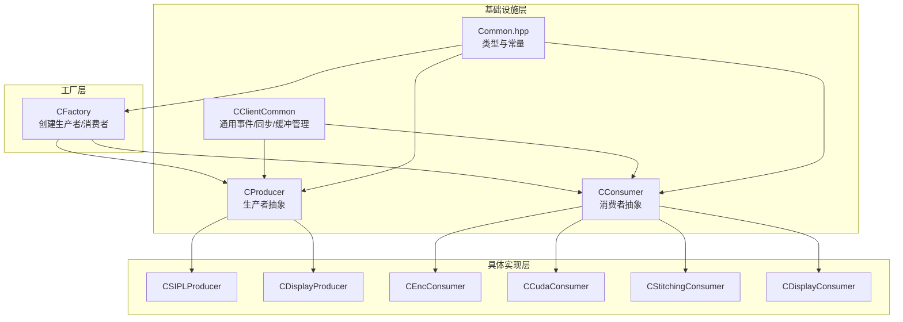
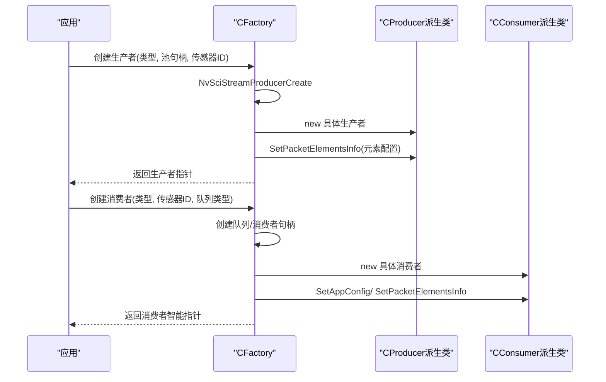
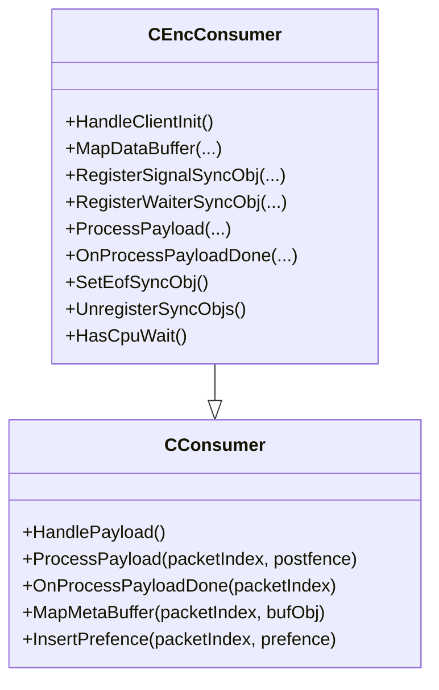
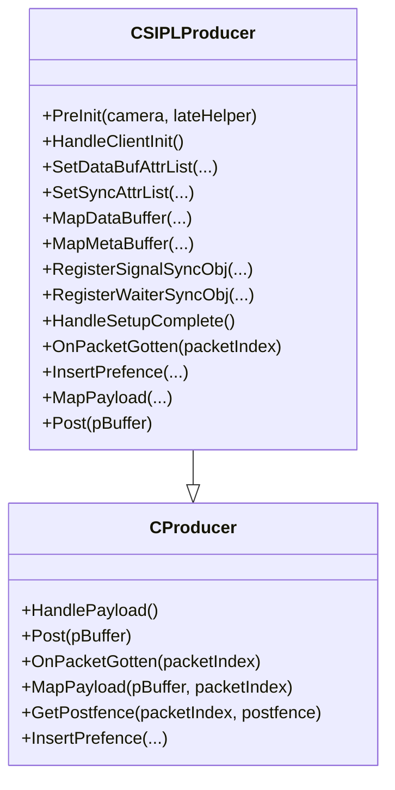
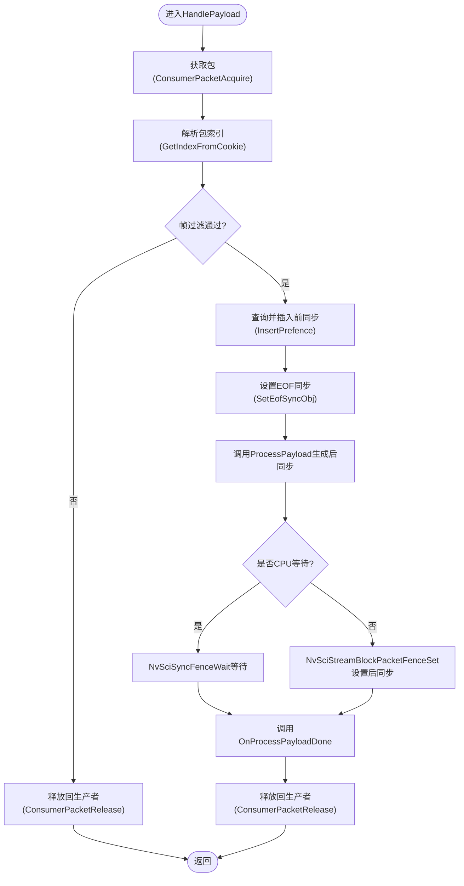
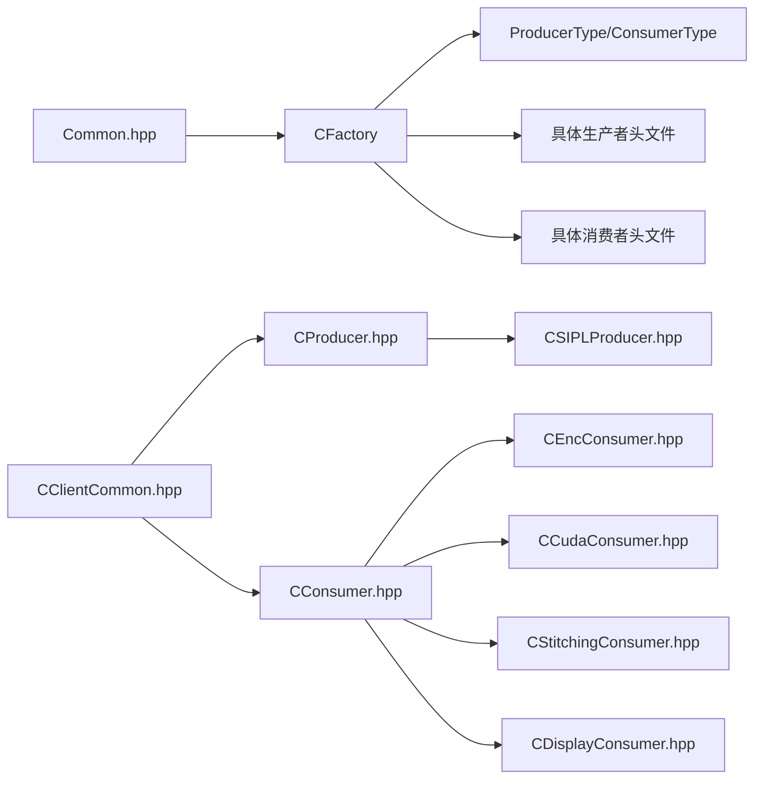

# 扩展开发指南

<cite>
**本文档引用的文件**
- [CFactory.hpp](file://CFactory.hpp)
- [CFactory.cpp](file://CFactory.cpp)
- [CConsumer.hpp](file://CConsumer.hpp)
- [CConsumer.cpp](file://CConsumer.cpp)
- [CProducer.hpp](file://CProducer.hpp)
- [CProducer.cpp](file://CProducer.cpp)
- [CClientCommon.hpp](file://CClientCommon.hpp)
- [Common.hpp](file://Common.hpp)
- [CDisplayConsumer.hpp](file://CDisplayConsumer.hpp)
- [CDisplayProducer.hpp](file://CDisplayProducer.hpp)
- [CEncConsumer.hpp](file://CEncConsumer.hpp)
- [CCudaConsumer.hpp](file://CCudaConsumer.hpp)
- [CStitchingConsumer.hpp](file://CStitchingConsumer.hpp)
- [CSIPLProducer.hpp](file://CSIPLProducer.hpp)
- [CSIPLProducer.cpp](file://CSIPLProducer.cpp)
</cite>

## 目录
1. [简介](#简介)
2. [项目结构](#项目结构)
3. [核心组件](#核心组件)
4. [架构总览](#架构总览)
5. [详细组件分析](#详细组件分析)
6. [依赖关系分析](#依赖关系分析)
7. [性能考量](#性能考量)
8. [故障排查指南](#故障排查指南)
9. [结论](#结论)
10. [附录：扩展开发最佳实践与测试方法](#附录扩展开发最佳实践与测试方法)

## 简介
本指南面向需要在NVSIPL多播框架中进行扩展开发的工程师，系统讲解工厂模式的设计原理与实现机制，说明如何通过CFactory类添加新的消费者类型与生产者类型；提供自定义消费者与生产者的完整开发流程，包括继承基类、虚函数重写、生命周期管理、数据流处理、错误处理与资源管理；总结扩展点设计的最佳实践（接口设计原则、向后兼容性、性能优化）以及集成测试方法。

## 项目结构
该仓库采用“按职责分层+按功能模块划分”的组织方式：
- 基础设施层：CClientCommon、CProducer、CConsumer等通用抽象类与公共常量定义
- 工厂层：CFactory负责统一创建生产者与消费者实例，并配置元素使用信息
- 具体实现层：CSIPLProducer、CDisplayProducer、CEncConsumer、CCudaConsumer、CStitchingConsumer、CDisplayConsumer等
- 配置与类型：Common.hpp定义枚举与常量，用于类型选择与元素配置

图表来源
- [CFactory.cpp:68-205](file://CFactory.cpp#L68-L205)
- [CProducer.hpp:16-51](file://CProducer.hpp#L16-L51)
- [CConsumer.hpp:16-43](file://CConsumer.hpp#L16-L43)
- [Common.hpp:35-86](file://Common.hpp#L35-L86)

章节来源
- [CFactory.hpp:27-92](file://CFactory.hpp#L27-L92)
- [CFactory.cpp:68-205](file://CFactory.cpp#L68-L205)
- [Common.hpp:35-86](file://Common.hpp#L35-L86)

## 核心组件
- CFactory：单例工厂，负责创建生产者与消费者对象，配置队列、多播块、IPC块、PresentSync等，并根据应用配置与传感器类型决定元素使用情况
- CClientCommon：生产者/消费者的公共基类，封装NvSciBuf/NvSciSync初始化、属性协商、包生命周期、元数据映射、CPU等待策略等
- CProducer：生产者抽象，定义Post、包获取与前同步插入、后同步设置等虚函数
- CConsumer：消费者抽象，定义HandlePayload主循环、ProcessPayload与OnProcessPayloadDone回调、元数据映射等

章节来源
- [CFactory.hpp:27-92](file://CFactory.hpp#L27-L92)
- [CFactory.cpp:68-205](file://CFactory.cpp#L68-L205)
- [CClientCommon.hpp:47-199](file://CClientCommon.hpp#L47-L199)
- [CProducer.hpp:16-51](file://CProducer.hpp#L16-L51)
- [CConsumer.hpp:16-43](file://CConsumer.hpp#L16-L43)

## 架构总览
下图展示了从工厂到具体实现的创建与运行时交互：

图表来源
- [CFactory.cpp:68-94](file://CFactory.cpp#L68-L94)
- [CFactory.cpp:166-205](file://CFactory.cpp#L166-L205)

## 详细组件分析

### 工厂模式：CFactory
- 单例获取：通过GetInstance绑定应用配置，确保全局一致的创建行为
- 生产者创建：根据ProducerType创建对应实例，调用NvSciStreamProducerCreate并设置元素使用信息
- 消费者创建：创建队列与消费者句柄，根据ConsumerType创建对应实例，设置元素使用信息与应用配置
- IPC/多播/PresentSync：提供IPC源/目的端、多播块、PresentSync的创建与释放能力
- 元素配置：通过GetProducerElementsInfo/GetConsumerElementsInfo根据传感器类型与应用配置决定哪些元素被使用与是否成对出现

扩展新增生产者/消费者类型步骤
1) 在Common.hpp中新增ProducerType/ConsumerType枚举值
2) 在CFactory.cpp中扩展CreateProducer/CreateConsumer的switch分支，构造新类型实例
3) 在CFactory.cpp中扩展GetProducerElementsInfo/GetConsumerElementsInfo，设置元素使用情况
4) 在头文件中声明新类，并在cpp中实现其虚函数（参考现有实现）

章节来源
- [CFactory.hpp:27-92](file://CFactory.hpp#L27-L92)
- [CFactory.cpp:68-205](file://CFactory.cpp#L68-L205)
- [Common.hpp:48-86](file://Common.hpp#L48-L86)

### 基类：CClientCommon
- 初始化流程：Init -> HandleStreamInit -> HandleSetupComplete -> HandlePayload循环
- 同步与缓冲：SetDataBufAttrList/SetSyncAttrList/Meta缓冲映射/信号/等待同步对象注册
- 包生命周期：AssignPacketCookie/GetPacketByCookie/InsertPrefence/SetEofSyncObj
- CPU等待：HasCpuWait控制是否使用CPU等待以规避某些平台问题
- 元素使用：SetPacketElementsInfo/GetElemIdByUserType/SetUnusedElement

章节来源
- [CClientCommon.hpp:47-199](file://CClientCommon.hpp#L47-L199)

### 抽象类：CProducer
- 关键虚函数：HandleStreamInit/HandleSetupComplete/HandlePayload/OnPacketGotten/MapPayload/GetPostfence/InsertPrefence
- 生命周期：构造时初始化计数；HandleSetupComplete获取初始包所有权；Post阶段设置后同步并呈现包
- 多消费者：统计m_numBuffersWithConsumer，等待所有消费者后同步插入

章节来源
- [CProducer.hpp:16-51](file://CProducer.hpp#L16-L51)
- [CProducer.cpp:17-157](file://CProducer.cpp#L17-L157)

### 抽象类：CConsumer
- 关键虚函数：HandlePayload/ProcessPayload/OnProcessPayloadDone/MapMetaBuffer/InsertPrefence/SetUnusedElement
- 生命周期：HandlePayload中获取包、查询前同步、调用ProcessPayload、设置后同步、释放回生产者
- 过滤帧：通过AppConfig的帧过滤参数跳过部分帧

章节来源
- [CConsumer.hpp:16-43](file://CConsumer.hpp#L16-L43)
- [CConsumer.cpp:17-127](file://CConsumer.cpp#L17-L127)

### 具体实现示例

#### 自定义消费者开发（以CEncConsumer为例）
- 继承CConsumer，重写以下虚函数：
  - HandleClientInit：设置数据缓冲属性列表、同步属性列表
  - MapDataBuffer/MapMetaBuffer：建立数据与元数据缓冲映射
  - RegisterSignalSyncObj/RegisterWaiterSyncObj：注册信号/等待同步对象
  - InsertPrefence：将前同步插入到数据缓冲
  - ProcessPayload/OnProcessPayloadDone：执行编码/处理逻辑与收尾
  - SetEofSyncObj/UnregisterSyncObjs：结束时清理同步对象
  - HasCpuWait：是否启用CPU等待
- 生命周期管理：
  - 构造时接收队列句柄与传感器ID
  - HandleSetupComplete后开始处理
  - OnProcessPayloadDone中释放资源或输出文件
- 错误处理与资源管理：
  - 使用宏进行NvSci错误检查与状态返回
  - 使用智能指针管理外部库对象（如NvMediaIEP）
  - 清理顺序：先解除同步对象，再释放缓冲

图表来源
- [CConsumer.hpp:16-43](file://CConsumer.hpp#L16-L43)
- [CEncConsumer.hpp:17-66](file://CEncConsumer.hpp#L17-L66)

章节来源
- [CEncConsumer.hpp:17-66](file://CEncConsumer.hpp#L17-L66)
- [CConsumer.cpp:17-127](file://CConsumer.cpp#L17-L127)

#### 自定义生产者开发（以CSIPLProducer为例）
- 继承CProducer，重写以下虚函数：
  - HandleClientInit：建立元素类型到输出类型的映射
  - SetDataBufAttrList/SetSyncAttrList：为不同元素设置缓冲与同步属性
  - MapDataBuffer/MapMetaBuffer：复制/映射数据缓冲，记录元数据
  - RegisterSignalSyncObj/RegisterWaiterSyncObj：注册信号/等待同步对象
  - HandleSetupComplete：完成缓冲注册
  - OnPacketGotten：释放内部持有的NvMedia缓冲
  - InsertPrefence/GetPostfence：插入前同步与获取后同步
  - MapPayload/Post：将输入缓冲映射到包索引并呈现
- 生命周期管理：
  - PreInit阶段注入相机接口与延迟消费者辅助器
  - 析构中释放所有NvSciBufObj
- 错误处理与资源管理：
  - 使用NvSciBufObjDup复制缓冲，避免所有权冲突
  - 严格检查NvSci错误码并清理已分配资源

图表来源
- [CProducer.hpp:16-51](file://CProducer.hpp#L16-L51)
- [CSIPLProducer.hpp:18-84](file://CSIPLProducer.hpp#L18-L84)

章节来源
- [CSIPLProducer.hpp:18-84](file://CSIPLProducer.hpp#L18-L84)
- [CSIPLProducer.cpp:16-405](file://CSIPLProducer.cpp#L16-L405)

#### 数据流处理与错误处理流程（消费者侧）

图表来源
- [CConsumer.cpp:17-127](file://CConsumer.cpp#L17-L127)

章节来源
- [CConsumer.cpp:17-127](file://CConsumer.cpp#L17-L127)

## 依赖关系分析
- 工厂依赖：CFactory依赖Common.hpp中的类型枚举与元素信息结构，依赖各具体生产者/消费者头文件
- 基类依赖：CClientCommon依赖NvSciBuf/NvSciSync模块与应用配置；CProducer/CConsumer分别继承CClientCommon
- 实现依赖：CSIPLProducer依赖NvSIPL相机接口；CEncConsumer依赖NvMediaIEP；CStitchingConsumer依赖NvMedia2D与CDisplayProducer

图表来源
- [Common.hpp:35-86](file://Common.hpp#L35-L86)
- [CFactory.hpp:12-22](file://CFactory.hpp#L12-L22)
- [CProducer.hpp:13-14](file://CProducer.hpp#L13-L14)
- [CConsumer.hpp:13-14](file://CConsumer.hpp#L13-L14)

章节来源
- [CFactory.hpp:12-22](file://CFactory.hpp#L12-L22)
- [CProducer.hpp:13-14](file://CProducer.hpp#L13-L14)
- [CConsumer.hpp:13-14](file://CConsumer.hpp#L13-L14)

## 性能考量
- 元素使用最小化：仅启用实际需要的元素，减少NvSci缓冲与同步对象数量
- CPU等待权衡：在特定平台启用HasCpuWait以规避同步对象注册问题，但会增加CPU占用
- 缓冲复用：尽量使用NvSciBufObjDup避免重复分配，降低内存压力
- 帧过滤：通过AppConfig的帧过滤参数降低处理负载
- 后同步设置：在Post/ProcessPayload中及时设置后同步，避免阻塞后续包处理

## 故障排查指南
- NvSci错误检查：广泛使用宏进行NvSci错误检查与状态返回，定位失败点
- 资源释放：确保在析构与异常路径中释放NvSci对象、缓冲与同步对象
- 元素配置：若元素未使用却仍被引用，可能导致同步对象不匹配，需核对GetProducerElementsInfo/GetConsumerElementsInfo
- IPC/多播：打开端点失败、创建IPC块失败、释放IPC块时检查句柄有效性

章节来源
- [CFactory.cpp:223-274](file://CFactory.cpp#L223-L274)
- [CProducer.cpp:17-157](file://CProducer.cpp#L17-L157)
- [CConsumer.cpp:17-127](file://CConsumer.cpp#L17-L127)

## 结论
通过CFactory的集中式创建与CClientCommon的统一生命周期管理，NVSIPL多播框架提供了清晰的扩展点。新增生产者/消费者类型的关键在于：在Common.hpp中定义类型、在CFactory.cpp中注册创建逻辑与元素配置、在具体类中正确实现虚函数、严格遵循资源管理与错误处理规范。遵循本文最佳实践可确保扩展具备良好的向后兼容性与性能表现。

## 附录：扩展开发最佳实践与测试方法

### 接口设计原则
- 明确职责分离：生产者专注数据产出与后同步设置；消费者专注数据消费与前同步插入
- 最小暴露：仅暴露必要虚函数，避免过度开放导致耦合
- 可插拔：通过工厂与配置驱动类型选择，便于替换与扩展

### 向后兼容性考虑
- 类型枚举扩展：在Common.hpp中追加新枚举值，保持原有值不变
- 工厂分支：在CFactory.cpp中新增分支而不修改旧分支
- 元素配置：新增元素不影响已有元素使用标记，保持默认值安全

### 性能优化建议
- 减少同步对象数量：仅在必要元素上启用同步
- 使用CPU等待的场景谨慎评估：仅在平台问题明确时启用
- 缓冲复用与批量处理：合并多次设置操作，减少NvSci调用次数

### 集成测试方法
- 单元测试（消费者侧）：模拟HandlePayload流程，验证ProcessPayload与OnProcessPayloadDone的调用顺序与资源释放
- 单元测试（生产者侧）：模拟HandlePayload流程，验证OnPacketGotten与后同步设置
- 端到端测试：通过CFactory创建生产者/消费者组合，连接队列/IPC/多播，运行一段采集周期，验证帧率与丢包情况
- 回归测试：新增类型后，复用既有测试用例验证原有功能不受影响