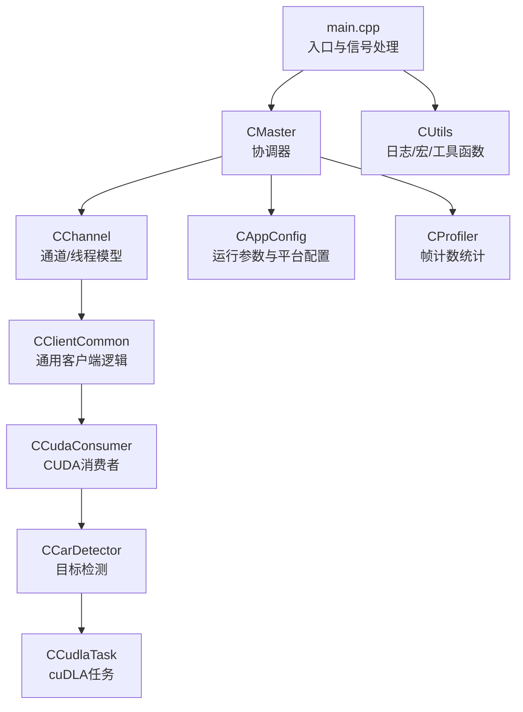
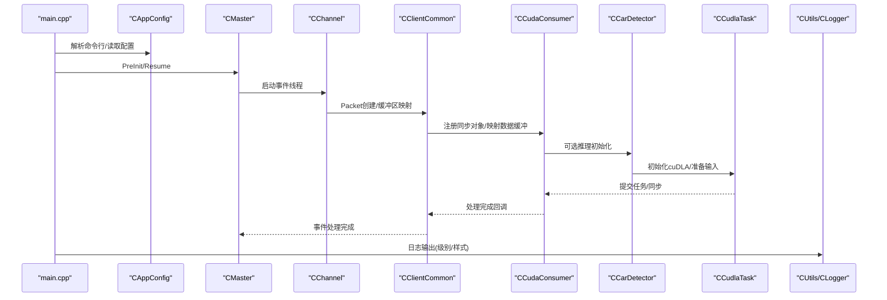
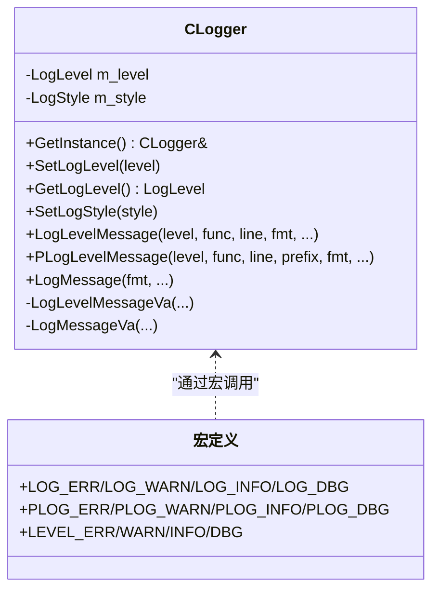
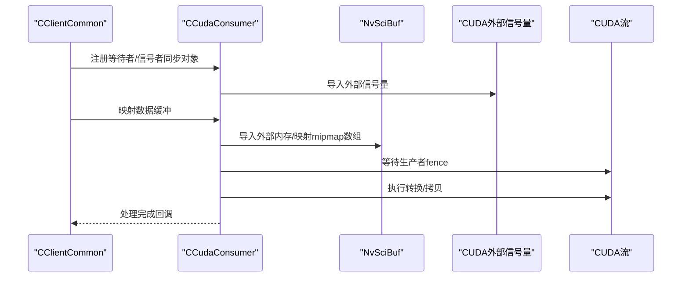
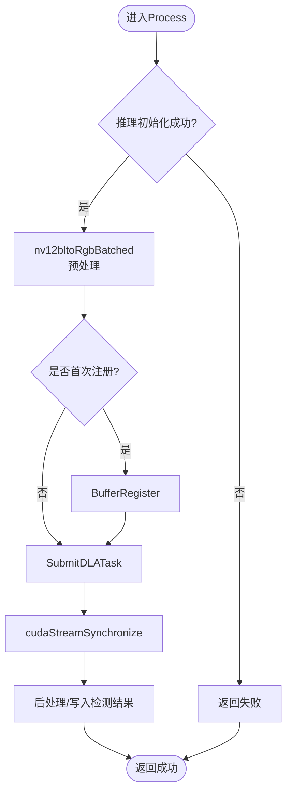
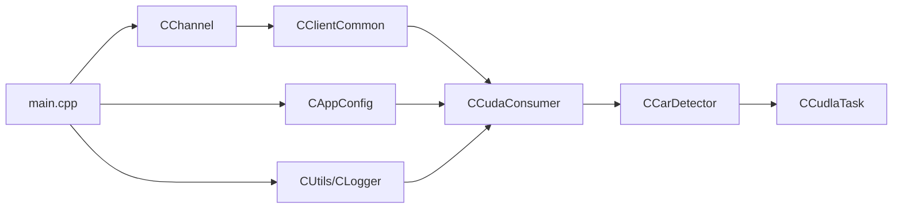
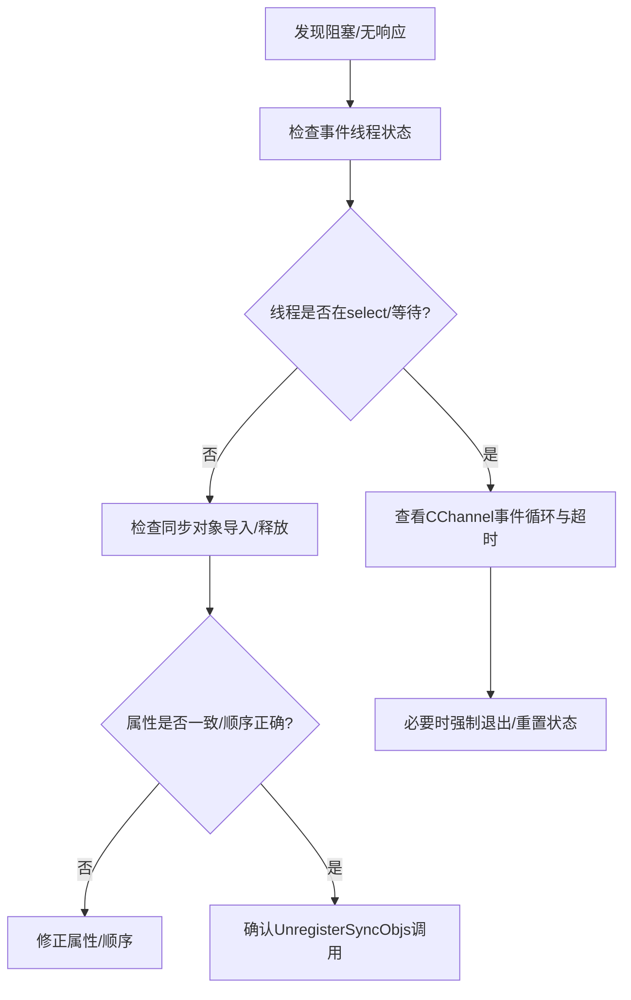

# 调试与性能分析

<cite>
**本文引用的文件**
- [main.cpp](file://main.cpp)
- [CProfiler.hpp](file://CProfiler.hpp)
- [CUtils.hpp](file://CUtils.hpp)
- [CUtils.cpp](file://CUtils.cpp)
- [CCudaConsumer.cpp](file://CCudaConsumer.cpp)
- [CCarDetector.cpp](file://car_detect/CCarDetector.cpp)
- [CCudlaTask.cpp](file://car_detect/CCudlaTask.cpp)
- [CCudlaTask.hpp](file://car_detect/CCudlaTask.hpp)
- [Common.hpp](file://car_detect/Common.hpp)
- [CAppConfig.hpp](file://CAppConfig.hpp)
- [CAppConfig.cpp](file://CAppConfig.cpp)
- [CChannel.hpp](file://CChannel.hpp)
- [CClientCommon.cpp](file://CClientCommon.cpp)
- [CPoolManager.cpp](file://CPoolManager.cpp)
- [CSiplCamera.hpp](file://CSiplCamera.hpp)
</cite>

## 目录
1. [简介](#简介)
2. [项目结构](#项目结构)
3. [核心组件](#核心组件)
4. [架构总览](#架构总览)
5. [详细组件分析](#详细组件分析)
6. [依赖关系分析](#依赖关系分析)
7. [性能考量](#性能考量)
8. [故障排查指南](#故障排查指南)
9. [结论](#结论)
10. [附录](#附录)

## 简介
本指南面向在Linux平台上开发与维护NVSIPL多播应用的工程师，聚焦于调试与性能分析实践。内容涵盖：
- 使用GDB进行多线程调试（断点设置、变量查看、线程切换）
- CUDA程序调试工具（cuda-gdb、Nsight Systems）的配置与操作要点
- 性能分析工具使用（CPU火焰图、GPU利用率监控、内存使用分析）
- 日志系统使用（日志级别、输出格式、日志文件管理）
- 常见问题诊断（死锁检测、内存泄漏排查、性能瓶颈定位）

## 项目结构
该工程围绕多播数据流构建，包含主线程、输入事件线程、套接字事件线程、消费者（含CUDA路径）、推理子系统（cuDLA）以及日志与配置模块。

图表来源
- [main.cpp:253-304](file://main.cpp#L253-L304)
- [CChannel.hpp:97-118](file://CChannel.hpp#L97-L118)
- [CClientCommon.cpp:35-74](file://CClientCommon.cpp#L35-L74)
- [CCudaConsumer.cpp:11-26](file://CCudaConsumer.cpp#L11-L26)
- [CCarDetector.cpp:33-91](file://car_detect/CCarDetector.cpp#L33-L91)
- [CCudlaTask.cpp:35-52](file://car_detect/CCudlaTask.cpp#L35-L52)
- [CUtils.hpp:142-174](file://CUtils.hpp#L142-L174)
- [CAppConfig.hpp:19-52](file://CAppConfig.hpp#L19-L52)
- [CProfiler.hpp:21-54](file://CProfiler.hpp#L21-L54)

章节来源
- [main.cpp:253-304](file://main.cpp#L253-L304)
- [CChannel.hpp:97-118](file://CChannel.hpp#L97-L118)
- [CClientCommon.cpp:35-74](file://CClientCommon.cpp#L35-L74)
- [CCudaConsumer.cpp:11-26](file://CCudaConsumer.cpp#L11-L26)
- [CCarDetector.cpp:33-91](file://car_detect/CCarDetector.cpp#L33-L91)
- [CCudlaTask.cpp:35-52](file://car_detect/CCudlaTask.cpp#L35-L52)
- [CUtils.hpp:142-174](file://CUtils.hpp#L142-L174)
- [CAppConfig.hpp:19-52](file://CAppConfig.hpp#L19-L52)
- [CProfiler.hpp:21-54](file://CProfiler.hpp#L21-L54)

## 核心组件
- 日志系统：统一的CLogger单例，支持级别控制与多种输出风格，贯穿所有模块。
- 多线程框架：主线程负责初始化与事件循环；输入事件线程与套接字事件线程分别处理用户交互与外部事件；通道层以线程池驱动事件循环。
- CUDA消费者：负责NvSciBuf到CUDA的映射、同步对象导入、块线性/平面线性布局转换、可选推理流程。
- 推理子系统：基于cuDLA的任务封装，包含输入张量准备、任务提交、后处理与结果输出。
- 配置与平台：CAppConfig提供运行时参数与平台配置查询，影响分辨率、格式等。
- 性能统计：CProfiler提供帧计数统计，保护在互斥量下更新。

章节来源
- [CUtils.hpp:175-276](file://CUtils.hpp#L175-L276)
- [CUtils.cpp:17-118](file://CUtils.cpp#L17-L118)
- [CChannel.hpp:97-118](file://CChannel.hpp#L97-L118)
- [CCudaConsumer.cpp:28-53](file://CCudaConsumer.cpp#L28-L53)
- [CCarDetector.cpp:33-91](file://car_detect/CCarDetector.cpp#L33-L91)
- [CCudlaTask.cpp:35-52](file://car_detect/CCudlaTask.cpp#L35-L52)
- [CAppConfig.hpp:19-52](file://CAppConfig.hpp#L19-L52)
- [CProfiler.hpp:21-54](file://CProfiler.hpp#L21-L54)

## 架构总览
下图展示从进程启动到数据消费与推理的关键调用链路，以及日志与配置在其中的作用。

图表来源
- [main.cpp:253-304](file://main.cpp#L253-L304)
- [CAppConfig.cpp:21-75](file://CAppConfig.cpp#L21-L75)
- [CChannel.hpp:97-118](file://CChannel.hpp#L97-L118)
- [CClientCommon.cpp:427-460](file://CClientCommon.cpp#L427-L460)
- [CCudaConsumer.cpp:173-273](file://CCudaConsumer.cpp#L173-L273)
- [CCarDetector.cpp:33-91](file://car_detect/CCarDetector.cpp#L33-L91)
- [CCudlaTask.cpp:152-186](file://car_detect/CCudlaTask.cpp#L152-L186)
- [CUtils.hpp:142-174](file://CUtils.hpp#L142-L174)

## 详细组件分析

### 组件A：日志系统（CLogger）
- 单例模式，支持级别过滤与输出风格（普通/函数+行号）
- 提供多级宏（错误、警告、信息、调试），便于在各模块快速打印
- 输出前缀包含组件名与文件/行号，便于定位

图表来源
- [CUtils.hpp:175-276](file://CUtils.hpp#L175-L276)
- [CUtils.cpp:17-118](file://CUtils.cpp#L17-L118)

章节来源
- [CUtils.hpp:142-174](file://CUtils.hpp#L142-L174)
- [CUtils.hpp:175-276](file://CUtils.hpp#L175-L276)
- [CUtils.cpp:17-118](file://CUtils.cpp#L17-L118)

### 组件B：CUDA消费者（CCudaConsumer）
- 初始化CUDA设备与非阻塞流，创建外部信号量等待器
- 映射NvSciBuf为CUDA外部内存/外部分割数组，支持块线性与平面线性布局
- 在块线性布局下执行GPU转换与主机拷贝，或直接平面线性拷贝至CPU
- 可选调用推理流程（Linux平台）

图表来源
- [CClientCommon.cpp:240-243](file://CClientCommon.cpp#L240-L243)
- [CCudaConsumer.cpp:275-298](file://CCudaConsumer.cpp#L275-L298)
- [CCudaConsumer.cpp:173-273](file://CCudaConsumer.cpp#L173-L273)
- [CCudaConsumer.cpp:300-322](file://CCudaConsumer.cpp#L300-L322)
- [CCudaConsumer.cpp:386-462](file://CCudaConsumer.cpp#L386-L462)

章节来源
- [CCudaConsumer.cpp:28-53](file://CCudaConsumer.cpp#L28-L53)
- [CCudaConsumer.cpp:173-273](file://CCudaConsumer.cpp#L173-L273)
- [CCudaConsumer.cpp:275-298](file://CCudaConsumer.cpp#L275-L298)
- [CCudaConsumer.cpp:300-322](file://CCudaConsumer.cpp#L300-L322)
- [CCudaConsumer.cpp:386-462](file://CCudaConsumer.cpp#L386-L462)

### 组件C：推理子系统（CCarDetector + CCudlaTask）
- CCarDetector负责初始化GPU、选择设备、创建cuDLA任务并加载模型
- CCudlaTask完成cuDLA上下文初始化、输入/输出张量分配与注册、任务提交与后处理

图表来源
- [CCarDetector.cpp:93-109](file://car_detect/CCarDetector.cpp#L93-L109)
- [CCudlaTask.cpp:188-245](file://car_detect/CCudlaTask.cpp#L188-L245)
- [CCudlaTask.cpp:291-352](file://car_detect/CCudlaTask.cpp#L291-L352)

章节来源
- [CCarDetector.cpp:33-91](file://car_detect/CCarDetector.cpp#L33-L91)
- [CCudlaTask.cpp:152-186](file://car_detect/CCudlaTask.cpp#L152-L186)
- [CCudlaTask.cpp:188-245](file://car_detect/CCudlaTask.cpp#L188-L245)
- [CCudlaTask.cpp:291-352](file://car_detect/CCudlaTask.cpp#L291-L352)

### 组件D：配置与平台（CAppConfig）
- 提供平台配置查询、分辨率查询、传感器类型判断等
- 与命令行解析配合，决定运行时行为（如是否启用文件转储、是否启用推理）

章节来源
- [CAppConfig.hpp:19-52](file://CAppConfig.hpp#L19-L52)
- [CAppConfig.cpp:21-75](file://CAppConfig.cpp#L21-L75)
- [CAppConfig.cpp:77-94](file://CAppConfig.cpp#L77-L94)
- [CAppConfig.cpp:96-109](file://CAppConfig.cpp#L96-L109)

### 组件E：性能统计（CProfiler）
- 帧计数统计结构体包含互斥量与当前/上一帧计数
- OnFrameAvailable在临界区内递增帧计数，用于后续统计与输出

章节来源
- [CProfiler.hpp:21-54](file://CProfiler.hpp#L21-L54)

## 依赖关系分析
- 线程与事件：main.cpp创建输入/套接字事件线程；CChannel以EventThreadFunc驱动事件循环
- 消费者链路：CClientCommon负责包生命周期与缓冲映射；CCudaConsumer实现具体映射与处理
- 推理链路：CCarDetector创建CCudlaTask；CCudlaTask内部管理cuDLA上下文与任务
- 日志与配置：全局日志宏贯穿各模块；CAppConfig提供运行参数

图表来源
- [main.cpp:253-304](file://main.cpp#L253-L304)
- [CChannel.hpp:97-118](file://CChannel.hpp#L97-L118)
- [CClientCommon.cpp:427-460](file://CClientCommon.cpp#L427-L460)
- [CCudaConsumer.cpp:173-273](file://CCudaConsumer.cpp#L173-L273)
- [CCarDetector.cpp:33-91](file://car_detect/CCarDetector.cpp#L33-L91)
- [CCudlaTask.cpp:152-186](file://car_detect/CCudlaTask.cpp#L152-L186)
- [CUtils.hpp:142-174](file://CUtils.hpp#L142-L174)
- [CAppConfig.hpp:19-52](file://CAppConfig.hpp#L19-L52)

章节来源
- [main.cpp:253-304](file://main.cpp#L253-L304)
- [CChannel.hpp:97-118](file://CChannel.hpp#L97-L118)
- [CClientCommon.cpp:427-460](file://CClientCommon.cpp#L427-L460)
- [CCudaConsumer.cpp:173-273](file://CCudaConsumer.cpp#L173-L273)
- [CCarDetector.cpp:33-91](file://car_detect/CCarDetector.cpp#L33-L91)
- [CCudlaTask.cpp:152-186](file://car_detect/CCudlaTask.cpp#L152-L186)
- [CUtils.hpp:142-174](file://CUtils.hpp#L142-L174)
- [CAppConfig.hpp:19-52](file://CAppConfig.hpp#L19-L52)

## 性能考量
- 日志级别与输出样式：通过CLogger的SetLogLevel/SetLogStyle控制输出量与格式，避免在高吞吐场景中产生过多I/O开销
- CUDA流与同步：使用非阻塞流与外部信号量等待，减少CPU轮询；确保在关键路径后执行同步，避免异步状态下的误判
- 缓冲映射策略：块线性布局需额外转换步骤，平面线性布局可直接拷贝；根据实际需求选择合适布局以降低CPU/GPU往返
- 帧计数统计：利用CProfiler在互斥保护下统计帧率，辅助定位卡顿与丢帧问题

章节来源
- [CUtils.hpp:206-216](file://CUtils.hpp#L206-L216)
- [CUtils.cpp:23-36](file://CUtils.cpp#L23-L36)
- [CCudaConsumer.cpp:38-41](file://CCudaConsumer.cpp#L38-L41)
- [CCudaConsumer.cpp:300-322](file://CCudaConsumer.cpp#L300-L322)
- [CProfiler.hpp:21-54](file://CProfiler.hpp#L21-L54)

## 故障排查指南

### 死锁检测与定位
- 线程同步点：关注CClientCommon中的NvSciSyncAttrListReconcile与NvSciSyncObjAlloc，确保信号/等待属性一致且顺序正确
- 事件线程：检查CChannel的EventThreadFunc是否按预期唤醒与退出，避免线程未join导致资源无法释放
- 同步对象生命周期：确认在UnregisterSyncObjs前后，外部信号量与NvSci对象被正确销毁

图表来源
- [CClientCommon.cpp:499-530](file://CClientCommon.cpp#L499-L530)
- [CChannel.hpp:97-118](file://CChannel.hpp#L97-L118)
- [CCudaConsumer.cpp:485-491](file://CCudaConsumer.cpp#L485-L491)

章节来源
- [CClientCommon.cpp:499-530](file://CClientCommon.cpp#L499-L530)
- [CChannel.hpp:97-118](file://CChannel.hpp#L97-L118)
- [CCudaConsumer.cpp:485-491](file://CCudaConsumer.cpp#L485-L491)

### 内存泄漏排查
- CUDA内存：确认CCudaConsumer析构中对设备指针、外部内存、主机缓冲、mipmap数组的释放
- cuDLA资源：CCudlaTask::DestroyCudla中释放输入/输出张量与上下文
- 文件句柄：检查是否在异常路径中关闭输出文件

章节来源
- [CCudaConsumer.cpp:71-110](file://CCudaConsumer.cpp#L71-L110)
- [CCudlaTask.cpp:354-363](file://car_detect/CCudlaTask.cpp#L354-L363)
- [CCudaConsumer.cpp:75-78](file://CCudaConsumer.cpp#L75-L78)

### 性能瓶颈定位
- CPU火焰图：使用perf或类似工具采集CPU热点，结合日志定位高耗时路径
- GPU利用率：使用nvidia-smi或Nsight Systems查看GPU占用与内核时间
- 内存带宽：观察PCIe带宽与显存占用，评估缓冲大小与拷贝次数
- 帧率统计：通过CProfiler的帧计数变化判断是否存在丢帧或抖动

章节来源
- [CProfiler.hpp:21-54](file://CProfiler.hpp#L21-L54)

## 结论
本项目提供了完善的日志体系、多线程事件驱动框架、CUDA与cuDLA集成路径，以及配置与平台适配能力。结合本文提供的调试与性能分析方法，可在复杂多播与推理场景中快速定位问题并优化性能。

## 附录

### GDB多线程调试要点
- 断点设置
  - 在关键函数入口设置断点，如CChannel::EventThreadFunc、CCudaConsumer::ProcessPayload、CCudlaTask::ProcessCudla
  - 对于日志密集区域，可先临时降低日志级别以减少干扰
- 变量查看
  - 查看线程局部状态（如缓冲属性、同步对象句柄）
  - 观察帧计数（CProfiler）与运行参数（CAppConfig）
- 线程切换
  - 使用info threads列出所有线程
  - 使用thread n切换到目标线程，再使用bt查看调用栈
  - 注意在CUDA相关路径，可能需要在对应线程上下文中查看设备端状态

章节来源
- [CChannel.hpp:97-118](file://CChannel.hpp#L97-L118)
- [CCudaConsumer.cpp:386-462](file://CCudaConsumer.cpp#L386-L462)
- [CCudlaTask.cpp:188-245](file://car_detect/CCudlaTask.cpp#L188-L245)
- [CProfiler.hpp:21-54](file://CProfiler.hpp#L21-L54)
- [CAppConfig.hpp:19-52](file://CAppConfig.hpp#L19-L52)

### CUDA调试工具使用
- cuda-gdb
  - 启动：cuda-gdb ./nvsipl_multicast
  - 断点：在CUDA内核或关键拷贝路径设置断点
  - 变量：查看设备内存指针、流状态、外部信号量
- Nsight Systems
  - 分析GPU内核时间、占用率、内存带宽
  - 关注块线性到平面线性的转换阶段与主机拷贝阶段

章节来源
- [CCudaConsumer.cpp:324-352](file://CCudaConsumer.cpp#L324-L352)
- [CCudaConsumer.cpp:409-417](file://CCudaConsumer.cpp#L409-L417)
- [CCudlaTask.cpp:188-245](file://car_detect/CCudlaTask.cpp#L188-L245)

### 日志系统使用
- 设置级别：通过CAppConfig传入的verbosity在main中设置日志级别
- 输出格式：可选择普通或函数+行号风格，便于快速定位
- 建议：在性能测试时降低级别，避免I/O成为瓶颈

章节来源
- [main.cpp:272](file://main.cpp#L272)
- [CUtils.hpp:206-216](file://CUtils.hpp#L206-L216)
- [CUtils.cpp:23-36](file://CUtils.cpp#L23-L36)