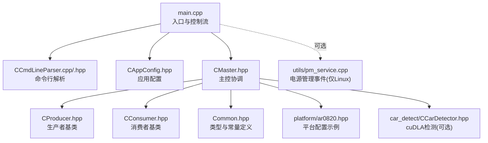
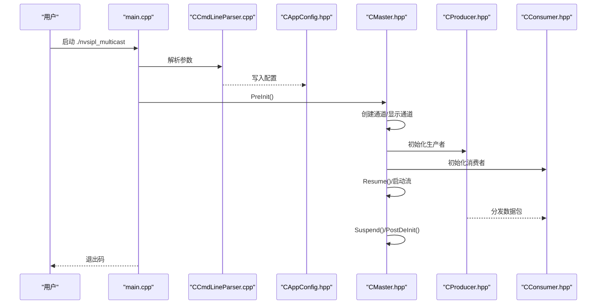

# 快速开始

<cite>
**本文引用的文件**
- [README.md](file://README.md)
- [ReleaseNote.md](file://ReleaseNote.md)
- [Makefile](file://Makefile)
- [main.cpp](file://main.cpp)
- [Common.hpp](file://Common.hpp)
- [CCmdLineParser.hpp](file://CCmdLineParser.hpp)
- [CCmdLineParser.cpp](file://CCmdLineParser.cpp)
- [CAppConfig.hpp](file://CAppConfig.hpp)
- [CMaster.hpp](file://CMaster.hpp)
- [CProducer.hpp](file://CProducer.hpp)
- [CConsumer.hpp](file://CConsumer.hpp)
- [car_detect/CCarDetector.hpp](file://car_detect/CCarDetector.hpp)
- [platform/ar0820.hpp](file://platform/ar0820.hpp)
- [utils/pm_service.cpp](file://utils/pm_service.cpp)
</cite>

## 目录
1. [简介](#简介)
2. [项目结构](#项目结构)
3. [核心组件](#核心组件)
4. [架构总览](#架构总览)
5. [详细组件分析](#详细组件分析)
6. [依赖分析](#依赖分析)
7. [性能考虑](#性能考虑)
8. [故障排除指南](#故障排除指南)
9. [结论](#结论)
10. [附录](#附录)

## 简介
本指南面向在 NVIDIA Jetson 平台上快速上手 NVSIPL 多播系统的用户，目标是帮助您完成环境准备、依赖安装、编译构建与运行，覆盖单进程多消费者、跨进程（P2P）、芯片间（C2C）以及延迟/重附加等典型用例。文档同时提供常见问题与排障建议，确保您能顺利跑通第一个示例。

## 项目结构
该示例工程围绕“生产者-消费者”模型组织，支持在同一进程内或通过 IPC/C2C 在不同进程/芯片之间分发 NvStreams 数据。主要模块包括命令行解析、应用配置、主控协调、通道与显示、以及多种消费者（CUDA、编码器、拼接显示等）。平台配置以静态头文件形式提供，便于在非安全系统中直接使用。

图表来源
- [main.cpp:253-304](file://main.cpp#L253-L304)
- [CCmdLineParser.cpp:13-313](file://CCmdLineParser.cpp#L13-L313)
- [CAppConfig.hpp:19-83](file://CAppConfig.hpp#L19-L83)
- [CMaster.hpp:47-95](file://CMaster.hpp#L47-L95)
- [CProducer.hpp:16-53](file://CProducer.hpp#L16-L53)
- [CConsumer.hpp:16-45](file://CConsumer.hpp#L16-L45)
- [Common.hpp:35-87](file://Common.hpp#L35-L87)
- [platform/ar0820.hpp:14-186](file://platform/ar0820.hpp#L14-L186)
- [car_detect/CCarDetector.hpp:17-34](file://car_detect/CCarDetector.hpp#L17-L34)
- [utils/pm_service.cpp](file://utils/pm_service.cpp)

章节来源
- [README.md:11-109](file://README.md#L11-L109)
- [Makefile:1-105](file://Makefile#L1-L105)

## 核心组件
- 命令行解析：负责解析运行参数、平台配置、队列类型、运行时行为等，并输出帮助与可用配置列表。
- 应用配置：集中管理运行时开关、平台配置选择、帧过滤、运行时长、消费者数量与索引等。
- 主控（CMaster）：负责生命周期管理（预初始化、启动、暂停/恢复、停止、反初始化），并根据配置创建通道、显示通道与管线。
- 生产者/消费者基类：抽象出流初始化、设置完成、负载处理、元数据映射、围栏同步等通用流程。
- 平台配置：以静态结构体形式描述传感器、Deserializer/Serdes、CSI 链路等硬件能力与约束。
- 可选功能：cuDLA 车辆检测、Linux 下电源管理事件服务。

章节来源
- [CCmdLineParser.cpp:13-313](file://CCmdLineParser.cpp#L13-L313)
- [CAppConfig.hpp:19-83](file://CAppConfig.hpp#L19-L83)
- [CMaster.hpp:47-95](file://CMaster.hpp#L47-L95)
- [CProducer.hpp:16-53](file://CProducer.hpp#L16-L53)
- [CConsumer.hpp:16-45](file://CConsumer.hpp#L16-L45)
- [Common.hpp:35-87](file://Common.hpp#L35-L87)
- [platform/ar0820.hpp:14-186](file://platform/ar0820.hpp#L14-L186)
- [car_detect/CCarDetector.hpp:17-34](file://car_detect/CCarDetector.hpp#L17-L34)

## 架构总览
下图展示了从命令行到主控再到生产者/消费者的典型调用序列，以及 IPC/C2C 场景下的角色分工。

图表来源
- [main.cpp:253-304](file://main.cpp#L253-L304)
- [CCmdLineParser.cpp:13-313](file://CCmdLineParser.cpp#L13-L313)
- [CAppConfig.hpp:19-83](file://CAppConfig.hpp#L19-L83)
- [CMaster.hpp:47-95](file://CMaster.hpp#L47-L95)
- [CProducer.hpp:16-53](file://CProducer.hpp#L16-L53)
- [CConsumer.hpp:16-45](file://CConsumer.hpp#L16-L45)

## 详细组件分析

### 命令行解析与运行参数
- 支持动态平台配置（非安全系统）与静态平台配置（默认名称见平台头文件）。
- 支持队列类型（FIFO/MAILBOX）、帧过滤、运行时长、文件转储、显示模式（拼接/DP-MST）、多元素（ISP0/ISP1 输出）等。
- 支持跨进程（-p/-c）与芯片间（-P/-C）模式；支持延迟/重附加（-L）。
- 提供列出可用配置与版本查询等辅助选项。

章节来源
- [CCmdLineParser.cpp:13-313](file://CCmdLineParser.cpp#L13-L313)
- [CCmdLineParser.hpp:34-47](file://CCmdLineParser.hpp#L34-L47)
- [README.md:16-109](file://README.md#L16-L109)

### 应用配置与平台配置
- CAppConfig 统一持有运行时开关与平台配置对象，提供分辨率查询、YUV 传感器判断等辅助接口。
- 平台配置以静态结构体形式提供，包含 CSI 接口、Deserializer/Serdes、传感器、VC/分辨率/FPS 等信息。

章节来源
- [CAppConfig.hpp:19-83](file://CAppConfig.hpp#L19-L83)
- [platform/ar0820.hpp:14-186](file://platform/ar0820.hpp#L14-L186)

### 主控协调（CMaster）
- 负责生命周期管理：PreInit/Init/Start/Stop/DeInit/PostDeInit。
- 支持暂停/恢复、输入事件线程（键盘命令）、SC7 引导模式（通过 socket 事件）。
- 根据配置创建通道与显示通道，协调生产者与消费者。

章节来源
- [CMaster.hpp:47-95](file://CMaster.hpp#L47-L95)
- [main.cpp:74-251](file://main.cpp#L74-L251)

### 生产者与消费者基类
- 生产者基类：负责流初始化、设置完成、负载投递、前围栏插入、后围栏获取、元数据权限等。
- 消费者基类：负责负载处理、处理完成回调、元缓冲映射、未使用元素清理、队列句柄访问等。

章节来源
- [CProducer.hpp:16-53](file://CProducer.hpp#L16-L53)
- [CConsumer.hpp:16-45](file://CConsumer.hpp#L16-L45)

### 平台配置示例（AR0820）
- 描述了双摄像头、4 路 CPHY、MAX96712/MAX9295 等硬件拓扑与参数，可用于静态配置演示。

章节来源
- [platform/ar0820.hpp:14-186](file://platform/ar0820.hpp#L14-L186)

### 可选：cuDLA 车辆检测
- 通过 CCudlaTask 进行推理，支持将 NV12 输入转换为推理所需的布局格式，输出检测框。

章节来源
- [car_detect/CCarDetector.hpp:17-34](file://car_detect/CCarDetector.hpp#L17-L34)

## 依赖分析
构建系统基于顶层 Makefile，按平台变量自动链接所需库。以下为关键依赖与编译选项要点：

- 编译器与标准：C++14，启用异常与 RTTI。
- 平台宏与安全标志：根据 NV_PLATFORM_* 宏决定是否启用安全构建（NV_IS_SAFETY）。
- 静态/动态库：
  - NVSIPL 基础库与查询库（非安全系统）
  - NVMedia IEP/2D、NvSciBuf/NvSciSync/NvSciEvent/NvSciIPC/NvSciCommon
  - CUDA/cudart（动态/静态，取决于平台）
  - cuDLC（Linux 下可选）
  - QNX 特定：静态 cudart、socket 库
- 可选 CUDA 对象：Linux 下编译 car_detect 子目录中的 CUDA 源。
- 可选工具：Linux 下可构建 pm_service（电源管理事件服务）。

章节来源
- [Makefile:9-105](file://Makefile#L9-L105)

## 性能考虑
- 多元素（ISP0/ISP1）可并行承载不同输出路径，提升吞吐。
- 显示拼接会引入额外计算开销，摄像头数量增加可能带来性能压力。
- 文件转储与帧过滤会影响 CPU/GPU 负载，建议按需开启。
- 队列类型（FIFO/MAILBOX）对延迟与带宽有不同影响，可根据场景选择。

## 故障排除指南
- 无法找到平台配置
  - 使用 -l 列出可用配置；动态配置需在非安全系统中配合 SIPL Query。
  - 静态配置请确认平台头文件存在且名称正确。
- 动态配置与掩码不匹配
  - 动态配置与链路掩码必须成对提供；二者不可单独设置。
- 参数范围错误
  - 帧过滤范围为 1-5；消费者数量范围为 1-8；消费者索引范围为 0..ConsumerNum-1。
- 权限与库缺失
  - 确认已安装并链接所有必需的 NVSIPL/NvSciBuf/NvSciSync 等库。
  - Linux 下如需 cuDLA，确保已安装对应 CUDA/cuDLC 库。
- IPC/C2C 不一致
  - 跨进程/芯片间通信时，确保生产者与消费者使用相同的平台配置与掩码；否则消费者会因“对端校验失败”而退出。
- 延迟/重附加
  - 仅在 Linux/QNX 标准系统支持；生产者侧需启用延迟附加并在交互界面输入相应命令。
- 电源管理事件（SC7）
  - 仅在 Linux 下有效；需要先启动 pm_service 并确保 socket 连接正常。

章节来源
- [CCmdLineParser.cpp:174-208](file://CCmdLineParser.cpp#L174-L208)
- [CCmdLineParser.cpp:184-195](file://CCmdLineParser.cpp#L184-L195)
- [README.md:47-91](file://README.md#L47-L91)
- [main.cpp:176-251](file://main.cpp#L176-L251)

## 结论
通过本指南，您可以在 NVIDIA Jetson 平台上完成 NVSIPL 多播系统的环境准备、依赖安装与编译构建，并基于单进程、跨进程与芯片间等场景快速验证多消费者分发能力。遇到问题时，可依据参数范围、平台配置一致性与 IPC/C2C 校验等要点进行排查。

## 附录

### 环境要求与依赖安装（Jetson）
- 系统与驱动
  - JetPack/Driver Package 版本需满足示例最低要求（参考发布说明中的版本兼容性提示）。
- 开发工具
  - GCC/G++（支持 C++14）、GNU Make、CUDA 工具包（含 nvcc）。
- 运行时库
  - NVSIPL、NvSciBuf、NvSciSync、NvSciEvent、NvSciIPC、NvMedia（IEP/2D）、tegraWFD、CUDA/cudart。
  - Linux 下可选 cuDLC、pthread。
  - QNX 下使用静态 cudart 与 socket 库。
- 可选
  - pm_service（仅 Linux）用于电源管理事件；cuDLA 检测需准备引擎文件与相关 TRT 组件。

章节来源
- [ReleaseNote.md:87-96](file://ReleaseNote.md#L87-L96)
- [Makefile:44-82](file://Makefile#L44-L82)

### 编译构建步骤
- 准备
  - 确保 NV_PLATFORM_* 环境变量已正确设置（由顶层 nvdefs.mk 提供）。
- 构建
  - 执行 make，默认生成 nvsipl_multicast；如在 Linux 下，还将构建 pm_service。
  - 如需禁用安全构建（非安全系统），确保 NV_IS_SAFETY 未被置位。
- 清理
  - make clean 或 make clobber 清理目标与中间文件。

章节来源
- [Makefile:84-105](file://Makefile#L84-L105)

### 基本使用示例

- 单进程多消费者
  - 启动单进程内同时包含生产者与多个消费者（CUDA/编码器）。
  - 参考用法：[README.md:21-46](file://README.md#L21-L46)
- 跨进程（P2P）
  - 先启动生产者进程，再分别启动 CUDA/编码器消费者进程。
  - 注意：生产者与消费者需保持平台配置一致；可启用延迟/重附加。
  - 参考用法：[README.md:47-66](file://README.md#L47-L66)
- 芯片间（C2C）
  - 生产者与消费者分别在不同芯片上运行，通道名按固定前缀硬编码。
  - 参考用法：[README.md:67-79](file://README.md#L67-L79)
- 延迟/重附加（Linux/QNX 标准系统）
  - 先让部分消费者加入，后续再附加其他消费者；支持重新附加。
  - 参考用法：[README.md:80-92](file://README.md#L80-L92)
- 显示拼接与 DP-MST
  - 启用拼接显示或 DP-MST 显示模式。
  - 参考用法：[README.md:38-41](file://README.md#L38-L41)
- 多元素（ISP0/ISP1）
  - 同时启用多 ISP 输出，分别路由至不同消费者。
  - 参考用法：[README.md:40-45](file://README.md#L40-L45)
- 车辆检测（cuDLA）
  - 启用 CUDA 消费者进行推理，需准备引擎文件并遵循 TRT 流程。
  - 参考用法：[README.md:93-109](file://README.md#L93-L109)

### 关键参数与选项
- -h/--help：显示帮助。
- -g/--platform-config：动态平台配置（非安全系统）。
- --link-enable-masks：CSI 链路掩码（非安全系统）。
- -L/--late-attach：启用延迟/重附加（非安全系统）。
- -v/--verbosity：日志级别。
- -t：静态平台配置名称。
- -l：列出可用配置。
- -p/-c：跨进程模式（生产者/消费者）。
- -P/-C：芯片间模式（生产者/消费者）。
- -f/--filedump：在消费者侧转储文件。
- -k/--frameFilter：每 N 帧处理一次（1-5）。
- -q 'f|F|m|M'：队列类型（FIFO/MAILBOX）。
- -V/--version：显示版本。
- -r/--runfor：运行秒数。
- -d 'stitch|mst'：启用拼接显示或 DP-MST。
- -e/--multiElem：启用多元素（ISP0/ISP1）。
- -7/--sc7-boot：SC7 引导模式（Linux 下通过 socket 事件）。
- -n/--consumer-num：消费者总数。
- -i/--consumer-index：当前消费者索引。

章节来源
- [CCmdLineParser.cpp:238-279](file://CCmdLineParser.cpp#L238-L279)
- [CCmdLineParser.cpp:13-313](file://CCmdLineParser.cpp#L13-L313)
- [README.md:16-109](file://README.md#L16-L109)