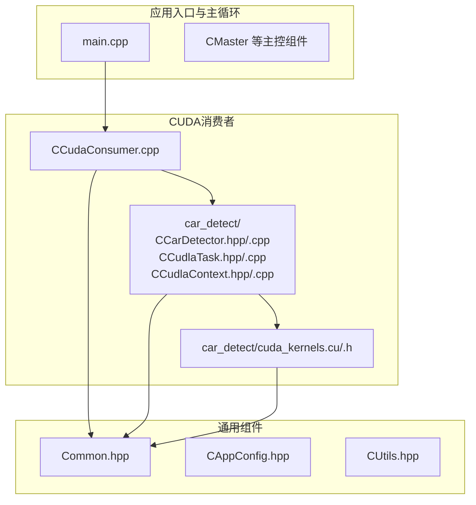
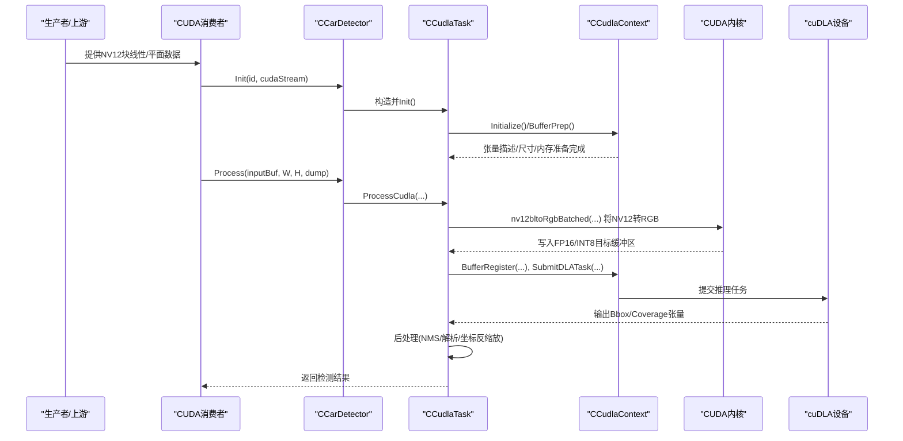
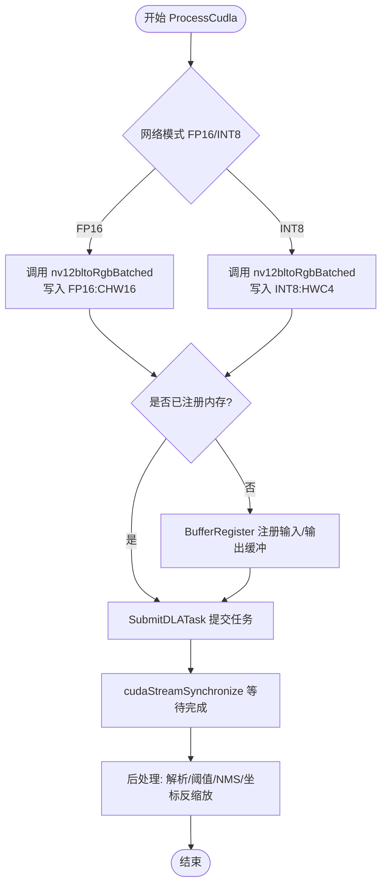
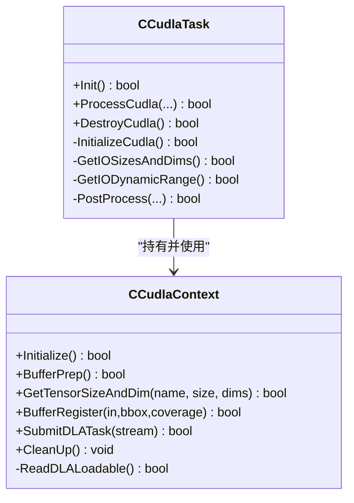
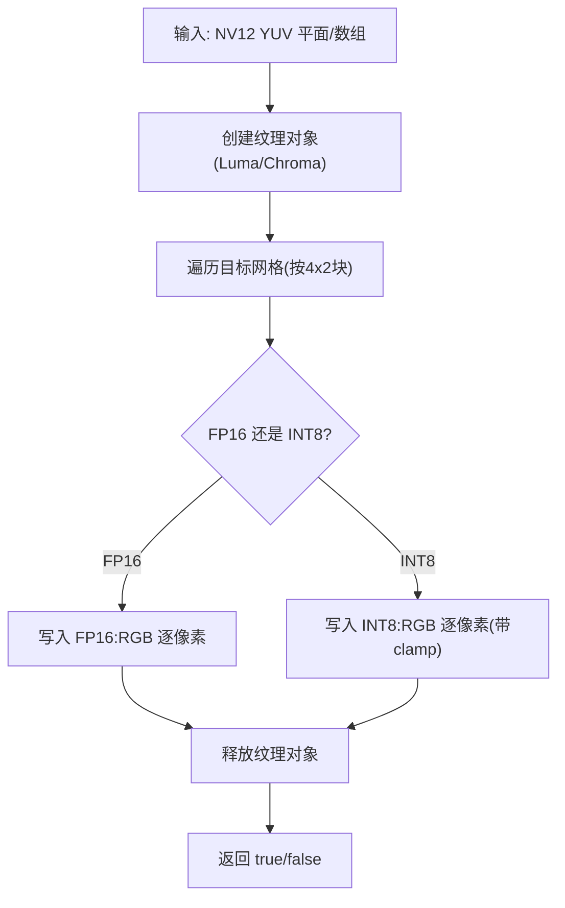
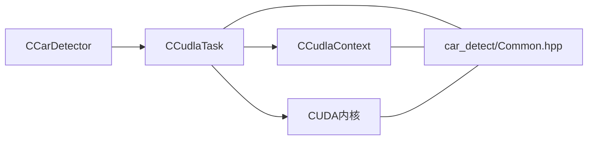

# 智能检测系统

<cite>
**本文引用的文件**   
- [car_detect/CCarDetector.cpp](file://car_detect/CCarDetector.cpp)
- [car_detect/CCarDetector.hpp](file://car_detect/CCarDetector.hpp)
- [car_detect/CCudlaContext.cpp](file://car_detect/CCudlaContext.cpp)
- [car_detect/CCudlaContext.hpp](file://car_detect/CCudlaContext.hpp)
- [car_detect/CCudlaTask.cpp](file://car_detect/CCudlaTask.cpp)
- [car_detect/CCudlaTask.hpp](file://car_detect/CCudlaTask.hpp)
- [car_detect/cuda_kernels.cu](file://car_detect/cuda_kernels.cu)
- [car_detect/cuda_kernels.h](file://car_detect/cuda_kernels.h)
- [car_detect/Common.hpp](file://car_detect/Common.hpp)
- [CCudaConsumer.cpp](file://CCudaConsumer.cpp)
- [README.md](file://README.md)
- [Common.hpp](file://Common.hpp)
</cite>

## 目录
1. [简介](#简介)
2. [项目结构](#项目结构)
3. [核心组件](#核心组件)
4. [架构总览](#架构总览)
5. [详细组件分析](#详细组件分析)
6. [依赖关系分析](#依赖关系分析)
7. [性能考虑](#性能考虑)
8. [故障排查指南](#故障排查指南)
9. [结论](#结论)
10. [附录](#附录)

## 简介
本文件面向“基于cuDLA的车辆检测”子系统，系统性阐述其架构设计、上下文管理与任务调度机制、从NV12缓冲区到RGB打包再到FP16格式转换的完整数据处理链路、CUDA内核优化策略与性能调优技巧，并提供深度学习模型生成与部署（TensorRT工具链）的实操指引及检测示例与结果分析。

## 项目结构
该仓库以多进程/多消费者架构为主，车辆检测作为CUDA消费者的一个可选能力模块，位于car_detect目录下；其余通用组件负责生产者、消费者、通道、流控等。

图示来源
- [CCudaConsumer.cpp:1-200](file://CCudaConsumer.cpp#L1-L200)
- [car_detect/CCarDetector.cpp:1-109](file://car_detect/CCarDetector.cpp#L1-L109)
- [car_detect/CCudlaTask.cpp:1-518](file://car_detect/CCudlaTask.cpp#L1-L518)
- [car_detect/CCudlaContext.cpp:1-319](file://car_detect/CCudlaContext.cpp#L1-L319)
- [car_detect/cuda_kernels.cu:1-316](file://car_detect/cuda_kernels.cu#L1-L316)
- [Common.hpp:1-87](file://Common.hpp#L1-L87)

章节来源
- [README.md:1-109](file://README.md#L1-L109)
- [CCudaConsumer.cpp:1-200](file://CCudaConsumer.cpp#L1-L200)

## 核心组件
- CCarDetector：对外接口封装，负责初始化cuDLA任务、接收输入帧并触发推理与后处理。
- CCudlaTask：核心推理执行器，负责cuDLA上下文初始化、输入输出张量尺寸维度查询、内存注册、任务提交、后处理（NMS、框解析、坐标反缩放）。
- CCudlaContext：cuDLA设备与模块生命周期管理，加载可执行载荷、枚举张量属性、分配/注册GPU内存、提交任务。
- CUDA内核：nv12->RGB批量转换，支持FP16与INT8两种模式，按CHW16或HWC4布局写入目标缓冲区。
- 公共类型与参数：NvInferInitParams、NvInferObject、Bndbox、Dims32等。

章节来源
- [car_detect/CCarDetector.hpp:17-34](file://car_detect/CCarDetector.hpp#L17-L34)
- [car_detect/CCudlaTask.hpp:16-96](file://car_detect/CCudlaTask.hpp#L16-L96)
- [car_detect/CCudlaContext.hpp:22-60](file://car_detect/CCudlaContext.hpp#L22-L60)
- [car_detect/cuda_kernels.h:14-42](file://car_detect/cuda_kernels.h#L14-L42)
- [car_detect/Common.hpp:44-107](file://car_detect/Common.hpp#L44-L107)

## 架构总览
cuDLA检测在CUDA消费者侧被启用，通过CCarDetector统一入口，内部委派给CCudlaTask完成推理管线；CUDA内核负责将NV12块线性/平面格式的YUV数据转换为网络所需的RGB格式（FP16或INT8），随后由cuDLA执行推理，最后CPU侧进行后处理与可视化。

图示来源
- [CCudaConsumer.cpp:43-51](file://CCudaConsumer.cpp#L43-L51)
- [car_detect/CCarDetector.cpp:33-109](file://car_detect/CCarDetector.cpp#L33-L109)
- [car_detect/CCudlaTask.cpp:152-245](file://car_detect/CCudlaTask.cpp#L152-L245)
- [car_detect/CCudlaContext.cpp:69-250](file://car_detect/CCudlaContext.cpp#L69-L250)
- [car_detect/cuda_kernels.cu:248-316](file://car_detect/cuda_kernels.cu#L248-L316)

## 详细组件分析

### CCarDetector：检测器入口与生命周期
- 负责设置GPU设备、创建隐式上下文、保存CUDA流句柄。
- 初始化NvInferInitParams（网络模式、模型路径、缩放因子、阈值、标签等）。
- 创建并初始化CCudlaTask，返回成功状态供上层使用。

章节来源
- [car_detect/CCarDetector.cpp:33-109](file://car_detect/CCarDetector.cpp#L33-L109)
- [car_detect/CCarDetector.hpp:17-34](file://car_detect/CCarDetector.hpp#L17-L34)

### CCudlaTask：推理与后处理
- InitializeCudla：创建CCudlaContext，读取模型载荷，查询输入/输出张量尺寸与维度，分配并绑定内存，必要时读取动态范围（INT8）。
- ProcessCudla：根据网络模式选择内核路径（FP16/INT8），调用nv12bltoRgbBatched进行格式转换，注册内存并提交cuDLA任务，同步流后进行后处理。
- 后处理：解析Bbox与Coverage张量，执行NMS，恢复原始分辨率坐标，输出对象列表与可选文件落盘。

图示来源
- [car_detect/CCudlaTask.cpp:188-245](file://car_detect/CCudlaTask.cpp#L188-L245)
- [car_detect/CCudlaTask.cpp:291-352](file://car_detect/CCudlaTask.cpp#L291-L352)

章节来源
- [car_detect/CCudlaTask.cpp:152-245](file://car_detect/CCudlaTask.cpp#L152-L245)
- [car_detect/CCudlaTask.cpp:291-352](file://car_detect/CCudlaTask.cpp#L291-L352)

### CCudlaContext：cuDLA上下文与任务提交
- Initialize：读取模型载荷，查询cuDLA设备数量，按传感器ID映射到DLA0/DLA1，创建设备并加载模块。
- BufferPrep：查询输入/输出张量数量与描述，填充尺寸与维度表，分配GPU指针数组与注册指针数组。
- BufferRegister：将输入/输出缓冲注册到cuDLA设备，便于DLA直接访问。
- SubmitDLATask：构造cudlaTask并提交至指定CUDA流。

图示来源
- [car_detect/CCudlaContext.hpp:22-60](file://car_detect/CCudlaContext.hpp#L22-L60)
- [car_detect/CCudlaTask.hpp:16-96](file://car_detect/CCudlaTask.hpp#L16-L96)

章节来源
- [car_detect/CCudlaContext.cpp:69-250](file://car_detect/CCudlaContext.cpp#L69-L250)
- [car_detect/CCudlaContext.hpp:22-60](file://car_detect/CCudlaContext.hpp#L22-L60)

### CUDA内核：NV12到RGB的批量转换
- 支持nv12toRgbBatched与nv12bltoRgbBatched两类接口，分别处理平面/块线性NV12源。
- 使用纹理对象采样Luma与Chroma平面，按4x2像素块进行双线性采样与BT.601颜色空间转换，写入目标缓冲（FP16半精度或INT8有符号三通道）。
- 计算缩放比例用于后续坐标反变换。

图示来源
- [car_detect/cuda_kernels.cu:23-172](file://car_detect/cuda_kernels.cu#L23-L172)
- [car_detect/cuda_kernels.cu:248-316](file://car_detect/cuda_kernels.cu#L248-L316)

章节来源
- [car_detect/cuda_kernels.cu:23-172](file://car_detect/cuda_kernels.cu#L23-L172)
- [car_detect/cuda_kernels.cu:248-316](file://car_detect/cuda_kernels.cu#L248-L316)
- [car_detect/cuda_kernels.h:14-42](file://car_detect/cuda_kernels.h#L14-L42)

### 数据处理链路：NV12 → RGB → FP16/INT8 → 推理 → 检测框
- 输入NV12（块线性/平面）经CUDA内核转换为RGB，FP16模式写入CHW16布局，INT8模式写入HWC4布局（cuDLA需要的对齐）。
- 内存注册后提交cuDLA任务，得到Bbox与Coverage两个输出张量。
- CPU侧解析输出，执行NMS与分组过滤，再将检测框坐标按输入缩放比例反变换回原图坐标系。

章节来源
- [car_detect/CCudlaTask.cpp:188-245](file://car_detect/CCudlaTask.cpp#L188-L245)
- [car_detect/CCudlaTask.cpp:291-352](file://car_detect/CCudlaTask.cpp#L291-L352)
- [README.md:96-108](file://README.md#L96-L108)

## 依赖关系分析
- 组件耦合
  - CCarDetector依赖CCudlaTask；CCudlaTask依赖CCudlaContext。
  - CCudlaTask依赖CUDA内核函数nv12bltoRgbBatched/nv12toRgbBatched。
  - 所有组件共享car_detect/Common.hpp中的公共类型与参数结构体。
- 外部依赖
  - CUDA运行时与cuDLA驱动API。
  - TensorRT引擎文件（FP16/INT8）与校准表（INT8动态范围）。

图示来源
- [car_detect/CCarDetector.cpp:9-13](file://car_detect/CCarDetector.cpp#L9-L13)
- [car_detect/CCudlaTask.cpp:9-12](file://car_detect/CCudlaTask.cpp#L9-L12)
- [car_detect/CCudlaContext.cpp:9-11](file://car_detect/CCudlaContext.cpp#L9-L11)
- [car_detect/cuda_kernels.cu:9](file://car_detect/cuda_kernels.cu#L9)
- [car_detect/Common.hpp:12-18](file://car_detect/Common.hpp#L12-L18)

章节来源
- [car_detect/CCarDetector.cpp:9-13](file://car_detect/CCarDetector.cpp#L9-L13)
- [car_detect/CCudlaTask.cpp:9-12](file://car_detect/CCudlaTask.cpp#L9-L12)
- [car_detect/CCudlaContext.cpp:9-11](file://car_detect/CCudlaContext.cpp#L9-L11)
- [car_detect/cuda_kernels.cu:9](file://car_detect/cuda_kernels.cu#L9)
- [car_detect/Common.hpp:12-18](file://car_detect/Common.hpp#L12-L18)

## 性能考虑
- 内核并行度与块配置
  - 内核采用32x32线程块，Z维批大小限制在32以内，避免过多激活块导致资源紧张。
  - 通过纹理对象进行点采样，减少显存带宽压力。
- 内存与数据布局
  - FP16模式写入CHW16，INT8模式写入HWC4，满足cuDLA对齐要求，减少额外拷贝。
  - 使用cudaStreamAttachMemAsync将管理内存附加到CUDA流，提升异步性能。
- 流与同步
  - cuDLA任务提交到独立CUDA流，完成后同步等待，避免阻塞主线程。
- 缩放与坐标反变换
  - 在内核中计算缩放比，后处理阶段仅做除法，降低CPU负担。

章节来源
- [car_detect/cuda_kernels.cu:220-246](file://car_detect/cuda_kernels.cu#L220-L246)
- [car_detect/CCudlaTask.cpp:178-186](file://car_detect/CCudlaTask.cpp#L178-L186)
- [car_detect/CCudlaTask.cpp:240](file://car_detect/CCudlaTask.cpp#L240)

## 故障排查指南
- cuDLA设备不可用
  - 现象：设备计数为0或创建失败。
  - 排查：确认驱动安装、设备权限、平台支持情况。
- 模型载荷读取失败
  - 现象：无法打开/读取模型文件或大小不匹配。
  - 排查：检查模型路径、文件存在性与完整性。
- 张量描述查询失败
  - 现象：输入/输出层名不匹配或未找到。
  - 排查：核对配置中的层名与模型导出时一致。
- 内存注册/提交失败
  - 现象：注册输出张量失败或提交任务错误。
  - 排查：确认缓冲区已分配且尺寸正确，检查cuDLA状态码。
- 后处理异常
  - 现象：NMS或坐标反变换异常。
  - 排查：检查阈值配置、网络模式与动态范围（INT8）。

章节来源
- [car_detect/CCudlaContext.cpp:33-67](file://car_detect/CCudlaContext.cpp#L33-L67)
- [car_detect/CCudlaContext.cpp:113-197](file://car_detect/CCudlaContext.cpp#L113-L197)
- [car_detect/CCudlaContext.cpp:230-250](file://car_detect/CCudlaContext.cpp#L230-L250)
- [car_detect/CCudlaTask.cpp:354-363](file://car_detect/CCudlaTask.cpp#L354-L363)

## 结论
该系统以清晰的分层架构实现了从NV12到检测框的完整链路：CUDA内核负责高效的数据格式转换，cuDLA承担推理加速，CPU侧完成后处理与可视化。通过合理的内存布局与流同步策略，系统在保证精度的同时兼顾了实时性与可维护性。建议在部署时结合具体硬件平台进一步微调内核块配置与批大小，并确保TensorRT模型与校准表的正确生成与加载。

## 附录

### 模型生成与部署（TensorRT工具链）
- FP16模式（输入CHW16，输出CHW16）
  - 使用trtexec生成引擎文件，指定--fp16、--inputIOFormats与--outputIOFormats，以及--saveEngine输出路径。
- INT8模式（输入HWC4，需校准表）
  - 需要离线校准生成per-tensor scales文件，运行时读取动态范围以正确量化。
- 常见命令参考
  - 参考README中的示例命令，确保--useDLACore与--safe/--verbose等参数按需配置。

章节来源
- [README.md:98-102](file://README.md#L98-L102)

### 实际检测示例与结果分析
- 示例日志
  - “ALL MEMORY REGISTERED SUCCESSFULLY”
  - “[cuDLA X Detection] - N objects were detected”
  - “[left top width height] object[i]: Label”
- 分析要点
  - 检测数量与置信度阈值、NMS阈值密切相关，可根据场景调整。
  - 若出现误检/漏检，优先检查模型质量、阈值设置与输入缩放一致性。

章节来源
- [README.md:104-106](file://README.md#L104-L106)