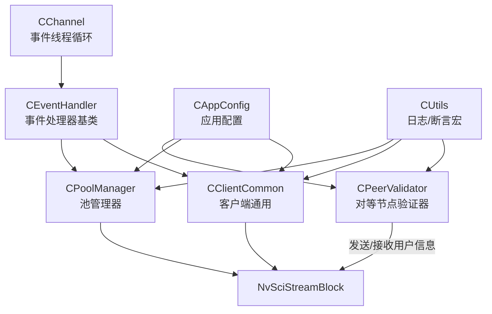
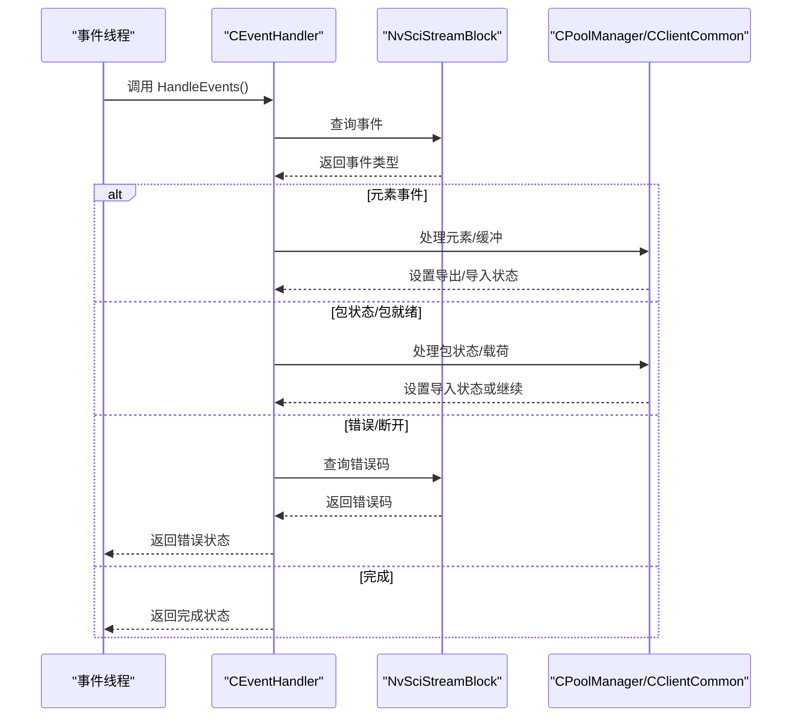
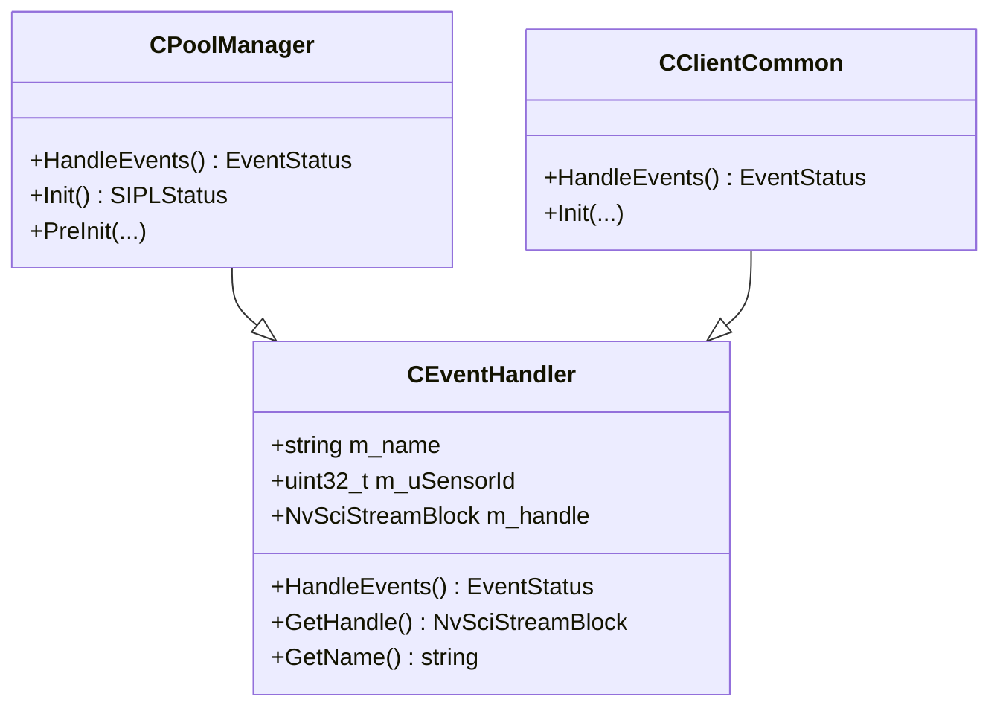
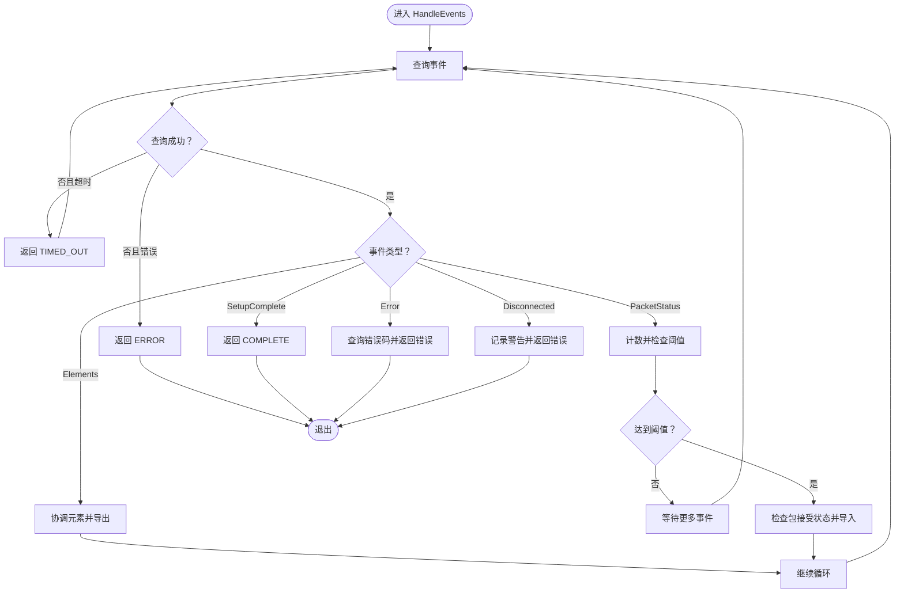
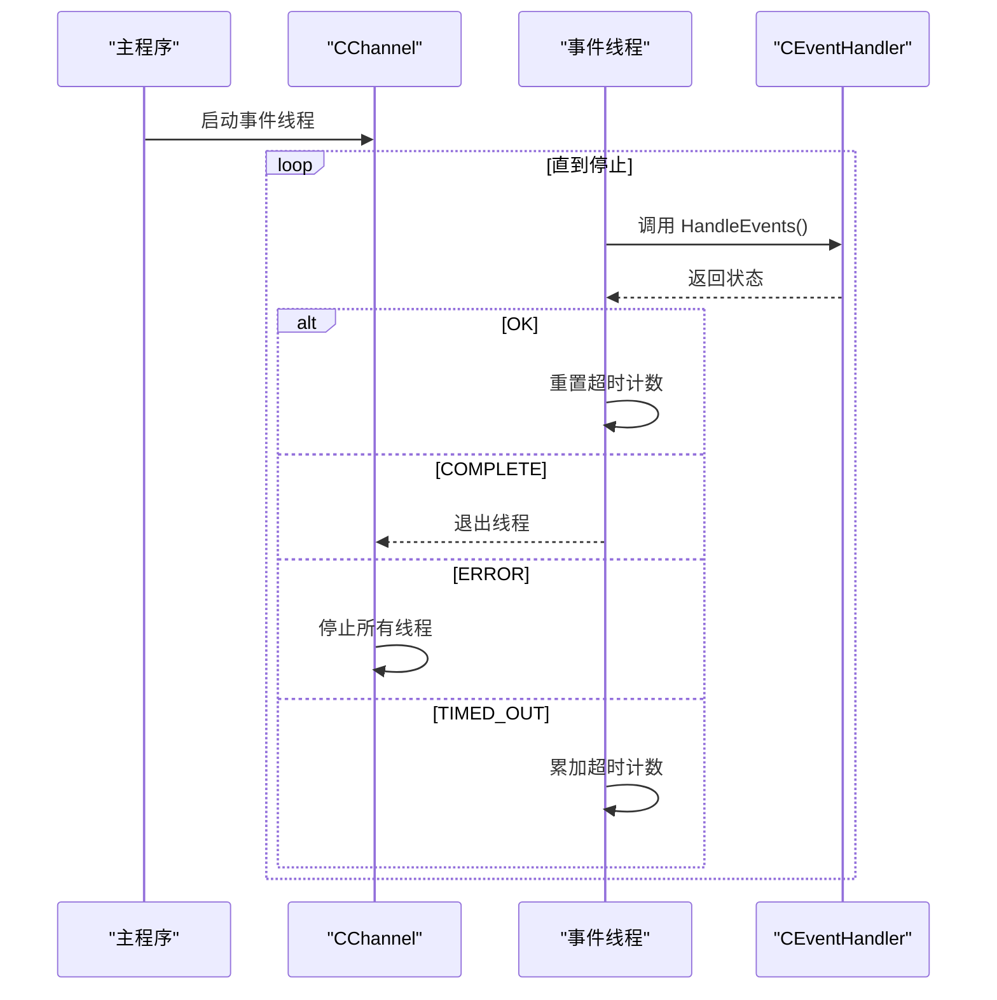
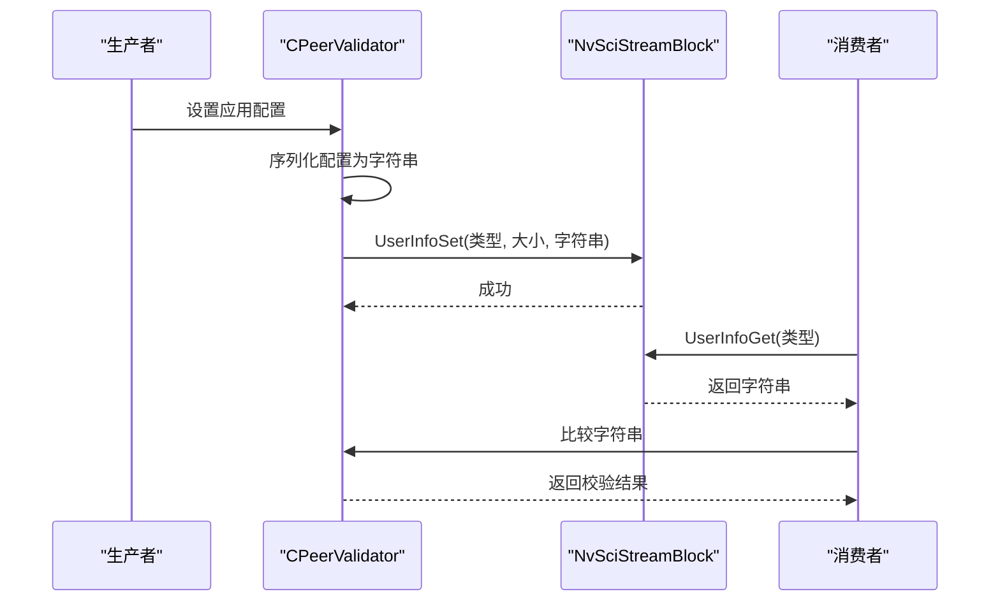
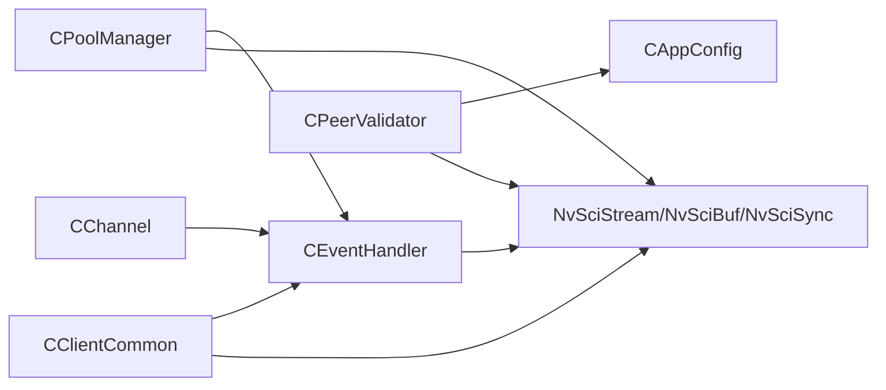

# 事件处理机制

<cite>
**本文引用的文件**
- [CEventHandler.hpp](file://CEventHandler.hpp)
- [CPoolManager.hpp](file://CPoolManager.hpp)
- [CPoolManager.cpp](file://CPoolManager.cpp)
- [CClientCommon.hpp](file://CClientCommon.hpp)
- [CClientCommon.cpp](file://CClientCommon.cpp)
- [CChannel.hpp](file://CChannel.hpp)
- [CPeerValidator.hpp](file://CPeerValidator.hpp)
- [CPeerValidator.cpp](file://CPeerValidator.cpp)
- [Common.hpp](file://Common.hpp)
- [CUtils.hpp](file://CUtils.hpp)
- [CAppConfig.hpp](file://CAppConfig.hpp)
- [CAppConfig.cpp](file://CAppConfig.cpp)
- [main.cpp](file://main.cpp)
</cite>

## 目录
1. [引言](#引言)
2. [项目结构](#项目结构)
3. [核心组件](#核心组件)
4. [架构总览](#架构总览)
5. [详细组件分析](#详细组件分析)
6. [依赖关系分析](#依赖关系分析)
7. [性能考量](#性能考量)
8. [故障排查指南](#故障排查指南)
9. [结论](#结论)
10. [附录](#附录)

## 引言
本文件围绕事件处理机制展开，系统性阐述事件处理器基类（CEventHandler）的设计与职责边界，事件类型与状态机模型，事件队列管理与分发策略，以及对等节点验证器（CPeerValidator）在节点身份验证、连接状态监控与异常处理方面的实现原理。同时给出异步事件处理流程、错误传播与恢复策略、配置项与性能优化建议、调试方法及常见问题解决方案。

## 项目结构
该模块以 NvSIPL/NvSciStream 为基础，采用“事件驱动 + 线程池式事件循环”的架构组织。主要文件职责如下：
- 事件处理基类：CEventHandler.hpp 定义统一接口与事件状态枚举
- 具体事件处理器：
  - CPoolManager：面向池化缓冲区与包状态的事件处理
  - CClientCommon：面向客户端通用事件流（元素、包、同步对象、运行时数据）
- 通道与线程：CChannel.hpp 提供事件线程循环与超时控制
- 对等验证：CPeerValidator 实现基于用户信息的节点一致性校验
- 配置与工具：CAppConfig.hpp/.cpp 提供平台与运行参数；CUtils.hpp 提供日志与断言宏；Common.hpp 定义通用常量与枚举

**图表来源**
- [CEventHandler.hpp:23-51](file://CEventHandler.hpp#L23-L51)
- [CPoolManager.hpp:33-41](file://CPoolManager.hpp#L33-L41)
- [CClientCommon.hpp:47-51](file://CClientCommon.hpp#L47-L51)
- [CChannel.hpp:112-140](file://CChannel.hpp#L112-L140)
- [CPeerValidator.hpp:21-61](file://CPeerValidator.hpp#L21-L61)
- [CAppConfig.hpp:19-82](file://CAppConfig.hpp#L19-L82)
- [CUtils.hpp:28-82](file://CUtils.hpp#L28-L82)

**章节来源**
- [CEventHandler.hpp:15-51](file://CEventHandler.hpp#L15-L51)
- [CPoolManager.hpp:19-41](file://CPoolManager.hpp#L19-L41)
- [CClientCommon.hpp:41-51](file://CClientCommon.hpp#L41-L51)
- [CChannel.hpp:112-140](file://CChannel.hpp#L112-L140)
- [CPeerValidator.hpp:21-61](file://CPeerValidator.hpp#L21-L61)
- [CAppConfig.hpp:19-82](file://CAppConfig.hpp#L19-L82)
- [CUtils.hpp:28-82](file://CUtils.hpp#L28-L82)

## 核心组件
- 事件状态枚举（EventStatus）：用于统一表达事件处理结果，包括 OK、COMPLETE、TIMED_OUT、ERROR
- 事件处理器基类（CEventHandler）：封装 NvSciStreamBlock 句柄、传感器ID与名称，提供纯虚函数 HandleEvents 作为事件处理入口
- 池管理器（CPoolManager）：负责元素属性协调、缓冲分配、包创建与状态检查，并在 SetupComplete 后进入运行态
- 客户端通用（CClientCommon）：负责元素支持、同步对象导入导出、包生命周期与运行时数据处理
- 事件线程循环（CChannel::EventThreadFunc）：为每个事件处理器绑定独立线程，循环调用 HandleEvents，具备超时累计与错误传播控制
- 对等节点验证器（CPeerValidator）：通过 NvSciStream 用户信息通道发送/接收配置摘要，进行节点一致性校验

**章节来源**
- [CEventHandler.hpp:15-51](file://CEventHandler.hpp#L15-L51)
- [CPoolManager.cpp:41-98](file://CPoolManager.cpp#L41-L98)
- [CClientCommon.cpp:119-205](file://CClientCommon.cpp#L119-L205)
- [CChannel.hpp:112-140](file://CChannel.hpp#L112-L140)
- [CPeerValidator.cpp:24-63](file://CPeerValidator.cpp#L24-L63)

## 架构总览
事件处理采用“事件查询 + 分发 + 状态推进”的模式：
- 事件查询：各处理器通过 NvSciStreamBlockEventQuery 获取当前事件
- 事件分发：根据事件类型进入不同处理分支（元素、包、同步、错误、断开、完成）
- 状态推进：在每一步处理后设置相应的 SetupStatus 或返回状态，驱动状态机前进
- 线程模型：每个处理器在独立线程中循环处理，避免阻塞其他处理器

**图表来源**
- [CChannel.hpp:112-140](file://CChannel.hpp#L112-L140)
- [CEventHandler.hpp:35-35](file://CEventHandler.hpp#L35-L35)
- [CPoolManager.cpp:41-98](file://CPoolManager.cpp#L41-L98)
- [CClientCommon.cpp:119-205](file://CClientCommon.cpp#L119-L205)

## 详细组件分析

### 事件处理器基类（CEventHandler）
- 设计要点
  - 统一的 HandleEvents 接口，子类必须实现
  - 内部保存 NvSciStreamBlock 句柄、传感器ID与处理器名称
  - 返回值使用 EventStatus，便于上层统一处理
- 关键路径
  - 获取句柄与名称：[CEventHandler.hpp:37-45](file://CEventHandler.hpp#L37-L45)
  - 事件处理入口：[CEventHandler.hpp:35-35](file://CEventHandler.hpp#L35-L35)

**图表来源**
- [CEventHandler.hpp:23-51](file://CEventHandler.hpp#L23-L51)
- [CPoolManager.hpp:33-41](file://CPoolManager.hpp#L33-L41)
- [CClientCommon.hpp:47-51](file://CClientCommon.hpp#L47-L51)

**章节来源**
- [CEventHandler.hpp:23-51](file://CEventHandler.hpp#L23-L51)

### 事件队列与事件分发（CPoolManager）
- 事件队列管理
  - 使用 NvSciStreamBlockEventQuery 进行事件轮询，配合 QUERY_TIMEOUT 控制等待时间
  - 超时返回 EVENT_STATUS_TIMED_OUT，允许上层线程循环继续等待
- 事件分发逻辑
  - Elements：协调元素属性并导出选择的元素
  - PacketStatus：统计收到的包数量，达到阈值后检查包接受状态并导入
  - Error：查询错误码并返回错误状态
  - Disconnected：在元素/包未完成前记录警告
  - SetupComplete：返回完成状态，切换到运行阶段
- 关键路径
  - 事件查询与分发：[CPoolManager.cpp:41-98](file://CPoolManager.cpp#L41-L98)
  - 元素协调与缓冲导出：[CPoolManager.cpp:100-237](file://CPoolManager.cpp#L100-L237)
  - 包创建与导入：[CPoolManager.cpp:269-334](file://CPoolManager.cpp#L269-L334)
  - 包状态检查与导入：[CPoolManager.cpp:337-395](file://CPoolManager.cpp#L337-L395)

**图表来源**
- [CPoolManager.cpp:41-98](file://CPoolManager.cpp#L41-L98)
- [CPoolManager.cpp:100-237](file://CPoolManager.cpp#L100-L237)
- [CPoolManager.cpp:269-334](file://CPoolManager.cpp#L269-L334)
- [CPoolManager.cpp:337-395](file://CPoolManager.cpp#L337-L395)

**章节来源**
- [CPoolManager.cpp:41-98](file://CPoolManager.cpp#L41-L98)
- [CPoolManager.cpp:100-237](file://CPoolManager.cpp#L100-L237)
- [CPoolManager.cpp:269-334](file://CPoolManager.cpp#L269-L334)
- [CPoolManager.cpp:337-395](file://CPoolManager.cpp#L337-L395)

### 事件队列与事件分发（CClientCommon）
- 事件队列管理
  - 与池管理器一致，使用 NvSciStreamBlockEventQuery 轮询事件
- 事件分发逻辑
  - Elements：设置元素支持
  - PacketCreate/PacketsComplete：创建包、导入包导入状态
  - WaiterAttr/SignalObj：导出/导入同步对象
  - SetupComplete：进入运行阶段
  - PacketReady：处理有效载荷
  - Error/Disconnected：记录错误并返回错误状态
- 关键路径
  - 事件查询与分发：[CClientCommon.cpp:119-205](file://CClientCommon.cpp#L119-L205)

**章节来源**
- [CClientCommon.cpp:119-205](file://CClientCommon.cpp#L119-L205)

### 事件线程循环与异步机制（CChannel）
- 线程模型
  - 为每个事件处理器创建独立线程，线程函数内循环调用 HandleEvents
- 超时与恢复
  - 计数超时次数，超过阈值发出警告；OK 状态重置计数
  - COMPLETE 状态触发线程退出；ERROR 状态停止通道运行
- 关键路径
  - 事件线程循环：[CChannel.hpp:112-140](file://CChannel.hpp#L112-L140)

**图表来源**
- [CChannel.hpp:112-140](file://CChannel.hpp#L112-L140)

**章节来源**
- [CChannel.hpp:112-140](file://CChannel.hpp#L112-L140)

### 对等节点验证器（CPeerValidator）
- 功能概述
  - 将应用配置的关键字段序列化为字符串，通过 NvSciStreamBlockUserInfoSet 发送
  - 在对端通过 NvSciStreamBlockUserInfoGet 获取并比对，确保生产者与消费者配置一致
- 数据结构与字段
  - isStaticConfig：是否使用静态配置
  - platformName：平台配置名
  - masks：掩码集合
  - isMultiElementsEnabled：多元素开关
- 关键路径
  - 发送验证信息：[CPeerValidator.cpp:24-35](file://CPeerValidator.cpp#L24-L35)
  - 接收并校验：[CPeerValidator.cpp:37-63](file://CPeerValidator.cpp#L37-L63)
  - 序列化配置：[CPeerValidator.cpp:65-92](file://CPeerValidator.cpp#L65-L92)
  - 配置来源：[CAppConfig.hpp:22-49](file://CAppConfig.hpp#L22-L49)

**图表来源**
- [CPeerValidator.cpp:24-63](file://CPeerValidator.cpp#L24-L63)
- [CPeerValidator.cpp:65-92](file://CPeerValidator.cpp#L65-L92)
- [CAppConfig.hpp:22-49](file://CAppConfig.hpp#L22-L49)

**章节来源**
- [CPeerValidator.cpp:24-63](file://CPeerValidator.cpp#L24-L63)
- [CPeerValidator.cpp:65-92](file://CPeerValidator.cpp#L65-L92)
- [CAppConfig.hpp:22-49](file://CAppConfig.hpp#L22-L49)

## 依赖关系分析
- 组件耦合
  - CPoolManager/CClientCommon 依赖 CEventHandler 抽象，通过继承扩展具体事件处理逻辑
  - CChannel 通过组合方式持有事件处理器指针，解耦线程调度与事件处理
  - CPeerValidator 依赖 CAppConfig 提供配置信息，依赖 NvSciStreamBlock 进行用户信息交换
- 外部依赖
  - NvSciStream/NvSciBuf/NvSciSync：事件查询、缓冲与同步对象操作
  - 日志与断言宏：统一的日志输出与错误检查

**图表来源**
- [CChannel.hpp:112-140](file://CChannel.hpp#L112-L140)
- [CEventHandler.hpp:23-51](file://CEventHandler.hpp#L23-L51)
- [CPoolManager.hpp:33-41](file://CPoolManager.hpp#L33-L41)
- [CClientCommon.hpp:47-51](file://CClientCommon.hpp#L47-L51)
- [CPeerValidator.hpp:21-61](file://CPeerValidator.hpp#L21-L61)
- [CAppConfig.hpp:19-82](file://CAppConfig.hpp#L19-L82)

**章节来源**
- [CChannel.hpp:112-140](file://CChannel.hpp#L112-L140)
- [CEventHandler.hpp:23-51](file://CEventHandler.hpp#L23-L51)
- [CPoolManager.hpp:33-41](file://CPoolManager.hpp#L33-L41)
- [CClientCommon.hpp:47-51](file://CClientCommon.hpp#L47-L51)
- [CPeerValidator.hpp:21-61](file://CPeerValidator.hpp#L21-L61)
- [CAppConfig.hpp:19-82](file://CAppConfig.hpp#L19-L82)

## 性能考量
- 事件轮询超时
  - QUERY_TIMEOUT 控制单次事件查询等待时间，避免长时间阻塞
  - MAX_QUERY_TIMEOUTS 限制连续超时次数，防止线程“卡死”
- 缓冲与包管理
  - 池管理器批量创建包与缓冲，减少频繁分配带来的抖动
  - 仅插入实际使用的元素类型，跳过不必要元素以降低内存占用
- 同步对象与等待
  - 客户端按需导出/导入同步对象，避免不必要的 CPU 等待上下文
- 日志级别
  - 使用 CLogger 的不同级别输出，生产环境可降低日志级别以减少 I/O 开销

**章节来源**
- [Common.hpp:23-24](file://Common.hpp#L23-L24)
- [Common.hpp:22-22](file://Common.hpp#L22-L22)
- [CPoolManager.cpp:294-296](file://CPoolManager.cpp#L294-L296)
- [CUtils.hpp:175-275](file://CUtils.hpp#L175-L275)

## 故障排查指南
- 事件查询超时
  - 现象：线程持续返回 TIMED_OUT
  - 排查：确认 NvSciStream 事件是否正常产生；检查 QUERY_TIMEOUT 是否过大；观察 MAX_QUERY_TIMEOUTS 是否被触发
  - 参考：[CChannel.hpp:112-140](file://CChannel.hpp#L112-L140)、[CPoolManager.cpp:47-55](file://CPoolManager.cpp#L47-L55)、[CClientCommon.cpp:125-133](file://CClientCommon.cpp#L125-L133)
- 错误事件
  - 现象：返回 ERROR 并记录错误码
  - 排查：使用 NvSciStreamBlockErrorGet 获取详细错误；检查设备/驱动状态
  - 参考：[CPoolManager.cpp:70-78](file://CPoolManager.cpp#L70-L78)、[CClientCommon.cpp:182-191](file://CClientCommon.cpp#L182-L191)
- 断开事件
  - 现象：在元素/包未完成前收到断开
  - 排查：确认连接稳定性；检查对端生命周期管理
  - 参考：[CPoolManager.cpp:79-86](file://CPoolManager.cpp#L79-L86)、[CClientCommon.cpp:192-195](file://CClientCommon.cpp#L192-L195)
- 验证失败
  - 现象：对等验证返回错误
  - 排查：对比生产者/消费者配置字符串；确认 isStaticConfig、platformName、masks、isMultiElementsEnabled 一致性
  - 参考：[CPeerValidator.cpp:37-63](file://CPeerValidator.cpp#L37-L63)、[CPeerValidator.cpp:65-92](file://CPeerValidator.cpp#L65-L92)
- 日志定位
  - 使用 LOG_DBG/INFO/WARN/ERR 宏输出上下文信息，结合线程名快速定位问题
  - 参考：[CUtils.hpp:142-160](file://CUtils.hpp#L142-L160)

**章节来源**
- [CChannel.hpp:112-140](file://CChannel.hpp#L112-L140)
- [CPoolManager.cpp:47-55](file://CPoolManager.cpp#L47-L55)
- [CClientCommon.cpp:125-133](file://CClientCommon.cpp#L125-L133)
- [CPoolManager.cpp:70-78](file://CPoolManager.cpp#L70-L78)
- [CClientCommon.cpp:182-191](file://CClientCommon.cpp#L182-L191)
- [CPoolManager.cpp:79-86](file://CPoolManager.cpp#L79-L86)
- [CClientCommon.cpp:192-195](file://CClientCommon.cpp#L192-L195)
- [CPeerValidator.cpp:37-63](file://CPeerValidator.cpp#L37-L63)
- [CPeerValidator.cpp:65-92](file://CPeerValidator.cpp#L65-L92)
- [CUtils.hpp:142-160](file://CUtils.hpp#L142-L160)

## 结论
本事件处理机制以 CEventHandler 为抽象基类，结合 CPoolManager 与 CClientCommon 的具体实现，形成清晰的事件驱动架构。通过 CChannel 的线程循环与超时控制，保证了异步事件处理的鲁棒性；CPeerValidator 则提供了跨进程/跨节点的一致性保障。整体设计遵循高内聚、低耦合原则，便于扩展新的事件处理器与验证策略。

## 附录
- 配置选项与参数
  - 通用常量：最大传感器数、每传感器最大输出、包数、元素数、消费者数、同步数、查询超时等
  - 参考：[Common.hpp:14-31](file://Common.hpp#L14-L31)
- 日志与断言
  - 日志级别与输出宏：DEBUG/INFO/WARNING/ERROR
  - 断言与错误检查宏：统一错误返回与日志输出
  - 参考：[CUtils.hpp:142-160](file://CUtils.hpp#L142-L160)、[CUtils.hpp:28-82](file://CUtils.hpp#L28-L82)
- 主程序与信号处理
  - 信号处理与优雅退出：SIGINT/SIGTERM/SIGQUIT/SIGHUP
  - 参考：[main.cpp:44-72](file://main.cpp#L44-L72)

**章节来源**
- [Common.hpp:14-31](file://Common.hpp#L14-L31)
- [CUtils.hpp:142-160](file://CUtils.hpp#L142-L160)
- [CUtils.hpp:28-82](file://CUtils.hpp#L28-L82)
- [main.cpp:44-72](file://main.cpp#L44-L72)