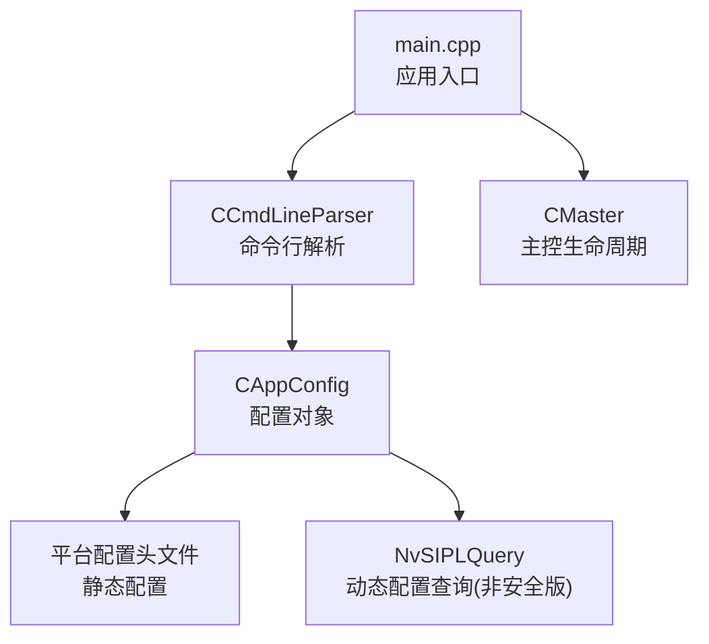
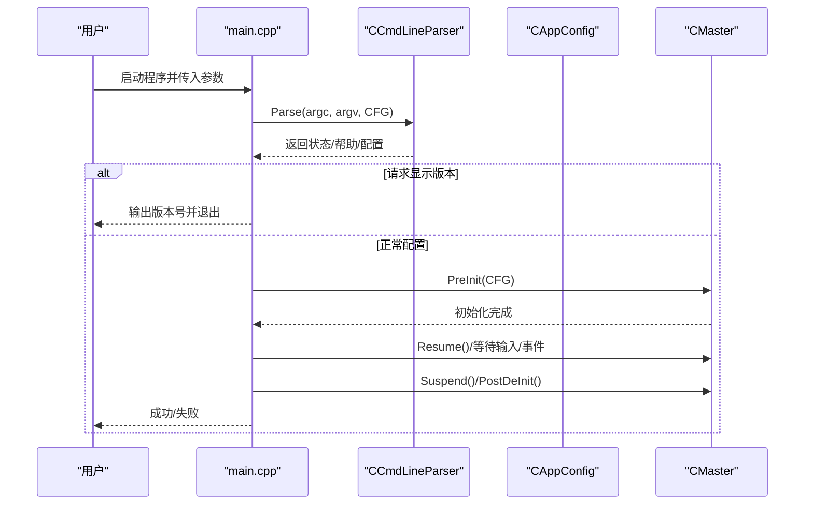
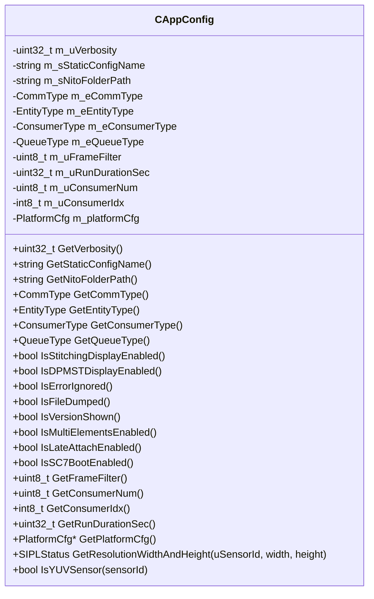
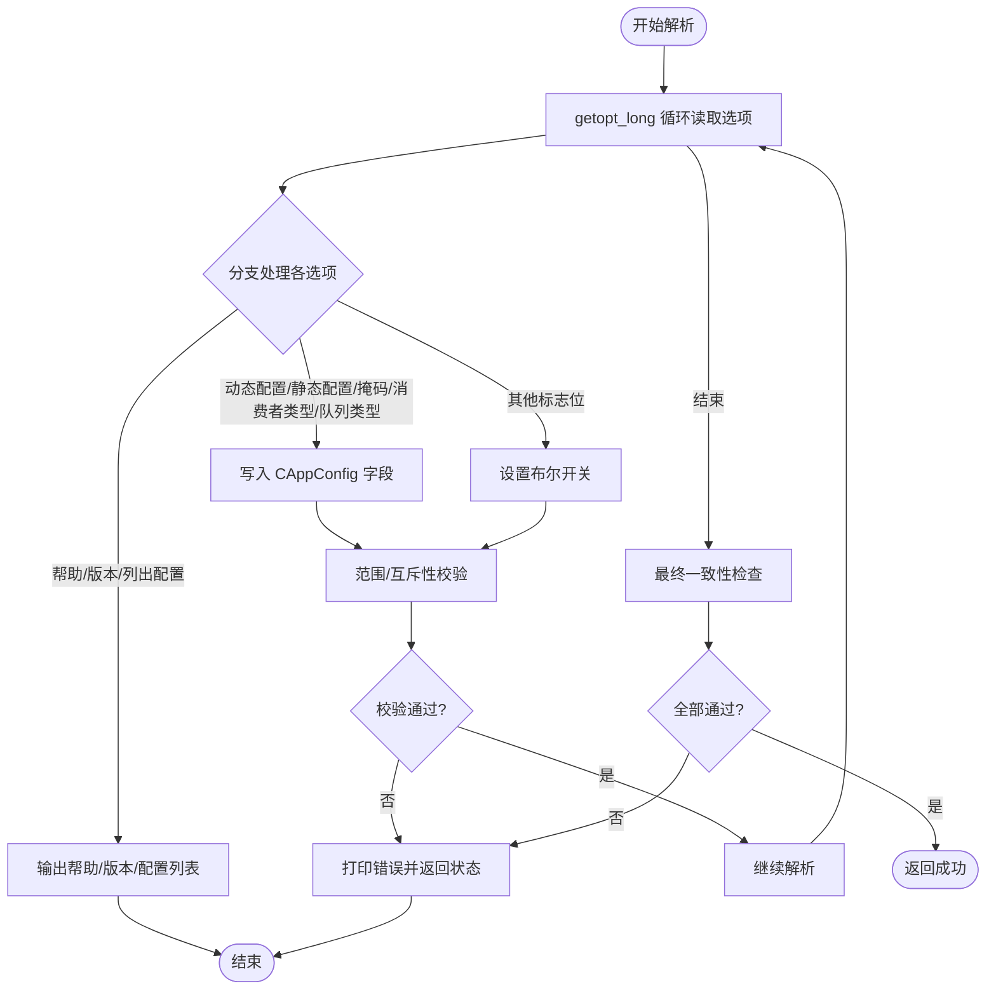
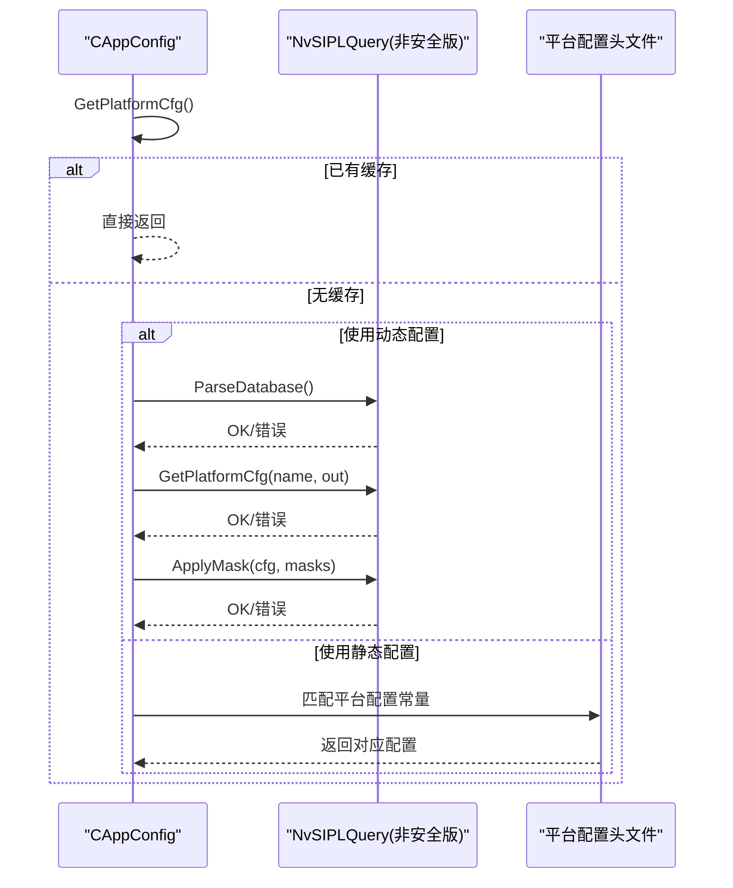
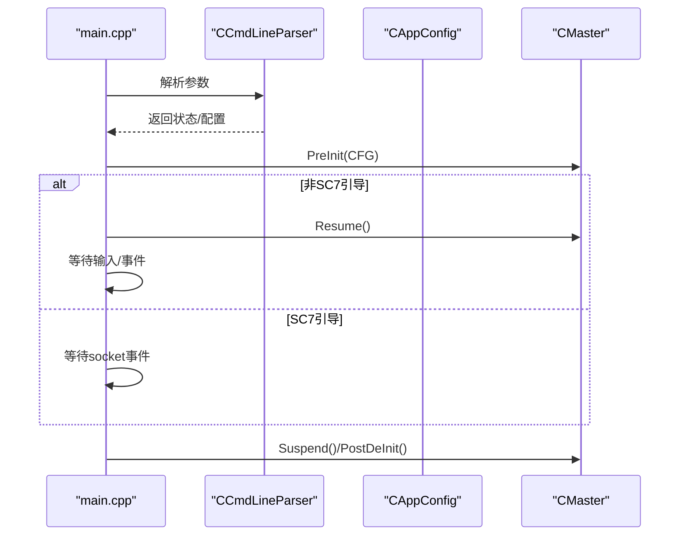
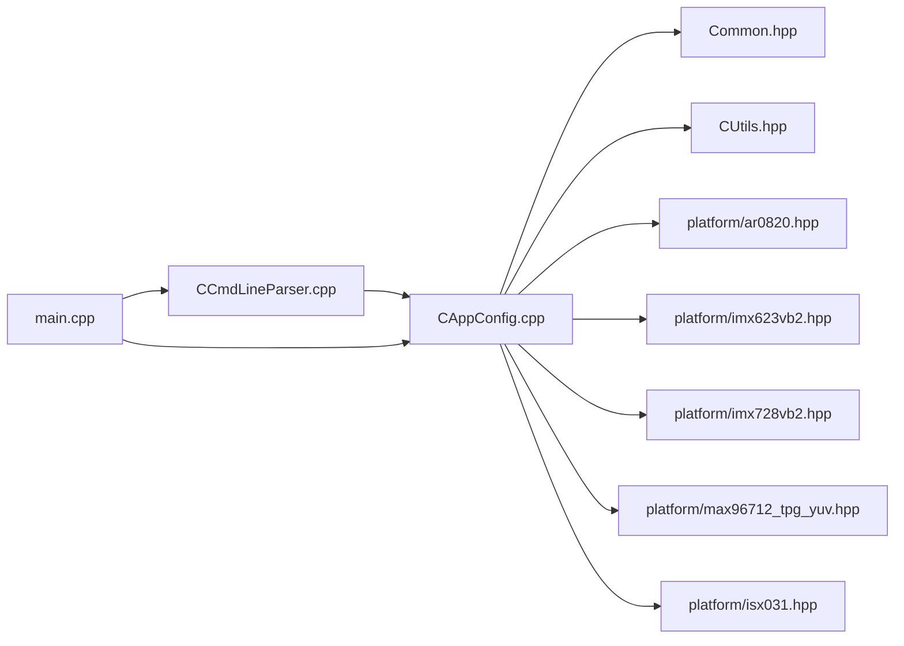

# 应用配置管理

<cite>
**本文引用的文件**
- [CAppConfig.hpp](file://CAppConfig.hpp)
- [CAppConfig.cpp](file://CAppConfig.cpp)
- [CCmdLineParser.hpp](file://CCmdLineParser.hpp)
- [CCmdLineParser.cpp](file://CCmdLineParser.cpp)
- [main.cpp](file://main.cpp)
- [Common.hpp](file://Common.hpp)
- [CUtils.hpp](file://CUtils.hpp)
- [ar0820.hpp](file://platform/ar0820.hpp)
- [imx623vb2.hpp](file://platform/imx623vb2.hpp)
- [imx728vb2.hpp](file://platform/imx728vb2.hpp)
- [max96712_tpg_yuv.hpp](file://platform/max96712_tpg_yuv.hpp)
- [isx031.hpp](file://platform/isx031.hpp)
- [README.md](file://README.md)
- [ReleaseNote.md](file://ReleaseNote.md)
</cite>

## 目录
1. [简介](#简介)
2. [项目结构](#项目结构)
3. [核心组件](#核心组件)
4. [架构总览](#架构总览)
5. [详细组件分析](#详细组件分析)
6. [依赖关系分析](#依赖关系分析)
7. [性能考虑](#性能考虑)
8. [故障排查指南](#故障排查指南)
9. [结论](#结论)
10. [附录：配置选项与最佳实践](#附录配置选项与最佳实践)

## 简介
本文件系统性阐述应用配置管理系统的设计与实现，重点覆盖以下方面：
- 配置对象 CAppConfig 的设计与职责边界、默认值策略与运行时可变项
- 命令行解析器 CCmdLineParser 的参数解析、类型转换、校验与错误处理
- 初始化流程、平台配置加载（动态/静态）与平台能力查询
- 配置变更通知与运行期影响路径
- 完整配置项清单、使用示例与常见场景最佳实践
- 配置验证、故障诊断与性能调优建议

## 项目结构
围绕配置管理的关键文件与职责如下：
- CAppConfig：集中持有所有运行期配置，负责平台配置选择与查询、分辨率与传感器属性查询
- CCmdLineParser：命令行参数解析、参数合法性校验、类型转换与默认值注入
- main：应用入口，串联命令行解析、日志级别设置、主控生命周期
- 平台配置头文件：定义静态平台配置常量，供 CAppConfig 在静态模式下直接使用
- 公共类型与工具：定义通信/实体/消费者/队列类型枚举以及日志宏等

**图表来源**
- [main.cpp:253-303](file://main.cpp#L253-L303)
- [CCmdLineParser.cpp:13-208](file://CCmdLineParser.cpp#L13-L208)
- [CAppConfig.cpp:21-75](file://CAppConfig.cpp#L21-L75)

**章节来源**
- [main.cpp:253-303](file://main.cpp#L253-L303)
- [CAppConfig.hpp:19-80](file://CAppConfig.hpp#L19-L80)
- [CCmdLineParser.hpp:34-44](file://CCmdLineParser.hpp#L34-L44)

## 核心组件
- CAppConfig
  - 职责：封装所有运行期配置；在首次访问时按需加载平台配置；提供平台能力查询接口（分辨率、传感器格式）
  - 关键点：平台配置支持“动态配置 + 链路掩码”或“静态配置名”，二者互斥且在非安全版本中动态配置需要掩码配合
- CCmdLineParser
  - 职责：解析命令行参数，执行范围与互斥性校验，注入默认值，输出帮助与可用配置列表
  - 关键点：对帧过滤、消费者数量、索引、队列类型等进行严格校验；支持显示版本、列出平台配置、动态/静态平台配置切换

**章节来源**
- [CAppConfig.hpp:19-80](file://CAppConfig.hpp#L19-L80)
- [CAppConfig.cpp:21-109](file://CAppConfig.cpp#L21-L109)
- [CCmdLineParser.cpp:13-208](file://CCmdLineParser.cpp#L13-L208)

## 架构总览
应用启动流程从 main 进入，优先进行命令行解析，随后根据配置设置日志级别并进入主控生命周期。

**图表来源**
- [main.cpp:253-303](file://main.cpp#L253-L303)
- [CCmdLineParser.cpp:13-208](file://CCmdLineParser.cpp#L13-L208)

## 详细组件分析

### CAppConfig 设计与实现
- 数据结构与默认值
  - 日志等级、帧过滤、运行时长、消费者数量/索引、队列类型、通信方式、实体类型、消费者类型等均具备明确默认值
  - 平台配置对象在首次访问时才加载，避免不必要的查询开销
- 动态/静态平台配置加载
  - 非安全版本：若设置了动态配置名，则通过平台查询接口解析数据库、获取平台配置并应用链路掩码
  - 安全版本或未设置动态配置：根据静态配置名匹配内置平台配置常量
- 平台能力查询
  - 提供按传感器ID查询分辨率与判断是否为YUV传感器的能力，用于后续组件适配

**图表来源**
- [CAppConfig.hpp:19-80](file://CAppConfig.hpp#L19-L80)
- [CAppConfig.cpp:21-109](file://CAppConfig.cpp#L21-L109)

**章节来源**
- [CAppConfig.hpp:19-80](file://CAppConfig.hpp#L19-L80)
- [CAppConfig.cpp:21-109](file://CAppConfig.cpp#L21-L109)

### CCmdLineParser 实现细节
- 参数集与短/长选项映射
  - 支持帮助、平台配置（动态/静态）、链路掩码、延迟附加、日志等级、NITO路径、文件转储、帧过滤、运行时长、显示模式、多元素、SC7引导、消费者数量/索引、队列类型等
- 类型转换与校验
  - 将字符串转换为整数/布尔/枚举时进行范围检查与互斥约束
  - 对显示模式、消费者类型、队列类型进行白名单校验
- 错误处理
  - 不识别选项时提示帮助；非法取值返回错误状态；满足条件时提前返回帮助/配置列表

**图表来源**
- [CCmdLineParser.cpp:13-208](file://CCmdLineParser.cpp#L13-L208)

**章节来源**
- [CCmdLineParser.hpp:34-44](file://CCmdLineParser.hpp#L34-L44)
- [CCmdLineParser.cpp:13-208](file://CCmdLineParser.cpp#L13-L208)

### 平台配置加载机制
- 动态配置（非安全版）
  - 通过平台查询接口解析数据库、获取指定平台配置，并应用链路掩码以启用/禁用特定CSI链路
- 静态配置
  - 根据静态配置名匹配内置平台常量数组，直接填充平台配置对象
- 加载触发时机
  - 仅在首次访问平台配置时进行加载，避免重复查询与浪费

**图表来源**
- [CAppConfig.cpp:21-75](file://CAppConfig.cpp#L21-L75)
- [ar0820.hpp:14-183](file://platform/ar0820.hpp#L14-L183)
- [imx623vb2.hpp:14-163](file://platform/imx623vb2.hpp#L14-L163)
- [imx728vb2.hpp:14-161](file://platform/imx728vb2.hpp#L14-L161)
- [max96712_tpg_yuv.hpp:14-237](file://platform/max96712_tpg_yuv.hpp#L14-L237)
- [isx031.hpp:14-116](file://platform/isx031.hpp#L14-L116)

**章节来源**
- [CAppConfig.cpp:21-75](file://CAppConfig.cpp#L21-L75)

### 初始化流程与生命周期
- main 中先解析命令行，再设置日志级别，随后进入主控预初始化、恢复运行、等待输入/事件、挂起与后清理
- 若启用 SC7 引导模式，则通过 Unix 域套接字等待电源管理服务事件

**图表来源**
- [main.cpp:253-303](file://main.cpp#L253-L303)

**章节来源**
- [main.cpp:253-303](file://main.cpp#L253-L303)

## 依赖关系分析
- CAppConfig 依赖公共类型定义（通信/实体/消费者/队列类型），在非安全版本下依赖平台查询接口
- CCmdLineParser 依赖 CAppConfig 注入配置，并依赖平台配置头文件用于静态配置列表展示
- main 作为编排者，依赖 CCmdLineParser 与 CMaster

**图表来源**
- [CCmdLineParser.cpp:13-208](file://CCmdLineParser.cpp#L13-L208)
- [CAppConfig.cpp:21-109](file://CAppConfig.cpp#L21-L109)
- [Common.hpp:35-66](file://Common.hpp#L35-L66)
- [CUtils.hpp:28-174](file://CUtils.hpp#L28-L174)
- [ar0820.hpp:14-183](file://platform/ar0820.hpp#L14-L183)
- [imx623vb2.hpp:14-163](file://platform/imx623vb2.hpp#L14-L163)
- [imx728vb2.hpp:14-161](file://platform/imx728vb2.hpp#L14-L161)
- [max96712_tpg_yuv.hpp:14-237](file://platform/max96712_tpg_yuv.hpp#L14-L237)
- [isx031.hpp:14-116](file://platform/isx031.hpp#L14-L116)
- [main.cpp:253-303](file://main.cpp#L253-L303)

**章节来源**
- [Common.hpp:35-66](file://Common.hpp#L35-L66)
- [CUtils.hpp:28-174](file://CUtils.hpp#L28-L174)

## 性能考虑
- 帧过滤（frameFilter）：通过每N帧处理降低带宽与计算压力，范围限制在1-5，默认为1
- 消费者数量（consumerNum）：限制在1-8之间，默认2，过多会增加同步与内存占用
- 队列类型（queueType）：fifo/mailbox两种，按需求选择以平衡吞吐与延迟
- 动态配置加载：仅在首次访问平台配置时触发，避免重复查询
- 文件转储（fileDump）：开启后会在消费者侧落盘，注意I/O开销与磁盘空间

[本节为通用指导，无需具体文件引用]

## 故障排查指南
- 常见错误与定位
  - 帧过滤范围非法：检查参数范围
  - 消费者数量/索引非法：确保数量在1-8范围内，索引在0..consumerNum-1或-1（自动分配）
  - 动态配置与掩码不一致：非安全版下两者必须同时提供
  - 显示模式参数非法：仅支持“stitch”“mst”
  - 消费者类型非法：仅支持“enc”“cuda”
  - 队列类型非法：仅支持“f|F|m|M”
- 日志与调试
  - 使用 verbosity 控制日志级别，便于定位问题
  - 版本信息可通过 -V 快速确认运行环境
  - 列出平台配置 -l 可核对静态/动态配置名称是否正确

**章节来源**
- [CCmdLineParser.cpp:169-207](file://CCmdLineParser.cpp#L169-L207)
- [CUtils.hpp:147-163](file://CUtils.hpp#L147-L163)

## 结论
该配置管理体系以 CAppConfig 为核心，CCmdLineParser 负责参数注入与校验，main 统筹生命周期。系统在非安全版本下支持动态平台配置与链路掩码，安全版本则采用静态配置。通过严格的参数校验、默认值策略与惰性加载机制，系统在易用性与性能间取得良好平衡。

[本节为总结性内容，无需具体文件引用]

## 附录：配置选项与最佳实践

### 配置选项清单
- 通用
  - -h/--help：显示帮助
  - -V/--version：显示版本
  - -v/--verbosity：日志等级（非安全版支持多级）
  - -l：列出可用平台配置
- 平台配置
  - -g/--platform-config：动态平台配置名（非安全版）
  - -m/--link-enable-masks：链路掩码（非安全版，与动态配置配套）
  - -t：静态平台配置名（默认：F008A120RM0AV2_CPHY_x4）
- 运行模式
  - -p/-P：进程内/跨芯片（C2C）生产者驻留
  - -c/-C：进程内/跨芯片（C2C）消费者驻留，支持类型“enc”“cuda”
  - -q：队列类型“f|F|m|M”（默认fifo）
- 行为控制
  - -f/--filedump：消费者侧转储文件
  - -k/--frameFilter：帧过滤（1-5，默认1）
  - -r/--runfor：运行秒数（默认0表示持续运行）
  - -d：显示模式“stitch”“mst”
  - -e/--multiElem：启用多ISP元素输出
  - -7/--sc7-boot：SC7引导模式
  - -I：忽略致命错误
  - -L/--late-attach：启用延迟附加（Linux/QNX标准版）
  - --nito：NITO文件夹路径
  - -n/--consumer-num：消费者数量（1-8，默认2）
  - -i/--consumer-index：消费者索引（0..n-1 或 -1 自动）

**章节来源**
- [CCmdLineParser.cpp:238-279](file://CCmdLineParser.cpp#L238-L279)
- [CCmdLineParser.cpp:281-312](file://CCmdLineParser.cpp#L281-L312)
- [README.md:16-109](file://README.md#L16-L109)

### 使用示例与最佳实践
- 单进程默认运行
  - ./nvsipl_multicast
- 查看版本与平台配置
  - ./nvsipl_multicast -V
  - ./nvsipl_multicast -l
- 动态平台配置 + 链路掩码（非安全版）
  - ./nvsipl_multicast -g <配置名> -m "0x0001 0 0 0"
- 静态平台配置
  - ./nvsipl_multicast -t F008A120RM0AV2_CPHY_x4
- 多消费者与帧过滤
  - ./nvsipl_multicast -n 2 -k 2
- 显示模式（拼接/DP-MST）
  - ./nvsipl_multicast -d stitch
  - ./nvsipl_multicast -d mst
- 多ISP元素输出
  - ./nvsipl_multicast -e
- SC7引导模式
  - ./nvsipl_multicast -7
- 延迟附加（Linux/QNX标准版）
  - 生产者：./nvsipl_multicast -p -g ... -m ... --late-attach
  - 早期消费者：./nvsipl_multicast -c "enc" -g ... -m ... --late-attach
  - 晚期消费者：./nvsipl_multicast -c "cuda" -g ... -m ... --late-attach
  - 在生产者端输入“at/de”完成附加/分离

**章节来源**
- [README.md:16-109](file://README.md#L16-L109)
- [ReleaseNote.md:11-118](file://ReleaseNote.md#L11-L118)