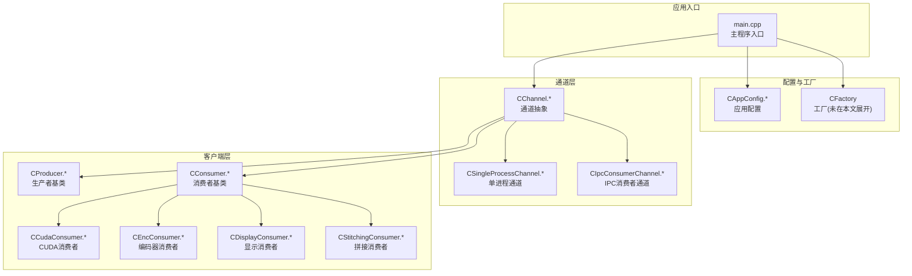
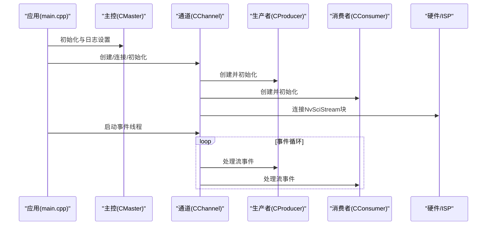
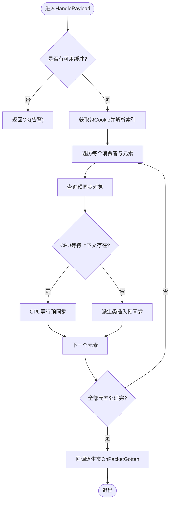
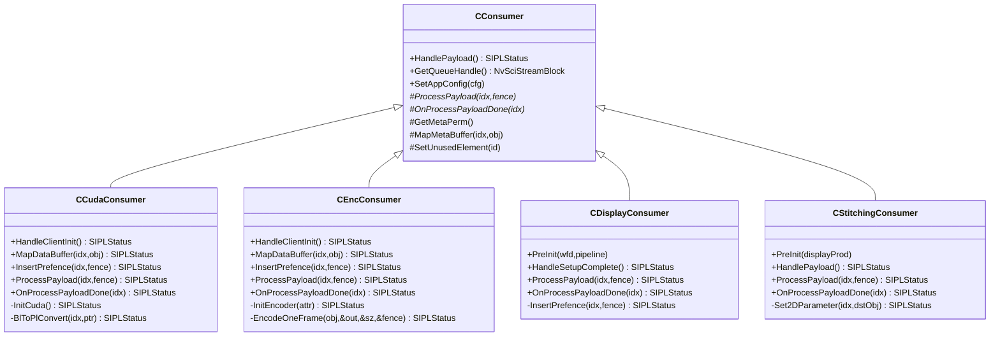
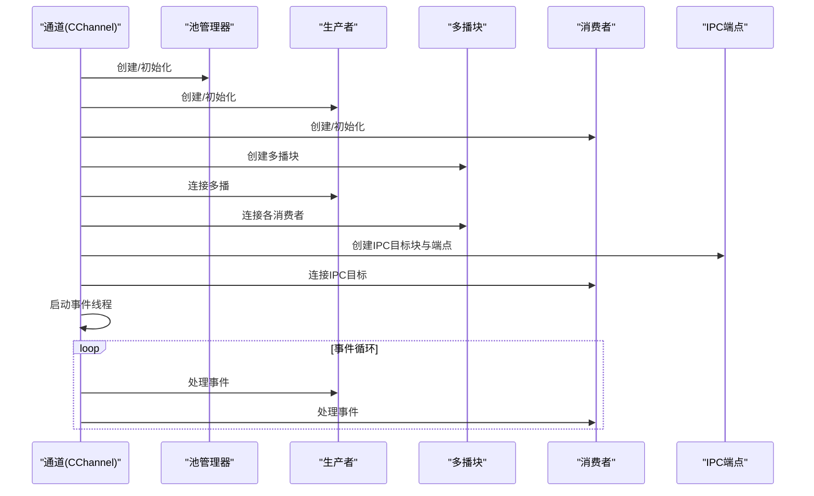
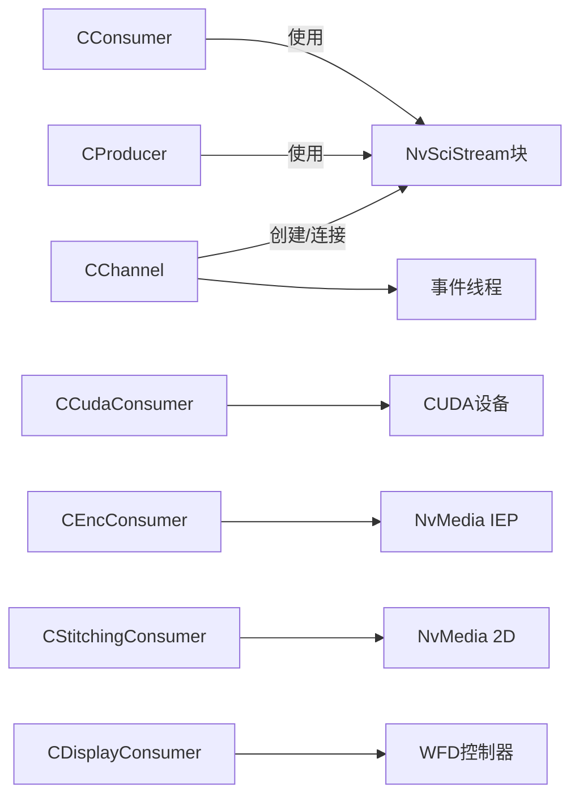

# 核心模块详解

<cite>
**本文引用的文件**
- [main.cpp](file://main.cpp)
- [CAppConfig.hpp](file://CAppConfig.hpp)
- [CAppConfig.cpp](file://CAppConfig.cpp)
- [CProducer.hpp](file://CProducer.hpp)
- [CProducer.cpp](file://CProducer.cpp)
- [CConsumer.hpp](file://CConsumer.hpp)
- [CConsumer.cpp](file://CConsumer.cpp)
- [CCudaConsumer.hpp](file://CCudaConsumer.hpp)
- [CCudaConsumer.cpp](file://CCudaConsumer.cpp)
- [CEncConsumer.hpp](file://CEncConsumer.hpp)
- [CEncConsumer.cpp](file://CEncConsumer.cpp)
- [CDisplayConsumer.hpp](file://CDisplayConsumer.hpp)
- [CDisplayConsumer.cpp](file://CDisplayConsumer.cpp)
- [CStitchingConsumer.hpp](file://CStitchingConsumer.hpp)
- [CStitchingConsumer.cpp](file://CStitchingConsumer.cpp)
- [CChannel.hpp](file://CChannel.hpp)
- [CSingleProcessChannel.hpp](file://CSingleProcessChannel.hpp)
- [CIpcConsumerChannel.hpp](file://CIpcConsumerChannel.hpp)
</cite>

## 目录
1. [简介](#简介)
2. [项目结构](#项目结构)
3. [核心组件](#核心组件)
4. [架构总览](#架构总览)
5. [详细组件分析](#详细组件分析)
6. [依赖关系分析](#依赖关系分析)
7. [性能考量](#性能考量)
8. [故障排查指南](#故障排查指南)
9. [结论](#结论)
10. [附录](#附录)

## 简介
本文件面向NVSIPL多播系统的核心模块，围绕生产者系统、消费者系统、通道管理与应用配置进行深入解析。重点覆盖：
- 生产者基类与派生类型的架构差异
- CUDA消费者、编码器消费者、显示消费者、拼接消费者的实现细节
- 单进程、进程间（点对点/芯片间）通道的通信机制
- 应用配置管理与事件处理机制的设计思路

## 项目结构
该模块以“通道-客户端”分层组织：通道负责创建/连接/初始化NvSciStream块与事件线程；客户端（生产者/消费者）封装具体的图像数据处理逻辑与同步对象注册。

图表来源
- [main.cpp](file://main.cpp)
- [CChannel.hpp](file://CChannel.hpp)
- [CSingleProcessChannel.hpp](file://CSingleProcessChannel.hpp)
- [CIpcConsumerChannel.hpp](file://CIpcConsumerChannel.hpp)
- [CProducer.hpp](file://CProducer.hpp)
- [CConsumer.hpp](file://CConsumer.hpp)
- [CCudaConsumer.hpp](file://CCudaConsumer.hpp)
- [CEncConsumer.hpp](file://CEncConsumer.hpp)
- [CDisplayConsumer.hpp](file://CDisplayConsumer.hpp)
- [CStitchingConsumer.hpp](file://CStitchingConsumer.hpp)

章节来源
- [main.cpp](file://main.cpp)
- [CChannel.hpp](file://CChannel.hpp)

## 核心组件
- 应用配置管理：提供日志级别、通信方式、实体类型、队列类型、消费数量/索引、平台配置、分辨率查询、传感器格式判断等能力。
- 通道管理：统一创建/连接/初始化NvSciStream块，启动事件线程循环，协调运行状态。
- 客户端基类：生产者与消费者共享的通用逻辑（缓冲映射、元数据访问权限、预/后同步对象插入等）。
- 消费者类型：CUDA、编码器、显示、拼接四类消费者，分别对接GPU推理/转码/显示/拼接管线。

章节来源
- [CAppConfig.hpp](file://CAppConfig.hpp)
- [CAppConfig.cpp](file://CAppConfig.cpp)
- [CChannel.hpp](file://CChannel.hpp)
- [CProducer.hpp](file://CProducer.hpp)
- [CConsumer.hpp](file://CConsumer.hpp)

## 架构总览
下图展示从应用入口到通道与客户端的整体调用链路与职责分工。

图表来源
- [main.cpp](file://main.cpp)
- [CChannel.hpp](file://CChannel.hpp)
- [CProducer.cpp](file://CProducer.cpp)
- [CConsumer.cpp](file://CConsumer.cpp)

## 详细组件分析

### 生产者系统
- 基类职责
  - 查询消费者数量、维护待使用缓冲计数
  - 在SetupComplete阶段获取初始包所有权
  - 处理负载事件：按包索引获取、等待并合并各消费者前同步对象，回调派生类完成后续处理
  - Post流程：映射用户缓冲为包索引，生成后同步对象，提交包并更新计数
- 关键行为
  - 预同步对象等待策略：若CPU等待上下文存在则阻塞等待，否则由派生类插入到其执行域（如CUDA）
  - 后同步对象：由派生类提供，写入包属性后由消费者侧验证

图表来源
- [CProducer.cpp](file://CProducer.cpp)

章节来源
- [CProducer.hpp](file://CProducer.hpp)
- [CProducer.cpp](file://CProducer.cpp)

### 消费者系统
- 基类职责
  - 获取新包、按帧过滤策略决定是否处理
  - 从包中查询预同步对象并插入到自身执行域
  - 调用派生类处理逻辑，生成后同步对象并回填
  - 释放包回到生产者
- 差异化实现
  - CUDA消费者：导入NvSciBuf外部内存为CUDA资源，支持BlockLinear/PitchLinear布局转换与拷贝，可选推理与文件落盘
  - 编码器消费者：注册NvMedia IEP，按帧喂入编码，输出H.264比特流
  - 显示消费者：通过WFD控制器创建显示源、Flip显示
  - 拼接消费者：注册NvMedia 2D合成器，组合多源到目标缓冲，提交后同步给显示生产者

图表来源
- [CConsumer.hpp](file://CConsumer.hpp)
- [CCudaConsumer.hpp](file://CCudaConsumer.hpp)
- [CEncConsumer.hpp](file://CEncConsumer.hpp)
- [CDisplayConsumer.hpp](file://CDisplayConsumer.hpp)
- [CStitchingConsumer.hpp](file://CStitchingConsumer.hpp)

章节来源
- [CConsumer.hpp](file://CConsumer.hpp)
- [CConsumer.cpp](file://CConsumer.cpp)
- [CCudaConsumer.hpp](file://CCudaConsumer.hpp)
- [CCudaConsumer.cpp](file://CCudaConsumer.cpp)
- [CEncConsumer.hpp](file://CEncConsumer.hpp)
- [CEncConsumer.cpp](file://CEncConsumer.cpp)
- [CDisplayConsumer.hpp](file://CDisplayConsumer.hpp)
- [CDisplayConsumer.cpp](file://CDisplayConsumer.cpp)
- [CStitchingConsumer.hpp](file://CStitchingConsumer.hpp)
- [CStitchingConsumer.cpp](file://CStitchingConsumer.cpp)

### 通道管理系统
- 事件线程模型
  - 通道统一管理事件处理器线程，循环处理事件直到完成或超时
  - 支持“准备阶段”和“运行阶段”的不同事件处理器集合
- 单进程通道
  - 创建池管理器、生产者、CUDA消费者、可选拼接/显示/编码消费者
  - 通过工厂创建多播块并建立生产者-多播-消费者链路
  - 连接阶段查询所有块的连接事件，确保链路就绪
- 进程间通道
  - 消费者侧创建IPC目标块与端点，连接到本地消费者
  - 可选进行对端信息校验，保证跨进程/跨芯片通信安全
- 芯片间通道
  - 在C2C场景下，消费者侧创建池管理器并跳过未使用的元素类型，减少带宽占用

图表来源
- [CChannel.hpp](file://CChannel.hpp)
- [CSingleProcessChannel.hpp](file://CSingleProcessChannel.hpp)
- [CIpcConsumerChannel.hpp](file://CIpcConsumerChannel.hpp)

章节来源
- [CChannel.hpp](file://CChannel.hpp)
- [CSingleProcessChannel.hpp](file://CSingleProcessChannel.hpp)
- [CIpcConsumerChannel.hpp](file://CIpcConsumerChannel.hpp)

### 应用配置管理
- 提供运行参数读取与默认值设定，包括：
  - 日志等级、动态/静态平台配置、NITO路径
  - 通信类型、实体类型、消费者类型、队列类型
  - 是否启用拼接显示/DPMST、错误忽略、文件落盘、版本打印、多元素、延迟接入、SC7引导
  - 帧过滤、运行时长、消费者数量/索引
- 平台配置解析
  - 动态配置：通过查询接口解析数据库并应用掩码
  - 静态配置：根据名称选择对应平台配置
- 分辨率与传感器格式查询
  - 依据传感器ID查询分辨率宽高
  - 判断传感器输入格式是否为YUV

章节来源
- [CAppConfig.hpp](file://CAppConfig.hpp)
- [CAppConfig.cpp](file://CAppConfig.cpp)

### 事件处理机制
- 事件线程
  - 通道在Reconcile/Start阶段收集事件处理器，为每个处理器创建独立线程
  - 线程内循环调用处理器的事件处理函数，支持超时阈值控制
- 事件类型
  - 通道查询块事件，等待连接完成或数据到达事件
  - 生产者/消费者各自处理包获取、预/后同步对象、负载处理与释放

章节来源
- [CChannel.hpp](file://CChannel.hpp)
- [CProducer.cpp](file://CProducer.cpp)
- [CConsumer.cpp](file://CConsumer.cpp)

## 依赖关系分析
- 组件耦合
  - 通道与客户端通过NvSciStream块句柄解耦，事件驱动，降低直接耦合
  - 消费者类型通过工厂创建，便于扩展新类型
- 外部依赖
  - NvSciBuf/NvSciSync：用于缓冲与同步对象的跨进程/跨芯片共享
  - NvMedia系列：编码器（IEP）、2D合成、显示（WFD）等
  - CUDA：用于CUDA消费者的数据转换与推理

图表来源
- [CChannel.hpp](file://CChannel.hpp)
- [CProducer.hpp](file://CProducer.hpp)
- [CConsumer.hpp](file://CConsumer.hpp)
- [CCudaConsumer.hpp](file://CCudaConsumer.hpp)
- [CEncConsumer.hpp](file://CEncConsumer.hpp)
- [CStitchingConsumer.hpp](file://CStitchingConsumer.hpp)
- [CDisplayConsumer.hpp](file://CDisplayConsumer.hpp)

## 性能考量
- 帧过滤：消费者可按配置跳过部分帧，降低处理开销
- CPU等待：在某些场景下使用CPU等待预同步对象，避免频繁上下文切换
- 布局转换：CUDA消费者对BlockLinear到PitchLinear的转换需注意带宽与延迟
- 编码器参数：编码器配置影响吞吐与质量，应结合实际场景调整
- 事件超时：通道事件线程具备超时保护，防止长时间阻塞

## 故障排查指南
- 连接失败
  - 检查通道连接阶段的事件查询是否成功
  - 确认IPC端点与对端可达性
- 同步对象问题
  - 预/后同步对象未正确插入或清理会导致死锁或丢帧
  - 核对消费者类型对应的同步对象注册与插入逻辑
- 布局不匹配
  - BlockLinear与PitchLinear混用时，确认映射与转换路径
- 文件落盘异常
  - 检查输出文件打开与写入权限
- 延迟接入
  - 若启用延迟接入，确认晚接入辅助组件工作正常

章节来源
- [CChannel.hpp](file://CChannel.hpp)
- [CProducer.cpp](file://CProducer.cpp)
- [CConsumer.cpp](file://CConsumer.cpp)
- [CCudaConsumer.cpp](file://CCudaConsumer.cpp)
- [CEncConsumer.cpp](file://CEncConsumer.cpp)
- [CStitchingConsumer.cpp](file://CStitchingConsumer.cpp)
- [CDisplayConsumer.cpp](file://CDisplayConsumer.cpp)

## 结论
本系统通过“通道+客户端”的分层设计，结合NvSciBuf/NvSciSync实现跨进程/跨芯片的高效数据通路；通过多种消费者类型适配不同终端处理需求；通道事件线程与工厂模式提升了可扩展性与可维护性。生产者侧负责数据产出与同步，消费者侧负责具体处理与输出，拼接/显示/编码/推理等能力通过差异化实现灵活组合。

## 附录
- 关键流程参考
  - 生产者Post流程：[CProducer.cpp](file://CProducer.cpp)
  - 消费者处理流程：[CConsumer.cpp](file://CConsumer.cpp)
  - CUDA消费者映射与转换：[CCudaConsumer.cpp](file://CCudaConsumer.cpp)
  - 编码器消费者编码流程：[CEncConsumer.cpp](file://CEncConsumer.cpp)
  - 显示消费者Flip流程：[CDisplayConsumer.cpp](file://CDisplayConsumer.cpp)
  - 拼接消费者合成流程：[CStitchingConsumer.cpp](file://CStitchingConsumer.cpp)
- 通道生命周期
  - 单进程通道创建/连接/初始化：[CSingleProcessChannel.hpp](file://CSingleProcessChannel.hpp)
  - IPC消费者通道创建/连接/初始化：[CIpcConsumerChannel.hpp](file://CIpcConsumerChannel.hpp)