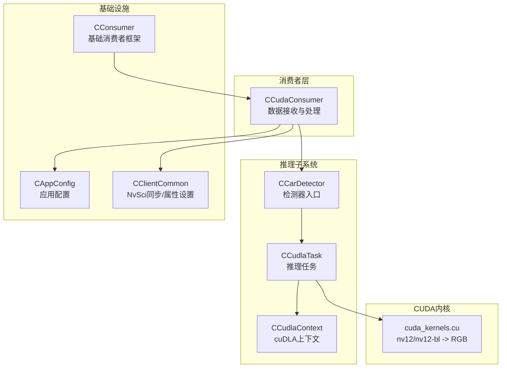
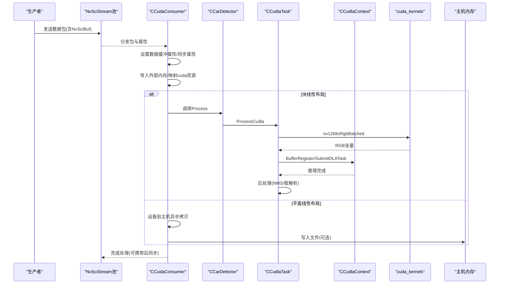
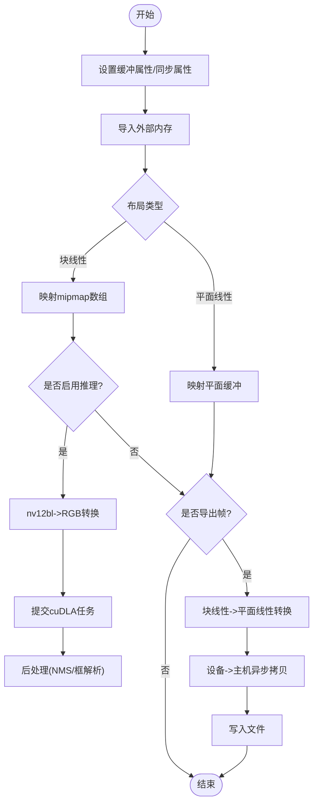
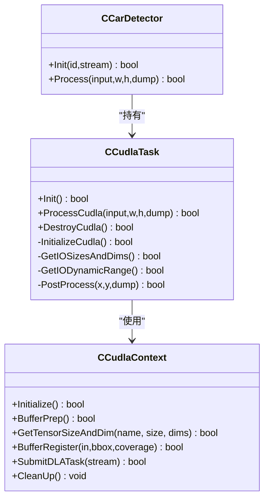
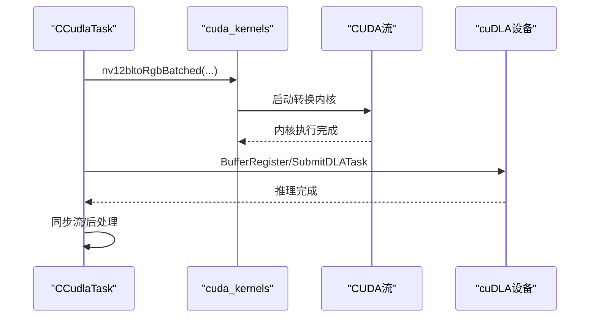
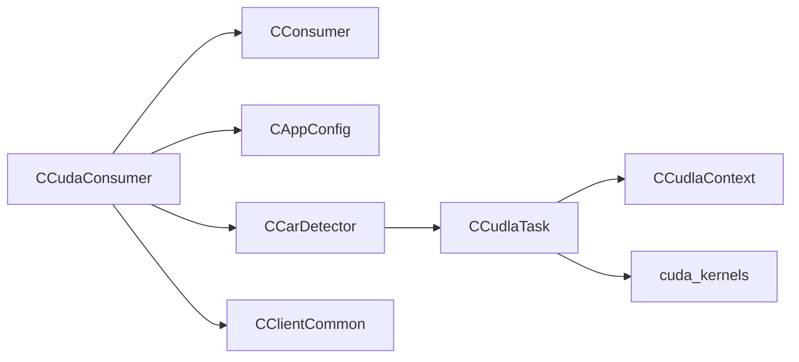

# CUDA消费者

<cite>
**本文引用的文件**
- [CCudaConsumer.cpp](file://CCudaConsumer.cpp)
- [CCudaConsumer.hpp](file://CCudaConsumer.hpp)
- [CConsumer.hpp](file://CConsumer.hpp)
- [CAppConfig.hpp](file://CAppConfig.hpp)
- [car_detect/CCarDetector.cpp](file://car_detect/CCarDetector.cpp)
- [car_detect/CCarDetector.hpp](file://car_detect/CCarDetector.hpp)
- [car_detect/CCudlaContext.cpp](file://car_detect/CCudlaContext.cpp)
- [car_detect/CCudlaContext.hpp](file://car_detect/CCudlaContext.hpp)
- [car_detect/CCudlaTask.cpp](file://car_detect/CCudlaTask.cpp)
- [car_detect/CCudlaTask.hpp](file://car_detect/CCudlaTask.hpp)
- [car_detect/Common.hpp](file://car_detect/Common.hpp)
- [car_detect/cuda_kernels.cu](file://car_detect/cuda_kernels.cu)
- [car_detect/cuda_kernels.h](file://car_detect/cuda_kernels.h)
- [CClientCommon.cpp](file://CClientCommon.cpp)
- [CUtils.cpp](file://CUtils.cpp)
</cite>

## 目录
1. [简介](#简介)
2. [项目结构](#项目结构)
3. [核心组件](#核心组件)
4. [架构总览](#架构总览)
5. [详细组件分析](#详细组件分析)
6. [依赖关系分析](#依赖关系分析)
7. [性能考量](#性能考量)
8. [故障排查指南](#故障排查指南)
9. [结论](#结论)
10. [附录](#附录)

## 简介
本文件面向需要在多传感器视频流中实现高性能图像处理与推理加速的工程师，系统化阐述CUDA消费者的实现与使用。重点覆盖以下方面：
- 数据接收流程：基于NvSciBuf/NvSciSync的跨组件同步与缓冲区映射。
- GPU内存管理：外部内存导入、块线性与平面线性布局的映射策略、主机侧拷贝路径。
- CUDA内核调度与异步处理：非阻塞流、信号量等待、设备到主机异步拷贝。
- 与cuDLA推理引擎的集成：模型加载、张量注册、任务提交与后处理。
- CUDA上下文管理、错误处理策略与性能优化建议。
- 配置参数说明、使用示例与调试方法，并提供与CPU处理的对比与适用场景指导。

## 项目结构
CUDA消费者位于multicast目录下，核心类为CCudaConsumer，负责消费来自生产者的图像数据包，完成必要的格式转换、可选的推理（通过cuDLA）以及可选的帧导出。推理子系统由car_detect目录下的检测器、cuDLA上下文与任务类组成；CUDA内核位于cuda_kernels.cu中，提供NV12/NV12-BL到RGB的批处理转换。

图示来源
- [CCudaConsumer.cpp:11-492](file://CCudaConsumer.cpp#L11-L492)
- [CConsumer.hpp:16-45](file://CConsumer.hpp#L16-L45)
- [car_detect/CCarDetector.cpp:15-109](file://car_detect/CCarDetector.cpp#L15-L109)
- [car_detect/CCudlaTask.cpp:15-518](file://car_detect/CCudlaTask.cpp#L15-L518)
- [car_detect/CCudlaContext.cpp:12-319](file://car_detect/CCudlaContext.cpp#L12-L319)
- [car_detect/cuda_kernels.cu:175-200](file://car_detect/cuda_kernels.cu#L175-L200)
- [CClientCommon.cpp:327-530](file://CClientCommon.cpp#L327-L530)

章节来源
- [CCudaConsumer.cpp:11-492](file://CCudaConsumer.cpp#L11-L492)
- [CConsumer.hpp:16-45](file://CConsumer.hpp#L16-L45)
- [CClientCommon.cpp:327-530](file://CClientCommon.cpp#L327-L530)

## 核心组件
- CCudaConsumer：继承自CConsumer，实现NvSciBuf属性请求、同步对象注册、缓冲区映射、预同步插入、帧处理与后处理导出。
- CCarDetector：封装推理初始化与调用，持有CCudlaTask实例。
- CCudlaTask：负责cuDLA上下文初始化、输入输出张量尺寸维度查询、内存分配与注册、任务提交、后处理（NMS与框解析）。
- CCudlaContext：负责cuDLA设备创建、模块加载、张量描述查询、GPU内存分配与注册、任务提交、清理。
- cuda_kernels：提供nv12/nv12-bl到RGB的批处理内核与辅助函数。
- CAppConfig：提供是否导出帧等运行时开关。
- CClientCommon：统一处理NvSci同步属性协商、CPU等待上下文与信号/等待对象分配。

章节来源
- [CCudaConsumer.hpp:25-81](file://CCudaConsumer.hpp#L25-L81)
- [car_detect/CCarDetector.hpp:17-34](file://car_detect/CCarDetector.hpp#L17-L34)
- [car_detect/CCudlaTask.hpp:16-96](file://car_detect/CCudlaTask.hpp#L16-L96)
- [car_detect/CCudlaContext.hpp:22-60](file://car_detect/CCudlaContext.hpp#L22-L60)
- [car_detect/cuda_kernels.h:14-42](file://car_detect/cuda_kernels.h#L14-L42)
- [CAppConfig.hpp:19-83](file://CAppConfig.hpp#L19-L83)
- [CClientCommon.cpp:327-530](file://CClientCommon.cpp#L327-L530)

## 架构总览
CUDA消费者以事件驱动的方式工作：生产者发送数据包，消费者通过NvSciBuf属性协商确定缓冲区布局与权限，随后将外部GPU内存映射为CUDA资源，按需进行格式转换或直接推理，最后将结果写入文件或交由上层处理。

图示来源
- [CCudaConsumer.cpp:386-462](file://CCudaConsumer.cpp#L386-L462)
- [car_detect/CCarDetector.cpp:93-109](file://car_detect/CCarDetector.cpp#L93-L109)
- [car_detect/CCudlaTask.cpp:188-245](file://car_detect/CCudlaTask.cpp#L188-L245)
- [car_detect/CCudlaContext.cpp:199-250](file://car_detect/CCudlaContext.cpp#L199-L250)
- [car_detect/cuda_kernels.cu:175-200](file://car_detect/cuda_kernels.cu#L175-L200)

## 详细组件分析

### CUDA消费者：数据接收与处理
- 初始化与CUDA上下文
  - 设置设备、创建非阻塞CUDA流、初始化可选的车辆检测器。
- NvSciBuf属性与同步
  - 获取GPU ID并设置缓冲类型、访问权限与CPU访问需求；设置信号/等待同步属性。
- 缓冲区映射
  - 支持块线性与平面线性两种布局：
    - 块线性：导入外部内存，映射为mipmap数组，便于后续cudaMemcpy2DFromArrayAsync读取。
    - 平面线性：导入外部内存为缓冲区，逐平面进行cudaMemcpy2DAsync拷贝至主机缓冲。
- 异步处理与预同步
  - 使用外部信号量等待生产者提供的fence，确保数据可用后再进行处理。
  - 所有GPU操作均在非阻塞流上异步执行，必要时通过流同步保证顺序。
- 文件导出
  - 当启用导出且处于导出帧区间时，分配临时设备缓冲，执行块线性到平面线性的转换与设备到主机异步拷贝，最终写入文件。

图示来源
- [CCudaConsumer.cpp:112-171](file://CCudaConsumer.cpp#L112-L171)
- [CCudaConsumer.cpp:173-273](file://CCudaConsumer.cpp#L173-L273)
- [CCudaConsumer.cpp:301-322](file://CCudaConsumer.cpp#L301-L322)
- [CCudaConsumer.cpp:386-462](file://CCudaConsumer.cpp#L386-L462)

章节来源
- [CCudaConsumer.cpp:28-53](file://CCudaConsumer.cpp#L28-L53)
- [CCudaConsumer.cpp:112-171](file://CCudaConsumer.cpp#L112-L171)
- [CCudaConsumer.cpp:173-273](file://CCudaConsumer.cpp#L173-L273)
- [CCudaConsumer.cpp:301-322](file://CCudaConsumer.cpp#L301-L322)
- [CCudaConsumer.cpp:386-462](file://CCudaConsumer.cpp#L386-L462)

### cuDLA推理引擎集成
- 模型加载与上下文初始化
  - 从二进制加载文件读取到内存，创建cuDLA设备与模块，查询输入/输出张量描述与维度。
- 张量内存准备与注册
  - 在cudaMallocManaged分配输入/输出张量，attach到推理流，随后在cuDLA侧注册。
- 任务提交与后处理
  - 将RGB张量提交给cuDLA执行，同步流后在CPU侧进行NMS与边界框解析，输出带标签的检测框。
- 清理
  - 卸载模块、销毁设备、注销与释放所有GPU内存。

图示来源
- [car_detect/CCudlaContext.cpp:69-100](file://car_detect/CCudlaContext.cpp#L69-L100)
- [car_detect/CCudlaContext.cpp:113-197](file://car_detect/CCudlaContext.cpp#L113-L197)
- [car_detect/CCudlaContext.cpp:199-250](file://car_detect/CCudlaContext.cpp#L199-L250)
- [car_detect/CCudlaTask.cpp:35-52](file://car_detect/CCudlaTask.cpp#L35-L52)
- [car_detect/CCudlaTask.cpp:152-186](file://car_detect/CCudlaTask.cpp#L152-L186)
- [car_detect/CCudlaTask.cpp:188-245](file://car_detect/CCudlaTask.cpp#L188-L245)
- [car_detect/CCarDetector.cpp:33-91](file://car_detect/CCarDetector.cpp#L33-L91)

章节来源
- [car_detect/CCudlaContext.cpp:69-100](file://car_detect/CCudlaContext.cpp#L69-L100)
- [car_detect/CCudlaContext.cpp:113-197](file://car_detect/CCudlaContext.cpp#L113-L197)
- [car_detect/CCudlaContext.cpp:199-250](file://car_detect/CCudlaContext.cpp#L199-L250)
- [car_detect/CCudlaTask.cpp:35-52](file://car_detect/CCudlaTask.cpp#L35-L52)
- [car_detect/CCudlaTask.cpp:152-186](file://car_detect/CCudlaTask.cpp#L152-L186)
- [car_detect/CCudlaTask.cpp:188-245](file://car_detect/CCudlaTask.cpp#L188-L245)
- [car_detect/CCarDetector.cpp:33-91](file://car_detect/CCarDetector.cpp#L33-L91)

### CUDA内核调度与数据转换
- nv12/nv12-bl到RGB的批处理转换
  - 计算缩放比例，建立纹理对象，启动二维内核，支持FP16与INT8两种输出格式。
- 块线性到平面线性的转换
  - 通过cudaMemcpy2DFromArrayAsync读取各平面，再同步流以保证顺序。

图示来源
- [car_detect/CCudlaTask.cpp:195-245](file://car_detect/CCudlaTask.cpp#L195-L245)
- [car_detect/cuda_kernels.cu:175-200](file://car_detect/cuda_kernels.cu#L175-L200)

章节来源
- [car_detect/CCudlaTask.cpp:195-245](file://car_detect/CCudlaTask.cpp#L195-L245)
- [car_detect/cuda_kernels.cu:175-200](file://car_detect/cuda_kernels.cu#L175-L200)

### 错误处理与同步机制
- 统一错误检查宏用于CUDA/cuDIA/NvSci状态码检查，失败时返回错误码并记录日志。
- NvSci同步属性协商：信号/等待列表创建、冲突解决、对象分配与注册。
- 外部信号量等待：在非阻塞流上等待生产者fence，避免CPU轮询。

章节来源
- [CCudaConsumer.cpp:28-53](file://CCudaConsumer.cpp#L28-L53)
- [CClientCommon.cpp:327-530](file://CClientCommon.cpp#L327-L530)

## 依赖关系分析
- 组件耦合
  - CCudaConsumer依赖CConsumer框架与NvSci接口；推理链路由CCarDetector->CCudlaTask->CCudlaContext串联。
  - 推理任务依赖cuda_kernels提供的转换内核。
- 外部依赖
  - CUDA Runtime/CUDA Driver、cuDLA、NVIDIA NvSciBuf/NvSciSync。
- 可能的循环依赖
  - 未发现直接循环；推理链为单向依赖。

图示来源
- [CCudaConsumer.hpp:25-81](file://CCudaConsumer.hpp#L25-L81)
- [CConsumer.hpp:16-45](file://CConsumer.hpp#L16-L45)
- [car_detect/CCarDetector.hpp:17-34](file://car_detect/CCarDetector.hpp#L17-L34)
- [car_detect/CCudlaTask.hpp:16-96](file://car_detect/CCudlaTask.hpp#L16-L96)
- [car_detect/CCudlaContext.hpp:22-60](file://car_detect/CCudlaContext.hpp#L22-L60)
- [car_detect/cuda_kernels.h:14-42](file://car_detect/cuda_kernels.h#L14-L42)
- [CClientCommon.cpp:327-530](file://CClientCommon.cpp#L327-L530)

## 性能考量
- 流与异步
  - 使用非阻塞CUDA流执行数据传输与推理，减少CPU等待；仅在必要处进行流同步。
- 内存映射策略
  - 块线性布局通过mipmap数组直接读取，避免额外拷贝；平面线性布局按平面异步拷贝。
- 推理路径
  - cuDLA异步执行，与CPU后处理并行；注意内存注册与attach到同一流以避免跨流依赖。
- I/O与导出
  - 导出文件时分配临时设备缓冲并在流中同步，避免阻塞主处理路径。
- 参数与阈值
  - 网络模式（FP16/INT8）、分数阈值、NMS阈值、组IoU阈值等影响吞吐与精度，应结合硬件能力与场景需求调整。

## 故障排查指南
- 常见问题定位
  - CUDA/cuDIA/NvSci状态检查失败：查看对应错误码与日志，确认设备可用性与句柄有效性。
  - 布局不支持：当前实现仅支持块线性与平面线性，其他布局会返回错误。
  - 推理初始化失败：检查模型缓存文件存在性与路径正确性，确认cuDLA设备数量与模块加载成功。
- 调试建议
  - 启用详细日志与导出帧功能，观察转换与推理中间结果。
  - 使用流同步验证执行顺序，逐步缩小问题范围。
  - 对比FP16与INT8两种模式的性能与精度差异。

章节来源
- [CCudaConsumer.cpp:28-53](file://CCudaConsumer.cpp#L28-L53)
- [car_detect/CCudlaContext.cpp:33-67](file://car_detect/CCudlaContext.cpp#L33-L67)
- [CClientCommon.cpp:327-530](file://CClientCommon.cpp#L327-L530)

## 结论
CUDA消费者通过NvSciBuf/NvSciSync实现高效的跨组件数据通道，结合CUDA流与cuDLA实现高性能图像处理与推理。其设计强调异步与内存映射策略，适合高并发、低延迟的多传感器视频流场景。合理配置推理参数与导出策略，可在保证实时性的前提下获得稳定的检测效果。

## 附录

### 配置参数说明
- 应用配置
  - 是否导出帧：控制是否将平面线性帧写入本地文件。
  - 其他运行时开关：如多元素使能、延迟附加等。
- 推理配置
  - 网络模式：FP16或INT8（INT8需标定表）。
  - 输入/输出张量名称：与模型一致。
  - 归一化因子、置信度阈值、NMS阈值、组IoU阈值、组阈值等。

章节来源
- [CAppConfig.hpp:34-83](file://CAppConfig.hpp#L34-L83)
- [car_detect/CCarDetector.cpp:60-76](file://car_detect/CCarDetector.cpp#L60-L76)
- [car_detect/CCudlaTask.cpp:110-150](file://car_detect/CCudlaTask.cpp#L110-L150)

### 使用示例与调试方法
- 示例步骤
  - 初始化消费者：设置设备、创建流、注册同步对象。
  - 映射缓冲区：根据布局导入外部内存并映射为CUDA资源。
  - 插入预同步：等待生产者fence。
  - 处理帧：按布局执行转换或直接拷贝，必要时导出文件。
  - 推理：若启用，调用检测器执行推理与后处理。
- 调试要点
  - 观察布局类型与平面信息，确认映射成功。
  - 检查流同步点与错误码，定位卡顿或崩溃位置。
  - 对比CPU路径与GPU路径的耗时，评估加速收益。

章节来源
- [CCudaConsumer.cpp:112-171](file://CCudaConsumer.cpp#L112-L171)
- [CCudaConsumer.cpp:173-273](file://CCudaConsumer.cpp#L173-L273)
- [CCudaConsumer.cpp:301-322](file://CCudaConsumer.cpp#L301-L322)
- [CCudaConsumer.cpp:386-462](file://CCudaConsumer.cpp#L386-L462)

### 与CPU处理的对比与适用场景
- CPU处理
  - 优点：实现简单、易调试、兼容性强。
  - 缺点：在高分辨率、多传感器场景下难以满足实时性要求。
- GPU处理（CUDA+cuDLA）
  - 优点：并行度高、吞吐大、适合批量推理与格式转换。
  - 场景：多路视频流、实时目标检测、高分辨率图像处理。
- 选择建议
  - 若实时性要求高且具备GPU/cuDIA资源，优先采用GPU路径；否则可采用CPU路径作为对照或降级方案。