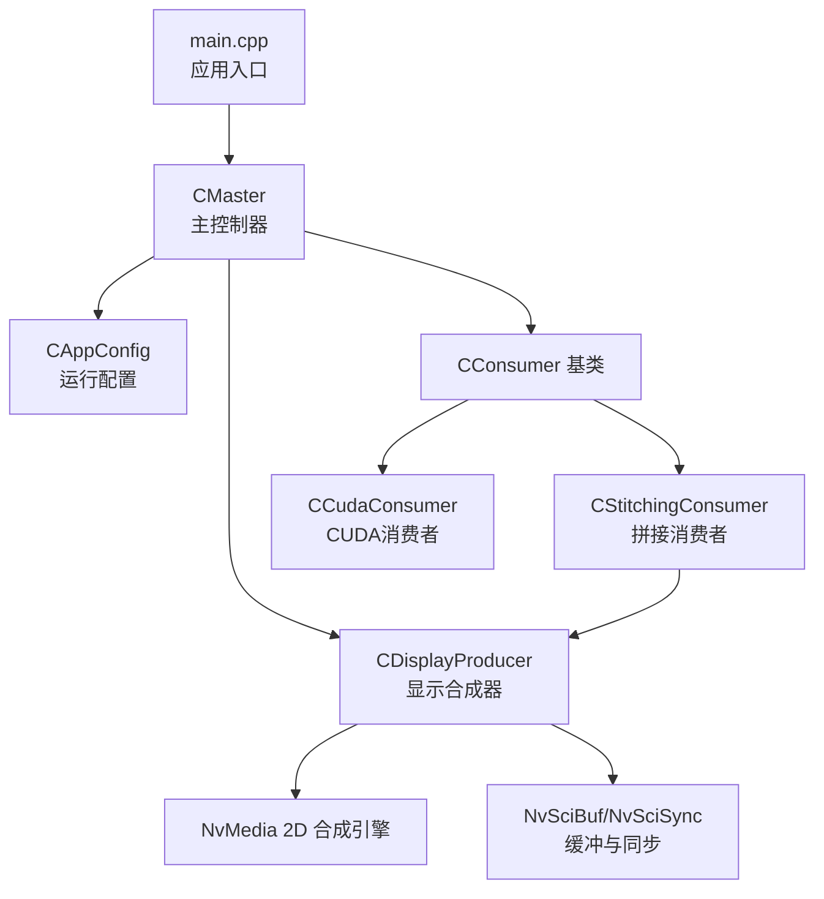
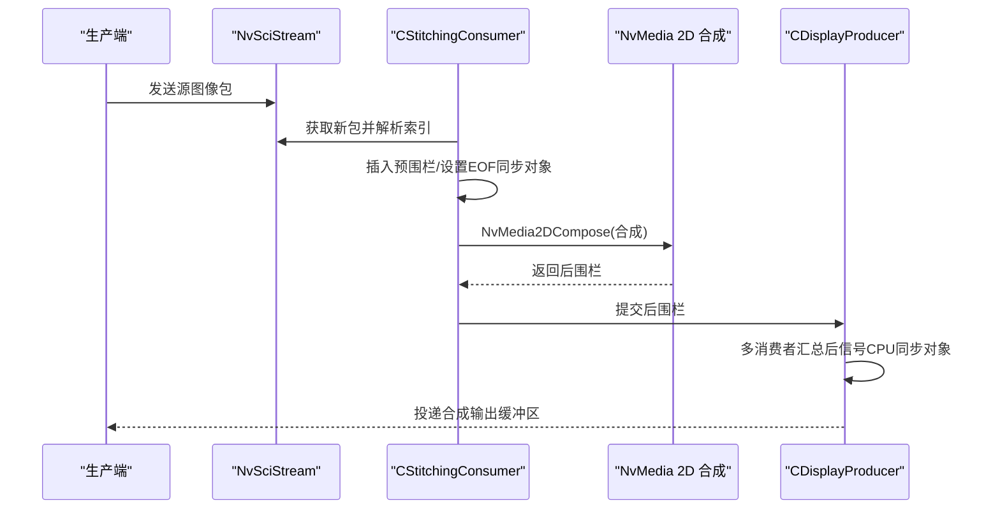
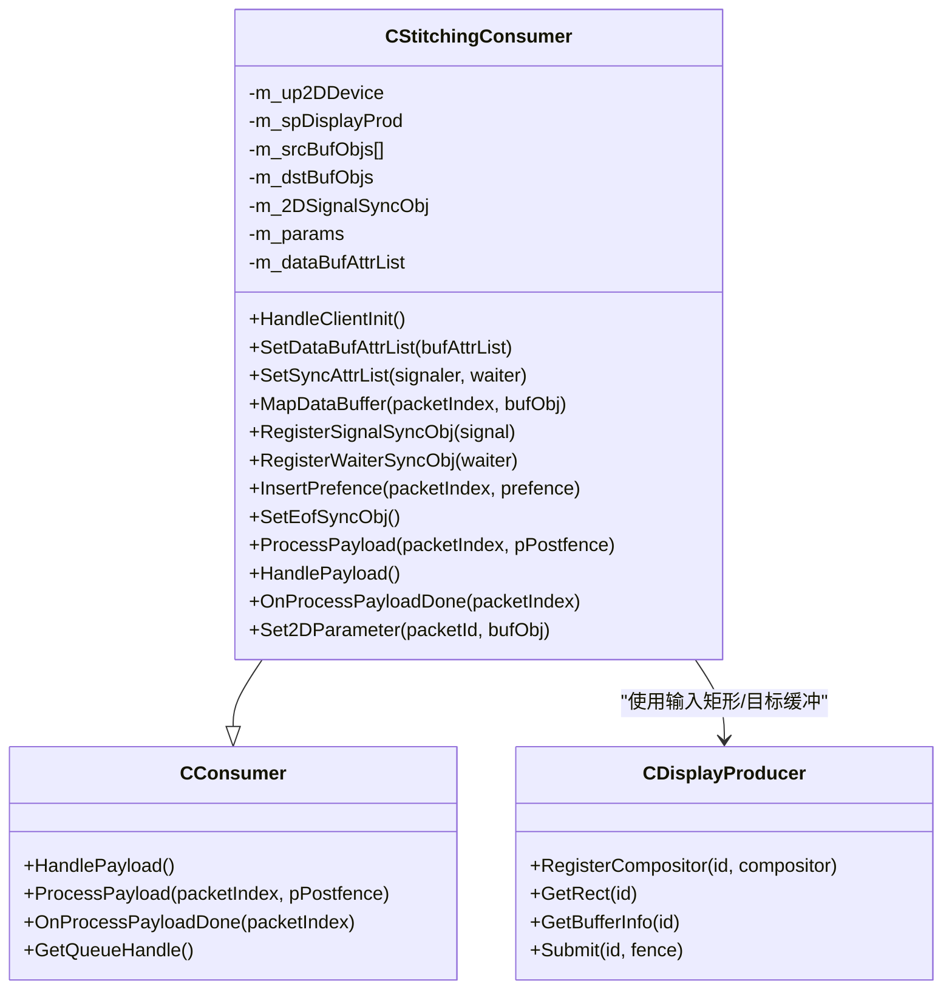
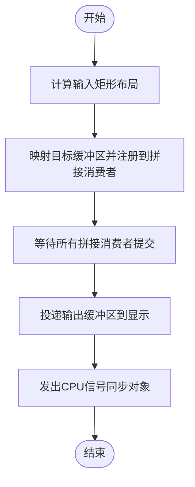
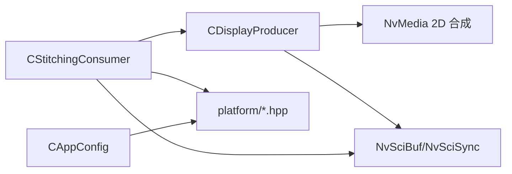

# 拼接消费者

<cite>
**本文引用的文件**
- [CStitchingConsumer.hpp](file://CStitchingConsumer.hpp)
- [CStitchingConsumer.cpp](file://CStitchingConsumer.cpp)
- [CConsumer.hpp](file://CConsumer.hpp)
- [CConsumer.cpp](file://CConsumer.cpp)
- [CDisplayProducer.hpp](file://CDisplayProducer.hpp)
- [CDisplayProducer.cpp](file://CDisplayProducer.cpp)
- [CAppConfig.hpp](file://CAppConfig.hpp)
- [CAppConfig.cpp](file://CAppConfig.cpp)
- [Common.hpp](file://Common.hpp)
- [CCudaConsumer.hpp](file://CCudaConsumer.hpp)
- [CCudaConsumer.cpp](file://CCudaConsumer.cpp)
- [main.cpp](file://main.cpp)
- [platform/ar0820.hpp](file://platform/ar0820.hpp)
</cite>

## 目录
1. [简介](#简介)
2. [项目结构](#项目结构)
3. [核心组件](#核心组件)
4. [架构总览](#架构总览)
5. [详细组件分析](#详细组件分析)
6. [依赖关系分析](#依赖关系分析)
7. [性能考量](#性能考量)
8. [故障排查指南](#故障排查指南)
9. [结论](#结论)
10. [附录：参数与配置](#附录参数与配置)

## 简介
本文件面向“拼接消费者”（CStitchingConsumer）的技术文档，系统阐述其在多视角图像实时拼接中的职责与实现方式。该组件通过NVIDIA NvMedia 2D合成接口完成源图像层到目标输出缓冲区的合成，并借助NvSciBuf/NvSciSync实现跨进程/跨芯片的高性能数据与同步通道管理。文档将从系统架构、数据流、处理逻辑、同步机制、性能优化与故障排查等方面进行深入解析，并给出不同应用场景下的参数配置建议。

## 项目结构
本项目采用分层与模块化组织方式：
- 应用入口与主控：main.cpp 负责命令行解析、日志级别设置、主循环与信号处理。
- 配置与平台：CAppConfig 提供运行时配置与平台信息查询；platform/*.hpp 定义具体硬件平台配置。
- 消费者基类与派生：CConsumer 为通用消费者抽象，CStitchingConsumer 实现拼接合成；CCudaConsumer 实现CUDA处理路径（与拼接并行或互补）。
- 显示合成器：CDisplayProducer 负责合成输出缓冲区的生命周期管理、预/后同步围栏传递以及多拼接消费者协同提交。

图表来源
- [main.cpp:253-304](file://main.cpp#L253-L304)
- [CAppConfig.hpp:19-82](file://CAppConfig.hpp#L19-L82)
- [CConsumer.hpp:16-45](file://CConsumer.hpp#L16-L45)
- [CStitchingConsumer.hpp:17-74](file://CStitchingConsumer.hpp#L17-L74)
- [CCudaConsumer.hpp:25-81](file://CCudaConsumer.hpp#L25-L81)
- [CDisplayProducer.hpp:18-128](file://CDisplayProducer.hpp#L18-L128)

章节来源
- [main.cpp:253-304](file://main.cpp#L253-L304)
- [CAppConfig.hpp:19-82](file://CAppConfig.hpp#L19-L82)
- [CConsumer.hpp:16-45](file://CConsumer.hpp#L16-L45)
- [CStitchingConsumer.hpp:17-74](file://CStitchingConsumer.hpp#L17-L74)
- [CCudaConsumer.hpp:25-81](file://CCudaConsumer.hpp#L25-L81)
- [CDisplayProducer.hpp:18-128](file://CDisplayProducer.hpp#L18-L128)

## 核心组件
- CStitchingConsumer：继承自CConsumer，负责从NvSciStream接收源图像包，调用NvMedia 2D合成接口完成拼接，再将合成结果提交给CDisplayProducer。
- CDisplayProducer：作为合成输出端，维护目标缓冲区集合、输入矩形布局、预/后同步围栏管理，并协调多个拼接消费者完成一帧合成。
- CConsumer：通用消费者基类，封装NvSciStream包获取、预围栏插入、后围栏设置、CPU等待等通用流程。
- CCudaConsumer：CUDA路径消费者，用于推理或格式转换等任务，与拼接路径可并行工作。
- CAppConfig：应用配置中心，提供平台配置、分辨率查询、帧过滤等能力。

章节来源
- [CStitchingConsumer.hpp:17-74](file://CStitchingConsumer.hpp#L17-L74)
- [CStitchingConsumer.cpp:12-316](file://CStitchingConsumer.cpp#L12-L316)
- [CConsumer.hpp:16-45](file://CConsumer.hpp#L16-L45)
- [CConsumer.cpp:17-127](file://CConsumer.cpp#L17-L127)
- [CDisplayProducer.hpp:18-128](file://CDisplayProducer.hpp#L18-L128)
- [CDisplayProducer.cpp:18-383](file://CDisplayProducer.cpp#L18-L383)
- [CCudaConsumer.hpp:25-81](file://CCudaConsumer.hpp#L25-L81)
- [CCudaConsumer.cpp:11-492](file://CCudaConsumer.cpp#L11-L492)
- [CAppConfig.hpp:19-82](file://CAppConfig.hpp#L19-L82)
- [CAppConfig.cpp:21-109](file://CAppConfig.cpp#L21-L109)

## 架构总览
拼接消费者在整体流水线中的位置如下：
- 生产端将多路源图像以NvSciBuf形式打包并通过NvSciStream发送。
- 消费端（CStitchingConsumer）接收包，按需等待预围栏，准备合成参数，调用NvMedia 2D合成，生成后围栏。
- CDisplayProducer统一管理目标缓冲区与输入矩形布局，协调多拼接消费者在同一帧内完成各自区域的合成。
- 最终由CDisplayProducer将合成后的输出缓冲区投递给显示或下游消费者。

图表来源
- [CStitchingConsumer.cpp:187-296](file://CStitchingConsumer.cpp#L187-L296)
- [CDisplayProducer.cpp:276-324](file://CDisplayProducer.cpp#L276-L324)
- [CConsumer.cpp:17-94](file://CConsumer.cpp#L17-L94)

章节来源
- [CStitchingConsumer.cpp:187-296](file://CStitchingConsumer.cpp#L187-L296)
- [CDisplayProducer.cpp:276-324](file://CDisplayProducer.cpp#L276-L324)
- [CConsumer.cpp:17-94](file://CConsumer.cpp#L17-L94)

## 详细组件分析

### CStitchingConsumer：拼接合成实现
- 初始化与注册
  - 创建NvMedia 2D设备句柄并在显示合成器中注册自身，以便CDisplayProducer为其分配目标缓冲区与输入矩形。
- 缓冲与同步属性
  - 设置数据缓冲属性列表（类型、权限），并填充NvMedia所需的NvSciBuf属性；同时克隆属性列表供后续使用。
  - 填充NvSciSync属性列表（信号者/等待者），并与NvMedia 2D设备绑定。
- 数据缓冲映射
  - 将每个到达的源图像NvSciBufObj注册到NvMedia 2D设备，以便合成时读取。
- 合成参数设置
  - 从NvMedia 2D获取合成参数模板，设置源层（当前包对应的源缓冲）、源几何（基于CDisplayProducer提供的输入矩形）、目标表面（显示合成器的目标缓冲）。
- 同步与围栏
  - 在合成前插入预围栏（等待生产者写入完成），设置EOF同步对象，执行合成后获取后围栏并提交给CDisplayProducer。
- 生命周期与反初始化
  - 反注册所有已注册的NvSciBuf/NvSciSync对象，确保资源释放。

图表来源
- [CConsumer.hpp:16-45](file://CConsumer.hpp#L16-L45)
- [CStitchingConsumer.hpp:17-74](file://CStitchingConsumer.hpp#L17-L74)
- [CDisplayProducer.hpp:18-128](file://CDisplayProducer.hpp#L18-L128)

章节来源
- [CStitchingConsumer.hpp:17-74](file://CStitchingConsumer.hpp#L17-L74)
- [CStitchingConsumer.cpp:12-316](file://CStitchingConsumer.cpp#L12-L316)

### CDisplayProducer：合成输出管理
- 目标缓冲区与输入矩形
  - 维护目标缓冲区集合（BufferInfo），记录预/后围栏；根据拼接消费者数量动态计算输入矩形布局，将输出画布划分为若干子区域。
- 同步与协作
  - 为每个拼接消费者维护提交状态，当所有消费者均提交后，触发显示线程投递输出缓冲区，并等待所有消费者完成操作后发出CPU信号同步对象。
- 与拼接消费者的交互
  - 在映射数据缓冲时，将目标缓冲区复制并注册到所有拼接消费者，确保它们都能写入同一输出面。

图表来源
- [CDisplayProducer.cpp:247-324](file://CDisplayProducer.cpp#L247-L324)
- [CDisplayProducer.cpp:326-383](file://CDisplayProducer.cpp#L326-L383)

章节来源
- [CDisplayProducer.hpp:18-128](file://CDisplayProducer.hpp#L18-L128)
- [CDisplayProducer.cpp:18-383](file://CDisplayProducer.cpp#L18-L383)

### CConsumer：通用消费者流程
- 包获取与预围栏
  - 从NvSciStream获取新包，解析索引，按元素维度查询并插入预围栏，确保生产者写入完成。
- 合成/处理与后围栏
  - 调用派生类的ProcessPayload生成后围栏；若存在CPU等待上下文则等待后围栏，否则直接设置回包围栏。
- 帧过滤与元数据
  - 支持帧过滤（按配置跳帧），并提供元数据缓冲映射能力。

章节来源
- [CConsumer.cpp:17-94](file://CConsumer.cpp#L17-L94)
- [CConsumer.hpp:16-45](file://CConsumer.hpp#L16-L45)

### CCudaConsumer：CUDA路径（对比参考）
- CUDA初始化与外部资源导入
  - 导入NvSciSync为CUDA外部信号量，导入NvSciBuf为CUDA外部内存，支持块线性/平面线性布局映射。
- 帧处理与可选推理
  - 支持块线性到平面线性的GPU转换与主机拷贝，以及可选的推理流程（Linux/QNX差异）。
- 与拼接的关系
  - 与CStitchingConsumer并行工作，前者负责CUDA侧处理，后者负责NvMedia 2D合成。

章节来源
- [CCudaConsumer.hpp:25-81](file://CCudaConsumer.hpp#L25-L81)
- [CCudaConsumer.cpp:11-492](file://CCudaConsumer.cpp#L11-L492)

## 依赖关系分析
- 组件耦合
  - CStitchingConsumer强依赖CDisplayProducer提供的输入矩形与目标缓冲区；同时依赖NvMedia 2D合成接口与NvSciBuf/NvSciSync同步机制。
  - CDisplayProducer维护多个拼接消费者实例，形成一对多的协作关系。
- 外部依赖
  - NvMedia 2D合成、NvSciBuf/NvSciSync、平台配置（platform/*.hpp）。
- 并发与同步
  - CDisplayProducer内部线程负责投递输出缓冲区，CPU侧通过NvSciSync等待所有拼接消费者完成；CStitchingConsumer在处理路径中插入预围栏并等待。

图表来源
- [CStitchingConsumer.cpp:12-316](file://CStitchingConsumer.cpp#L12-L316)
- [CDisplayProducer.cpp:18-383](file://CDisplayProducer.cpp#L18-L383)
- [CAppConfig.cpp:21-109](file://CAppConfig.cpp#L21-L109)
- [platform/ar0820.hpp:14-186](file://platform/ar0820.hpp#L14-L186)

章节来源
- [CStitchingConsumer.cpp:12-316](file://CStitchingConsumer.cpp#L12-L316)
- [CDisplayProducer.cpp:18-383](file://CDisplayProducer.cpp#L18-L383)
- [CAppConfig.cpp:21-109](file://CAppConfig.cpp#L21-L109)
- [platform/ar0820.hpp:14-186](file://platform/ar0820.hpp#L14-L186)

## 性能考量
- 合成参数复用
  - 通过NvMedia2DGetComposeParameters获取模板，仅在必要时更新源层与目标表面，减少重复设置开销。
- 围栏与等待策略
  - 使用预围栏避免CPU空等，结合CPU等待上下文在需要时阻塞；合理设置超时（FENCE_FRAME_TIMEOUT_US）防止死锁。
- 内存与缓冲
  - 目标缓冲区采用平面线性布局（Pitch Linear），颜色格式为SRGB，满足GPU直写与显示需求；源缓冲通过NvSciBuf跨进程共享，避免CPU拷贝。
- 帧过滤
  - 通过CAppConfig的帧过滤参数降低处理负载，适合高分辨率/高帧率场景的降采样。

章节来源
- [CStitchingConsumer.cpp:298-316](file://CStitchingConsumer.cpp#L298-L316)
- [CConsumer.cpp:38-43](file://CConsumer.cpp#L38-L43)
- [Common.hpp:28](file://Common.hpp#L28)
- [CDisplayProducer.cpp:74-117](file://CDisplayProducer.cpp#L74-L117)

## 故障排查指南
- 合成失败
  - 检查NvMedia2DCompose返回状态与错误日志；确认源缓冲已正确注册且输入矩形有效。
- 同步问题
  - 若出现围栏等待超时，检查预围栏是否正确插入、EOF同步对象是否设置、CPU等待上下文是否创建成功。
- 目标缓冲不可用
  - 当CDisplayProducer报告无可用目标缓冲时，可能由于上一帧未及时释放或拼接消费者尚未提交；检查Submit与显示线程的协作状态。
- 资源泄漏
  - 确保Deinit中反注册所有NvSciBuf/NvSciSync对象，避免句柄泄漏。

章节来源
- [CStitchingConsumer.cpp:44-85](file://CStitchingConsumer.cpp#L44-L85)
- [CStitchingConsumer.cpp:187-296](file://CStitchingConsumer.cpp#L187-L296)
- [CDisplayProducer.cpp:326-383](file://CDisplayProducer.cpp#L326-L383)

## 结论
CStitchingConsumer通过NvMedia 2D合成与NvSciBuf/NvSciSync的紧密配合，实现了多视角图像的高效拼接与输出。CDisplayProducer负责目标缓冲区与输入矩形的统一管理，确保多消费者在同一帧内的有序协作。结合帧过滤、合理的缓冲布局与同步策略，可在高分辨率与高帧率场景下实现稳定的实时拼接效果。

## 附录：参数与配置
- 应用配置（CAppConfig）
  - 运行模式与平台选择：静态/动态配置、平台掩码、运行时持续时间等。
  - 拼接显示开关：是否启用拼接显示输出。
  - 帧过滤：按比例跳帧以降低处理压力。
  - 分辨率查询：按传感器ID查询宽高，用于输入矩形计算。
- 平台配置（platform/*.hpp）
  - 示例：AR0820平台定义了CSI端口、序列化器/解串器信息、传感器分辨率与帧率等，支撑输入矩形与缓冲尺寸的推导。
- 关键常量（Common.hpp）
  - 最大传感器数、最大包数、最大消费者数、围栏超时、帧转储范围等。

章节来源
- [CAppConfig.hpp:19-82](file://CAppConfig.hpp#L19-L82)
- [CAppConfig.cpp:21-109](file://CAppConfig.cpp#L21-L109)
- [Common.hpp:14-34](file://Common.hpp#L14-L34)
- [platform/ar0820.hpp:14-186](file://platform/ar0820.hpp#L14-L186)