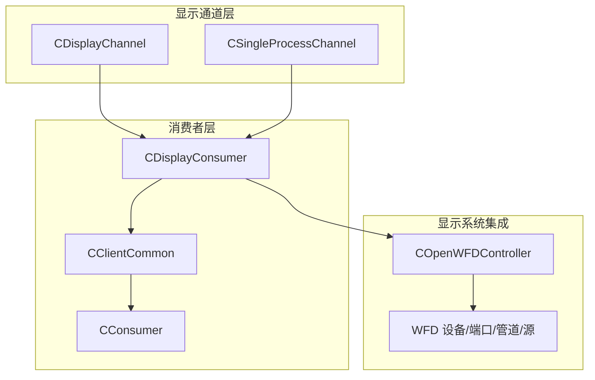
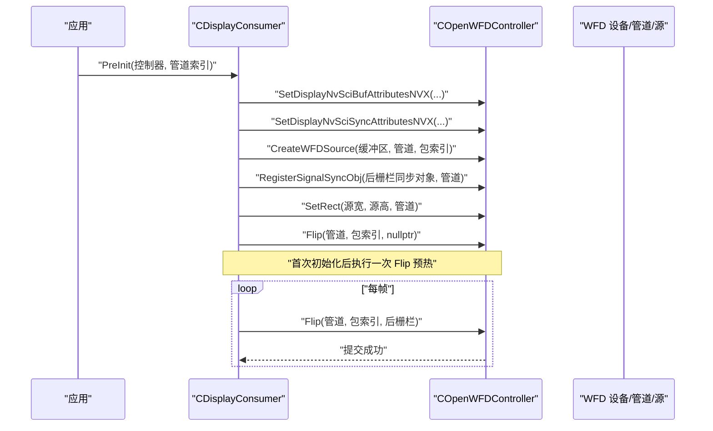
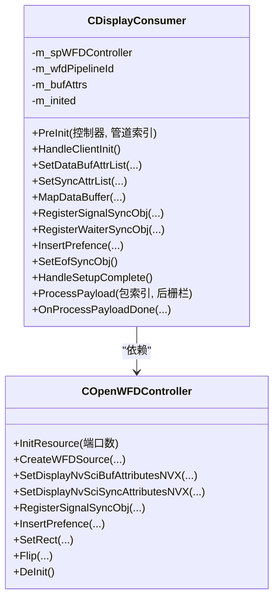
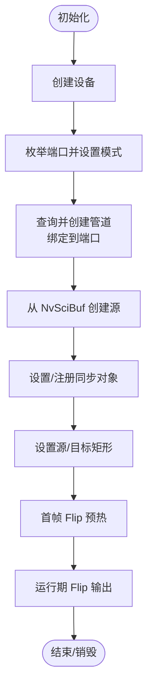
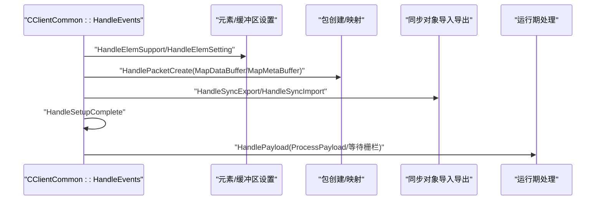
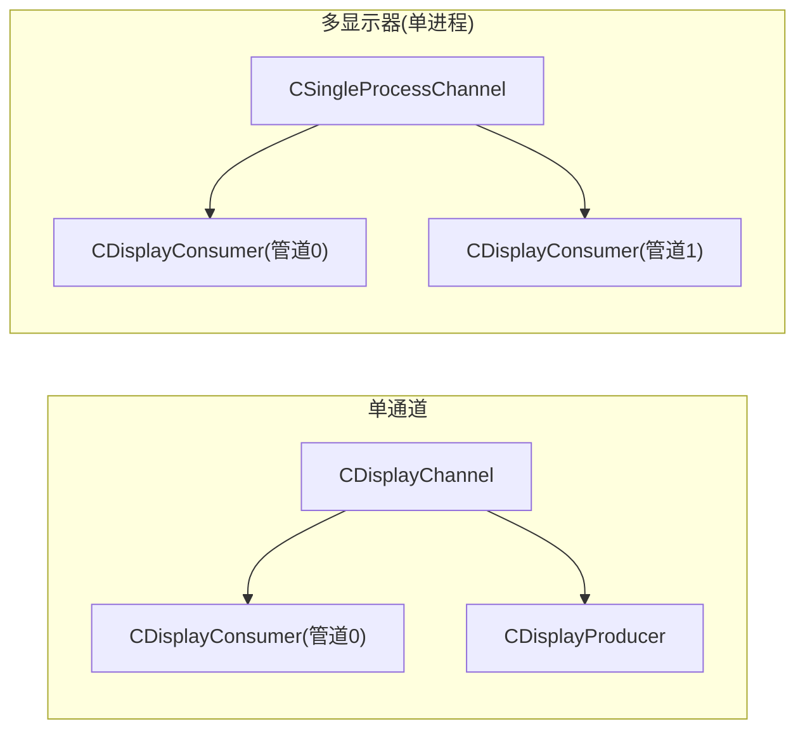
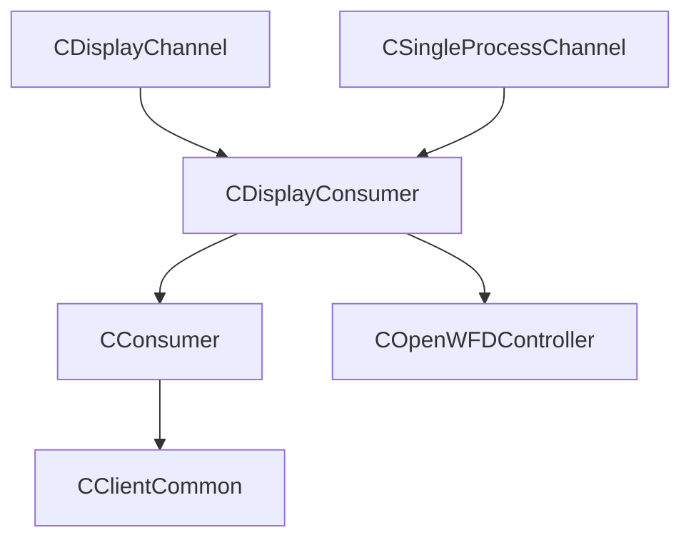
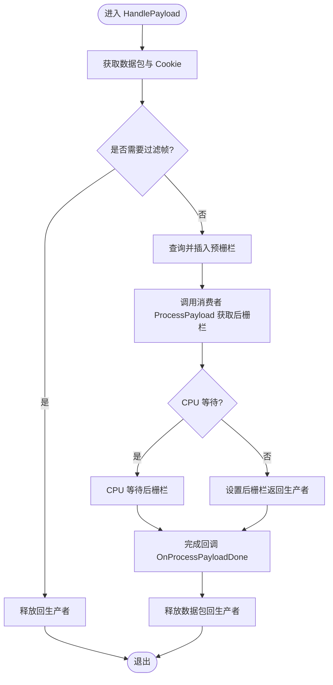
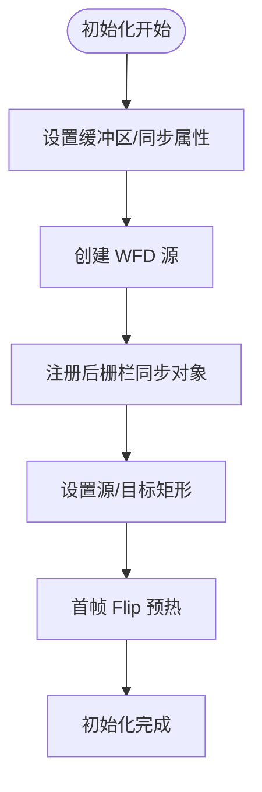

# 显示消费者

<cite>
**本文引用的文件**
- [CDisplayConsumer.cpp](file://CDisplayConsumer.cpp)
- [CDisplayConsumer.hpp](file://CDisplayConsumer.hpp)
- [COpenWFDController.cpp](file://COpenWFDController.cpp)
- [COpenWFDController.hpp](file://COpenWFDController.hpp)
- [CClientCommon.cpp](file://CClientCommon.cpp)
- [CClientCommon.hpp](file://CClientCommon.hpp)
- [CConsumer.cpp](file://CConsumer.cpp)
- [CConsumer.hpp](file://CConsumer.hpp)
- [CDisplayChannel.hpp](file://CDisplayChannel.hpp)
- [CSingleProcessChannel.hpp](file://CSingleProcessChannel.hpp)
- [Common.hpp](file://Common.hpp)
- [CEventHandler.hpp](file://CEventHandler.hpp)
- [main.cpp](file://main.cpp)
</cite>

## 目录
1. [简介](#简介)
2. [项目结构](#项目结构)
3. [核心组件](#核心组件)
4. [架构总览](#架构总览)
5. [详细组件分析](#详细组件分析)
6. [依赖关系分析](#依赖关系分析)
7. [性能考量](#性能考量)
8. [故障排查指南](#故障排查指南)
9. [结论](#结论)
10. [附录](#附录)

## 简介
本文件面向“显示消费者”的技术文档，聚焦于 CDisplayConsumer 如何通过 NvMedia OpenWFD（WFD）子系统完成图形界面显示与用户交互，涵盖以下主题：
- 显示窗口管理、分辨率适配与目标矩形设置
- 色彩空间与缓冲区属性的对接
- 与 NvMedia 显示系统的集成：显示设备选择、管道绑定、源创建与翻转（Flip）
- 缓冲区管理与同步机制：NvSciBuf/NvSciSync 的属性协商、预/后置栅栏（pre/post fence）与 CPU 等待
- 多显示器支持、窗口布局与实时显示优化策略
- 显示性能调优、内存使用优化与功耗管理
- 常见显示问题诊断与不同显示设备的兼容性处理

## 项目结构
围绕显示消费者的关键文件组织如下：
- 显示消费者实现：CDisplayConsumer（继承自 CConsumer）
- 事件与通用客户端逻辑：CClientCommon、CEventHandler
- 消费者基类：CConsumer
- 显示通道与连接：CDisplayChannel、CSingleProcessChannel
- OpenWFD 控制器：COpenWFDController（封装 WFD 设备/端口/管道/源）
- 公共常量与类型定义：Common.hpp

**图表来源**
- [CDisplayChannel.hpp:19-122](file://CDisplayChannel.hpp#L19-L122)
- [CSingleProcessChannel.hpp:118-142](file://CSingleProcessChannel.hpp#L118-L142)
- [CClientCommon.hpp:47-64](file://CClientCommon.hpp#L47-L64)
- [CConsumer.hpp:16-27](file://CConsumer.hpp#L16-L27)
- [CDisplayConsumer.hpp:15-47](file://CDisplayConsumer.hpp#L15-L47)
- [COpenWFDController.hpp:22-42](file://COpenWFDController.hpp#L22-L42)

**章节来源**
- [CDisplayChannel.hpp:19-122](file://CDisplayChannel.hpp#L19-L122)
- [CSingleProcessChannel.hpp:118-142](file://CSingleProcessChannel.hpp#L118-L142)
- [CClientCommon.hpp:47-64](file://CClientCommon.hpp#L47-L64)
- [CConsumer.hpp:16-27](file://CConsumer.hpp#L16-L27)
- [CDisplayConsumer.hpp:15-47](file://CDisplayConsumer.hpp#L15-L47)
- [COpenWFDController.hpp:22-42](file://COpenWFDController.hpp#L22-L42)

## 核心组件
- CDisplayConsumer：负责将接收到的数据包映射为 WFD 源，并在合适时机触发 Flip 完成显示输出；同时处理缓冲区与同步对象的属性设置。
- COpenWFDController：封装 WFD 设备初始化、端口枚举与模式选择、管道创建与绑定、源创建、预栅栏绑定、后栅栏注册与 Flip 提交等。
- CClientCommon/CConsumer：统一的事件驱动框架、元素/缓冲区/同步对象的协商与导入导出、数据包生命周期管理、CPU 等待与栅栏等待。

**章节来源**
- [CDisplayConsumer.cpp:12-140](file://CDisplayConsumer.cpp#L12-L140)
- [COpenWFDController.cpp:29-350](file://COpenWFDController.cpp#L29-L350)
- [CClientCommon.cpp:95-634](file://CClientCommon.cpp#L95-L634)
- [CConsumer.cpp:17-127](file://CConsumer.cpp#L17-L127)

## 架构总览
显示消费者在运行时的总体流程：
- 初始化阶段：设置缓冲区与同步属性列表，创建 WFD 源，注册信号同步对象，设置源/目标矩形，执行一次首帧 Flip 预热。
- 运行阶段：接收事件，获取数据包，插入预栅栏，调用 Flip 输出到指定管道，根据是否需要 CPU 等待决定等待后栅栏或直接设置后栅栏返回给生产者。
- 关闭阶段：解绑源、销毁管道/端口/设备，释放资源。

**图表来源**
- [CDisplayConsumer.cpp:18-113](file://CDisplayConsumer.cpp#L18-L113)
- [COpenWFDController.cpp:196-349](file://COpenWFDController.cpp#L196-L349)

**章节来源**
- [CDisplayConsumer.cpp:18-113](file://CDisplayConsumer.cpp#L18-L113)
- [COpenWFDController.cpp:196-349](file://COpenWFDController.cpp#L196-L349)

## 详细组件分析

### CDisplayConsumer 组件分析
职责与关键点：
- 属性设置：委托给 COpenWFDController 设置 NvSciBuf 与 NvSciSync 的显示相关属性。
- 缓冲区映射：从 NvSciBufObj 获取缓冲属性，创建 WFD 源；随后在 SetupComplete 中设置源/目标矩形并首帧 Flip。
- 同步对象：注册后栅栏同步对象，按数据包插入预栅栏；运行期 Flip 时提供后栅栏供生产者等待。
- 生命周期：PreInit 注入控制器与管道索引；HandleSetupComplete 完成初始化；ProcessPayload 在每帧触发 Flip。

**图表来源**
- [CDisplayConsumer.hpp:15-47](file://CDisplayConsumer.hpp#L15-L47)
- [COpenWFDController.hpp:22-42](file://COpenWFDController.hpp#L22-L42)

**章节来源**
- [CDisplayConsumer.cpp:12-140](file://CDisplayConsumer.cpp#L12-L140)
- [CDisplayConsumer.hpp:15-47](file://CDisplayConsumer.hpp#L15-L47)

### COpenWFDController 组件分析
职责与关键点：
- 设备/端口/模式：创建设备、枚举端口、查询并设置端口模式，提交变更。
- 管道：查询可绑定的管道 ID，创建并绑定到端口，提交变更。
- 源：从 NvSciBuf 对象创建 WFD 源。
- 同步：设置等待/信号同步属性，注册后栅栏同步对象，绑定预栅栏到源。
- 矩形：设置源矩形与目标矩形（窗口大小），实现缩放与裁剪。
- Flip：绑定源到管道并在 VSync 时提交，返回后栅栏。

**图表来源**
- [COpenWFDController.cpp:29-126](file://COpenWFDController.cpp#L29-L126)
- [COpenWFDController.cpp:196-349](file://COpenWFDController.cpp#L196-L349)

**章节来源**
- [COpenWFDController.cpp:29-126](file://COpenWFDController.cpp#L29-L126)
- [COpenWFDController.cpp:196-349](file://COpenWFDController.cpp#L196-L349)
- [COpenWFDController.hpp:22-42](file://COpenWFDController.hpp#L22-L42)

### CClientCommon/CConsumer 组件分析
职责与关键点：
- 事件驱动：统一处理 NvSciStream 事件（元素支持、包创建、等待/信号对象导入导出、SetupComplete、PacketReady 等）。
- 数据包生命周期：分配 Cookie、获取缓冲对象、映射元数据、设置状态。
- 同步对象：收集等待属性、协调合并、分配信号对象、导入等待对象、注册 CPU 等待上下文。
- 运行期处理：按帧过滤、获取预栅栏、插入预栅栏、调用消费者 ProcessPayload、等待后栅栏或设置后栅栏返回给生产者。

**图表来源**
- [CClientCommon.cpp:119-205](file://CClientCommon.cpp#L119-L205)
- [CClientCommon.cpp:300-408](file://CClientCommon.cpp#L300-L408)
- [CClientCommon.cpp:410-467](file://CClientCommon.cpp#L410-L467)
- [CClientCommon.cpp:469-591](file://CClientCommon.cpp#L469-L591)
- [CConsumer.cpp:17-94](file://CConsumer.cpp#L17-L94)

**章节来源**
- [CClientCommon.cpp:119-205](file://CClientCommon.cpp#L119-L205)
- [CClientCommon.cpp:300-408](file://CClientCommon.cpp#L300-L408)
- [CClientCommon.cpp:410-467](file://CClientCommon.cpp#L410-L467)
- [CClientCommon.cpp:469-591](file://CClientCommon.cpp#L469-L591)
- [CConsumer.cpp:17-94](file://CConsumer.cpp#L17-L94)

### 显示通道与多显示器支持
- 单通道显示：CDisplayChannel 创建显示消费者与显示生产者，连接池、生产者与消费者，设置队列模式为 Mailbox 保证最新帧可见。
- 单进程多传感器/多显示器：CSingleProcessChannel 在启用 DP-MST 时，为每个可用端口创建一个显示消费者，并通过 PreInit 指定不同的管道索引，实现多显示器输出。

**图表来源**
- [CDisplayChannel.hpp:90-122](file://CDisplayChannel.hpp#L90-L122)
- [CSingleProcessChannel.hpp:118-142](file://CSingleProcessChannel.hpp#L118-L142)

**章节来源**
- [CDisplayChannel.hpp:90-122](file://CDisplayChannel.hpp#L90-L122)
- [CSingleProcessChannel.hpp:118-142](file://CSingleProcessChannel.hpp#L118-L142)

## 依赖关系分析
- CDisplayConsumer 依赖 COpenWFDController 完成显示系统集成。
- CDisplayConsumer 继承自 CConsumer，后者继承自 CClientCommon，共享事件驱动与同步机制。
- 显示通道层负责创建与连接显示消费者/生产者，以及多显示器场景下的管道索引管理。

**图表来源**
- [CDisplayConsumer.hpp:15-47](file://CDisplayConsumer.hpp#L15-L47)
- [CConsumer.hpp:16-27](file://CConsumer.hpp#L16-L27)
- [CClientCommon.hpp:47-64](file://CClientCommon.hpp#L47-L64)
- [CDisplayChannel.hpp:19-122](file://CDisplayChannel.hpp#L19-L122)
- [CSingleProcessChannel.hpp:118-142](file://CSingleProcessChannel.hpp#L118-L142)

**章节来源**
- [CDisplayConsumer.hpp:15-47](file://CDisplayConsumer.hpp#L15-L47)
- [CConsumer.hpp:16-27](file://CConsumer.hpp#L16-L27)
- [CClientCommon.hpp:47-64](file://CClientCommon.hpp#L47-L64)
- [CDisplayChannel.hpp:19-122](file://CDisplayChannel.hpp#L19-L122)
- [CSingleProcessChannel.hpp:118-142](file://CSingleProcessChannel.hpp#L118-L142)

## 性能考量
- 实时显示优化
  - 使用 Mailbox 队列模式确保消费者始终消费最新帧，降低延迟。
  - 首帧 Flip 预热避免后续首帧等待后栅栏超时。
  - 合理设置帧率过滤参数，减少无效渲染。
- 缓冲区与内存
  - 仅申请只读缓冲区权限，避免不必要的 CPU 访问开销。
  - 严格释放 NvSciBuf/NvSciSync 对象与属性列表，防止泄漏。
- 同步与栅栏
  - 尽可能使用 GPU 等待（后栅栏）而非 CPU 等待，减少 CPU 开销。
  - 合理设置非阻塞提交与扫描线开始后信号的后栅栏策略，提升吞吐。
- 功耗管理
  - 降低刷新频率或在空闲时降低帧率。
  - 关闭未使用的显示器端口与管道，减少带宽占用。

[本节为通用指导，无需具体文件引用]

## 故障排查指南
- 初始化失败
  - 设备/端口/模式创建失败：检查设备句柄、端口枚举数量与模式设置。
  - 管道绑定失败：确认端口可绑定管道数量与绑定流程。
- Flip 失败或超时
  - 检查源矩形与目标矩形设置是否匹配实际窗口尺寸。
  - 确认后栅栏已正确注册并与 WFD 提交流程一致。
- 首帧卡顿或超时
  - 确保首帧 Flip 预热已执行。
  - 检查后栅栏策略（扫描线开始/结束）与 CPU 等待配置。
- 多显示器异常
  - 确认每个显示器使用的管道索引唯一且不超过最大端口数。
  - 检查每个端口的模式宽度/高度与目标矩形一致。
- 资源泄漏
  - 确保在 DeInit 中销毁所有源、管道、端口与设备。
  - 释放所有 NvSciBuf/NvSciSync 对象与属性列表。

**章节来源**
- [COpenWFDController.cpp:29-194](file://COpenWFDController.cpp#L29-L194)
- [COpenWFDController.cpp:337-349](file://COpenWFDController.cpp#L337-L349)
- [CClientCommon.cpp:38-93](file://CClientCommon.cpp#L38-L93)

## 结论
CDisplayConsumer 通过 COpenWFDController 与 NvMedia 显示系统紧密集成，实现了从缓冲区到显示输出的完整链路。其设计遵循 NvSciStream 的事件驱动模型，结合 NvSciBuf/NvSciSync 的属性协商与栅栏机制，既满足实时显示需求，又具备良好的扩展性（多显示器、多管道）。通过合理的性能优化与严格的资源管理，可在多种显示设备上稳定运行。

[本节为总结，无需具体文件引用]

## 附录

### 关键流程图：每帧处理

**图表来源**
- [CConsumer.cpp:17-94](file://CConsumer.cpp#L17-L94)

**章节来源**
- [CConsumer.cpp:17-94](file://CConsumer.cpp#L17-L94)

### 关键流程图：显示初始化

**图表来源**
- [CDisplayConsumer.cpp:37-113](file://CDisplayConsumer.cpp#L37-L113)
- [COpenWFDController.cpp:196-349](file://COpenWFDController.cpp#L196-L349)

**章节来源**
- [CDisplayConsumer.cpp:37-113](file://CDisplayConsumer.cpp#L37-L113)
- [COpenWFDController.cpp:196-349](file://COpenWFDController.cpp#L196-L349)