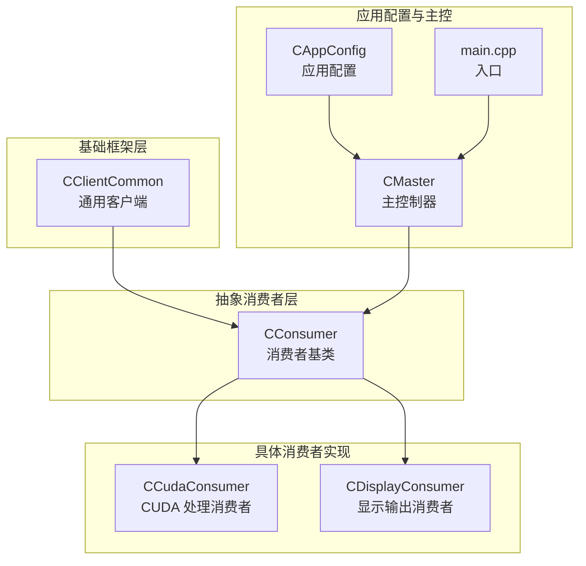
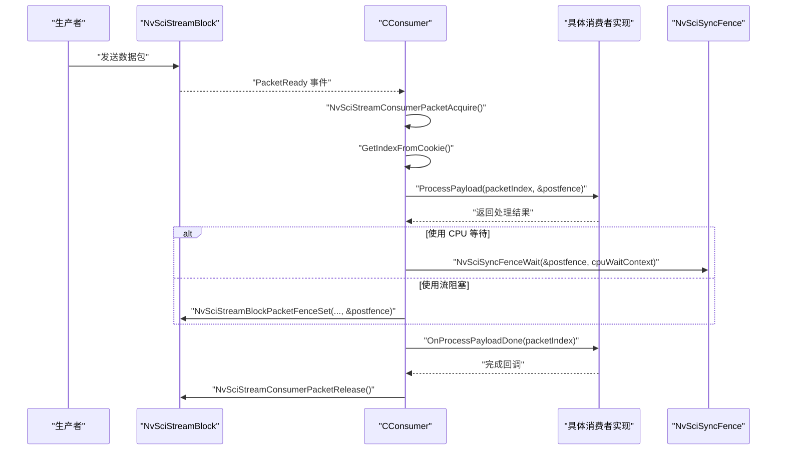
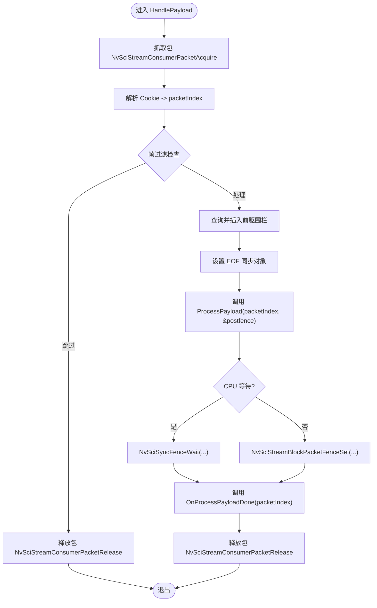
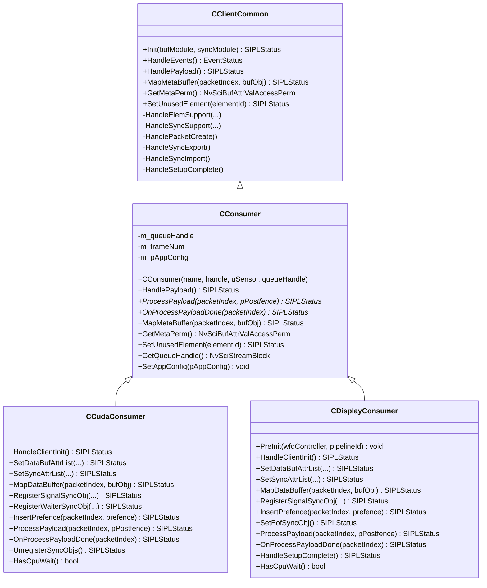

# 消费者基类架构

<cite>
**本文引用的文件列表**
- [CConsumer.hpp](file://CConsumer.hpp)
- [CConsumer.cpp](file://CConsumer.cpp)
- [CClientCommon.hpp](file://CClientCommon.hpp)
- [CClientCommon.cpp](file://CClientCommon.cpp)
- [CCudaConsumer.hpp](file://CCudaConsumer.hpp)
- [CCudaConsumer.cpp](file://CCudaConsumer.cpp)
- [CDisplayConsumer.hpp](file://CDisplayConsumer.hpp)
- [CDisplayConsumer.cpp](file://CDisplayConsumer.cpp)
- [Common.hpp](file://Common.hpp)
- [CAppConfig.hpp](file://CAppConfig.hpp)
- [main.cpp](file://main.cpp)
- [CMaster.hpp](file://CMaster.hpp)
</cite>

## 目录
1. [简介](#简介)
2. [项目结构](#项目结构)
3. [核心组件](#核心组件)
4. [架构总览](#架构总览)
5. [详细组件分析](#详细组件分析)
6. [依赖关系分析](#依赖关系分析)
7. [性能考量](#性能考量)
8. [故障排查指南](#故障排查指南)
9. [结论](#结论)
10. [附录](#附录)

## 简介
本文件围绕消费者基类 CConsumer 的设计与实现进行系统化技术文档整理。CConsumer 是所有消费者类型的抽象基类，继承自 CClientCommon，负责统一管理 NvSciStreamBlock 句柄、传感器 ID、队列处理、帧过滤、同步围栏（fence）等待与设置、以及元数据缓冲区映射等通用能力。同时，通过虚函数接口定义了“处理负载”“具体数据处理”“完成回调”“元数据映射”等扩展点，使不同场景的消费者（如 CUDA 消费者、显示消费者）能够按需实现各自的数据处理逻辑。

## 项目结构
该仓库采用面向对象的分层组织方式：
- 基础框架层：CClientCommon 提供通用的 NvSci 客户端初始化、事件循环、元素与同步对象管理、包生命周期管理等
- 抽象消费者层：CConsumer 在 CClientCommon 基础上增加消费者特有的处理流程与接口
- 具体消费者实现：CCudaConsumer、CDisplayConsumer 等基于 CConsumer 实现具体业务逻辑
- 应用配置与主控：CAppConfig、CMaster、main.cpp 负责应用启动、参数解析、通道创建与生命周期管理

图表来源
- [CClientCommon.hpp:47-200](file://CClientCommon.hpp#L47-L200)
- [CConsumer.hpp:16-45](file://CConsumer.hpp#L16-L45)
- [CCudaConsumer.hpp:25-81](file://CCudaConsumer.hpp#L25-L81)
- [CDisplayConsumer.hpp:15-49](file://CDisplayConsumer.hpp#L15-L49)
- [CAppConfig.hpp:19-83](file://CAppConfig.hpp#L19-L83)
- [CMaster.hpp:47-95](file://CMaster.hpp#L47-L95)
- [main.cpp:1-200](file://main.cpp#L1-L200)

章节来源
- [CClientCommon.hpp:1-202](file://CClientCommon.hpp#L1-L202)
- [CConsumer.hpp:1-45](file://CConsumer.hpp#L1-L45)
- [CCudaConsumer.hpp:1-81](file://CCudaConsumer.hpp#L1-L81)
- [CDisplayConsumer.hpp:1-49](file://CDisplayConsumer.hpp#L1-L49)
- [CAppConfig.hpp:1-83](file://CAppConfig.hpp#L1-L83)
- [CMaster.hpp:1-95](file://CMaster.hpp#L1-L95)
- [main.cpp:1-200](file://main.cpp#L1-L200)

## 核心组件
- CClientCommon：抽象出 NvSci 客户端的通用行为，包括事件查询与分发、元素属性设置、同步对象导出/导入、包创建与状态上报、CPU 等待上下文等
- CConsumer：在 CClientCommon 基础上，封装消费者特有的“抓取包 -> 获取索引 -> 等待前驱围栏 -> 调用 ProcessPayload -> 设置后置围栏 -> 回调 OnProcessPayloadDone -> 释放包”的完整流水线，并提供虚函数扩展点
- 具体消费者：如 CCudaConsumer、CDisplayConsumer，分别覆盖缓冲区映射、同步对象注册、预围栏插入、帧处理与完成回调等

章节来源
- [CClientCommon.hpp:47-200](file://CClientCommon.hpp#L47-L200)
- [CConsumer.hpp:16-45](file://CConsumer.hpp#L16-L45)
- [CConsumer.cpp:17-127](file://CConsumer.cpp#L17-L127)

## 架构总览
CConsumer 的运行时架构遵循 NvSciStream 的事件驱动模型：
- 事件循环：CClientCommon::HandleEvents 根据 NvSciStreamEventType 分派到对应处理函数
- 包生命周期：PacketCreate -> PacketReady -> PacketsComplete -> PacketDelete
- 消费者处理：在 PacketReady 事件中，CConsumer::HandlePayload 完成抓取包、索引解析、前驱围栏等待、调用 ProcessPayload、设置后置围栏、回调 OnProcessPayloadDone、释放包

图表来源
- [CConsumer.cpp:17-94](file://CConsumer.cpp#L17-L94)
- [CClientCommon.cpp:119-205](file://CClientCommon.cpp#L119-L205)

章节来源
- [CConsumer.cpp:17-94](file://CConsumer.cpp#L17-L94)
- [CClientCommon.cpp:119-205](file://CClientCommon.cpp#L119-L205)

## 详细组件分析

### CConsumer 类设计与职责
- 继承关系：public CClientCommon
- 关键成员：
  - m_queueHandle：消费者侧队列句柄（用于特定队列类型或转发）
  - m_frameNum：帧计数器，配合帧过滤策略
  - m_pAppConfig：应用配置指针，提供帧过滤、输出控制等
- 关键虚函数接口：
  - ProcessPayload：具体数据处理逻辑（由子类实现）
  - OnProcessPayloadDone：处理完成后回调（由子类实现）
  - MapMetaBuffer：元数据缓冲区映射（由子类实现）
  - GetMetaPerm：元数据访问权限（默认只读）
  - SetUnusedElement：禁用未使用的元素
- 生命周期：
  - 构造：接收名称、NvSciStreamBlock、传感器 ID、队列句柄
  - 初始化：通过 CClientCommon::Init 完成元素与同步对象设置
  - 运行：事件循环中响应 PacketReady 并执行 HandlePayload
  - 清理：析构时释放资源（由 CClientCommon 负责）

章节来源
- [CConsumer.hpp:16-45](file://CConsumer.hpp#L16-L45)
- [CConsumer.cpp:11-127](file://CConsumer.cpp#L11-L127)

### CClientCommon 通用客户端能力
- 事件处理：HandleEvents 根据 NvSciStreamEventType 分派到 HandleElemSupport/HandleSyncSupport/HandlePacketCreate/HandleSyncExport/HandleSyncImport/HandleSetupComplete/HandlePayload 等
- 元素与缓冲属性：SetDataBufAttrList/SetMetaBufAttrList/SetSyncAttrList 等，支持多元素、共享同步对象、CPU 等待上下文
- 包生命周期：PacketCreate 时分配 Cookie、映射缓冲、设置状态；PacketReady 时调用 HandlePayload；PacketsComplete 后进入运行态
- 同步对象：导出信号量、导入等待者、合并属性列表、分配同步对象、注册并设置信号对象
- 工具方法：GetIndexFromCookie/AssignPacketCookie/GetPacketByCookie 等

章节来源
- [CClientCommon.hpp:47-200](file://CClientCommon.hpp#L47-L200)
- [CClientCommon.cpp:95-634](file://CClientCommon.cpp#L95-L634)

### CConsumer::HandlePayload 执行流程
- 抓取包：NvSciStreamConsumerPacketAcquire
- 解析索引：GetIndexFromCookie
- 帧过滤：根据 m_pAppConfig->GetFrameFilter 判定是否跳过
- 前驱围栏：从包中查询并插入到等待队列
- 设置 EOF 同步对象：SetEofSyncObj（可选）
- 调用 ProcessPayload：执行具体处理逻辑，生成后置围栏
- CPU 等待或流阻塞：根据是否有 CPU 等待上下文选择等待或设置围栏
- 回调 OnProcessPayloadDone：完成后的收尾工作
- 释放包：NvSciStreamConsumerPacketRelease

图表来源
- [CConsumer.cpp:17-94](file://CConsumer.cpp#L17-L94)

章节来源
- [CConsumer.cpp:17-94](file://CConsumer.cpp#L17-L94)

### 虚函数接口详解
- ProcessPayload(packetIndex, pPostfence)
  - 作用：执行具体的数据处理逻辑，如 CUDA 内存拷贝、推理、显示翻转等
  - 返回：处理状态，成功后由 CConsumer 设置后置围栏
- OnProcessPayloadDone(packetIndex)
  - 作用：处理完成后的回调，如文件落盘、显示刷新等
- MapMetaBuffer(packetIndex, bufObj)
  - 作用：将元数据缓冲区映射为 CPU 可读指针
  - 默认权限：只读（GetMetaPerm 返回 NvSciBufAccessPerm_Readonly）
- SetUnusedElement(elementId)
  - 作用：禁用未使用的元素，避免不必要的同步与缓冲映射

章节来源
- [CConsumer.hpp:30-36](file://CConsumer.hpp#L30-L36)
- [CConsumer.cpp:101-122](file://CConsumer.cpp#L101-L122)

### 元数据缓冲区映射与访问
- 元数据缓冲区属性：固定大小、CPU 可访问、只读权限
- 映射方式：通过 NvSciBufObjGetConstCpuPtr 获取只读 CPU 指针
- 访问位置：CConsumer 将每个包的元数据指针保存在 m_metaPtrs 数组中，便于后续读取

章节来源
- [CClientCommon.cpp:279-298](file://CClientCommon.cpp#L279-L298)
- [CConsumer.cpp:107-114](file://CConsumer.cpp#L107-L114)

### 队列处理机制与传感器 ID
- 队列句柄：构造时传入 m_queueHandle，可通过 GetQueueHandle 获取
- 传感器 ID：构造时传入 uSensor，用于区分多传感器场景下的消费者实例
- 应用配置：SetAppConfig 接收 CAppConfig 指针，用于帧过滤等策略控制

章节来源
- [CConsumer.hpp:26-27](file://CConsumer.hpp#L26-L27)
- [CConsumer.cpp:11-15](file://CConsumer.cpp#L11-L15)
- [CConsumer.cpp:124-127](file://CConsumer.cpp#L124-L127)

### 生命周期管理与资源清理
- 初始化：CClientCommon::Init 调用 HandleStreamInit/HandleClientInit/HandleElemSupport/HandleSyncSupport 完成元素与同步对象设置
- 运行期：事件循环 HandleEvents 分发各阶段事件
- 清理：CClientCommon 析构中统一释放同步对象、属性列表、包缓冲、CPU 等待上下文等

章节来源
- [CClientCommon.cpp:95-112](file://CClientCommon.cpp#L95-L112)
- [CClientCommon.cpp:38-93](file://CClientCommon.cpp#L38-L93)

### 线程安全机制
- 事件查询：NvSciStreamBlockEventQuery 在超时时间内轮询事件，避免阻塞
- 同步对象：通过 NvSciSyncFence 实现跨端同步，避免竞态
- CPU 等待：可选的 CPU 等待上下文，避免忙等
- 线程模型：主循环在事件线程中处理，具体处理逻辑由子类实现，建议在子类内部自行保证线程安全

章节来源
- [CClientCommon.cpp:119-205](file://CClientCommon.cpp#L119-L205)
- [CClientCommon.cpp:328-365](file://CClientCommon.cpp#L328-L365)

### 具体消费者示例

#### CUDA 消费者（CCudaConsumer）
- 数据缓冲属性：基于 GPU 可见的 NvSciBuf 属性，支持块线性与平面线性布局
- 同步属性：通过 CUDA 设备获取 NvSciSync 属性，注册信号/等待者外部信号量
- 预围栏插入：在 CUDA 流中等待前驱围栏
- 帧处理：根据布局进行设备到主机的拷贝、推理等
- 完成回调：可选文件落盘

章节来源
- [CCudaConsumer.hpp:25-81](file://CCudaConsumer.hpp#L25-L81)
- [CCudaConsumer.cpp:11-492](file://CCudaConsumer.cpp#L11-L492)

#### 显示消费者（CDisplayConsumer）
- 数据缓冲属性：委托给 COpenWFDController 设置显示所需的 NvSciBuf 属性
- 同步属性：委托给 COpenWFDController 设置显示所需的 NvSciSync 属性
- 预围栏插入：通过 COpenWFDController 插入等待围栏
- 帧处理：调用 Flip 翻转显示
- 初始化：在 HandleSetupComplete 中完成显示源创建与首帧翻转

章节来源
- [CDisplayConsumer.hpp:15-49](file://CDisplayConsumer.hpp#L15-L49)
- [CDisplayConsumer.cpp:12-140](file://CDisplayConsumer.cpp#L12-L140)

## 依赖关系分析

图表来源
- [CClientCommon.hpp:47-200](file://CClientCommon.hpp#L47-L200)
- [CConsumer.hpp:16-45](file://CConsumer.hpp#L16-L45)
- [CCudaConsumer.hpp:25-81](file://CCudaConsumer.hpp#L25-L81)
- [CDisplayConsumer.hpp:15-49](file://CDisplayConsumer.hpp#L15-L49)

章节来源
- [CClientCommon.hpp:47-200](file://CClientCommon.hpp#L47-L200)
- [CConsumer.hpp:16-45](file://CConsumer.hpp#L16-L45)
- [CCudaConsumer.hpp:25-81](file://CCudaConsumer.hpp#L25-L81)
- [CDisplayConsumer.hpp:15-49](file://CDisplayConsumer.hpp#L15-L49)

## 性能考量
- 帧过滤：通过 m_pAppConfig->GetFrameFilter 实现降采样，减少处理开销
- 围栏等待：优先使用 CPU 等待上下文避免忙等；否则使用流阻塞设置后置围栏
- 缓冲布局：块线性与平面线性的不同路径，应根据硬件与算法选择最优布局
- 元数据访问：只读元数据映射，避免不必要的写操作
- 多元素与共享同步：合理设置 hasSibling 与元素复用，减少同步对象数量

章节来源
- [CConsumer.cpp:38-43](file://CConsumer.cpp#L38-L43)
- [CClientCommon.cpp:328-365](file://CClientCommon.cpp#L328-L365)
- [CCudaConsumer.cpp:300-322](file://CCudaConsumer.cpp#L300-L322)
- [CDisplayConsumer.cpp:115-118](file://CDisplayConsumer.cpp#L115-L118)

## 故障排查指南
- 事件查询超时：检查 NvSciStreamBlockEventQuery 是否正确设置超时时间
- 元素属性设置失败：确认 SetDataBufAttrList/SetMetaBufAttrList/SetSyncAttrList 返回状态
- 同步对象导入失败：检查 HandleSyncImport 中 NvSciStreamBlockElementSignalObjGet 的返回值
- 包创建失败：检查 MAX_NUM_PACKETS 限制与 PacketStatus 设置
- 围栏等待超时：调整 FENCE_FRAME_TIMEOUT_US 或改为 CPU 等待
- 元数据映射失败：确认 NvSciBufObjGetConstCpuPtr 返回值与权限设置

章节来源
- [CClientCommon.cpp:119-205](file://CClientCommon.cpp#L119-L205)
- [CClientCommon.cpp:367-408](file://CClientCommon.cpp#L367-L408)
- [CClientCommon.cpp:555-591](file://CClientCommon.cpp#L555-L591)
- [CConsumer.cpp:107-114](file://CConsumer.cpp#L107-L114)

## 结论
CConsumer 通过继承 CClientCommon，将 NvSciStream 的复杂事件与同步机制抽象为统一的消费者处理流程，同时以虚函数接口开放扩展点，使得不同场景的消费者可以专注于自身业务逻辑的实现。结合帧过滤、元数据映射、同步围栏与资源清理等机制，CConsumer 为多传感器、多消费者的高性能视频流处理提供了稳定可靠的基础设施。

## 附录

### 使用示例与扩展指导
- 创建消费者实例
  - CUDA 消费者：CCudaConsumer(handle, sensorId, queueHandle)
  - 显示消费者：CDisplayConsumer(handle, sensorId, queueHandle)
- 设置应用配置
  - SetAppConfig(pAppConfig) 以启用帧过滤、输出控制等功能
- 实现虚函数
  - SetDataBufAttrList/SetSyncAttrList：设置缓冲与同步属性
  - MapDataBuffer/MapMetaBuffer：映射数据与元数据缓冲
  - InsertPrefence：在子线程/流中等待前驱围栏
  - ProcessPayload：执行具体处理逻辑
  - OnProcessPayloadDone：完成后的收尾工作
- 生命周期管理
  - 通过 CClientCommon::Init 完成初始化
  - 在事件循环中处理 PacketReady
  - 析构时自动清理资源

章节来源
- [CCudaConsumer.hpp:25-81](file://CCudaConsumer.hpp#L25-L81)
- [CCudaConsumer.cpp:11-492](file://CCudaConsumer.cpp#L11-L492)
- [CDisplayConsumer.hpp:15-49](file://CDisplayConsumer.hpp#L15-L49)
- [CDisplayConsumer.cpp:12-140](file://CDisplayConsumer.cpp#L12-L140)
- [CConsumer.cpp:124-127](file://CConsumer.cpp#L124-L127)