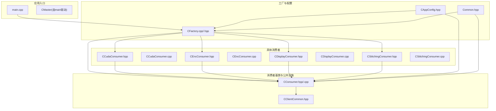
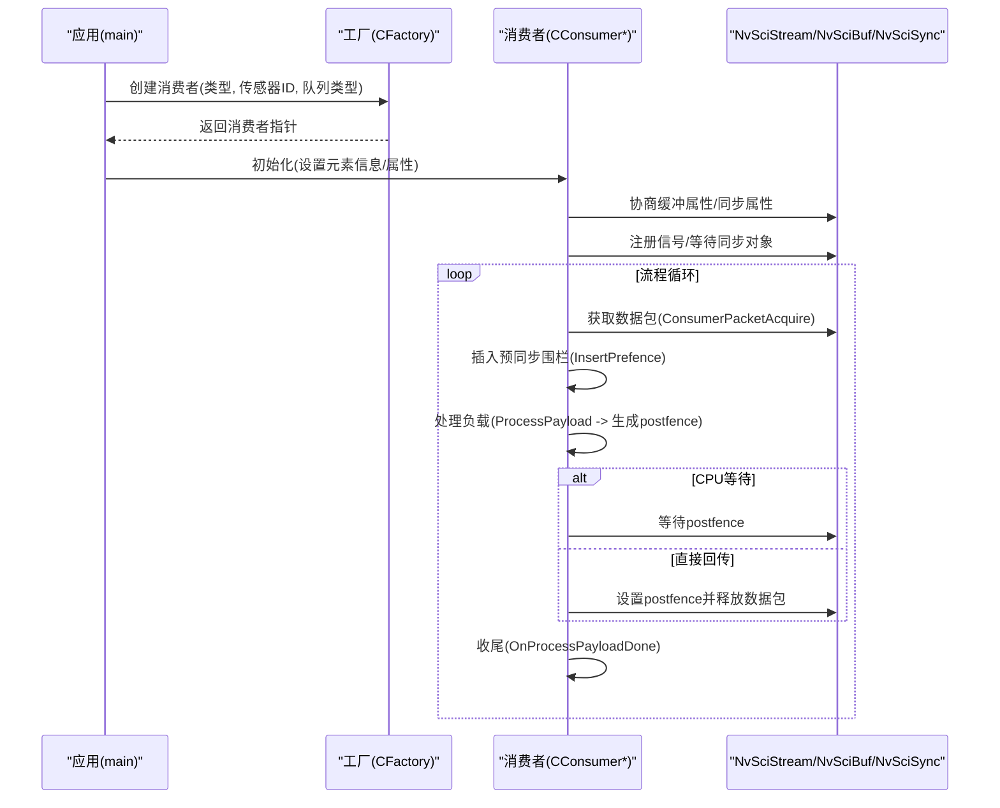
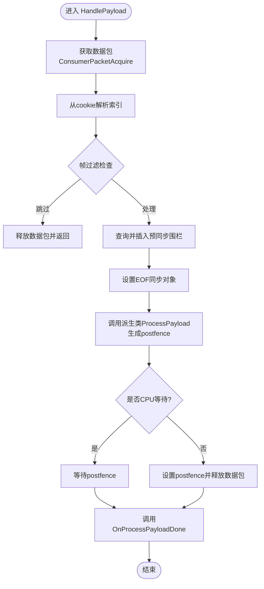
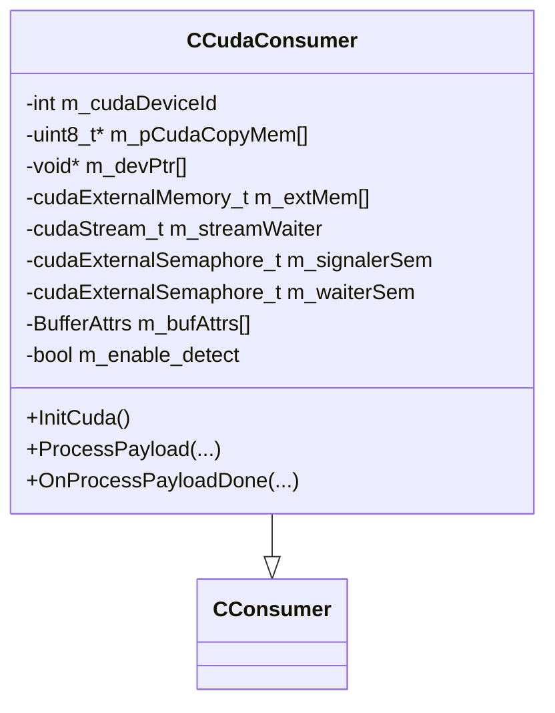
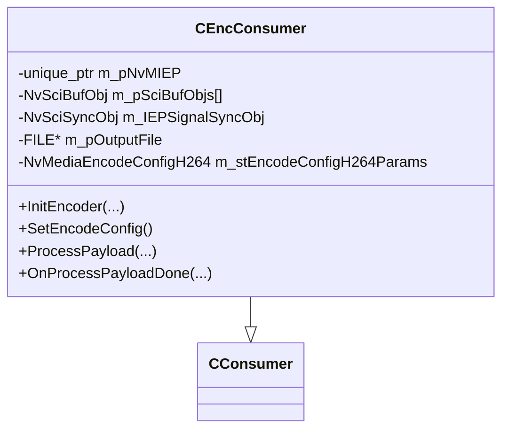
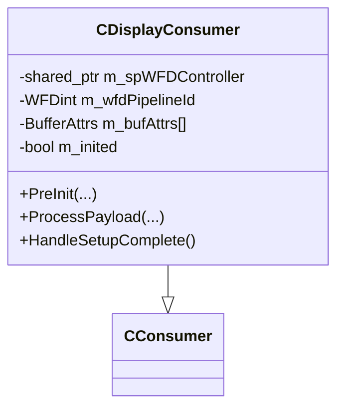
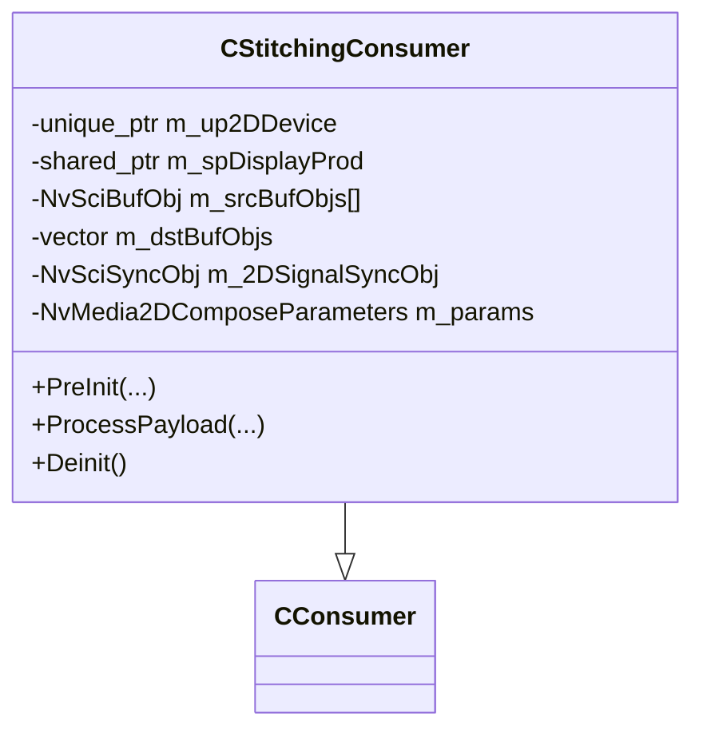
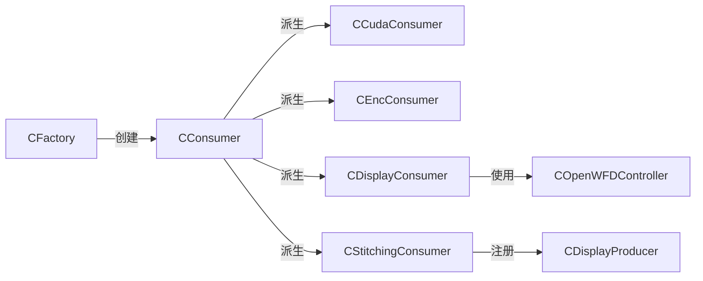

# 消费者系统

<cite>
**本文引用的文件**   
- [CConsumer.hpp](file://CConsumer.hpp)
- [CConsumer.cpp](file://CConsumer.cpp)
- [CClientCommon.hpp](file://CClientCommon.hpp)
- [CFactory.hpp](file://CFactory.hpp)
- [CFactory.cpp](file://CFactory.cpp)
- [CCudaConsumer.hpp](file://CCudaConsumer.hpp)
- [CCudaConsumer.cpp](file://CCudaConsumer.cpp)
- [CEncConsumer.hpp](file://CEncConsumer.hpp)
- [CEncConsumer.cpp](file://CEncConsumer.cpp)
- [CDisplayConsumer.hpp](file://CDisplayConsumer.hpp)
- [CDisplayConsumer.cpp](file://CDisplayConsumer.cpp)
- [CStitchingConsumer.hpp](file://CStitchingConsumer.hpp)
- [CStitchingConsumer.cpp](file://CStitchingConsumer.cpp)
- [Common.hpp](file://Common.hpp)
- [CAppConfig.hpp](file://CAppConfig.hpp)
- [CSingleProcessChannel.hpp](file://CSingleProcessChannel.hpp)
- [main.cpp](file://main.cpp)
</cite>

## 目录
1. [简介](#简介)
2. [项目结构](#项目结构)
3. [核心组件](#核心组件)
4. [架构总览](#架构总览)
5. [详细组件分析](#详细组件分析)
6. [依赖关系分析](#依赖关系分析)
7. [性能考量](#性能考量)
8. [故障排查指南](#故障排查指南)
9. [结论](#结论)
10. [附录](#附录)

## 简介
本文件面向“消费者系统”的综合技术文档，围绕消费者基类（CConsumer）及其派生类型（CUDA、编码器、显示、拼接），系统阐述设计理念、通用接口与生命周期管理；解析消费者注册机制、数据接收流程、处理策略与资源管理；并提供使用示例与最佳实践建议。目标是帮助读者在不深入底层实现细节的前提下，快速掌握系统架构与关键流程。

## 项目结构
消费者系统位于多播示例工程中，采用“基类+工厂+派生类”的分层设计：
- 基类与公共逻辑：CClientCommon、CConsumer
- 工厂与注册：CFactory 负责队列、消费者实例化与元素信息配置
- 消费者类型：CCudaConsumer、CEncConsumer、CDisplayConsumer、CStitchingConsumer
- 配置与常量：CAppConfig、Common.hpp
- 运行入口与通道集成：main.cpp、CSingleProcessChannel.hpp

图表来源
- [CFactory.cpp:166-205](file://CFactory.cpp#L166-L205)
- [CConsumer.hpp:16-43](file://CConsumer.hpp#L16-L43)
- [CClientCommon.hpp:47-199](file://CClientCommon.hpp#L47-L199)
- [CCudaConsumer.hpp:25-81](file://CCudaConsumer.hpp#L25-L81)
- [CEncConsumer.hpp:17-66](file://CEncConsumer.hpp#L17-L66)
- [CDisplayConsumer.hpp:15-49](file://CDisplayConsumer.hpp#L15-L49)
- [CStitchingConsumer.hpp:17-74](file://CStitchingConsumer.hpp#L17-L74)

章节来源
- [CFactory.cpp:138-205](file://CFactory.cpp#L138-L205)
- [CConsumer.hpp:16-43](file://CConsumer.hpp#L16-L43)
- [CClientCommon.hpp:47-199](file://CClientCommon.hpp#L47-L199)
- [Common.hpp:35-87](file://Common.hpp#L35-L87)

## 核心组件
- 消费者基类（CConsumer）
  - 作用：统一抽象所有消费者类型的通用行为，包括数据包获取、预/后同步围栏处理、元数据映射、帧过滤与释放等。
  - 关键接口：HandlePayload（核心数据流）、ProcessPayload（派生类处理）、OnProcessPayloadDone（收尾）、SetEofSyncObj（设置EOF同步对象）。
  - 生命周期：构造时绑定队列句柄；初始化阶段由工厂注入元素信息；运行期循环处理数据包；析构时释放资源。
- 客户端公共基类（CClientCommon）
  - 作用：封装通用的NvSciStream/NvSciBuf/NvSciSync交互、事件处理、元素属性协商、CPU等待上下文等。
  - 关键接口：HandleEvents、Init、SetPacketElementsInfo、InsertPrefence、RegisterSignal/WaiterSyncObj、SetDataBufAttrList/SetSyncAttrList等。
- 工厂（CFactory）
  - 作用：集中创建队列、消费者实例、多播块、IPC块；根据配置与类型推导元素使用情况并注入到消费者。
  - 关键接口：CreateConsumer、CreateQueue、CreateConsumerQueueHandles、GetConsumerElementsInfo等。

章节来源
- [CConsumer.cpp:17-94](file://CConsumer.cpp#L17-L94)
- [CConsumer.hpp:18-35](file://CConsumer.hpp#L18-L35)
- [CClientCommon.hpp:65-162](file://CClientCommon.hpp#L65-L162)
- [CFactory.cpp:166-205](file://CFactory.cpp#L166-L205)

## 架构总览
消费者系统以NvSciStream为数据通路，通过工厂创建消费者实例，并在初始化阶段完成缓冲区属性与同步对象的协商。每个消费者在运行期从队列中取出数据包，按需插入预同步围栏，调用派生类的处理函数生成后同步围栏，最后释放数据包回到生产者。

图表来源
- [CFactory.cpp:166-205](file://CFactory.cpp#L166-L205)
- [CConsumer.cpp:17-94](file://CConsumer.cpp#L17-L94)
- [CClientCommon.hpp:145-154](file://CClientCommon.hpp#L145-L154)

## 详细组件分析

### CConsumer 基类
- 设计理念
  - 将“数据包获取—预同步—处理—后同步—释放”流程标准化，派生类仅关注业务处理细节。
  - 通过虚函数扩展点（如ProcessPayload、OnProcessPayloadDone、SetEofSyncObj）解耦不同消费场景。
- 生命周期管理
  - 构造：保存队列句柄与传感器ID。
  - 初始化：工厂注入元素信息；CClientCommon完成属性协商与同步对象注册。
  - 运行：HandlePayload循环处理；ProcessPayload生成postfence；OnProcessPayloadDone收尾。
  - 析构：由派生类负责清理CUDA/NvMedia等资源。
- 关键流程图

图表来源
- [CConsumer.cpp:17-94](file://CConsumer.cpp#L17-L94)

章节来源
- [CConsumer.hpp:18-35](file://CConsumer.hpp#L18-L35)
- [CConsumer.cpp:17-127](file://CConsumer.cpp#L17-L127)
- [CClientCommon.hpp:65-162](file://CClientCommon.hpp#L65-L162)

### CUDA 消费者（CCudaConsumer）
- 功能定位
  - 利用GPU进行高性能图像处理，支持可选的推理（Linux/QNX平台差异）。
  - 映射NvSciBuf到CUDA外部内存，必要时复制到主机缓冲或直接推理。
- 关键实现要点
  - 属性与同步：通过CUDA设备获取NvSciSync属性列表；导入NvSciBuf为CUDA外部内存；创建非阻塞CUDA流。
  - 处理流程：根据配置决定是否写文件；调用推理或转换函数；生成postfence。
  - 资源管理：析构时销毁外部内存/信号量、释放mipmappedArray、关闭输出文件、销毁CUDA流。
- 类关系图

图表来源
- [CCudaConsumer.hpp:25-81](file://CCudaConsumer.hpp#L25-L81)
- [CCudaConsumer.cpp:11-110](file://CCudaConsumer.cpp#L11-L110)

章节来源
- [CCudaConsumer.hpp:25-81](file://CCudaConsumer.hpp#L25-L81)
- [CCudaConsumer.cpp:28-200](file://CCudaConsumer.cpp#L28-L200)

### 编码器消费者（CEncConsumer）
- 功能定位
  - 使用NvMedia IEP进行H.264编码，输出到文件或下游。
- 关键实现要点
  - 属性与同步：填充NvSciBuf属性列表；填充NvSciSync属性列表；注册NvSciBufObj与同步对象。
  - 编码配置：设置编码参数（GOP、RC模式、VUI等）；创建IEP实例并应用配置。
  - 处理流程：注册当前包的NvSciBufObj；执行编码；获取输出缓冲与字节数；生成postfence。
- 类关系图

图表来源
- [CEncConsumer.hpp:17-66](file://CEncConsumer.hpp#L17-L66)
- [CEncConsumer.cpp:57-140](file://CEncConsumer.cpp#L57-L140)

章节来源
- [CEncConsumer.hpp:17-66](file://CEncConsumer.hpp#L17-L66)
- [CEncConsumer.cpp:17-200](file://CEncConsumer.cpp#L17-L200)

### 显示消费者（CDisplayConsumer）
- 功能定位
  - 通过WFD控制器将图像呈现到显示器，支持DP-MST与拼接显示两种路径。
- 关键实现要点
  - 属性与同步：从WFD控制器获取NvSciBuf/NvSciSync属性；创建WFD源；注册信号/等待同步对象。
  - 初始化：首次Flip以避免postfence超时；记录缓冲尺寸用于后续渲染。
  - 处理流程：Flip显示，生成postfence；完成后回调OnProcessPayloadDone。
- 类关系图

图表来源
- [CDisplayConsumer.hpp:15-49](file://CDisplayConsumer.hpp#L15-L49)
- [CDisplayConsumer.cpp:18-140](file://CDisplayConsumer.cpp#L18-L140)

章节来源
- [CDisplayConsumer.hpp:15-49](file://CDisplayConsumer.hpp#L15-L49)
- [CDisplayConsumer.cpp:24-140](file://CDisplayConsumer.cpp#L24-L140)

### 拼接消费者（CStitchingConsumer）
- 功能定位
  - 使用NvMedia2D对多视角图像进行合成拼接，供显示消费者使用。
- 关键实现要点
  - 属性与同步：填充NvSciBuf/NvSciSync属性列表；注册源与目标NvSciBufObj；注册信号/等待同步对象。
  - 参数设置：设置Compose参数；插入PRE围栏；设置EOF同步对象。
  - 处理流程：执行Compose；获取EOF围栏作为postfence；完成后注销同步对象与缓冲。
- 类关系图

图表来源
- [CStitchingConsumer.hpp:17-74](file://CStitchingConsumer.hpp#L17-L74)
- [CStitchingConsumer.cpp:12-200](file://CStitchingConsumer.cpp#L12-L200)

章节来源
- [CStitchingConsumer.hpp:17-74](file://CStitchingConsumer.hpp#L17-L74)
- [CStitchingConsumer.cpp:26-200](file://CStitchingConsumer.cpp#L26-L200)

## 依赖关系分析
- 组件耦合
  - 所有消费者均继承自CConsumer，复用CClientCommon提供的NvSci基础设施。
  - 工厂CFactory集中创建消费者与队列，降低上层对底层细节的感知。
  - 显示与拼接消费者之间存在协作：拼接消费者向显示生产者注册，显示消费者通过WFD控制器呈现。
- 外部依赖
  - NvSciStream/NvSciBuf/NvSciSync：统一的跨进程/跨芯片数据与同步通道。
  - CUDA/NvMedia：CUDA消费者与编码/拼接消费者分别依赖相应硬件加速库。
- 可能的循环依赖
  - 当前结构未见直接循环依赖；拼接消费者与显示生产者通过接口注册，无反向强依赖。

图表来源
- [CFactory.cpp:166-205](file://CFactory.cpp#L166-L205)
- [CDisplayConsumer.hpp:12-14](file://CDisplayConsumer.hpp#L12-L14)
- [CStitchingConsumer.hpp:14-16](file://CStitchingConsumer.hpp#L14-L16)

章节来源
- [CFactory.cpp:166-205](file://CFactory.cpp#L166-L205)
- [CDisplayConsumer.hpp:12-14](file://CDisplayConsumer.hpp#L12-L14)
- [CStitchingConsumer.hpp:14-16](file://CStitchingConsumer.hpp#L14-L16)

## 性能考量
- 队列选择
  - FIFO队列适合连续流式处理；Mailbox队列确保只保留最新帧，适用于显示场景以减少延迟。
- 同步策略
  - CPU等待模式可简化同步但可能引入CPU开销；非CPU等待模式通过NvSci围栏在设备侧完成同步，更高效。
- 资源复用
  - CUDA外部内存与流应尽量复用，避免频繁创建销毁；编码器与2D设备在初始化阶段完成注册，运行期避免重复操作。
- 帧过滤
  - 通过配置项实现帧率抽稀，降低处理压力；注意与显示/编码的帧率匹配。

## 故障排查指南
- 常见错误与定位
  - NvSci错误：检查NvSciStream/NvSciBuf/NvSciSync的创建/注册/等待返回值。
  - CUDA错误：确认设备设置、外部内存导入、流状态；检查推理模型加载与输入尺寸。
  - 显示问题：确认WFD控制器初始化、管道ID、首次Flip；检查缓冲属性与尺寸。
  - 拼接异常：核对Compose参数、源/目标缓冲注册、同步对象状态。
- 日志与调试
  - 使用日志宏输出关键步骤与返回值；在关键路径添加断言或状态检查。
  - 在工厂与消费者构造/析构处打印生命周期信息，便于定位泄漏或未释放资源。

章节来源
- [CConsumer.cpp:17-94](file://CConsumer.cpp#L17-L94)
- [CCudaConsumer.cpp:28-110](file://CCudaConsumer.cpp#L28-L110)
- [CEncConsumer.cpp:57-140](file://CEncConsumer.cpp#L57-L140)
- [CDisplayConsumer.cpp:24-140](file://CDisplayConsumer.cpp#L24-L140)
- [CStitchingConsumer.cpp:26-200](file://CStitchingConsumer.cpp#L26-L200)

## 结论
消费者系统通过CConsumer基类与CClientCommon公共设施，将复杂的NvSci数据通路与同步机制抽象化，配合CFactory工厂模式实现灵活的消费者创建与配置。各派生消费者聚焦自身业务（GPU处理、编码、显示、拼接），既保持高内聚又具备良好扩展性。遵循本文的最佳实践与排错建议，可在多传感器/多消费者场景下稳定运行并获得良好性能。

## 附录

### 使用示例与最佳实践
- 基本用法
  - 通过工厂创建消费者：指定类型、传感器ID与队列类型；工厂自动注入元素信息并返回消费者指针。
  - 在应用入口中启动主循环，驱动消费者进入流式处理；根据需要启用帧过滤与文件转储。
- 最佳实践
  - 显示场景优先选择Mailbox队列，保证画面实时性。
  - CUDA消费者建议启用GPU直连缓冲访问，减少拷贝；推理模块按需启用。
  - 编码消费者在初始化阶段完成编码参数设置，避免运行期反复配置。
  - 拼接消费者与显示生产者建立注册关系，确保Compose参数正确。
  - 资源管理：析构时务必注销NvSci对象、释放外部内存与CUDA流、关闭文件句柄。

章节来源
- [CFactory.cpp:166-205](file://CFactory.cpp#L166-L205)
- [CSingleProcessChannel.hpp:115-138](file://CSingleProcessChannel.hpp#L115-L138)
- [main.cpp:74-153](file://main.cpp#L74-L153)