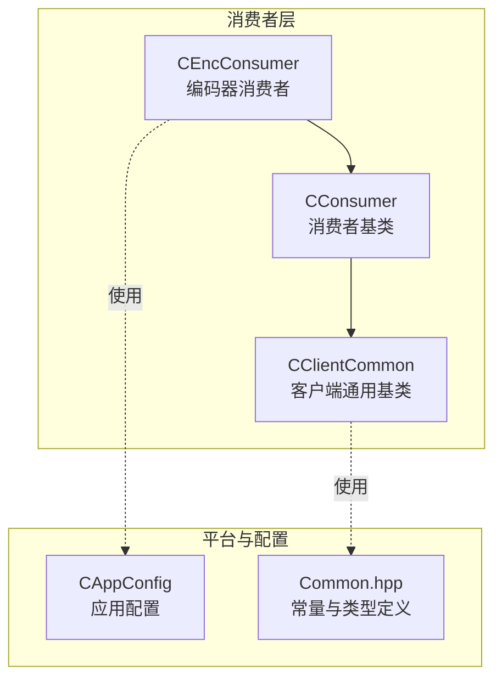
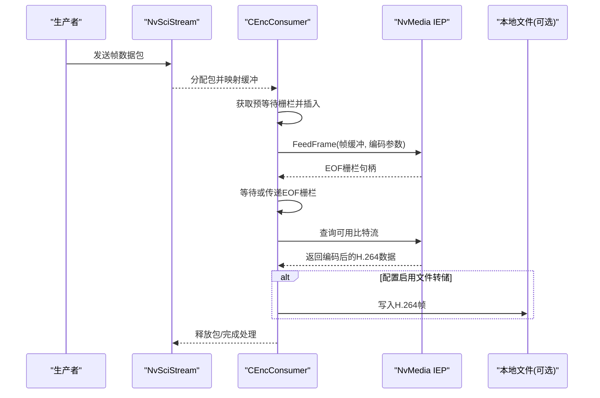
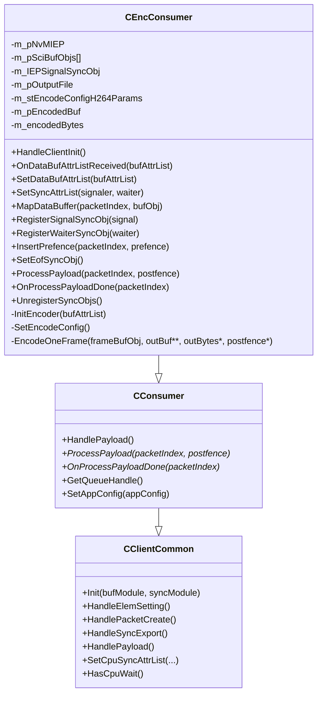
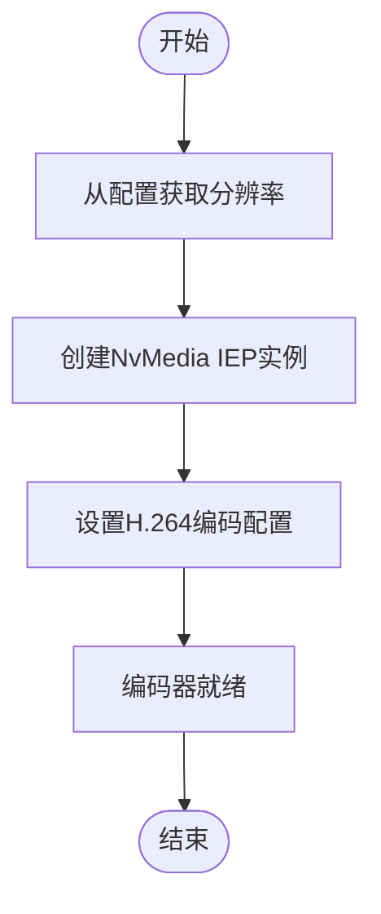
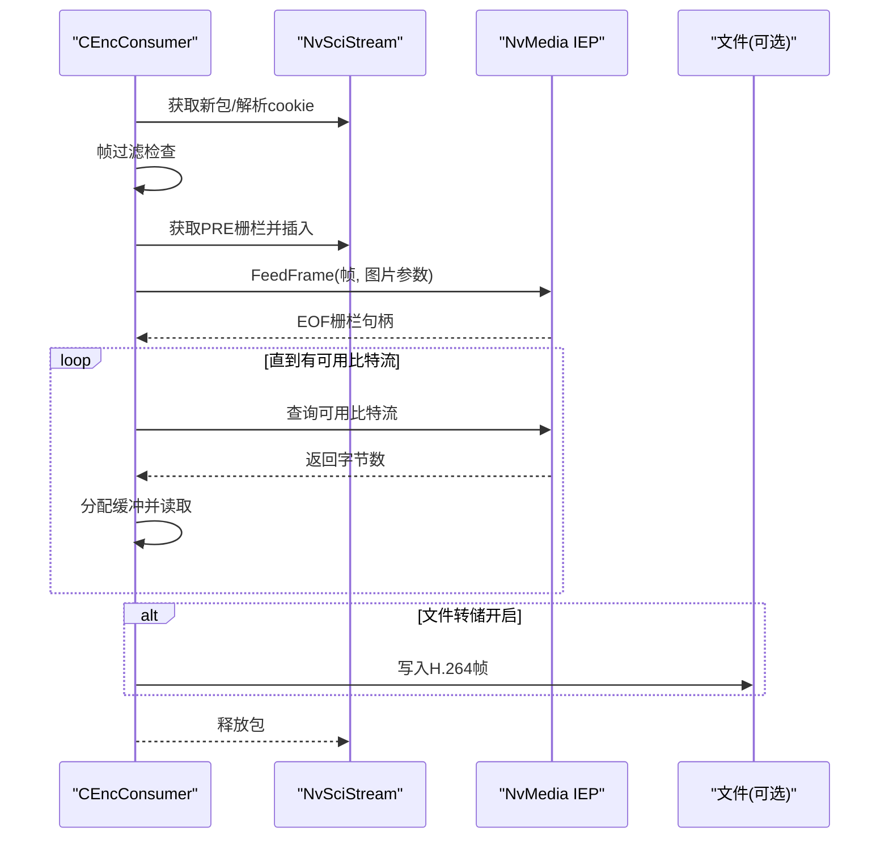
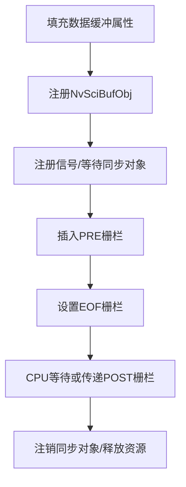
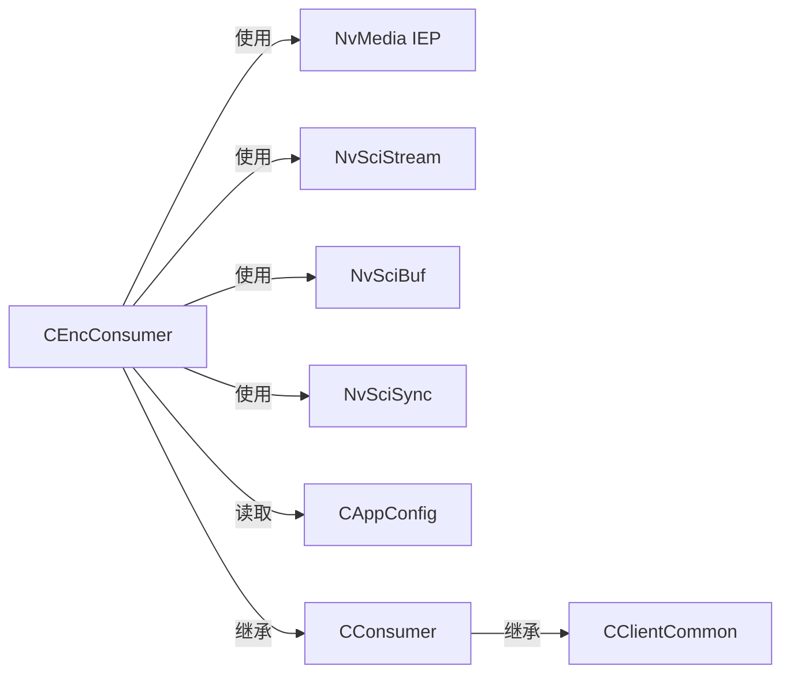

# 编码器消费者

<cite>
**本文引用的文件**
- [CEncConsumer.hpp](file://CEncConsumer.hpp)
- [CEncConsumer.cpp](file://CEncConsumer.cpp)
- [CConsumer.hpp](file://CConsumer.hpp)
- [CConsumer.cpp](file://CConsumer.cpp)
- [CClientCommon.hpp](file://CClientCommon.hpp)
- [CClientCommon.cpp](file://CClientCommon.cpp)
- [Common.hpp](file://Common.hpp)
- [CAppConfig.hpp](file://CAppConfig.hpp)
- [CAppConfig.cpp](file://CAppConfig.cpp)
</cite>

## 目录
1. [简介](#简介)
2. [项目结构](#项目结构)
3. [核心组件](#核心组件)
4. [架构总览](#架构总览)
5. [详细组件分析](#详细组件分析)
6. [依赖关系分析](#依赖关系分析)
7. [性能考量](#性能考量)
8. [故障排查指南](#故障排查指南)
9. [结论](#结论)
10. [附录](#附录)

## 简介
本文件面向“编码器消费者”CEncConsumer，系统性阐述其如何将视频流从输入缓冲转换为压缩编码输出（H.264），覆盖编码器配置参数、编码格式选择与质量设置、编码流程（帧接收、预处理、编码压缩、输出管理）、状态与同步管理、缓冲区与内存管理、错误恢复机制，并给出在不同场景下（带宽限制、延迟要求、质量优先）的参数优化建议及性能监控与故障诊断方法。文档同时提供多类可视化图示，帮助读者快速把握代码结构与数据流。

## 项目结构
CEncConsumer位于multicast目录中，作为消费者之一，负责对接NvMedia IEP（图像编码引擎）进行H.264编码。其直接基类为CConsumer，后者继承自CClientCommon，后者统一处理NvSciBuf/NvSciSync的初始化、元素导入、包创建、同步对象导出与等待等通用逻辑。

图表来源
- [CEncConsumer.hpp:17-64](file://CEncConsumer.hpp#L17-L64)
- [CConsumer.hpp:16-44](file://CConsumer.hpp#L16-L44)
- [CClientCommon.hpp:47-202](file://CClientCommon.hpp#L47-L202)
- [CAppConfig.hpp:19-83](file://CAppConfig.hpp#L19-L83)
- [Common.hpp:14-87](file://Common.hpp#L14-L87)

章节来源
- [CEncConsumer.hpp:17-64](file://CEncConsumer.hpp#L17-L64)
- [CConsumer.hpp:16-44](file://CConsumer.hpp#L16-L44)
- [CClientCommon.hpp:47-202](file://CClientCommon.hpp#L47-L202)
- [CAppConfig.hpp:19-83](file://CAppConfig.hpp#L19-L83)
- [Common.hpp:14-87](file://Common.hpp#L14-L87)

## 核心组件
- CEncConsumer：实现编码器消费者，负责初始化NvMedia IEP、设置编码参数、接收帧、调用编码、收集比特流、可选写入本地文件。
- CConsumer：消费者基类，封装通用的包获取、预等待、后置同步、释放等流程。
- CClientCommon：客户端通用框架，负责NvSciBuf/NvSciSync属性协商、包创建、信号/等待对象导出与注册、CPU等待上下文等。
- CAppConfig：应用配置，提供分辨率、帧率、帧过滤、文件转储开关等运行时参数。
- Common：全局常量与枚举，如最大包数、帧号范围、超时等。

章节来源
- [CEncConsumer.hpp:17-64](file://CEncConsumer.hpp#L17-L64)
- [CConsumer.hpp:16-44](file://CConsumer.hpp#L16-L44)
- [CClientCommon.hpp:47-202](file://CClientCommon.hpp#L47-L202)
- [CAppConfig.hpp:19-83](file://CAppConfig.hpp#L19-L83)
- [Common.hpp:14-87](file://Common.hpp#L14-L87)

## 架构总览
CEncConsumer通过NvSciStream接收来自生产者的帧数据包，使用NvMedia IEP进行H.264编码，编码完成后根据配置决定是否写入本地文件。同步方面，利用NvSciSync Fence机制在编码前后插入/等待同步栅栏，确保数据一致性与顺序。

图表来源
- [CConsumer.cpp:17-94](file://CConsumer.cpp#L17-L94)
- [CEncConsumer.cpp:309-317](file://CEncConsumer.cpp#L309-L317)
- [CEncConsumer.cpp:230-306](file://CEncConsumer.cpp#L230-L306)
- [CEncConsumer.cpp:319-345](file://CEncConsumer.cpp#L319-L345)

## 详细组件分析

### CEncConsumer 类与职责
- 继承关系：CEncConsumer -> CConsumer -> CClientCommon
- 主要职责：
  - 初始化编码器：根据配置获取分辨率，创建NvMedia IEP实例，设置编码参数。
  - 处理单帧编码：接收包索引对应的NvSciBufObj，调用IEP编码，收集比特流。
  - 输出管理：可选将编码后的H.264帧写入本地文件。
  - 同步管理：注册/插入/等待/注销NvSciSync对象，确保编码顺序与一致性。

图表来源
- [CClientCommon.hpp:47-202](file://CClientCommon.hpp#L47-L202)
- [CConsumer.hpp:16-44](file://CConsumer.hpp#L16-L44)
- [CEncConsumer.hpp:17-64](file://CEncConsumer.hpp#L17-L64)

章节来源
- [CEncConsumer.hpp:17-64](file://CEncConsumer.hpp#L17-L64)
- [CEncConsumer.cpp:12-15](file://CEncConsumer.cpp#L12-L15)
- [CEncConsumer.cpp:57-92](file://CEncConsumer.cpp#L57-L92)
- [CEncConsumer.cpp:28-55](file://CEncConsumer.cpp#L28-L55)
- [CEncConsumer.cpp:230-306](file://CEncConsumer.cpp#L230-L306)
- [CEncConsumer.cpp:309-317](file://CEncConsumer.cpp#L309-L317)
- [CEncConsumer.cpp:319-345](file://CEncConsumer.cpp#L319-L345)

### 编码器初始化与配置
- 初始化流程：
  - 在首次收到数据缓冲属性列表时创建编码器实例。
  - 从应用配置读取分辨率，设置编码初始化参数（宽高、帧率、参考帧数等）。
  - 创建NvMedia IEP实例并设置H.264编码配置。
- 编码配置要点（H.264）：
  - GOP长度、IDR周期、SPS/PPS重复策略。
  - 自适应变换、B直参考、熵编码模式、编码预设。
  - 码率控制模式（当前为固定Qp）、I/P/B帧Qp值、B帧数量。
  - VUI时间信息标志等。

图表来源
- [CEncConsumer.cpp:57-92](file://CEncConsumer.cpp#L57-L92)
- [CEncConsumer.cpp:28-55](file://CEncConsumer.cpp#L28-L55)
- [CAppConfig.cpp:77-94](file://CAppConfig.cpp#L77-L94)

章节来源
- [CEncConsumer.cpp:57-92](file://CEncConsumer.cpp#L57-L92)
- [CEncConsumer.cpp:28-55](file://CEncConsumer.cpp#L28-L55)
- [CAppConfig.cpp:77-94](file://CAppConfig.cpp#L77-L94)

### 帧接收与编码流程
- 帧接收：
  - 消费者从NvSciStream获取新包，解析cookie得到包索引。
  - 若帧过滤条件不满足则直接释放包；否则进入处理。
- 预处理：
  - 从包中获取等待栅栏（PRE），插入到IEP中以保证写入完成后再编码。
  - 设置EOF栅栏对象，用于编码完成后通知。
- 编码压缩：
  - 调用IEP喂入帧，设置图片类型（首帧IDR，其余自动选择），输出SPS/PPS。
  - 循环查询可用比特流，分配缓冲并读取编码结果。
- 输出管理：
  - 可选将编码后的H.264帧写入本地文件。
  - 清理临时缓冲与计数。

图表来源
- [CConsumer.cpp:17-94](file://CConsumer.cpp#L17-L94)
- [CEncConsumer.cpp:230-306](file://CEncConsumer.cpp#L230-L306)
- [CEncConsumer.cpp:309-317](file://CEncConsumer.cpp#L309-L317)
- [CEncConsumer.cpp:319-345](file://CEncConsumer.cpp#L319-L345)

章节来源
- [CConsumer.cpp:17-94](file://CConsumer.cpp#L17-L94)
- [CEncConsumer.cpp:230-306](file://CEncConsumer.cpp#L230-L306)
- [CEncConsumer.cpp:309-317](file://CEncConsumer.cpp#L309-L317)
- [CEncConsumer.cpp:319-345](file://CEncConsumer.cpp#L319-L345)

### 缓冲区与同步管理
- 数据缓冲属性：
  - 通过NvMedia IEP填充并设置缓冲属性（访问权限、类型、CPU访问等）。
- 同步对象：
  - 注册信号/等待对象，插入PRE栅栏，设置EOF栅栏，CPU等待或通过NvSciStream传递POST栅栏。
- 生命周期：
  - 析构时注销所有已注册的同步对象，释放VUI参数内存，关闭输出文件。

图表来源
- [CEncConsumer.cpp:117-140](file://CEncConsumer.cpp#L117-L140)
- [CEncConsumer.cpp:143-156](file://CEncConsumer.cpp#L143-L156)
- [CEncConsumer.cpp:158-168](file://CEncConsumer.cpp#L158-L168)
- [CEncConsumer.cpp:170-189](file://CEncConsumer.cpp#L170-L189)
- [CEncConsumer.cpp:210-228](file://CEncConsumer.cpp#L210-L228)
- [CEncConsumer.cpp:191-208](file://CEncConsumer.cpp#L191-L208)
- [CEncConsumer.cpp:94-114](file://CEncConsumer.cpp#L94-L114)

章节来源
- [CEncConsumer.cpp:117-140](file://CEncConsumer.cpp#L117-L140)
- [CEncConsumer.cpp:143-156](file://CEncConsumer.cpp#L143-L156)
- [CEncConsumer.cpp:158-168](file://CEncConsumer.cpp#L158-L168)
- [CEncConsumer.cpp:170-189](file://CEncConsumer.cpp#L170-L189)
- [CEncConsumer.cpp:210-228](file://CEncConsumer.cpp#L210-L228)
- [CEncConsumer.cpp:191-208](file://CEncConsumer.cpp#L191-L208)
- [CEncConsumer.cpp:94-114](file://CEncConsumer.cpp#L94-L114)

### 错误处理与恢复机制
- 错误路径：
  - 属性填充失败、缓冲对象注册失败、IEP创建/配置失败、比特流查询异常、内存不足、字节计数不匹配等。
- 恢复策略：
  - 对于可重试的NvSci/NvMedia状态，返回错误状态；对于关键资源（如输出文件、VUI参数）在析构中清理。
  - 在处理流程中遇到错误时，及时清理临时分配的内存并返回错误码，避免悬挂状态。

章节来源
- [CEncConsumer.cpp:26-26](file://CEncConsumer.cpp#L26-L26)
- [CEncConsumer.cpp:267-269](file://CEncConsumer.cpp#L267-L269)
- [CEncConsumer.cpp:275-279](file://CEncConsumer.cpp#L275-L279)
- [CEncConsumer.cpp:281-285](file://CEncConsumer.cpp#L281-L285)
- [CEncConsumer.cpp:94-114](file://CEncConsumer.cpp#L94-L114)

## 依赖关系分析
- 组件耦合：
  - CEncConsumer强依赖NvMedia IEP与NvSciBuf/NvSciSync生态；弱依赖CAppConfig提供分辨率与运行参数。
  - CConsumer与CClientCommon提供统一的包处理与同步框架，降低各消费者实现复杂度。
- 外部接口契约：
  - NvMedia IEP接口：创建/配置/喂帧/查询比特流/栅栏操作。
  - NvSciStream接口：包获取/释放、栅栏获取/设置、元素属性获取。
- 潜在循环依赖：
  - 无直接循环依赖；通过抽象接口（虚函数）解耦具体实现。

图表来源
- [CEncConsumer.cpp:83-88](file://CEncConsumer.cpp#L83-L88)
- [CEncConsumer.cpp:119](file://CEncConsumer.cpp#L119)
- [CConsumer.cpp:23-28](file://CConsumer.cpp#L23-L28)
- [CClientCommon.cpp:367-408](file://CClientCommon.cpp#L367-L408)

章节来源
- [CEncConsumer.cpp:83-88](file://CEncConsumer.cpp#L83-L88)
- [CEncConsumer.cpp:119](file://CEncConsumer.cpp#L119)
- [CConsumer.cpp:23-28](file://CConsumer.cpp#L23-L28)
- [CClientCommon.cpp:367-408](file://CClientCommon.cpp#L367-L408)

## 性能考量
- 编码参数权衡：
  - GOP长度与IDR周期影响随机访问与GOP内错误传播；较长GOP有利于提高压缩效率但增加解码延迟。
  - 固定Qp适合稳定画质场景；若需动态调整码率，可考虑切换为CBR/VBR模式（当前代码采用固定Qp）。
  - B帧数量为0，减少解码复杂度与延迟，适合实时性要求高的场景。
- 帧率与分辨率：
  - 编码初始化参数中的帧率与分辨率直接影响吞吐与带宽占用；应与采集端一致以避免额外缩放开销。
- 缓冲与内存：
  - 每次编码分配临时比特流缓冲，注意及时释放；在高分辨率/高帧率下需评估峰值内存占用。
- 同步与等待：
  - CPU等待模式可简化同步但可能引入额外等待；非CPU等待模式通过NvSciStream传递栅栏更高效。
- 监控建议：
  - 记录每帧编码耗时、比特流大小分布、丢帧率、错误码统计，结合帧号范围进行定位。

[本节为通用性能讨论，无需特定文件引用]

## 故障排查指南
- 常见问题与定位步骤：
  - 编码器创建失败：检查NvMedia IEP创建返回值、缓冲属性列表是否正确、编码初始化参数（宽高、帧率、参考帧数）。
  - 比特流查询异常：确认IEP状态返回码，检查是否存在Pending/NonePending状态未正确处理。
  - 内存不足：关注临时比特流缓冲分配失败路径，必要时降低分辨率或帧率。
  - 文件写入失败：检查文件打开与写入返回值，确认转储帧号范围与文件名。
  - 同步问题：核对PRE/EOF栅栏插入与设置流程，确保CPU等待上下文有效。
- 日志与调试：
  - 利用日志宏记录关键节点（包获取、预等待栅栏、编码、比特流查询、文件写入），配合帧号与字节计数进行问题定位。
  - 可通过帧过滤参数仅处理部分帧，便于快速复现与验证。

章节来源
- [CEncConsumer.cpp:26-26](file://CEncConsumer.cpp#L26-L26)
- [CEncConsumer.cpp:267-269](file://CEncConsumer.cpp#L267-L269)
- [CEncConsumer.cpp:275-279](file://CEncConsumer.cpp#L275-L279)
- [CEncConsumer.cpp:281-285](file://CEncConsumer.cpp#L281-L285)
- [CEncConsumer.cpp:324-334](file://CEncConsumer.cpp#L324-L334)
- [CConsumer.cpp:17-94](file://CConsumer.cpp#L17-L94)

## 结论
CEncConsumer通过标准化的消费者框架与NvMedia IEP紧密集成，实现了从原始帧到H.264压缩输出的完整链路。其设计强调同步一致性、缓冲管理与错误处理，适用于需要本地转储或进一步网络传输的场景。针对不同应用需求，可通过调整GOP、IDR周期、码率控制模式与B帧策略，在质量、延迟与带宽之间取得平衡。

[本节为总结性内容，无需特定文件引用]

## 附录

### 编码参数与质量设置要点
- GOP与IDR：影响随机访问与错误传播，需结合播放器与网络特性权衡。
- 码率控制：当前采用固定Qp，适合稳定画质；若需动态带宽适配，可切换为CBR/VBR。
- B帧：当前禁用，降低解码复杂度与延迟；若带宽充足且对延迟不敏感，可适度启用。
- 参考帧数：当前为1，兼顾延迟与压缩效率；更高参考帧数可提升压缩比但增加延迟与内存。

章节来源
- [CEncConsumer.cpp:28-55](file://CEncConsumer.cpp#L28-L55)
- [CEncConsumer.cpp:57-92](file://CEncConsumer.cpp#L57-L92)

### 应用场景下的参数优化建议
- 带宽受限：
  - 降低分辨率或帧率；启用CBR并下调目标码率；适当启用B帧以提升压缩比。
- 低延迟优先：
  - 减小GOP；禁用B帧；使用固定Qp；缩短IDR周期以改善随机访问。
- 质量优先：
  - 提升分辨率/帧率；启用CBR并提高目标码率；适度启用B帧；优化编码预设。

[本节为通用建议，无需特定文件引用]