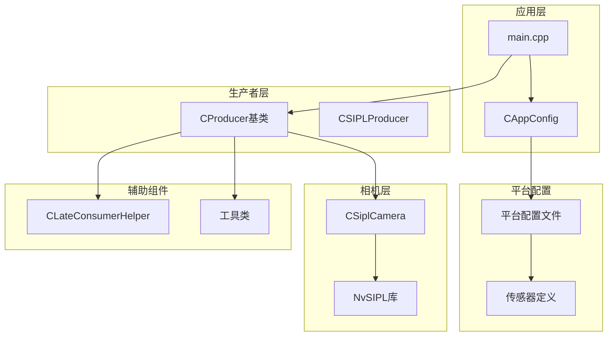
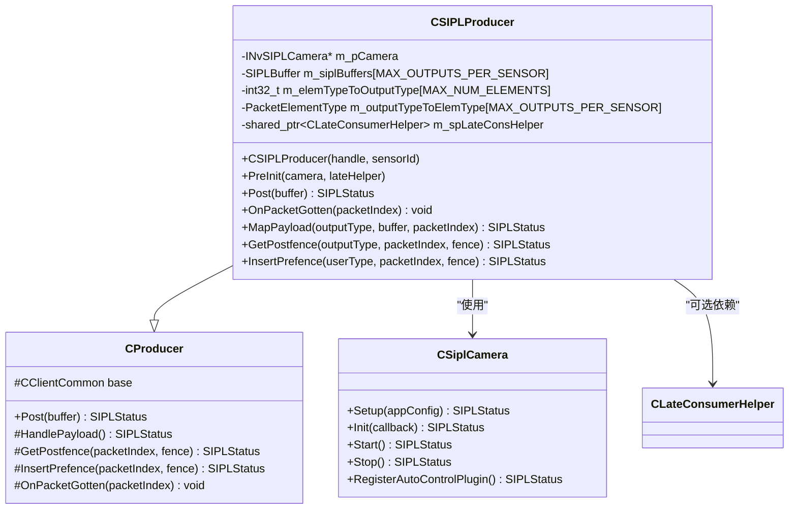
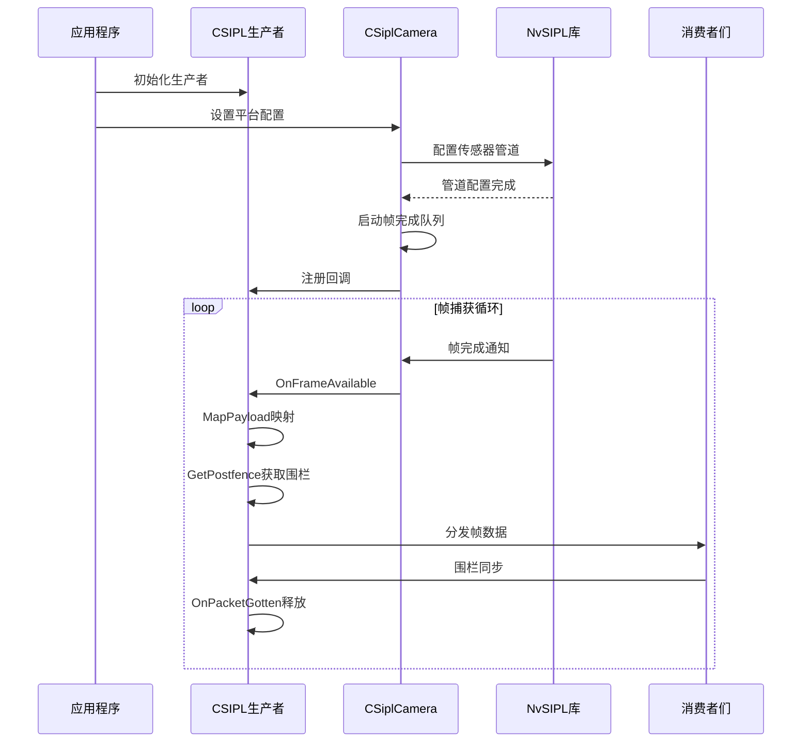
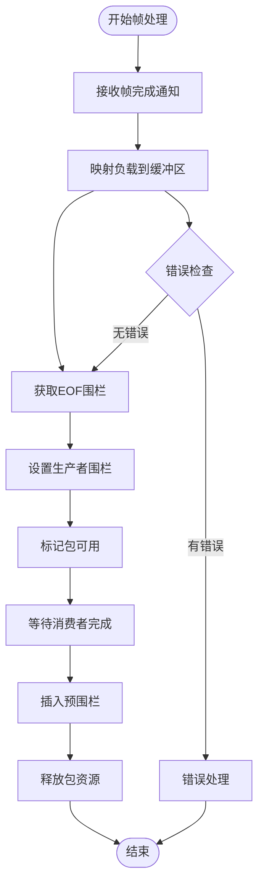
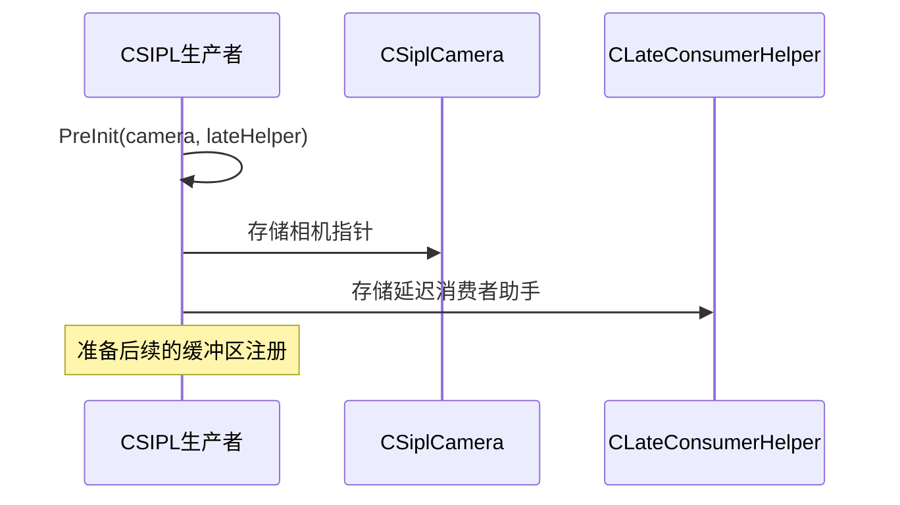
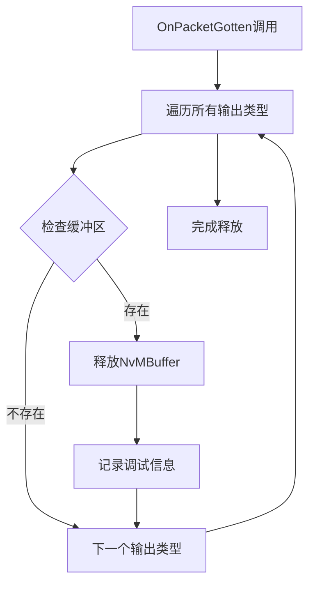
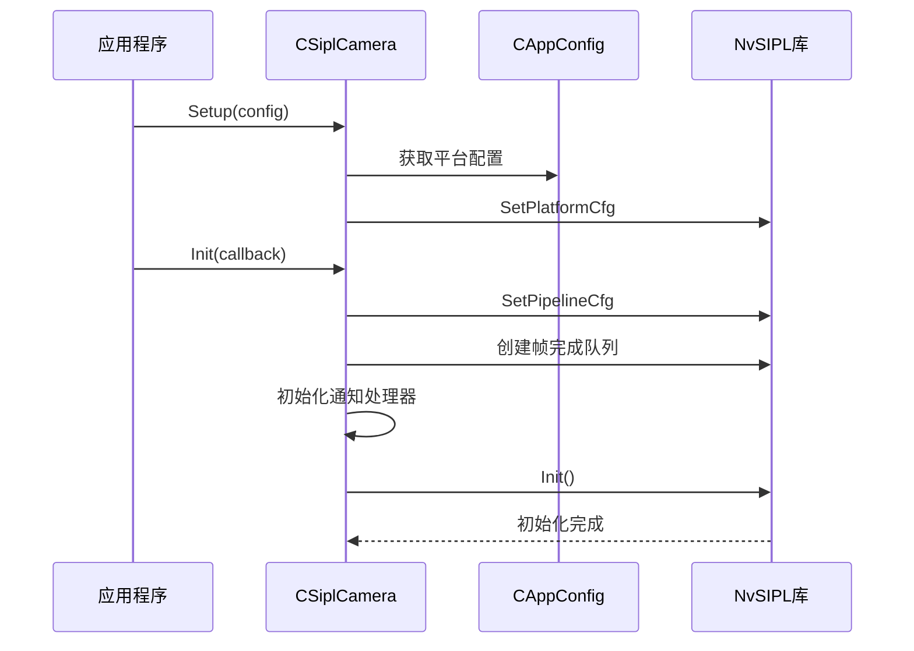
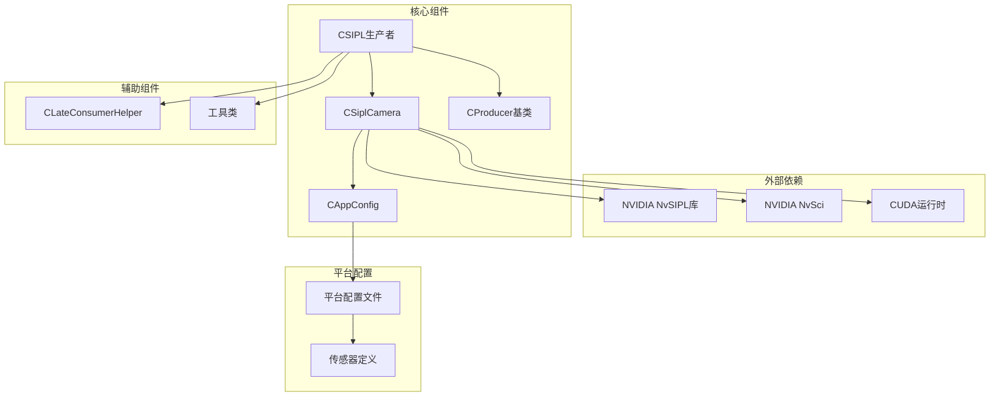

# SIPL生产者实现

<cite>
**本文档引用的文件**
- [CSIPLProducer.hpp](file://CSIPLProducer.hpp)
- [CSIPLProducer.cpp](file://CSIPLProducer.cpp)
- [CSiplCamera.hpp](file://CSiplCamera.hpp)
- [CSiplCamera.cpp](file://CSiplCamera.cpp)
- [CProducer.hpp](file://CProducer.hpp)
- [CProducer.cpp](file://CProducer.cpp)
- [CAppConfig.hpp](file://CAppConfig.hpp)
- [CAppConfig.cpp](file://CAppConfig.cpp)
- [CLateConsumerHelper.hpp](file://CLateConsumerHelper.hpp)
- [CLateConsumerHelper.cpp](file://CLateConsumerHelper.cpp)
- [ar0820.hpp](file://platform/ar0820.hpp)
- [imx623vb2.hpp](file://platform/imx623vb2.hpp)
- [imx728vb2.hpp](file://platform/imx728vb2.hpp)
- [max96712_tpg_yuv.hpp](file://platform/max96712_tpg_yuv.hpp)
- [isx031.hpp](file://platform/isx031.hpp)
</cite>

## 目录
1. [简介](#简介)
2. [项目结构](#项目结构)
3. [核心组件](#核心组件)
4. [架构概览](#架构概览)
5. [详细组件分析](#详细组件分析)
6. [依赖关系分析](#依赖关系分析)
7. [性能考虑](#性能考虑)
8. [故障排除指南](#故障排除指南)
9. [结论](#结论)

## 简介

CSIPL生产者(CSIPLProducer)是NVIDIA NvSIPL库在多播系统中的关键组件，负责从摄像头传感器获取视频流并将其传输到多个消费者。该实现深度集成了NVIDIA的NvSIPL库，提供了高性能的视频流处理能力。

本技术文档深入解析CSIPL生产者的实现细节，包括与CSiplCamera的协作关系、传感器初始化流程、帧捕获机制，以及SIPL生产者的特殊处理机制，如OnPacketGotten虚函数、MapPayload映射负载方法、GetPostfence和InsertPrefence围栏同步机制。

## 项目结构

multicast项目采用模块化设计，主要包含以下核心模块：

**图表来源**
- [CSIPLProducer.hpp:18-81](file://CSIPLProducer.hpp#L18-L81)
- [CSiplCamera.hpp:46-85](file://CSiplCamera.hpp#L46-L85)
- [CProducer.hpp:16-51](file://CProducer.hpp#L16-L51)

**章节来源**
- [CSIPLProducer.hpp:1-84](file://CSIPLProducer.hpp#L1-L84)
- [CSiplCamera.hpp:1-621](file://CSiplCamera.hpp#L1-L621)
- [CProducer.hpp:1-53](file://CProducer.hpp#L1-L53)

## 核心组件

### CSIPL生产者架构

CSIPL生产者继承自CProducer基类，专门处理NVIDIA NvSIPL摄像头的数据流。其核心特性包括：

- **多输出类型支持**：支持ISP0、ISP1、ICP等多种输出类型
- **智能缓冲区管理**：动态管理NvSciBuf对象和NvMBuffer对象
- **围栏同步机制**：实现复杂的生产者-消费者同步
- **延迟消费者支持**：通过CLateConsumerHelper支持动态消费者附加

### 关键数据结构

**图表来源**
- [CSIPLProducer.hpp:18-81](file://CSIPLProducer.hpp#L18-L81)
- [CProducer.hpp:16-51](file://CProducer.hpp#L16-L51)
- [CSiplCamera.hpp:46-85](file://CSiplCamera.hpp#L46-L85)

**章节来源**
- [CSIPLProducer.hpp:58-81](file://CSIPLProducer.hpp#L58-L81)
- [CSIPLProducer.cpp:16-34](file://CSIPLProducer.cpp#L16-L34)

## 架构概览

### 系统架构图

**图表来源**
- [CSIPLProducer.cpp:300-308](file://CSIPLProducer.cpp#L300-L308)
- [CSiplCamera.cpp:523-605](file://CSiplCamera.cpp#L523-L605)

### 数据流处理流程

**图表来源**
- [CSIPLProducer.cpp:367-404](file://CSIPLProducer.cpp#L367-L404)
- [CProducer.cpp:56-121](file://CProducer.cpp#L56-L121)

## 详细组件分析

### CSIPL生产者核心实现

#### 构造函数和生命周期管理

CSIPL生产者通过构造函数接受NvSciStreamBlock句柄和传感器ID，初始化基础状态并准备与CSiplCamera协作。

**章节来源**
- [CSIPLProducer.cpp:16-34](file://CSIPLProducer.cpp#L16-L34)

#### 预初始化流程

**图表来源**
- [CSIPLProducer.cpp:36-40](file://CSIPLProducer.cpp#L36-L40)

#### 元素类型到输出类型的映射

CSIPL生产者维护一个映射表，将抽象的PacketElementType映射到具体的NvSIPL输出类型：

- ELEMENT_TYPE_NV12_BL → ISP0 (块线性NV12)
- ELEMENT_TYPE_NV12_PL → ISP1 (平面线性NV12)  
- ELEMENT_TYPE_ICP_RAW → ICP (原始数据)

**章节来源**
- [CSIPLProducer.cpp:54-61](file://CSIPLProducer.cpp#L54-L61)

### 帧捕获和处理机制

#### OnPacketGotten虚函数实现

OnPacketGotten是CSIPL生产者特有的虚函数实现，负责在帧被所有消费者处理完成后释放相关的NvMBuffer资源：

**图表来源**
- [CSIPLProducer.cpp:300-308](file://CSIPLProducer.cpp#L300-L308)

#### MapPayload映射负载方法

MapPayload方法将来自NvSIPL的缓冲区映射到内部管理的数据结构中：

**章节来源**
- [CSIPLProducer.cpp:326-346](file://CSIPLProducer.cpp#L326-L346)

### 围栏同步机制

#### GetPostfence围栏获取

GetPostfence方法从特定输出类型的NvMBuffer中获取EOF围栏，用于通知消费者帧处理完成：

**章节来源**
- [CSIPLProducer.cpp:289-298](file://CSIPLProducer.cpp#L289-L298)

#### InsertPrefence预围栏插入

InsertPrefence方法将预围栏插入到指定的NvMBuffer中，实现生产者对消费者的同步控制：

**章节来源**
- [CSIPLProducer.cpp:272-287](file://CSIPLProducer.cpp#L272-L287)

### 与CSiplCamera的协作关系

#### 相机初始化流程

CSiplCamera负责整个相机系统的初始化，包括平台配置、管道设置和事件处理：

**图表来源**
- [CSiplCamera.cpp:137-287](file://CSiplCamera.cpp#L137-L287)

#### 多传感器支持

系统支持多个传感器模块，每个设备块可以包含多个相机模块：

**章节来源**
- [CSiplCamera.cpp:222-267](file://CSiplCamera.cpp#L222-L267)

### 传感器配置和参数设置

#### 平台配置管理

CAppConfig类管理所有平台相关的配置信息，包括传感器类型、分辨率和接口模式：

**章节来源**
- [CAppConfig.cpp:21-75](file://CAppConfig.cpp#L21-L75)

#### 支持的传感器类型

系统支持多种传感器配置，每种都有特定的平台配置：

| 传感器类型 | 平台名称 | 分辨率 | 接口模式 |
|-----------|----------|--------|----------|
| AR0820 | F008A120RM0AV2_CPHY_x4 | 3848×2168 | C-PHY 4-lane |
| IMX623 | V1SIM623S4RU5195NB3_CPHY_x4 | 1920×1536 | C-PHY 4-lane |
| IMX728 | V1SIM728S1RU3120NB20_CPHY_x4 | 3840×2160 | C-PHY 4-lane |
| MAX96712 TPG | MAX96712_YUV_8_TPG_CPHY_x4 | 1920×1236 | C-PHY 4-lane |
| ISX031 | ISX031_YUYV_CPHY_x4 | 1920×1536 | C-PHY 4-lane |

**章节来源**
- [ar0820.hpp:14-183](file://platform/ar0820.hpp#L14-L183)
- [imx623vb2.hpp:14-163](file://platform/imx623vb2.hpp#L14-L163)
- [imx728vb2.hpp:14-161](file://platform/imx728vb2.hpp#L14-L161)
- [max96712_tpg_yuv.hpp:14-125](file://platform/max96712_tpg_yuv.hpp#L14-L125)
- [isx031.hpp:14-117](file://platform/isx031.hpp#L14-L117)

### 错误处理策略

#### 设备块通知处理

CSiplCamera实现了完整的错误处理机制，包括：

- **Deserializer错误处理**：处理解串器故障
- **Serializer错误处理**：处理串行器故障  
- **传感器错误处理**：处理传感器相关问题
- **GPIO中断处理**：区分真实中断和功能故障

**章节来源**
- [CSiplCamera.hpp:87-355](file://CSiplCamera.hpp#L87-L355)

#### 帧完成队列处理

CPipelineFrameQueueHandler负责监控各个输出类型的帧完成情况：

**章节来源**
- [CSiplCamera.cpp:523-605](file://CSiplCamera.cpp#L523-L605)

## 依赖关系分析

### 组件依赖图

**图表来源**
- [CSIPLProducer.hpp:12-16](file://CSIPLProducer.hpp#L12-L16)
- [CSiplCamera.hpp:18-30](file://CSiplCamera.hpp#L18-L30)

### 耦合度和内聚性分析

CSIPL生产者实现了良好的模块化设计：

- **高内聚**：专注于视频流处理和同步机制
- **低耦合**：通过接口与CSiplCamera交互
- **清晰的职责分离**：CProducer处理通用生产者逻辑，CSIPLProducer处理NvSIPL特定逻辑

**章节来源**
- [CSIPLProducer.hpp:18-81](file://CSIPLProducer.hpp#L18-L81)
- [CProducer.hpp:16-51](file://CProducer.hpp#L16-L51)

## 性能考虑

### 缓冲区管理优化

CSIPL生产者采用了高效的缓冲区管理模式：

- **双缓冲机制**：同时管理NvSciBufObj和NvMBuffer对象
- **智能释放策略**：在OnPacketGotten中统一释放资源
- **内存池优化**：复用缓冲区对象减少分配开销

### 并发处理机制

系统通过以下机制实现高效的并发处理：

- **多线程架构**：每个设备块和传感器都有独立的处理线程
- **异步事件处理**：使用通知队列处理相机事件
- **非阻塞操作**：帧完成队列使用超时机制避免死锁

## 故障排除指南

### 常见问题诊断

#### 相机初始化失败

可能的原因和解决方案：

1. **平台配置不匹配**
   - 检查CAppConfig中的平台配置
   - 验证传感器类型是否正确

2. **NvSIPL版本不兼容**
   - 确认NvSIPL库版本与头文件版本一致
   - 检查库文件路径配置

#### 帧捕获异常

1. **帧完成队列超时**
   - 检查传感器连接状态
   - 验证CSI接口配置

2. **缓冲区映射失败**
   - 确认NvSciBuf对象有效性
   - 检查内存访问权限设置

**章节来源**
- [CSiplCamera.cpp:325-361](file://CSiplCamera.cpp#L325-L361)

### 调试技巧

- **启用详细日志**：使用PLOG_DBG宏输出详细调试信息
- **监控资源使用**：跟踪缓冲区分配和释放
- **验证同步机制**：检查围栏状态和事件处理

## 结论

CSIPL生产者实现了NVIDIA NvSIPL库与多播系统的无缝集成，提供了高效、可靠的视频流处理能力。其设计特点包括：

1. **模块化架构**：清晰的职责分离和接口设计
2. **高性能实现**：优化的缓冲区管理和并发处理机制
3. **完善的错误处理**：全面的错误检测和恢复策略
4. **灵活的配置支持**：支持多种传感器类型和平台配置

该实现为基于NVIDIA硬件平台的视频处理应用提供了坚实的基础，能够满足高性能、低延迟的视频流处理需求。