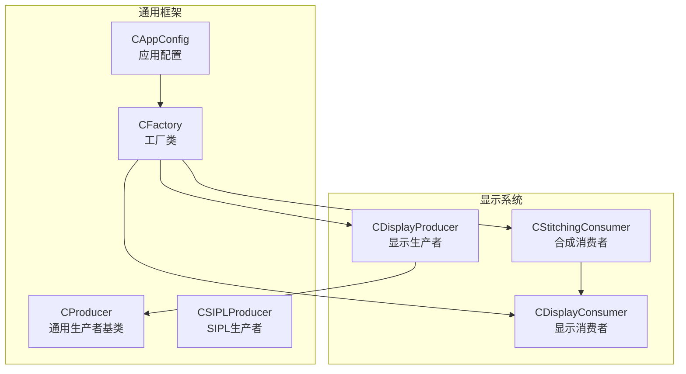
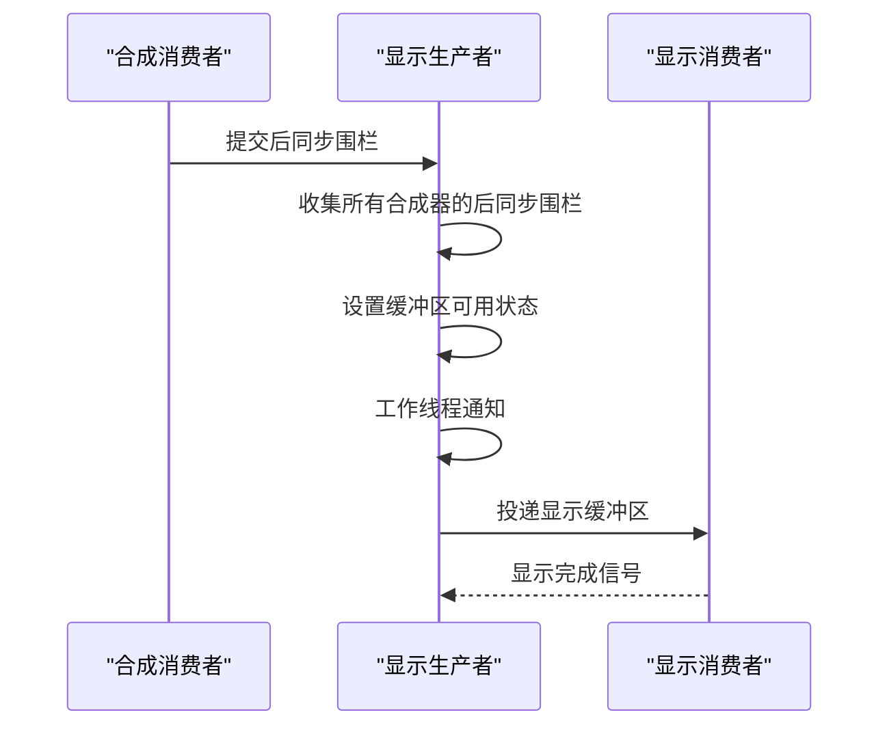
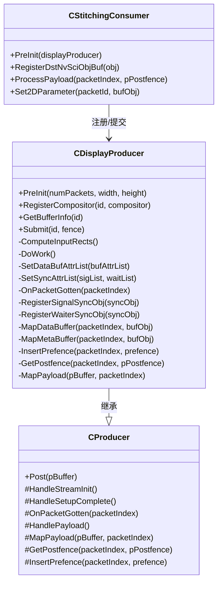
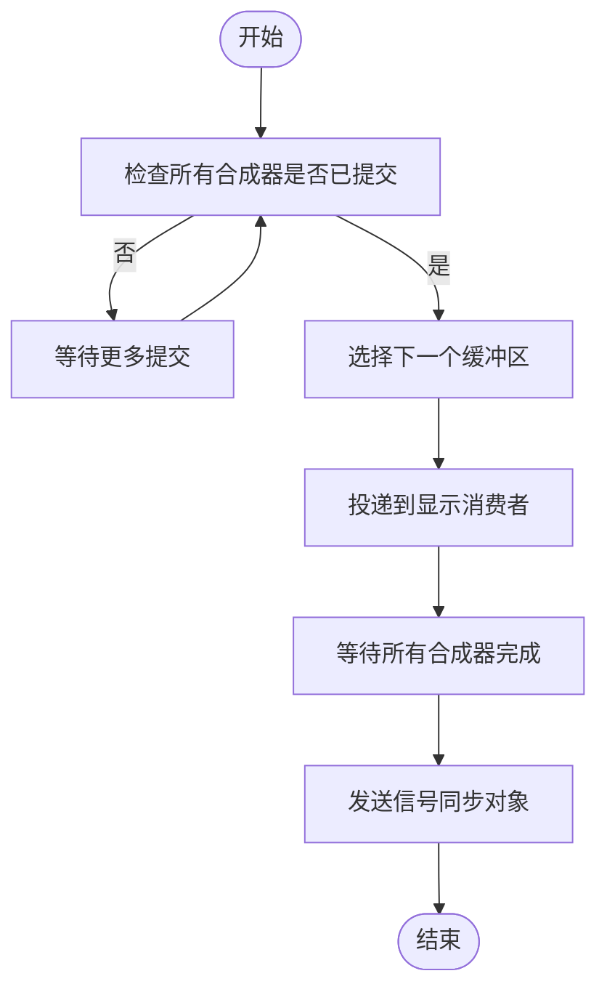
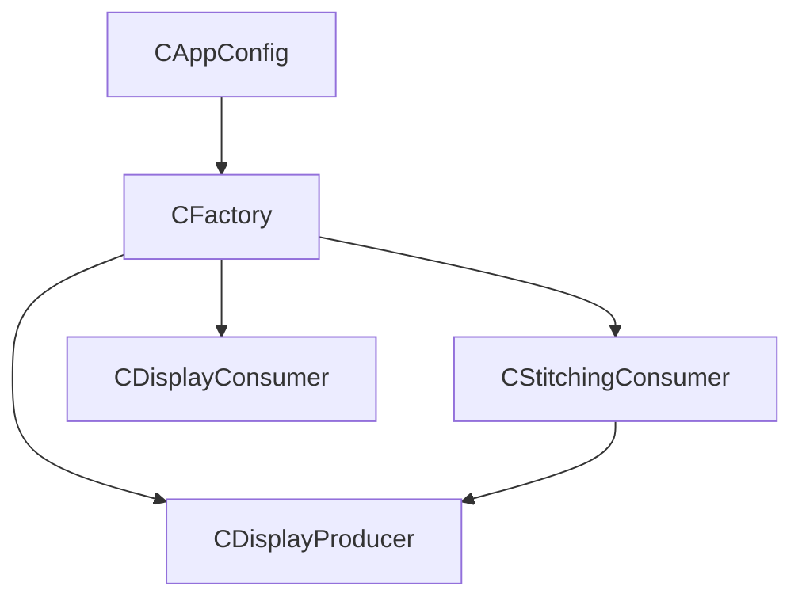

# 显示生产者实现

<cite>
**本文档引用的文件**
- [CDisplayProducer.hpp](file://CDisplayProducer.hpp)
- [CDisplayProducer.cpp](file://CDisplayProducer.cpp)
- [CProducer.hpp](file://CProducer.hpp)
- [CSIPLProducer.hpp](file://CSIPLProducer.hpp)
- [CStitchingConsumer.hpp](file://CStitchingConsumer.hpp)
- [CStitchingConsumer.cpp](file://CStitchingConsumer.cpp)
- [CDisplayConsumer.hpp](file://CDisplayConsumer.hpp)
- [CFactory.hpp](file://CFactory.hpp)
- [Common.hpp](file://Common.hpp)
- [CAppConfig.hpp](file://CAppConfig.hpp)
- [CAppConfig.cpp](file://CAppConfig.cpp)
- [main.cpp](file://main.cpp)
</cite>

## 目录
1. [简介](#简介)
2. [项目结构](#项目结构)
3. [核心组件](#核心组件)
4. [架构概览](#架构概览)
5. [详细组件分析](#详细组件分析)
6. [依赖关系分析](#依赖关系分析)
7. [性能考虑](#性能考虑)
8. [故障排除指南](#故障排除指南)
9. [结论](#结论)
10. [附录](#附录)

## 简介
本文件详细阐述了显示生产者（CDisplayProducer）的设计与实现，重点说明其在显示系统中的专用职责与工作机制。CDisplayProducer继承自通用生产者基类，针对显示输出场景进行了专门优化，包括显示缓冲区管理、显示格式转换、显示同步机制以及多显示器/多窗口场景下的布局管理。与普通SIPL生产者相比，CDisplayProducer专注于将合成后的图像数据直接投递到显示消费者，并通过NvSciSync进行跨组件同步。

## 项目结构
该模块位于multicast目录下，核心文件包括：
- 显示生产者定义与实现：CDisplayProducer.hpp、CDisplayProducer.cpp
- 通用生产者基类：CProducer.hpp
- 普通SIPL生产者：CSIPLProducer.hpp
- 显示合成消费者：CStitchingConsumer.hpp、CStitchingConsumer.cpp
- 显示消费者：CDisplayConsumer.hpp
- 工厂类：CFactory.hpp
- 公共常量与类型：Common.hpp
- 应用配置：CAppConfig.hpp、CAppConfig.cpp
- 主程序入口：main.cpp

**图表来源**
- [CDisplayProducer.hpp:18-126](file://CDisplayProducer.hpp#L18-L126)
- [CProducer.hpp:16-51](file://CProducer.hpp#L16-L51)
- [CSIPLProducer.hpp:18-81](file://CSIPLProducer.hpp#L18-L81)
- [CStitchingConsumer.hpp:17-73](file://CStitchingConsumer.hpp#L17-L73)
- [CDisplayConsumer.hpp:15-48](file://CDisplayConsumer.hpp#L15-L48)
- [CFactory.hpp:27-92](file://CFactory.hpp#L27-L92)
- [CAppConfig.hpp:19-82](file://CAppConfig.hpp#L19-L82)

**章节来源**
- [CDisplayProducer.hpp:1-128](file://CDisplayProducer.hpp#L1-L128)
- [CDisplayProducer.cpp:1-383](file://CDisplayProducer.cpp#L1-L383)
- [CProducer.hpp:1-53](file://CProducer.hpp#L1-L53)
- [CSIPLProducer.hpp:1-84](file://CSIPLProducer.hpp#L1-L84)
- [CStitchingConsumer.hpp:1-74](file://CStitchingConsumer.hpp#L1-L74)
- [CStitchingConsumer.cpp:1-317](file://CStitchingConsumer.cpp#L1-L317)
- [CDisplayConsumer.hpp:1-49](file://CDisplayConsumer.hpp#L1-L49)
- [CFactory.hpp:1-95](file://CFactory.hpp#L1-L95)
- [Common.hpp:1-87](file://Common.hpp#L1-L87)
- [CAppConfig.hpp:1-83](file://CAppConfig.hpp#L1-L83)
- [CAppConfig.cpp:1-109](file://CAppConfig.cpp#L1-L109)
- [main.cpp:1-304](file://main.cpp#L1-L304)

## 核心组件
- CDisplayProducer：继承自CProducer，负责显示专用的缓冲区管理、预/后同步围栏处理、工作线程调度以及与合成消费者的协作。
- CStitchingConsumer：合成消费者，负责将多个输入源合成到显示缓冲区，生成后同步围栏并提交给显示生产者。
- CDisplayConsumer：显示消费者，接收来自显示生产者的缓冲区并进行最终显示。
- CProducer：通用生产者基类，提供通用的流初始化、包映射、围栏插入与获取等接口。
- CSIPLProducer：普通SIPL生产者，用于非显示场景的数据生产。

**章节来源**
- [CDisplayProducer.hpp:18-126](file://CDisplayProducer.hpp#L18-L126)
- [CStitchingConsumer.hpp:17-73](file://CStitchingConsumer.hpp#L17-L73)
- [CDisplayConsumer.hpp:15-48](file://CDisplayConsumer.hpp#L15-L48)
- [CProducer.hpp:16-51](file://CProducer.hpp#L16-L51)
- [CSIPLProducer.hpp:18-81](file://CSIPLProducer.hpp#L18-L81)

## 架构概览
CDisplayProducer在显示链路中扮演关键角色，连接合成消费者与显示消费者。其核心流程如下：
- 合成消费者完成图像合成后，向显示生产者提交后同步围栏。
- 显示生产者收集所有合成器的后同步围栏，确认完成后通过工作线程将缓冲区投递给显示消费者。
- 显示消费者收到缓冲区后，通过显示系统进行呈现。

**图表来源**
- [CDisplayProducer.cpp:276-313](file://CDisplayProducer.cpp#L276-L313)
- [CStitchingConsumer.cpp:284-295](file://CStitchingConsumer.cpp#L284-L295)
- [CDisplayConsumer.hpp:25-39](file://CDisplayConsumer.hpp#L25-L39)

## 详细组件分析

### 显示生产者类结构
CDisplayProducer继承自CProducer，新增了显示专用的缓冲区信息管理、合成器注册与布局计算、工作线程调度等功能。

**图表来源**
- [CDisplayProducer.hpp:18-126](file://CDisplayProducer.hpp#L18-L126)
- [CProducer.hpp:16-51](file://CProducer.hpp#L16-L51)
- [CStitchingConsumer.hpp:17-73](file://CStitchingConsumer.hpp#L17-L73)

**章节来源**
- [CDisplayProducer.hpp:18-126](file://CDisplayProducer.hpp#L18-L126)
- [CDisplayProducer.cpp:18-383](file://CDisplayProducer.cpp#L18-L383)
- [CProducer.hpp:16-51](file://CProducer.hpp#L16-L51)
- [CStitchingConsumer.hpp:17-73](file://CStitchingConsumer.hpp#L17-L73)

### 缓冲区管理与显示格式
- 缓冲区属性设置：CDisplayProducer为显示输出设置了图像缓冲区的类型、颜色格式、布局等属性，确保与显示系统兼容。
- 颜色格式与标准：采用SRGB标准的ABGR8888平面布局，满足现代显示设备的常见要求。
- 基地址对齐：设置平面基地址对齐以提升GPU访问效率。

**章节来源**
- [CDisplayProducer.cpp:74-117](file://CDisplayProducer.cpp#L74-L117)

### 显示同步机制
- 预围栏与后围栏：合成消费者在处理前插入预围栏，显示生产者在缓冲区就绪时插入后围栏，确保严格的时序控制。
- CPU等待上下文：显示生产者分配CPU等待上下文，等待所有合成器完成后再进行显示投递。
- 信号同步对象：通过NvSciSyncObj进行跨组件的信号传递，协调显示时机。

**章节来源**
- [CDisplayProducer.cpp:119-132](file://CDisplayProducer.cpp#L119-L132)
- [CDisplayProducer.cpp:178-196](file://CDisplayProducer.cpp#L178-L196)
- [CStitchingConsumer.cpp:162-176](file://CStitchingConsumer.cpp#L162-L176)

### 多显示器/多窗口布局管理
- 输入矩形计算：根据合成器数量自动计算每个输入源在目标缓冲区中的位置，支持1x1到4x4网格布局。
- 几何参数设置：合成消费者将源几何参数与目标矩形绑定，确保图像正确缩放与定位。

**章节来源**
- [CDisplayProducer.cpp:247-274](file://CDisplayProducer.cpp#L247-L274)
- [CStitchingConsumer.cpp:298-316](file://CStitchingConsumer.cpp#L298-L316)

### 工作线程与投递流程
- 工作线程：显示生产者启动独立线程，使用条件变量等待可投递的缓冲区。
- 投递策略：当所有合成器都已提交后，工作线程调用Post方法将缓冲区投递给显示消费者。
- 完成信号：投递完成后，通过信号同步对象通知合成消费者继续下一帧。

**图表来源**
- [CDisplayProducer.cpp:276-313](file://CDisplayProducer.cpp#L276-L313)
- [CDisplayProducer.cpp:326-382](file://CDisplayProducer.cpp#L326-L382)

**章节来源**
- [CDisplayProducer.cpp:326-382](file://CDisplayProducer.cpp#L326-L382)

### 与普通SIPL生产者的区别
- 专用缓冲区属性：CDisplayProducer为显示输出定制了缓冲区属性，而CSIPLProducer面向更广泛的SIPL数据类型。
- 同步机制差异：CDisplayProducer使用CPU等待上下文与信号同步对象，CSIPLProducer可能采用不同的等待策略。
- 工作线程：CDisplayProducer维护独立的工作线程进行投递，CSIPLProducer通常由通用框架驱动。

**章节来源**
- [CDisplayProducer.cpp:74-132](file://CDisplayProducer.cpp#L74-L132)
- [CSIPLProducer.hpp:18-81](file://CSIPLProducer.hpp#L18-L81)

### 与显示消费者系统的配合
- 显示消费者接收缓冲区后进行呈现，显示生产者通过Post方法将准备好的缓冲区交给显示消费者。
- 显示生产者在工作线程中等待所有合成器完成，确保显示的完整性与时序性。

**章节来源**
- [CDisplayConsumer.hpp:25-39](file://CDisplayConsumer.hpp#L25-L39)
- [CDisplayProducer.cpp:356-378](file://CDisplayProducer.cpp#L356-L378)

## 依赖关系分析
- 组件耦合：CDisplayProducer与CStitchingConsumer存在直接依赖，通过注册与提交机制协同工作。
- 外部依赖：依赖NvMedia 2D合成库与NvSciBuf/NvSciSync进行缓冲区与同步管理。
- 工厂与配置：CFactory负责创建显示生产者与合成消费者实例，CAppConfig提供平台与分辨率配置。

**图表来源**
- [CFactory.hpp:38-46](file://CFactory.hpp#L38-L46)
- [CAppConfig.hpp:48-49](file://CAppConfig.hpp#L48-L49)

**章节来源**
- [CFactory.hpp:27-92](file://CFactory.hpp#L27-L92)
- [CAppConfig.hpp:19-82](file://CAppConfig.hpp#L19-L82)

## 性能考虑
- 缓冲区对齐：设置平面基地址对齐以减少GPU访问开销。
- CPU等待优化：使用CPU等待上下文避免忙等待，提高系统整体效率。
- 多合成器并行：通过围栏机制确保多合成器并行处理，同时保证显示时序。
- 线程分离：工作线程独立于主线程，降低显示投递对其他组件的影响。

## 故障排除指南
- 缓冲区不可用：当GetBufferInfo返回空指针时，表示没有可用缓冲区，需要检查合成消费者的投递节奏。
- 围栏等待超时：若NvSciSyncFenceWait超时，需检查合成消费者的处理耗时与显示生产者的工作线程状态。
- 显示投递失败：Post返回错误时，应检查显示消费者的初始化状态与缓冲区属性一致性。

**章节来源**
- [CStitchingConsumer.cpp:229-239](file://CStitchingConsumer.cpp#L229-L239)
- [CDisplayProducer.cpp:365-371](file://CDisplayProducer.cpp#L365-L371)
- [CDisplayProducer.cpp:356-360](file://CDisplayProducer.cpp#L356-L360)

## 结论
CDisplayProducer通过专用的缓冲区管理、严格的同步机制与工作线程调度，在显示系统中提供了高效且可靠的视频输出能力。其与合成消费者和显示消费者的紧密协作，确保了多显示器/多窗口场景下的高质量显示效果。与普通SIPL生产者相比，CDisplayProducer在显示专用场景中具备更强的时序控制与资源管理能力。

## 附录

### 配置显示生产者参数
- 分辨率设置：通过CAppConfig提供的分辨率查询函数获取传感器分辨率，作为显示生产者的宽度与高度参数。
- 缓冲区数量：根据并发需求设置numPackets，影响显示延迟与内存占用。
- 合成器注册：在显示生产者初始化后，为每个合成器调用RegisterCompositor进行注册。

**章节来源**
- [CAppConfig.cpp:77-94](file://CAppConfig.cpp#L77-L94)
- [CDisplayProducer.cpp:23-28](file://CDisplayProducer.cpp#L23-L28)
- [CDisplayProducer.cpp:216-220](file://CDisplayProducer.cpp#L216-L220)

### 代码示例路径
- 显示生产者初始化与配置：[CDisplayProducer.cpp:23-28](file://CDisplayProducer.cpp#L23-L28)
- 合成器注册与布局计算：[CDisplayProducer.cpp:216-220](file://CDisplayProducer.cpp#L216-L220)、[CDisplayProducer.cpp:247-274](file://CDisplayProducer.cpp#L247-L274)
- 后围栏提交与投递：[CDisplayProducer.cpp:276-313](file://CDisplayProducer.cpp#L276-L313)、[CDisplayProducer.cpp:356-378](file://CDisplayProducer.cpp#L356-L378)
- 合成消费者处理流程：[CStitchingConsumer.cpp:187-296](file://CStitchingConsumer.cpp#L187-L296)