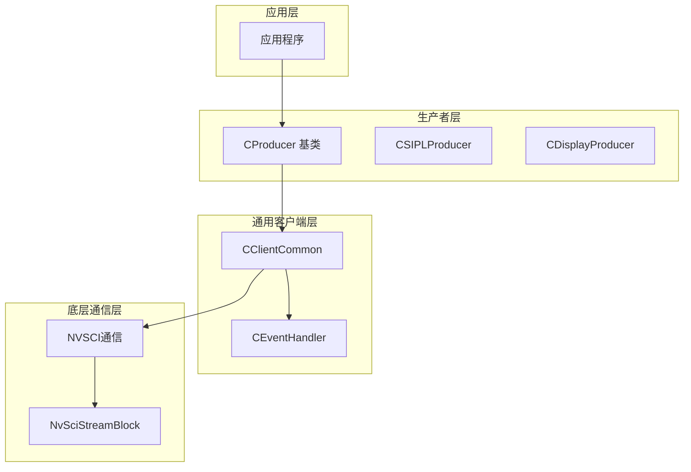
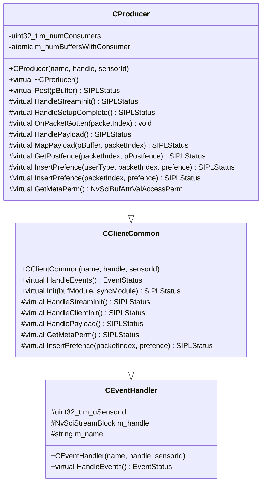
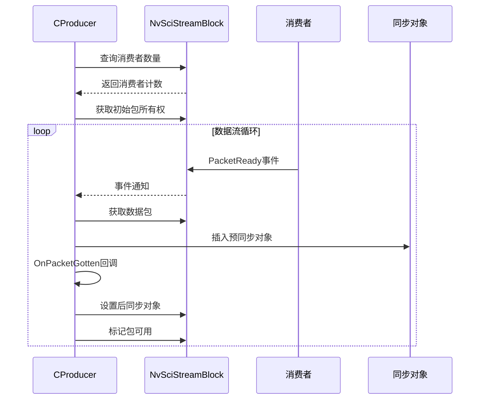
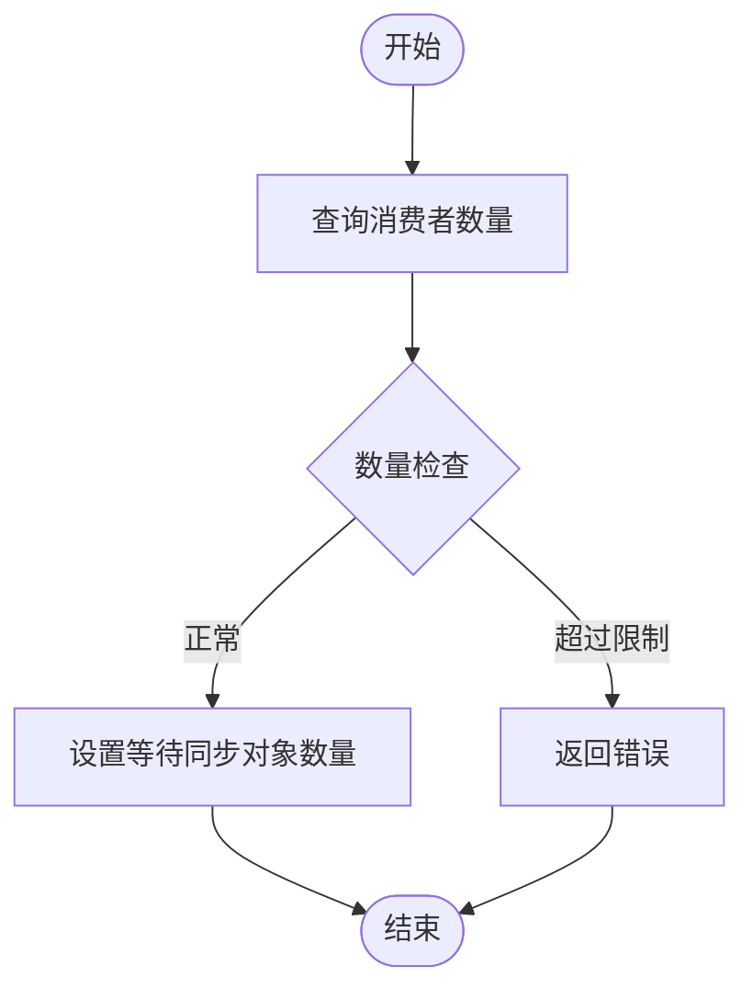
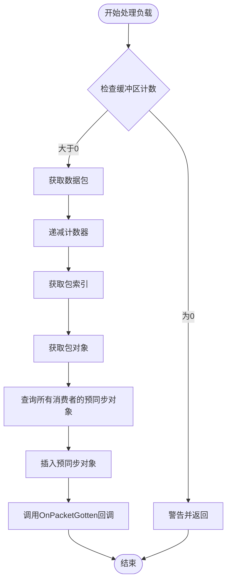
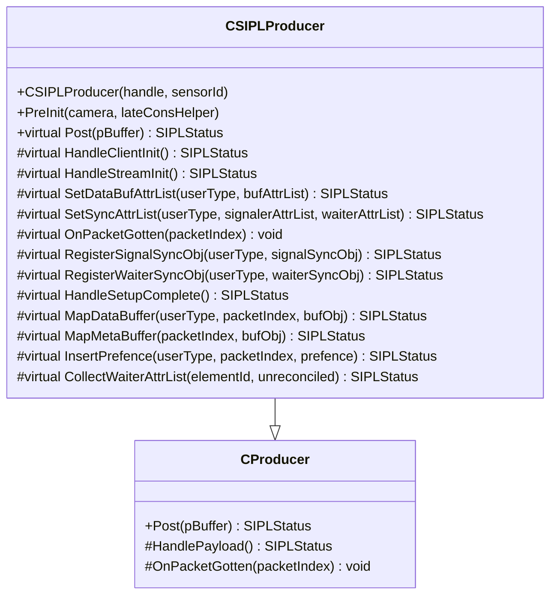
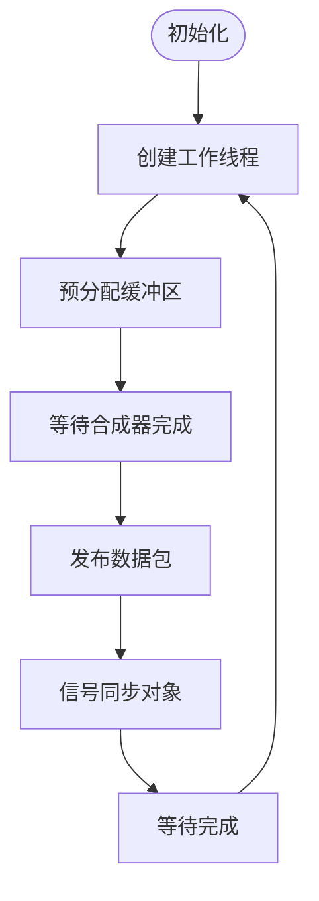
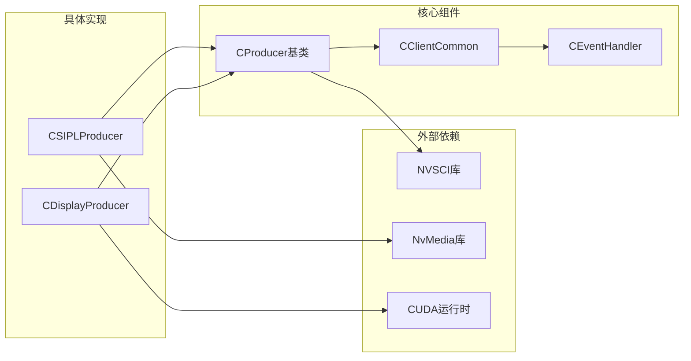
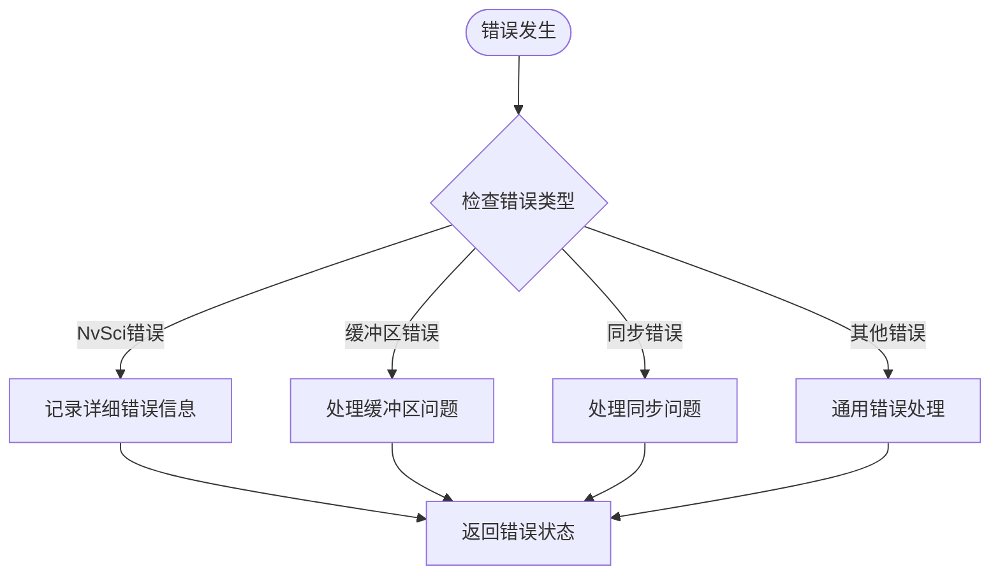

# 生产者基类设计

<cite>
**本文档引用的文件**
- [CProducer.hpp](file://CProducer.hpp)
- [CProducer.cpp](file://CProducer.cpp)
- [CClientCommon.hpp](file://CClientCommon.hpp)
- [CClientCommon.cpp](file://CClientCommon.cpp)
- [CDisplayProducer.hpp](file://CDisplayProducer.hpp)
- [CDisplayProducer.cpp](file://CDisplayProducer.cpp)
- [CSIPLProducer.hpp](file://CSIPLProducer.hpp)
- [CSIPLProducer.cpp](file://CSIPLProducer.cpp)
- [Common.hpp](file://Common.hpp)
- [CEventHandler.hpp](file://CEventHandler.hpp)
</cite>

## 目录
1. [简介](#简介)
2. [项目结构](#项目结构)
3. [核心组件](#核心组件)
4. [架构概览](#架构概览)
5. [详细组件分析](#详细组件分析)
6. [依赖关系分析](#依赖关系分析)
7. [性能考虑](#性能考虑)
8. [故障排除指南](#故障排除指南)
9. [结论](#结论)

## 简介

CProducer是NVSIPL多播系统中所有生产者的基类，负责管理数据流的生产过程。该基类继承自CClientCommon，提供了生产者特有的功能，包括缓冲区管理、同步对象处理、以及与消费者的协调机制。本文档将深入分析CProducer的设计架构、虚函数接口、保护成员变量的作用，并提供具体的使用示例。

## 项目结构

NVSIPL多播系统采用分层架构设计，主要包含以下层次：

**图表来源**
- [CProducer.hpp:16-51](file://CProducer.hpp#L16-L51)
- [CClientCommon.hpp:47-200](file://CClientCommon.hpp#L47-L200)
- [CEventHandler.hpp:23-51](file://CEventHandler.hpp#L23-L51)

**章节来源**
- [CProducer.hpp:1-53](file://CProducer.hpp#L1-L53)
- [CClientCommon.hpp:1-202](file://CClientCommon.hpp#L1-L202)
- [Common.hpp:1-87](file://Common.hpp#L1-L87)

## 核心组件

### CProducer基类设计

CProducer作为所有生产者的基类，采用了面向对象的设计原则，通过虚函数接口实现可扩展性。其核心设计特点包括：

#### 继承关系
- 继承自CClientCommon，获得通用客户端功能
- 实现了完整的生产者生命周期管理
- 提供了抽象接口供具体生产者实现

#### 构造函数参数设计
- `name`: 生产者名称，用于标识和日志记录
- `handle`: NvSciStreamBlock句柄，用于底层通信
- `sensorId`: 传感器ID，支持多传感器场景

#### 虚函数接口设计

**图表来源**
- [CProducer.hpp:16-51](file://CProducer.hpp#L16-L51)
- [CClientCommon.hpp:47-200](file://CClientCommon.hpp#L47-L200)
- [CEventHandler.hpp:23-51](file://CEventHandler.hpp#L23-L51)

**章节来源**
- [CProducer.hpp:16-51](file://CProducer.hpp#L16-L51)
- [CProducer.cpp:11-157](file://CProducer.cpp#L11-L157)

## 架构概览

CProducer的整体架构体现了生产者-消费者模式的经典设计：

**图表来源**
- [CProducer.cpp:17-121](file://CProducer.cpp#L17-L121)
- [CClientCommon.cpp:119-205](file://CClientCommon.cpp#L119-L205)

## 详细组件分析

### 保护成员变量详解

#### m_numConsumers - 消费者数量
- 类型：`uint32_t`
- 作用：存储当前连接的消费者数量
- 初始化：在`HandleStreamInit`中通过NvSciStreamBlock查询
- 限制：最大值为`MAX_NUM_CONSUMERS`（8个）

#### m_numBuffersWithConsumer - 原子计数器
- 类型：`std::atomic<uint32_t>`
- 作用：跟踪当前处于消费者手中的缓冲区数量
- 安全性：使用原子操作确保线程安全
- 使用场景：防止缓冲区过早释放或重复使用

**章节来源**
- [CProducer.hpp:49-50](file://CProducer.hpp#L49-L50)
- [CProducer.cpp:14,17-31](file://CProducer.cpp#L14,L17-L31)

### 虚函数接口实现

#### HandleStreamInit - 流初始化处理

**图表来源**
- [CProducer.cpp:17-31](file://CProducer.cpp#L17-L31)

#### HandleSetupComplete - 设置完成回调
- 获取初始包所有权
- 处理所有待处理的数据包
- 准备运行时状态

#### OnPacketGotten - 帧到达处理
- 纯虚函数，必须由派生类实现
- 处理数据包到达后的业务逻辑
- 通常用于触发后续处理流程

#### HandlePayload - 负载处理
这是生产者的核心处理逻辑：

**图表来源**
- [CProducer.cpp:56-121](file://CProducer.cpp#L56-L121)

#### Post - 数据发布
- 映射用户缓冲区到内部包
- 获取并设置后同步对象
- 标记包为可用状态

**章节来源**
- [CProducer.cpp:56-157](file://CProducer.cpp#L56-L157)

### 具体实现示例

#### CSIPLProducer实现
CSIPLProducer专门处理来自传感器的数据流：

**图表来源**
- [CSIPLProducer.hpp:18-81](file://CSIPLProducer.hpp#L18-L81)
- [CSIPLProducer.cpp:16-405](file://CSIPLProducer.cpp#L16-L405)

#### CDisplayProducer实现
CDisplayProducer处理显示相关的数据流：

**图表来源**
- [CDisplayProducer.cpp:61-383](file://CDisplayProducer.cpp#L61-L383)

**章节来源**
- [CSIPLProducer.hpp:18-81](file://CSIPLProducer.hpp#L18-L81)
- [CDisplayProducer.hpp:18-127](file://CDisplayProducer.hpp#L18-L127)

## 依赖关系分析

### 组件耦合度分析

**图表来源**
- [CProducer.hpp:13](file://CProducer.hpp#L13)
- [CClientCommon.hpp:15-20](file://CClientCommon.hpp#L15-L20)
- [CSIPLProducer.hpp:15-16](file://CSIPLProducer.hpp#L15-L16)
- [CDisplayProducer.hpp:15](file://CDisplayProducer.hpp#L15)

### 错误处理机制

CProducer实现了完善的错误处理机制：

**图表来源**
- [CProducer.cpp:42-51](file://CProducer.cpp#L42-L51)
- [CClientCommon.cpp:125-200](file://CClientCommon.cpp#L125-L200)

**章节来源**
- [CProducer.cpp:1-157](file://CProducer.cpp#L1-L157)
- [CClientCommon.cpp:1-634](file://CClientCommon.cpp#L1-L634)

## 性能考虑

### 缓冲区管理优化
- 使用原子计数器避免竞态条件
- 预分配固定数量的缓冲区
- 支持多元素数据流的高效处理

### 同步机制优化
- CPU等待机制的条件编译支持
- 可选的QNX平台特定优化
- 最小化同步开销的策略

### 内存管理
- RAII模式确保资源正确释放
- 智能指针的使用
- 避免内存泄漏的设计

## 故障排除指南

### 常见问题及解决方案

#### 消费者数量超限
- **症状**：初始化失败，返回错误状态
- **原因**：超过MAX_NUM_CONSUMERS限制
- **解决**：减少连接的消费者数量或调整配置

#### 缓冲区计数异常
- **症状**：m_numBuffersWithConsumer为0导致警告
- **原因**：缓冲区管理不一致
- **解决**：检查Post和HandlePayload的配对调用

#### 同步对象问题
- **症状**：预同步对象查询失败
- **原因**：消费者未正确注册同步对象
- **解决**：验证消费者端的同步对象配置

**章节来源**
- [CProducer.cpp:25-31](file://CProducer.cpp#L25-L31)
- [CProducer.cpp:61-64](file://CProducer.cpp#L61-L64)
- [CClientCommon.cpp:555-591](file://CClientCommon.cpp#L555-L591)

## 结论

CProducer作为NVSIPL多播系统的核心基类，通过精心设计的虚函数接口和保护成员变量，为各种生产者类型提供了统一的框架。其架构特点包括：

1. **高度可扩展性**：通过虚函数接口支持多种生产者实现
2. **线程安全性**：使用原子操作确保并发访问的安全性
3. **资源管理**：完善的RAII模式和错误处理机制
4. **性能优化**：针对多传感器和多元素场景的优化设计

通过继承CProducer并实现必要的虚函数，开发者可以快速构建符合系统规范的生产者组件，同时享受系统提供的完整功能支持。