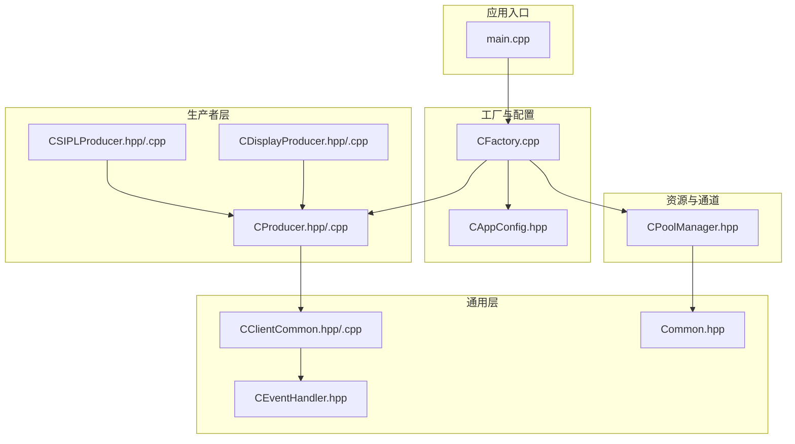
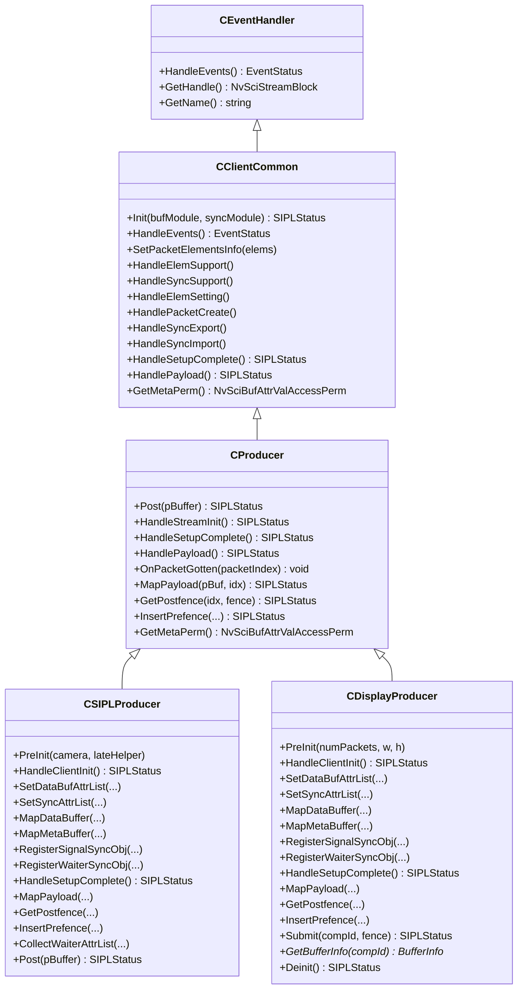
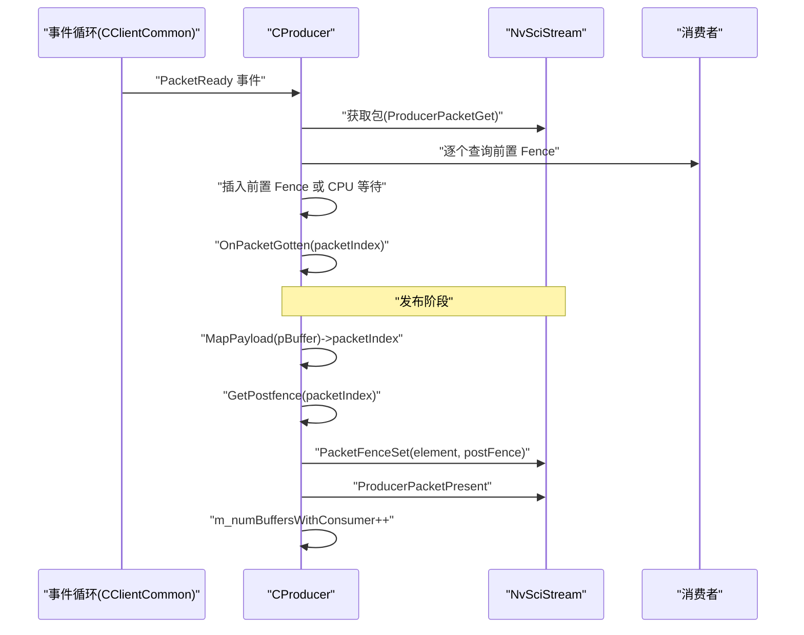
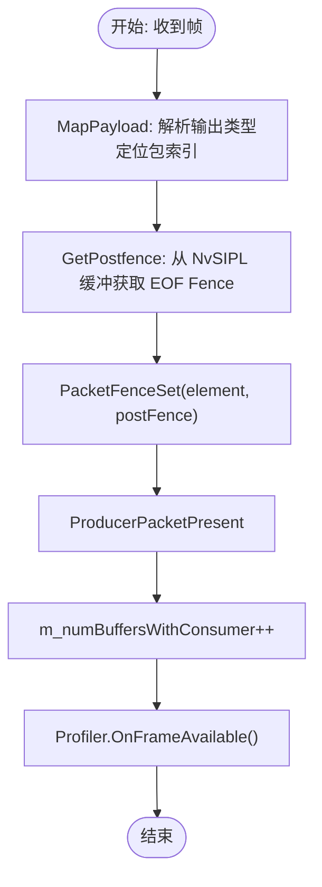
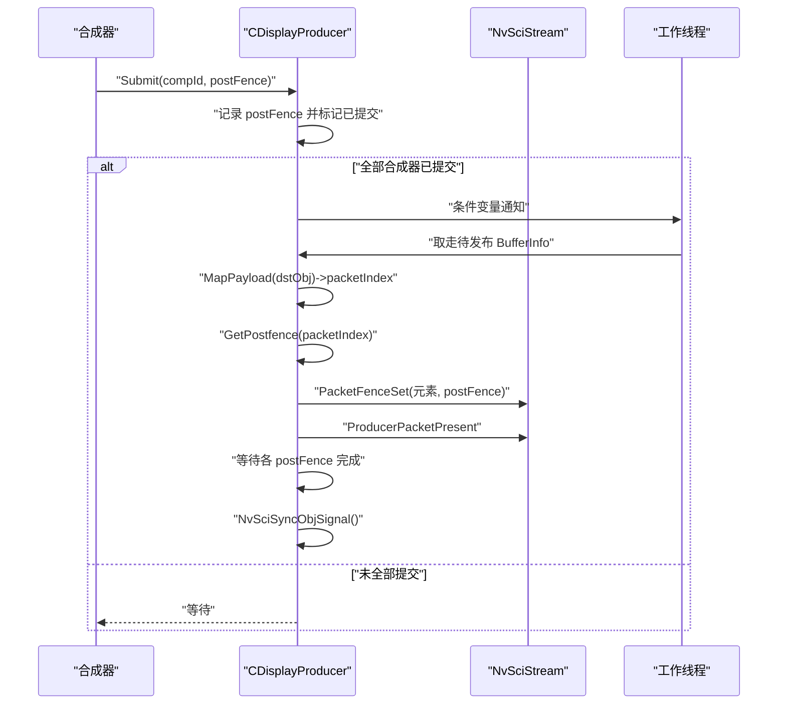
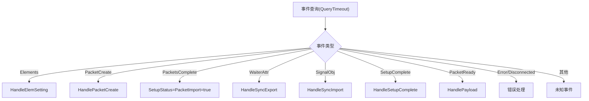
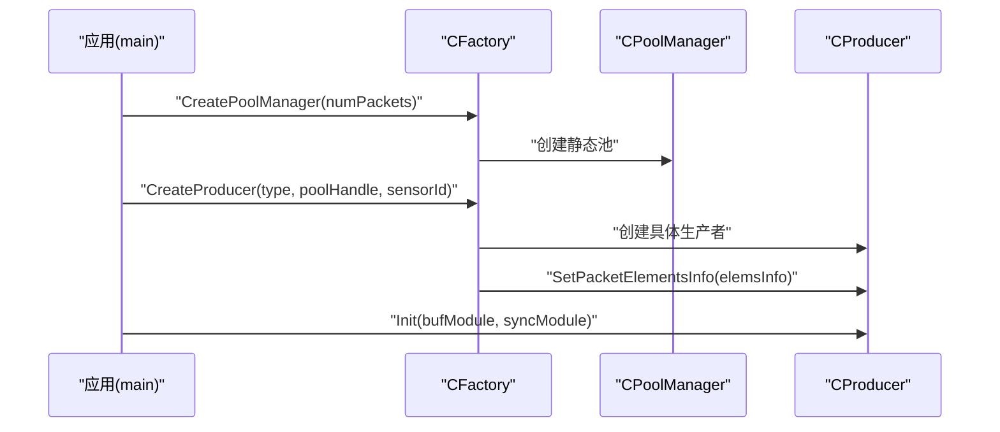
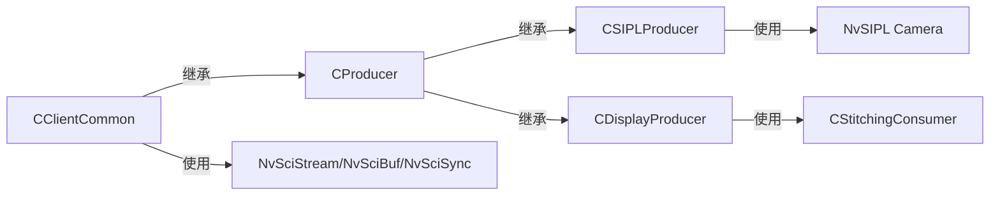

# 生产者系统

<cite>
**本文引用的文件**
- [CProducer.hpp](file://CProducer.hpp)
- [CProducer.cpp](file://CProducer.cpp)
- [CClientCommon.hpp](file://CClientCommon.hpp)
- [CClientCommon.cpp](file://CClientCommon.cpp)
- [CSIPLProducer.hpp](file://CSIPLProducer.hpp)
- [CSIPLProducer.cpp](file://CSIPLProducer.cpp)
- [CDisplayProducer.hpp](file://CDisplayProducer.hpp)
- [CDisplayProducer.cpp](file://CDisplayProducer.cpp)
- [CEventHandler.hpp](file://CEventHandler.hpp)
- [Common.hpp](file://Common.hpp)
- [CFactory.hpp](file://CFactory.hpp)
- [CFactory.cpp](file://CFactory.cpp)
- [CAppConfig.hpp](file://CAppConfig.hpp)
- [CPoolManager.hpp](file://CPoolManager.hpp)
- [main.cpp](file://main.cpp)
</cite>

## 目录
1. [简介](#简介)
2. [项目结构](#项目结构)
3. [核心组件](#核心组件)
4. [架构总览](#架构总览)
5. [详细组件分析](#详细组件分析)
6. [依赖关系分析](#依赖关系分析)
7. [性能考量](#性能考量)
8. [故障排查指南](#故障排查指南)
9. [结论](#结论)
10. [附录](#附录)

## 简介
本文件面向生产者系统的技术文档，聚焦于生产者基类（CProducer）的设计架构及其与通用客户端（CClientCommon）的关系，涵盖流初始化、设置完成回调、缓冲区与帧发布机制、同步处理等。同时，详细对比两类生产者实现：SIPL 生产者（CSIPLProducer）用于从摄像头传感器采集视频流；显示生产者（CDisplayProducer）用于合成/拼接后的显示输出。文档还提供工厂模式创建与配置示例路径，并说明生产者与消费者系统的交互模式。

## 项目结构
该仓库围绕 NvSIPL/NvSciStream 的多播框架组织，生产者侧主要由以下模块构成：
- 通用客户端与事件处理：CClientCommon、CEventHandler
- 生产者基类：CProducer
- 具体生产者实现：CSIPLProducer（来自摄像头）、CDisplayProducer（合成后显示）
- 工厂与配置：CFactory、CAppConfig
- 资源池与元素属性：CPoolManager、Common.hpp

**图示来源**
- [main.cpp:253-304](file://main.cpp#L253-L304)
- [CFactory.cpp:68-94](file://CFactory.cpp#L68-L94)
- [CProducer.hpp:16-51](file://CProducer.hpp#L16-L51)
- [CClientCommon.hpp:47-199](file://CClientCommon.hpp#L47-L199)
- [CSIPLProducer.hpp:18-81](file://CSIPLProducer.hpp#L18-L81)
- [CDisplayProducer.hpp:18-127](file://CDisplayProducer.hpp#L18-L127)
- [CPoolManager.hpp:33-68](file://CPoolManager.hpp#L33-L68)
- [Common.hpp:14-87](file://Common.hpp#L14-L87)

**章节来源**
- [main.cpp:253-304](file://main.cpp#L253-L304)
- [CFactory.cpp:68-94](file://CFactory.cpp#L68-L94)
- [CProducer.hpp:16-51](file://CProducer.hpp#L16-L51)
- [CClientCommon.hpp:47-199](file://CClientCommon.hpp#L47-L199)
- [Common.hpp:14-87](file://Common.hpp#L14-L87)

## 核心组件
- CEventHandler：事件处理器抽象，定义事件处理接口与句柄/名称管理。
- CClientCommon：生产者/消费者通用基类，封装 NvSciStream/NvSciBuf 同步与缓冲管理，负责元素属性导出/导入、包创建/状态上报、事件循环与阶段切换。
- CProducer：生产者专用扩展，定义 Post 帧发布流程、预/后置 Fence 插入、包获取回调 OnPacketGotten、元数据权限等。
- CSIPLProducer：面向摄像头传感器的生产者，负责映射 NvSIPL 输出到 NvSciBuf/NvSciSync，注册缓冲与同步对象，按输出类型分发。
- CDisplayProducer：面向显示/合成的生产者，通过线程异步等待各合成器提交，聚合后统一发布到消费者。

**章节来源**
- [CEventHandler.hpp:23-51](file://CEventHandler.hpp#L23-L51)
- [CClientCommon.hpp:47-199](file://CClientCommon.hpp#L47-L199)
- [CProducer.hpp:16-51](file://CProducer.hpp#L16-L51)
- [CSIPLProducer.hpp:18-81](file://CSIPLProducer.hpp#L18-L81)
- [CDisplayProducer.hpp:18-127](file://CDisplayProducer.hpp#L18-L127)

## 架构总览
生产者系统遵循“工厂创建 + 通用客户端 + 具体生产者”的分层设计。工厂根据配置选择生产者类型，设置元素信息（如 NV12/ICP/Metadata），随后在通用层完成 NvSciStream 阶段化初始化与同步对象协调，最后由具体生产者实现数据/元数据映射与发布。

**图示来源**
- [CEventHandler.hpp:23-51](file://CEventHandler.hpp#L23-L51)
- [CClientCommon.hpp:47-199](file://CClientCommon.hpp#L47-L199)
- [CProducer.hpp:16-51](file://CProducer.hpp#L16-L51)
- [CSIPLProducer.hpp:18-81](file://CSIPLProducer.hpp#L18-L81)
- [CDisplayProducer.hpp:18-127](file://CDisplayProducer.hpp#L18-L127)

## 详细组件分析

### 组件一：生产者基类 CProducer
- 设计要点
  - 继承自 CClientCommon，复用元素属性与同步对象的协调流程。
  - 提供 Post(pBuffer) 发布帧的标准入口，内部调用 MapPayload 获取包索引，查询/插入前置 Fence，设置后置 Fence 并提交包。
  - HandlePayload 在收到 PacketReady 事件时，从每个消费者处查询前置 Fence，必要时进行 CPU 等待或插入到具体生产者实现中，随后回调 OnPacketGotten。
  - 元数据访问权限默认为读写。
- 生命周期与事件
  - HandleStreamInit 查询消费者数量并设置等待同步对象数。
  - HandleSetupComplete 在 SetupComplete 时完成初始包所有权获取。
- 缓冲区与帧发布
  - 使用原子计数 m_numBuffersWithConsumer 控制可发布的缓冲数量，避免无消费者时的无效发布。
  - 发布后增加计数，触发 Profiler 通知。

**图示来源**
- [CProducer.cpp:56-121](file://CProducer.cpp#L56-L121)
- [CProducer.cpp:123-151](file://CProducer.cpp#L123-L151)
- [CClientCommon.cpp:119-205](file://CClientCommon.cpp#L119-L205)

**章节来源**
- [CProducer.hpp:16-51](file://CProducer.hpp#L16-L51)
- [CProducer.cpp:17-156](file://CProducer.cpp#L17-L156)

### 组件二：SIPL 生产者 CSIPLProducer
- 角色与职责
  - 从摄像头传感器获取图像数据，映射到 NvSciBuf/NvSciSync，注册缓冲与同步对象。
  - 将 NvSIPL 输出类型映射到元素类型，按输出类型收集等待端属性列表，支持延迟消费者场景。
- 初始化与元素属性
  - HandleClientInit 设置元素类型到输出类型的映射。
  - SetDataBufAttrList/SetBufAttrList 配置图像布局、颜色标准、CPU 访问与缓存策略。
  - SetSyncAttrList 为信号端与等待端生成属性列表，CPU 等待端在非 QNX 平台启用。
- 映射与发布
  - MapDataBuffer 复制 NvSciBufObj 并记录到输出类型对应的缓冲向量。
  - MapMetaBuffer 获取元数据指针，填充帧捕获时间戳。
  - RegisterSignalSyncObj/ RegisterWaiterSyncObj 注册同步对象至摄像头。
  - HandleSetupComplete 完成缓冲注册。
  - Post 支持多输出类型，逐个设置对应元素的后置 Fence 并提交包。
- 同步与等待
  - InsertPrefence 在 QNX 平台将前置 Fence 注入到 NvSIPL 缓冲对象。
  - CollectWaiterAttrList 可合并延迟消费者的等待端属性列表。

**图示来源**
- [CSIPLProducer.cpp:367-404](file://CSIPLProducer.cpp#L367-L404)

**章节来源**
- [CSIPLProducer.hpp:18-81](file://CSIPLProducer.hpp#L18-L81)
- [CSIPLProducer.cpp:54-404](file://CSIPLProducer.cpp#L54-L404)

### 组件三：显示生产者 CDisplayProducer
- 角色与职责
  - 作为合成/拼接后的显示生产者，维护一组 BufferInfo，每个包含 NvSciBufObj、前置 Fence 与多个后置 Fence。
  - 通过独立工作线程等待所有合成器提交完成，聚合后统一 Post 到消费者。
- 初始化与元素属性
  - HandleClientInit 创建工作线程并启动。
  - SetDataBufAttrList 从合成器克隆缓冲属性，设置像素格式、布局与尺寸。
  - SetSyncAttrList 为 CPU 等待端与信号端分别设置属性并分配 CPU 等待上下文。
- 缓冲与同步
  - MapDataBuffer 复制 NvSciBufObj 并注册到各合成器目标缓冲。
  - InsertPrefence 复制并保存前置 Fence。
  - GetPostfence 生成 CPU 信号 Fence。
  - Submit 接收合成器提交的后置 Fence，当所有合成器完成后触发通知。
- 生命周期
  - Deinit 通知并等待工作线程退出，释放资源。

**图示来源**
- [CDisplayProducer.cpp:276-313](file://CDisplayProducer.cpp#L276-L313)
- [CDisplayProducer.cpp:326-382](file://CDisplayProducer.cpp#L326-L382)

**章节来源**
- [CDisplayProducer.hpp:18-127](file://CDisplayProducer.hpp#L18-L127)
- [CDisplayProducer.cpp:61-382](file://CDisplayProducer.cpp#L61-L382)

### 组件四：通用客户端 CClientCommon 与事件循环
- 事件循环 HandleEvents 根据 NvSciStream 事件类型分派处理：
  - Elements：导出/导入元素属性。
  - PacketCreate：创建包句柄并映射缓冲，设置 Cookie。
  - PacketsComplete：标记包导入完成。
  - WaiterAttr/SignalObj：导出/导入同步对象。
  - SetupComplete：进入运行态。
  - PacketReady：调用 HandlePayload。
  - Error/Disconnected：错误处理。
- 阶段化初始化
  - HandleStreamInit：查询元素支持与同步支持。
  - HandleElemSetting：导入元素属性并设置等待端属性。
  - HandleSyncExport/HandleSyncImport：协调并分配同步对象。
  - HandleSetupComplete：完成 SetupComplete 阶段转换。

**图示来源**
- [CClientCommon.cpp:119-205](file://CClientCommon.cpp#L119-L205)

**章节来源**
- [CClientCommon.hpp:47-199](file://CClientCommon.hpp#L47-L199)
- [CClientCommon.cpp:95-634](file://CClientCommon.cpp#L95-L634)

### 组件五：工厂与配置 CFactory/CAppConfig
- CFactory.CreateProducer 根据 ProducerType 创建对应生产者实例，并设置元素信息（如 NV12/ICP/Metadata 的使用与否、是否为兄弟元素等）。
- CFactory.GetProducerElementsInfo 针对不同传感器与配置决定元素使用情况。
- CAppConfig 提供运行参数与平台配置，影响元素选择与行为（如多元素开关、DPMST/拼接显示开关）。

**图示来源**
- [CFactory.cpp:11-94](file://CFactory.cpp#L11-L94)
- [main.cpp:271-288](file://main.cpp#L271-L288)

**章节来源**
- [CFactory.hpp:27-92](file://CFactory.hpp#L27-L92)
- [CFactory.cpp:44-94](file://CFactory.cpp#L44-L94)
- [CAppConfig.hpp:19-83](file://CAppConfig.hpp#L19-L83)

## 依赖关系分析
- 继承与组合
  - CClientCommon 组合了 NvSciBuf/NvSciSync 模块、包集合、同步对象数组、元素信息等。
  - CProducer 继承 CClientCommon，扩展发布流程与回调。
  - CSIPLProducer/CDisplayProducer 继承 CProducer，覆盖映射、同步与发布细节。
- 外部依赖
  - NvSciStream/NvSciBuf/NvSciSync：用于包生命周期、缓冲属性与同步对象协调。
  - NvSIPL Camera 接口：CSIPLProducer 通过其填充属性、注册缓冲与同步对象。
  - 合成器接口：CDisplayProducer 与 CStitchingConsumer 协作，通过 Fence 进行同步。
- 循环依赖
  - 生产者与消费者通过 NvSciStream 多播/队列连接，无直接循环依赖。

**图示来源**
- [CClientCommon.hpp:47-199](file://CClientCommon.hpp#L47-L199)
- [CProducer.hpp:16-51](file://CProducer.hpp#L16-L51)
- [CSIPLProducer.hpp:18-81](file://CSIPLProducer.hpp#L18-L81)
- [CDisplayProducer.hpp:18-127](file://CDisplayProducer.hpp#L18-L127)

**章节来源**
- [CClientCommon.hpp:164-199](file://CClientCommon.hpp#L164-L199)
- [CProducer.hpp:16-51](file://CProducer.hpp#L16-L51)
- [CSIPLProducer.hpp:18-81](file://CSIPLProducer.hpp#L18-L81)
- [CDisplayProducer.hpp:18-127](file://CDisplayProducer.hpp#L18-L127)

## 性能考量
- 包与元素数量限制：受 MAX_NUM_PACKETS、MAX_NUM_ELEMENTS、MAX_NUM_CONSUMERS 等常量约束，需在配置中平衡吞吐与内存占用。
- Fence 等待策略：CSIPLProducer 在特定平台上采用 CPU 等待以规避 ISP 同步问题；CDisplayProducer 使用 CPU 等待上下文等待合成器完成，避免忙轮询。
- 原子计数保护：m_numBuffersWithConsumer 原子递增/递减，防止无消费者时的无效发布，降低死锁风险。
- 线程模型：CDisplayProducer 工作线程独立处理发布与等待，减少主线程阻塞。

[本节为通用指导，无需列出具体文件来源]

## 故障排查指南
- 事件超时或错误
  - HandleEvents 对事件查询超时与错误进行分类处理，检查 NvSciStreamBlock 错误码并返回错误状态。
- 元素/包状态异常
  - PacketCreate 阶段若超过最大包数，会设置无效 Cookie 并返回错误；检查元素属性与缓冲映射是否正确。
- 同步对象问题
  - CollectWaiterAttrList 可能返回空属性列表，表示两端均未设置；确认元素使用标志与兄弟元素共享设置。
  - CPU 等待失败：检查 CPU 等待上下文与权限设置，确保等待端为 WaitOnly，信号端为 SignalOnly。
- 发布失败
  - Post/HandlePayload 中的 Fence 设置与 Present 调用失败，检查 MapPayload 返回值与元素 ID 映射。

**章节来源**
- [CClientCommon.cpp:119-205](file://CClientCommon.cpp#L119-L205)
- [CClientCommon.cpp:410-467](file://CClientCommon.cpp#L410-L467)
- [CClientCommon.cpp:606-624](file://CClientCommon.cpp#L606-L624)
- [CProducer.cpp:123-151](file://CProducer.cpp#L123-L151)

## 结论
生产者系统通过 CClientCommon 抽象出 NvSciStream/NvSciBuf 的通用初始化与同步流程，CProducer 提供统一的发布与回调机制，CSIPLProducer/CDisplayProducer 则针对不同场景实现差异化映射与同步策略。工厂与配置模块将运行参数与元素信息注入到生产者，形成可扩展、可配置的生产者体系。结合线程与 Fence 等机制，系统在多消费者环境下实现了高效、可靠的帧发布与同步。

[本节为总结性内容，无需列出具体文件来源]

## 附录

### A. 创建与配置生产者的示例路径
- 创建静态资源池与生产者
  - [创建静态池:11-22](file://CFactory.cpp#L11-L22)
  - [创建生产者实例与元素信息:68-94](file://CFactory.cpp#L68-L94)
- 预初始化与初始化
  - [CSIPL 预初始化:36-40](file://CSIPLProducer.cpp#L36-L40)
  - [CDisplay 预初始化:23-28](file://CDisplayProducer.cpp#L23-L28)
  - [通用初始化:95-112](file://CClientCommon.cpp#L95-L112)
- 元素信息与平台配置
  - [元素信息选择:44-66](file://CFactory.cpp#L44-L66)
  - [平台配置开关:48-79](file://CAppConfig.hpp#L48-L79)

**章节来源**
- [CFactory.cpp:11-94](file://CFactory.cpp#L11-L94)
- [CAppConfig.hpp:48-79](file://CAppConfig.hpp#L48-L79)
- [CSIPLProducer.cpp:36-40](file://CSIPLProducer.cpp#L36-L40)
- [CDisplayProducer.cpp:23-28](file://CDisplayProducer.cpp#L23-L28)
- [CClientCommon.cpp:95-112](file://CClientCommon.cpp#L95-L112)

### B. 关键常量与限制
- 最大传感器数、每传感器输出数、包数、元素数、消费者数等上限定义见：
  - [公共常量:14-31](file://Common.hpp#L14-L31)

**章节来源**
- [Common.hpp:14-31](file://Common.hpp#L14-L31)