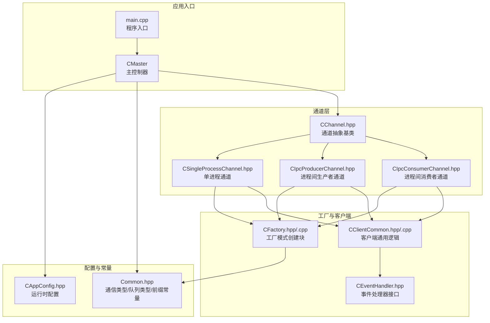
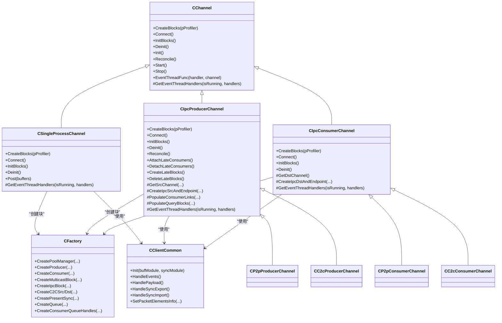
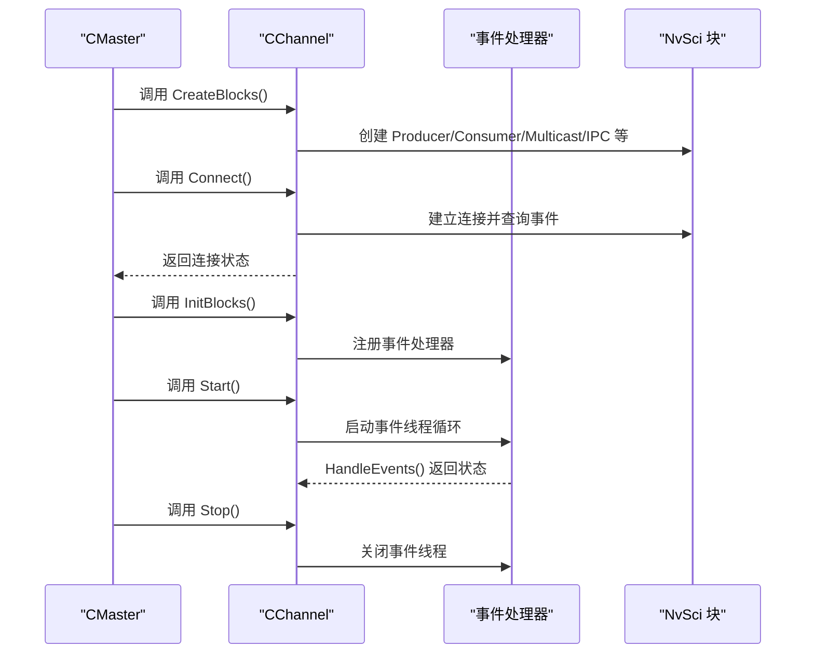
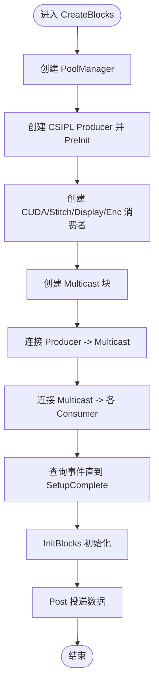
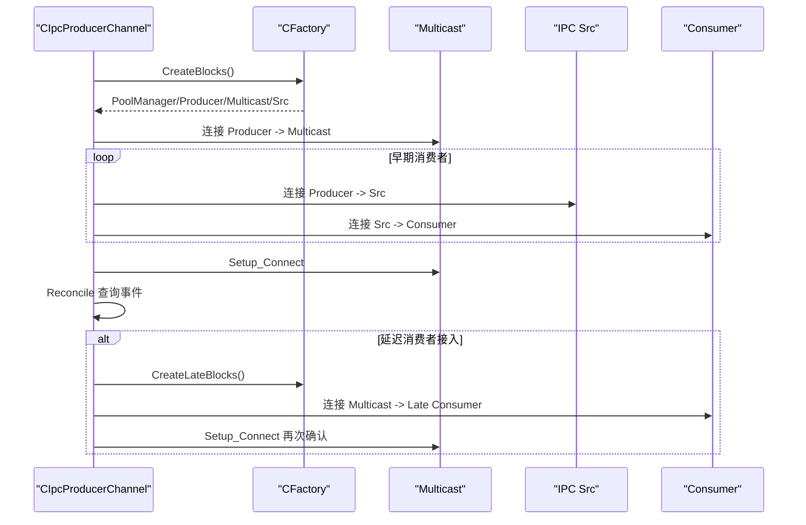
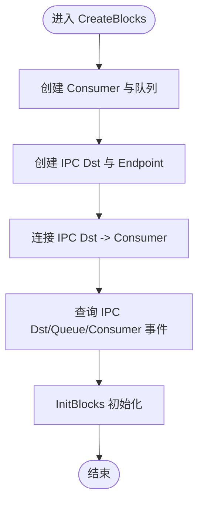
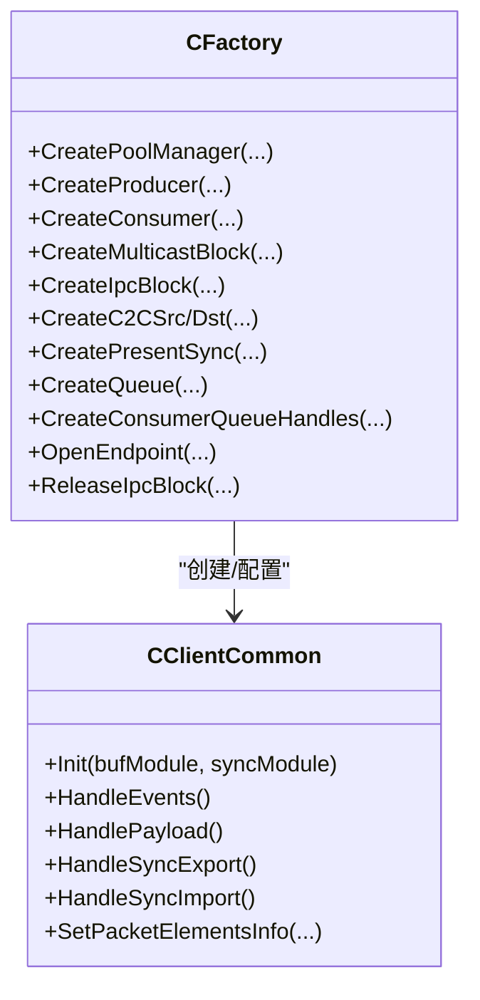
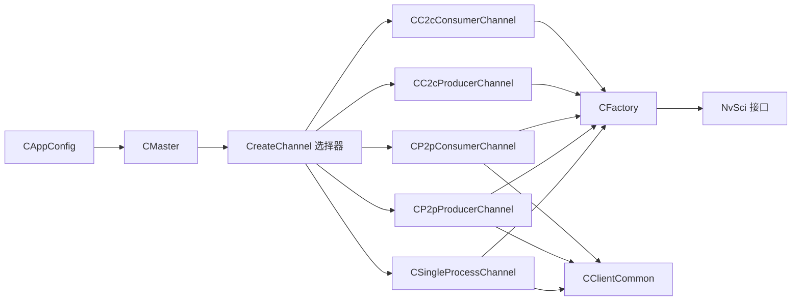

# 通道管理系统

<cite>
**本文档引用的文件**
- [CChannel.hpp](file://CChannel.hpp)
- [CSingleProcessChannel.hpp](file://CSingleProcessChannel.hpp)
- [CIpcProducerChannel.hpp](file://CIpcProducerChannel.hpp)
- [CIpcConsumerChannel.hpp](file://CIpcConsumerChannel.hpp)
- [CFactory.hpp](file://CFactory.hpp)
- [CFactory.cpp](file://CFactory.cpp)
- [CAppConfig.hpp](file://CAppConfig.hpp)
- [Common.hpp](file://Common.hpp)
- [CEventHandler.hpp](file://CEventHandler.hpp)
- [CClientCommon.hpp](file://CClientCommon.hpp)
- [CClientCommon.cpp](file://CClientCommon.cpp)
- [CMaster.hpp](file://CMaster.hpp)
- [main.cpp](file://main.cpp)
</cite>

## 目录
1. [简介](#简介)
2. [项目结构](#项目结构)
3. [核心组件](#核心组件)
4. [架构总览](#架构总览)
5. [详细组件分析](#详细组件分析)
6. [依赖关系分析](#依赖关系分析)
7. [性能考虑](#性能考虑)
8. [故障排除指南](#故障排除指南)
9. [结论](#结论)
10. [附录](#附录)

## 简介
本文件为通道管理系统的详细技术文档，聚焦于通道系统的设计与实现，涵盖通道基类的抽象设计以及三类主要通道类型：
- 单进程通道（CSingleProcessChannel）：用于同一进程内的多消费者数据分发
- 进程间生产者通道（CIpcProducerChannel 及其派生 CP2pProducerChannel、CC2cProducerChannel）
- 进程间消费者通道（CIpcConsumerChannel 及其派生 CP2pConsumerChannel、CC2cConsumerChannel）

文档将深入解释通道的选择机制、初始化流程、连接建立过程、数据传输协议、同步机制、错误处理策略与性能优化技术，并提供配置示例、使用场景分析与故障排除指南。

## 项目结构
通道系统围绕统一的抽象基类 CChannel 展开，通过工厂模式（CFactory）创建与组装各类块（Producer/Consumer/Multicast/IPC 等），并通过事件驱动线程模型进行异步事件处理。主程序入口负责解析配置、创建主控对象并协调通道生命周期。

**图表来源**
- [main.cpp:253-304](file://main.cpp#L253-L304)
- [CMaster.hpp:47-95](file://CMaster.hpp#L47-L95)
- [CChannel.hpp:28-157](file://CChannel.hpp#L28-L157)
- [CSingleProcessChannel.hpp:21-247](file://CSingleProcessChannel.hpp#L21-L247)
- [CIpcProducerChannel.hpp:20-533](file://CIpcProducerChannel.hpp#L20-L533)
- [CIpcConsumerChannel.hpp:19-264](file://CIpcConsumerChannel.hpp#L19-L264)
- [CFactory.hpp:27-95](file://CFactory.hpp#L27-L95)
- [CFactory.cpp:11-315](file://CFactory.cpp#L11-L315)
- [CClientCommon.hpp:47-202](file://CClientCommon.hpp#L47-L202)
- [CEventHandler.hpp:23-54](file://CEventHandler.hpp#L23-L54)
- [Common.hpp:35-87](file://Common.hpp#L35-L87)
- [CAppConfig.hpp:19-83](file://CAppConfig.hpp#L19-L83)

**章节来源**
- [main.cpp:253-304](file://main.cpp#L253-L304)
- [CMaster.hpp:47-95](file://CMaster.hpp#L47-L95)
- [CChannel.hpp:28-157](file://CChannel.hpp#L28-L157)
- [Common.hpp:35-87](file://Common.hpp#L35-L87)

## 核心组件
- 通道抽象基类（CChannel）
  - 定义通道生命周期方法：CreateBlocks、Connect、InitBlocks、Deinit、Init
  - 提供统一的事件线程启动/停止机制与超时检测
  - 通过虚函数 GetEventThreadHandlers 暴露各子类需要监听的事件处理器集合
- 工厂（CFactory）
  - 统一创建 Producer/Consumer/Multicast/IPC/PresentSync/Queue 等块
  - 负责元素信息（PacketElementType）的设置与导出/导入同步对象
- 客户端通用（CClientCommon）
  - 实现事件循环、缓冲区映射、元数据处理、同步对象导出/导入等
  - 支持多元素、兄弟元素（共享同步对象）等复杂场景
- 事件处理器（CEventHandler）
  - 抽象事件处理接口，被通道线程循环调用

**章节来源**
- [CChannel.hpp:28-157](file://CChannel.hpp#L28-L157)
- [CFactory.hpp:27-95](file://CFactory.hpp#L27-L95)
- [CFactory.cpp:11-315](file://CFactory.cpp#L11-L315)
- [CClientCommon.hpp:47-202](file://CClientCommon.hpp#L47-L202)
- [CClientCommon.cpp:95-112](file://CClientCommon.cpp#L95-L112)
- [CEventHandler.hpp:23-54](file://CEventHandler.hpp#L23-L54)

## 架构总览
通道系统采用“主控-通道-工厂-客户端”的分层架构：
- 主控（CMaster）根据配置选择通信类型，创建对应通道实例，协调启动/停止与事件循环
- 通道（CChannel 派生类）负责块的创建、连接与初始化
- 工厂（CFactory）屏蔽底层 NvSci 接口细节，提供统一创建与资源释放能力
- 客户端（CClientCommon 派生类）封装 Producer/Consumer 的具体行为

**图表来源**
- [CChannel.hpp:28-157](file://CChannel.hpp#L28-L157)
- [CSingleProcessChannel.hpp:21-247](file://CSingleProcessChannel.hpp#L21-L247)
- [CIpcProducerChannel.hpp:20-533](file://CIpcProducerChannel.hpp#L20-L533)
- [CIpcConsumerChannel.hpp:19-264](file://CIpcConsumerChannel.hpp#L19-L264)
- [CFactory.hpp:27-95](file://CFactory.hpp#L27-L95)
- [CClientCommon.hpp:47-202](file://CClientCommon.hpp#L47-L202)

## 详细组件分析

### 通道基类（CChannel）
- 生命周期方法
  - CreateBlocks：由子类实现，创建内部块（Producer/Consumer/Multicast/IPC 等）
  - Connect：建立块之间的连接关系，查询事件直到连接完成
  - InitBlocks：初始化块（如 Producer/Consumer 的缓冲区、同步对象等）
  - Deinit：反初始化
  - Init：默认空实现，可在子类中覆盖
- 事件线程模型
  - Start/Stop 启动/停止事件线程，每个事件处理器在独立线程中循环等待事件
  - EventThreadFunc 包含超时检测与退出条件判断
- Reconcile：在流开始前执行，启动事件线程并等待所有线程就绪

**图表来源**
- [CChannel.hpp:46-157](file://CChannel.hpp#L46-L157)

**章节来源**
- [CChannel.hpp:28-157](file://CChannel.hpp#L28-L157)

### 单进程通道（CSingleProcessChannel）
- 角色定位：同一进程内从 Producer 到多个 Consumer 的多播分发
- 块创建
  - 创建 PoolManager、Producer（CSIPLProducer）、多个 Consumer（CUDA/Stitch/Display/Enc）
  - 创建 Multicast 块并将 Producer 与各 Consumer 连接
- 连接建立
  - 先连接 Producer 与 Multicast，再连接 Multicast 与各 Consumer
  - 查询 Producer、Pool、各 Consumer 的队列与块事件，直至 SetupComplete
- 数据投递
  - 通过 Post 将 NvSIPLBuffers 投递给 Producer
- 事件线程
  - 在 Reconcile/Start 阶段启动 PoolManager 与各 Client 的事件线程

**图表来源**
- [CSingleProcessChannel.hpp:87-224](file://CSingleProcessChannel.hpp#L87-L224)

**章节来源**
- [CSingleProcessChannel.hpp:21-247](file://CSingleProcessChannel.hpp#L21-L247)

### 进程间生产者通道（CIpcProducerChannel 及派生类）
- 角色定位：跨进程或多芯片场景下的生产者侧通道
- 早期消费者与延迟消费者
  - 早期消费者：在 CreateBlocks 阶段即创建并连接
  - 延迟消费者：通过 Reconcile 确认 Multicast SetupComplete 后，按需动态创建/连接
- 块创建
  - PoolManager、Producer、Multicast
  - 为每个消费者创建 IPC Src 块与 Endpoint；C2C 生产者额外创建 PresentSync
- 连接建立
  - Producer -> Multicast -> Consumer 链路；支持多链路拼接
  - 通过 NvSciStreamSetup_Connect 指示 Multicast 进入连接阶段
  - 查询 Producer、Pool、IPC Src、Multicast 等事件
- 延迟消费者接入/断开
  - AttachLateConsumers：创建 Late Blocks，连接到 Multicast，再次触发 SetupComplete
  - DetachLateConsumers：断开并释放 Late Blocks
- 事件线程
  - 在 Reconcile/Start 阶段启动 PoolManager 与 Producer 的事件线程

**图表来源**
- [CIpcProducerChannel.hpp:88-380](file://CIpcProducerChannel.hpp#L88-L380)
- [CIpcProducerChannel.hpp:205-290](file://CIpcProducerChannel.hpp#L205-L290)
- [CFactory.cpp:243-314](file://CFactory.cpp#L243-L314)

**章节来源**
- [CIpcProducerChannel.hpp:20-533](file://CIpcProducerChannel.hpp#L20-L533)
- [CFactory.cpp:11-315](file://CFactory.cpp#L11-L315)

### 进程间消费者通道（CIpcConsumerChannel 及派生类）
- 角色定位：跨进程或多芯片场景下的消费者侧通道
- 块创建
  - 创建 Consumer（Enc/Cuda/Stitch/Display）与队列
  - 为消费者创建 IPC Dst 块与 Endpoint；C2C 消费者额外创建 PoolManager
- 连接建立
  - IPC Dst -> Consumer，查询 IPC Dst、Queue、Consumer 事件
  - C2C 消费者额外查询 PoolManager 事件
- 事件线程
  - 启动 Consumer 的事件线程

**图表来源**
- [CIpcConsumerChannel.hpp:63-148](file://CIpcConsumerChannel.hpp#L63-L148)
- [CIpcConsumerChannel.hpp:203-217](file://CIpcConsumerChannel.hpp#L203-L217)

**章节来源**
- [CIpcConsumerChannel.hpp:19-264](file://CIpcConsumerChannel.hpp#L19-L264)

### 工厂（CFactory）与客户端（CClientCommon）
- 工厂职责
  - 统一创建 PoolManager、Producer、Consumer、Multicast、IPC、PresentSync、Queue
  - 设置元素信息（PacketElementType），支持多元素与兄弟元素
- 客户端职责
  - 初始化缓冲区与同步属性列表
  - 导出/导入同步对象，处理数据包与元数据
  - 事件循环处理 SetupComplete、Payload、EOF 等阶段

**图表来源**
- [CFactory.hpp:27-95](file://CFactory.hpp#L27-L95)
- [CFactory.cpp:11-315](file://CFactory.cpp#L11-L315)
- [CClientCommon.hpp:47-202](file://CClientCommon.hpp#L47-L202)

**章节来源**
- [CFactory.hpp:27-95](file://CFactory.hpp#L27-L95)
- [CFactory.cpp:11-315](file://CFactory.cpp#L11-L315)
- [CClientCommon.hpp:47-202](file://CClientCommon.hpp#L47-L202)
- [CClientCommon.cpp:95-112](file://CClientCommon.cpp#L95-L112)

## 依赖关系分析
- 通道选择机制
  - CMaster 根据 CAppConfig 的通信类型（IntraProcess/InterProcess/InterChip）与实体类型（Producer/Consumer）选择具体通道
  - IPC 场景下进一步区分点对点（P2P）与片间（C2C）
- 外部依赖
  - NvSciBuf/NvSciStream/NvSciSync：通道块与事件查询、连接、同步对象管理
  - NvSIPLCamera：相机采集与帧数据提供
- 内部耦合
  - 通道与工厂强耦合（通过工厂创建块）
  - 通道与客户端强耦合（通过客户端处理事件与数据）

**图表来源**
- [CMaster.hpp:74-76](file://CMaster.hpp#L74-L76)
- [CMaster.cpp:426-451](file://CMaster.cpp#L426-L451)
- [CAppConfig.hpp:30-46](file://CAppConfig.hpp#L30-L46)
- [Common.hpp:35-40](file://Common.hpp#L35-L40)

**章节来源**
- [CMaster.cpp:426-451](file://CMaster.cpp#L426-L451)
- [CAppConfig.hpp:30-46](file://CAppConfig.hpp#L30-L46)
- [Common.hpp:35-40](file://Common.hpp#L35-L40)

## 性能考虑
- 多播与队列
  - 单进程通道使用 Multicast 将数据分发给多个消费者，减少重复拷贝
  - C2C 场景可选 Mailbox/FIFO 队列，Mailbox 更适合低延迟展示
- 延迟消费者接入
  - 仅在 SetupComplete 后接入，避免阻塞主链路，提升扩展性
- 同步对象导出/导入
  - 使用 NvSciSyncAttrListReconcile 合并等待方属性，减少 CPU 等待
- 事件轮询与超时
  - 事件线程采用固定超时轮询，避免长时间阻塞；超过阈值发出告警
- 元素配置
  - 通过元素信息控制是否启用多元素与兄弟元素，平衡带宽与处理复杂度

[本节为通用性能讨论，无需特定文件引用]

## 故障排除指南
- 连接失败
  - 检查 NvSciStreamBlockEventQuery 返回值与事件类型，确保 SetupComplete 到达
  - IPC 场景确认 Endpoint 打开成功且通道名正确
- 延迟消费者接入失败
  - 确认 Multicast 已设置为 Setup_Connect，且 Reconcile 成功
  - 失败后应调用 DeleteLateBlocks 释放资源
- 事件超时
  - 查看 EventThreadFunc 中的超时计数与告警日志
  - 检查消费者处理速度与队列深度
- 元素配置不匹配
  - 确保 Producer/Consumer 的元素信息一致，特别是兄弟元素场景
- 资源泄漏
  - 确保析构函数中删除所有 NvSciStreamBlock 与关闭 Endpoint

**章节来源**
- [CIpcProducerChannel.hpp:186-203](file://CIpcProducerChannel.hpp#L186-L203)
- [CIpcProducerChannel.hpp:205-290](file://CIpcProducerChannel.hpp#L205-L290)
- [CIpcConsumerChannel.hpp:85-118](file://CIpcConsumerChannel.hpp#L85-L118)
- [CClientCommon.cpp:119-133](file://CClientCommon.cpp#L119-L133)
- [CFactory.cpp:223-263](file://CFactory.cpp#L223-L263)

## 结论
通道管理系统以 CChannel 为核心抽象，结合 CFactory 的工厂模式与 CClientCommon 的事件处理框架，实现了从单进程到跨进程/跨芯片的灵活数据分发。通过 Multicast、IPC、PresentSync 等机制，系统在保证高吞吐的同时提供了良好的扩展性与稳定性。延迟消费者接入、元素配置与同步对象导出/导入等特性进一步提升了系统的实用性与可维护性。

[本节为总结性内容，无需特定文件引用]

## 附录

### 通道选择与配置示例
- 通信类型
  - IntraProcess：单进程通道（CSingleProcessChannel）
  - InterProcess：进程间 P2P（CP2pProducerChannel/CP2pConsumerChannel）
  - InterChip：片间 C2C（CC2cProducerChannel/CC2cConsumerChannel）
- 关键配置项
  - 通信类型：CommType
  - 实体类型：EntityType（Producer/Consumer）
  - 消费者数量与索引：GetConsumerNum()/GetConsumerIdx()
  - 队列类型：QueueType（Mailbox/Fifo）
  - 多元素开关：IsMultiElementsEnabled
  - 延迟接入开关：IsLateAttachEnabled

**章节来源**
- [CMaster.cpp:426-451](file://CMaster.cpp#L426-L451)
- [CAppConfig.hpp:30-46](file://CAppConfig.hpp#L30-L46)
- [Common.hpp:35-66](file://Common.hpp#L35-L66)

### 使用场景分析
- 单进程场景
  - 适用于同一进程内多模块消费（CUDA、Stitch、Display、Enc）
  - 优势：低延迟、无 IPC 开销
- 进程间场景
  - 适用于跨进程或跨设备的数据分发
  - P2P：点对点直连，适合稳定拓扑
  - C2C：片间 PCIe 互联，适合高性能展示与编码
- 动态扩展
  - 延迟消费者接入适合动态增减消费者，避免重启主链路

[本节为概念性说明，无需特定文件引用]