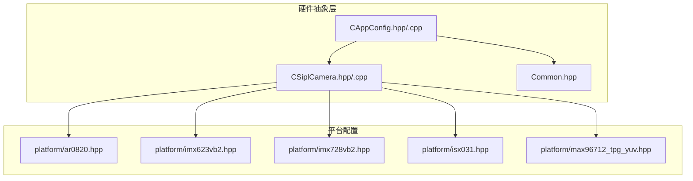
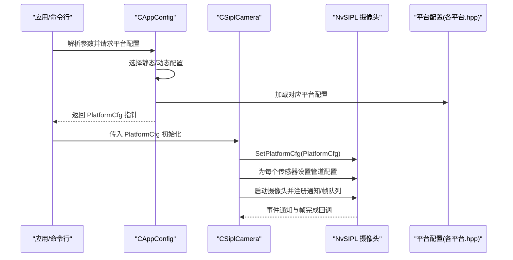
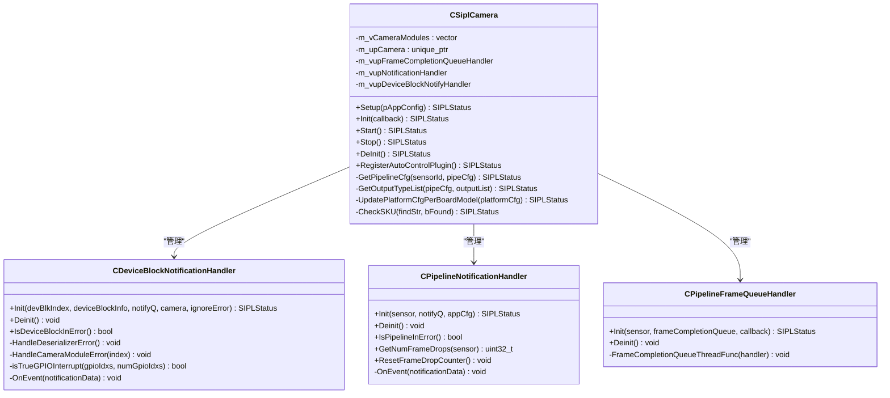
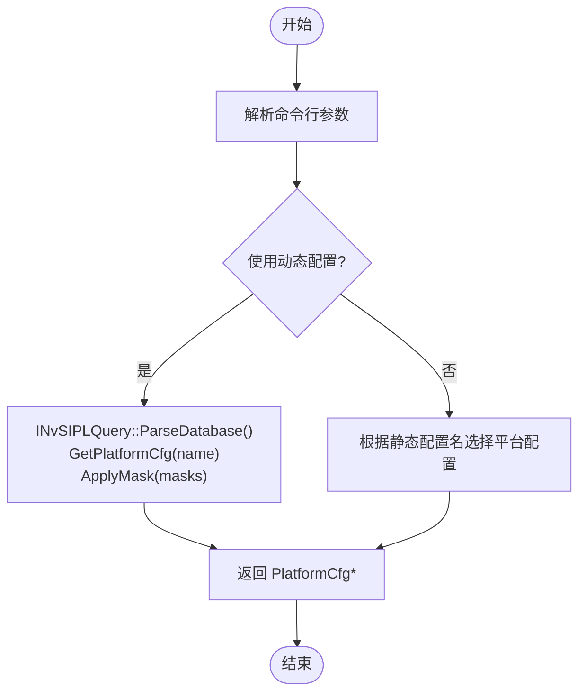
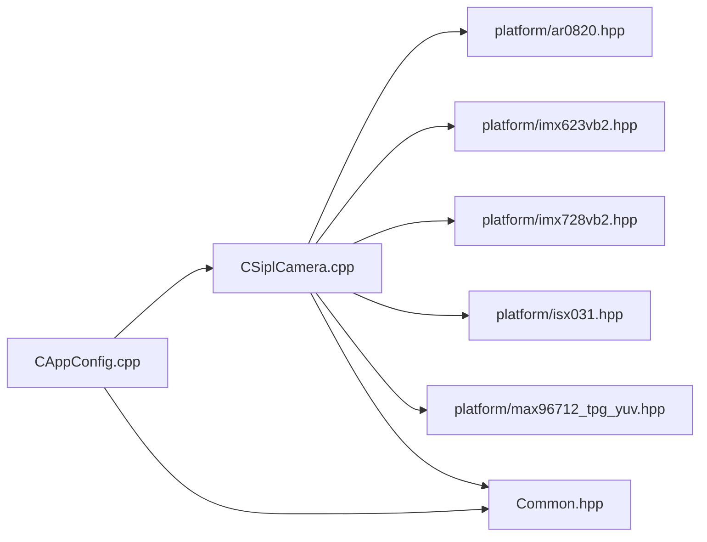

# 硬件平台支持

<cite>
**本文引用的文件**
- [ar0820.hpp](file://platform/ar0820.hpp)
- [imx623vb2.hpp](file://platform/imx623vb2.hpp)
- [imx728vb2.hpp](file://platform/imx728vb2.hpp)
- [isx031.hpp](file://platform/isx031.hpp)
- [max96712_tpg_yuv.hpp](file://platform/max96712_tpg_yuv.hpp)
- [CSiplCamera.hpp](file://CSiplCamera.hpp)
- [CSiplCamera.cpp](file://CSiplCamera.cpp)
- [CAppConfig.hpp](file://CAppConfig.hpp)
- [CAppConfig.cpp](file://CAppConfig.cpp)
- [Common.hpp](file://Common.hpp)
- [README.md](file://README.md)
</cite>

## 目录
1. [简介](#简介)
2. [项目结构](#项目结构)
3. [核心组件](#核心组件)
4. [架构总览](#架构总览)
5. [详细组件分析](#详细组件分析)
6. [依赖关系分析](#依赖关系分析)
7. [性能考虑](#性能考虑)
8. [故障排查指南](#故障排查指南)
9. [结论](#结论)
10. [附录：新硬件平台集成指南](#附录新硬件平台集成指南)

## 简介
本文件面向需要在多摄像头硬件平台上运行的开发者，系统性阐述该仓库中“硬件平台支持系统”的设计理念与实现机制。系统通过统一的硬件抽象层（HAL）接口，屏蔽不同摄像头传感器、串化器（Serializer）、解串器（Deserializer）及背板（如MAX96712）的差异，向上提供一致的平台配置模型与运行时控制流程。平台配置以结构化配置文件形式定义，覆盖设备块、相机模块、传感器、I²C地址、CSI端口、速率、GPIO、触发模式、嵌入式数据等关键参数。

## 项目结构
围绕硬件平台支持的关键目录与文件如下：
- 平台配置文件：位于 platform/ 目录，包含各摄像头平台的静态配置（AR0820、IMX623、IMX728、ISX031、MAX96712 TPG YUV）
- 摄像头抽象层：CSiplCamera 类负责加载平台配置、初始化 NvSIPL 摄像头管线、注册通知与帧完成队列处理
- 应用配置与选择：CAppConfig 负责根据命令行或动态查询选择具体平台配置，并提供分辨率与传感器类型查询
- 公共常量与类型：Common.hpp 定义了通用枚举、元素类型、最大数量等

**图表来源**
- [CSiplCamera.cpp:17-18](file://CSiplCamera.cpp#L17-L18)
- [CAppConfig.cpp:15-19](file://CAppConfig.cpp#L15-L19)
- [Common.hpp:14-86](file://Common.hpp#L14-L86)

**章节来源**
- [README.md:11-109](file://README.md#L11-L109)
- [Common.hpp:14-86](file://Common.hpp#L14-L86)

## 核心组件
- 平台配置结构体（PlatformCfg）：描述平台名称、描述、设备块数量与列表；每个设备块包含 CSI 端口、PHY 模式、I²C 设备、解串器信息、相机模块数量与列表、Deserializer/I²C/TX/电源端口、速率、GPIO、触发模式、是否组初始化等
- 相机模块信息（CameraModuleInfo）：包含模块名、链接索引、序列化器（Ser）、EEPROM、传感器（Sensor）等子结构
- 传感器通道信息（VCInfo）：包含 CFA 像素顺序、嵌入式上下行行数、输入格式、分辨率、帧率、是否启用嵌入式数据、触发模式等
- CSiplCamera：封装 NvSIPL 摄像头实例的生命周期管理、平台配置注入、管道配置、通知队列与帧完成队列处理、错误事件处理
- CAppConfig：解析命令行参数，选择静态或动态平台配置，提供分辨率查询与传感器类型判断

**章节来源**
- [CSiplCamera.hpp:46-85](file://CSiplCamera.hpp#L46-L85)
- [CAppConfig.hpp:19-82](file://CAppConfig.hpp#L19-L82)
- [CAppConfig.cpp:21-75](file://CAppConfig.cpp#L21-L75)

## 架构总览
下图展示了从应用配置到摄像头抽象层再到平台配置文件的整体调用链与职责分工：

**图表来源**
- [CAppConfig.cpp:21-75](file://CAppConfig.cpp#L21-L75)
- [CSiplCamera.cpp:209-287](file://CSiplCamera.cpp#L209-L287)

## 详细组件分析

### 平台配置文件结构与参数说明
平台配置文件以 C++ 静态变量形式定义 PlatformCfg 及其嵌套结构，关键字段含义如下：
- 平台标识与描述：platform、platformConfig、description
- 设备块：numDeviceBlocks、deviceBlockList[]
  - CSI 端口与PHY：csiPort、phyMode
  - I²C 设备：i2cDevice
  - 解串器：deserInfo（name、description、i2cAddress、errGpios、useCDIv2API）
  - 相机模块数量与列表：numCameraModules、cameraModuleInfoList[]
    - 模块名与描述：name、description
    - 链接索引：linkIndex
    - 序列化器：serInfo（name、description、i2cAddress、longCable、errGpios、useCDIv2API、serdesGPIOPinMappings）
    - EEPROM：isEEPROMSupported、eepromInfo（name、description、i2cAddress、useCDIv2API）
    - 传感器：sensorInfo（id、name、description、i2cAddress、vcInfo、isTriggerModeEnabled、errGpios、useCDIv2API）
      - VC 通道：vcInfo（cfa、embeddedTopLines、embeddedBottomLines、inputFormat、resolution、fps、isEmbeddedDataTypeEnabled）
  - Deser/I²C/TX/电源端口：desI2CPort、desTxPort、pwrPort
  - 速率：dphyRate[]、cphyRate[]
  - 其他：isPassiveModeEnabled、isGroupInitProg、gpios[]、isPwrCtrlDisabled、longCables[]、resetAll

典型平台文件示例与支持的摄像头型号：
- AR0820：RGGB RAW12，分辨率高、支持触发模式
- IMX623：RGGB RAW12RJ，分辨率适中
- IMX728：RGGB RAW12RJ，4K 分辨率
- ISX031：YUYV RAW 输出，用于 YUV 流
- MAX96712 TPG YUV：TPG 模式，可选不同分辨率

**章节来源**
- [ar0820.hpp:14-183](file://platform/ar0820.hpp#L14-L183)
- [imx623vb2.hpp:14-163](file://platform/imx623vb2.hpp#L14-L163)
- [imx728vb2.hpp:14-163](file://platform/imx728vb2.hpp#L14-L163)
- [isx031.hpp:14-117](file://platform/isx031.hpp#L14-L117)
- [max96712_tpg_yuv.hpp:14-125](file://platform/max96712_tpg_yuv.hpp#L14-L125)
- [max96712_tpg_yuv.hpp:127-238](file://platform/max96712_tpg_yuv.hpp#L127-L238)

### CSiplCamera 抽象层设计与实现
职责与流程：
- Setup：校验版本、加载平台配置、按设备块与模块收集相机模块列表
- Init：注入平台配置到 NvSIPL，为每个传感器设置管道配置（输出类型由传感器类型决定），注册通知与帧完成队列处理器
- Start/Stop/DeInit：启动/停止摄像头与资源回收
- 错误处理：设备块通知器与管道通知器分别处理解串器/序列化器/传感器错误，支持 GPIO 中断判定与详细错误缓冲读取
- 自动控制插件：非 YUV 传感器可注册自动控制插件（NITO）

**图表来源**
- [CSiplCamera.hpp:46-621](file://CSiplCamera.hpp#L46-L621)

**章节来源**
- [CSiplCamera.cpp:137-362](file://CSiplCamera.cpp#L137-L362)

### 应用配置与平台选择
- 动态配置：通过 NvSIPLQuery 解析数据库并按名称获取 PlatformCfg，支持掩码应用
- 静态配置：根据命令行指定的静态配置名映射到对应平台配置文件中的静态变量
- 辅助查询：提供分辨率查询与传感器类型判断（YUV/RAW）

**图表来源**
- [CAppConfig.cpp:21-75](file://CAppConfig.cpp#L21-L75)

**章节来源**
- [CAppConfig.cpp:21-109](file://CAppConfig.cpp#L21-L109)
- [CAppConfig.hpp:19-82](file://CAppConfig.hpp#L19-L82)

## 依赖关系分析
- CSiplCamera 依赖平台配置文件（platform/*.hpp）以获得硬件拓扑与参数
- CAppConfig 负责在运行时选择静态或动态平台配置，并向 CSiplCamera 提供 PlatformCfg
- Common.hpp 提供通用类型与常量，贯穿整个系统

**图表来源**
- [CSiplCamera.cpp:17-18](file://CSiplCamera.cpp#L17-L18)
- [CAppConfig.cpp:15-19](file://CAppConfig.cpp#L15-L19)
- [Common.hpp:14-86](file://Common.hpp#L14-L86)

**章节来源**
- [CSiplCamera.cpp:17-18](file://CSiplCamera.cpp#L17-L18)
- [CAppConfig.cpp:15-19](file://CAppConfig.cpp#L15-L19)
- [Common.hpp:14-86](file://Common.hpp#L14-L86)

## 性能考虑
- 多输出类型与多元素：根据传感器类型与多 ISP 输出开关，选择合适的输出类型（ICP/ISP0/ISP1），避免不必要的处理路径
- 帧完成队列与通知队列：采用线程轮询队列，注意超时与 EOF 处理，防止阻塞
- 触发模式与嵌入式数据：仅在需要时启用触发与嵌入式数据，减少额外开销
- GPIO 错误处理：通过 GPIO 中断判定区分真实中断与功能故障，避免误判导致的停机

[本节为通用建议，无需特定文件引用]

## 故障排查指南
- 版本不匹配：检查 NvSIPL 库与头文件版本一致性
- 设备块错误：查看解串器错误缓冲与远程错误标志，结合 GPIO 中断状态定位问题
- 传感器错误：逐个模块读取序列化器与传感器错误缓冲，确认 I²C 地址与连接
- 帧丢弃与中断：关注通知队列中的帧丢弃与中断告警，必要时降低负载或提升带宽
- 动态配置失败：确认查询数据库解析成功、掩码应用正确

**章节来源**
- [CSiplCamera.cpp:144-152](file://CSiplCamera.cpp#L144-L152)
- [CSiplCamera.hpp:149-216](file://CSiplCamera.hpp#L149-L216)
- [CSiplCamera.hpp:257-313](file://CSiplCamera.hpp#L257-L313)
- [CSiplCamera.hpp:414-482](file://CSiplCamera.hpp#L414-L482)

## 结论
该硬件平台支持系统通过“平台配置文件 + 硬件抽象层 + 应用配置”的分层设计，实现了对多种摄像头硬件平台的统一接入。平台配置文件以结构化方式描述硬件拓扑与参数，CSiplCamera 将这些配置注入到 NvSIPL 摄像头中并管理运行时事件与帧流，CAppConfig 则负责在运行时选择合适的平台配置。该设计便于扩展新的摄像头型号与硬件平台，同时保持上层接口稳定。

[本节为总结，无需特定文件引用]

## 附录：新硬件平台集成指南
- 新增平台配置文件
  - 在 platform/ 目录新增一个平台配置头文件，定义静态 PlatformCfg 变量，填写平台名称、设备块、模块、传感器、I²C 地址、CSI 端口、速率、GPIO、触发模式等
  - 参考现有文件结构：[ar0820.hpp](file://platform/ar0820.hpp)、[imx623vb2.hpp](file://platform/imx623vb2.hpp)、[imx728vb2.hpp](file://platform/imx728vb2.hpp)、[isx031.hpp](file://platform/isx031.hpp)、[max96712_tpg_yuv.hpp](file://platform/max96712_tpg_yuv.hpp)
- 在应用配置中注册
  - 在 CAppConfig::GetPlatformCfg 中增加静态配置名到新平台配置的映射分支
  - 参考：[CAppConfig.cpp:53-68](file://CAppConfig.cpp#L53-L68)
- 验证与测试
  - 使用命令行参数选择新平台配置进行验证
  - 关注版本一致性、错误事件处理与帧完成队列行为
  - 参考使用说明：[README.md:16-109](file://README.md#L16-L109)

**章节来源**
- [CAppConfig.cpp:53-68](file://CAppConfig.cpp#L53-L68)
- [README.md:16-109](file://README.md#L16-L109)