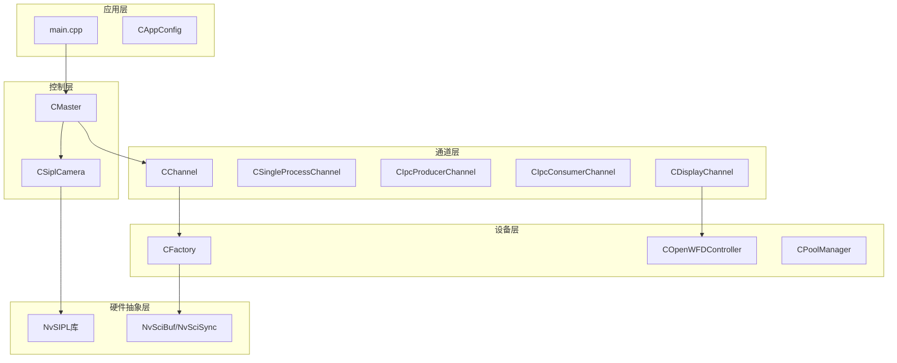
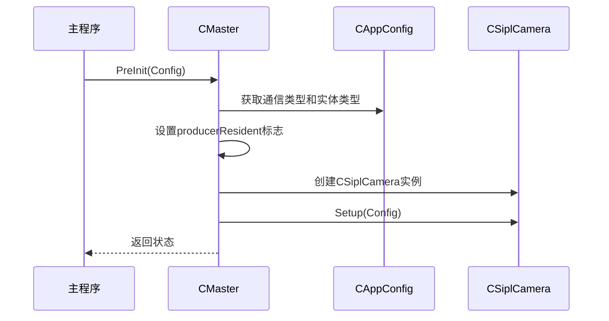
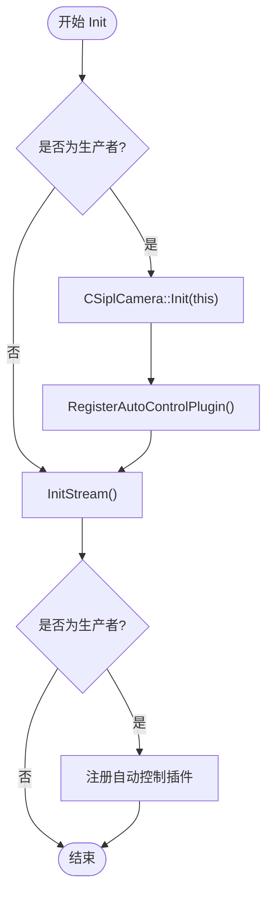
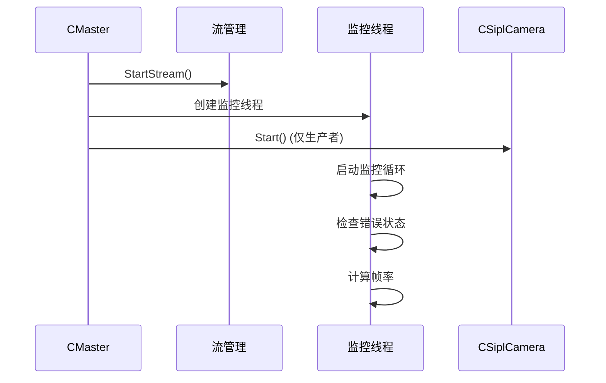
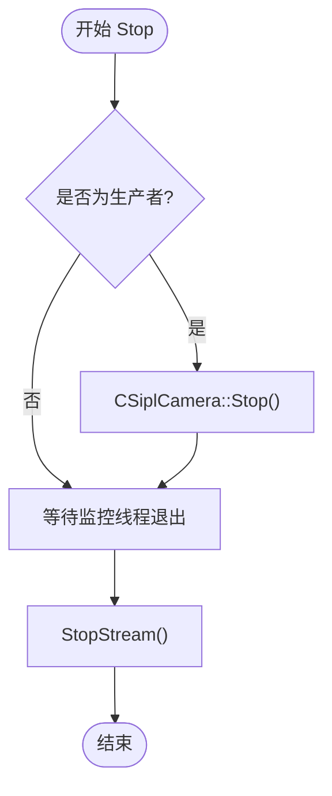
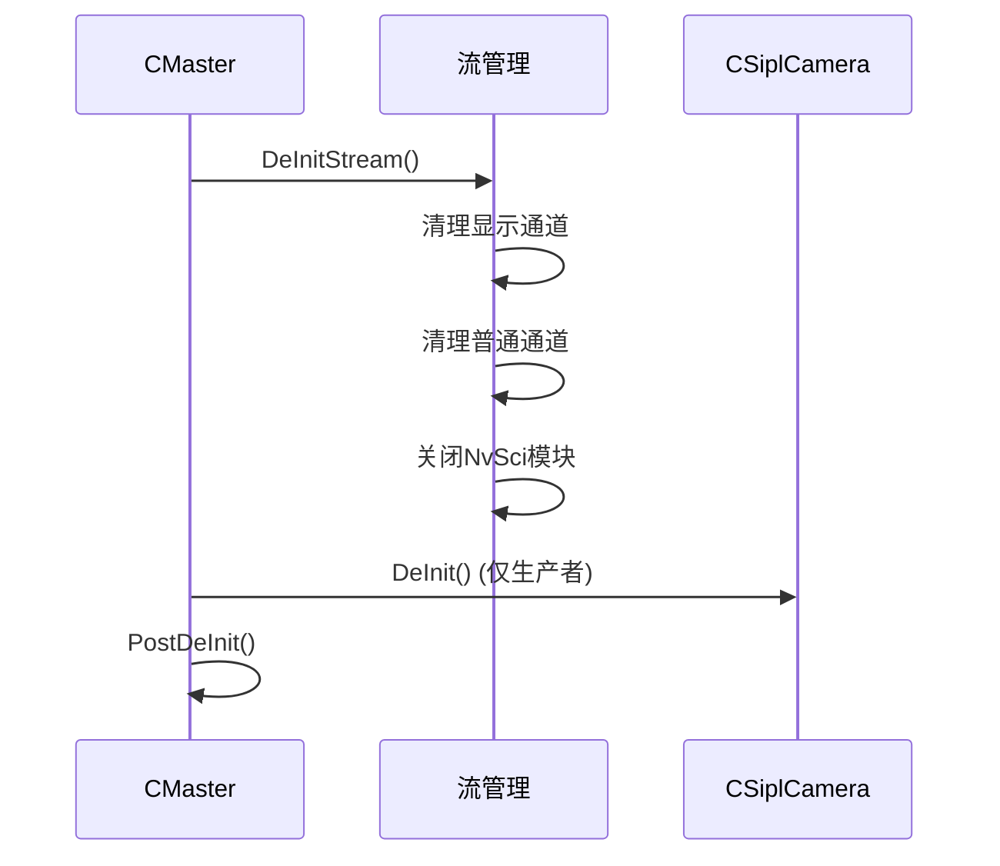
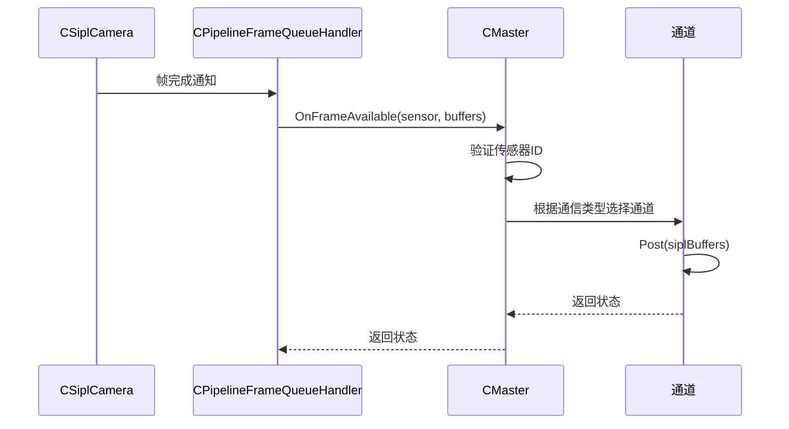
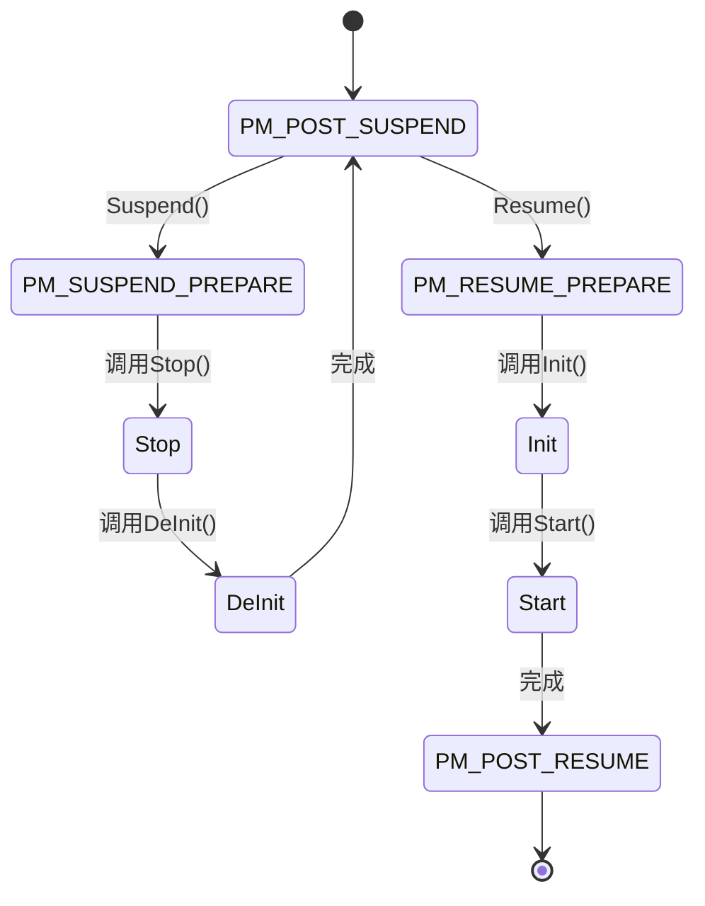
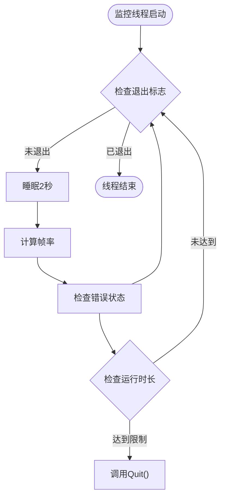
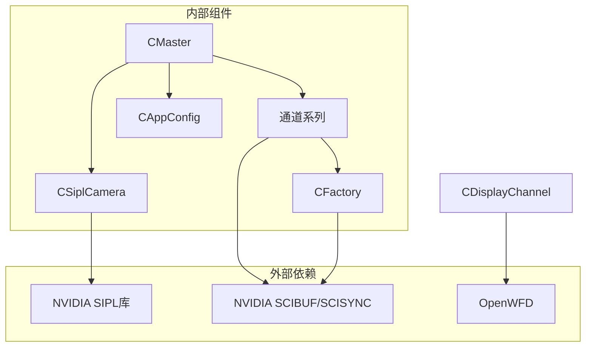

# 主控制器设计

<cite>
**本文档引用的文件**
- [CMaster.hpp](file://CMaster.hpp)
- [CMaster.cpp](file://CMaster.cpp)
- [CSiplCamera.hpp](file://CSiplCamera.hpp)
- [CSiplCamera.cpp](file://CSiplCamera.cpp)
- [CChannel.hpp](file://CChannel.hpp)
- [CDisplayChannel.hpp](file://CDisplayChannel.hpp)
- [CAppConfig.hpp](file://CAppConfig.hpp)
- [COpenWFDController.hpp](file://COpenWFDController.hpp)
- [CFactory.hpp](file://CFactory.hpp)
- [Common.hpp](file://Common.hpp)
- [main.cpp](file://main.cpp)
</cite>

## 目录
1. [简介](#简介)
2. [项目结构](#项目结构)
3. [核心组件](#核心组件)
4. [架构概览](#架构概览)
5. [详细组件分析](#详细组件分析)
6. [依赖关系分析](#依赖关系分析)
7. [性能考虑](#性能考虑)
8. [故障排除指南](#故障排除指南)
9. [结论](#结论)

## 简介

NVSIPL多播系统的主控制器(CMaster)是整个系统的核心协调器，负责管理多个传感器数据流、协调各个子系统的工作，并提供完整的生命周期管理。CMaster继承自CSiplCamera::ICallback接口，实现了基于回调的帧数据处理机制，确保系统能够实时响应摄像头数据流。

该控制器采用模块化设计，支持多种通信模式（进程内、进程间、芯片间），并集成了电源管理功能，能够在系统暂停和恢复时自动重新配置资源。通过监控线程实现运行时状态监控和错误检测，确保系统的稳定性和可靠性。

## 项目结构

NVSIPL多播系统采用分层架构设计，主要包含以下层次：



**图表来源**
- [main.cpp:253-304](file://main.cpp#L253-L304)
- [CMaster.hpp:47-92](file://CMaster.hpp#L47-L92)
- [CSiplCamera.hpp:46-85](file://CSiplCamera.hpp#L46-L85)

**章节来源**
- [main.cpp:253-304](file://main.cpp#L253-L304)
- [CMaster.hpp:16-29](file://CMaster.hpp#L16-L29)
- [Common.hpp:14-46](file://Common.hpp#L14-L46)

## 核心组件

### 主控制器(CMaster)

CMaster是系统的核心控制器，负责：
- 生命周期管理：PreInit、Init、Start、Stop、DeInit、PostDeInit
- 回调机制：实现CSiplCamera::ICallback接口处理帧数据
- 资源管理：管理摄像头、通道、显示管道等资源
- 电源管理：支持系统暂停和恢复功能
- 监控功能：通过独立线程监控系统状态

### 摄像头管理(CSiplCamera)

CSiplCamera封装了NVIDIA SIPL库的使用，提供：
- 摄像头初始化和配置
- 管线管理（Capture、ISP、ACPIP等）
- 通知队列处理（设备块、管线事件）
- 自动控制插件注册

### 通道管理(CChannel系列)

系统提供了多种通道类型以适应不同的通信需求：
- **CSingleProcessChannel**：进程内通信
- **CIpcProducerChannel/CIpcConsumerChannel**：进程间生产者/消费者
- **CC2cProducerChannel/CC2cConsumerChannel**：芯片间通信
- **CDisplayChannel**：显示专用通道

**章节来源**
- [CMaster.hpp:47-92](file://CMaster.hpp#L47-L92)
- [CSiplCamera.hpp:46-85](file://CSiplCamera.hpp#L46-L85)
- [CChannel.hpp:28-157](file://CChannel.hpp#L28-L157)

## 架构概览

CMaster采用分层架构设计，实现了清晰的关注点分离：

```mermaid
classDiagram
class CMaster {
+PreInit(config)
+Init()
+Start()
+Stop()
+DeInit()
+PostDeInit()
+OnFrameAvailable(sensor, buffers)
+Suspend()
+Resume()
-MonitorThreadFunc()
-CreateChannel()
-CreateDisplayChannel()
-StartStream()
-StopStream()
-InitStream()
-DeInitStream()
}
class CSiplCamera {
+Setup(config)
+Init(callback)
+Start()
+Stop()
+DeInit()
+RegisterAutoControlPlugin()
}
class CChannel {
<<abstract>>
+CreateBlocks(profiler)
+Connect()
+InitBlocks()
+Deinit()
+Reconcile()
+Start()
+Stop()
}
class CDisplayChannel {
+CreatePipeline()
+Connect()
+InitBlocks()
+Deinit()
+GetDisplayProducer()
}
class CAppConfig {
+GetCommType()
+GetEntityType()
+IsStitchingDisplayEnabled()
+IsYUVSensor()
+GetRunDurationSec()
}
class COpenWFDController {
+InitResource()
+CreateWFDSource()
+SetDisplayNvSciBufAttributes()
+Flip()
+DeInit()
}
CMaster --|> CSiplCamera : : ICallback
CMaster --> CSiplCamera
CMaster --> CChannel
CChannel <|-- CDisplayChannel
CMaster --> CAppConfig
CDisplayChannel --> COpenWFDController
```

**图表来源**
- [CMaster.hpp:47-92](file://CMaster.hpp#L47-L92)
- [CSiplCamera.hpp:46-85](file://CSiplCamera.hpp#L46-L85)
- [CChannel.hpp:28-44](file://CChannel.hpp#L28-L44)
- [CDisplayChannel.hpp:19-40](file://CDisplayChannel.hpp#L19-L40)
- [CAppConfig.hpp:19-52](file://CAppConfig.hpp#L19-L52)

## 详细组件分析

### 生命周期管理

CMaster实现了完整的生命周期管理，确保系统能够正确初始化和清理：

#### 预初始化阶段(PreInit)


**图表来源**
- [CMaster.cpp:164-182](file://CMaster.cpp#L164-L182)
- [CSiplCamera.cpp:137-169](file://CSiplCamera.cpp#L137-L169)

#### 初始化阶段(Init)


**图表来源**
- [CMaster.cpp:195-216](file://CMaster.cpp#L195-L216)
- [CSiplCamera.cpp:209-287](file://CSiplCamera.cpp#L209-L287)

#### 启动阶段(Start)


**图表来源**
- [CMaster.cpp:234-253](file://CMaster.cpp#L234-L253)
- [CMaster.cpp:354-403](file://CMaster.cpp#L354-L403)

#### 停止阶段(Stop)


**图表来源**
- [CMaster.cpp:255-275](file://CMaster.cpp#L255-L275)

#### 清理阶段(DeInit/PostDeInit)


**图表来源**
- [CMaster.cpp:218-232](file://CMaster.cpp#L218-L232)
- [CMaster.cpp:184-193](file://CMaster.cpp#L184-L193)

### 回调机制实现

CMaster实现了CSiplCamera::ICallback接口，用于处理来自摄像头的数据帧：



**图表来源**
- [CSiplCamera.hpp:49-57](file://CSiplCamera.hpp#L49-L57)
- [CMaster.cpp:405-424](file://CMaster.cpp#L405-L424)

**章节来源**
- [CMaster.cpp:164-232](file://CMaster.cpp#L164-L232)
- [CMaster.cpp:405-424](file://CMaster.cpp#L405-L424)
- [CSiplCamera.cpp:209-287](file://CSiplCamera.cpp#L209-L287)

### 电源管理状态处理

CMaster支持完整的电源管理功能，包括暂停和恢复：



**图表来源**
- [CMaster.hpp:36-42](file://CMaster.hpp#L36-L42)
- [CMaster.cpp:282-318](file://CMaster.cpp#L282-L318)

### 监控线程功能

监控线程负责运行时状态监控和错误检测：



**图表来源**
- [CMaster.cpp:354-403](file://CMaster.cpp#L354-L403)

**章节来源**
- [CMaster.cpp:354-403](file://CMaster.cpp#L354-L403)
- [CMaster.hpp:36-42](file://CMaster.hpp#L36-L42)

## 依赖关系分析

CMaster与各个组件之间的依赖关系如下：



**图表来源**
- [CMaster.hpp:16-29](file://CMaster.hpp#L16-L29)
- [CSiplCamera.hpp:18-30](file://CSiplCamera.hpp#L18-L30)
- [CFactory.hpp:12-22](file://CFactory.hpp#L12-L22)

**章节来源**
- [CMaster.hpp:16-29](file://CMaster.hpp#L16-L29)
- [CSiplCamera.hpp:18-30](file://CSiplCamera.hpp#L18-L30)
- [CFactory.hpp:12-22](file://CFactory.hpp#L12-L22)

## 性能考虑

### 并发设计
- **多线程架构**：每个通道都有独立的事件处理线程
- **异步处理**：使用NvSci同步原语实现高效的跨进程通信
- **零拷贝传输**：通过NvSciBuf实现内存共享，避免数据复制开销

### 内存管理
- **智能指针**：使用std::unique_ptr和std::shared_ptr管理资源生命周期
- **RAII原则**：所有资源在析构函数中自动释放
- **池化管理**：使用CPoolManager复用缓冲区，减少内存分配开销

### 错误处理
- **原子操作**：使用std::atomic<bool>确保线程安全的状态访问
- **异常安全**：所有公共接口都返回SIPLStatus状态码
- **超时机制**：为所有阻塞操作设置合理的超时时间

## 故障排除指南

### 常见问题及解决方案

#### 初始化失败
**症状**：系统无法启动
**可能原因**：
- 配置参数错误
- 硬件设备不可用
- 权限不足

**解决步骤**：
1. 检查CAppConfig配置
2. 验证硬件连接
3. 查看日志输出
4. 确认权限设置

#### 运行时错误
**症状**：系统运行中出现异常停止
**可能原因**：
- 设备块错误
- 管线错误
- 内存不足

**诊断方法**：
1. 检查监控线程输出
2. 查看错误通知队列
3. 分析帧丢弃统计
4. 监控内存使用情况

#### 电源管理问题
**症状**：暂停/恢复功能失效
**可能原因**：
- 状态机不一致
- 资源清理不完整
- 线程同步问题

**调试建议**：
1. 检查PMStatus状态变化
2. 验证资源释放顺序
3. 确认线程安全访问
4. 查看日志中的状态转换

**章节来源**
- [CMaster.cpp:382-400](file://CMaster.cpp#L382-L400)
- [CSiplCamera.cpp:289-323](file://CSiplCamera.cpp#L289-L323)

## 结论

CMaster作为NVSIPL多播系统的核心控制器，展现了优秀的软件架构设计：

### 设计优势
- **模块化设计**：清晰的层次结构和职责分离
- **扩展性**：支持多种通信模式和设备类型
- **可靠性**：完善的错误处理和监控机制
- **性能优化**：高效的并发处理和内存管理

### 关键特性
- 完整的生命周期管理
- 强大的回调机制
- 全面的电源管理支持
- 实时监控和诊断能力

### 最佳实践
1. 正确配置CAppConfig参数
2. 监控系统状态和性能指标
3. 及时处理错误和异常
4. 合理使用资源管理工具

CMaster的设计为NVSIPL多播系统提供了稳定可靠的基础，能够满足复杂多传感器环境下的高性能视频处理需求。