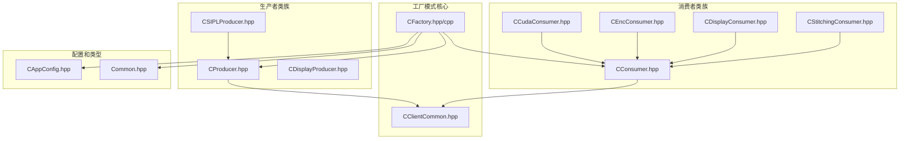
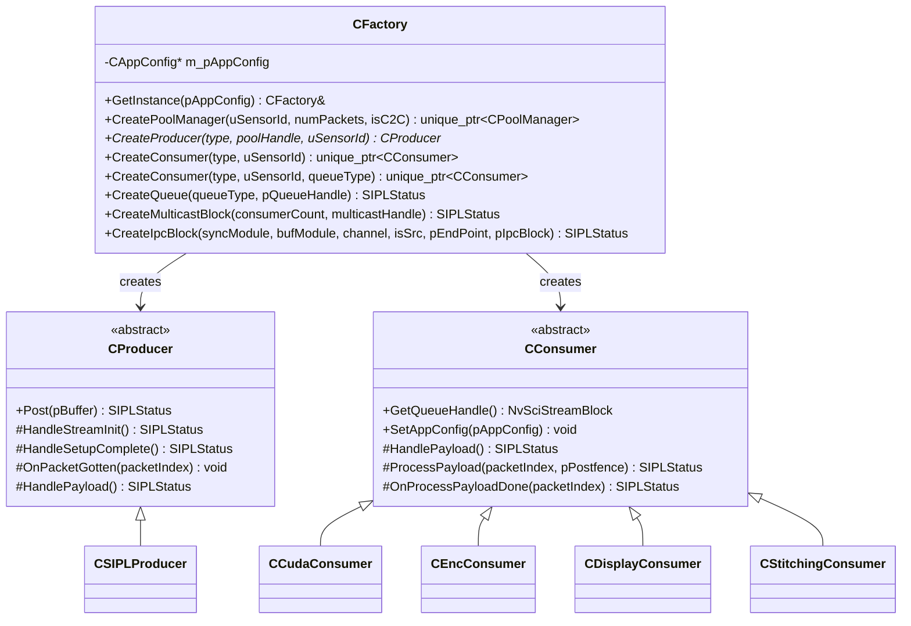
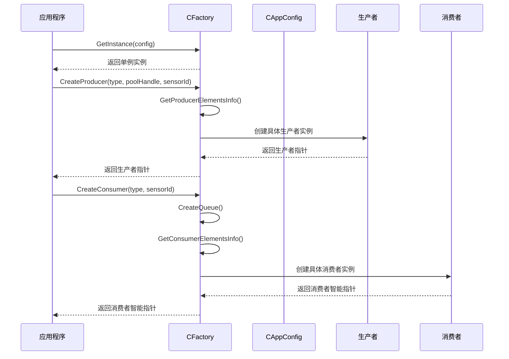
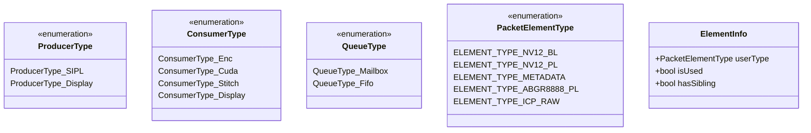
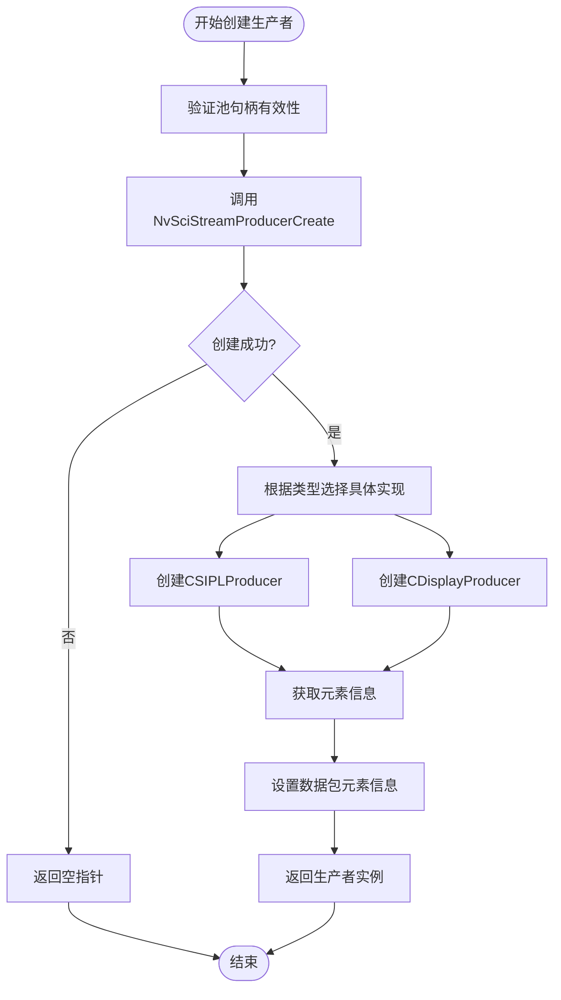
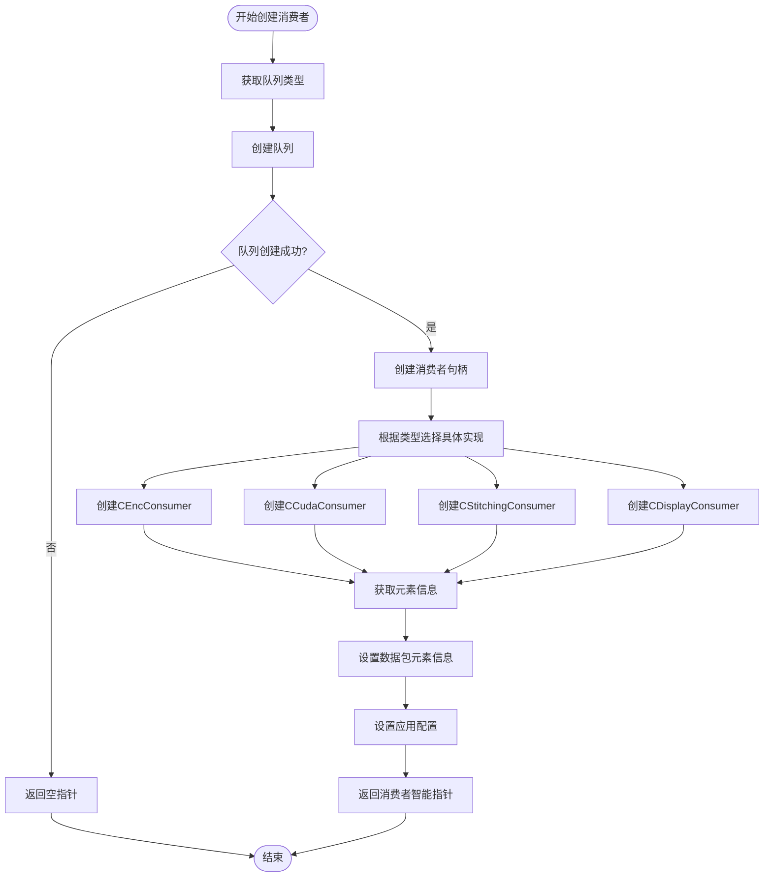
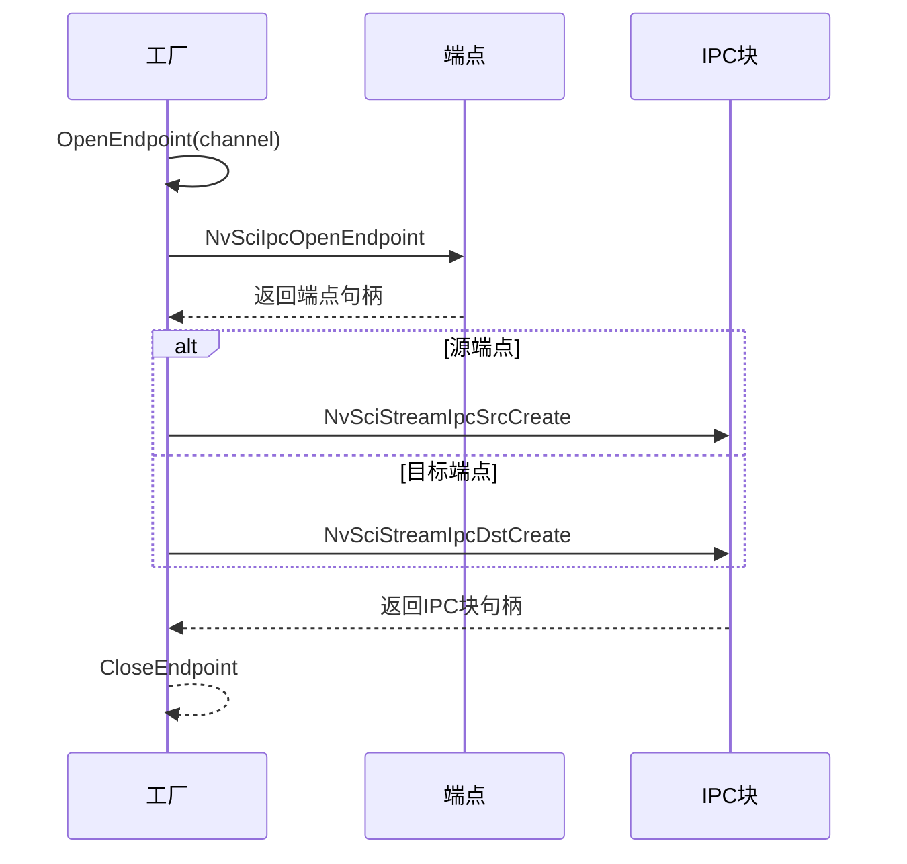
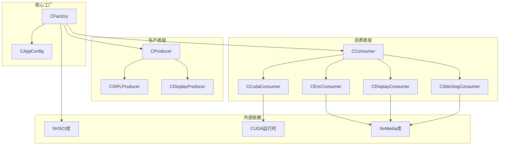

# 工厂模式实现

<cite>
**本文档引用的文件**
- [CFactory.hpp](file://CFactory.hpp)
- [CFactory.cpp](file://CFactory.cpp)
- [CProducer.hpp](file://CProducer.hpp)
- [CConsumer.hpp](file://CConsumer.hpp)
- [CSIPLProducer.hpp](file://CSIPLProducer.hpp)
- [CCudaConsumer.hpp](file://CCudaConsumer.hpp)
- [CEncConsumer.hpp](file://CEncConsumer.hpp)
- [CDisplayConsumer.hpp](file://CDisplayConsumer.hpp)
- [CStitchingConsumer.hpp](file://CStitchingConsumer.hpp)
- [CClientCommon.hpp](file://CClientCommon.hpp)
- [Common.hpp](file://Common.hpp)
- [CAppConfig.hpp](file://CAppConfig.hpp)
- [main.cpp](file://main.cpp)
</cite>

## 目录
1. [简介](#简介)
2. [项目结构](#项目结构)
3. [核心组件](#核心组件)
4. [架构概览](#架构概览)
5. [详细组件分析](#详细组件分析)
6. [依赖分析](#依赖分析)
7. [性能考虑](#性能考虑)
8. [故障排除指南](#故障排除指南)
9. [结论](#结论)

## 简介

NVSIPL多播系统采用工厂模式实现了生产者和消费者的统一创建和管理。该工厂模式通过单一接口管理多种不同类型的生产者和消费者实例，显著提高了系统的可扩展性和可维护性。

工厂模式在系统中的主要应用场景包括：
- 不同类型生产者的创建（如CSIPLProducer、CDisplayProducer等）
- 不同类型消费者的创建（如CCudaConsumer、CEncConsumer等）
- 统一的资源管理和生命周期控制

通过工厂模式，系统能够根据配置动态选择合适的生产者或消费者类型，同时保持客户端代码的简洁性和一致性。

## 项目结构

NVSIPL多播系统的工厂模式实现位于multicast目录下，主要包含以下关键文件：

**图表来源**
- [CFactory.hpp:27-92](file://CFactory.hpp#L27-L92)
- [CProducer.hpp:16-51](file://CProducer.hpp#L16-L51)
- [CConsumer.hpp:16-43](file://CConsumer.hpp#L16-L43)

**章节来源**
- [CFactory.hpp:1-95](file://CFactory.hpp#L1-L95)
- [CFactory.cpp:1-315](file://CFactory.cpp#L1-L315)

## 核心组件

### CFactory类设计思想

CFactory类采用了单例模式和工厂模式相结合的设计理念：

1. **单例模式**：通过静态GetInstance方法确保全局唯一实例
2. **工厂模式**：提供统一的对象创建接口，隐藏具体类的构造细节
3. **配置驱动**：通过CAppConfig参数化不同类型的创建行为

### 关键接口分析

工厂类提供了以下核心接口：

**图表来源**
- [CFactory.hpp:27-92](file://CFactory.hpp#L27-L92)
- [CProducer.hpp:16-51](file://CProducer.hpp#L16-L51)
- [CConsumer.hpp:16-43](file://CConsumer.hpp#L16-L43)

**章节来源**
- [CFactory.hpp:27-92](file://CFactory.hpp#L27-L92)
- [CClientCommon.hpp:47-200](file://CClientCommon.hpp#L47-L200)

## 架构概览

工厂模式在整个系统架构中扮演着核心协调者的角色：

**图表来源**
- [CFactory.cpp:68-94](file://CFactory.cpp#L68-L94)
- [CFactory.cpp:166-205](file://CFactory.cpp#L166-L205)

### 类型系统设计

系统通过枚举类型定义了完整的类型体系：

**图表来源**
- [Common.hpp:48-84](file://Common.hpp#L48-L84)

**章节来源**
- [Common.hpp:35-86](file://Common.hpp#L35-L86)

## 详细组件分析

### 生产者工厂实现

生产者工厂通过CreateProducer方法实现了灵活的生产者创建：

#### 生产者创建流程

**图表来源**
- [CFactory.cpp:68-94](file://CFactory.cpp#L68-L94)

#### 元素信息管理

工厂类通过GetProducerElementsInfo方法管理不同生产者类型的元素需求：

| 生产者类型 | 使用的元素 | 特殊属性 |
|-----------|-----------|----------|
| ProducerType_SIPL | ICP_RAW, METADATA, NV12_BL | NV12_BL有兄弟元素 |
| ProducerType_Display | ABGR8888_PL | 专用显示格式 |

**章节来源**
- [CFactory.cpp:44-66](file://CFactory.cpp#L44-L66)
- [CFactory.cpp:68-94](file://CFactory.cpp#L68-L94)

### 消费者工厂实现

消费者工厂提供了两种重载的CreateConsumer方法，支持不同的配置方式：

#### 消费者创建流程

**图表来源**
- [CFactory.cpp:166-205](file://CFactory.cpp#L166-L205)

#### 消费者类型特性

| 消费者类型 | 主要用途 | 元素需求 | 特殊功能 |
|-----------|----------|----------|----------|
| ConsumerType_Enc | 编码输出 | NV12_BL 或 ICP_RAW | H.264编码 |
| ConsumerType_Cuda | CUDA处理 | NV12_BL 或 NV12_PL | GPU加速处理 |
| ConsumerType_Stitch | 图像拼接 | NV12_BL | 多图像合成 |
| ConsumerType_Display | 显示输出 | NV12_BL 或 ABGR8888_PL | 屏幕显示 |

**章节来源**
- [CFactory.cpp:96-136](file://CFactory.cpp#L96-L136)
- [CFactory.cpp:171-205](file://CFactory.cpp#L171-L205)

### IPC通信工厂

工厂类还提供了完整的IPC通信创建能力：

#### IPC块创建流程

**图表来源**
- [CFactory.cpp:243-263](file://CFactory.cpp#L243-L263)

**章节来源**
- [CFactory.cpp:223-314](file://CFactory.cpp#L223-L314)

## 依赖分析

### 组件耦合关系

**图表来源**
- [CFactory.hpp:12-22](file://CFactory.hpp#L12-L22)
- [CCudaConsumer.hpp:16-24](file://CCudaConsumer.hpp#L16-L24)
- [CEncConsumer.hpp:12-16](file://CEncConsumer.hpp#L12-L16)

### 错误处理机制

工厂模式实现了完善的错误处理策略：

1. **早期失败检测**：在每个创建步骤后检查返回状态
2. **资源清理**：失败时自动清理已分配的资源
3. **日志记录**：详细的错误信息记录便于调试
4. **优雅降级**：部分失败时尽可能保持系统稳定性

**章节来源**
- [CFactory.cpp:11-22](file://CFactory.cpp#L11-L22)
- [CFactory.cpp:74-78](file://CFactory.cpp#L74-L78)

## 性能考虑

### 内存管理优化

工厂模式在内存管理方面采用了多项优化措施：

1. **智能指针使用**：消费者对象使用unique_ptr确保自动内存管理
2. **延迟初始化**：生产者和消费者按需初始化，避免不必要的资源占用
3. **对象池复用**：通过CPoolManager实现缓冲区的高效复用

### 并发安全性

系统在并发环境下保证了工厂模式的安全性：

1. **线程安全单例**：GetInstance方法使用静态局部变量确保线程安全
2. **原子操作**：关键共享数据使用std::atomic保证原子访问
3. **无锁设计**：避免了复杂的锁机制，提高并发性能

## 故障排除指南

### 常见问题诊断

#### 生产者创建失败

**可能原因**：
- NvSciStreamProducerCreate调用失败
- 配置参数不正确
- 资源不足

**解决方法**：
1. 检查NvSci库版本兼容性
2. 验证传感器ID的有效性
3. 确认内存和GPU资源充足

#### 消费者创建异常

**可能原因**：
- 队列创建失败
- 元素信息配置错误
- IPC连接问题

**解决方法**：
1. 检查队列类型设置
2. 验证元素使用标志
3. 确认IPC通道可用性

**章节来源**
- [CFactory.cpp:138-151](file://CFactory.cpp#L138-L151)
- [CFactory.cpp:171-181](file://CFactory.cpp#L171-L181)

## 结论

NVSIPL多播系统的工厂模式实现展现了现代C++设计的最佳实践：

### 设计优势

1. **高内聚低耦合**：工厂类集中管理对象创建逻辑，降低客户端复杂度
2. **可扩展性强**：新增生产者或消费者类型只需修改工厂类，不影响现有代码
3. **配置灵活**：通过CAppConfig实现运行时配置调整
4. **资源管理完善**：自动化的资源分配和释放机制

### 架构价值

工厂模式在整个NVSIPL架构中发挥着关键作用：
- **抽象化复杂性**：隐藏底层NVSCI和硬件相关的复杂实现
- **统一接口**：为上层应用提供一致的对象创建体验
- **增强可测试性**：便于单元测试和集成测试的进行

通过这种设计，NVSIPL多播系统不仅实现了高度的模块化和可维护性，还为未来的功能扩展奠定了坚实的基础。