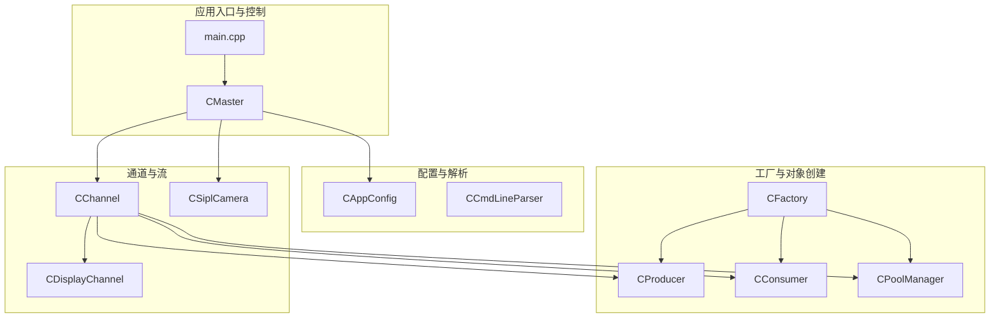
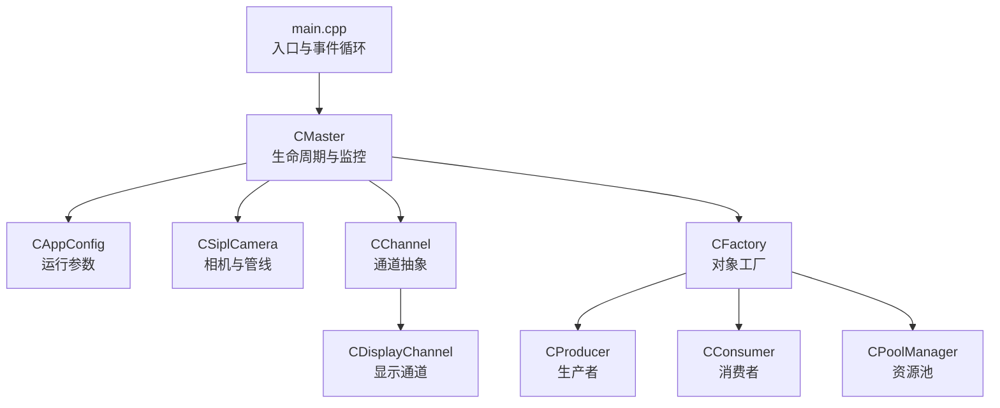
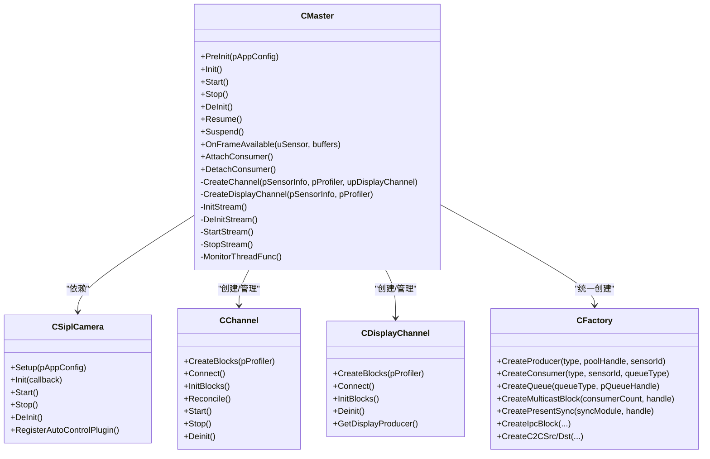
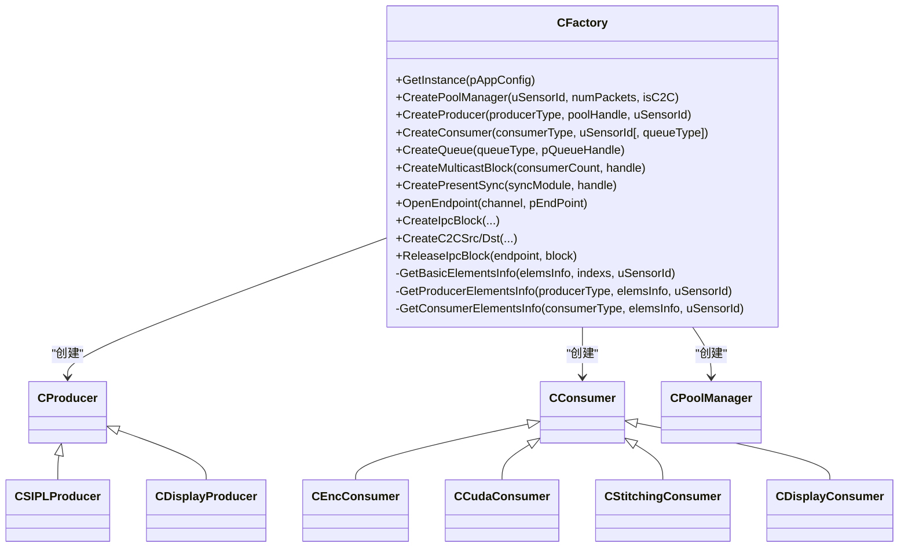
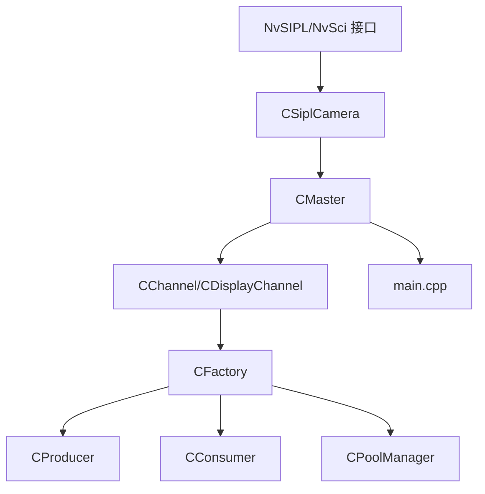
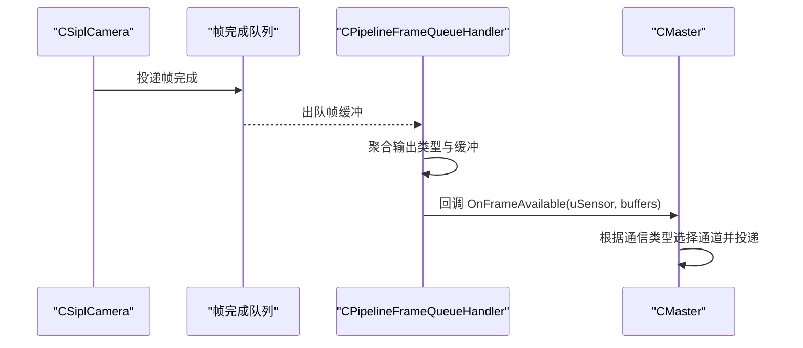
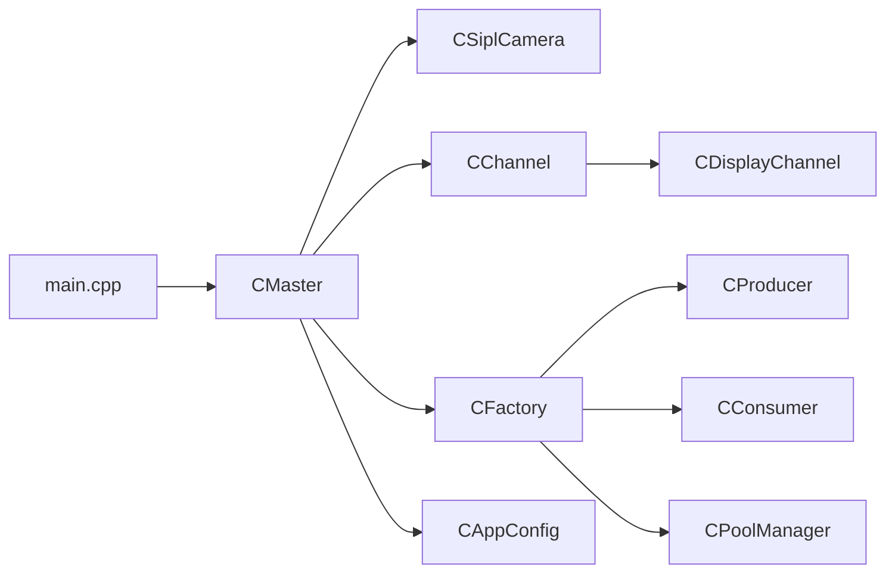
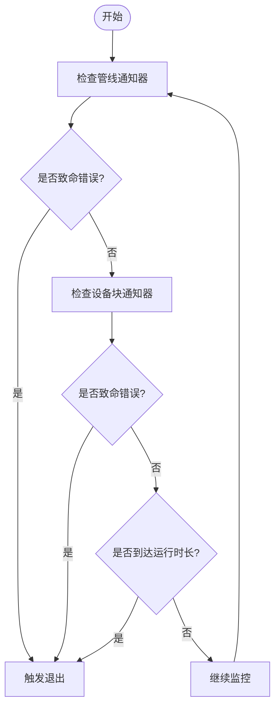

# 系统架构设计

<cite>
**本文引用的文件**   
- [main.cpp](file://main.cpp)
- [CMaster.hpp](file://CMaster.hpp)
- [CMaster.cpp](file://CMaster.cpp)
- [CFactory.hpp](file://CFactory.hpp)
- [CFactory.cpp](file://CFactory.cpp)
- [CAppConfig.hpp](file://CAppConfig.hpp)
- [CChannel.hpp](file://CChannel.hpp)
- [CDisplayChannel.hpp](file://CDisplayChannel.hpp)
- [CSiplCamera.hpp](file://CSiplCamera.hpp)
- [Common.hpp](file://Common.hpp)
- [CConsumer.hpp](file://CConsumer.hpp)
- [CProducer.hpp](file://CProducer.hpp)
- [CPoolManager.hpp](file://CPoolManager.hpp)
</cite>

## 目录
1. [引言](#引言)
2. [项目结构](#项目结构)
3. [核心组件](#核心组件)
4. [架构总览](#架构总览)
5. [详细组件分析](#详细组件分析)
6. [依赖分析](#依赖分析)
7. [性能考虑](#性能考虑)
8. [故障排查指南](#故障排查指南)
9. [结论](#结论)
10. [附录](#附录)

## 引言
本文件面向NVSIPL多播系统，提供系统架构设计文档，重点阐述主控制器(CMaster)的设计理念与核心职责、工厂模式的实现机制、分层架构（从硬件抽象层到应用层）的设计思路，以及核心设计模式（如观察者模式、策略模式）在系统中的具体体现。文档通过架构图与组件交互关系，帮助开发者快速理解系统整体设计。

## 项目结构
该工程采用按功能域划分的模块化组织方式，核心模块包括：
- 应用入口与控制：main.cpp、CMaster
- 配置与命令行解析：CAppConfig、CCmdLineParser
- 工厂与对象创建：CFactory
- 通道与流管理：CChannel及其派生（单进程/跨进程/跨芯片）
- 显示通道：CDisplayChannel
- 摄像头与管线：CSiplCamera（含通知与帧队列处理）
- 生产者/消费者模型：CProducer、CConsumer
- 资源池与事件处理：CPoolManager、CEventHandler
- 通用常量与类型：Common.hpp

**图表来源**
- [main.cpp:253-304](file://main.cpp#L253-L304)
- [CMaster.hpp:46-92](file://CMaster.hpp#L46-L92)
- [CFactory.hpp:27-92](file://CFactory.hpp#L27-L92)
- [CChannel.hpp:28-154](file://CChannel.hpp#L28-L154)
- [CDisplayChannel.hpp:19-223](file://CDisplayChannel.hpp#L19-L223)
- [CSiplCamera.hpp:46-85](file://CSiplCamera.hpp#L46-L85)

**章节来源**
- [main.cpp:253-304](file://main.cpp#L253-L304)
- [CMaster.hpp:46-92](file://CMaster.hpp#L46-L92)
- [CFactory.hpp:27-92](file://CFactory.hpp#L27-L92)
- [CChannel.hpp:28-154](file://CChannel.hpp#L28-L154)
- [CDisplayChannel.hpp:19-223](file://CDisplayChannel.hpp#L19-L223)
- [CSiplCamera.hpp:46-85](file://CSiplCamera.hpp#L46-L85)

## 核心组件
- 主控制器(CMaster)
  - 职责：统一生命周期管理（预初始化、初始化、启动、停止、反初始化）、监控线程、电源管理（挂起/恢复）、通道与显示通道创建、帧回调转发。
  - 关键方法：PreInit、Init、Start、Stop、DeInit、Resume、Suspend、OnFrameAvailable、Attach/DetachConsumer。
- 工厂(CFactory)
  - 职责：集中创建生产者、消费者、队列、多播块、同步对象、IPC/C2C块；根据配置与传感器类型决定元素使用情况。
  - 关键方法：CreateProducer、CreateConsumer、CreateQueue、CreateMulticastBlock、CreatePresentSync、CreateIpcBlock/C2C等。
- 配置(CAppConfig)
  - 职责：封装通信类型、实体类型、消费者类型、队列类型、显示开关、多元素开关、延迟附加开关、运行时长等参数。
- 通道(CChannel)
  - 职责：抽象通道接口，定义创建块、连接、初始化块、运行/停止、事件线程管理等。
- 显示通道(CDisplayChannel)
  - 职责：构建显示管线（池、显示生产者、显示消费者），支持单播或多播连接。
- 摄像头(CSiplCamera)
  - 职责：设置平台/管道配置、启动/停止、注册自动控制插件；维护设备块与管线的通知处理器及帧完成队列处理器。
- 生产者/消费者(CProducer/CConsumer)
  - 职责：生产者负责映射负载、插入前同步栅、投递缓冲；消费者负责映射元数据/有效载荷、处理帧、释放资源。
- 资源池(CPoolManager)
  - 职责：管理包元素属性、缓冲区、多播连接、延迟消费者辅助器。

**章节来源**
- [CMaster.hpp:46-92](file://CMaster.hpp#L46-L92)
- [CMaster.cpp:164-318](file://CMaster.cpp#L164-L318)
- [CFactory.hpp:27-92](file://CFactory.hpp#L27-L92)
- [CFactory.cpp:68-205](file://CFactory.cpp#L68-L205)
- [CAppConfig.hpp:19-80](file://CAppConfig.hpp#L19-L80)
- [CChannel.hpp:28-154](file://CChannel.hpp#L28-L154)
- [CDisplayChannel.hpp:19-223](file://CDisplayChannel.hpp#L19-L223)
- [CSiplCamera.hpp:46-85](file://CSiplCamera.hpp#L46-L85)
- [CProducer.hpp:16-51](file://CProducer.hpp#L16-L51)
- [CConsumer.hpp:16-43](file://CConsumer.hpp#L16-L43)
- [CPoolManager.hpp:33-68](file://CPoolManager.hpp#L33-L68)

## 架构总览
系统采用“主控制器驱动 + 工厂统一创建 + 多通道并行”的分层架构：
- 应用层：main.cpp负责命令行解析、信号处理、输入/套接字事件循环，调用CMaster进行生命周期管理。
- 控制层：CMaster协调CSiplCamera、通道与显示通道，负责NvSci资源的打开/关闭、通道连接与初始化、事件监控。
- 通道层：CChannel抽象不同通信类型的通道（单进程/跨进程/跨芯片），CDisplayChannel扩展显示管线。
- 对象创建层：CFactory根据配置与类型选择性启用元素，创建生产者/消费者、队列、多播与IPC/C2C块。
- 设备/管线层：CSiplCamera负责NvSIPL相机与管线的初始化、启动、错误通知与帧完成队列处理。

**图表来源**
- [main.cpp:253-304](file://main.cpp#L253-L304)
- [CMaster.cpp:164-318](file://CMaster.cpp#L164-L318)
- [CFactory.cpp:68-205](file://CFactory.cpp#L68-L205)
- [CChannel.hpp:28-154](file://CChannel.hpp#L28-L154)
- [CDisplayChannel.hpp:19-223](file://CDisplayChannel.hpp#L19-L223)
- [CSiplCamera.hpp:46-85](file://CSiplCamera.hpp#L46-L85)

## 详细组件分析

### 主控制器(CMaster)分析
- 设计理念
  - 单一职责：集中管理多传感器通道、显示通道、NvSci资源、电源管理与监控。
  - 松耦合：通过CFactory创建对象，通过CSiplCamera回调转发帧数据。
  - 可扩展：支持多种通信类型（单进程/跨进程/跨芯片），可选显示拼接或DPMST。
- 核心职责
  - 生命周期：PreInit/Init/Start/Stop/DeInit/PostDeInit。
  - 电源管理：Suspend/Resume，维护PM状态机。
  - 通道管理：CreateChannel/CreateDisplayChannel、InitStream/DeInitStream、StartStream/StopStream。
  - 监控：MonitorThreadFunc周期统计FPS、检查设备块与管线错误、按运行时长退出。
  - 延迟消费者：AttachConsumer/DetachConsumer（仅限P2P/C2C生产者）。
- 关键流程
  - 初始化：打开NvSci模块、根据配置创建显示通道与传感器通道、连接/初始化块、Reconcile。
  - 启动：先启动显示通道，再启动各传感器通道，启动监控线程。
  - 帧回调：OnFrameAvailable根据通信类型将缓冲投递至对应通道。

**图表来源**
- [CMaster.hpp:46-92](file://CMaster.hpp#L46-L92)
- [CMaster.cpp:164-318](file://CMaster.cpp#L164-L318)
- [CSiplCamera.hpp:46-85](file://CSiplCamera.hpp#L46-L85)
- [CChannel.hpp:28-154](file://CChannel.hpp#L28-L154)
- [CDisplayChannel.hpp:19-223](file://CDisplayChannel.hpp#L19-L223)
- [CFactory.hpp:27-92](file://CFactory.hpp#L27-L92)

**章节来源**
- [CMaster.hpp:46-92](file://CMaster.hpp#L46-L92)
- [CMaster.cpp:164-318](file://CMaster.cpp#L164-L318)

### 工厂模式实现机制
- 单例工厂
  - CFactory提供静态GetInstance，确保全局唯一实例，集中管理对象创建。
- 统一创建接口
  - CreateProducer：根据类型创建CSIPLProducer/CDisplayProducer，并设置元素信息。
  - CreateConsumer：根据类型创建CEncConsumer/CCudaConsumer/CStitchingConsumer/CDisplayConsumer，设置队列与元素信息。
  - CreatePoolManager：创建CPoolManager并绑定NvSci静态池。
  - IPC/C2C：CreateIpcBlock、CreateC2CSrc/Dst、ReleaseIpcBlock。
- 元素策略
  - GetBasicElementsInfo/GetProducerElementsInfo/GetConsumerElementsInfo：依据传感器类型与配置决定元素是否使用、是否有兄弟元素（如NV12_BL与NV12_PL）。
- 通信类型策略
  - CMaster::CreateChannel根据CAppConfig的通信类型选择通道实现（单进程/跨进程/跨芯片）。

**图表来源**
- [CFactory.hpp:27-92](file://CFactory.hpp#L27-L92)
- [CFactory.cpp:68-205](file://CFactory.cpp#L68-L205)

**章节来源**
- [CFactory.hpp:27-92](file://CFactory.hpp#L27-L92)
- [CFactory.cpp:68-205](file://CFactory.cpp#L68-L205)

### 分层架构设计
- 硬件抽象层（HAL）
  - 通过NvSIPL/NvSci接口抽象底层硬件，屏蔽不同平台差异。
- 通道与流管理层
  - CChannel抽象通道生命周期与事件循环；CDisplayChannel扩展显示管线。
- 对象创建与资源管理层
  - CFactory统一创建生产者/消费者/队列/多播/IPC/C2C块；CPoolManager管理包元素与缓冲。
- 控制与业务逻辑层
  - CMaster协调各模块；CSiplCamera负责相机与管线；CAppConfig提供配置。
- 应用入口层
  - main.cpp负责事件循环、信号处理、用户交互与电源管理事件。

**图表来源**
- [CSiplCamera.hpp:46-85](file://CSiplCamera.hpp#L46-L85)
- [CMaster.cpp:164-318](file://CMaster.cpp#L164-L318)
- [CFactory.cpp:68-205](file://CFactory.cpp#L68-L205)
- [main.cpp:253-304](file://main.cpp#L253-L304)

**章节来源**
- [CSiplCamera.hpp:46-85](file://CSiplCamera.hpp#L46-L85)
- [CMaster.cpp:164-318](file://CMaster.cpp#L164-L318)
- [CFactory.cpp:68-205](file://CFactory.cpp#L68-L205)
- [main.cpp:253-304](file://main.cpp#L253-L304)

### 核心设计模式应用
- 观察者模式
  - CSiplCamera内部的设备块通知器与管线通知器分别监听设备块与管线事件，线程轮询通知队列，遇到错误或异常即标记错误状态，由CMaster的监控线程检测并触发退出。
  - 帧完成队列处理器（CPipelineFrameQueueHandler）监听帧完成队列，聚合输出后回调CMaster::OnFrameAvailable。
- 策略模式
  - CFactory根据不同ProducerType/ConsumerType选择不同的实现类（CSIPLProducer/CDisplayProducer、CEncConsumer/CCudaConsumer等）。
  - CMaster::CreateChannel根据CommType选择不同通道实现（单进程/跨进程/跨芯片）。
  - 元素策略：根据传感器类型与配置动态启用/禁用元素（如NV12_BL与NV12_PL的兄弟关系）。

**图表来源**
- [CSiplCamera.hpp:523-618](file://CSiplCamera.hpp#L523-L618)
- [CMaster.cpp:405-424](file://CMaster.cpp#L405-L424)

**章节来源**
- [CSiplCamera.hpp:357-521](file://CSiplCamera.hpp#L357-L521)
- [CSiplCamera.hpp:523-618](file://CSiplCamera.hpp#L523-L618)
- [CMaster.cpp:405-424](file://CMaster.cpp#L405-L424)

## 依赖分析
- 组件内聚与耦合
  - CMaster高内聚于生命周期与监控，低耦合于具体通道实现，通过CFactory与CChannel抽象解耦。
  - CFactory对NvSci与NvSIPL接口有直接依赖，但对外暴露统一创建接口，降低上层复杂度。
- 外部依赖
  - NvSIPL/NvSci：用于相机管线、缓冲与同步。
  - POSIX线程与信号：用于事件循环与电源管理。
- 循环依赖
  - 未发现直接循环依赖；CSiplCamera与CMaster通过回调接口弱耦合。

**图表来源**
- [main.cpp:253-304](file://main.cpp#L253-L304)
- [CMaster.cpp:164-318](file://CMaster.cpp#L164-L318)
- [CFactory.cpp:68-205](file://CFactory.cpp#L68-L205)
- [CChannel.hpp:28-154](file://CChannel.hpp#L28-L154)
- [CDisplayChannel.hpp:19-223](file://CDisplayChannel.hpp#L19-L223)
- [CSiplCamera.hpp:46-85](file://CSiplCamera.hpp#L46-L85)

**章节来源**
- [main.cpp:253-304](file://main.cpp#L253-L304)
- [CMaster.cpp:164-318](file://CMaster.cpp#L164-L318)
- [CFactory.cpp:68-205](file://CFactory.cpp#L68-L205)
- [CChannel.hpp:28-154](file://CChannel.hpp#L28-L154)
- [CDisplayChannel.hpp:19-223](file://CDisplayChannel.hpp#L19-L223)
- [CSiplCamera.hpp:46-85](file://CSiplCamera.hpp#L46-L85)

## 性能考虑
- FPS监控与统计
  - MonitorThreadFunc每两秒计算一次帧率，便于实时评估系统吞吐。
- 资源复用
  - NvSci模块与IPC/C2C通道复用，减少重复初始化开销。
- 多播优化
  - 显示通道支持多播连接，减少重复拷贝，提升多消费者场景性能。
- 队列策略
  - Mailbox队列保证消费者获取最新帧，FIFO队列适合连续流处理；工厂根据类型选择队列类型。

**章节来源**
- [CMaster.cpp:354-403](file://CMaster.cpp#L354-L403)
- [CFactory.cpp:138-151](file://CFactory.cpp#L138-L151)
- [CDisplayChannel.hpp:140-183](file://CDisplayChannel.hpp#L140-L183)

## 故障排查指南
- 错误检测路径
  - 设备块通知器：检测解串器/序列器/传感器错误，必要时标记致命错误。
  - 管线通知器：统计帧丢弃、超时等警告，严重时标记致命错误。
  - 帧完成队列处理器：异常状态（超时/EOF/未知）触发线程退出。
- 监控线程检查
  - CMaster监控线程定期检查设备块与管线错误，若发现致命错误则调用退出流程。
- 常见问题定位
  - 通道连接失败：检查NvSciStreamBlockEventQuery返回与超时配置。
  - IPC/C2C连接失败：确认端点打开、块创建与关闭顺序正确。
  - 帧率异常：检查队列类型、元素启用策略与缓冲池大小。

**图表来源**
- [CSiplCamera.hpp:357-521](file://CSiplCamera.hpp#L357-L521)
- [CMaster.cpp:382-400](file://CMaster.cpp#L382-L400)

**章节来源**
- [CSiplCamera.hpp:357-521](file://CSiplCamera.hpp#L357-L521)
- [CMaster.cpp:382-400](file://CMaster.cpp#L382-L400)

## 结论
NVSIPL多播系统通过主控制器(CMaster)统一编排、工厂(CFactory)集中创建、通道(CChannel)抽象与显示通道(CDisplayChannel)扩展，实现了从硬件抽象层到应用层的清晰分层。观察者模式用于事件监听与错误上报，策略模式用于对象选择与元素启用策略。该架构具备良好的可扩展性与可维护性，适用于多传感器、多通信类型与多消费者场景。

## 附录
- 关键枚举与类型
  - 通信类型：IntraProcess、InterProcess、InterChip
  - 实体类型：Producer、Consumer
  - 生产者类型：SIPL、Display
  - 消费者类型：Enc、Cuda、Stitch、Display
  - 队列类型：Mailbox、Fifo
  - 包元素类型：NV12_BL、NV12_PL、Metadata、ABGR8888_PL、ICP_RAW

**章节来源**
- [Common.hpp:35-84](file://Common.hpp#L35-L84)