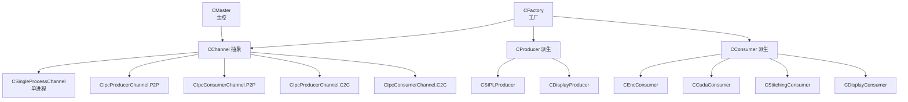
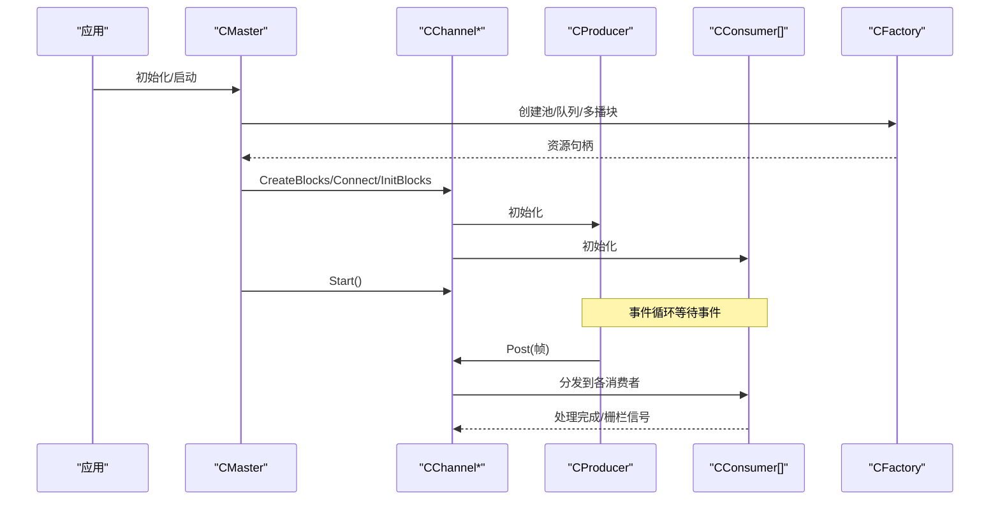
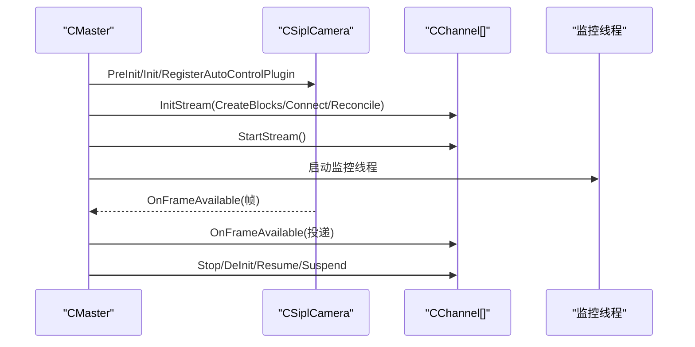
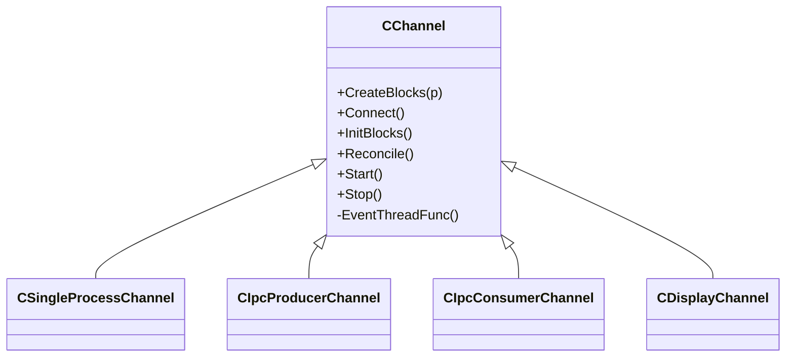
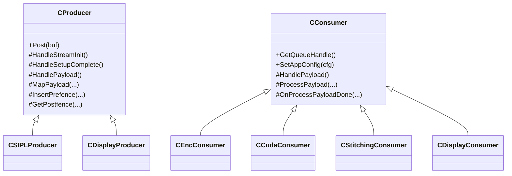
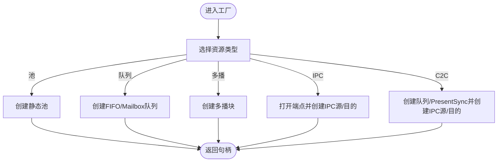
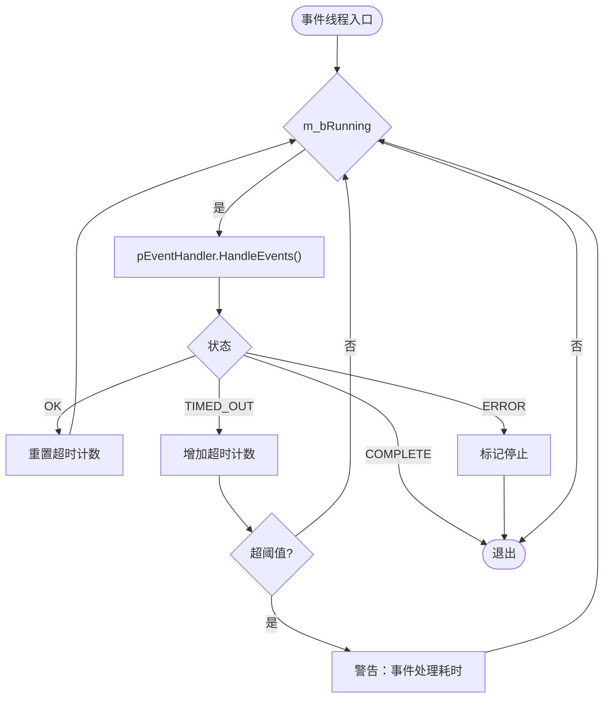
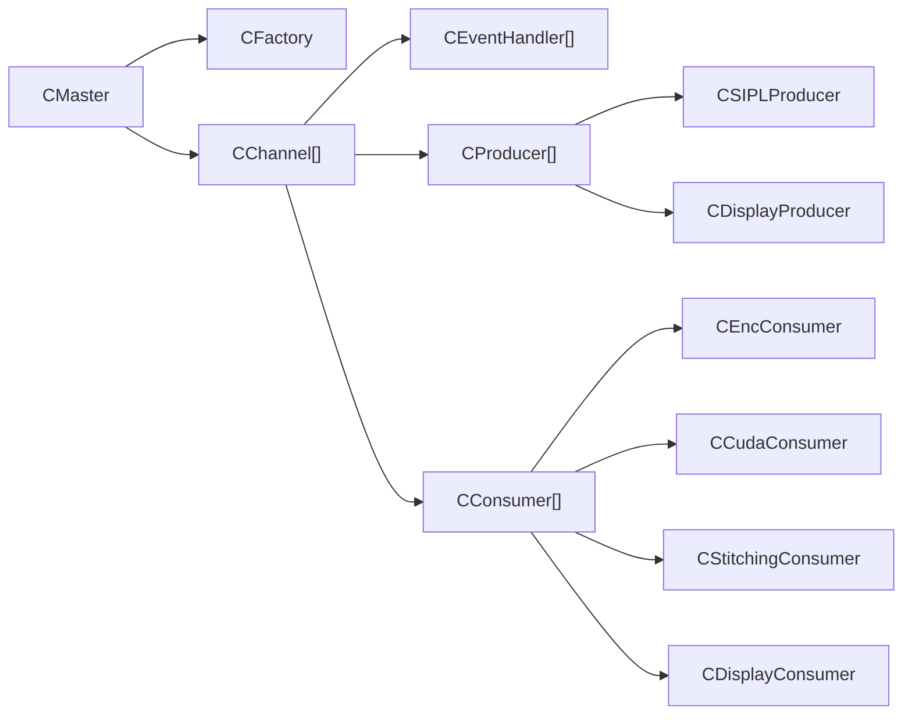

# 组件交互关系

<cite>
**本文引用的文件**
- [CMaster.hpp](file://CMaster.hpp)
- [CMaster.cpp](file://CMaster.cpp)
- [CChannel.hpp](file://CChannel.hpp)
- [CSingleProcessChannel.hpp](file://CSingleProcessChannel.hpp)
- [CIpcProducerChannel.hpp](file://CIpcProducerChannel.hpp)
- [CIpcConsumerChannel.hpp](file://CIpcConsumerChannel.hpp)
- [CFactory.hpp](file://CFactory.hpp)
- [CFactory.cpp](file://CFactory.cpp)
- [CEventHandler.hpp](file://CEventHandler.hpp)
- [CProducer.hpp](file://CProducer.hpp)
- [CConsumer.hpp](file://CConsumer.hpp)
- [CSIPLProducer.hpp](file://CSIPLProducer.hpp)
- [CDisplayProducer.hpp](file://CDisplayProducer.hpp)
- [CDisplayChannel.hpp](file://CDisplayChannel.hpp)
- [CEncConsumer.hpp](file://CEncConsumer.hpp)
- [CCudaConsumer.hpp](file://CCudaConsumer.hpp)
- [CStitchingConsumer.hpp](file://CStitchingConsumer.hpp)
- [CDisplayConsumer.hpp](file://CDisplayConsumer.hpp)
</cite>

## 目录
1. [简介](#简介)
2. [项目结构](#项目结构)
3. [核心组件](#核心组件)
4. [架构总览](#架构总览)
5. [详细组件分析](#详细组件分析)
6. [依赖分析](#依赖分析)
7. [性能考虑](#性能考虑)
8. [故障排查指南](#故障排查指南)
9. [结论](#结论)

## 简介
本文件面向NVSIPL多播系统，聚焦于组件交互关系与数据流，系统围绕“主控（CMaster）”协调“通道（Channel）”与“客户端（Producer/Consumer）”，在单进程或跨进程/跨芯片场景下完成从传感器帧到多路消费端的分发。文档从架构视角梳理组件职责、调用顺序、事件驱动模型、错误处理与恢复策略，并给出时序与类图，帮助开发者快速理解与优化系统。

## 项目结构
- 主控层：CMaster负责生命周期管理、通道创建与启动、监控线程、电源管理（挂起/恢复）、以及与NvSIPL相机的回调对接。
- 通道层：抽象CChannel定义统一的连接、初始化、事件循环；具体实现包括单进程CSingleProcessChannel、IPC生产者/消费者通道（P2P/C2C）。
- 客户端层：CProducer/CConsumer及其派生类（CSIPLProducer、CDisplayProducer、CEncConsumer、CCudaConsumer、CStitchingConsumer、CDisplayConsumer）实现具体的数据映射、同步与处理。
- 工厂层：CFactory封装NvSciStream/NvSciBuf/NvSciSync资源的创建与连接，屏蔽不同通信类型差异。
- 事件层：CEventHandler定义事件处理接口，CChannel统一调度各块的事件线程。

图表来源
- [CMaster.cpp:426-457](file://CMaster.cpp#L426-L457)
- [CChannel.hpp:28-157](file://CChannel.hpp#L28-L157)
- [CSingleProcessChannel.hpp:21-247](file://CSingleProcessChannel.hpp#L21-L247)
- [CIpcProducerChannel.hpp:20-380](file://CIpcProducerChannel.hpp#L20-L380)
- [CIpcConsumerChannel.hpp:19-148](file://CIpcConsumerChannel.hpp#L19-L148)
- [CFactory.cpp:68-205](file://CFactory.cpp#L68-L205)
- [CProducer.hpp:16-52](file://CProducer.hpp#L16-L52)
- [CConsumer.hpp:16-44](file://CConsumer.hpp#L16-L44)

章节来源
- [CMaster.hpp:47-92](file://CMaster.hpp#L47-L92)
- [CMaster.cpp:164-232](file://CMaster.cpp#L164-L232)
- [CChannel.hpp:28-157](file://CChannel.hpp#L28-L157)

## 核心组件
- CMaster：系统入口与中枢，负责配置解析、通道创建、启动/停止、电源管理、监控线程、以及来自NvSIPL的帧到达回调转发至对应通道。
- CChannel：抽象通道基类，统一Reconcile/Start/Stop流程与事件线程管理；具体通道根据通信方式（单进程/IPC/P2P/C2C）实现。
- CProducer/CConsumer：生产者/消费者基类，定义缓冲映射、同步对象注册、前/后栅栏插入、负载处理等接口。
- CFactory：资源工厂，负责池、队列、多播块、IPC块、C2C队列与PresentSync的创建与连接。
- CSIPLProducer/CDisplayProducer：具体生产者，前者对接NvSIPL相机输出，后者用于显示拼接流水线。
- 各类消费者：编码器、CUDA处理、拼接、显示等，按元素类型与队列模式定制。

章节来源
- [CMaster.hpp:47-92](file://CMaster.hpp#L47-L92)
- [CChannel.hpp:28-157](file://CChannel.hpp#L28-L157)
- [CProducer.hpp:16-52](file://CProducer.hpp#L16-L52)
- [CConsumer.hpp:16-44](file://CConsumer.hpp#L16-L44)
- [CFactory.hpp:27-92](file://CFactory.hpp#L27-L92)

## 架构总览
CMaster在不同通信模式下选择合适的通道实现，通道内部通过工厂创建池、队列、多播块及IPC/C2C链路，最终形成“生产者 -> 多播/IPC -> 消费者”的拓扑。事件线程在每个块上循环等待事件，确保连接、初始化与流式阶段有序推进。

图表来源
- [CMaster.cpp:195-252](file://CMaster.cpp#L195-L252)
- [CChannel.hpp:55-109](file://CChannel.hpp#L55-L109)
- [CFactory.cpp:68-205](file://CFactory.cpp#L68-L205)
- [CSingleProcessChannel.hpp:87-159](file://CSingleProcessChannel.hpp#L87-L159)

## 详细组件分析

### CMaster：主控与协调
- 生命周期：PreInit -> Init(含相机初始化与自动控制插件注册) -> Start(启动通道与监控线程) -> Stop(停止相机与通道) -> DeInit -> PostDeInit。
- 通道创建：依据通信类型与实体类型选择通道实现（单进程/IPC生产者/消费者/C2C生产者/消费者），并在显示启用时创建显示通道。
- 帧回调：OnFrameAvailable根据当前进程/实体类型将帧投递到对应通道（单进程或IPC生产者）。
- 动态消费者：支持晚绑定（Attach/Detach），仅在IPC（P2P/C2C）且生产者侧生效。
- 电源管理：Suspend/Resume通过先Stop/DeInit再Init/Start实现，避免硬重启。

图表来源
- [CMaster.cpp:164-232](file://CMaster.cpp#L164-L232)
- [CMaster.cpp:234-318](file://CMaster.cpp#L234-L318)
- [CMaster.cpp:405-424](file://CMaster.cpp#L405-L424)

章节来源
- [CMaster.hpp:47-92](file://CMaster.hpp#L47-L92)
- [CMaster.cpp:164-318](file://CMaster.cpp#L164-L318)

### 通道系统：事件驱动与数据分发
- 事件循环：CChannel::Reconcile/Start为每个块创建事件线程，循环调用CEventHandler::HandleEvents，直到完成或超时。
- 单进程通道：CSingleProcessChannel创建池、SIPL生产者与多路消费者（CUDA/拼接/编码/显示），通过多播块分发。
- IPC通道：CIpcProducerChannel/CIpcConsumerChannel分别在生产者/消费者侧创建IPC源/目的块，支持早/晚连接；C2C通道额外创建队列与PresentSync以保证呈现一致性。
- 显示通道：CDisplayChannel独立构建显示管线（显示生产者+显示消费者），可与拼接/DP-MST联动。

图表来源
- [CChannel.hpp:28-157](file://CChannel.hpp#L28-L157)
- [CSingleProcessChannel.hpp:21-247](file://CSingleProcessChannel.hpp#L21-L247)
- [CIpcProducerChannel.hpp:20-380](file://CIpcProducerChannel.hpp#L20-L380)
- [CIpcConsumerChannel.hpp:19-148](file://CIpcConsumerChannel.hpp#L19-L148)
- [CDisplayChannel.hpp:19-226](file://CDisplayChannel.hpp#L19-L226)

章节来源
- [CChannel.hpp:55-140](file://CChannel.hpp#L55-L140)
- [CSingleProcessChannel.hpp:87-209](file://CSingleProcessChannel.hpp#L87-L209)
- [CIpcProducerChannel.hpp:133-203](file://CIpcProducerChannel.hpp#L133-L203)
- [CIpcConsumerChannel.hpp:85-128](file://CIpcConsumerChannel.hpp#L85-L128)

### 生产者与消费者：数据映射与同步
- CProducer：定义Post接口与缓冲映射、前/后栅栏插入、元数据权限等虚函数，派生类实现具体细节。
- CSIPLProducer：对接NvSIPL相机，完成元素类型到输出类型的映射、缓冲注册、前栅栏插入与后栅栏收集。
- CDisplayProducer：面向拼接/显示，维护BufferInfo与多传感器后栅栏，协调提交时机。
- CConsumer：定义处理负载、注册同步对象、映射数据缓冲、设置EOF同步等接口；派生类实现具体处理逻辑。
- CEncConsumer/CCudaConsumer/CStitchingConsumer/CDisplayConsumer：按功能定制缓冲属性、同步对象与处理流程。

图表来源
- [CProducer.hpp:16-52](file://CProducer.hpp#L16-L52)
- [CSIPLProducer.hpp:18-84](file://CSIPLProducer.hpp#L18-L84)
- [CDisplayProducer.hpp:18-128](file://CDisplayProducer.hpp#L18-L128)
- [CConsumer.hpp:16-44](file://CConsumer.hpp#L16-L44)
- [CEncConsumer.hpp:17-66](file://CEncConsumer.hpp#L17-L66)
- [CCudaConsumer.hpp:25-81](file://CCudaConsumer.hpp#L25-L81)
- [CStitchingConsumer.hpp:17-74](file://CStitchingConsumer.hpp#L17-L74)
- [CDisplayConsumer.hpp:15-49](file://CDisplayConsumer.hpp#L15-L49)

章节来源
- [CProducer.hpp:16-52](file://CProducer.hpp#L16-L52)
- [CConsumer.hpp:16-44](file://CConsumer.hpp#L16-L44)
- [CSIPLProducer.hpp:26-74](file://CSIPLProducer.hpp#L26-L74)
- [CDisplayProducer.hpp:65-89](file://CDisplayProducer.hpp#L65-L89)
- [CEncConsumer.hpp:24-40](file://CEncConsumer.hpp#L24-L40)
- [CCudaConsumer.hpp:36-49](file://CCudaConsumer.hpp#36-L49)
- [CStitchingConsumer.hpp:35-49](file://CStitchingConsumer.hpp#L35-L49)
- [CDisplayConsumer.hpp:25-36](file://CDisplayConsumer.hpp#L25-L36)

### 工厂与资源：统一创建与连接
- CFactory负责静态池、队列（FIFO/Mailbox）、多播块、IPC块（P2P/C2C）、PresentSync等的创建与释放。
- 元素信息：根据传感器类型与配置决定使用哪些元素（如ICP_RAW、NV12_BL、NV12_PL、ABGR8888_PL）。
- IPC/C2C：生产者侧创建IPC源块/队列/PresentSync，消费者侧创建IPC目的块并查询连接状态。

图表来源
- [CFactory.cpp:11-22](file://CFactory.cpp#L11-L22)
- [CFactory.cpp:138-151](file://CFactory.cpp#L138-L151)
- [CFactory.cpp:207-213](file://CFactory.cpp#L207-L213)
- [CFactory.cpp:223-234](file://CFactory.cpp#L223-L234)
- [CFactory.cpp:243-263](file://CFactory.cpp#L243-L263)
- [CFactory.cpp:276-294](file://CFactory.cpp#L276-L294)
- [CFactory.cpp:296-314](file://CFactory.cpp#L296-L314)

章节来源
- [CFactory.hpp:27-92](file://CFactory.hpp#L27-L92)
- [CFactory.cpp:68-205](file://CFactory.cpp#L68-L205)

### 事件与线程：统一事件循环
- CEventHandler定义事件处理接口，CChannel::EventThreadFunc为每个块创建线程，循环调用HandleEvents，处理超时、完成与错误状态。
- Reconcile阶段仅查询必要块（如池、生产者、消费者），Start阶段启动所有块的事件线程。

图表来源
- [CChannel.hpp:112-140](file://CChannel.hpp#L112-L140)
- [CEventHandler.hpp:15-54](file://CEventHandler.hpp#L15-L54)

章节来源
- [CChannel.hpp:55-140](file://CChannel.hpp#L55-L140)
- [CEventHandler.hpp:15-54](file://CEventHandler.hpp#L15-L54)

### 关键协议与消息格式
- 帧投递：CSIPLProducer::Post接收NvSIPLBuffers，映射到对应元素类型与输出类型，插入前栅栏并提交。
- 多播分发：单进程通道通过多播块将同一帧分发给多个消费者；IPC通道通过IPC源/目的块与队列/PresentSync实现跨进程/跨芯片分发。
- 同步：前栅栏（InsertPrefence）用于通知消费者准备，后栅栏（GetPostfence）用于生产者确认消费完成；Mailbox队列确保消费者看到最新帧。
- 显示拼接：CDisplayProducer维护每传感器后栅栏，拼接消费者向其注册/提交，最终由显示消费者呈现。

章节来源
- [CSingleProcessChannel.hpp:74-85](file://CSingleProcessChannel.hpp#L74-L85)
- [CIpcProducerChannel.hpp:78-86](file://CIpcProducerChannel.hpp#L78-L86)
- [CSIPLProducer.hpp:26-44](file://CSIPLProducer.hpp#L26-L44)
- [CDisplayProducer.hpp:68-89](file://CDisplayProducer.hpp#L68-L89)

### 错误处理与异常恢复
- 监控线程：定期检查异步错误（设备块/管道），一旦发现致命错误立即触发退出流程。
- 连接查询：各通道在Connect/Reconcile阶段持续查询块事件，遇到SetupComplete或错误即终止并回滚。
- 电源管理：Suspend/Resume通过完整Stop/DeInit/Init/Start序列，避免资源泄漏。
- IPC晚绑定：晚绑定失败时释放相关资源并保持系统稳定。

章节来源
- [CMaster.cpp:354-403](file://CMaster.cpp#L354-L403)
- [CIpcProducerChannel.hpp:205-272](file://CIpcProducerChannel.hpp#L205-L272)
- [CIpcProducerChannel.hpp:274-289](file://CIpcProducerChannel.hpp#L274-L289)

## 依赖分析
- CMaster依赖CChannel数组与显示通道，通过CFactory创建池、队列、多播与IPC/C2C块。
- 通道依赖CEventHandler集合，统一事件循环；生产者/消费者依赖NvSciStream/NvSciBuf/NvSciSync资源。
- CSIPLProducer依赖CSiplCamera；CDisplayProducer依赖拼接消费者与显示控制器。

图表来源
- [CMaster.cpp:426-457](file://CMaster.cpp#L426-L457)
- [CFactory.cpp:68-205](file://CFactory.cpp#L68-L205)
- [CChannel.hpp:142-143](file://CChannel.hpp#L142-L143)

章节来源
- [CMaster.hpp:74-91](file://CMaster.hpp#L74-L91)
- [CFactory.hpp:27-92](file://CFactory.hpp#L27-L92)

## 性能考虑
- 队列模式：Mailbox队列确保消费者看到最新帧，适合显示；FIFO队列吞吐更高但可能丢失中间帧。
- 元素选择：根据传感器类型与功能需求选择ICP_RAW/NV12_BL/NV12_PL，减少不必要的元素映射与拷贝。
- 多播与IPC：多播块减少重复复制；IPC/C2C链路引入网络/内存带宽开销，需合理设置队列与PresentSync。
- 线程与事件：事件线程避免阻塞，超时检测防止卡死；合理设置超时阈值平衡稳定性与延迟。
- CUDA/编码：CUDA消费者与编码消费者存在CPU等待，注意同步对象与流的配置，避免瓶颈。

## 故障排查指南
- 连接失败：检查各块EventQuery返回值与事件类型，确认Producer/Pool/Queue/Consumer/Multicast均达到SetupComplete。
- IPC/C2C问题：验证端点打开、IPC块创建与队列/PresentSync配置；晚绑定失败时检查Multicast状态与QueryBlocks集合。
- 显示拼接：确认CDisplayProducer已注册拼接消费者并正确提交后栅栏；检查输入矩形计算与呈现同步。
- 监控告警：关注监控线程日志中的超时与错误，定位卡住的块或线程。

章节来源
- [CIpcProducerChannel.hpp:133-203](file://CIpcProducerChannel.hpp#L133-L203)
- [CIpcConsumerChannel.hpp:85-128](file://CIpcConsumerChannel.hpp#L85-L128)
- [CDisplayChannel.hpp:134-184](file://CDisplayChannel.hpp#L134-L184)
- [CMaster.cpp:354-403](file://CMaster.cpp#L354-L403)

## 结论
NVSIPL多播系统通过CMaster统一编排，CChannel抽象出跨场景的通道模型，CFactory屏蔽底层资源差异，CSIPL/显示生产者与各类消费者实现灵活的功能组合。事件驱动的线程模型与严格的连接/初始化流程保障了系统的稳定性与可扩展性。针对不同通信方式与功能需求，应合理选择队列模式、元素类型与同步策略，以获得最佳性能与可靠性。