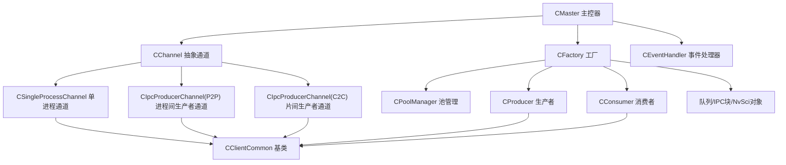
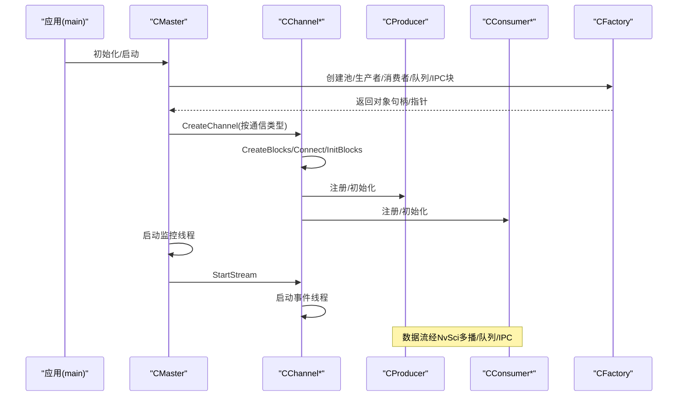
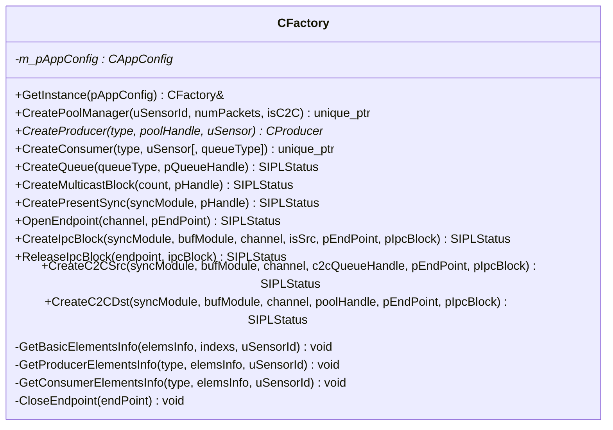
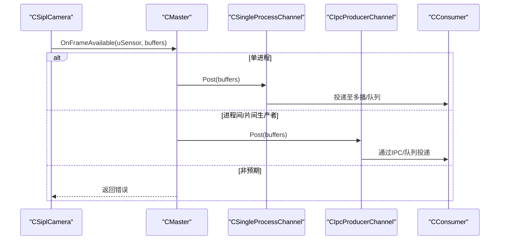
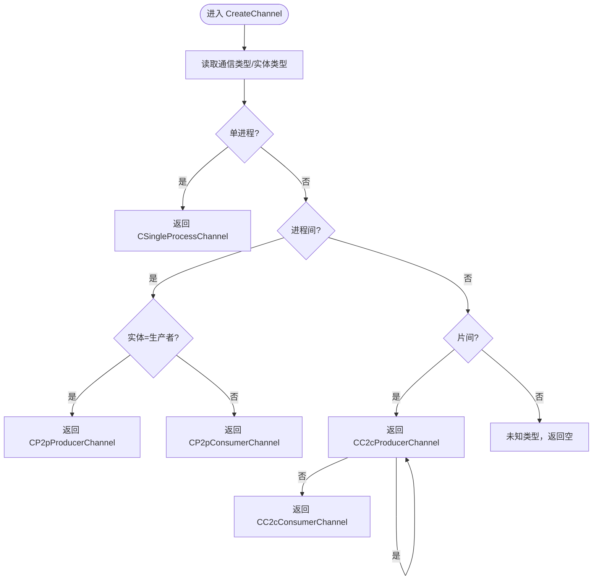
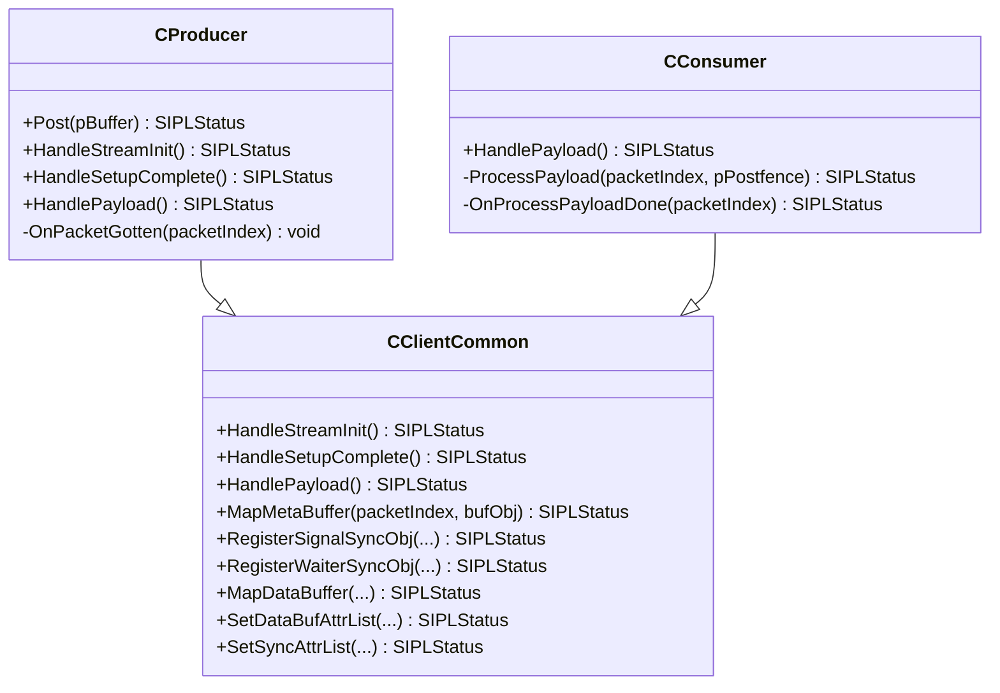
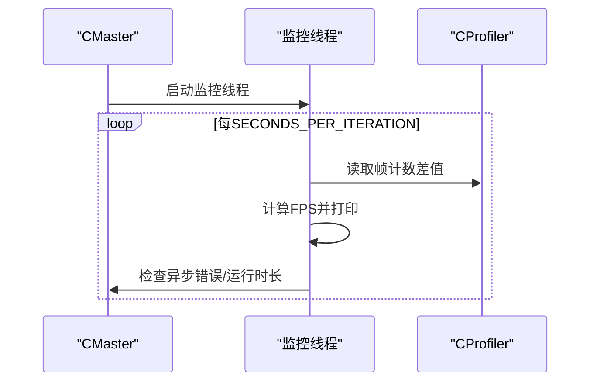

# 设计模式应用

<cite>
**本文引用的文件**   
- [CFactory.hpp](file://CFactory.hpp)
- [CFactory.cpp](file://CFactory.cpp)
- [CMaster.hpp](file://CMaster.hpp)
- [CMaster.cpp](file://CMaster.cpp)
- [CProducer.hpp](file://CProducer.hpp)
- [CProducer.cpp](file://CProducer.cpp)
- [CConsumer.hpp](file://CConsumer.hpp)
- [CConsumer.cpp](file://CConsumer.cpp)
- [CChannel.hpp](file://CChannel.hpp)
- [CSingleProcessChannel.hpp](file://CSingleProcessChannel.hpp)
- [CIpcProducerChannel.hpp](file://CIpcProducerChannel.hpp)
- [CEventHandler.hpp](file://CEventHandler.hpp)
- [CClientCommon.hpp](file://CClientCommon.hpp)
- [main.cpp](file://main.cpp)
</cite>

## 目录
1. [引言](#引言)
2. [项目结构](#项目结构)
3. [核心组件](#核心组件)
4. [架构总览](#架构总览)
5. [详细组件分析](#详细组件分析)
6. [依赖关系分析](#依赖关系分析)
7. [性能考量](#性能考量)
8. [故障排查指南](#故障排查指南)
9. [结论](#结论)
10. [附录](#附录)

## 引言
本文件面向NVSIPL多播系统，系统性梳理并解析其中的设计模式应用，重点覆盖以下方面：
- 工厂模式（CFactory）：统一创建与配置多播链路中的池、生产者、消费者、队列、IPC块等资源。
- 观察者模式（CMaster继承的ICallback）：通过回调接口接收帧可用事件，驱动跨进程/单进程通道的投递。
- 策略模式（通信方式选择）：基于配置在单进程、进程间（P2P）、片间（C2C）之间动态切换具体通道实现。
- 模板方法/钩子模式（CClientCommon/CChannel）：通过虚函数定义生命周期与处理流程骨架，子类按需覆写。

这些模式共同实现了系统的高内聚、低耦合、可扩展与可维护性，同时兼顾性能与实时性要求。

## 项目结构
系统围绕“主控器（CMaster）—通道（CChannel）—客户端（CProducer/CConsumer）—工厂（CFactory）”展开，配合事件处理器（CEventHandler）与通用基类（CClientCommon）形成清晰分层。

图表来源
- [CMaster.cpp:50-122](file://CMaster.cpp#L50-L122)
- [CChannel.hpp:28-157](file://CChannel.hpp#L28-L157)
- [CSingleProcessChannel.hpp:21-247](file://CSingleProcessChannel.hpp#L21-L247)
- [CIpcProducerChannel.hpp:20-533](file://CIpcProducerChannel.hpp#L20-L533)
- [CFactory.cpp:11-315](file://CFactory.cpp#L11-L315)
- [CEventHandler.hpp:23-54](file://CEventHandler.hpp#L23-L54)
- [CClientCommon.hpp:65-95](file://CClientCommon.hpp#L65-L95)

章节来源
- [CMaster.hpp:47-92](file://CMaster.hpp#L47-L92)
- [CMaster.cpp:164-232](file://CMaster.cpp#L164-L232)
- [CChannel.hpp:28-157](file://CChannel.hpp#L28-L157)

## 核心组件
- CMaster：系统入口与编排者，负责初始化、启动、停止、挂起/恢复、监控线程与回调事件；根据通信类型选择具体通道实现。
- CChannel及其派生：抽象通道骨架，定义事件线程、连接/初始化/去初始化流程；派生类实现具体通信策略。
- CProducer/CConsumer：生产者与消费者，遵循CClientCommon的生命周期与数据/同步对象映射约定。
- CFactory：集中式工厂，封装NvSci对象创建、元素信息配置、队列/IPC块创建与释放。
- CEventHandler：事件处理抽象，通道在运行期创建并驱动各事件处理器线程。
- CClientCommon：模板方法/钩子模式基类，定义初始化、事件处理、缓冲区/元数据映射、同步对象注册等骨架。

章节来源
- [CProducer.hpp:16-51](file://CProducer.hpp#L16-L51)
- [CProducer.cpp:17-157](file://CProducer.cpp#L17-L157)
- [CConsumer.hpp:16-44](file://CConsumer.hpp#L16-L44)
- [CConsumer.cpp:17-127](file://CConsumer.cpp#L17-L127)
- [CFactory.hpp:27-92](file://CFactory.hpp#L27-L92)
- [CFactory.cpp:11-315](file://CFactory.cpp#L11-L315)
- [CEventHandler.hpp:23-54](file://CEventHandler.hpp#L23-L54)
- [CClientCommon.hpp:65-95](file://CClientCommon.hpp#L65-L95)

## 架构总览
下图展示了从主控到通道再到生产/消费端的整体交互，以及工厂在其中的“装配”角色。

图表来源
- [CMaster.cpp:195-253](file://CMaster.cpp#L195-L253)
- [CMaster.cpp:426-451](file://CMaster.cpp#L426-L451)
- [CSingleProcessChannel.hpp:87-159](file://CSingleProcessChannel.hpp#L87-L159)
- [CIpcProducerChannel.hpp:88-131](file://CIpcProducerChannel.hpp#L88-L131)
- [CFactory.cpp:11-205](file://CFactory.cpp#L11-L205)

## 详细组件分析

### 工厂模式：CFactory
- 职责边界
  - 统一创建与配置：池管理、生产者、消费者、队列、多播块、呈现同步、IPC块等。
  - 元素信息配置：根据传感器类型与配置决定哪些数据元素被使用/共享。
  - 生命周期管理：打开/关闭IPC端点、创建/释放IPC块。
- 关键实现要点
  - 单例获取：通过静态单例确保全局一致的工厂实例。
  - 多态创建：根据枚举类型（生产者/消费者/队列/IPC）返回对应对象。
  - 条件装配：根据配置（如是否启用多元素、显示类型、队列类型）动态设置元素使用情况。
- 设计价值
  - 解耦：上层仅依赖工厂接口，不关心具体实现细节。
  - 可扩展：新增通信方式或消费者类型时，只需扩展工厂的分支逻辑。
  - 可测试：可通过替换工厂实现进行隔离测试。

图表来源
- [CFactory.hpp:27-92](file://CFactory.hpp#L27-L92)
- [CFactory.cpp:11-315](file://CFactory.cpp#L11-L315)

章节来源
- [CFactory.hpp:30-61](file://CFactory.hpp#L30-L61)
- [CFactory.cpp:24-66](file://CFactory.cpp#L24-L66)
- [CFactory.cpp:96-136](file://CFactory.cpp#L96-L136)
- [CFactory.cpp:138-164](file://CFactory.cpp#L138-L164)
- [CFactory.cpp:166-205](file://CFactory.cpp#L166-L205)
- [CFactory.cpp:207-221](file://CFactory.cpp#L207-L221)
- [CFactory.cpp:223-234](file://CFactory.cpp#L223-L234)
- [CFactory.cpp:243-274](file://CFactory.cpp#L243-L274)
- [CFactory.cpp:276-294](file://CFactory.cpp#L276-L294)
- [CFactory.cpp:296-314](file://CFactory.cpp#L296-L314)

### 观察者模式：CMaster回调（ICallback）
- 角色定位
  - CMaster继承CSiplCamera::ICallback，作为回调发布者（被NvSIPL相机库调用）。
  - OnFrameAvailable是关键回调：当有新帧到达时，主控根据当前通信类型将帧投递给相应通道。
- 实现要点
  - 动态分发：根据配置的通信类型与实体类型，选择单进程或IPC通道进行Post。
  - 错误处理：对无效传感器ID与异常路径进行日志与错误返回。
- 设计价值
  - 事件驱动：解耦帧采集与投递，便于扩展不同输出目标。
  - 易于扩展：新增通道类型时，只需在回调中增加分支。

图表来源
- [CMaster.hpp:47-64](file://CMaster.hpp#L47-L64)
- [CMaster.cpp:405-424](file://CMaster.cpp#L405-L424)
- [CSingleProcessChannel.hpp:74-85](file://CSingleProcessChannel.hpp#L74-L85)
- [CIpcProducerChannel.hpp:78-86](file://CIpcProducerChannel.hpp#L78-L86)

章节来源
- [CMaster.hpp:47-64](file://CMaster.hpp#L47-L64)
- [CMaster.cpp:405-424](file://CMaster.cpp#L405-L424)

### 策略模式：通信方式选择（通道策略）
- 策略选择点
  - CMaster::CreateChannel根据通信类型（单进程/进程间/片间）与实体类型（生产者/消费者）返回不同通道实现。
- 具体策略
  - 单进程：CSingleProcessChannel，直接在进程内建立多播，连接CUDA/编码/拼接/显示消费者。
  - 进程间（P2P）：CIpcProducerChannel（派生CP2pProducerChannel），通过IPC源块连接远端消费者。
  - 片间（C2C）：CIpcProducerChannel（派生CC2cProducerChannel），额外创建呈现同步以保证显示时序。
- 设计价值
  - 高内聚：每种通信方式的差异集中在对应通道类内部。
  - 低耦合：上层仅依赖抽象通道接口，无需感知底层IPC/队列细节。
  - 可扩展：新增通信方式只需新增派生类并扩展CMaster的分支。

图表来源
- [CMaster.cpp:426-451](file://CMaster.cpp#L426-L451)
- [CIpcProducerChannel.hpp:381-533](file://CIpcProducerChannel.hpp#L381-L533)

章节来源
- [CMaster.cpp:426-451](file://CMaster.cpp#L426-L451)
- [CSingleProcessChannel.hpp:21-247](file://CSingleProcessChannel.hpp#L21-L247)
- [CIpcProducerChannel.hpp:20-533](file://CIpcProducerChannel.hpp#L20-L533)

### 模板方法/钩子模式：CClientCommon与CChannel
- CClientCommon
  - 定义客户端生命周期骨架：HandleStreamInit/HandleSetupComplete/HandlePayload等。
  - 提供可覆写的钩子：如MapDataBuffer/MapMetaBuffer/RegisterSignal/WaiterSyncObj等。
- CChannel
  - 定义通道生命周期骨架：CreateBlocks/Connect/InitBlocks/Reconcile/Start/Stop等。
  - 事件线程模型：通过GetEventThreadHandlers收集各事件处理器，统一由EventThreadFunc驱动。
- 设计价值
  - 固定流程、灵活实现：公共流程在基类，差异化行为在派生类。
  - 易于维护：变更通用流程不影响具体实现；新增功能通过钩子扩展。

图表来源
- [CClientCommon.hpp:65-95](file://CClientCommon.hpp#L65-L95)
- [CProducer.hpp:16-51](file://CProducer.hpp#L16-L51)
- [CConsumer.hpp:16-44](file://CConsumer.hpp#L16-L44)

章节来源
- [CChannel.hpp:28-157](file://CChannel.hpp#L28-L157)
- [CProducer.cpp:17-157](file://CProducer.cpp#L17-L157)
- [CConsumer.cpp:17-127](file://CConsumer.cpp#L17-L127)

### 事件驱动与监控：CEventHandler与CMaster监控线程
- CEventHandler
  - 抽象事件处理接口，通道在Reconcile/Start阶段启动事件线程，循环调用HandleEvents。
- CMaster监控线程
  - 定期统计各传感器输出帧率，检查设备/管道异步错误，必要时触发退出。
- 设计价值
  - 异步解耦：事件线程与主线程分离，避免阻塞。
  - 可观测性：内置性能统计与错误上报。

图表来源
- [CChannel.hpp:112-140](file://CChannel.hpp#L112-L140)
- [CMaster.cpp:354-403](file://CMaster.cpp#L354-L403)

章节来源
- [CEventHandler.hpp:23-54](file://CEventHandler.hpp#L23-L54)
- [CChannel.hpp:55-82](file://CChannel.hpp#L55-L82)
- [CMaster.cpp:354-403](file://CMaster.cpp#L354-L403)

## 依赖关系分析
- 上层依赖下层：CMaster依赖CFactory创建底层对象；通道依赖工厂创建生产者/消费者/队列/IPC块。
- 横向依赖：通道与事件处理器通过统一接口交互；生产者/消费者均继承自CClientCommon，共享生命周期与数据/同步对象映射协议。
- 外部依赖：NvSciBuf/NvSciStream/NvSciSync/NvSciIpc等底层库对象由工厂统一封装。

```mermaid
graph LR
Master["CMaster"] --> Factory["CFactory"]
Master --> Channel["CChannel"]
Channel --> Prod["CProducer"]
Channel --> Cons["CConsumer"]
Factory --> NvSci["NvSci对象"]
Channel --> EH["CEventHandler"]
Prod --> Base["CClientCommon"]
Cons --> Base
```

图表来源
- [CMaster.cpp:195-253](file://CMaster.cpp#L195-L253)
- [CFactory.cpp:11-205](file://CFactory.cpp#L11-L205)
- [CChannel.hpp:28-157](file://CChannel.hpp#L28-L157)
- [CProducer.hpp:16-51](file://CProducer.hpp#L16-L51)
- [CConsumer.hpp:16-44](file://CConsumer.hpp#L16-L44)

章节来源
- [CFactory.cpp:11-315](file://CFactory.cpp#L11-L315)
- [CChannel.hpp:28-157](file://CChannel.hpp#L28-L157)

## 性能考量
- 工厂集中创建与配置：减少重复初始化开销，统一错误处理与日志。
- 事件线程模型：将阻塞式查询/等待放入独立线程，避免影响主线程。
- 多播与队列选择：根据场景选择FIFO或Mailbox队列，平衡延迟与吞吐。
- IPC/C2C：IPC用于进程间，C2C引入呈现同步以保障显示时序，但会增加同步成本。
- 元素使用裁剪：仅启用必要的数据元素，降低带宽与CPU/GPU压力。

## 故障排查指南
- 回调未触发或异常
  - 检查CMaster::OnFrameAvailable的通信类型与实体类型判断分支。
  - 确认传感器ID有效且通道已正确创建。
- 连接失败
  - 查看通道Connect/Reconcile阶段的NvSci事件查询与错误码。
  - 对IPC/C2C场景，确认端点打开、IPC块创建与呈现同步配置成功。
- 帧率异常
  - 使用监控线程输出的FPS进行对比，检查是否有设备/管道错误。
  - 调整帧过滤参数或元素使用策略。
- 晚接入消费者（P2P/C2C）
  - 确保多播处于可连接状态后再执行Attach/Detach。
  - 失败时及时释放晚接入资源并重置状态。

章节来源
- [CMaster.cpp:405-424](file://CMaster.cpp#L405-L424)
- [CSingleProcessChannel.hpp:161-209](file://CSingleProcessChannel.hpp#L161-L209)
- [CIpcProducerChannel.hpp:133-203](file://CIpcProducerChannel.hpp#L133-L203)
- [CIpcProducerChannel.hpp:205-272](file://CIpcProducerChannel.hpp#L205-L272)
- [CMaster.cpp:354-403](file://CMaster.cpp#L354-L403)

## 结论
本系统通过工厂模式统一装配、通过观察者模式解耦事件与投递、通过策略模式在多种通信方式间灵活切换，并辅以模板方法/钩子模式固化流程骨架。这些设计模式协同工作，使系统具备良好的可扩展性、可维护性与性能表现，能够适应从单进程到跨进程/跨芯片的多样化部署需求。

## 附录
- 正确使用建议
  - 在需要新增消费者类型时，优先通过CFactory扩展分支，保持上层不变。
  - 新增通信方式时，在CMaster::CreateChannel中添加分支，并实现对应通道类。
  - 严格遵循CClientCommon的生命周期钩子，避免遗漏初始化步骤。
- 常见陷阱
  - 忘记在通道Connect/Reconcile后检查NvSci事件结果。
  - IPC/C2C场景中未正确释放端点与IPC块导致资源泄漏。
  - 晚接入消费者未等待多播可达状态即连接，导致SetupComplete失败。
- 扩展性与复用
  - 通过工厂与通道策略，实现代码复用与模块化。
  - 事件线程与监控线程提供可观测性与稳定性基础。