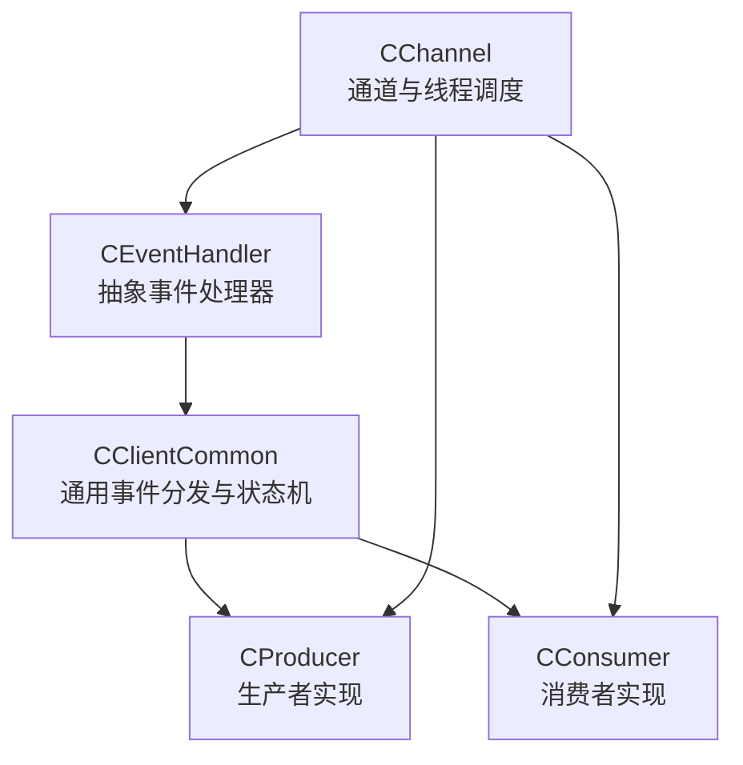
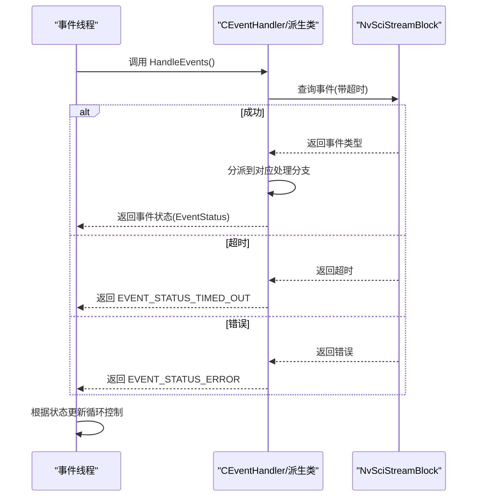
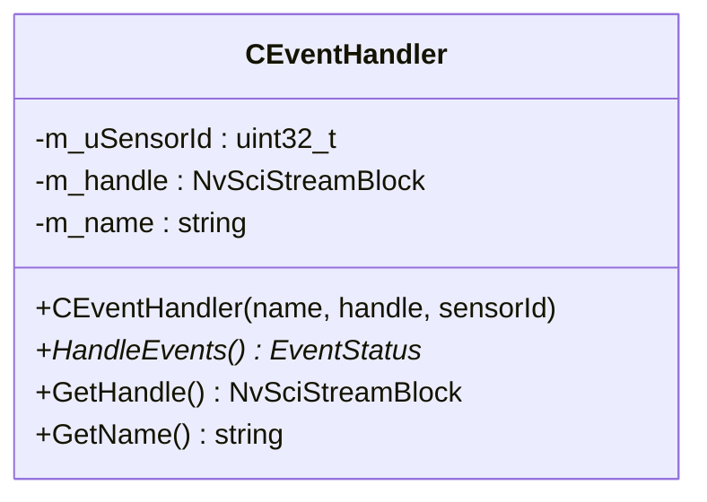
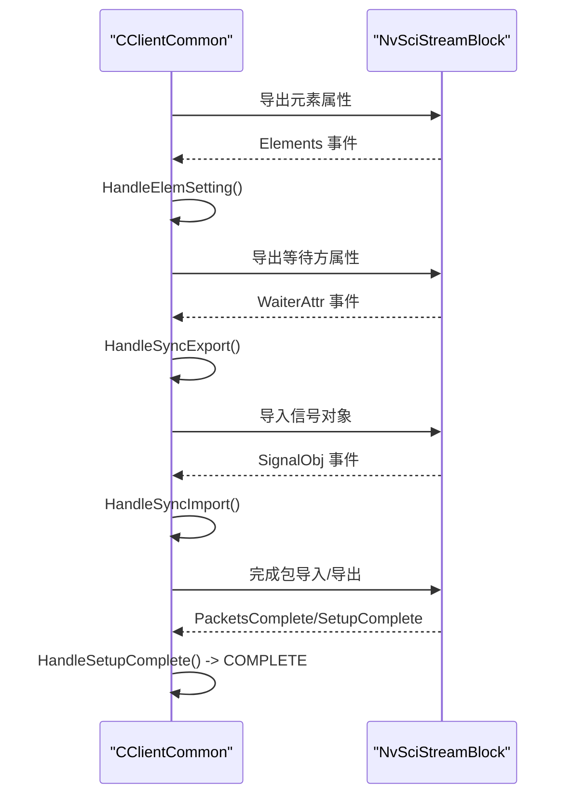
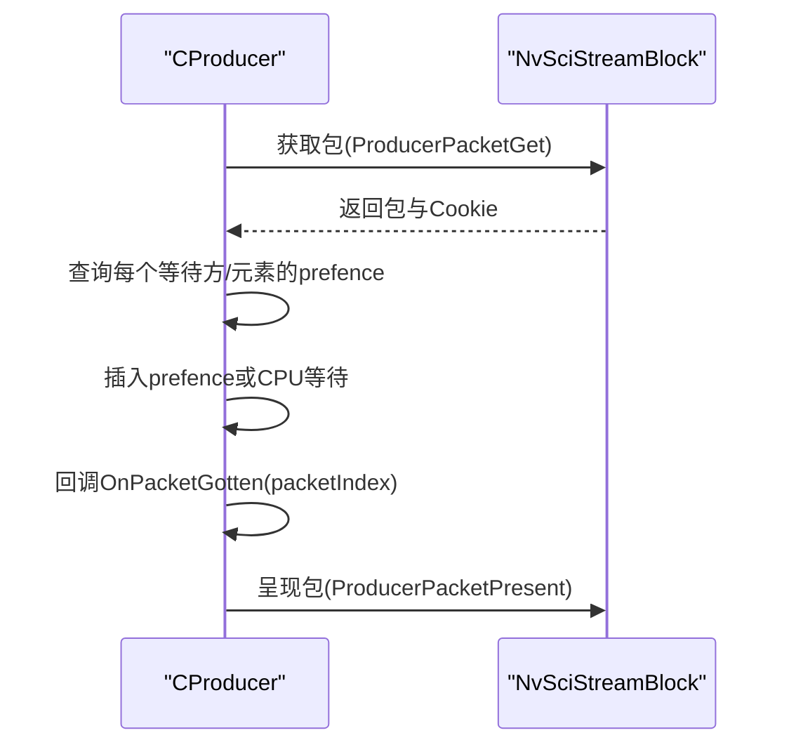
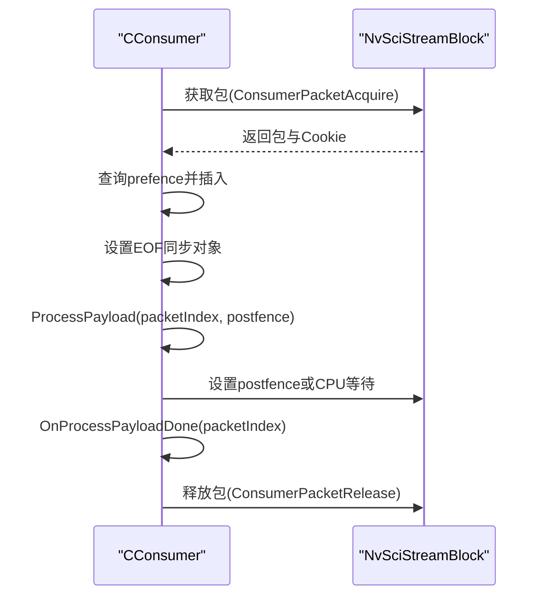
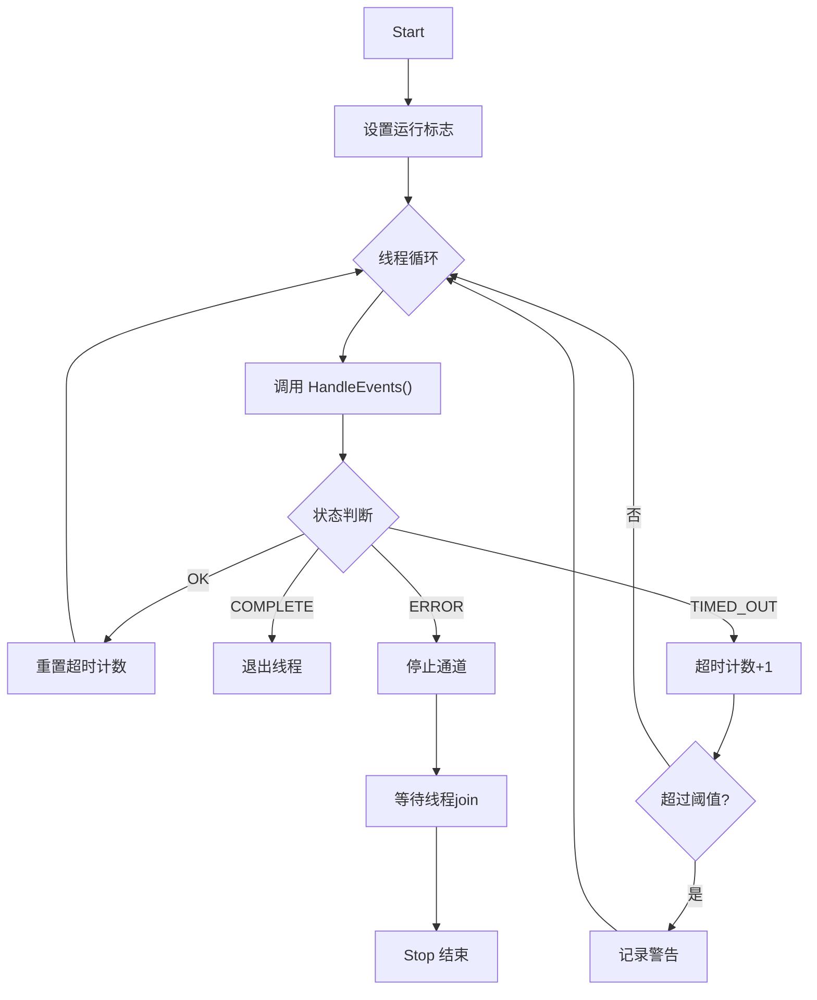
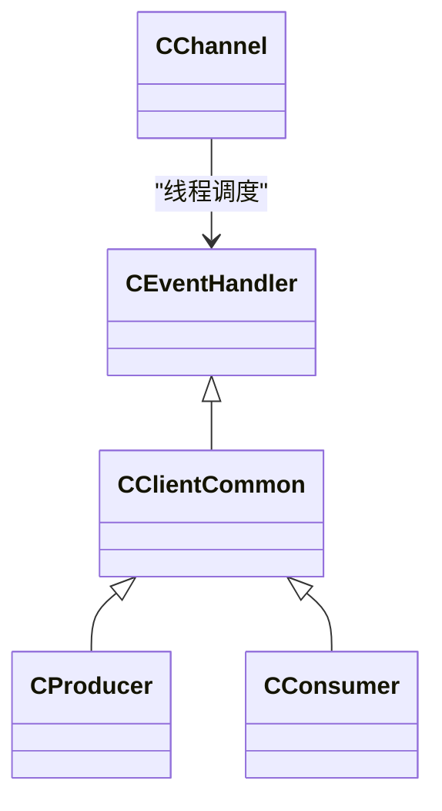

# 事件处理器系统

<cite>
**本文引用的文件**
- [CEventHandler.hpp](file://CEventHandler.hpp)
- [CClientCommon.hpp](file://CClientCommon.hpp)
- [CClientCommon.cpp](file://CClientCommon.cpp)
- [CProducer.hpp](file://CProducer.hpp)
- [CProducer.cpp](file://CProducer.cpp)
- [CConsumer.hpp](file://CConsumer.hpp)
- [CConsumer.cpp](file://CConsumer.cpp)
- [CChannel.hpp](file://CChannel.hpp)
- [Common.hpp](file://Common.hpp)
</cite>

## 目录
1. [简介](#简介)
2. [项目结构](#项目结构)
3. [核心组件](#核心组件)
4. [架构总览](#架构总览)
5. [详细组件分析](#详细组件分析)
6. [依赖关系分析](#依赖关系分析)
7. [性能考量](#性能考量)
8. [故障排查指南](#故障排查指南)
9. [结论](#结论)
10. [附录](#附录)

## 简介
本文件面向事件处理器系统，围绕 CEventHandler 基类及其派生实现（如生产者与消费者），系统性阐述事件状态管理、异步事件处理机制与错误处理策略；解析 EventStatus 枚举的状态语义与转换条件；梳理事件处理器生命周期（构造参数、资源管理与析构）；并给出超时处理、错误恢复与性能优化的最佳实践及常见问题解决方案。

## 项目结构
事件处理器系统以 NvSciStream 事件驱动为核心，通过 CEventHandler 抽象出统一的事件处理接口，并由 CClientCommon 实现通用的事件分发与状态机流程。生产者与消费者分别继承自 CClientCommon，实现各自的数据路径与同步对象处理逻辑。CChannel 负责线程化地调度各事件处理器，形成“每块一线程”的异步事件循环。



图表来源
- [CEventHandler.hpp:23-51](file://CEventHandler.hpp#L23-L51)
- [CClientCommon.hpp:47-51](file://CClientCommon.hpp#L47-L51)
- [CProducer.hpp:16-23](file://CProducer.hpp#L16-L23)
- [CConsumer.hpp:16-23](file://CConsumer.hpp#L16-L23)
- [CChannel.hpp:28-44](file://CChannel.hpp#L28-L44)

章节来源
- [CEventHandler.hpp:15-51](file://CEventHandler.hpp#L15-L51)
- [CClientCommon.hpp:47-51](file://CClientCommon.hpp#L47-L51)
- [CProducer.hpp:16-23](file://CProducer.hpp#L16-L23)
- [CConsumer.hpp:16-23](file://CConsumer.hpp#L16-L23)
- [CChannel.hpp:28-44](file://CChannel.hpp#L28-L44)

## 核心组件
- CEventHandler：定义事件处理接口与基础属性（名称、句柄、传感器ID），提供统一的事件查询与状态返回。
- CClientCommon：继承自 CEventHandler，封装 NvSciStream 事件的完整生命周期，包括元素支持、包创建、同步对象导出/导入、设置完成与数据载荷处理。
- CProducer/CConsumer：在 CClientCommon 基础上实现具体业务逻辑，如生产者的包获取与发布、消费者的载荷处理与后同步对象设置等。
- CChannel：为每个事件处理器创建独立线程，执行事件循环，处理超时与错误，协调启动/停止。

章节来源
- [CEventHandler.hpp:23-51](file://CEventHandler.hpp#L23-L51)
- [CClientCommon.hpp:47-51](file://CClientCommon.hpp#L47-L51)
- [CProducer.hpp:16-23](file://CProducer.hpp#L16-L23)
- [CConsumer.hpp:16-23](file://CConsumer.hpp#L16-L23)
- [CChannel.hpp:112-140](file://CChannel.hpp#L112-L140)

## 架构总览
事件处理器采用“事件驱动 + 线程池式轮询”的模式：
- 每个 NvSciStream Block 对应一个 CEventHandler 实例；
- CChannel 为每个事件处理器创建一个线程，持续调用其 HandleEvents；
- HandleEvents 内部通过 NvSciStreamBlockEventQuery 查询事件，按事件类型分派到对应处理分支；
- 事件状态返回值用于控制线程循环（OK/COMPLETE/TIMEOUT/ERROR）。



图表来源
- [CChannel.hpp:112-140](file://CChannel.hpp#L112-L140)
- [CClientCommon.cpp:119-205](file://CClientCommon.cpp#L119-L205)

## 详细组件分析

### CEventHandler 基类设计
- 角色定位：抽象事件处理器，屏蔽底层 NvSciStream 细节，向上提供统一的事件状态返回。
- 关键成员：
  - 名称与传感器ID：用于日志标识与区分多传感器实例。
  - NvSciStreamBlock 句柄：事件查询与操作的根对象。
- 接口约定：
  - HandleEvents：纯虚函数，派生类实现具体事件分发与处理逻辑。
  - GetHandle/GetName：提供运行期访问能力。



图表来源
- [CEventHandler.hpp:23-51](file://CEventHandler.hpp#L23-L51)

章节来源
- [CEventHandler.hpp:23-51](file://CEventHandler.hpp#L23-L51)

### EventStatus 枚举与状态机
- 状态定义与含义：
  - OK：事件处理成功，可继续循环。
  - COMPLETE：初始化/配置阶段完成，进入运行态或结束。
  - TIMED_OUT：事件查询超时，需累积超时计数并进行保护性告警。
  - ERROR：事件查询或处理过程中发生错误，触发线程退出与通道停止。
- 状态转换条件：
  - 查询成功且事件类型为 SetupComplete → COMPLETE
  - 查询成功且事件类型为 PacketReady → OK（随后执行数据路径）
  - 查询超时 → TIMED_OUT（累计超过阈值触发警告）
  - 其他错误事件或异常 → ERROR（线程停止）

```mermaid
flowchart TD
Start(["开始"]) --> Query["查询事件(带超时)"]
Query --> Ok{"是否成功?"}
Ok --> |否(超时)| Timeout["EVENT_STATUS_TIMED_OUT"]
Ok --> |否(错误)| Error["EVENT_STATUS_ERROR"]
Ok --> |是| Dispatch["根据事件类型分派处理"]
Dispatch --> SC{"SetupComplete?"}
SC --> |是| Complete["EVENT_STATUS_COMPLETE"]
SC --> |否| PR{"PacketReady?"}
PR --> |是| Payload["处理载荷"]
PR --> |否| Other["其他事件处理"]
Payload --> Done["返回 EVENT_STATUS_OK"]
Other --> Done
Timeout --> Threshold{"超时次数是否超过阈值?"}
Threshold --> |是| Warn["记录警告并继续循环"]
Threshold --> |否| Continue["重试查询"]
Error --> Stop["停止线程/通道"]
```

图表来源
- [CClientCommon.cpp:119-205](file://CClientCommon.cpp#L119-L205)
- [CChannel.hpp:112-140](file://CChannel.hpp#L112-L140)

章节来源
- [CClientCommon.cpp:119-205](file://CClientCommon.cpp#L119-L205)
- [CChannel.hpp:112-140](file://CChannel.hpp#L112-L140)

### CClientCommon 事件分发与生命周期
- 生命周期阶段：
  - 初始化阶段：HandleStreamInit → HandleClientInit → 元素支持与同步支持设置 → 元素导入/导出 → 同步对象导入/导出 → 设置完成（进入运行态）。
  - 运行阶段：周期性接收 PacketReady 事件，执行数据路径处理。
- 关键流程：
  - 元素支持：为每个元素设置属性列表并导出，等待对端导入。
  - 同步支持：为每个元素创建信号/等待属性列表，必要时创建 CPU 等待上下文。
  - 包创建：从池中获取新包句柄，映射缓冲区并设置 Cookie。
  - 同步对象导出/导入：合并/协调等待方属性，分配信号对象并设置，导入对端信号对象。
  - 设置完成：切换到运行态，返回 COMPLETE。
  - 数据载荷：PacketReady 到达时，执行具体处理（生产者/消费者差异）。



图表来源
- [CClientCommon.cpp:300-408](file://CClientCommon.cpp#L300-L408)
- [CClientCommon.cpp:469-553](file://CClientCommon.cpp#L469-L553)
- [CClientCommon.cpp:555-591](file://CClientCommon.cpp#L555-L591)

章节来源
- [CClientCommon.cpp:95-112](file://CClientCommon.cpp#L95-L112)
- [CClientCommon.cpp:119-205](file://CClientCommon.cpp#L119-L205)
- [CClientCommon.cpp:300-408](file://CClientCommon.cpp#L300-L408)
- [CClientCommon.cpp:469-553](file://CClientCommon.cpp#L469-L553)
- [CClientCommon.cpp:555-591](file://CClientCommon.cpp#L555-L591)

### 生产者（CProducer）事件处理
- 关键职责：
  - 在 HandleStreamInit 中查询消费者数量并设置等待同步对象数量。
  - 在 HandleSetupComplete 中预取初始可用包，确保后续数据路径顺利。
  - 在 HandlePayload 中获取包、查询前同步围栏（prefence）、插入到本地同步链路、回调通知上层处理。
  - 在 Post 中映射用户缓冲、获取后同步围栏（postfence）、呈现包并更新统计。
- 同步与围栏：
  - 遍历每个等待方与元素，查询并提取 prefence，必要时进行 CPU 等待或插入到本地同步对象。
  - 使用原子计数跟踪“已提交给消费者的缓冲数量”，避免空处理。



图表来源
- [CProducer.cpp:56-121](file://CProducer.cpp#L56-L121)
- [CProducer.cpp:123-151](file://CProducer.cpp#L123-L151)

章节来源
- [CProducer.hpp:26-47](file://CProducer.hpp#L26-L47)
- [CProducer.cpp:17-31](file://CProducer.cpp#L17-L31)
- [CProducer.cpp:56-121](file://CProducer.cpp#L56-L121)
- [CProducer.cpp:123-151](file://CProducer.cpp#L123-L151)

### 消费者（CConsumer）事件处理
- 关键职责：
  - 在 HandlePayload 中获取包、查询并插入 prefence、设置 EOF 同步对象、调用 ProcessPayload 执行处理、设置 postfence 或 CPU 等待、回调 OnProcessPayloadDone、最后释放包回生产者。
  - 支持帧过滤（按配置跳帧）、元数据缓冲映射、未使用元素禁用。
- 同步与围栏：
  - 仅使用索引 0 的等待方对象，查询生产者提供的 prefence 并插入到本地链路。
  - 处理完成后设置 postfence 或 CPU 等待，确保下游消费顺序正确。



图表来源
- [CConsumer.cpp:17-94](file://CConsumer.cpp#L17-L94)

章节来源
- [CConsumer.hpp:29-35](file://CConsumer.hpp#L29-L35)
- [CConsumer.cpp:17-94](file://CConsumer.cpp#L17-L94)

### CChannel 线程化事件循环
- 启动/停止：
  - Start：启动所有事件处理器线程，进入运行态。
  - Stop：设置停止标志，等待所有线程 join。
- 事件循环：
  - 每个线程调用对应 CEventHandler::HandleEvents。
  - 根据返回状态更新超时计数、完成标志或错误标志，控制循环退出。
- 超时保护：
  - 单次超时清零计数，超过阈值发出警告并继续等待，避免忙等导致系统卡死。



图表来源
- [CChannel.hpp:84-109](file://CChannel.hpp#L84-L109)
- [CChannel.hpp:112-140](file://CChannel.hpp#L112-L140)

章节来源
- [CChannel.hpp:84-109](file://CChannel.hpp#L84-L109)
- [CChannel.hpp:112-140](file://CChannel.hpp#L112-L140)

## 依赖关系分析
- 继承关系：
  - CClientCommon 继承 CEventHandler，提供通用事件处理框架。
  - CProducer/CConsumer 继承 CClientCommon，实现差异化业务。
- 外部依赖：
  - NvSciStream/NvSciBuf/NvSciSync：事件查询、包管理、缓冲与同步对象。
  - CChannel：线程调度与生命周期管理。
- 常量与配置：
  - 事件查询超时、最大查询超时阈值、帧围栏等待超时等由公共头文件定义。



图表来源
- [CEventHandler.hpp:23-51](file://CEventHandler.hpp#L23-L51)
- [CClientCommon.hpp:47-51](file://CClientCommon.hpp#L47-L51)
- [CProducer.hpp:16-23](file://CProducer.hpp#L16-L23)
- [CConsumer.hpp:16-23](file://CConsumer.hpp#L16-L23)
- [CChannel.hpp:28-44](file://CChannel.hpp#L28-L44)

章节来源
- [Common.hpp:22-28](file://Common.hpp#L22-L28)

## 性能考量
- 事件查询超时与阈值：
  - 合理设置 QUERY_TIMEOUT 与 MAX_QUERY_TIMEOUTS，避免频繁超时与忙等。
- 原子计数与并发：
  - 生产者侧使用原子计数跟踪“已提交给消费者的缓冲数量”，减少锁竞争。
- 同步对象协调：
  - 尽可能复用/合并等待方属性，减少同步对象数量与上下文切换。
- CPU 等待：
  - 在需要时启用 CPU 等待上下文，降低轮询成本，但要控制等待时间与资源占用。
- 帧过滤与元数据：
  - 消费者侧支持帧过滤，减少无效处理；元数据缓冲只读权限避免不必要的写开销。

章节来源
- [CProducer.cpp:14-15](file://CProducer.cpp#L14-L15)
- [CProducer.cpp:61-70](file://CProducer.cpp#L61-L70)
- [CConsumer.cpp:37-43](file://CConsumer.cpp#L37-L43)
- [Common.hpp:22-28](file://Common.hpp#L22-L28)

## 故障排查指南
- 事件查询超时：
  - 现象：线程持续收到 EVENT_STATUS_TIMED_OUT。
  - 排查：检查上游是否正常产生事件、是否存在阻塞或死锁；适当增大 QUERY_TIMEOUT 或调整 MAX_QUERY_TIMEOUTS。
- SetupComplete 未到达：
  - 现象：事件停留在元素/同步阶段，未进入运行态。
  - 排查：确认双方均完成元素导入/导出与同步对象导入/导出；检查属性列表一致性与协调结果。
- PacketReady 处理失败：
  - 现象：数据路径报错，返回 EVENT_STATUS_ERROR。
  - 排查：检查包映射、缓冲权限、同步对象有效性；核对 prefence/postfence 的获取与设置流程。
- 连接断开：
  - 现象：收到 Disconnected 事件，通道停止。
  - 排查：检查物理链路、对端生命周期与资源释放顺序。
- 线程无响应：
  - 现象：线程长时间不退出。
  - 排查：确认 CChannel 的停止流程被正确触发；检查事件处理分支是否阻塞在某个同步点。

章节来源
- [CClientCommon.cpp:182-201](file://CClientCommon.cpp#L182-L201)
- [CChannel.hpp:112-140](file://CChannel.hpp#L112-L140)

## 结论
事件处理器系统通过 CEventHandler 抽象与 CClientCommon 实现，构建了清晰的事件驱动框架。借助 CChannel 的线程化调度与完善的超时/错误处理策略，系统能够在多传感器、多消费者场景下稳定运行。生产者与消费者分别聚焦于数据路径与载荷处理，配合 NvSciStream 的同步机制，实现高效的异步事件处理。

## 附录
- 使用示例（步骤级说明）：
  - 创建通道与模块：准备 NvSciBuf/NvSciSync 模块与传感器信息。
  - 构造事件处理器：为每个 Block 创建 CProducer/CConsumer 实例，传入名称、句柄与传感器ID。
  - 初始化与连接：调用通道 Reconcile 完成属性与同步对象协调；Connect 建立连接。
  - 启动与停止：Start 启动事件线程；Stop 停止并等待线程退出。
- 最佳实践：
  - 明确事件状态语义，按状态更新循环控制与错误传播。
  - 合理设置超时与阈值，避免忙等与误报。
  - 在数据路径中最小化阻塞，优先使用同步对象而非轮询。
  - 严格管理资源生命周期，确保析构时释放所有 NvSci 对象与线程。