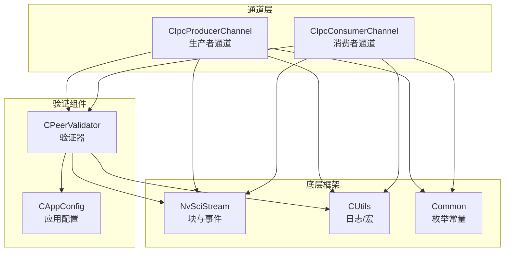
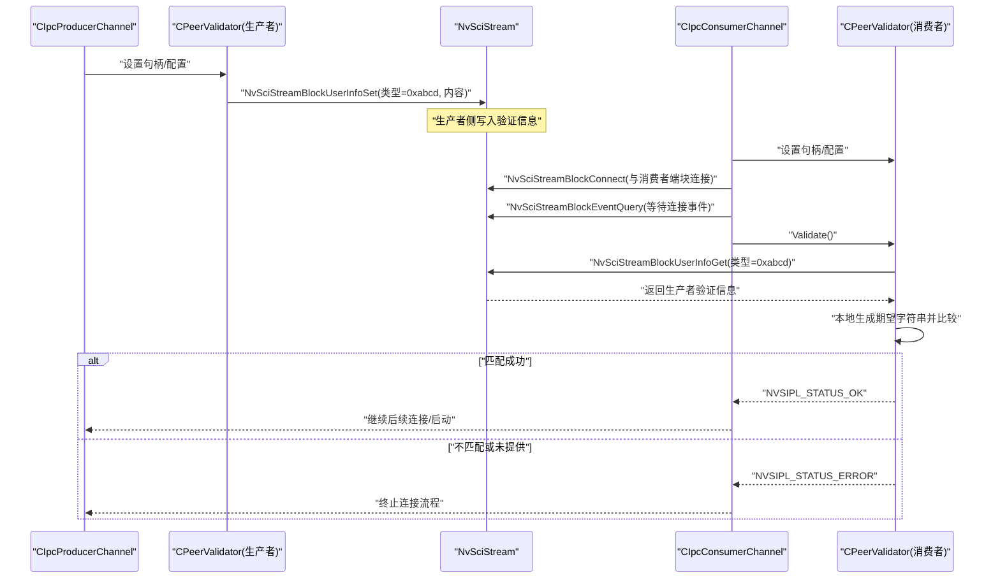
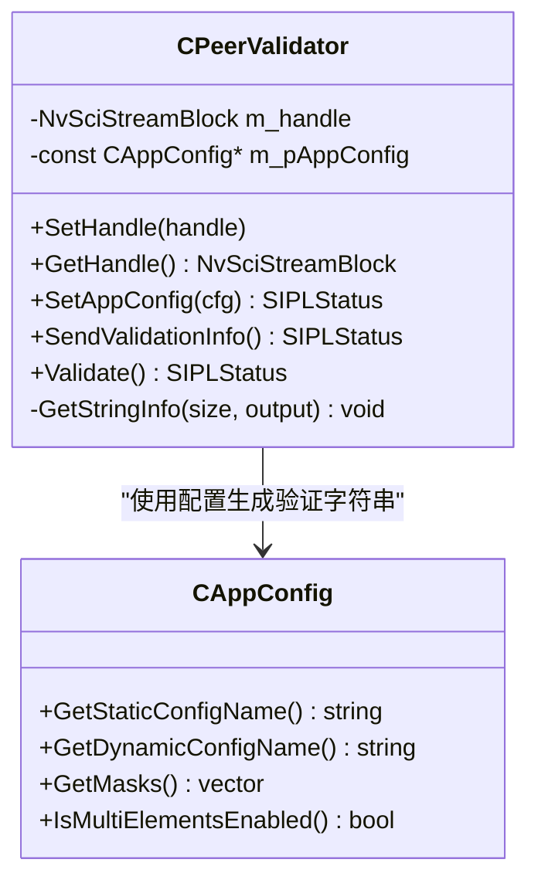
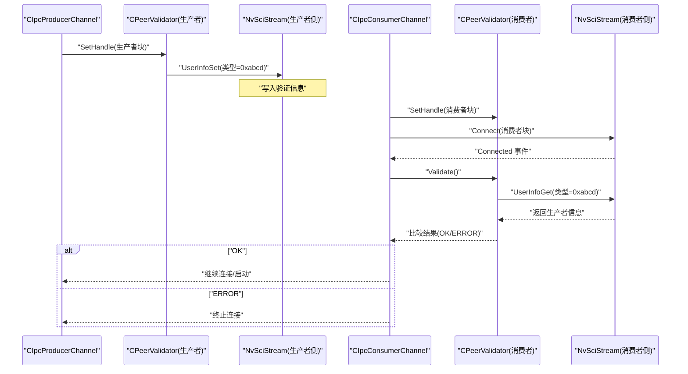
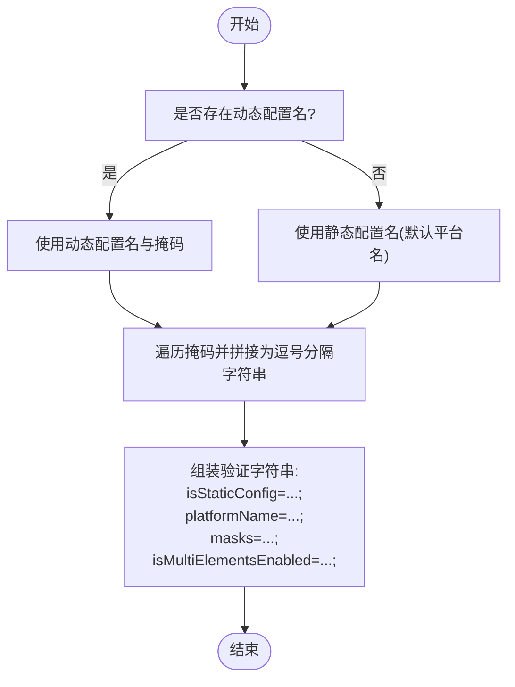
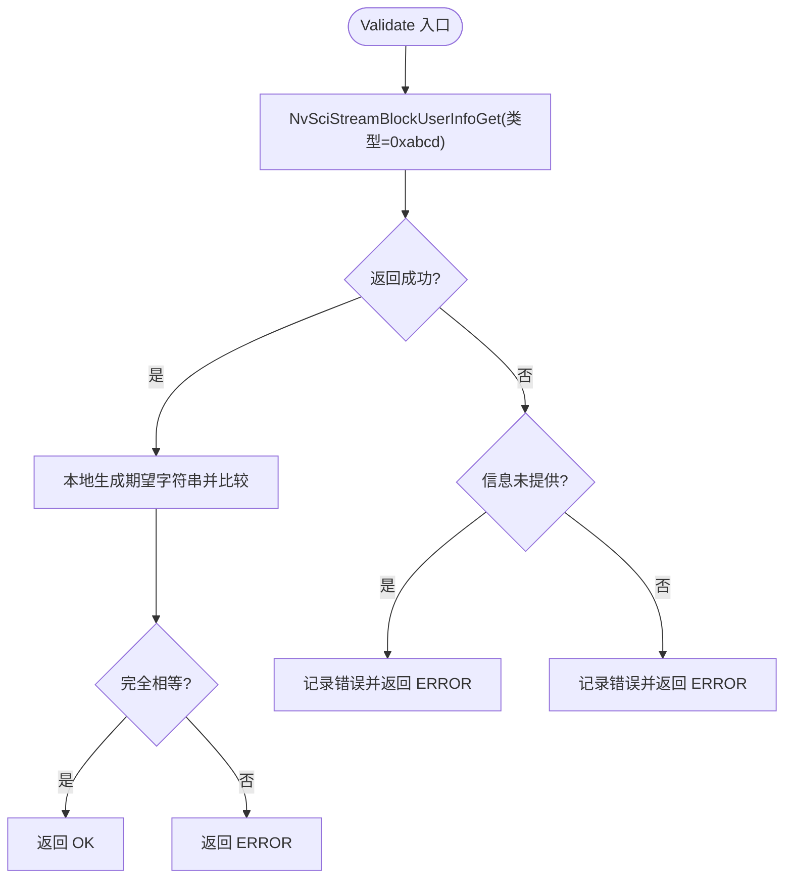
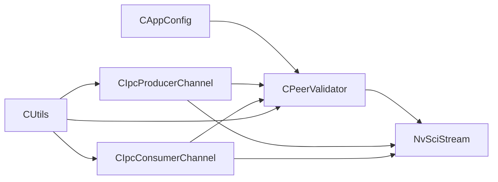

# 对等验证系统

<cite>
**本文档引用的文件**
- [CPeerValidator.hpp](file://CPeerValidator.hpp)
- [CPeerValidator.cpp](file://CPeerValidator.cpp)
- [CAppConfig.hpp](file://CAppConfig.hpp)
- [CAppConfig.cpp](file://CAppConfig.cpp)
- [CIpcProducerChannel.hpp](file://CIpcProducerChannel.hpp)
- [CIpcConsumerChannel.hpp](file://CIpcConsumerChannel.hpp)
- [CUtils.hpp](file://CUtils.hpp)
- [CUtils.cpp](file://CUtils.cpp)
- [Common.hpp](file://Common.hpp)
- [CClientCommon.cpp](file://CClientCommon.cpp)
- [main.cpp](file://main.cpp)
</cite>

## 目录
1. [简介](#简介)
2. [项目结构](#项目结构)
3. [核心组件](#核心组件)
4. [架构总览](#架构总览)
5. [详细组件分析](#详细组件分析)
6. [依赖关系分析](#依赖关系分析)
7. [性能考虑](#性能考虑)
8. [故障排除指南](#故障排除指南)
9. [结论](#结论)
10. [附录](#附录)

## 简介
本文件面向对等验证系统的技术文档，聚焦于 CPeerValidator 类在进程间通信（IPC）中的身份认证与一致性校验机制。该系统基于 NVIDIA NvSciStream 框架，通过“生产者-消费者”通道在进程内或跨进程之间建立连接，并在连接建立前进行对等信息验证，确保双方配置一致，防止不兼容的流拓扑导致运行时异常。

验证流程的关键点：
- 生产者在创建块后向 NvSciStream 用户信息区写入自身配置摘要；
- 消费者在连接阶段从用户信息区读取并比对，若不一致则拒绝进入后续阶段；
- 验证失败时，系统记录错误日志并返回错误状态，避免错误连接造成资源浪费或运行时崩溃。

## 项目结构
与对等验证直接相关的模块与文件如下：
- CPeerValidator：负责生成与发送/接收验证信息，执行字符串级比对；
- CAppConfig：封装应用配置（平台名、掩码、多元素开关等），为验证信息提供数据源；
- CIpcProducerChannel / CIpcConsumerChannel：在通道创建与连接阶段集成 CPeerValidator；
- CUtils：提供日志宏、错误检查宏与通用工具；
- Common：定义通信类型、实体类型、队列类型等枚举常量；
- CClientCommon：处理 NvSciStream 事件（如错误、断开）的通用逻辑；
- main：程序入口，负责初始化与生命周期管理。

**图表来源**
- [CPeerValidator.hpp:21-61](file://CPeerValidator.hpp#L21-L61)
- [CPeerValidator.cpp:24-63](file://CPeerValidator.cpp#L24-L63)
- [CAppConfig.hpp:19-80](file://CAppConfig.hpp#L19-L80)
- [CIpcProducerChannel.hpp:20-379](file://CIpcProducerChannel.hpp#L20-L379)
- [CIpcConsumerChannel.hpp:19-148](file://CIpcConsumerChannel.hpp#L19-L148)
- [CUtils.hpp:25-311](file://CUtils.hpp#L25-L311)
- [Common.hpp:35-86](file://Common.hpp#L35-L86)

**章节来源**
- [CPeerValidator.hpp:11-63](file://CPeerValidator.hpp#L11-L63)
- [CPeerValidator.cpp:14-63](file://CPeerValidator.cpp#L14-L63)
- [CAppConfig.hpp:19-80](file://CAppConfig.hpp#L19-L80)
- [CIpcProducerChannel.hpp:58-131](file://CIpcProducerChannel.hpp#L58-L131)
- [CIpcConsumerChannel.hpp:63-118](file://CIpcConsumerChannel.hpp#L63-L118)
- [CUtils.hpp:25-116](file://CUtils.hpp#L25-L116)
- [Common.hpp:35-86](file://Common.hpp#L35-L86)

## 核心组件
- CPeerValidator
  - 负责将当前进程的配置摘要写入 NvSciStream 用户信息区（生产者侧），以及从用户信息区读取并比对（消费者侧）。
  - 使用固定类型标识与固定缓冲大小，保证跨进程一致性。
- CAppConfig
  - 提供平台名称、掩码集合、是否启用多元素等关键配置项，作为验证信息的来源。
  - 在安全版本下，动态配置与掩码可能不可用，回退到静态配置。
- 通道集成
  - 生产者通道在创建块后立即发送验证信息；
  - 消费者通道在连接阶段执行验证，失败则中止连接流程。

**章节来源**
- [CPeerValidator.hpp:21-61](file://CPeerValidator.hpp#L21-L61)
- [CPeerValidator.cpp:24-63](file://CPeerValidator.cpp#L24-L63)
- [CAppConfig.hpp:19-80](file://CAppConfig.hpp#L19-L80)
- [CIpcProducerChannel.hpp:122-129](file://CIpcProducerChannel.hpp#L122-L129)
- [CIpcConsumerChannel.hpp:112-116](file://CIpcConsumerChannel.hpp#L112-L116)

## 架构总览
对等验证贯穿通道创建与连接阶段，形成如下流程：

**图表来源**
- [CIpcProducerChannel.hpp:122-129](file://CIpcProducerChannel.hpp#L122-L129)
- [CIpcConsumerChannel.hpp:112-116](file://CIpcConsumerChannel.hpp#L112-L116)
- [CPeerValidator.cpp:24-63](file://CPeerValidator.cpp#L24-L63)

## 详细组件分析

### CPeerValidator 类分析
- 成员变量
  - NvSciStreamBlock 句柄：用于读写用户信息区；
  - CAppConfig 指针：提供配置数据源。
- 关键方法
  - SendValidationInfo：生成验证字符串并写入用户信息区；
  - Validate：从用户信息区读取生产者信息，与本地生成的期望字符串进行字面量比较；
  - GetStringInfo：根据配置生成固定格式的验证字符串，包含静态/动态配置标志、平台名、掩码列表、多元素开关等。

**图表来源**
- [CPeerValidator.hpp:21-61](file://CPeerValidator.hpp#L21-L61)
- [CPeerValidator.cpp:24-92](file://CPeerValidator.cpp#L24-L92)
- [CAppConfig.hpp:19-80](file://CAppConfig.hpp#L19-L80)

**章节来源**
- [CPeerValidator.hpp:21-61](file://CPeerValidator.hpp#L21-L61)
- [CPeerValidator.cpp:24-92](file://CPeerValidator.cpp#L24-L92)
- [CAppConfig.hpp:19-80](file://CAppConfig.hpp#L19-L80)

### 通道集成与连接流程
- 生产者通道
  - 在创建块阶段实例化 CPeerValidator，设置其句柄为生产者块，随后发送验证信息；
  - 连接阶段仅负责建立 NvSciStream 链路，不重复验证。
- 消费者通道
  - 创建块阶段实例化 CPeerValidator，设置其句柄为消费者块；
  - 连接阶段等待消费者块、队列与 IPC 块的连接事件后，执行 Validate；
  - 若验证失败，返回错误并终止连接；成功则继续。

**图表来源**
- [CIpcProducerChannel.hpp:122-129](file://CIpcProducerChannel.hpp#L122-L129)
- [CIpcConsumerChannel.hpp:112-116](file://CIpcConsumerChannel.hpp#L112-L116)
- [CPeerValidator.cpp:24-63](file://CPeerValidator.cpp#L24-L63)

**章节来源**
- [CIpcProducerChannel.hpp:122-129](file://CIpcProducerChannel.hpp#L122-L129)
- [CIpcConsumerChannel.hpp:112-116](file://CIpcConsumerChannel.hpp#L112-L116)

### 配置与验证信息生成
- 验证信息字段
  - 是否静态配置（isStaticConfig）
  - 平台名称（platformName）
  - 掩码列表（masks）
  - 多元素开关（isMultiElementsEnabled）
- 生成规则
  - 动态配置可用时优先使用动态配置名与掩码；
  - 否则回退到静态配置名（默认值为特定平台名）；
  - 掩码列表以逗号分隔拼接；
  - 多元素开关转换为整型写入。

**图表来源**
- [CPeerValidator.cpp:65-92](file://CPeerValidator.cpp#L65-L92)
- [CAppConfig.cpp:21-75](file://CAppConfig.cpp#L21-L75)

**章节来源**
- [CPeerValidator.cpp:65-92](file://CPeerValidator.cpp#L65-L92)
- [CAppConfig.cpp:21-75](file://CAppConfig.cpp#L21-L75)

### 错误处理与事件监控
- 验证失败路径
  - UserInfoGet 返回“信息未提供”：表示生产者未发送验证信息；
  - 其他错误：查询失败或底层错误；
  - 统一返回错误状态，阻止后续连接。
- 通用事件处理
  - 当收到 NvSciStream 错误或断开事件时，记录错误码并返回错误状态；
  - 通道连接阶段使用 FOREVER 超时等待事件，确保连接稳定。

**图表来源**
- [CPeerValidator.cpp:37-63](file://CPeerValidator.cpp#L37-L63)
- [CClientCommon.cpp:182-205](file://CClientCommon.cpp#L182-L205)

**章节来源**
- [CPeerValidator.cpp:37-63](file://CPeerValidator.cpp#L37-L63)
- [CClientCommon.cpp:182-205](file://CClientCommon.cpp#L182-L205)

## 依赖关系分析
- 组件耦合
  - CPeerValidator 强依赖 CAppConfig 的配置项；
  - 通道层（生产者/消费者）强依赖 CPeerValidator 完成对等验证；
  - 底层依赖 NvSciStream 的用户信息接口与事件查询。
- 外部依赖
  - NvSciStream：块连接、事件查询、用户信息读写；
  - 日志与错误宏：统一错误传播与日志输出。

**图表来源**
- [CAppConfig.hpp:19-80](file://CAppConfig.hpp#L19-L80)
- [CPeerValidator.hpp:14-19](file://CPeerValidator.hpp#L14-L19)
- [CIpcProducerChannel.hpp:12-15](file://CIpcProducerChannel.hpp#L12-L15)
- [CIpcConsumerChannel.hpp:12-14](file://CIpcConsumerChannel.hpp#L12-L14)

**章节来源**
- [CAppConfig.hpp:19-80](file://CAppConfig.hpp#L19-L80)
- [CPeerValidator.hpp:14-19](file://CPeerValidator.hpp#L14-L19)
- [CIpcProducerChannel.hpp:12-15](file://CIpcProducerChannel.hpp#L12-L15)
- [CIpcConsumerChannel.hpp:12-14](file://CIpcConsumerChannel.hpp#L12-L14)

## 性能考虑
- 验证信息大小固定（256 字节），避免频繁分配与拷贝；
- 验证采用字符串比较，复杂度 O(n)，n 为配置串长度；
- 连接阶段使用 FOREVER 等待事件，确保稳定性但可能阻塞；
- 建议
  - 控制配置项数量与长度，减少字符串拼接成本；
  - 在高并发场景下，尽量缩短通道创建与连接链路，减少等待时间；
  - 将日志级别调至必要水平，避免调试日志影响性能。

[本节为通用性能讨论，无需具体文件分析]

## 故障排除指南
- 现象：消费者 Validate 返回错误
  - 可能原因：生产者未发送验证信息、配置不一致、字符串比较失败；
  - 处理步骤：检查生产者是否已调用发送验证信息；核对平台名、掩码、多元素开关是否一致；查看日志中“来自生产者”与“本地”的对比内容。
- 现象：连接阶段卡住
  - 可能原因：某块未发出连接事件或底层阻塞；
  - 处理步骤：确认 FOREVER 等待是否合理；检查各块 EventQuery 是否可达；查看错误事件处理逻辑。
- 现象：运行时出现错误或断开
  - 可能原因：底层 NvSciStream 错误或断开事件；
  - 处理步骤：记录并上报错误码；根据错误码定位问题模块；必要时重启相关通道。

**章节来源**
- [CPeerValidator.cpp:37-63](file://CPeerValidator.cpp#L37-L63)
- [CClientCommon.cpp:182-205](file://CClientCommon.cpp#L182-L205)
- [CIpcProducerChannel.hpp:171-184](file://CIpcProducerChannel.hpp#L171-L184)
- [CIpcConsumerChannel.hpp:85-118](file://CIpcConsumerChannel.hpp#L85-L118)

## 结论
CPeerValidator 通过在 NvSciStream 用户信息区写入与读取配置摘要，实现了生产者与消费者之间的轻量级对等验证。该机制简单可靠，能有效避免配置不一致导致的连接失败与运行时异常。结合通道层的事件驱动连接与统一的日志/错误处理，系统在复杂多进程环境中保持了良好的稳定性与可维护性。

[本节为总结性内容，无需具体文件分析]

## 附录

### 配置选项与行为说明
- 平台配置
  - 静态配置：当未指定动态配置时，默认使用静态平台名；
  - 动态配置：通过查询数据库获取平台配置与掩码，支持掩码应用。
- 多元素开关
  - 控制是否启用多元素数据路径，影响验证字符串中的开关位。
- 通信类型与实体类型
  - 通信类型（进程内/进程间/芯片间）、实体类型（生产者/消费者）、队列类型（Mailbox/FIFO）等枚举由公共头文件定义，影响通道选择与行为。

**章节来源**
- [CAppConfig.cpp:21-75](file://CAppConfig.cpp#L21-L75)
- [Common.hpp:35-86](file://Common.hpp#L35-L86)

### 实际验证场景示例
- 场景一：生产者与消费者均使用静态配置
  - 预期：平台名一致，掩码为空，多元素开关关闭；
  - 结果：验证通过，连接正常。
- 场景二：生产者使用动态配置，消费者使用静态配置
  - 预期：验证失败（平台名/掩码不一致）；
  - 结果：消费者 Validate 返回错误，连接被中止。
- 场景三：生产者/消费者任一方未发送/读取验证信息
  - 预期：消费者收到“信息未提供”错误；
  - 结果：验证失败，连接终止。

**章节来源**
- [CPeerValidator.cpp:37-63](file://CPeerValidator.cpp#L37-L63)
- [CAppConfig.cpp:21-75](file://CAppConfig.cpp#L21-L75)