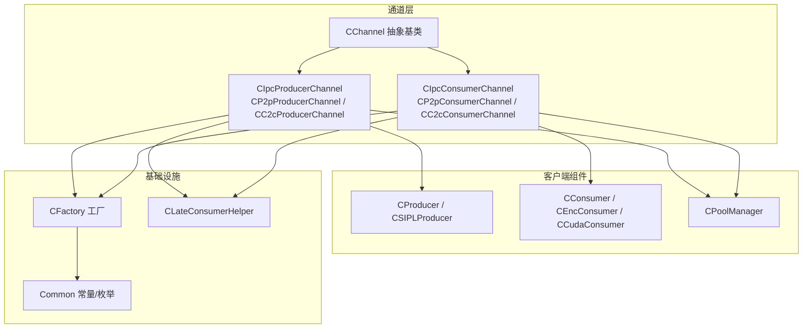
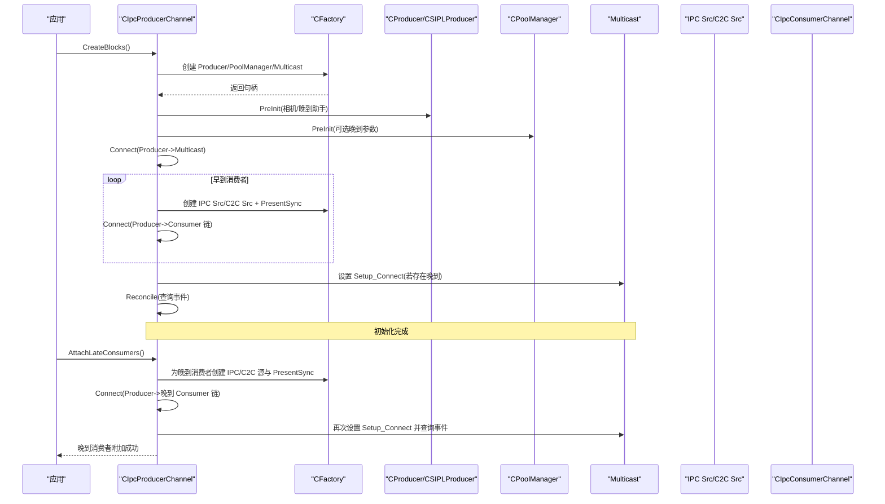
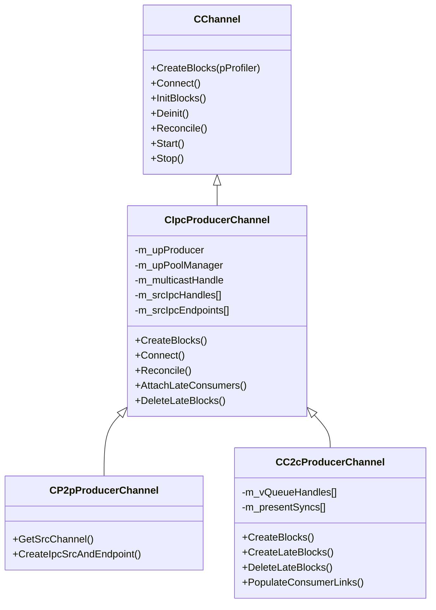
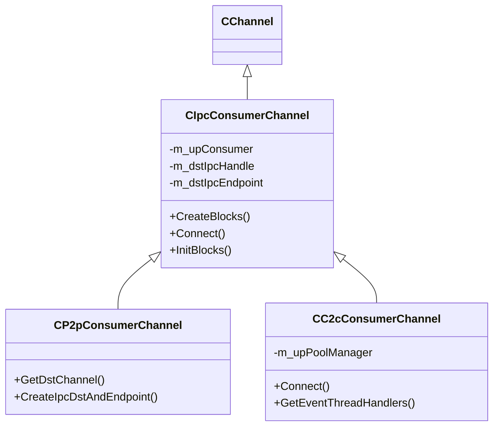
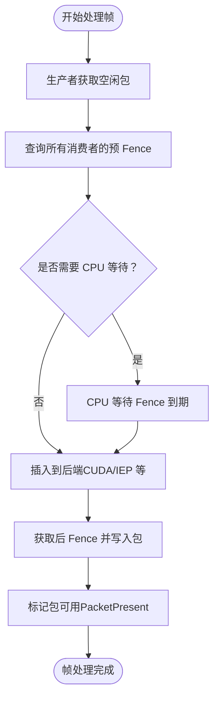
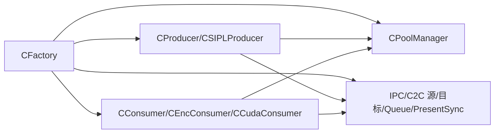

# 进程间通信通道

<cite>
**本文引用的文件**
- [CIpcProducerChannel.hpp](file://CIpcProducerChannel.hpp)
- [CIpcConsumerChannel.hpp](file://CIpcConsumerChannel.hpp)
- [CChannel.hpp](file://CChannel.hpp)
- [CFactory.hpp](file://CFactory.hpp)
- [CPoolManager.hpp](file://CPoolManager.hpp)
- [CEventHandler.hpp](file://CEventHandler.hpp)
- [Common.hpp](file://Common.hpp)
- [CProducer.hpp](file://CProducer.hpp)
- [CConsumer.hpp](file://CConsumer.hpp)
- [CSIPLProducer.cpp](file://CSIPLProducer.cpp)
- [CProducer.cpp](file://CProducer.cpp)
- [CEncConsumer.cpp](file://CEncConsumer.cpp)
- [CCudaConsumer.cpp](file://CCudaConsumer.cpp)
- [CLateConsumerHelper.hpp](file://CLateConsumerHelper.hpp)
- [CSiplCamera.hpp](file://CSiplCamera.hpp)
</cite>

## 目录
1. [引言](#引言)
2. [项目结构](#项目结构)
3. [核心组件](#核心组件)
4. [架构总览](#架构总览)
5. [详细组件分析](#详细组件分析)
6. [依赖关系分析](#依赖关系分析)
7. [性能考量](#性能考量)
8. [故障排查指南](#故障排查指南)
9. [结论](#结论)
10. [附录](#附录)

## 引言
本文件围绕进程间通信（IPC）通道的设计与实现展开，重点解析 CIpcProducerChannel 和 CIpcConsumerChannel 的架构差异与实现策略，覆盖以下主题：
- 生产者与消费者的通道类型：点对点（P2P）与片间通信（C2C）两种模式的构建与连接流程
- NvStreams API 使用：通道创建、块连接、事件查询与资源释放
- 进程间数据同步：基于 NvSciBuf/NvSciSync 的缓冲区管理、流量控制与背压处理
- 性能优化：缓冲区大小、队列类型、传输策略与内存使用建议
- 故障诊断：常见错误场景、定位方法与修复路径

## 项目结构
该模块以“通道”为抽象基类，派生出 IPC 生产者与消费者两类通道；通过工厂模式创建块（Producer/Consumer/Pool/IPC/C2C Queue/PresentSync 等），并在统一的事件循环中驱动状态机。

图表来源
- [CChannel.hpp:28-157](file://CChannel.hpp#L28-L157)
- [CIpcProducerChannel.hpp:20-379](file://CIpcProducerChannel.hpp#L20-L379)
- [CIpcConsumerChannel.hpp:19-148](file://CIpcConsumerChannel.hpp#L19-L148)
- [CFactory.hpp:27-95](file://CFactory.hpp#L27-L95)
- [CPoolManager.hpp:33-71](file://CPoolManager.hpp#L33-L71)
- [Common.hpp:35-87](file://Common.hpp#L35-L87)

章节来源
- [CChannel.hpp:28-157](file://CChannel.hpp#L28-L157)
- [CIpcProducerChannel.hpp:20-379](file://CIpcProducerChannel.hpp#L20-L379)
- [CIpcConsumerChannel.hpp:19-148](file://CIpcConsumerChannel.hpp#L19-L148)
- [CFactory.hpp:27-95](file://CFactory.hpp#L27-L95)
- [CPoolManager.hpp:33-71](file://CPoolManager.hpp#L33-L71)
- [Common.hpp:35-87](file://Common.hpp#L35-L87)

## 核心组件
- 通道抽象与生命周期
  - CChannel 提供统一的事件线程模型、Reconcile/Start/Stop 生命周期管理，以及按阶段查询事件的回调机制
- 生产者通道
  - CIpcProducerChannel 负责创建 Producer、PoolManager、Multicast、IPC 源块与 PresentSync（C2C）
  - 支持早到消费者与晚到消费者（Late Attach）两种拓扑，动态连接与断开
- 消费者通道
  - CIpcConsumerChannel 负责创建 Consumer、PoolManager（C2C）、IPC 目标块与队列
  - 通过事件查询确保链路连通性与初始化完成
- 工厂与资源
  - CFactory 统一创建块、队列、IPC/C2C 源/目标、Multicast 与 PresentSync
- 同步与缓冲
  - CProducer/CConsumer 驱动 NvStreams 事件，插入/等待 Fence 实现跨进程同步
  - CPoolManager 管理包元素、缓冲区与 C2C 元素过滤

章节来源
- [CChannel.hpp:55-109](file://CChannel.hpp#L55-L109)
- [CIpcProducerChannel.hpp:58-131](file://CIpcProducerChannel.hpp#L58-L131)
- [CIpcConsumerChannel.hpp:63-83](file://CIpcConsumerChannel.hpp#L63-L83)
- [CFactory.hpp:36-76](file://CFactory.hpp#L36-L76)
- [CProducer.hpp:16-52](file://CProducer.hpp#L16-L52)
- [CConsumer.hpp:16-44](file://CConsumer.hpp#L16-L44)
- [CPoolManager.hpp:33-71](file://CPoolManager.hpp#L33-L71)

## 架构总览
下图展示生产者侧的多阶段构建与连接流程，包括早到/晚到消费者的动态接入。

图表来源
- [CIpcProducerChannel.hpp:88-184](file://CIpcProducerChannel.hpp#L88-L184)
- [CIpcProducerChannel.hpp:205-272](file://CIpcProducerChannel.hpp#L205-L272)
- [CFactory.hpp:42-76](file://CFactory.hpp#L42-L76)

章节来源
- [CIpcProducerChannel.hpp:88-184](file://CIpcProducerChannel.hpp#L88-L184)
- [CIpcProducerChannel.hpp:205-272](file://CIpcProducerChannel.hpp#L205-L272)
- [CFactory.hpp:42-76](file://CFactory.hpp#L42-L76)

## 详细组件分析

### CIpcProducerChannel 设计与实现
- 分层职责
  - 抽象层：定义通道名、缓冲/同步模块、传感器信息、应用配置
  - 派生层：P2P 与 C2C 生产者分别映射不同的 IPC/C2C 通道命名与块创建策略
- 关键流程
  - CreateBlocks：创建 PoolManager、Producer、Multicast；为早到消费者创建 IPC 源与端点
  - Connect：将 Producer 连接至 Multicast，并逐个连接各消费者链路；必要时设置 Multicast 的 Setup_Connect
  - Reconcile：查询 Multicast 事件，确认 SetupComplete，准备晚到消费者接入
  - AttachLateConsumers/DeleteLateBlocks：动态创建/断开晚到消费者的 IPC/C2C 源与 PresentSync
- 同步与事件
  - 事件线程在 Reconcile/Start 阶段启动，监听 PoolManager 与 Producer 的事件
  - 查询阻塞直至事件到达或超时，避免忙轮询

图表来源
- [CChannel.hpp:28-157](file://CChannel.hpp#L28-L157)
- [CIpcProducerChannel.hpp:20-379](file://CIpcProducerChannel.hpp#L20-L379)

章节来源
- [CIpcProducerChannel.hpp:20-379](file://CIpcProducerChannel.hpp#L20-L379)
- [CChannel.hpp:55-109](file://CChannel.hpp#L55-L109)

### CIpcConsumerChannel 设计与实现
- 分层职责
  - 抽象层：定义通道名、缓冲/同步模块、传感器信息、应用配置
  - 派生层：P2P 与 C2C 消费者分别映射不同的 IPC/C2C 通道命名与块创建策略
- 关键流程
  - CreateBlocks：创建 Consumer、IPC 目标块与端点；可选 Peer 验证器
  - Connect：将 IPC 目标连接到 Consumer，查询 IPC、队列与 Consumer 的事件，确保连通
  - InitBlocks：初始化 Consumer
- C2C 特性
  - 可选 PoolManager（用于 C2C 源端池）与 PresentSync（用于晚到消费者）

图表来源
- [CIpcConsumerChannel.hpp:19-148](file://CIpcConsumerChannel.hpp#L19-L148)
- [CIpcConsumerChannel.hpp:150-262](file://CIpcConsumerChannel.hpp#L150-L262)

章节来源
- [CIpcConsumerChannel.hpp:19-148](file://CIpcConsumerChannel.hpp#L19-L148)
- [CIpcConsumerChannel.hpp:150-262](file://CIpcConsumerChannel.hpp#L150-L262)

### NvStreams API 使用要点
- 通道创建与连接
  - 通过 CFactory 创建 Producer/Consumer、Pool、IPC/C2C 源/目标、Multicast、Queue、PresentSync
  - 使用 NvSciStreamBlockConnect 将 Producer 与 Multicast、Multicast 与各消费者链路连接
- 事件查询与状态机
  - 使用 NvSciStreamBlockEventQuery 查询事件，阻塞直到事件到达或超时
  - 在 Reconcile/Start 阶段由事件线程驱动，避免阻塞主线程
- 资源管理
  - 释放顺序：Producer/Consumer 队列与自身块、IPC 端点、Multicast、Pool
  - 晚到消费者资源需单独创建/删除，保证连接/断开一致性

章节来源
- [CIpcProducerChannel.hpp:133-184](file://CIpcProducerChannel.hpp#L133-L184)
- [CIpcConsumerChannel.hpp:85-118](file://CIpcConsumerChannel.hpp#L85-L118)
- [CChannel.hpp:112-140](file://CChannel.hpp#L112-L140)

### 缓冲区管理、流量控制与背压
- 包与元素
  - CPoolManager 管理包数量与元素属性，支持 C2C 元素过滤
  - 生产者在 SetupComplete 阶段注册图像缓冲，消费者映射缓冲并进行后续处理
- Fence 与同步
  - 生产者从每个消费者查询预 Fence，必要时在 CPU 上等待或插入到 CUDA/CPU 等后端
  - 消费者在处理完成后生成后 Fence（如编码器 EOF），用于通知生产者回收缓冲
- 背压与拥塞
  - 通过事件查询与 Fence 等待实现软背压：当消费者未消费完缓冲时，生产者不再发出新包
  - C2C 模式下的 PresentSync 作为额外同步点，有助于稳定晚到消费者的接入

图表来源
- [CProducer.cpp:56-121](file://CProducer.cpp#L56-L121)
- [CSIPLProducer.cpp:367-404](file://CSIPLProducer.cpp#L367-L404)
- [CEncConsumer.cpp:309-345](file://CEncConsumer.cpp#L309-L345)
- [CCudaConsumer.cpp:300-322](file://CCudaConsumer.cpp#L300-L322)

章节来源
- [CProducer.cpp:56-121](file://CProducer.cpp#L56-L121)
- [CSIPLProducer.cpp:367-404](file://CSIPLProducer.cpp#L367-L404)
- [CEncConsumer.cpp:309-345](file://CEncConsumer.cpp#L309-L345)
- [CCudaConsumer.cpp:300-322](file://CCudaConsumer.cpp#L300-L322)

### 传输策略与通道类型
- 点对点（P2P）
  - 使用 IPC 源/目标块直接连接生产者与消费者
  - 适合一对一或少量消费者场景
- 片间通信（C2C）
  - 使用队列与 PresentSync，支持多消费者广播与晚到接入
  - 适合多消费者与动态拓扑场景

章节来源
- [CIpcProducerChannel.hpp:381-410](file://CIpcProducerChannel.hpp#L381-L410)
- [CIpcProducerChannel.hpp:411-530](file://CIpcProducerChannel.hpp#L411-L530)
- [CIpcConsumerChannel.hpp:150-182](file://CIpcConsumerChannel.hpp#L150-L182)
- [CIpcConsumerChannel.hpp:184-261](file://CIpcConsumerChannel.hpp#L184-L261)

## 依赖关系分析
- 组件耦合
  - 通道层仅依赖工厂接口创建块，降低具体实现耦合
  - 生产者/消费者通过 CClientCommon 抽象共享事件处理与 Fence 插入逻辑
- 外部依赖
  - NvSciBuf/NvSciSync/NvStreams：用于缓冲与同步
  - NvMedia/IEP：编码器等硬件加速组件（在 CEncConsumer 中体现）
- 潜在风险
  - 事件查询超时阈值与线程模型需统一配置，避免死锁或饥饿
  - 晚到消费者接入需严格遵循 Multicast 的 Setup_Connect 流程

图表来源
- [CFactory.hpp:36-76](file://CFactory.hpp#L36-L76)
- [CProducer.hpp:16-52](file://CProducer.hpp#L16-L52)
- [CConsumer.hpp:16-44](file://CConsumer.hpp#L16-L44)
- [CPoolManager.hpp:33-71](file://CPoolManager.hpp#L33-L71)

章节来源
- [CFactory.hpp:36-76](file://CFactory.hpp#L36-L76)
- [CProducer.hpp:16-52](file://CProducer.hpp#L16-L52)
- [CConsumer.hpp:16-44](file://CConsumer.hpp#L16-L44)
- [CPoolManager.hpp:33-71](file://CPoolManager.hpp#L33-L71)

## 性能考量
- 缓冲区大小与包数
  - 通过 MAX_NUM_PACKETS 控制池内包数量，平衡延迟与内存占用
  - C2C 模式下可根据输出类型启用/跳过元素，减少无效缓冲
- 队列类型与 PresentSync
  - 队列类型影响吞吐与延迟；Mailbox/FIFO 适用于不同负载特征
  - PresentSync 作为额外同步点，有助于稳定晚到接入，但会引入额外开销
- 同步策略
  - 尽可能在后端（CUDA/IEP）侧等待 Fence，减少 CPU 等待
  - 对于 ISP/IEP 等硬件路径，合理设置 Fence 插入时机，避免过度阻塞
- 内存使用
  - CUDA 映射外部内存与 mipmapped array，减少拷贝；注意设备/主机内存分配与释放
  - 文件转储仅在必要区间开启，避免 IO 压力

章节来源
- [Common.hpp:14-31](file://Common.hpp#L14-L31)
- [CIpcProducerChannel.hpp:442-453](file://CIpcProducerChannel.hpp#L442-L453)
- [CCudaConsumer.cpp:173-273](file://CCudaConsumer.cpp#L173-L273)
- [CEncConsumer.cpp:117-140](file://CEncConsumer.cpp#L117-L140)

## 故障排查指南
- 常见错误与定位
  - 事件查询失败/超时：检查 Producer/Consumer/Multicast/IPC/C2C 链路是否正确连接
  - 晚到消费者接入失败：确认 Multicast 的 Setup_Connect 是否被设置，且事件查询返回 SetupComplete
  - Fence 获取/等待异常：核对预 Fence 是否为空，CPU 等待上下文是否正确
- 定位步骤
  - 启用调试日志，观察 Connect/Reconcile/AttachLateConsumers 各阶段的事件查询结果
  - 对照通道类型（P2P/C2C）与队列类型（Mailbox/FIFO）核对创建与连接序列
- 修复建议
  - 修正连接顺序：先 Producer->Multicast，再 Multicast->Consumer 链
  - 释放资源时严格遵循句柄顺序，避免悬挂或泄漏
  - 针对晚到消费者，确保 IPC/C2C 源与 PresentSync 成功创建并断开

章节来源
- [CIpcProducerChannel.hpp:133-184](file://CIpcProducerChannel.hpp#L133-L184)
- [CIpcProducerChannel.hpp:205-272](file://CIpcProducerChannel.hpp#L205-L272)
- [CProducer.cpp:17-54](file://CProducer.cpp#L17-L54)
- [CChannel.hpp:112-140](file://CChannel.hpp#L112-L140)

## 结论
本设计以 CChannel 为抽象基类，结合 CFactory 工厂模式，将 IPC 生产者与消费者通道解耦为 P2P 与 C2C 两大策略。通过 NvStreams/NvSciBuf/NvSciSync 的协同，实现了可靠的跨进程缓冲与同步，支持早到/晚到消费者的动态拓扑。在性能方面，可通过包数、队列类型与 Fence 策略进行调优；在可靠性方面，严格的事件查询与资源释放顺序是保障稳定性的关键。

## 附录
- 关键常量与枚举
  - 通道前缀、最大消费者数、队列类型、元素类型等
- 相关实现参考
  - 生产者/消费者事件处理与 Fence 插入
  - C2C 元素过滤与 PresentSync 使用
  - CUDA 映射与拷贝、编码器集成

章节来源
- [Common.hpp:35-87](file://Common.hpp#L35-L87)
- [CProducer.cpp:56-121](file://CProducer.cpp#L56-L121)
- [CSIPLProducer.cpp:348-365](file://CSIPLProducer.cpp#L348-L365)
- [CCudaConsumer.cpp:173-273](file://CCudaConsumer.cpp#L173-L273)
- [CEncConsumer.cpp:117-140](file://CEncConsumer.cpp#L117-L140)