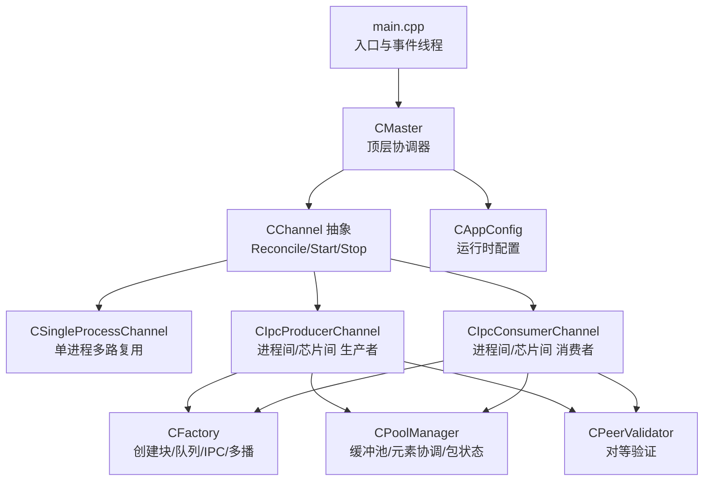
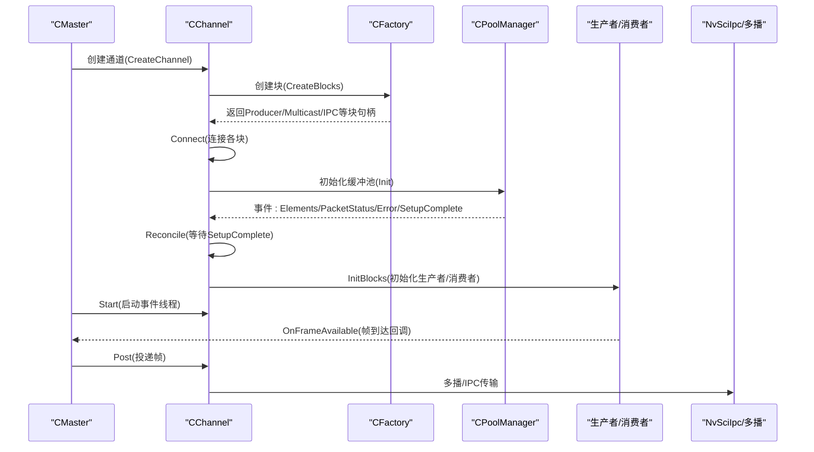
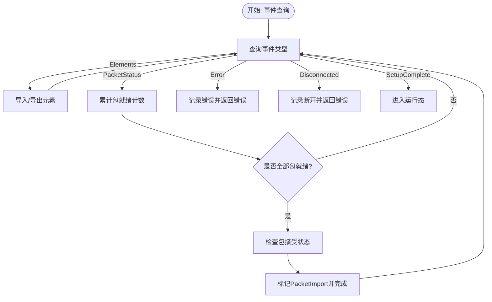
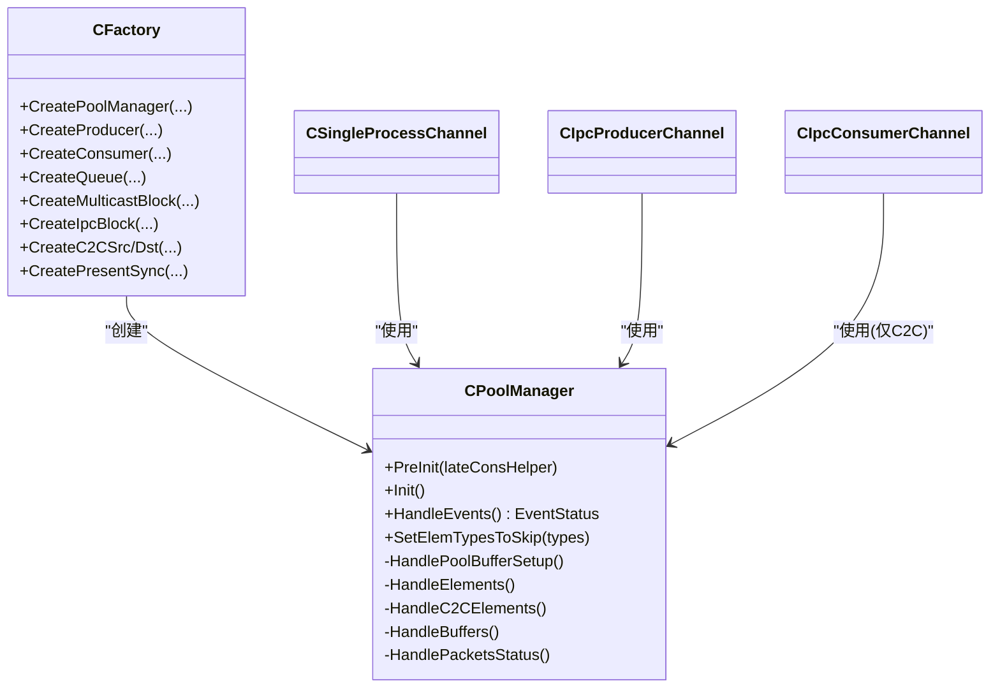
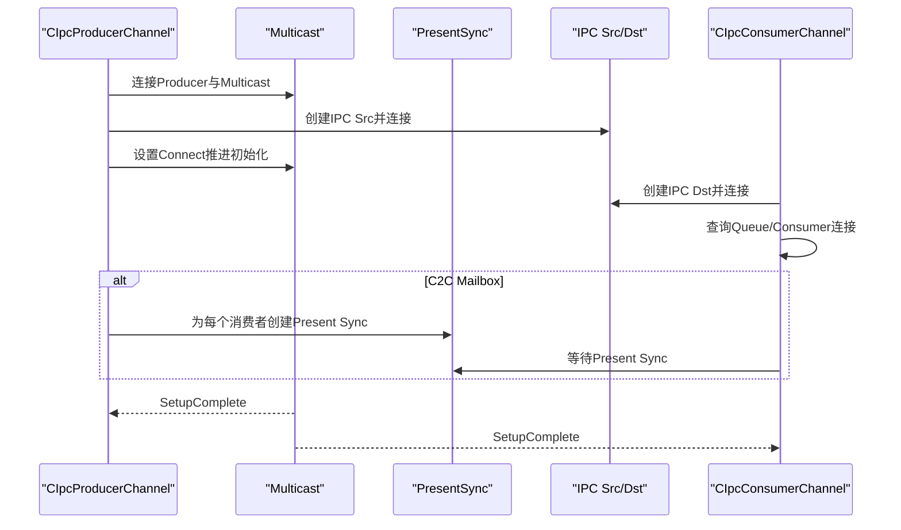
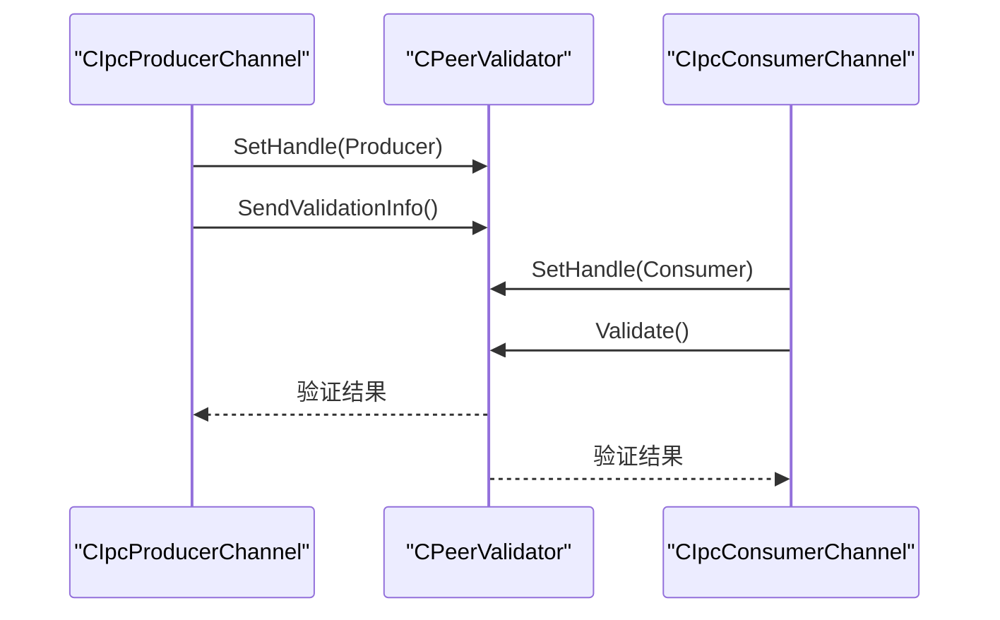
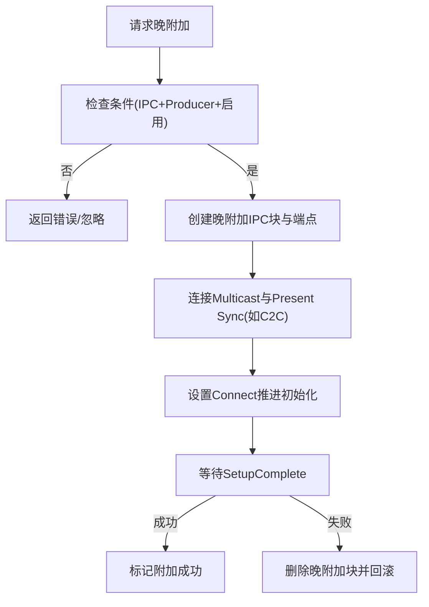
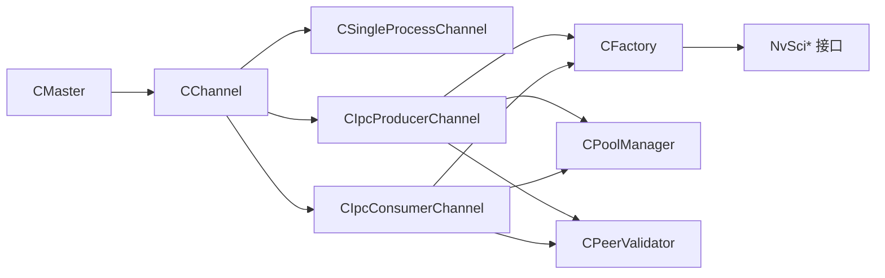

# 通信和同步机制

<cite>
**本文引用的文件**
- [main.cpp](file://main.cpp)
- [CMaster.hpp](file://CMaster.hpp)
- [CMaster.cpp](file://CMaster.cpp)
- [CChannel.hpp](file://CChannel.hpp)
- [CSingleProcessChannel.hpp](file://CSingleProcessChannel.hpp)
- [CIpcProducerChannel.hpp](file://CIpcProducerChannel.hpp)
- [CIpcConsumerChannel.hpp](file://CIpcConsumerChannel.hpp)
- [CFactory.hpp](file://CFactory.hpp)
- [CFactory.cpp](file://CFactory.cpp)
- [CPoolManager.hpp](file://CPoolManager.hpp)
- [CPoolManager.cpp](file://CPoolManager.cpp)
- [CEventHandler.hpp](file://CEventHandler.hpp)
- [CAppConfig.hpp](file://CAppConfig.hpp)
- [CAppConfig.cpp](file://CAppConfig.cpp)
</cite>

## 目录
1. [引言](#引言)
2. [项目结构](#项目结构)
3. [核心组件](#核心组件)
4. [架构总览](#架构总览)
5. [详细组件分析](#详细组件分析)
6. [依赖关系分析](#依赖关系分析)
7. [性能考虑](#性能考虑)
8. [故障排查指南](#故障排查指南)
9. [结论](#结论)

## 引言
本文件聚焦于NVSIPL多播通信系统中的“通信与同步机制”，围绕以下目标展开：
- 深入解析NvStreams（NvSciStream/NvSciBuf/NvSciSync）通信协议在系统中的实现方式，包括数据传输路径、缓冲区管理与流量控制策略。
- 系统化阐述同步机制设计，覆盖事件驱动模型、状态同步与并发控制。
- 分析对等验证（Peer Validation）如何保障跨进程/跨芯片通信的一致性与安全性。
- 提供通信性能优化实践建议，涵盖缓冲区大小、队列类型与传输策略等。
- 给出常见通信故障的诊断思路与解决步骤。

## 项目结构
该模块以“主控协调器 + 通道抽象 + 工厂构建 + 同步/缓冲区管理”为核心组织方式：
- 主入口负责参数解析、信号处理、事件线程与生命周期编排。
- CMaster作为顶层协调者，按配置选择通信模式（单进程/进程间/芯片间），并调度各传感器通道。
- 通道层抽象了不同通信场景下的连接、初始化与事件循环。
- 工厂负责创建生产者/消费者、队列、多播块、IPC块与同步对象。
- 缓冲池管理器负责元素属性协调、包创建与状态导入导出，配合事件驱动完成流式传输准备。
- 对等验证在IPC/C2C场景中用于校验对端能力与一致性。

图表来源
- [main.cpp:253-304](file://main.cpp#L253-L304)
- [CMaster.cpp:426-451](file://CMaster.cpp#L426-L451)
- [CChannel.hpp:55-82](file://CChannel.hpp#L55-L82)
- [CSingleProcessChannel.hpp:87-159](file://CSingleProcessChannel.hpp#L87-L159)
- [CIpcProducerChannel.hpp:88-131](file://CIpcProducerChannel.hpp#L88-L131)
- [CIpcConsumerChannel.hpp:63-83](file://CIpcConsumerChannel.hpp#L63-L83)
- [CFactory.cpp:138-205](file://CFactory.cpp#L138-L205)
- [CPoolManager.cpp:30-40](file://CPoolManager.cpp#L30-L40)
- [CAppConfig.hpp:19-82](file://CAppConfig.hpp#L19-L82)

章节来源
- [main.cpp:253-304](file://main.cpp#L253-L304)
- [CMaster.cpp:426-451](file://CMaster.cpp#L426-L451)
- [CChannel.hpp:55-82](file://CChannel.hpp#L55-L82)

## 核心组件
- 主控协调器（CMaster）
  - 负责打开NvSciBuf/NvSciSync模块、根据配置创建通道、连接/初始化/协调块、启动/停止流与监控线程。
  - 支持挂起/恢复流程，以及延迟附加消费者（Late Attach）。
- 通道抽象（CChannel）
  - 定义统一的块创建、连接、初始化、协调与事件线程框架；Reconcile阶段通过事件查询等待SetupComplete。
- 单进程通道（CSingleProcessChannel）
  - 在同一进程中通过多播将数据分发给多个消费者（CUDA、编码、拼接显示、DP-MST等）。
- 进程间/芯片间通道（CIpcProducerChannel/CIpcConsumerChannel）
  - 使用NvSciIpc Endpoint与IPC源/目的块建立跨进程/跨芯片链路；支持多播与Present Sync（C2C Mailbox）。
- 工厂（CFactory）
  - 统一创建生产者/消费者、队列、多播块、IPC块、Present Sync，并封装NvSci接口调用。
- 缓冲池管理器（CPoolManager）
  - 元素属性导入导出、包创建与状态检查，事件驱动推进到SetupComplete。
- 对等验证（CPeerValidator）
  - 在IPC/C2C场景下发送/接收验证信息，确保对端能力匹配与一致性。
- 配置（CAppConfig）
  - 控制通信类型、实体类型、队列类型、延迟附加、平台配置等。

章节来源
- [CMaster.hpp:47-92](file://CMaster.hpp#L47-L92)
- [CMaster.cpp:50-122](file://CMaster.cpp#L50-L122)
- [CChannel.hpp:28-154](file://CChannel.hpp#L28-L154)
- [CSingleProcessChannel.hpp:21-244](file://CSingleProcessChannel.hpp#L21-L244)
- [CIpcProducerChannel.hpp:20-379](file://CIpcProducerChannel.hpp#L20-L379)
- [CIpcConsumerChannel.hpp:19-148](file://CIpcConsumerChannel.hpp#L19-L148)
- [CFactory.hpp:27-92](file://CFactory.hpp#L27-L92)
- [CFactory.cpp:11-315](file://CFactory.cpp#L11-L315)
- [CPoolManager.hpp:33-68](file://CPoolManager.hpp#L33-L68)
- [CPoolManager.cpp:41-98](file://CPoolManager.cpp#L41-L98)
- [CAppConfig.hpp:19-82](file://CAppConfig.hpp#L19-L82)

## 架构总览
系统采用事件驱动的NvStreams流水线，围绕“块（Block）+ 事件（Event）+ 状态（SetupComplete）”推进初始化与运行。主控协调器根据配置选择通道类型，工厂负责创建所需块，缓冲池管理器负责元素与包的协调，通道层负责连接与事件查询，最终进入运行态。

图表来源
- [CMaster.cpp:426-451](file://CMaster.cpp#L426-L451)
- [CChannel.hpp:55-82](file://CChannel.hpp#L55-L82)
- [CFactory.cpp:138-205](file://CFactory.cpp#L138-L205)
- [CPoolManager.cpp:41-98](file://CPoolManager.cpp#L41-L98)
- [CIpcProducerChannel.hpp:133-184](file://CIpcProducerChannel.hpp#L133-L184)

## 详细组件分析

### 事件驱动与状态同步
- 事件查询与超时控制
  - 通道在Reconcile阶段使用事件查询等待SetupComplete，若超时则记录警告并重试，超过阈值会发出长时间无事件的告警。
  - 事件类型包括：Elements（元素导入导出）、PacketStatus（包状态）、Error（错误）、Disconnected（断开）、SetupComplete（完成）。
- 状态推进
  - 导入/导出元素后设置相应状态位；包创建完成后标记PacketExport；收到所有包状态后标记PacketImport；最终达到SetupComplete进入运行态。
- 并发控制
  - 每个事件处理器在独立线程中循环处理，通过原子标志控制运行/停止；Stop时等待所有线程退出。

图表来源
- [CChannel.hpp:112-140](file://CChannel.hpp#L112-L140)
- [CPoolManager.cpp:47-98](file://CPoolManager.cpp#L47-L98)
- [CPoolManager.cpp:337-395](file://CPoolManager.cpp#L337-L395)

章节来源
- [CChannel.hpp:55-82](file://CChannel.hpp#L55-L82)
- [CChannel.hpp:112-140](file://CChannel.hpp#L112-L140)
- [CPoolManager.cpp:41-98](file://CPoolManager.cpp#L41-L98)
- [CPoolManager.cpp:337-395](file://CPoolManager.cpp#L337-L395)

### 数据传输机制与缓冲区管理
- 元素属性协调
  - 生产者与消费者共同上报元素列表，通过属性合并与冲突处理生成最终使用的元素集；支持延迟附加消费者时追加其缓冲属性。
- 包创建与插入
  - 为每个包创建缓冲对象并按元素顺序插入；完成后标记包完成；随后查询包接受状态并记录拒绝原因。
- 队列与多播
  - 可选FIFO或Mailbox队列；多播块将数据分发给多个消费者；IPC场景下通过源/目的块连接形成链路。
- 单进程与IPC/C2C差异
  - 单进程通过多播直接分发；IPC/C2C通过NvSciIpc Endpoint与IPC块连接；C2C在Mailbox模式下可结合Present Sync保证最新帧可见。

图表来源
- [CPoolManager.hpp:33-68](file://CPoolManager.hpp#L33-L68)
- [CPoolManager.cpp:100-117](file://CPoolManager.cpp#L100-L117)
- [CPoolManager.cpp:119-237](file://CPoolManager.cpp#L119-L237)
- [CPoolManager.cpp:269-334](file://CPoolManager.cpp#L269-L334)
- [CFactory.cpp:11-315](file://CFactory.cpp#L11-L315)
- [CSingleProcessChannel.hpp:87-159](file://CSingleProcessChannel.hpp#L87-L159)
- [CIpcProducerChannel.hpp:88-131](file://CIpcProducerChannel.hpp#L88-L131)
- [CIpcConsumerChannel.hpp:63-83](file://CIpcConsumerChannel.hpp#L63-L83)

章节来源
- [CPoolManager.cpp:119-237](file://CPoolManager.cpp#L119-L237)
- [CPoolManager.cpp:269-334](file://CPoolManager.cpp#L269-L334)
- [CFactory.cpp:138-205](file://CFactory.cpp#L138-L205)
- [CSingleProcessChannel.hpp:150-209](file://CSingleProcessChannel.hpp#L150-L209)
- [CIpcProducerChannel.hpp:133-184](file://CIpcProducerChannel.hpp#L133-L184)
- [CIpcConsumerChannel.hpp:85-118](file://CIpcConsumerChannel.hpp#L85-L118)

### 同步机制设计
- 同步模块与缓冲模块
  - 通过NvSciSyncModule与NvSciBufModule打开/关闭，贯穿整个生命周期。
- Present Sync（C2C Mailbox）
  - 在C2C Mailbox模式下为每个消费者创建Present Sync块，确保消费者取到最新帧。
- 事件线程与阻塞查询
  - 各块在独立线程中轮询事件，使用阻塞查询等待SetupComplete，避免忙等。
- 延迟附加消费者的同步
  - 生产者在多播上设置Connect状态以推进初始化；晚附加时重新连接并再次等待SetupComplete。

图表来源
- [CIpcProducerChannel.hpp:133-184](file://CIpcProducerChannel.hpp#L133-L184)
- [CIpcProducerChannel.hpp:455-465](file://CIpcProducerChannel.hpp#L455-L465)
- [CIpcConsumerChannel.hpp:85-118](file://CIpcConsumerChannel.hpp#L85-L118)
- [CFactory.cpp:207-221](file://CFactory.cpp#L207-L221)

章节来源
- [CIpcProducerChannel.hpp:133-184](file://CIpcProducerChannel.hpp#L133-L184)
- [CIpcProducerChannel.hpp:455-465](file://CIpcProducerChannel.hpp#L455-L465)
- [CIpcConsumerChannel.hpp:85-118](file://CIpcConsumerChannel.hpp#L85-L118)
- [CFactory.cpp:207-221](file://CFactory.cpp#L207-L221)

### 对等验证系统
- 发送验证信息
  - 生产者通道在首次创建时发送验证信息到对端，完成对等能力确认。
- 接收并验证
  - 消费者通道在连接阶段接收并验证对端信息，确保双方元素/队列/同步配置一致。
- 适用范围
  - IPC（P2P/C2C）与C2C场景均支持，单进程不涉及对等验证。

图表来源
- [CIpcProducerChannel.hpp:122-129](file://CIpcProducerChannel.hpp#L122-L129)
- [CIpcConsumerChannel.hpp:112-117](file://CIpcConsumerChannel.hpp#L112-L117)

章节来源
- [CIpcProducerChannel.hpp:122-129](file://CIpcProducerChannel.hpp#L122-L129)
- [CIpcConsumerChannel.hpp:112-117](file://CIpcConsumerChannel.hpp#L112-L117)

### 延迟附加消费者（Late Attach）
- 触发条件
  - 仅在IPC（P2P或C2C）且实体类型为生产者时支持；需启用延迟附加功能。
- 实现流程
  - 生产者先连接早期消费者，再创建晚附加消费者的IPC块与连接，设置Connect推进初始化，最后等待SetupComplete确认成功。
- 资源回收
  - 若晚附加失败，释放相关IPC块与端点资源。

图表来源
- [CMaster.cpp:473-513](file://CMaster.cpp#L473-L513)
- [CIpcProducerChannel.hpp:205-272](file://CIpcProducerChannel.hpp#L205-L272)

章节来源
- [CMaster.cpp:473-513](file://CMaster.cpp#L473-L513)
- [CIpcProducerChannel.hpp:205-272](file://CIpcProducerChannel.hpp#L205-L272)

### 通道与配置
- 通道选择
  - 根据通信类型（单进程/进程间/芯片间）与实体类型（生产者/消费者）选择具体通道实现。
- 配置项
  - 通信类型、队列类型（FIFO/Mailbox）、消费者数量/索引、延迟附加开关、平台配置等。

章节来源
- [CMaster.cpp:426-451](file://CMaster.cpp#L426-L451)
- [CAppConfig.hpp:19-82](file://CAppConfig.hpp#L19-L82)
- [CAppConfig.cpp:21-75](file://CAppConfig.cpp#L21-L75)

## 依赖关系分析
- 组件耦合
  - CMaster依赖CChannel族与CFactory；CChannel依赖CEventHandler；CPoolManager依赖NvSciStream/NvSciBuf；CIpcProducer/Consumer依赖CPeerValidator。
- 外部依赖
  - NvSciBuf/NvSciSync/NvSciStream/NvSciIpc接口贯穿初始化、连接、事件查询与块删除。
- 循环依赖
  - 未发现直接循环依赖；事件线程通过指针回调处理事件，避免强耦合。

图表来源
- [CMaster.cpp:426-451](file://CMaster.cpp#L426-L451)
- [CIpcProducerChannel.hpp:20-379](file://CIpcProducerChannel.hpp#L20-L379)
- [CIpcConsumerChannel.hpp:19-148](file://CIpcConsumerChannel.hpp#L19-L148)
- [CFactory.cpp:138-205](file://CFactory.cpp#L138-L205)
- [CPoolManager.cpp:30-40](file://CPoolManager.cpp#L30-L40)

章节来源
- [CMaster.cpp:426-451](file://CMaster.cpp#L426-L451)
- [CIpcProducerChannel.hpp:20-379](file://CIpcProducerChannel.hpp#L20-L379)
- [CIpcConsumerChannel.hpp:19-148](file://CIpcConsumerChannel.hpp#L19-L148)
- [CFactory.cpp:138-205](file://CFactory.cpp#L138-L205)
- [CPoolManager.cpp:30-40](file://CPoolManager.cpp#L30-L40)

## 性能考虑
- 队列类型选择
  - FIFO：适合连续流式处理，吞吐高但可能丢弃旧帧。
  - Mailbox：保留最新帧，适合展示类应用，需结合Present Sync确保可见性。
- 缓冲区大小与包数
  - 包数量影响内存占用与延迟；包内元素越多、尺寸越大，内存压力越高。
- 元素裁剪
  - 通过跳过未使用的元素类型减少缓冲分配与拷贝。
- 事件查询超时
  - 合理设置超时阈值，避免长时间阻塞；在长时间无事件时及时告警并检查链路健康。
- 多播与IPC
  - 多播在单进程内开销低；IPC/C2C链路受系统/硬件限制，需关注端到端延迟与抖动。
- 并发线程
  - 每个块一个事件线程，线程数与块数成正比；合理规划块数量与CPU亲和性。

## 故障排查指南
- 初始化阶段
  - 元素导入/导出失败：检查元素类型是否匹配，确认Producer/Consumer/Pool三者元素集合存在交集。
  - 包创建失败：检查NvSciBufObjAlloc与插入操作返回码；核对元素属性是否已正确导出。
  - SetupComplete未达：逐块查询事件，定位最先卡住的块；检查连接顺序与端点状态。
- IPC/C2C链路
  - 端点打开失败：确认通道名正确、权限允许、IPC服务可用。
  - 连接失败：检查端点安全关闭/重置逻辑；确认对端已创建对应块。
- 对等验证
  - 验证失败：核对双方元素信息、队列类型与同步模块配置是否一致。
- 延迟附加
  - 附加失败：检查Multicast Connect状态与晚附加块创建/连接流程；失败时释放资源并重试。
- 监控与日志
  - 使用主控监控线程输出的帧率信息判断是否存在异常掉帧；关注错误/断开事件并记录详细错误码。

章节来源
- [CPoolManager.cpp:119-237](file://CPoolManager.cpp#L119-L237)
- [CPoolManager.cpp:269-334](file://CPoolManager.cpp#L269-L334)
- [CIpcProducerChannel.hpp:133-184](file://CIpcProducerChannel.hpp#L133-L184)
- [CIpcConsumerChannel.hpp:85-118](file://CIpcConsumerChannel.hpp#L85-L118)
- [CIpcProducerChannel.hpp:205-272](file://CIpcProducerChannel.hpp#L205-L272)

## 结论
本系统以事件驱动为核心，借助NvSciStream/NvSciBuf/NvSciSync构建了稳定可靠的跨进程/跨芯片通信框架。通过缓冲池管理器的元素协调与包状态检查，结合多播与IPC/C2C链路，实现了高吞吐与低延迟的数据分发。对等验证与Present Sync进一步增强了跨域一致性与可见性保障。实践中应依据业务需求选择合适的队列与元素配置，并通过事件查询与监控线程持续观察系统健康度。