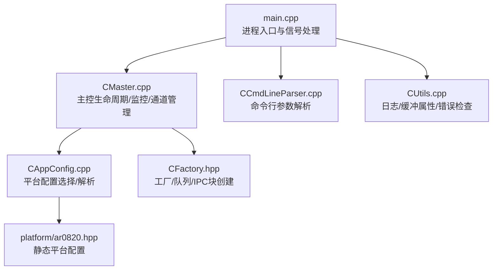
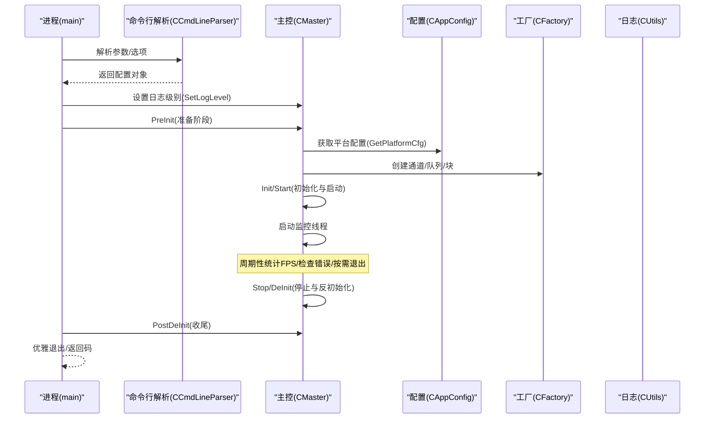
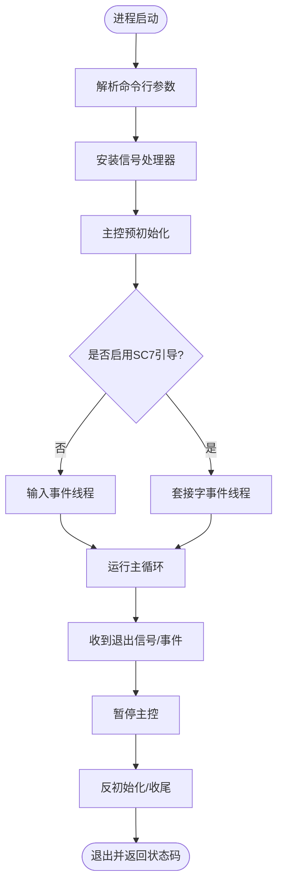
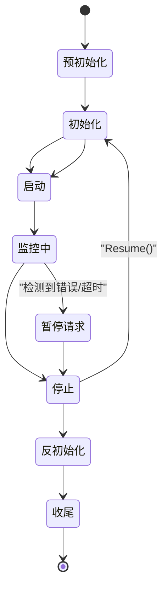
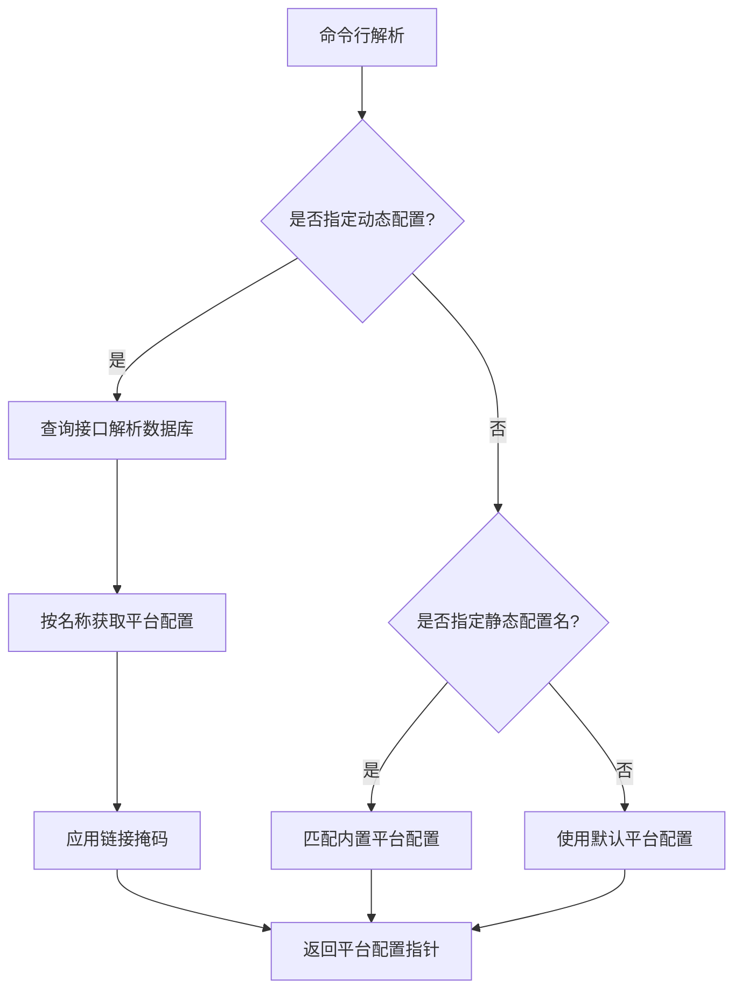
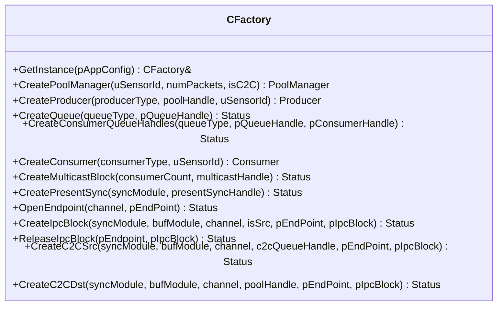
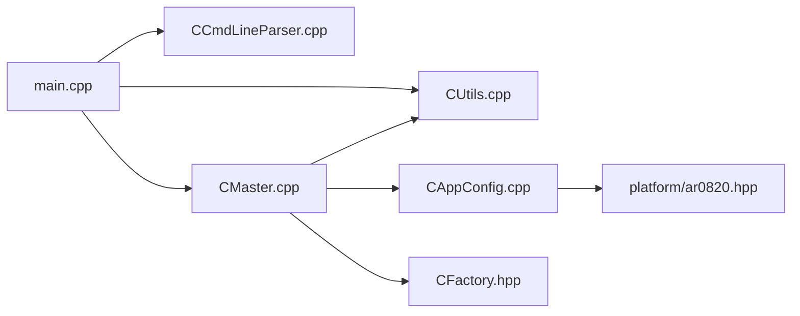
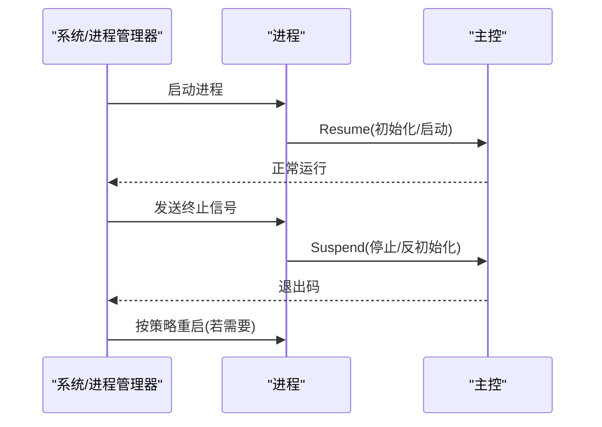

# 部署和运维

<cite>
**本文引用的文件**   
- [README.md](file://README.md)
- [ReleaseNote.md](file://ReleaseNote.md)
- [main.cpp](file://main.cpp)
- [CAppConfig.hpp](file://CAppConfig.hpp)
- [CAppConfig.cpp](file://CAppConfig.cpp)
- [CCmdLineParser.hpp](file://CCmdLineParser.hpp)
- [CCmdLineParser.cpp](file://CCmdLineParser.cpp)
- [CMaster.hpp](file://CMaster.hpp)
- [CMaster.cpp](file://CMaster.cpp)
- [CFactory.hpp](file://CFactory.hpp)
- [CUtils.hpp](file://CUtils.hpp)
- [CUtils.cpp](file://CUtils.cpp)
- [ar0820.hpp](file://platform/ar0820.hpp)
- [Makefile](file://Makefile)
</cite>

## 目录
1. [简介](#简介)
2. [项目结构](#项目结构)
3. [核心组件](#核心组件)
4. [架构总览](#架构总览)
5. [详细组件分析](#详细组件分析)
6. [依赖关系分析](#依赖关系分析)
7. [性能与监控](#性能与监控)
8. [日志与告警](#日志与告警)
9. [故障恢复与运维](#故障恢复与运维)
10. [版本更新与迁移](#版本更新与迁移)
11. [结论](#结论)
12. [附录](#附录)

## 简介
本指南面向生产环境部署与运维，基于仓库中的可执行程序与核心运行时组件，提供从系统配置、依赖检查到启动脚本编写的完整流程；同时覆盖监控与告警、日志管理、故障恢复（含优雅关闭、状态保存与重启策略）、以及版本更新与迁移的操作建议。内容严格依据源码与文档，避免臆测。

## 项目结构
该工程为单可执行程序示例，围绕“多传感器摄像头输出经多消费者消费”的流水线展开，支持同进程内与跨进程/跨芯片场景，具备延迟/重附加能力与显示拼接功能。关键目录与文件如下：
- 可执行入口：main.cpp
- 应用配置与命令行解析：CAppConfig.*、CCmdLineParser.*
- 主控生命周期与监控：CMaster.*
- 工厂与资源创建：CFactory.hpp
- 平台配置：platform/*.hpp（静态平台定义）
- 日志工具：CUtils.*（日志宏、日志类、缓冲属性等）
- 构建：Makefile
- 使用说明与发行说明：README.md、ReleaseNote.md

**图表来源**
- [main.cpp:253-304](file://main.cpp#L253-L304)
- [CMaster.cpp:164-232](file://CMaster.cpp#L164-L232)
- [CAppConfig.cpp:21-75](file://CAppConfig.cpp#L21-L75)
- [ar0820.hpp:14-183](file://platform/ar0820.hpp#L14-L183)
- [CFactory.hpp:27-92](file://CFactory.hpp#L27-L92)
- [CCmdLineParser.cpp:13-208](file://CCmdLineParser.cpp#L13-L208)
- [CUtils.cpp:17-143](file://CUtils.cpp#L17-L143)

**章节来源**
- [README.md:11-109](file://README.md#L11-L109)
- [main.cpp:253-304](file://main.cpp#L253-L304)
- [CAppConfig.cpp:21-75](file://CAppConfig.cpp#L21-L75)
- [ar0820.hpp:14-183](file://platform/ar0820.hpp#L14-L183)
- [CFactory.hpp:27-92](file://CFactory.hpp#L27-L92)
- [CCmdLineParser.cpp:13-208](file://CCmdLineParser.cpp#L13-L208)
- [CUtils.cpp:17-143](file://CUtils.cpp#L17-L143)

## 核心组件
- 进程入口与控制流：负责解析参数、设置日志级别、安装信号处理器、调用主控生命周期函数、优雅退出与返回码。
- 主控（CMaster）：封装摄像头初始化、通道创建与连接、启动/停止、暂停/恢复、监控线程、延迟附加/分离等。
- 配置（CAppConfig/CCmdLineParser）：解析命令行参数，选择动态或静态平台配置，设置运行模式（单进程/跨进程/跨芯片）、消费者类型、队列类型、帧过滤、运行时长、显示拼接/DPMST、多元素等。
- 工厂（CFactory）：统一创建池管理器、生产者/消费者、队列、多播块、IPC块、C2C端点等。
- 日志（CUtils）：提供日志宏、日志等级设置、NvSci缓冲属性查询与打印、NITO文件加载等。

**章节来源**
- [main.cpp:37-72](file://main.cpp#L37-L72)
- [CMaster.hpp:47-92](file://CMaster.hpp#L47-L92)
- [CAppConfig.hpp:19-80](file://CAppConfig.hpp#L19-L80)
- [CCmdLineParser.hpp:34-44](file://CCmdLineParser.hpp#L34-L44)
- [CFactory.hpp:27-92](file://CFactory.hpp#L27-L92)
- [CUtils.hpp:177-276](file://CUtils.hpp#L177-L276)

## 架构总览
下图展示从进程启动到主控生命周期的关键交互，以及与平台配置、工厂、日志的关系。

**图表来源**
- [main.cpp:253-304](file://main.cpp#L253-L304)
- [CCmdLineParser.cpp:13-208](file://CCmdLineParser.cpp#L13-L208)
- [CMaster.cpp:164-232](file://CMaster.cpp#L164-L232)
- [CAppConfig.cpp:21-75](file://CAppConfig.cpp#L21-L75)
- [CFactory.hpp:27-92](file://CFactory.hpp#L27-L92)
- [CUtils.cpp:34-43](file://CUtils.cpp#L34-L43)

## 详细组件分析

### 进程入口与信号处理
- 安装信号处理器以捕获终止信号，设置原子退出标志，触发主控暂停与反初始化。
- 支持通过标准输入与Unix域套接字接收外部事件（如电源管理服务），实现远程挂起/恢复。
- 根据是否启用SC7引导模式决定使用输入事件线程还是套接字事件线程。

**图表来源**
- [main.cpp:253-304](file://main.cpp#L253-L304)
- [main.cpp:74-153](file://main.cpp#L74-L153)
- [main.cpp:155-251](file://main.cpp#L155-L251)

**章节来源**
- [main.cpp:37-72](file://main.cpp#L37-L72)
- [main.cpp:74-153](file://main.cpp#L74-L153)
- [main.cpp:155-251](file://main.cpp#L155-L251)

### 主控生命周期与监控
- 生命周期：PreInit → Init → Start → 监控线程 → Stop → DeInit → PostDeInit。
- 监控线程周期性计算各传感器输出FPS，检查设备块与管道异步错误，按运行时长自动退出。
- 暂停/恢复：在不破坏底层资源的前提下重新初始化与启动，支持SC7场景。

**图表来源**
- [CMaster.cpp:164-232](file://CMaster.cpp#L164-L232)
- [CMaster.cpp:354-403](file://CMaster.cpp#L354-L403)

**章节来源**
- [CMaster.cpp:164-232](file://CMaster.cpp#L164-L232)
- [CMaster.cpp:354-403](file://CMaster.cpp#L354-L403)

### 配置与平台选择
- 动态平台配置：通过查询接口获取数据库并解析平台配置，支持链接掩码应用。
- 静态平台配置：内置多种平台头文件，根据名称选择对应配置。
- 关键开关：显示拼接、DPMST、多元素、延迟附加、SC7引导、文件转储、帧过滤、运行时长、消费者数量与索引等。

**图表来源**
- [CCmdLineParser.cpp:13-208](file://CCmdLineParser.cpp#L13-L208)
- [CAppConfig.cpp:21-75](file://CAppConfig.cpp#L21-L75)
- [ar0820.hpp:14-183](file://platform/ar0820.hpp#L14-L183)

**章节来源**
- [CCmdLineParser.cpp:13-208](file://CCmdLineParser.cpp#L13-L208)
- [CAppConfig.cpp:21-75](file://CAppConfig.cpp#L21-L75)
- [ar0820.hpp:14-183](file://platform/ar0820.hpp#L14-L183)

### 工厂与资源创建
- 统一创建池管理器、生产者/消费者、队列、多播块、呈现同步、IPC端点与块、C2C源/目的端等。
- 支持不同通信类型（同进程/跨进程/跨芯片）与实体类型（生产者/消费者）的差异化创建。

**图表来源**
- [CFactory.hpp:27-92](file://CFactory.hpp#L27-L92)

**章节来源**
- [CFactory.hpp:27-92](file://CFactory.hpp#L27-L92)

### 日志与缓冲属性
- 日志：提供宏与单例日志类，支持等级设置、前缀、函数行号等。
- 缓冲属性：查询NvSciBuf对象属性，填充结构体用于调试与性能分析。

**章节来源**
- [CUtils.hpp:177-276](file://CUtils.hpp#L177-L276)
- [CUtils.cpp:17-143](file://CUtils.cpp#L17-L143)
- [CUtils.cpp:363-437](file://CUtils.cpp#L363-L437)

## 依赖关系分析
- 进程入口依赖命令行解析、主控、日志。
- 主控依赖配置、工厂、日志、平台配置。
- 配置依赖平台头文件与查询接口（非安全构建）。
- 工厂依赖NvSci/NvSIPL相关API与消费者/生产者实现。

**图表来源**
- [main.cpp:253-304](file://main.cpp#L253-L304)
- [CCmdLineParser.cpp:13-208](file://CCmdLineParser.cpp#L13-L208)
- [CMaster.cpp:164-232](file://CMaster.cpp#L164-L232)
- [CAppConfig.cpp:21-75](file://CAppConfig.cpp#L21-L75)
- [ar0820.hpp:14-183](file://platform/ar0820.hpp#L14-L183)
- [CFactory.hpp:27-92](file://CFactory.hpp#L27-L92)
- [CUtils.cpp:17-143](file://CUtils.cpp#L17-L143)

**章节来源**
- [main.cpp:253-304](file://main.cpp#L253-L304)
- [CMaster.cpp:164-232](file://CMaster.cpp#L164-L232)
- [CAppConfig.cpp:21-75](file://CAppConfig.cpp#L21-L75)
- [ar0820.hpp:14-183](file://platform/ar0820.hpp#L14-L183)
- [CFactory.hpp:27-92](file://CFactory.hpp#L27-L92)
- [CUtils.cpp:17-143](file://CUtils.cpp#L17-L143)

## 性能与监控
- FPS统计：监控线程每固定间隔计算各传感器输出帧率，便于观察吞吐变化。
- 错误检测：周期性检查设备块与管道异步错误，发现后触发退出。
- 运行时长：支持按秒自动退出，适合压测与回归验证。
- 资源模块：NvSciBuf/NvSciSync/NvSciIpc模块的打开/关闭与错误检查贯穿生命周期。

**章节来源**
- [CMaster.cpp:354-403](file://CMaster.cpp#L354-L403)
- [CMaster.cpp:50-122](file://CMaster.cpp#L50-L122)
- [CUtils.cpp:53-57](file://CUtils.cpp#L53-L57)

## 日志与告警
- 日志等级：支持无/错误/警告/信息/调试五级，可通过命令行设置。
- 日志风格：支持普通与函数行号风格，便于定位问题。
- 日志宏：统一的LOG_*系列宏，结合前缀与格式化输出。
- 告警建议：结合监控线程的错误检测与日志等级，可在上层集成外部告警系统（如邮件/SMS/IM），将错误日志作为触发条件。

**章节来源**
- [CUtils.hpp:177-276](file://CUtils.hpp#L177-L276)
- [CUtils.cpp:34-43](file://CUtils.cpp#L34-L43)
- [CCmdLineParser.cpp:240-279](file://CCmdLineParser.cpp#L240-L279)

## 故障恢复与运维
- 优雅关闭：信号处理器设置退出标志，主控进入暂停与反初始化流程，确保资源有序释放。
- 暂停/恢复：在不重建底层模块的情况下重新初始化与启动，适合临时性维护或电源管理事件。
- 延迟/重附加：仅在跨进程/跨芯片生产者场景可用，支持运行时动态挂载/卸载消费者。
- 自动恢复机制建议：结合外部进程管理器（如systemd/supervisor），在退出码非零时自动重启；对可预期的资源错误（如NvSci模块）可触发短暂等待后重试。

**图表来源**
- [main.cpp:253-304](file://main.cpp#L253-L304)
- [CMaster.cpp:282-318](file://CMaster.cpp#L282-L318)

**章节来源**
- [main.cpp:37-72](file://main.cpp#L37-L72)
- [CMaster.cpp:282-318](file://CMaster.cpp#L282-L318)
- [CMaster.cpp:473-513](file://CMaster.cpp#L473-L513)

## 版本更新与迁移
- 版本信息：主程序包含主/次/补丁三段版本号，命令行支持显示版本。
- 发行说明：记录各版本的功能增强、修复与兼容性说明，迁移时应对照变更点评估影响。
- 迁移建议：升级前先确认平台配置兼容性（静态/动态配置）、消费者类型与队列类型、显示拼接/DPMST、多元素等选项是否沿用；对涉及底层API变更的版本，优先在测试环境验证。

**章节来源**
- [main.cpp:30-32](file://main.cpp#L30-L32)
- [ReleaseNote.md:11-118](file://ReleaseNote.md#L11-L118)
- [CCmdLineParser.cpp:29-312](file://CCmdLineParser.cpp#L29-L312)

## 结论
本指南基于源码梳理了生产部署所需的配置、启动、监控、日志与故障恢复要点。建议在生产环境中配合进程管理器与外部告警系统，形成闭环运维；对平台与功能选项保持最小化与可追溯，确保升级可控。

## 附录

### 生产环境部署清单
- 系统与依赖
  - 确认已安装NVIDIA NvSIPL相关库与驱动，满足平台配置要求。
  - 准备NITO文件路径（默认/usr/share/camera/，可通过命令行指定）。
- 配置与启动
  - 选择静态或动态平台配置，必要时应用链接掩码。
  - 指定消费者类型（编码/CUDA/显示拼接/DPMST）、队列类型、帧过滤、运行时长等。
  - 启动顺序：生产者进程 → 消费者进程（跨进程/跨芯片场景需保持配置一致）。
- 监控与告警
  - 设置合适的日志等级，结合监控线程输出与错误检测实现告警。
- 故障恢复
  - 使用进程管理器进行自动重启；利用暂停/恢复能力进行热切换。
- 升级与迁移
  - 对照发行说明评估变更；在测试环境验证后再上线。

**章节来源**
- [README.md:16-109](file://README.md#L16-L109)
- [CCmdLineParser.cpp:240-279](file://CCmdLineParser.cpp#L240-L279)
- [CAppConfig.cpp:21-75](file://CAppConfig.cpp#L21-L75)