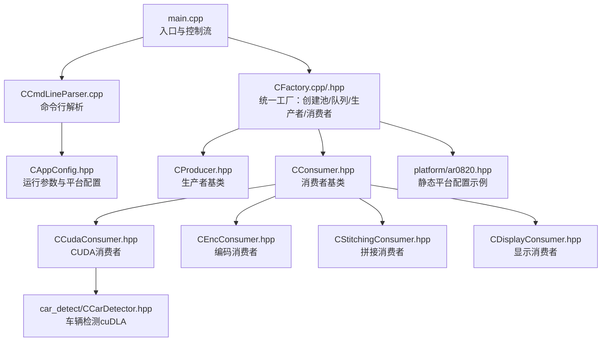
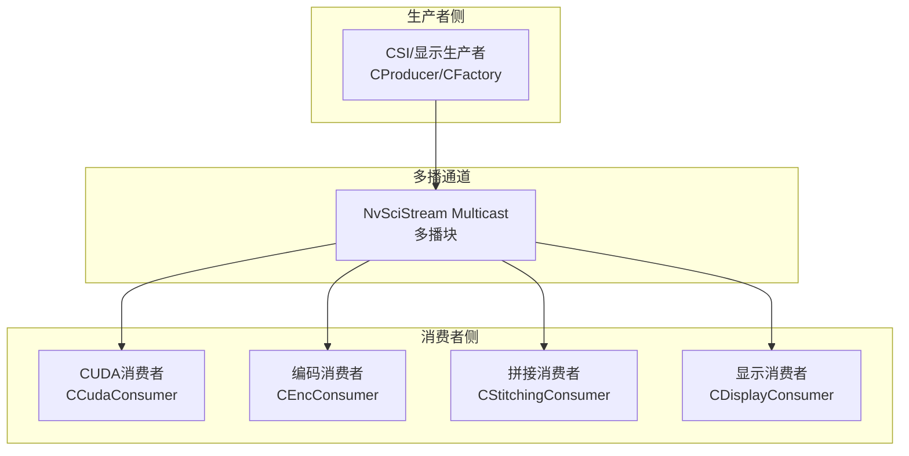
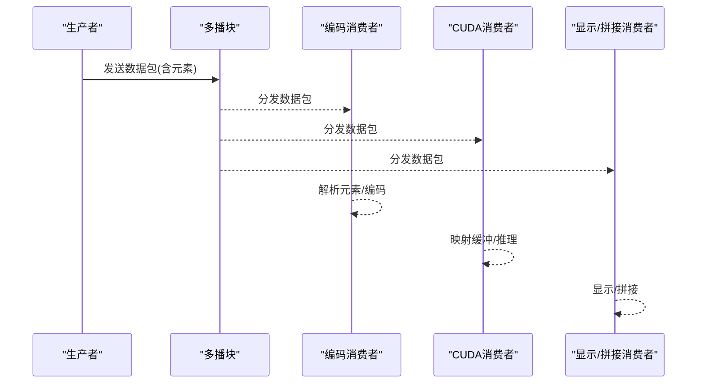
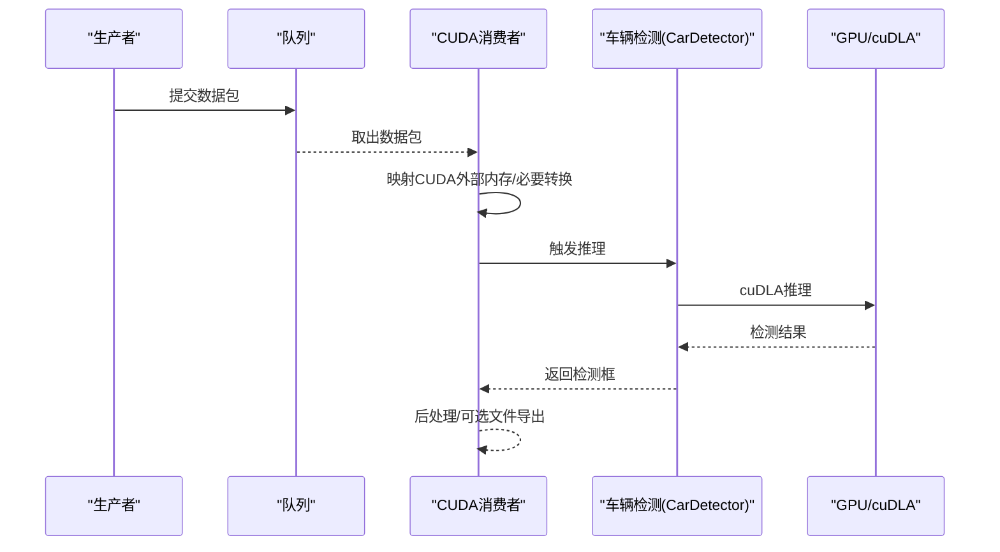
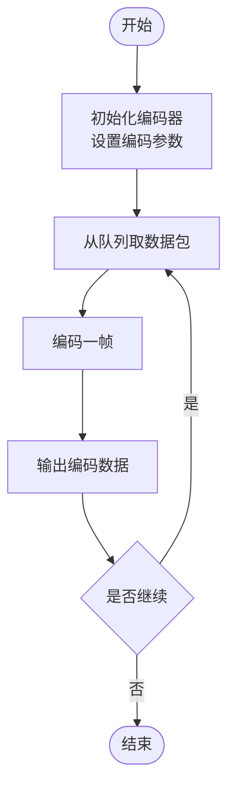
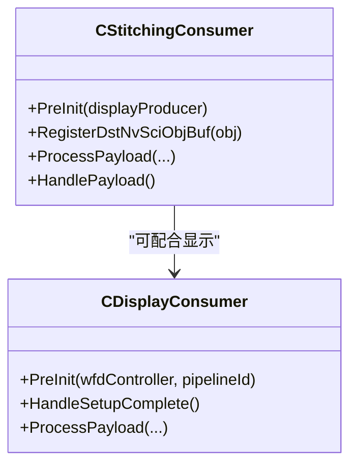
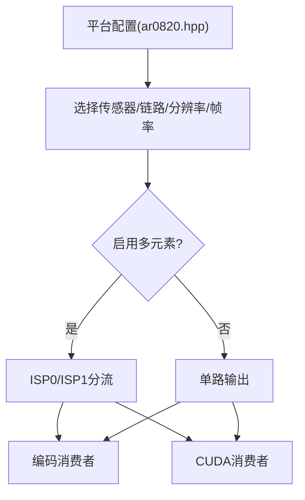
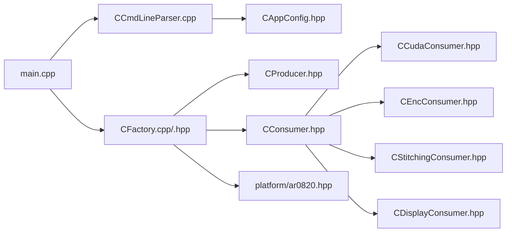

# 应用场景

<cite>
**本文引用的文件**   
- [README.md](file://README.md)
- [main.cpp](file://main.cpp)
- [CAppConfig.hpp](file://CAppConfig.hpp)
- [CCmdLineParser.cpp](file://CCmdLineParser.cpp)
- [CFactory.hpp](file://CFactory.hpp)
- [CFactory.cpp](file://CFactory.cpp)
- [CProducer.hpp](file://CProducer.hpp)
- [CConsumer.hpp](file://CConsumer.hpp)
- [CCudaConsumer.hpp](file://CCudaConsumer.hpp)
- [CEncConsumer.hpp](file://CEncConsumer.hpp)
- [CStitchingConsumer.hpp](file://CStitchingConsumer.hpp)
- [CDisplayConsumer.hpp](file://CDisplayConsumer.hpp)
- [car_detect/CCarDetector.hpp](file://car_detect/CCarDetector.hpp)
- [platform/ar0820.hpp](file://platform/ar0820.hpp)
</cite>

## 目录
1. [简介](#简介)
2. [项目结构](#项目结构)
3. [核心组件](#核心组件)
4. [架构总览](#架构总览)
5. [详细组件分析](#详细组件分析)
6. [依赖关系分析](#依赖关系分析)
7. [性能考量](#性能考量)
8. [故障排查指南](#故障排查指南)
9. [结论](#结论)
10. [附录](#附录)

## 简介
本文件面向NVSIPL多播系统在多种行业与场景中的应用，结合代码库中提供的生产者-多路消费者（多播）数据通路、CUDA推理、视频编码与拼接显示能力，给出可落地的应用场景说明、系统配置方案、性能要求与部署考虑，并提供与边缘与云环境集成的建议。

系统通过NvStreams/NvSciBuf构建跨进程、跨芯片的数据通路，支持：
- 多路消费者并行消费同一帧流：CUDA推理、视频编码、拼接显示等
- 动态平台配置与静态平台配置
- 多ISP输出（ISP0/ISP1）分流到不同消费者
- 延迟/重附加机制（Late-/Re-attach）
- 车辆检测（cuDLA）示例

## 项目结构
该示例程序以“主控入口 + 配置解析 + 工厂创建 + 生产者/消费者实现”的分层组织方式呈现，便于按需组合不同平台配置与消费端能力。

图表来源
- [main.cpp:253-304](file://main.cpp#L253-L304)
- [CCmdLineParser.cpp:13-208](file://CCmdLineParser.cpp#L13-L208)
- [CFactory.cpp:11-205](file://CFactory.cpp#L11-L205)
- [CProducer.hpp:16-51](file://CProducer.hpp#L16-L51)
- [CConsumer.hpp:16-43](file://CConsumer.hpp#L16-L43)
- [CCudaConsumer.hpp:25-81](file://CCudaConsumer.hpp#L25-L81)
- [CEncConsumer.hpp:17-66](file://CEncConsumer.hpp#L17-L66)
- [CStitchingConsumer.hpp:17-74](file://CStitchingConsumer.hpp#L17-L74)
- [CDisplayConsumer.hpp:15-49](file://CDisplayConsumer.hpp#L15-L49)
- [car_detect/CCarDetector.hpp:17-34](file://car_detect/CCarDetector.hpp#L17-L34)
- [platform/ar0820.hpp:14-183](file://platform/ar0820.hpp#L14-L183)

章节来源
- [main.cpp:253-304](file://main.cpp#L253-L304)
- [CCmdLineParser.cpp:13-208](file://CCmdLineParser.cpp#L13-L208)
- [CFactory.cpp:11-205](file://CFactory.cpp#L11-L205)
- [CProducer.hpp:16-51](file://CProducer.hpp#L16-L51)
- [CConsumer.hpp:16-43](file://CConsumer.hpp#L16-L43)
- [CCudaConsumer.hpp:25-81](file://CCudaConsumer.hpp#L25-L81)
- [CEncConsumer.hpp:17-66](file://CEncConsumer.hpp#L17-L66)
- [CStitchingConsumer.hpp:17-74](file://CStitchingConsumer.hpp#L17-L74)
- [CDisplayConsumer.hpp:15-49](file://CDisplayConsumer.hpp#L15-L49)
- [car_detect/CCarDetector.hpp:17-34](file://car_detect/CCarDetector.hpp#L17-L34)
- [platform/ar0820.hpp:14-183](file://platform/ar0820.hpp#L14-L183)

## 核心组件
- 入口与控制流：负责信号处理、输入事件线程、套接字事件线程、主循环挂起/恢复与生命周期管理。
- 配置与命令行：解析运行参数（平台配置、队列类型、显示模式、多元素、延迟附加、运行时长、帧过滤等），并校验合法性。
- 工厂：统一创建缓冲池、队列、生产者与消费者；根据配置选择元素类型（RAW/NV12/ABGR8888等）。
- 生产者/消费者基类：定义通用的流初始化、负载处理、元数据映射、同步对象注册等接口。
- 消费者实现：CUDA（含cuDLA推理）、编码（H.264）、拼接（多路画面合成）、显示（WFD/OpenWFD）。
- 平台配置：静态平台配置头文件，描述传感器、解串器、序列化器、I2C地址、分辨率、帧率等。

章节来源
- [main.cpp:74-251](file://main.cpp#L74-L251)
- [CAppConfig.hpp:19-80](file://CAppConfig.hpp#L19-L80)
- [CCmdLineParser.cpp:13-208](file://CCmdLineParser.cpp#L13-L208)
- [CFactory.cpp:24-205](file://CFactory.cpp#L24-L205)
- [CProducer.hpp:16-51](file://CProducer.hpp#L16-L51)
- [CConsumer.hpp:16-43](file://CConsumer.hpp#L16-L43)
- [CCudaConsumer.hpp:25-81](file://CCudaConsumer.hpp#L25-L81)
- [CEncConsumer.hpp:17-66](file://CEncConsumer.hpp#L17-L66)
- [CStitchingConsumer.hpp:17-74](file://CStitchingConsumer.hpp#L17-L74)
- [CDisplayConsumer.hpp:15-49](file://CDisplayConsumer.hpp#L15-L49)
- [platform/ar0820.hpp:14-183](file://platform/ar0820.hpp#L14-L183)

## 架构总览
系统采用“生产者-多路消费者”多播架构，通过NvSciBuf/NvStreams在进程内或跨进程/跨芯片间传递图像数据包（包含RAW/NV12/Metadata等元素）。消费者侧可并行执行不同任务（CUDA推理、编码、拼接、显示）。

图表来源
- [CFactory.cpp:207-213](file://CFactory.cpp#L207-L213)
- [CProducer.hpp:16-51](file://CProducer.hpp#L16-L51)
- [CConsumer.hpp:16-43](file://CConsumer.hpp#L16-L43)
- [CCudaConsumer.hpp:25-81](file://CCudaConsumer.hpp#L25-L81)
- [CEncConsumer.hpp:17-66](file://CEncConsumer.hpp#L17-L66)
- [CStitchingConsumer.hpp:17-74](file://CStitchingConsumer.hpp#L17-L74)
- [CDisplayConsumer.hpp:15-49](file://CDisplayConsumer.hpp#L15-L49)

## 详细组件分析

### 组件A：多播与消费者路由
- 多播块创建：工厂负责创建NvSciStreamMulticast，使一帧数据可被多个消费者接收。
- 元素选择：根据平台配置与消费者类型，动态启用RAW/NV12/ABGR8888等元素，确保消费者仅映射所需元素，降低带宽与内存占用。
- 队列类型：支持FIFO与Mailbox两种队列，影响背压与实时性。

图表来源
- [CFactory.cpp:207-213](file://CFactory.cpp#L207-L213)
- [CFactory.cpp:96-136](file://CFactory.cpp#L96-L136)
- [CFactory.cpp:138-164](file://CFactory.cpp#L138-L164)

章节来源
- [CFactory.cpp:207-213](file://CFactory.cpp#L207-L213)
- [CFactory.cpp:96-136](file://CFactory.cpp#L96-L136)
- [CFactory.cpp:138-164](file://CFactory.cpp#L138-L164)

### 组件B：CUDA消费者（含cuDLA推理）
- 数据路径：从NvSciBuf映射到CUDA外部内存，必要时进行BL到PL转换，随后进入推理流程。
- 推理集成：在Linux/QNX标准环境下，可调用车辆检测模块完成目标检测。
- 同步与栅栏：注册信号/等待同步对象，插入前栅栏，保证时序正确。

图表来源
- [CCudaConsumer.hpp:25-81](file://CCudaConsumer.hpp#L25-L81)
- [car_detect/CCarDetector.hpp:17-34](file://car_detect/CCarDetector.hpp#L17-L34)

章节来源
- [CCudaConsumer.hpp:25-81](file://CCudaConsumer.hpp#L25-L81)
- [car_detect/CCarDetector.hpp:17-34](file://car_detect/CCarDetector.hpp#L17-L34)

### 组件C：编码消费者（H.264）
- 初始化：根据数据缓冲属性初始化编码器，设置编码参数。
- 编码流程：对每一帧进行编码，生成压缩数据，可选写入文件。
- 同步：注册信号/等待同步对象，插入前栅栏，确保编码顺序与生产者一致。

图表来源
- [CEncConsumer.hpp:17-66](file://CEncConsumer.hpp#L17-L66)

章节来源
- [CEncConsumer.hpp:17-66](file://CEncConsumer.hpp#L17-L66)

### 组件D：拼接与显示消费者
- 拼接：多路NV12输入经2D合成，输出到显示生产者或直接显示。
- 显示：通过WFD/OpenWFD控制器驱动显示设备。
- 元素选择：根据配置启用NV12或ABGR8888等元素。

图表来源
- [CStitchingConsumer.hpp:17-74](file://CStitchingConsumer.hpp#L17-L74)
- [CDisplayConsumer.hpp:15-49](file://CDisplayConsumer.hpp#L15-L49)

章节来源
- [CStitchingConsumer.hpp:17-74](file://CStitchingConsumer.hpp#L17-L74)
- [CDisplayConsumer.hpp:15-49](file://CDisplayConsumer.hpp#L15-L49)

### 组件E：平台配置与多ISP输出
- 静态平台配置：以头文件形式提供，包含传感器、解串器、序列化器、分辨率、帧率等信息。
- 多ISP输出：通过“多元素”开关启用ISP0/ISP1双输出，分别路由到不同消费者（如ISP0→编码/显示，ISP1→CUDA）。

图表来源
- [platform/ar0820.hpp:14-183](file://platform/ar0820.hpp#L14-L183)
- [CFactory.cpp:34-61](file://CFactory.cpp#L34-L61)
- [CFactory.cpp:96-136](file://CFactory.cpp#L96-L136)

章节来源
- [platform/ar0820.hpp:14-183](file://platform/ar0820.hpp#L14-L183)
- [CFactory.cpp:34-61](file://CFactory.cpp#L34-L61)
- [CFactory.cpp:96-136](file://CFactory.cpp#L96-L136)

## 依赖关系分析
- 入口依赖命令行解析与应用配置，配置再驱动工厂创建生产者/消费者与队列。
- 工厂依赖平台配置与元素选择逻辑，决定数据元素与路由。
- 消费者依赖CUDA/cuDLA/编码库/显示库等外部组件，但通过抽象接口与NvSciBuf对接。

图表来源
- [main.cpp:253-304](file://main.cpp#L253-L304)
- [CCmdLineParser.cpp:13-208](file://CCmdLineParser.cpp#L13-L208)
- [CAppConfig.hpp:19-80](file://CAppConfig.hpp#L19-L80)
- [CFactory.cpp:11-205](file://CFactory.cpp#L11-L205)
- [CProducer.hpp:16-51](file://CProducer.hpp#L16-L51)
- [CConsumer.hpp:16-43](file://CConsumer.hpp#L16-L43)
- [CCudaConsumer.hpp:25-81](file://CCudaConsumer.hpp#L25-L81)
- [CEncConsumer.hpp:17-66](file://CEncConsumer.hpp#L17-L66)
- [CStitchingConsumer.hpp:17-74](file://CStitchingConsumer.hpp#L17-L74)
- [CDisplayConsumer.hpp:15-49](file://CDisplayConsumer.hpp#L15-L49)
- [platform/ar0820.hpp:14-183](file://platform/ar0820.hpp#L14-L183)

章节来源
- [main.cpp:253-304](file://main.cpp#L253-L304)
- [CCmdLineParser.cpp:13-208](file://CCmdLineParser.cpp#L13-L208)
- [CAppConfig.hpp:19-80](file://CAppConfig.hpp#L19-L80)
- [CFactory.cpp:11-205](file://CFactory.cpp#L11-L205)
- [CProducer.hpp:16-51](file://CProducer.hpp#L16-L51)
- [CConsumer.hpp:16-43](file://CConsumer.hpp#L16-L43)
- [CCudaConsumer.hpp:25-81](file://CCudaConsumer.hpp#L25-L81)
- [CEncConsumer.hpp:17-66](file://CEncConsumer.hpp#L17-L66)
- [CStitchingConsumer.hpp:17-74](file://CStitchingConsumer.hpp#L17-L74)
- [CDisplayConsumer.hpp:15-49](file://CDisplayConsumer.hpp#L15-L49)
- [platform/ar0820.hpp:14-183](file://platform/ar0820.hpp#L14-L183)

## 性能考量
- 元素最小化：仅启用消费者所需的元素（如CUDA仅需要NV12_PL或ICP_RAW，编码需要NV12_BL），减少带宽与内存占用。
- 多ISP分流：利用ISP0/ISP1双输出，将高吞吐任务（如CUDA）与低延迟任务（如编码/显示）分离，提升整体吞吐。
- 队列选择：FIFO适合高吞吐场景，Mailbox适合低延迟与精确控制。
- 帧过滤：通过帧过滤参数降低CPU/GPU负载，适用于非关键帧处理。
- 延迟附加：在运行时动态附加/移除消费者，避免冷启动成本，提高资源利用率。
- 文件转储：在调试阶段开启文件转储，便于离线分析与验证。

章节来源
- [CFactory.cpp:34-61](file://CFactory.cpp#L34-L61)
- [CFactory.cpp:96-136](file://CFactory.cpp#L96-L136)
- [CCmdLineParser.cpp:138-208](file://CCmdLineParser.cpp#L138-L208)
- [README.md:38-46](file://README.md#L38-L46)

## 故障排查指南
- 信号与事件：入口线程监听SIGINT/SIGTERM等信号，支持挂起/恢复；套接字线程用于与pm_service通信，接收挂起/恢复请求。
- 输入事件：支持交互式命令（退出、挂起、恢复、延迟附加/移除）。
- 参数校验：命令行解析会校验平台配置与掩码组合、消费者数量与索引范围、帧过滤范围等，异常时返回错误状态。
- 错误忽略：可通过参数选择忽略致命错误，便于自动化测试与集成。

章节来源
- [main.cpp:74-251](file://main.cpp#L74-L251)
- [CCmdLineParser.cpp:138-208](file://CCmdLineParser.cpp#L138-L208)
- [CAppConfig.hpp:54-80](file://CAppConfig.hpp#L54-L80)

## 结论
NVSIPL多播系统通过标准化的生产者-多消费者通路，结合CUDA推理、视频编码与拼接显示能力，能够灵活适配多种行业场景。通过合理的平台配置、元素选择与队列策略，可在边缘与云端环境中实现高效、低延迟与可扩展的视觉处理流水线。

## 附录

### 场景一：智能交通监控
- 应用要点
  - 多路摄像头采集，拼接成全景画面用于交通态势感知。
  - CUDA消费者进行车辆/行人检测，编码消费者输出H.264供后端存储与转发。
- 系统配置
  - 启用拼接显示与多元素，将ISP0输出至编码/显示，ISP1输出至CUDA。
  - 使用静态平台配置（如AR0820）匹配传感器与链路。
- 性能要求
  - 优先使用FIFO队列，确保高吞吐；必要时启用帧过滤降低CPU/GPU压力。
- 部署考虑
  - 边缘侧：在具备CUDA/cuDLA的设备上部署CUDA消费者；编码与拼接在同节点完成。
  - 云侧：将编码输出接入视频服务，拼接结果通过显示消费者输出到终端或Web。

章节来源
- [README.md:38-46](file://README.md#L38-L46)
- [CFactory.cpp:34-61](file://CFactory.cpp#L34-L61)
- [CFactory.cpp:96-136](file://CFactory.cpp#L96-L136)
- [platform/ar0820.hpp:14-183](file://platform/ar0820.hpp#L14-L183)

### 场景二：工业视觉检测
- 应用要点
  - 在产线上进行产品缺陷检测与分类，CUDA消费者执行深度学习推理。
  - 编码消费者将关键帧编码为H.264，便于离线复现与质量追溯。
- 系统配置
  - 选择合适的平台配置，启用多元素以分流不同任务。
  - 根据相机分辨率与帧率调整队列类型与帧过滤。
- 性能要求
  - 优先满足实时性，必要时降低帧率或启用帧过滤。
- 部署考虑
  - 边缘侧：在工控机或嵌入式平台上部署CUDA与编码消费者。
  - 云侧：将编码结果上传至云端进行模型训练与质量分析。

章节来源
- [CCudaConsumer.hpp:25-81](file://CCudaConsumer.hpp#L25-L81)
- [CEncConsumer.hpp:17-66](file://CEncConsumer.hpp#L17-L66)
- [CFactory.cpp:96-136](file://CFactory.cpp#L96-L136)

### 场景三：安防监控
- 应用要点
  - 多角度摄像头拼接，形成广角监控画面；同时进行实时检测与视频编码。
- 系统配置
  - 启用拼接显示与多元素，合理分配ISP0/ISP1输出。
- 性能要求
  - 保障显示与检测的低延迟；编码侧可适当降低码率以节省带宽。
- 部署考虑
  - 边缘侧：拼接与检测在本地完成，编码输出到存储或转发网关。
  - 云侧：集中管理与回放，结合AI算法进行行为分析。

章节来源
- [CStitchingConsumer.hpp:17-74](file://CStitchingConsumer.hpp#L17-L74)
- [CDisplayConsumer.hpp:15-49](file://CDisplayConsumer.hpp#L15-L49)
- [CFactory.cpp:96-136](file://CFactory.cpp#L96-L136)

### 场景四：机器人视觉
- 应用要点
  - 多目相机采集，CUDA消费者进行SLAM/目标识别，编码消费者记录关键轨迹片段。
- 系统配置
  - 依据平台配置选择合适传感器与链路；启用多元素以分流不同任务。
- 性能要求
  - 优先保障SLAM/识别的实时性；编码侧可按需开启。
- 部署考虑
  - 边缘侧：在机器人嵌入式平台部署CUDA与编码消费者。
  - 云侧：将轨迹与识别结果上传至云端进行建图与策略优化。

章节来源
- [CCudaConsumer.hpp:25-81](file://CCudaConsumer.hpp#L25-L81)
- [CEncConsumer.hpp:17-66](file://CEncConsumer.hpp#L17-L66)
- [CFactory.cpp:34-61](file://CFactory.cpp#L34-L61)

### 边缘与云集成方案
- 边缘计算
  - 利用多播将同一帧分发给多个消费者，降低重复采集与传输开销。
  - 在边缘节点部署CUDA与编码消费者，实现就地推理与压缩。
- 云计算
  - 将编码后的视频流接入云存储与分析平台，结合AI模型进行离线训练与策略优化。
  - 通过延迟附加机制，在云端按需扩容推理与分析能力。

章节来源
- [README.md:47-79](file://README.md#L47-L79)
- [CFactory.cpp:207-213](file://CFactory.cpp#L207-L213)

### 硬件选型与网络拓扑
- 硬件选型
  - 摄像头：依据平台配置选择对应传感器与解串器/序列化器。
  - 计算单元：具备CUDA/cuDLA能力的GPU用于推理；具备NvMedia/IEP能力的设备用于编码与显示。
- 网络拓扑
  - 进程内：单进程内并行运行生产者与多个消费者，适合开发与小规模测试。
  - 跨进程：生产者与消费者分别运行于独立进程，通过NvSciBuf共享内存。
  - 跨芯片：通过IPC源/目的块连接不同芯片，适合多板卡或多设备协同。

章节来源
- [README.md:21-46](file://README.md#L21-L46)
- [README.md:47-79](file://README.md#L47-L79)
- [CFactory.cpp:223-314](file://CFactory.cpp#L223-L314)

### 使用案例与实施建议
- 案例A：多路拼接+实时检测+编码
  - 步骤：启用拼接显示与多元素；配置CUDA与编码消费者；设置运行时长与帧过滤。
  - 建议：优先使用FIFO队列；在边缘侧完成拼接与检测；编码输出到存储或转发。
- 案例B：延迟附加
  - 步骤：先启动生产者与早期消费者，再在运行时附加晚期消费者。
  - 建议：使用延迟附加命令进行动态编排，避免冷启动。

章节来源
- [README.md:80-92](file://README.md#L80-L92)
- [CCmdLineParser.cpp:138-208](file://CCmdLineParser.cpp#L138-L208)