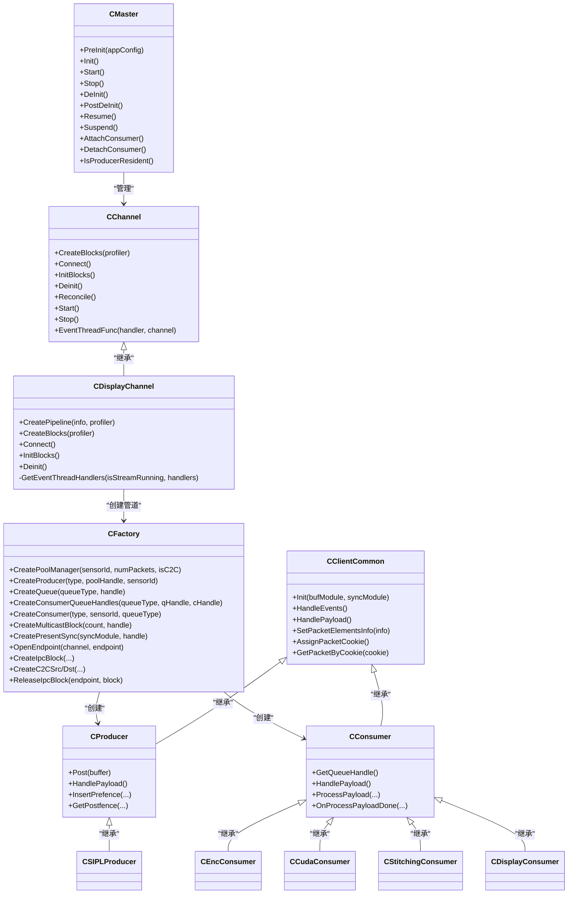
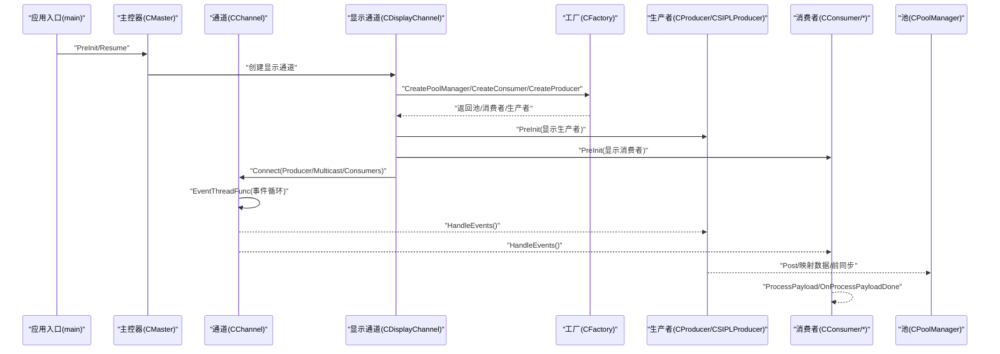
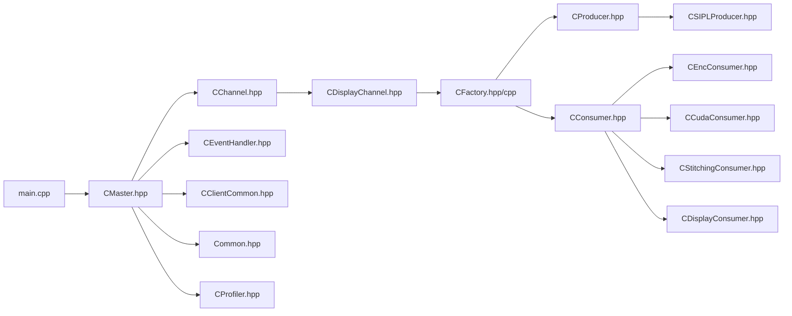

# 技术架构

<cite>
**本文引用的文件**
- [main.cpp](file://main.cpp)
- [CAppConfig.hpp](file://CAppConfig.hpp)
- [CFactory.hpp](file://CFactory.hpp)
- [CFactory.cpp](file://CFactory.cpp)
- [CMaster.hpp](file://CMaster.hpp)
- [CChannel.hpp](file://CChannel.hpp)
- [CDisplayChannel.hpp](file://CDisplayChannel.hpp)
- [CClientCommon.hpp](file://CClientCommon.hpp)
- [Common.hpp](file://Common.hpp)
- [CProducer.hpp](file://CProducer.hpp)
- [CConsumer.hpp](file://CConsumer.hpp)
- [CSIPLProducer.hpp](file://CSIPLProducer.hpp)
- [CEncConsumer.hpp](file://CEncConsumer.hpp)
- [CCudaConsumer.hpp](file://CCudaConsumer.hpp)
- [CStitchingConsumer.hpp](file://CStitchingConsumer.hpp)
- [CDisplayConsumer.hpp](file://CDisplayConsumer.hpp)
- [CEventHandler.hpp](file://CEventHandler.hpp)
- [CProfiler.hpp](file://CProfiler.hpp)
</cite>

## 目录
1. [引言](#引言)
2. [项目结构](#项目结构)
3. [核心组件](#核心组件)
4. [架构总览](#架构总览)
5. [详细组件分析](#详细组件分析)
6. [依赖关系分析](#依赖关系分析)
7. [性能考量](#性能考量)
8. [故障排查指南](#故障排查指南)
9. [结论](#结论)

## 引言
本技术架构文档面向NVSIPL多播系统，聚焦于分层架构与模块化设计，阐述生产者-多播-消费者的完整数据通路与控制流，解析工厂模式、观察者模式（事件线程模型）与策略模式（队列类型、元素配置）在系统中的落地方式，并给出可扩展性与适应性的设计建议。文档旨在帮助开发者快速理解系统整体设计与关键实现。

## 项目结构
系统采用“应用入口 -> 主控器 -> 通道 -> 生产者/消费者”的分层组织，配合工厂类统一创建与装配NvSciStream块、队列与跨进程/跨芯片通信端点，形成高内聚、低耦合的模块化体系。

```mermaid
graph TB
A["main.cpp<br/>应用入口"] --> B["CMaster.hpp<br/>主控器"]
B --> C["CChannel.hpp<br/>抽象通道"]
C --> D["CDisplayChannel.hpp<br/>显示通道"]
D --> E["CFactory.hpp/cpp<br/>工厂类"]
E --> F["CProducer.hpp<br/>生产者基类"]
E --> G["CConsumer.hpp<br/>消费者基类"]
F --> H["CSIPLProducer.hpp<br/>SIPL生产者"]
G --> I["CEncConsumer.hpp<br/>编码消费者"]
G --> J["CCudaConsumer.hpp<br/>CUDA消费者"]
G --> K["CStitchingConsumer.hpp<br/>拼接消费者"]
G --> L["CDisplayConsumer.hpp<br/>显示消费者"]
B --> M["CEventHandler.hpp<br/>事件处理器接口"]
B --> N["CClientCommon.hpp<br/>客户端通用逻辑"]
B --> O["Common.hpp<br/>公共常量/枚举"]
B --> P["CProfiler.hpp<br/>性能统计"]
```

图表来源
- [main.cpp:253-304](file://main.cpp#L253-L304)
- [CMaster.hpp:47-92](file://CMaster.hpp#L47-L92)
- [CChannel.hpp:28-154](file://CChannel.hpp#L28-L154)
- [CDisplayChannel.hpp:19-223](file://CDisplayChannel.hpp#L19-L223)
- [CFactory.hpp:27-92](file://CFactory.hpp#L27-L92)
- [CProducer.hpp:16-51](file://CProducer.hpp#L16-L51)
- [CConsumer.hpp:16-43](file://CConsumer.hpp#L16-L43)
- [CSIPLProducer.hpp:18-81](file://CSIPLProducer.hpp#L18-L81)
- [CEncConsumer.hpp:17-64](file://CEncConsumer.hpp#L17-L64)
- [CCudaConsumer.hpp:25-78](file://CCudaConsumer.hpp#L25-L78)
- [CStitchingConsumer.hpp:17-72](file://CStitchingConsumer.hpp#L17-L72)
- [CDisplayConsumer.hpp:15-47](file://CDisplayConsumer.hpp#L15-L47)
- [CEventHandler.hpp:23-51](file://CEventHandler.hpp#L23-L51)
- [CClientCommon.hpp:47-199](file://CClientCommon.hpp#L47-L199)
- [Common.hpp:35-86](file://Common.hpp#L35-L86)
- [CProfiler.hpp:21-54](file://CProfiler.hpp#L21-L54)

章节来源
- [main.cpp:253-304](file://main.cpp#L253-L304)
- [CMaster.hpp:47-92](file://CMaster.hpp#L47-L92)
- [CChannel.hpp:28-154](file://CChannel.hpp#L28-L154)
- [CDisplayChannel.hpp:19-223](file://CDisplayChannel.hpp#L19-L223)
- [CFactory.hpp:27-92](file://CFactory.hpp#L27-L92)
- [CFactory.cpp:1-315](file://CFactory.cpp#L1-L315)
- [CProducer.hpp:16-51](file://CProducer.hpp#L16-L51)
- [CConsumer.hpp:16-43](file://CConsumer.hpp#L16-L43)
- [CSIPLProducer.hpp:18-81](file://CSIPLProducer.hpp#L18-L81)
- [CEncConsumer.hpp:17-64](file://CEncConsumer.hpp#L17-L64)
- [CCudaConsumer.hpp:25-78](file://CCudaConsumer.hpp#L25-L78)
- [CStitchingConsumer.hpp:17-72](file://CStitchingConsumer.hpp#L17-L72)
- [CDisplayConsumer.hpp:15-47](file://CDisplayConsumer.hpp#L15-L47)
- [CEventHandler.hpp:23-51](file://CEventHandler.hpp#L23-L51)
- [CClientCommon.hpp:47-199](file://CClientCommon.hpp#L47-L199)
- [Common.hpp:35-86](file://Common.hpp#L35-L86)
- [CProfiler.hpp:21-54](file://CProfiler.hpp#L21-L54)

## 核心组件
- 应用入口与生命周期管理：负责命令行解析、日志级别设置、信号处理、输入事件与套接字事件线程、主控器预初始化/启动/暂停/反初始化。
- 主控器（CMaster）：协调通道、显示通道、相机/管线、电源管理状态机与监控线程；对外暴露挂起/恢复、附加/分离消费者等控制接口。
- 通道（CChannel）：抽象通道基类，定义事件线程循环、连接/初始化/去初始化流程；派生出显示通道（CDisplayChannel）。
- 工厂（CFactory）：集中创建池、生产者、消费者、队列、多播、同步对象以及IPC/C2C块，屏蔽NvSciStream/NvSciBuf/NvSciSync细节。
- 客户端通用（CClientCommon）：封装NvSciStream事件循环、数据/元数据缓冲属性、同步对象导入导出、包索引与Cookie映射、CPU等待策略等。
- 生产者/消费者基类：定义Post/HandlePayload/注册同步对象等虚接口，派生出多种具体实现。
- 具体实现：CSIPLProducer、CEncConsumer、CCudaConsumer、CStitchingConsumer、CDisplayConsumer。
- 事件处理器（CEventHandler）：事件线程回调接口，CChannel驱动各处理器并发执行。
- 配置与常量（CAppConfig/Common）：运行参数、实体类型、队列类型、元素类型、通信类型、平台配置等。
- 性能统计（CProfiler）：帧计数统计，用于性能观测。

章节来源
- [main.cpp:253-304](file://main.cpp#L253-L304)
- [CMaster.hpp:47-92](file://CMaster.hpp#L47-L92)
- [CChannel.hpp:28-154](file://CChannel.hpp#L28-L154)
- [CDisplayChannel.hpp:19-223](file://CDisplayChannel.hpp#L19-L223)
- [CFactory.hpp:27-92](file://CFactory.hpp#L27-L92)
- [CFactory.cpp:1-315](file://CFactory.cpp#L1-L315)
- [CClientCommon.hpp:47-199](file://CClientCommon.hpp#L47-L199)
- [CProducer.hpp:16-51](file://CProducer.hpp#L16-L51)
- [CConsumer.hpp:16-43](file://CConsumer.hpp#L16-L43)
- [Common.hpp:35-86](file://Common.hpp#L35-L86)
- [CProfiler.hpp:21-54](file://CProfiler.hpp#L21-L54)

## 架构总览
系统采用“主控器-通道-工厂-客户端通用-具体实现”的分层架构，结合NvSciStream/NvSciBuf/NvSciSync构建高性能多播视频流管道。工厂模式统一创建与装配，事件线程模型解耦异步事件处理，策略模式体现在队列类型、元素使用策略与通信类型选择上。

图表来源
- [CMaster.hpp:47-92](file://CMaster.hpp#L47-L92)
- [CChannel.hpp:28-154](file://CChannel.hpp#L28-L154)
- [CDisplayChannel.hpp:19-223](file://CDisplayChannel.hpp#L19-L223)
- [CFactory.hpp:27-92](file://CFactory.hpp#L27-L92)
- [CClientCommon.hpp:47-199](file://CClientCommon.hpp#L47-L199)
- [CProducer.hpp:16-51](file://CProducer.hpp#L16-L51)
- [CConsumer.hpp:16-43](file://CConsumer.hpp#L16-L43)
- [CSIPLProducer.hpp:18-81](file://CSIPLProducer.hpp#L18-L81)
- [CEncConsumer.hpp:17-64](file://CEncConsumer.hpp#L17-L64)
- [CCudaConsumer.hpp:25-78](file://CCudaConsumer.hpp#L25-L78)
- [CStitchingConsumer.hpp:17-72](file://CStitchingConsumer.hpp#L17-L72)
- [CDisplayConsumer.hpp:15-47](file://CDisplayConsumer.hpp#L15-L47)

## 详细组件分析

### 主控器（CMaster）
- 职责：应用生命周期管理、电源管理状态机、监控线程、通道与显示通道创建、相机/管线集成。
- 关键流程：PreInit/Init/Start/Stop/DeInit/PostDeInit；Resume/Suspend与外部事件线程协作；Attach/Detach消费者（仅生产者驻留场景）。
- 设计要点：通过CChannel与CDisplayChannel抽象不同通道；通过CFactory集中创建块；通过CEventHandler驱动事件线程。

章节来源
- [CMaster.hpp:47-92](file://CMaster.hpp#L47-L92)
- [main.cpp:253-304](file://main.cpp#L253-L304)

### 显示通道（CDisplayChannel）
- 职责：为每个传感器创建显示相关管道（池、显示生产者、显示消费者），支持多播连接。
- 管道创建：通过CFactory创建池、显示消费者（邮箱队列）、显示生产者，并初始化。
- 连接与初始化：按Producer->Consumer或Producer->Multicast->Consumers顺序连接，查询事件确保连接成功后初始化各块。
- 事件线程：聚合池、生产者与消费者作为事件处理器并发执行。

章节来源
- [CDisplayChannel.hpp:19-223](file://CDisplayChannel.hpp#L19-L223)
- [CFactory.cpp:90-205](file://CFactory.cpp#L90-L205)

### 工厂（CFactory）
- 工厂模式：统一创建池、生产者、消费者、队列、多播、PresentSync、IPC/C2C块。
- 元素信息策略：根据配置与传感器类型动态决定元素是否使用、是否有兄弟元素，以适配不同输出需求。
- 队列策略：支持邮箱队列与FIFO队列，由配置决定消费者队列类型。
- IPC/C2C：提供端点打开、块创建与释放，支撑跨进程与跨芯片场景。

章节来源
- [CFactory.hpp:27-92](file://CFactory.hpp#L27-L92)
- [CFactory.cpp:1-315](file://CFactory.cpp#L1-L315)

### 客户端通用（CClientCommon）
- 事件循环：基于NvSciStream事件查询的线程循环，超时阈值保护，避免卡死。
- 包与Cookie：维护ClientPacket数组，通过cookie映射包索引，支持元数据缓冲与数据缓冲的属性设置。
- 同步对象：支持信号/等待同步对象的导入导出，CPU等待策略可配置。
- 生命周期：HandleStreamInit/HandleSetupComplete区分初始化阶段与流式阶段。

章节来源
- [CClientCommon.hpp:47-199](file://CClientCommon.hpp#L47-L199)
- [CChannel.hpp:112-140](file://CChannel.hpp#L112-L140)

### 生产者与消费者
- 生产者（CProducer）：定义Post/HandlePayload/插入前同步围栏等接口，CSIPLProducer实现与NvSIPL相机对接。
- 消费者（CConsumer）：定义HandlePayload/ProcessPayload/OnProcessPayloadDone等接口，派生出编码、CUDA、拼接、显示等实现。
- 元素与队列：通过SetPacketElementsInfo与队列类型策略决定数据元素与排队行为。

章节来源
- [CProducer.hpp:16-51](file://CProducer.hpp#L16-L51)
- [CConsumer.hpp:16-43](file://CConsumer.hpp#L16-L43)
- [CSIPLProducer.hpp:18-81](file://CSIPLProducer.hpp#L18-L81)
- [CEncConsumer.hpp:17-64](file://CEncConsumer.hpp#L17-L64)
- [CCudaConsumer.hpp:25-78](file://CCudaConsumer.hpp#L25-L78)
- [CStitchingConsumer.hpp:17-72](file://CStitchingConsumer.hpp#L17-L72)
- [CDisplayConsumer.hpp:15-47](file://CDisplayConsumer.hpp#L15-L47)

### 事件线程模型（观察者模式）
- CEventHandler定义事件处理器接口，CChannel将各块（池、生产者、消费者）作为处理器加入事件线程集合，统一调度。
- 事件循环：每个处理器独立轮询事件，超时保护，异常时整体停止，保证健壮性。

章节来源
- [CEventHandler.hpp:23-51](file://CEventHandler.hpp#L23-L51)
- [CChannel.hpp:112-140](file://CChannel.hpp#L112-L140)

### 数据流与控制流
- 数据流：传感器采集 -> CSIPLProducer/显示生产者 -> 池 -> 多播/单播 -> 消费者队列 -> 消费者处理（编码/CUDA/拼接/显示）。
- 控制流：主控器驱动通道Reconcile/Start/Stop；事件线程驱动各块事件处理；工厂按策略创建块；配置驱动元素与队列选择。

图表来源
- [main.cpp:253-304](file://main.cpp#L253-L304)
- [CMaster.hpp:47-92](file://CMaster.hpp#L47-L92)
- [CChannel.hpp:84-109](file://CChannel.hpp#L84-L109)
- [CDisplayChannel.hpp:90-202](file://CDisplayChannel.hpp#L90-L202)
- [CFactory.cpp:90-205](file://CFactory.cpp#L90-L205)
- [CProducer.hpp:24-46](file://CProducer.hpp#L24-L46)
- [CConsumer.hpp:26-35](file://CConsumer.hpp#L26-L35)

## 依赖关系分析
- 组件耦合：主控器通过抽象通道与工厂解耦具体实现；通道与工厂通过NvSciStream/NvSciBuf/NvSciSync模块间接耦合。
- 直接依赖：CDisplayChannel依赖CFactory；CClientCommon被生产者/消费者继承；事件线程依赖CEventHandler。
- 外部依赖：NvSciStream/NvSciBuf/NvSciSync模块、NvSIPL相机接口、NvMedia设备能力（编码/2D/IEP等）。

图表来源
- [main.cpp:253-304](file://main.cpp#L253-L304)
- [CMaster.hpp:47-92](file://CMaster.hpp#L47-L92)
- [CChannel.hpp:28-154](file://CChannel.hpp#L28-L154)
- [CDisplayChannel.hpp:19-223](file://CDisplayChannel.hpp#L19-L223)
- [CFactory.hpp:27-92](file://CFactory.hpp#L27-L92)
- [CFactory.cpp:1-315](file://CFactory.cpp#L1-L315)
- [CProducer.hpp:16-51](file://CProducer.hpp#L16-L51)
- [CConsumer.hpp:16-43](file://CConsumer.hpp#L16-L43)
- [CSIPLProducer.hpp:18-81](file://CSIPLProducer.hpp#L18-L81)
- [CEncConsumer.hpp:17-64](file://CEncConsumer.hpp#L17-L64)
- [CCudaConsumer.hpp:25-78](file://CCudaConsumer.hpp#L25-L78)
- [CStitchingConsumer.hpp:17-72](file://CStitchingConsumer.hpp#L17-L72)
- [CDisplayConsumer.hpp:15-47](file://CDisplayConsumer.hpp#L15-L47)
- [CEventHandler.hpp:23-51](file://CEventHandler.hpp#L23-L51)
- [CClientCommon.hpp:47-199](file://CClientCommon.hpp#L47-L199)
- [Common.hpp:35-86](file://Common.hpp#L35-L86)
- [CProfiler.hpp:21-54](file://CProfiler.hpp#L21-L54)

## 性能考量
- 事件线程超时保护：通过最大查询超时次数避免事件处理阻塞，保障系统稳定性。
- 队列策略：邮箱队列适合最新帧覆盖，FIFO队列适合有序处理；根据业务选择。
- 元素配置：按传感器类型与平台能力启用必要元素，减少无效数据传输。
- 缓冲与同步：合理设置池大小与同步对象，平衡延迟与吞吐；CPU等待策略可按平台特性开启/关闭。
- 性能统计：CProfiler提供帧计数统计，便于定位瓶颈。

章节来源
- [CChannel.hpp:120-140](file://CChannel.hpp#L120-L140)
- [CFactory.cpp:138-151](file://CFactory.cpp#L138-L151)
- [CFactory.cpp:44-66](file://CFactory.cpp#L44-L66)
- [CClientCommon.hpp:109-112](file://CClientCommon.hpp#L109-L112)
- [CProfiler.hpp:21-54](file://CProfiler.hpp#L21-L54)

## 故障排查指南
- 事件线程卡死：检查EVENT_STATUS超时与日志，确认HandleEvents实现正确返回状态。
- 连接失败：核对NvSciStreamBlockEventQuery返回与错误码，逐级检查Producer/Pool/Queue/Consumer连接顺序。
- 同步对象问题：确认信号/等待同步对象导入导出顺序与权限设置一致。
- 元素未使用：检查CFactory根据配置生成的元素信息，确保目标元素isUsed=true且有兄弟元素时hasSibling正确。
- IPC/C2C异常：验证端点名称、打开/创建/释放流程，注意资源清理。

章节来源
- [CChannel.hpp:112-140](file://CChannel.hpp#L112-L140)
- [CDisplayChannel.hpp:134-184](file://CDisplayChannel.hpp#L134-L184)
- [CFactory.cpp:223-274](file://CFactory.cpp#L223-L274)
- [CFactory.cpp:276-314](file://CFactory.cpp#L276-L314)
- [CFactory.cpp:24-66](file://CFactory.cpp#L24-L66)

## 结论
NVSIPL多播系统通过清晰的分层架构与模块化设计，结合工厂模式、观察者模式与策略模式，实现了高可扩展、高适应性的视频多播流水线。工厂统一装配块与策略选择，事件线程模型解耦异步处理，通道抽象隔离不同业务场景。该设计在保证性能的同时，提供了良好的可维护性与扩展空间。