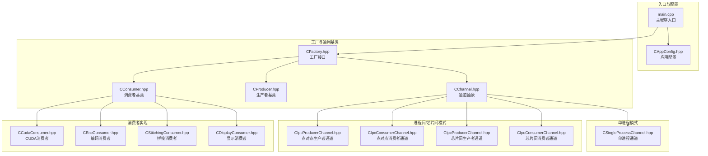
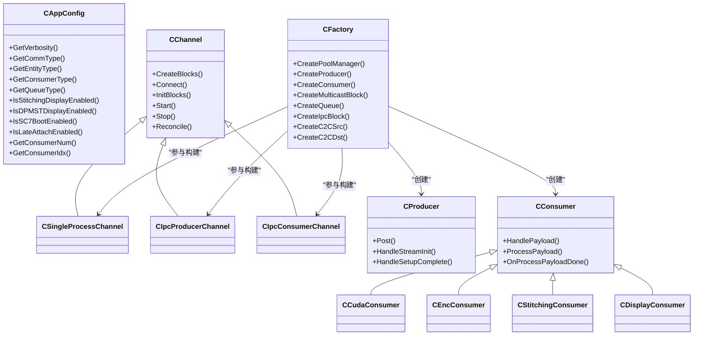
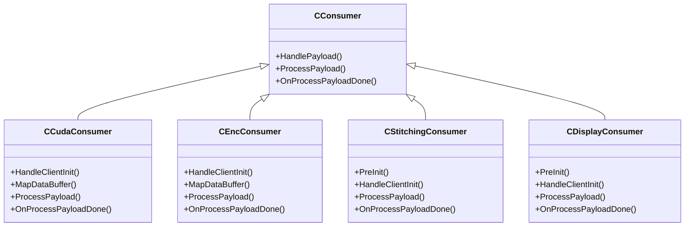
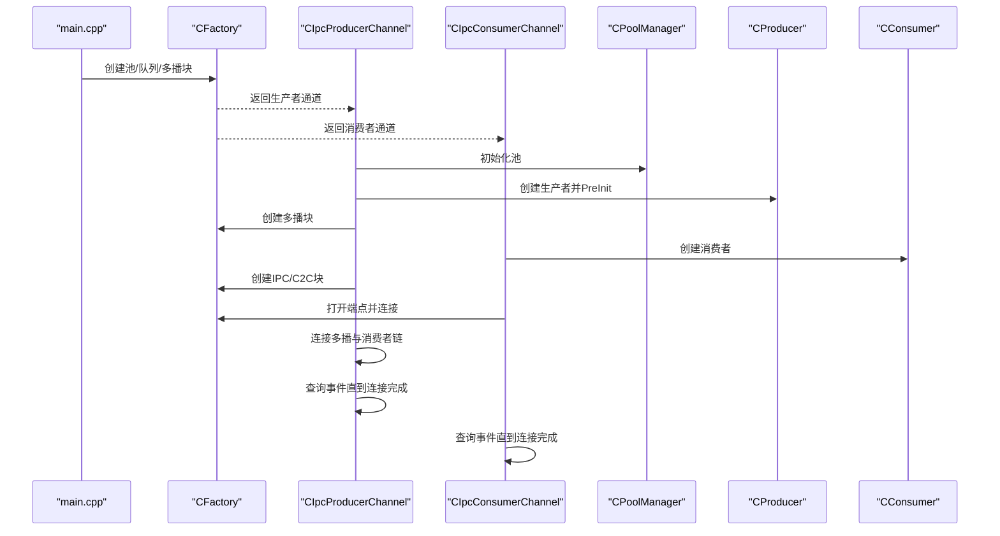
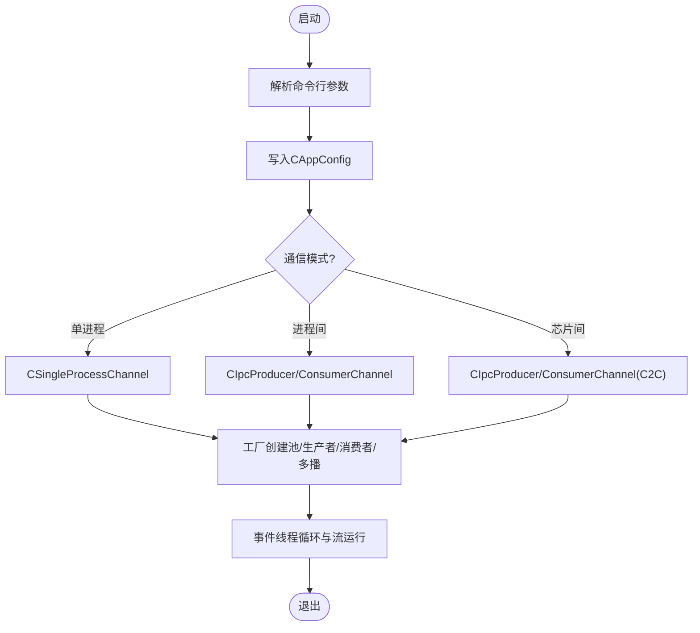
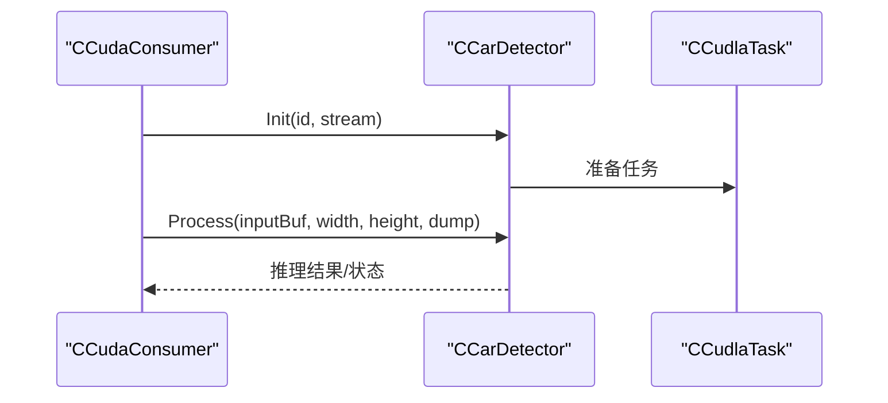
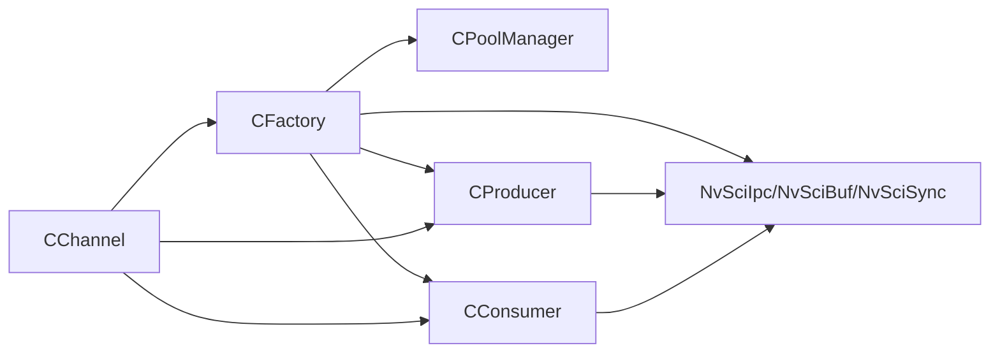

# 核心特性

<cite>
**本文引用的文件**
- [main.cpp](file://main.cpp)
- [CAppConfig.hpp](file://CAppConfig.hpp)
- [Common.hpp](file://Common.hpp)
- [CFactory.hpp](file://CFactory.hpp)
- [CChannel.hpp](file://CChannel.hpp)
- [CSingleProcessChannel.hpp](file://CSingleProcessChannel.hpp)
- [CIpcProducerChannel.hpp](file://CIpcProducerChannel.hpp)
- [CIpcConsumerChannel.hpp](file://CIpcConsumerChannel.hpp)
- [CProducer.hpp](file://CProducer.hpp)
- [CConsumer.hpp](file://CConsumer.hpp)
- [CCudaConsumer.hpp](file://CCudaConsumer.hpp)
- [CEncConsumer.hpp](file://CEncConsumer.hpp)
- [CStitchingConsumer.hpp](file://CStitchingConsumer.hpp)
- [CDisplayConsumer.hpp](file://CDisplayConsumer.hpp)
- [car_detect/CCarDetector.hpp](file://car_detect/CCarDetector.hpp)
</cite>

## 目录
1. [简介](#简介)
2. [项目结构](#项目结构)
3. [核心组件](#核心组件)
4. [架构总览](#架构总览)
5. [详细组件分析](#详细组件分析)
6. [依赖关系分析](#依赖关系分析)
7. [性能考量](#性能考量)
8. [故障排查指南](#故障排查指南)
9. [结论](#结论)
10. [附录](#附录)

## 简介
本文件面向NVSIPL多播系统的核心特性，围绕以下能力进行深入说明：多消费者支持（CUDA、编码器、显示、拼接）、多通信模式（进程内、进程间、芯片间）、动态配置管理、智能检测集成、以及系统的灵活性与可扩展性设计（工厂模式与插件化）。文档通过代码级分析、流程图与时序图，帮助读者理解各特性的实现原理、使用场景与配置方法，并提供最佳实践与排障建议。

## 项目结构
该多播系统以“通道（Channel）+ 工厂（Factory）+ 生产者/消费者（Producer/Consumer）”为核心组织方式，按通信模式拆分为单进程通道与IPC/芯片间通道两类；按消费类型拆分多种消费者实现；通过统一的工厂接口创建池、队列、多播块及跨进程/芯片间连接；应用配置对象贯穿运行期参数解析与行为控制。

**图表来源**
- [main.cpp:253-304](file://main.cpp#L253-L304)
- [CAppConfig.hpp:19-83](file://CAppConfig.hpp#L19-L83)
- [CFactory.hpp:27-95](file://CFactory.hpp#L27-L95)
- [CChannel.hpp:28-157](file://CChannel.hpp#L28-L157)
- [CSingleProcessChannel.hpp:21-247](file://CSingleProcessChannel.hpp#L21-L247)
- [CIpcProducerChannel.hpp:20-533](file://CIpcProducerChannel.hpp#L20-L533)
- [CIpcConsumerChannel.hpp:19-264](file://CIpcConsumerChannel.hpp#L19-L264)
- [CProducer.hpp:16-53](file://CProducer.hpp#L16-L53)
- [CConsumer.hpp:16-45](file://CConsumer.hpp#L16-L45)
- [CCudaConsumer.hpp:25-81](file://CCudaConsumer.hpp#L25-L81)
- [CEncConsumer.hpp:17-66](file://CEncConsumer.hpp#L17-L66)
- [CStitchingConsumer.hpp:17-74](file://CStitchingConsumer.hpp#L17-L74)
- [CDisplayConsumer.hpp:15-49](file://CDisplayConsumer.hpp#L15-L49)

**章节来源**
- [main.cpp:253-304](file://main.cpp#L253-L304)
- [CAppConfig.hpp:19-83](file://CAppConfig.hpp#L19-L83)
- [Common.hpp:35-87](file://Common.hpp#L35-L87)

## 核心组件
- 应用配置（CAppConfig）
  - 提供日志级别、通信模式、实体类型、消费者类型、队列类型、显示/拼接开关、错误处理策略、文件转储、版本查询、多元素启用、延迟附加、SC7启动等参数访问接口。
  - 关键字段与用途参见属性定义与默认值。
- 工厂（CFactory）
  - 统一创建池管理器、生产者、消费者、队列、多播块、同步对象、IPC/芯片间块等。
  - 通过静态单例实例化，集中管理资源生命周期与跨模块依赖。
- 通道（CChannel 及其派生）
  - 抽象通道生命周期：创建块、连接、初始化、开始/停止事件线程、析构释放。
  - 单进程通道负责在同一进程中构建池、生产者与多个消费者并建立多播拓扑。
  - 进程间/芯片间通道负责跨进程/芯片间连接，支持点对点与芯片间两种模式。
- 生产者/消费者基类
  - 生产者基类封装流初始化、设置完成回调、映射载荷、插入前同步等。
  - 消费者基类封装队列句柄、应用配置注入、载荷处理框架、元数据映射等。
- 多种消费者实现
  - CUDA消费者：GPU侧处理、可选智能检测集成。
  - 编码消费者：视频编码输出。
  - 拼接消费者：图像拼接后提交显示生产者。
  - 显示消费者：通过WFD控制器驱动显示。

**章节来源**
- [CAppConfig.hpp:19-83](file://CAppConfig.hpp#L19-L83)
- [CFactory.hpp:27-95](file://CFactory.hpp#L27-L95)
- [CChannel.hpp:28-157](file://CChannel.hpp#L28-L157)
- [CProducer.hpp:16-53](file://CProducer.hpp#L16-L53)
- [CConsumer.hpp:16-45](file://CConsumer.hpp#L16-L45)
- [CCudaConsumer.hpp:25-81](file://CCudaConsumer.hpp#L25-L81)
- [CEncConsumer.hpp:17-66](file://CEncConsumer.hpp#L17-L66)
- [CStitchingConsumer.hpp:17-74](file://CStitchingConsumer.hpp#L17-L74)
- [CDisplayConsumer.hpp:15-49](file://CDisplayConsumer.hpp#L15-L49)

## 架构总览
系统采用“工厂+通道+生产者/消费者”的分层架构。工厂负责资源与连接的创建与管理；通道负责不同通信模式下的拓扑构建与事件循环；生产者/消费者实现具体业务逻辑。多通信模式通过通道派生类实现，工厂在不同模式下创建相应的块与端点。

**图表来源**
- [CAppConfig.hpp:19-83](file://CAppConfig.hpp#L19-L83)
- [CFactory.hpp:27-95](file://CFactory.hpp#L27-L95)
- [CChannel.hpp:28-157](file://CChannel.hpp#L28-L157)
- [CSingleProcessChannel.hpp:21-247](file://CSingleProcessChannel.hpp#L21-L247)
- [CIpcProducerChannel.hpp:20-533](file://CIpcProducerChannel.hpp#L20-L533)
- [CIpcConsumerChannel.hpp:19-264](file://CIpcConsumerChannel.hpp#L19-L264)
- [CProducer.hpp:16-53](file://CProducer.hpp#L16-L53)
- [CConsumer.hpp:16-45](file://CConsumer.hpp#L16-L45)
- [CCudaConsumer.hpp:25-81](file://CCudaConsumer.hpp#L25-L81)
- [CEncConsumer.hpp:17-66](file://CEncConsumer.hpp#L17-L66)
- [CStitchingConsumer.hpp:17-74](file://CStitchingConsumer.hpp#L17-L74)
- [CDisplayConsumer.hpp:15-49](file://CDisplayConsumer.hpp#L15-L49)

## 详细组件分析

### 多消费者支持（CUDA、编码器、显示、拼接）
- CUDA消费者
  - 负责GPU侧数据处理与可选的智能检测（Linux/QNX标准平台），通过外部内存与信号量与NvSci同步。
  - 支持缓冲区属性与同步对象注册、预/后同步插入、载荷处理与完成回调。
- 编码消费者
  - 基于NvMedia IEP进行编码，支持H.264配置、输出缓冲管理与EOF同步对象设置。
- 拼接消费者
  - 与显示生产者配合，完成多路图像拼接，支持NvMedia 2D合成参数设置与目标缓冲注册。
- 显示消费者
  - 通过WFD控制器驱动显示，支持DP-MST显示模式与邮箱队列模式。

**图表来源**
- [CConsumer.hpp:16-45](file://CConsumer.hpp#L16-L45)
- [CCudaConsumer.hpp:25-81](file://CCudaConsumer.hpp#L25-L81)
- [CEncConsumer.hpp:17-66](file://CEncConsumer.hpp#L17-L66)
- [CStitchingConsumer.hpp:17-74](file://CStitchingConsumer.hpp#L17-L74)
- [CDisplayConsumer.hpp:15-49](file://CDisplayConsumer.hpp#L15-L49)

**章节来源**
- [CCudaConsumer.hpp:25-81](file://CCudaConsumer.hpp#L25-L81)
- [CEncConsumer.hpp:17-66](file://CEncConsumer.hpp#L17-L66)
- [CStitchingConsumer.hpp:17-74](file://CStitchingConsumer.hpp#L17-L74)
- [CDisplayConsumer.hpp:15-49](file://CDisplayConsumer.hpp#L15-L49)

### 多通信模式（进程内、进程间、芯片间）
- 进程内（单进程）
  - 在同一进程内创建池、生产者与多个消费者，建立多播拓扑，适合低延迟与高吞吐的本地场景。
- 进程间（点对点）
  - 生产者通道创建多个IPC源块，消费者通道创建IPC目的块，通过工厂打开端点并连接。
- 芯片间（C2C）
  - 生产者通道创建C2C源块与可选呈现同步块；消费者通道创建C2C目的块与池管理器，支持跳过未使用的元素类型。

**图表来源**
- [CIpcProducerChannel.hpp:88-131](file://CIpcProducerChannel.hpp#L88-L131)
- [CIpcProducerChannel.hpp:133-184](file://CIpcProducerChannel.hpp#L133-L184)
- [CIpcConsumerChannel.hpp:63-83](file://CIpcConsumerChannel.hpp#L63-L83)
- [CIpcConsumerChannel.hpp:85-118](file://CIpcConsumerChannel.hpp#L85-L118)
- [CFactory.hpp:36-76](file://CFactory.hpp#L36-L76)

**章节来源**
- [CSingleProcessChannel.hpp:87-159](file://CSingleProcessChannel.hpp#L87-L159)
- [CIpcProducerChannel.hpp:88-184](file://CIpcProducerChannel.hpp#L88-L184)
- [CIpcConsumerChannel.hpp:63-118](file://CIpcConsumerChannel.hpp#L63-L118)

### 动态配置管理
- 配置项覆盖
  - 日志级别、通信模式、实体类型、消费者类型、队列类型、显示/拼接开关、错误忽略、文件转储、版本查询、多元素启用、延迟附加、SC7启动等。
- 解析与传递
  - 命令行解析后写入应用配置对象，随后由工厂与通道读取，决定资源创建与连接策略。
- 平台与传感器信息
  - 提供分辨率查询与传感器类型判断，用于选择合适的消费者（如YUV传感器不启用编码消费者）。

**图表来源**
- [main.cpp:253-304](file://main.cpp#L253-L304)
- [CAppConfig.hpp:19-83](file://CAppConfig.hpp#L19-L83)
- [Common.hpp:35-87](file://Common.hpp#L35-L87)

**章节来源**
- [CAppConfig.hpp:19-83](file://CAppConfig.hpp#L19-L83)
- [main.cpp:253-304](file://main.cpp#L253-L304)

### 智能检测集成
- 集成位置
  - CUDA消费者在Linux/QNX标准平台下可调用智能检测模块进行推理。
- 关键接口
  - 检测器初始化、输入缓冲处理、文件转储控制等。
- 使用建议
  - 仅在支持平台启用检测；注意与CUDA流的同步与性能影响。

**图表来源**
- [CCudaConsumer.hpp:73-78](file://CCudaConsumer.hpp#L73-L78)
- [car_detect/CCarDetector.hpp:17-34](file://car_detect/CCarDetector.hpp#L17-L34)

**章节来源**
- [CCudaConsumer.hpp:73-78](file://CCudaConsumer.hpp#L73-L78)
- [car_detect/CCarDetector.hpp:17-34](file://car_detect/CCarDetector.hpp#L17-L34)

### 工厂模式与插件化架构
- 工厂职责
  - 统一创建池、队列、多播块、同步对象、IPC/C2C块；根据配置与元素信息决定资源与连接策略。
- 插件化体现
  - 消费者类型通过枚举与工厂接口解耦；通道类型通过继承扩展；元素信息与跳过类型支持灵活组合。
- 扩展建议
  - 新增消费者时，遵循CConsumer接口；新增通信模式时，新增通道派生类并在工厂中注册创建逻辑。

**章节来源**
- [CFactory.hpp:27-95](file://CFactory.hpp#L27-L95)
- [Common.hpp:54-87](file://Common.hpp#L54-L87)

## 依赖关系分析
- 组件耦合
  - 工厂是核心依赖中心，生产者/消费者均依赖工厂创建的块与句柄。
  - 通道与工厂双向协作：通道向工厂请求资源，工厂返回句柄供通道连接。
- 外部依赖
  - NvSciBuf/NvSciSync/NvSciIpc：用于缓冲区、同步与IPC/C2C通信。
  - NvMedia IEP/2D：用于编码与合成。
- 循环依赖
  - 通过指针与共享指针避免直接循环包含；通道与消费者通过虚函数解耦。

**图表来源**
- [CFactory.hpp:27-95](file://CFactory.hpp#L27-L95)
- [CChannel.hpp:28-157](file://CChannel.hpp#L28-L157)
- [CIpcProducerChannel.hpp:20-533](file://CIpcProducerChannel.hpp#L20-L533)
- [CIpcConsumerChannel.hpp:19-264](file://CIpcConsumerChannel.hpp#L19-L264)

**章节来源**
- [CFactory.hpp:27-95](file://CFactory.hpp#L27-L95)
- [CChannel.hpp:28-157](file://CChannel.hpp#L28-L157)

## 性能考量
- 多播拓扑
  - 单进程模式减少跨进程/芯片间通信开销，适合低延迟场景。
- 队列类型
  - 邮箱队列确保最新帧可见，适用于显示场景；FIFO队列适合连续处理。
- 元素跳过
  - 芯片间模式可跳过未使用元素类型，降低带宽占用。
- 同步与流控
  - 合理设置前/后同步与查询超时，避免阻塞与死锁。
- GPU与DLA
  - 检测推理需考虑CUDA流与DLA任务的并发与同步，避免瓶颈。

[本节为通用指导，无需列出章节来源]

## 故障排查指南
- 连接失败
  - 检查NvSci事件查询是否超时或返回错误；确认通道名称与端点一致。
- 延迟附加失败
  - 确认多播已进入SetupComplete状态后再附加；失败时释放相关资源并重试。
- 显示/拼接异常
  - 检查显示生产者与拼接消费者的PreInit参数与缓冲属性列表。
- 错误忽略策略
  - 根据配置决定是否忽略错误；必要时开启文件转储定位问题。

**章节来源**
- [CIpcProducerChannel.hpp:205-272](file://CIpcProducerChannel.hpp#L205-L272)
- [CIpcProducerChannel.hpp:274-289](file://CIpcProducerChannel.hpp#L274-L289)
- [CStitchingConsumer.hpp:25-32](file://CStitchingConsumer.hpp#L25-L32)
- [CAppConfig.hpp:34-41](file://CAppConfig.hpp#L34-L41)

## 结论
NVSIPL多播系统通过工厂与通道的清晰分层，实现了多消费者与多通信模式的统一管理；借助NvSci与NvMedia栈，系统在GPU/CPU/显示/编码/拼接等场景具备良好性能与扩展性。结合动态配置与延迟附加机制，用户可在不同硬件与部署环境下灵活调整拓扑与行为，满足多样化的多路视频分发需求。

[本节为总结性内容，无需列出章节来源]

## 附录
- 常用配置要点
  - 通信模式：根据部署环境选择单进程、进程间或芯片间。
  - 消费者类型：根据业务选择CUDA/编码/拼接/显示。
  - 队列类型：显示优先邮箱队列，其他场景可选FIFO。
  - 显示/拼接：启用相应开关并确保显示生产者可用。
  - 延迟附加：在需要动态增删消费者时启用。
- 最佳实践
  - 先单进程验证，再扩展到IPC/C2C。
  - 合理设置日志级别与转储策略，便于定位问题。
  - 对GPU推理与显示路径分别评估性能，避免瓶颈。

[本节为通用指导，无需列出章节来源]