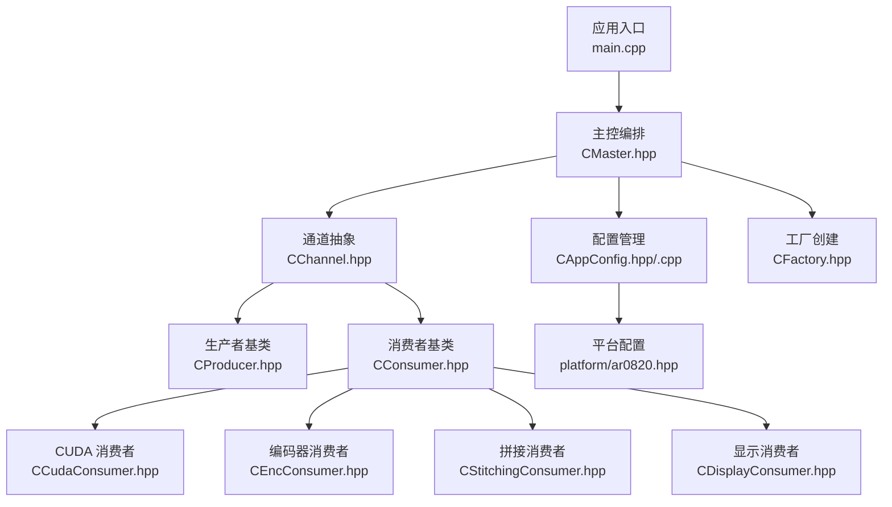
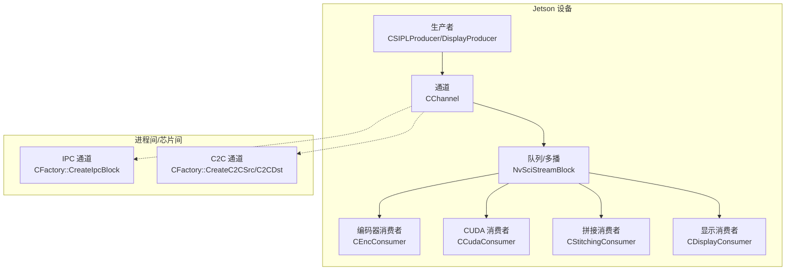
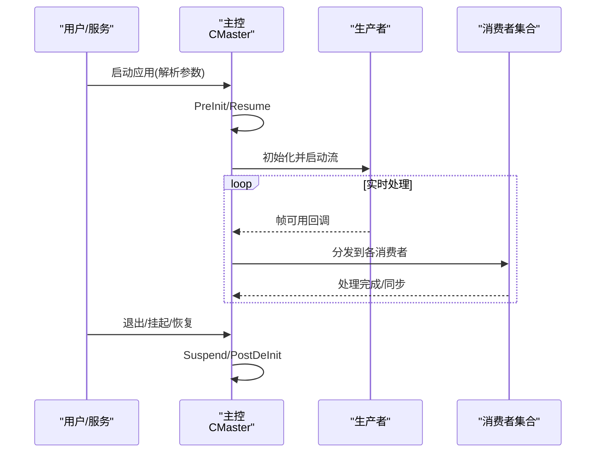
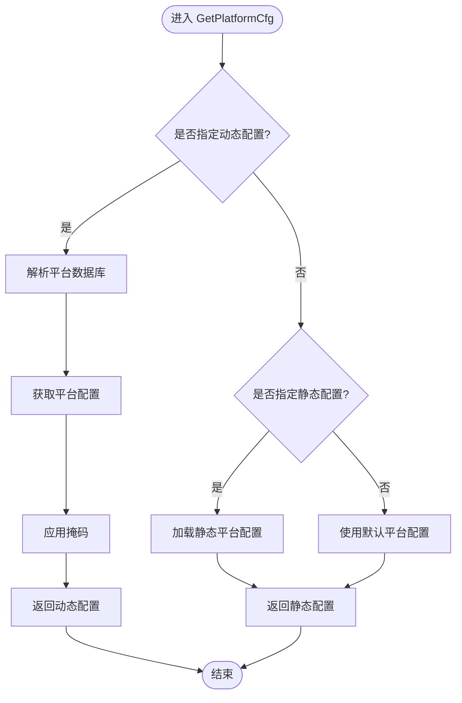
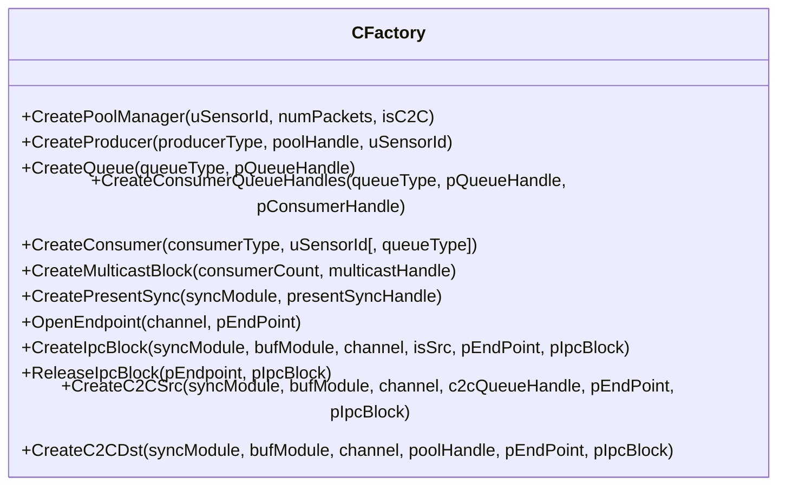
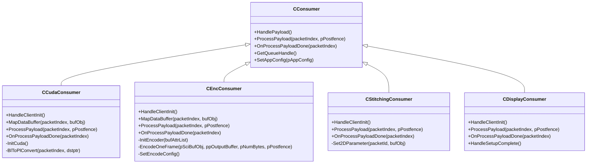
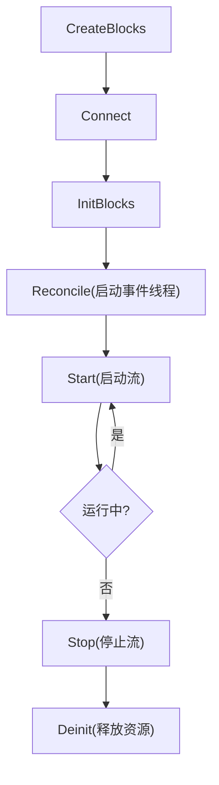
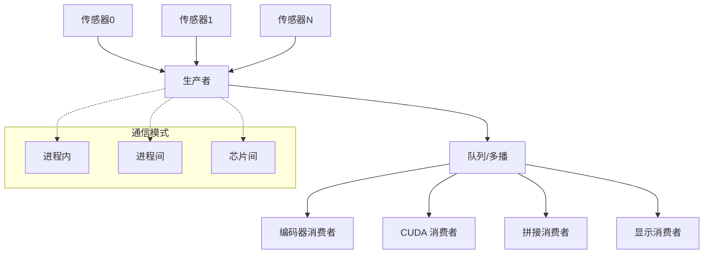
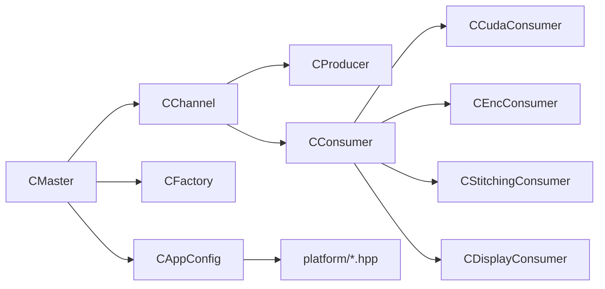

# 项目介绍

<cite>
**本文引用的文件**
- [README.md](file://README.md)
- [main.cpp](file://main.cpp)
- [CAppConfig.hpp](file://CAppConfig.hpp)
- [CAppConfig.cpp](file://CAppConfig.cpp)
- [Common.hpp](file://Common.hpp)
- [CMaster.hpp](file://CMaster.hpp)
- [CProducer.hpp](file://CProducer.hpp)
- [CConsumer.hpp](file://CConsumer.hpp)
- [CCudaConsumer.hpp](file://CCudaConsumer.hpp)
- [CEncConsumer.hpp](file://CEncConsumer.hpp)
- [CStitchingConsumer.hpp](file://CStitchingConsumer.hpp)
- [CDisplayConsumer.hpp](file://CDisplayConsumer.hpp)
- [CFactory.hpp](file://CFactory.hpp)
- [CChannel.hpp](file://CChannel.hpp)
- [platform/ar0820.hpp](file://platform/ar0820.hpp)
</cite>

## 目录
1. [引言](#引言)
2. [项目结构](#项目结构)
3. [核心组件](#核心组件)
4. [架构总览](#架构总览)
5. [详细组件分析](#详细组件分析)
6. [依赖关系分析](#依赖关系分析)
7. [性能考量](#性能考量)
8. [故障排查指南](#故障排查指南)
9. [结论](#结论)
10. [附录](#附录)

## 引言
NVSIPL多播系统是面向嵌入式视觉处理场景的高性能视频流实时分发框架，基于NVIDIA的NvStreams/NvSIPL技术栈实现，能够在单机、跨进程乃至跨芯片（C2C）环境中，将多路CSI摄像头的实时视频流高效地分发给多种消费者（CUDA推理、视频编码、显示、拼接等），满足自动驾驶、机器人视觉、工业检测等领域的低延迟、高吞吐需求。

本项目的定位清晰：以NVIDIA Jetson平台为核心载体，提供从传感器到多终端消费者的完整链路抽象与运行时管理，帮助开发者快速搭建“多传感器+多消费者”的实时视觉处理流水线，并通过统一的通信模式（进程内/进程间/芯片间）与平台配置能力，适配多样化的硬件拓扑与部署场景。

## 项目结构
项目采用按职责分层的组织方式：
- 应用入口与控制流：main.cpp 负责命令行解析、日志级别设置、信号处理、主循环与生命周期管理。
- 配置与平台：CAppConfig 提供运行参数、通信模式、实体类型、队列类型、平台配置选择与分辨率查询；platform 下包含静态平台定义。
- 核心调度与通道：CMaster 统一编排生产者、消费者、显示、同步与事件线程；CChannel 抽象通道生命周期与事件驱动模型。
- 生产者/消费者基类：CProducer/CConsumer 定义通用的流块交互协议、缓冲区映射、同步对象注册与处理流程。
- 具体消费者：CUDA、编码器、拼接、显示四类消费者分别实现不同的数据处理路径。
- 工厂与通道：CFactory 负责根据配置创建生产者、消费者、队列、多播块、IPC/C2C端点等。
- 平台定义：platform/ar0820.hpp 等文件描述具体硬件平台的CSI端口、传感器模块、分辨率、帧率等信息。

图表来源
- [main.cpp:253-304](file://main.cpp#L253-L304)
- [CMaster.hpp:47-95](file://CMaster.hpp#L47-L95)
- [CAppConfig.hpp:19-83](file://CAppConfig.hpp#L19-L83)
- [CChannel.hpp:28-157](file://CChannel.hpp#L28-L157)
- [CProducer.hpp:16-53](file://CProducer.hpp#L16-L53)
- [CConsumer.hpp:16-45](file://CConsumer.hpp#L16-L45)
- [CCudaConsumer.hpp:25-81](file://CCudaConsumer.hpp#L25-L81)
- [CEncConsumer.hpp:17-66](file://CEncConsumer.hpp#L17-L66)
- [CStitchingConsumer.hpp:17-74](file://CStitchingConsumer.hpp#L17-L74)
- [CDisplayConsumer.hpp:15-49](file://CDisplayConsumer.hpp#L15-L49)
- [CFactory.hpp:27-95](file://CFactory.hpp#L27-L95)
- [platform/ar0820.hpp:14-186](file://platform/ar0820.hpp#L14-L186)

章节来源
- [main.cpp:253-304](file://main.cpp#L253-L304)
- [CAppConfig.hpp:19-83](file://CAppConfig.hpp#L19-L83)
- [CAppConfig.cpp:21-109](file://CAppConfig.cpp#L21-L109)
- [Common.hpp:35-87](file://Common.hpp#L35-L87)
- [platform/ar0820.hpp:14-186](file://platform/ar0820.hpp#L14-L186)

## 核心组件
- 应用配置与平台
  - CAppConfig 提供运行参数读取、平台动态/静态配置选择、分辨率查询、多元素开关、延迟接入开关、SC7引导模式等；支持动态配置通过NvSIPL查询接口解析数据库并应用掩码。
- 主控编排
  - CMaster 负责预初始化、恢复/挂起、启动/停止、后清理、监控线程、通道创建、显示通道创建、拼接显示初始化等；对外暴露挂起/恢复、附加/分离消费者等控制接口。
- 通道与事件
  - CChannel 抽象通道生命周期，提供 Reconcile/Start/Stop 与事件线程循环，封装超时重试与错误传播。
- 生产者/消费者基类
  - CProducer/CConsumer 定义流块初始化、负载处理、元数据映射、同步对象注册、前/后栅栏插入等通用协议。
- 具体消费者
  - CUDA：执行设备侧转换/推理（含cuDLA示例），使用CUDA外部内存/信号量与NvSciBuf/NvSciSync协同。
  - 编码器：对接NvMedia IEP进行H.264编码，输出压缩数据。
  - 拼接：使用NvMedia 2D进行图像拼接，可连接显示生产者。
  - 显示：通过OpenWFD控制器驱动显示输出。
- 工厂与通信
  - CFactory 负责创建池管理器、生产者、消费者、队列、多播块、IPC/C2C端点与块，屏蔽不同通信模式的差异。
- 通信模式与平台
  - 通信模式：进程内（IntraProcess）、进程间（InterProcess）、芯片间（InterChip）。
  - 平台：静态平台配置（如AR0820）或动态平台配置（非安全OS下通过查询接口解析）。

章节来源
- [CAppConfig.hpp:19-83](file://CAppConfig.hpp#L19-L83)
- [CAppConfig.cpp:21-109](file://CAppConfig.cpp#L21-L109)
- [CMaster.hpp:47-95](file://CMaster.hpp#L47-L95)
- [CChannel.hpp:28-157](file://CChannel.hpp#L28-L157)
- [CProducer.hpp:16-53](file://CProducer.hpp#L16-L53)
- [CConsumer.hpp:16-45](file://CConsumer.hpp#L16-L45)
- [CCudaConsumer.hpp:25-81](file://CCudaConsumer.hpp#L25-L81)
- [CEncConsumer.hpp:17-66](file://CEncConsumer.hpp#L17-L66)
- [CStitchingConsumer.hpp:17-74](file://CStitchingConsumer.hpp#L17-L74)
- [CDisplayConsumer.hpp:15-49](file://CDisplayConsumer.hpp#L15-L49)
- [CFactory.hpp:27-95](file://CFactory.hpp#L27-L95)
- [Common.hpp:35-87](file://Common.hpp#L35-L87)

## 架构总览
系统围绕“多传感器输入 → 多消费者输出”的多播架构展开，通过NvStreams/NvSIPL构建统一的数据通路与同步机制。主控（CMaster）负责协调各通道与消费者，依据配置选择通信模式与平台参数，实现从采集到处理/显示/编码/拼接的全链路自动化。

图表来源
- [CMaster.hpp:47-95](file://CMaster.hpp#L47-L95)
- [CChannel.hpp:28-157](file://CChannel.hpp#L28-L157)
- [CFactory.hpp:52-76](file://CFactory.hpp#L52-L76)
- [CEncConsumer.hpp:17-66](file://CEncConsumer.hpp#L17-L66)
- [CCudaConsumer.hpp:25-81](file://CCudaConsumer.hpp#L25-L81)
- [CStitchingConsumer.hpp:17-74](file://CStitchingConsumer.hpp#L17-L74)
- [CDisplayConsumer.hpp:15-49](file://CDisplayConsumer.hpp#L15-L49)

## 详细组件分析

### 应用入口与控制流
- 命令行解析：通过 CCmdLineParser 解析运行参数，决定版本打印、文件转储、帧过滤、运行时长、平台配置、通信模式、实体类型、消费者类型等。
- 生命周期：PreInit → Resume → 输入事件/Socket事件线程 → Suspend → PostDeInit。
- 信号处理：统一捕获中断/终止/退出/挂起信号，触发优雅退出。
- 进程内/SC7引导：根据是否启用SC7引导切换输入事件线程或Unix域套接字事件线程。

图表来源
- [main.cpp:253-304](file://main.cpp#L253-L304)
- [CMaster.hpp:55-64](file://CMaster.hpp#L55-L64)

章节来源
- [main.cpp:253-304](file://main.cpp#L253-L304)

### 配置与平台
- 动态平台：非安全OS下通过NvSIPL查询接口解析数据库，获取平台配置并应用掩码，支持按传感器/通道掩码裁剪链路。
- 静态平台：内置多组平台配置（如AR0820、IMX623VB2、IMX728VB2、MAX96712 TPG、ISX031等），直接加载对应传感器与分辨率信息。
- 运行参数：支持多元素、延迟接入、文件转储、帧过滤、运行时长、显示拼接/DPMST、错误忽略等。

图表来源
- [CAppConfig.cpp:21-75](file://CAppConfig.cpp#L21-L75)

章节来源
- [CAppConfig.hpp:19-83](file://CAppConfig.hpp#L19-L83)
- [CAppConfig.cpp:21-109](file://CAppConfig.cpp#L21-L109)
- [platform/ar0820.hpp:14-186](file://platform/ar0820.hpp#L14-L186)

### 通信模式与工厂
- 进程内：同一进程中同时承载生产者与多个消费者，共享内存与同步对象，延迟最低。
- 进程间：通过NvSciIpc端点与NvSciStream块建立IPC多播通道，消费者进程需与生产者保持平台配置一致（可通过对端校验功能自动检查）。
- 芯片间：通过C2C源/目的端点与PCIe通道连接，硬编码通道命名规则，便于跨芯片扩展。
- 工厂职责：创建池管理器、生产者、消费者、队列、多播块、IPC/C2C端点与块，统一封装不同模式下的资源创建与销毁。

图表来源
- [CFactory.hpp:27-95](file://CFactory.hpp#L27-L95)

章节来源
- [CFactory.hpp:27-95](file://CFactory.hpp#L27-L95)
- [Common.hpp:31-34](file://Common.hpp#L31-L34)

### 消费者类型与处理逻辑
- CUDA 消费者
  - 使用CUDA外部内存/信号量与NvSciBuf/NvSciSync协作，支持设备侧转换与推理（含cuDLA示例），可选文件转储与帧过滤。
- 编码器消费者
  - 对接NvMedia IEP进行H.264编码，设置编码参数，输出压缩帧。
- 拼接消费者
  - 使用NvMedia 2D进行多视角拼接，可注册目标缓冲区并与显示生产者配合输出。
- 显示消费者
  - 通过OpenWFD控制器驱动显示输出，支持多管道与DPMST等特性。

图表来源
- [CConsumer.hpp:16-45](file://CConsumer.hpp#L16-L45)
- [CCudaConsumer.hpp:25-81](file://CCudaConsumer.hpp#L25-L81)
- [CEncConsumer.hpp:17-66](file://CEncConsumer.hpp#L17-L66)
- [CStitchingConsumer.hpp:17-74](file://CStitchingConsumer.hpp#L17-L74)
- [CDisplayConsumer.hpp:15-49](file://CDisplayConsumer.hpp#L15-L49)

章节来源
- [CCudaConsumer.hpp:25-81](file://CCudaConsumer.hpp#L25-L81)
- [CEncConsumer.hpp:17-66](file://CEncConsumer.hpp#L17-L66)
- [CStitchingConsumer.hpp:17-74](file://CStitchingConsumer.hpp#L17-L74)
- [CDisplayConsumer.hpp:15-49](file://CDisplayConsumer.hpp#L15-L49)

### 通道与事件驱动
- 通道生命周期：CreateBlocks → Connect → InitBlocks → Reconcile/Start → Stop → Deinit。
- 事件线程：每个通道内部维护事件处理器线程，循环等待事件，带超时重试与错误传播。
- 运行状态：通过原子标志位控制线程启停，确保一致性与可恢复性。

图表来源
- [CChannel.hpp:46-109](file://CChannel.hpp#L46-L109)

章节来源
- [CChannel.hpp:28-157](file://CChannel.hpp#L28-L157)

### 概念性总览
以下为概念性工作流图，展示从多传感器到多消费者的典型路径与通信模式选择，帮助快速理解系统定位与适用范围。

## 依赖关系分析
- 组件耦合
  - CMaster 作为编排中心，依赖 CAppConfig、CChannel、CFactory、各类消费者与显示控制器。
  - CChannel 依赖 NvSciBuf/NvSciSync 模块与事件处理器，向上提供统一接口。
  - CProducer/CConsumer 通过工厂创建的块与队列进行交互，遵循统一协议。
- 外部依赖
  - NVIDIA 生态：NvSIPL/NvStreams/NvSciBuf/NvSciSync、NvMedia IEP/2D、OpenWFD。
  - 平台：静态平台配置头文件；非安全OS下依赖NvSIPL查询接口。
- 循环依赖
  - 未发现直接循环依赖；消费者与工厂之间为创建关系，不形成环。

图表来源
- [CMaster.hpp:74-92](file://CMaster.hpp#L74-L92)
- [CAppConfig.hpp:46-51](file://CAppConfig.hpp#L46-L51)
- [CFactory.hpp:36-47](file://CFactory.hpp#L36-L47)
- [CChannel.hpp:74-76](file://CChannel.hpp#L74-L76)
- [CProducer.hpp:22-24](file://CProducer.hpp#L22-L24)
- [CConsumer.hpp:21-23](file://CConsumer.hpp#L21-L23)

章节来源
- [CMaster.hpp:47-95](file://CMaster.hpp#L47-L95)
- [CFactory.hpp:27-95](file://CFactory.hpp#L27-L95)
- [CChannel.hpp:28-157](file://CChannel.hpp#L28-L157)
- [CProducer.hpp:16-53](file://CProducer.hpp#L16-L53)
- [CConsumer.hpp:16-45](file://CConsumer.hpp#L16-L45)

## 性能考量
- 低延迟与高吞吐
  - 进程内模式最小化跨进程/跨芯片开销，适合对延迟敏感的场景。
  - 多播与队列策略减少重复拷贝，结合NvSciBuf/NvSciSync实现零拷贝/最小拷贝。
- 资源复用
  - 工厂统一创建池管理器与块，避免重复初始化成本。
- 可扩展性
  - 支持多元素/多ISP输出，便于横向扩展传感器数量与消费者类型。
- 优化建议
  - 合理设置帧过滤与运行时长，平衡功耗与性能。
  - 在拼接/编码等计算密集型消费者中，优先使用GPU/CUDA/硬件加速路径。
  - 在进程间/芯片间模式下，确保平台配置一致，避免额外校验与失败重试带来的时延。

## 故障排查指南
- 无法启动/卡死
  - 检查事件线程是否超时（通道内部已记录警告并限制最大超时次数），确认NvSci对象初始化与同步对象注册是否成功。
- 进程间不一致
  - 确保生产者与消费者使用相同的动态/静态平台配置；若启用对端校验，不一致会直接退出消费者进程。
- 显示/拼接异常
  - 检查显示消费者初始化与OpenWFD控制器状态；拼接消费者需正确注册目标缓冲区并设置2D参数。
- 编码失败
  - 检查编码器初始化、编码参数设置与输出缓冲区分配；确认NvMedia IEP句柄有效。
- 延迟接入
  - 在启用延迟接入模式时，通过主控提供的附加/分离接口动态调整消费者，注意命令输入时机与日志提示。

章节来源
- [CChannel.hpp:111-140](file://CChannel.hpp#L111-L140)
- [CDisplayConsumer.hpp:25-36](file://CDisplayConsumer.hpp#L25-L36)
- [CStitchingConsumer.hpp:35-45](file://CStitchingConsumer.hpp#L35-L45)
- [CEncConsumer.hpp:25-34](file://CEncConsumer.hpp#L25-L34)
- [README.md:47-92](file://README.md#L47-L92)

## 结论
NVSIPL多播系统以NVIDIA Jetson平台为核心，提供了从多传感器到多消费者的统一实时视频分发能力。其核心价值在于：
- 技术优势：基于NvStreams/NvSIPL的低延迟、高吞吐、零拷贝多播架构；支持CUDA/编码器/显示/拼接四大消费者类型；覆盖进程内/进程间/芯片间三种通信模式。
- 生态融合：深度集成NVIDIA生态组件（NvMedia、NvSciBuf/Sync、OpenWFD），在Jetson平台上具备出色的部署与性能优势。
- 场景适配：适用于自动驾驶感知、机器人视觉、工业检测等需要多路视频实时处理与分发的应用。

## 附录
- 快速定位
  - 应用入口与控制流：[main.cpp](file://main.cpp)
  - 配置与平台：[CAppConfig.hpp](file://CAppConfig.hpp)、[CAppConfig.cpp](file://CAppConfig.cpp)、[platform/ar0820.hpp](file://platform/ar0820.hpp)
  - 通道与事件：[CChannel.hpp](file://CChannel.hpp)
  - 生产者/消费者基类：[CProducer.hpp](file://CProducer.hpp)、[CConsumer.hpp](file://CConsumer.hpp)
  - 消费者实现：[CCudaConsumer.hpp](file://CCudaConsumer.hpp)、[CEncConsumer.hpp](file://CEncConsumer.hpp)、[CStitchingConsumer.hpp](file://CStitchingConsumer.hpp)、[CDisplayConsumer.hpp](file://CDisplayConsumer.hpp)
  - 工厂与通信：[CFactory.hpp](file://CFactory.hpp)
  - 通信模式常量：[Common.hpp](file://Common.hpp)