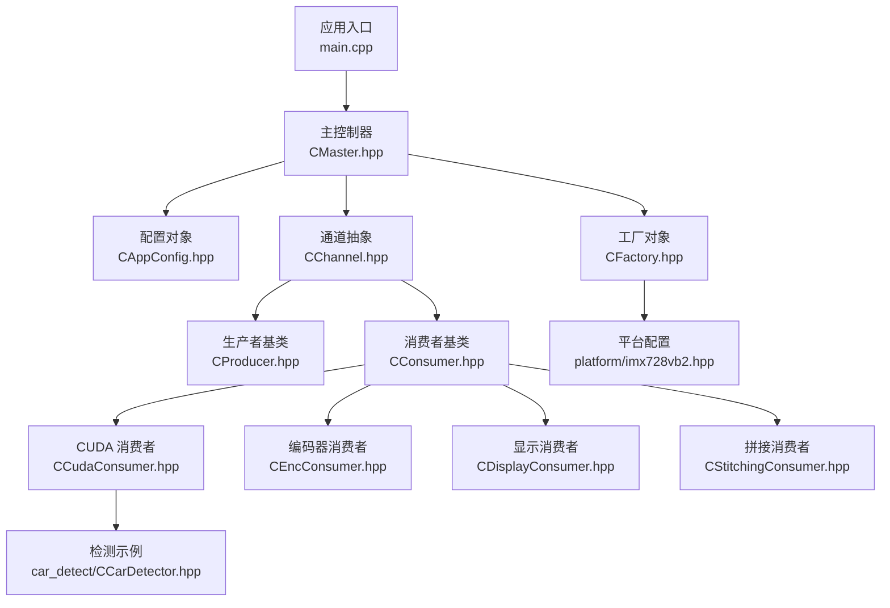
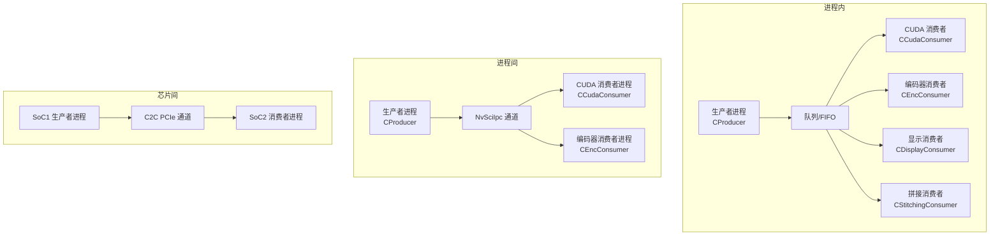
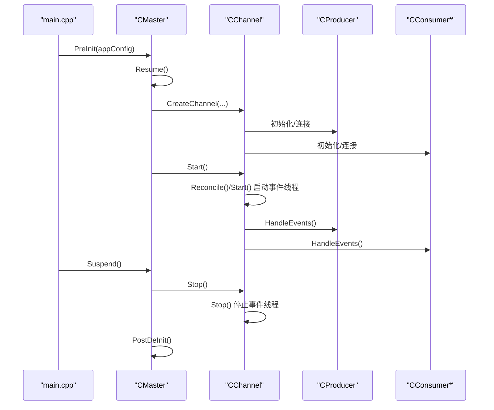
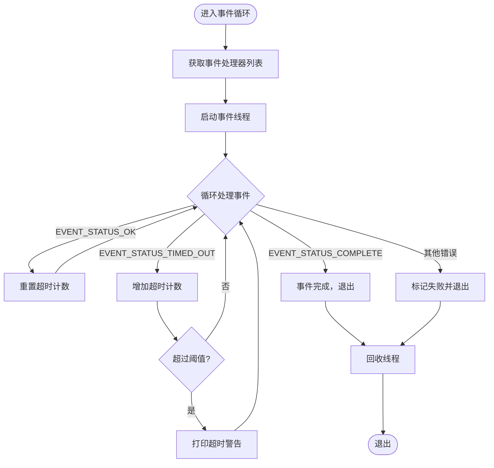
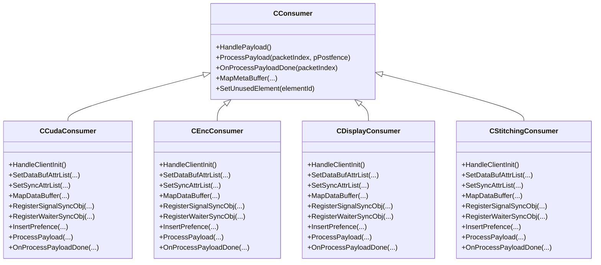
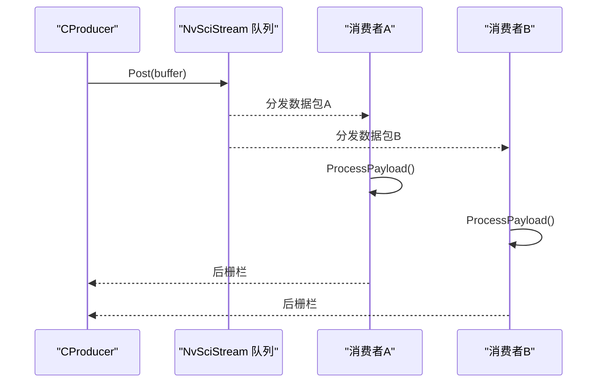
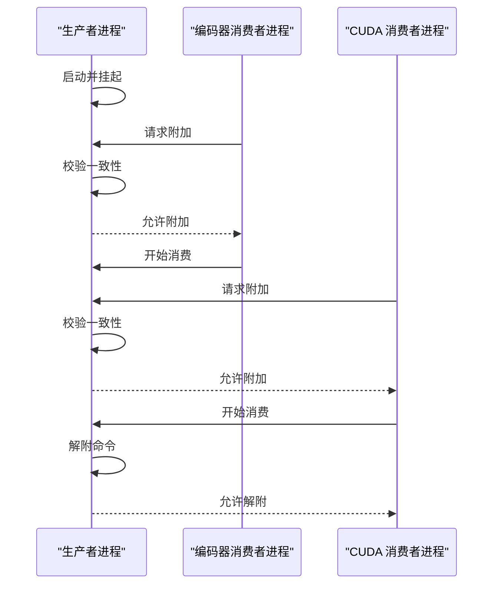
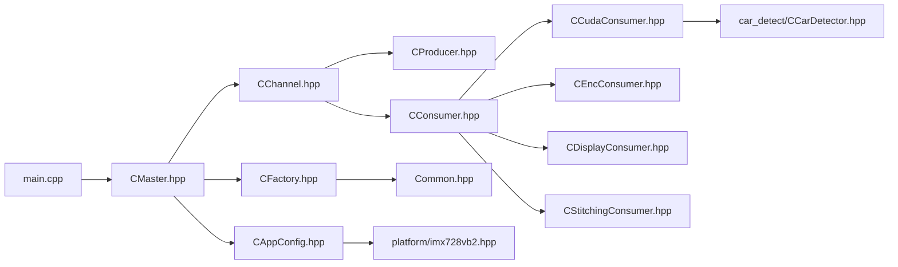

# 项目概述

<cite>
**本文引用的文件**
- [README.md](file://README.md)
- [main.cpp](file://main.cpp)
- [CAppConfig.hpp](file://CAppConfig.hpp)
- [CFactory.hpp](file://CFactory.hpp)
- [CMaster.hpp](file://CMaster.hpp)
- [CChannel.hpp](file://CChannel.hpp)
- [Common.hpp](file://Common.hpp)
- [CConsumer.hpp](file://CConsumer.hpp)
- [CProducer.hpp](file://CProducer.hpp)
- [CCudaConsumer.hpp](file://CCudaConsumer.hpp)
- [CEncConsumer.hpp](file://CEncConsumer.hpp)
- [CDisplayConsumer.hpp](file://CDisplayConsumer.hpp)
- [CStitchingConsumer.hpp](file://CStitchingConsumer.hpp)
- [car_detect/CCarDetector.hpp](file://car_detect/CCarDetector.hpp)
- [platform/imx728vb2.hpp](file://platform/imx728vb2.hpp)
</cite>

## 目录
1. [简介](#简介)
2. [项目结构](#项目结构)
3. [核心组件](#核心组件)
4. [架构总览](#架构总览)
5. [详细组件分析](#详细组件分析)
6. [依赖关系分析](#依赖关系分析)
7. [性能考量](#性能考量)
8. [故障排查指南](#故障排查指南)
9. [结论](#结论)
10. [附录](#附录)

## 简介
本项目是基于 NVIDIA NvStreams 的多播系统，面向嵌入式视觉处理场景，演示如何通过 NvStreams 将实时摄像头输出广播到多个消费者（CUDA、编码器、显示、拼接），并支持三种通信模式：进程内（Intra-process）、进程间（Inter-process）、芯片间（Inter-chip）。项目同时展示了在 Jetson 平台上使用不同平台配置进行多传感器视频流处理与分发的完整流程，并提供了延迟/重附加机制以适应动态拓扑变化。

该系统与 NVIDIA 生态紧密集成，利用 NvSIPL、NvSciBuf/NvSciStream、NvMedia、cuDLA 等组件，实现从摄像头采集、多路分发、GPU/CPU 加速处理到编码与显示的端到端流水线。

## 项目结构
项目采用按职责分层的组织方式：
- 应用入口与控制流：main.cpp 负责命令行解析、信号处理、事件循环与生命周期管理。
- 配置与参数：CAppConfig.hpp 定义运行时配置项（通信模式、实体类型、队列类型、平台配置等）。
- 核心编排：CMaster.hpp 提供主控制器，负责通道创建、启动/停止、挂起/恢复、晚附加等。
- 通道与事件：CChannel.hpp 抽象通道，统一事件线程模型与连接/初始化流程。
- 生产者与消费者基类：CProducer.hpp、CConsumer.hpp 定义生产者/消费者的通用接口与生命周期回调。
- 具体消费者实现：CUDA、编码器、显示、拼接分别在 CCudaConsumer.hpp、CEncConsumer.hpp、CDisplayConsumer.hpp、CStitchingConsumer.hpp 中实现。
- 工厂与资源：CFactory.hpp 负责创建池、队列、多播块、IPC/C2C 端点等底层资源。
- 通用常量与枚举：Common.hpp 定义通信类型、实体类型、消费者类型、队列类型、包元素类型等。
- 平台配置：platform/*.hpp 提供具体硬件平台的配置样例（如 IMX728VB2）。
- 检测示例：car_detect/CCarDetector.hpp 展示 cuDLA 推理与数据准备流程。

图表来源
- [main.cpp:253-304](file://main.cpp#L253-L304)
- [CMaster.hpp:47-95](file://CMaster.hpp#L47-L95)
- [CAppConfig.hpp:19-83](file://CAppConfig.hpp#L19-L83)
- [CFactory.hpp:27-95](file://CFactory.hpp#L27-L95)
- [CChannel.hpp:28-157](file://CChannel.hpp#L28-L157)
- [CProducer.hpp:16-53](file://CProducer.hpp#L16-L53)
- [CConsumer.hpp:16-45](file://CConsumer.hpp#L16-L45)
- [CCudaConsumer.hpp:25-81](file://CCudaConsumer.hpp#L25-L81)
- [CEncConsumer.hpp:17-66](file://CEncConsumer.hpp#L17-L66)
- [CDisplayConsumer.hpp:15-49](file://CDisplayConsumer.hpp#L15-L49)
- [CStitchingConsumer.hpp:17-74](file://CStitchingConsumer.hpp#L17-L74)
- [platform/imx728vb2.hpp:14-166](file://platform/imx728vb2.hpp#L14-L166)
- [car_detect/CCarDetector.hpp:17-34](file://car_detect/CCarDetector.hpp#L17-L34)

章节来源
- [README.md:11-109](file://README.md#L11-L109)
- [main.cpp:253-304](file://main.cpp#L253-L304)
- [CAppConfig.hpp:19-83](file://CAppConfig.hpp#L19-L83)
- [CFactory.hpp:27-95](file://CFactory.hpp#L27-L95)
- [CMaster.hpp:47-95](file://CMaster.hpp#L47-L95)
- [CChannel.hpp:28-157](file://CChannel.hpp#L28-L157)
- [Common.hpp:35-87](file://Common.hpp#L35-L87)
- [platform/imx728vb2.hpp:14-166](file://platform/imx728vb2.hpp#L14-L166)

## 核心组件
- 应用入口与控制流
  - main.cpp 负责命令行解析、版本查询、日志级别设置、信号处理、输入事件线程与套接字事件线程、生命周期管理（PreInit/Resume/Start/Stop/Suspend/PostDeInit）。
- 主控制器 CMaster
  - 统一编排通道、显示通道、相机设备、OpenWFD 控制器、性能分析器等；提供挂起/恢复、晚附加/解附、启动/停止流等能力。
- 配置对象 CAppConfig
  - 管理运行参数：通信类型（进程内/进程间/芯片间）、实体类型（生产者/消费者）、消费者类型（编码器/CUDA/拼接/显示）、队列类型（FIFO/邮箱）、平台配置（静态/动态）、是否启用拼接显示/DPMST、是否忽略错误、是否转储文件、是否启用多元素、是否启用晚附加、是否启用 SC7 引导、帧过滤间隔、运行时长、消费者编号/索引等。
- 工厂 CFactory
  - 创建池管理器、生产者、消费者、队列、多播块、呈现同步、IPC/C2C 端点与块；封装底层 NvSciBuf/NvSciStream 资源创建细节。
- 通道 CChannel
  - 统一事件线程模型（Reconcile/Start/Stop）、连接/初始化/去初始化、事件处理器集合管理；屏蔽多消费者并发与同步细节。
- 基类 CProducer/CConsumer
  - 定义生产者/消费者的通用生命周期回调（初始化、设置完成、处理负载、映射元数据/数据缓冲、插入前栅栏、EOF 同步等）。
- 具体消费者
  - CUDA：GPU/CUDA 处理、可选 cuDLA 推理（Linux/QNX 标准环境）。
  - 编码器：H.264 编码、输出文件写入。
  - 显示：OpenWFD 控制、显示管道管理。
  - 拼接：多路图像拼接、NvMedia 2D 组合。
- 通用常量与枚举
  - 定义通信类型、实体类型、生产者类型、消费者类型、队列类型、包元素类型、通道前缀、最大数量阈值等。

章节来源
- [main.cpp:253-304](file://main.cpp#L253-L304)
- [CMaster.hpp:47-95](file://CMaster.hpp#L47-L95)
- [CAppConfig.hpp:19-83](file://CAppConfig.hpp#L19-L83)
- [CFactory.hpp:27-95](file://CFactory.hpp#L27-L95)
- [CChannel.hpp:28-157](file://CChannel.hpp#L28-L157)
- [CProducer.hpp:16-53](file://CProducer.hpp#L16-L53)
- [CConsumer.hpp:16-45](file://CConsumer.hpp#L16-L45)
- [Common.hpp:35-87](file://Common.hpp#L35-L87)

## 架构总览
系统采用“主控制器 + 通道 + 生产者/消费者”的分层架构，结合 NvStreams 实现多播分发。根据通信模式，系统支持：
- 进程内：同一进程内的生产者与多个消费者共享内存缓冲。
- 进程间：通过 NvSciIpc 通道在进程间传递缓冲与同步对象。
- 芯片间：通过 C2C PCIe 通道在 SoC 之间传递数据与同步对象。

图表来源
- [Common.hpp:31-33](file://Common.hpp#L31-L33)
- [CFactory.hpp:52-76](file://CFactory.hpp#L52-L76)
- [CChannel.hpp:55-82](file://CChannel.hpp#L55-L82)

章节来源
- [README.md:47-79](file://README.md#L47-L79)
- [Common.hpp:31-33](file://Common.hpp#L31-L33)
- [CFactory.hpp:52-76](file://CFactory.hpp#L52-L76)
- [CChannel.hpp:55-82](file://CChannel.hpp#L55-L82)

## 详细组件分析

### 主控制器 CMaster
- 职责
  - 生命周期管理：PreInit/Init/Start/Stop/DeInit/PostDeInit。
  - 运行控制：Suspend/Resume、AttachConsumer/DetachConsumer（晚附加）。
  - 事件循环：输入事件线程与套接字事件线程（SC7 引导模式）。
  - 通道与显示：创建单个或多个传感器通道、显示通道。
- 关键流程
  - 输入事件线程：支持挂起/恢复、晚附加/解附命令。
  - 套接字事件线程：接收外部服务事件（挂起/恢复）并转发至主控。
  - 事件线程模型：每个通道内部使用事件处理器线程循环处理事件，带超时保护。

图表来源
- [main.cpp:271-288](file://main.cpp#L271-L288)
- [CMaster.hpp:55-64](file://CMaster.hpp#L55-L64)
- [CChannel.hpp:55-109](file://CChannel.hpp#L55-L109)

章节来源
- [main.cpp:74-153](file://main.cpp#L74-L153)
- [main.cpp:155-251](file://main.cpp#L155-L251)
- [CMaster.hpp:47-95](file://CMaster.hpp#L47-L95)
- [CChannel.hpp:55-109](file://CChannel.hpp#L55-L109)

### 通道 CChannel 与事件线程模型
- 职责
  - 统一事件循环：Reconcile/Start/Stop，管理事件处理器线程集合。
  - 超时保护：事件处理超时阈值与警告日志。
- 流程
  - Reconcile：收集事件处理器，启动线程并等待完成或失败。
  - Start：启动事件线程集合。
  - Stop：停止并回收线程。

图表来源
- [CChannel.hpp:112-140](file://CChannel.hpp#L112-L140)

章节来源
- [CChannel.hpp:55-140](file://CChannel.hpp#L55-L140)

### 消费者类型与处理逻辑
- CUDA 消费者 CCudaConsumer
  - 功能：GPU/CUDA 数据处理、可选 cuDLA 推理（Linux/QNX 标准环境）。
  - 关键点：注册信号/等待同步对象、映射数据缓冲、插入前栅栏、处理负载后回调。
- 编码器消费者 CEncConsumer
  - 功能：H.264 编码、输出文件写入。
  - 关键点：初始化编码器、编码一帧、设置编码配置、EOF 同步。
- 显示消费者 CDisplayConsumer
  - 功能：OpenWFD 控制、显示管道管理。
  - 关键点：预初始化显示控制器、注册同步对象、处理负载。
- 拼接消费者 CStitchingConsumer
  - 功能：多路图像拼接、NvMedia 2D 组合。
  - 关键点：设置缓冲属性列表、注册/注销目标缓冲对象、插入前栅栏、处理负载。

图表来源
- [CConsumer.hpp:16-45](file://CConsumer.hpp#L16-L45)
- [CCudaConsumer.hpp:25-81](file://CCudaConsumer.hpp#L25-L81)
- [CEncConsumer.hpp:17-66](file://CEncConsumer.hpp#L17-L66)
- [CDisplayConsumer.hpp:15-49](file://CDisplayConsumer.hpp#L15-L49)
- [CStitchingConsumer.hpp:17-74](file://CStitchingConsumer.hpp#L17-L74)

章节来源
- [CCudaConsumer.hpp:25-81](file://CCudaConsumer.hpp#L25-L81)
- [CEncConsumer.hpp:17-66](file://CEncConsumer.hpp#L17-L66)
- [CDisplayConsumer.hpp:15-49](file://CDisplayConsumer.hpp#L15-L49)
- [CStitchingConsumer.hpp:17-74](file://CStitchingConsumer.hpp#L17-L74)

### 生产者与多播分发
- 生产者基类 CProducer
  - 职责：初始化/设置完成回调、映射负载、插入前栅栏、获取后栅栏、映射元数据缓冲。
- 多播分发
  - 通过 NvSciStream 队列与多播块，将同一帧广播给多个消费者；每个消费者独立处理自己的缓冲与同步对象。

图表来源
- [CProducer.hpp:24-46](file://CProducer.hpp#L24-L46)
- [CFactory.hpp:42-48](file://CFactory.hpp#L42-L48)

章节来源
- [CProducer.hpp:16-53](file://CProducer.hpp#L16-L53)
- [CFactory.hpp:42-48](file://CFactory.hpp#L42-L48)

### 晚附加/重附加机制
- 场景：先运行部分消费者，后续再附加新的消费者到现有生产者。
- 流程：生产者侧提供挂起/恢复与附加/解附命令；消费者侧通过命令行参数启用晚附加模式并与生产者进行一致性校验。

图表来源
- [main.cpp:98-149](file://main.cpp#L98-L149)
- [README.md:80-91](file://README.md#L80-L91)

章节来源
- [main.cpp:98-149](file://main.cpp#L98-L149)
- [README.md:80-91](file://README.md#L80-L91)

### 平台配置与 Jetson 应用场景
- 平台配置
  - 通过 CAppConfig 获取静态/动态平台配置名称与掩码；平台配置样例定义了 CSI 端口、物理模式、传感器模块、分辨率、帧率等。
- Jetson 应用场景
  - 支持多传感器（如 IMX728）在 CPHY x4 模式下的配置；可用于环视拼接、ADAS、智能驾驶舱等场景。

章节来源
- [CAppConfig.hpp:24-28](file://CAppConfig.hpp#L24-L28)
- [platform/imx728vb2.hpp:14-166](file://platform/imx728vb2.hpp#L14-L166)

## 依赖关系分析
- 组件耦合
  - main.cpp 依赖 CMaster、CCmdLineParser（命令行解析）。
  - CMaster 依赖 CChannel、CSiplCamera、COpenWFDController、CProfiler 等。
  - CChannel 依赖 CEventHandler、NvSciBuf/NvSciStream。
  - 消费者实现依赖 CUDA/cuDLA、NvMedia、NvSIPL 设备块信息。
- 外部依赖
  - NvSciBuf/NvSciStream：缓冲与同步对象管理。
  - NvMedia：显示与拼接。
  - CUDA/cuDLA：推理与图像处理。
  - 平台驱动：CSI/MIPI/传感器配置。

图表来源
- [main.cpp:253-304](file://main.cpp#L253-L304)
- [CMaster.hpp:47-95](file://CMaster.hpp#L47-L95)
- [CChannel.hpp:28-157](file://CChannel.hpp#L28-L157)
- [CFactory.hpp:27-95](file://CFactory.hpp#L27-L95)
- [CAppConfig.hpp:19-83](file://CAppConfig.hpp#L19-L83)
- [Common.hpp:35-87](file://Common.hpp#L35-L87)
- [CCudaConsumer.hpp:25-81](file://CCudaConsumer.hpp#L25-L81)
- [CEncConsumer.hpp:17-66](file://CEncConsumer.hpp#L17-L66)
- [CDisplayConsumer.hpp:15-49](file://CDisplayConsumer.hpp#L15-L49)
- [CStitchingConsumer.hpp:17-74](file://CStitchingConsumer.hpp#L17-L74)
- [car_detect/CCarDetector.hpp:17-34](file://car_detect/CCarDetector.hpp#L17-L34)
- [platform/imx728vb2.hpp:14-166](file://platform/imx728vb2.hpp#L14-L166)

章节来源
- [main.cpp:253-304](file://main.cpp#L253-L304)
- [CMaster.hpp:47-95](file://CMaster.hpp#L47-L95)
- [CChannel.hpp:28-157](file://CChannel.hpp#L28-L157)
- [CFactory.hpp:27-95](file://CFactory.hpp#L27-L95)
- [CAppConfig.hpp:19-83](file://CAppConfig.hpp#L19-L83)
- [Common.hpp:35-87](file://Common.hpp#L35-L87)
- [CCudaConsumer.hpp:25-81](file://CCudaConsumer.hpp#L25-L81)
- [CEncConsumer.hpp:17-66](file://CEncConsumer.hpp#L17-L66)
- [CDisplayConsumer.hpp:15-49](file://CDisplayConsumer.hpp#L15-L49)
- [CStitchingConsumer.hpp:17-74](file://CStitchingConsumer.hpp#L17-L74)
- [car_detect/CCarDetector.hpp:17-34](file://car_detect/CCarDetector.hpp#L17-L34)
- [platform/imx728vb2.hpp:14-166](file://platform/imx728vb2.hpp#L14-L166)

## 性能考量
- 事件线程与超时
  - 通道事件线程对每个事件处理器设置查询超时与阈值，避免长时间阻塞导致系统卡顿。
- 多消费者并发
  - 通过多播块与独立同步对象，消费者可并行处理；注意合理设置帧过滤间隔与运行时长，减少不必要的计算。
- 缓冲与队列
  - FIFO 队列适合高吞吐场景；邮箱队列适合低延迟场景；需根据实际带宽与延迟需求选择。
- GPU/CPU 协同
  - CUDA 消费者与编码器消费者均涉及 CPU/GPU 同步，应尽量减少 CPU 等待时间，合理使用外部信号量与流。
- 显示与拼接
  - 显示与拼接对帧率敏感，多相机拼接可能带来显著开销，需评估传感器数量与分辨率。

章节来源
- [CChannel.hpp:120-140](file://CChannel.hpp#L120-L140)
- [Common.hpp:63-66](file://Common.hpp#L63-L66)
- [CCudaConsumer.hpp:46-49](file://CCudaConsumer.hpp#L46-L49)
- [CEncConsumer.hpp:36-39](file://CEncConsumer.hpp#L36-L39)
- [CStitchingConsumer.hpp:46-49](file://CStitchingConsumer.hpp#L46-L49)

## 故障排查指南
- 信号与事件
  - 使用 SIGINT/SIGTERM/SIGQUIT/SIGHUP 优雅退出；检查信号处理函数是否正确安装。
  - 输入事件线程支持挂起/恢复与晚附加命令；若无响应，检查线程是否正常启动。
- 套接字事件
  - SC7 引导模式下，通过 Unix 域套接字接收外部事件；若连接失败或读取错误，检查套接字路径与权限。
- 通道与事件线程
  - 若事件处理长时间超时，查看日志中的超时警告；确认消费者处理逻辑是否存在阻塞。
- 消费者初始化
  - CUDA/编码器/显示/拼接消费者在 HandleClientInit/SetDataBufAttrList/SetSyncAttrList 等阶段失败时，检查缓冲属性与同步对象注册是否成功。
- 晚附加一致性
  - 消费者与生产者需保持平台配置一致；不一致时消费者会退出；检查命令行参数与平台配置。

章节来源
- [main.cpp:44-72](file://main.cpp#L44-L72)
- [main.cpp:98-149](file://main.cpp#L98-L149)
- [main.cpp:155-251](file://main.cpp#L155-L251)
- [CChannel.hpp:120-140](file://CChannel.hpp#L120-L140)

## 结论
本项目以 NVIDIA 生态为核心，构建了可扩展的多传感器视频流实时处理与分发系统。通过统一的通道与事件模型、灵活的通信模式（进程内/进程间/芯片间）、多样化的消费者类型（CUDA、编码器、显示、拼接），以及晚附加/重附加机制，系统能够满足嵌入式视觉处理的多样化需求。配合 Jetson 平台的多传感器配置，可广泛应用于环视拼接、ADAS、智能座舱等场景。

## 附录
- 使用示例与命令
  - 进程内：单进程内启动生产者与多个消费者。
  - 进程间：生产者与消费者分别在不同进程，需保证平台配置一致。
  - 芯片间：通过硬编码的 C2C 通道名建立跨芯片通信。
  - 晚附加：先运行部分消费者，再附加新消费者。
  - 车辆检测：展示 cuDLA 推理流程与模型生成步骤。

章节来源
- [README.md:16-109](file://README.md#L16-L109)